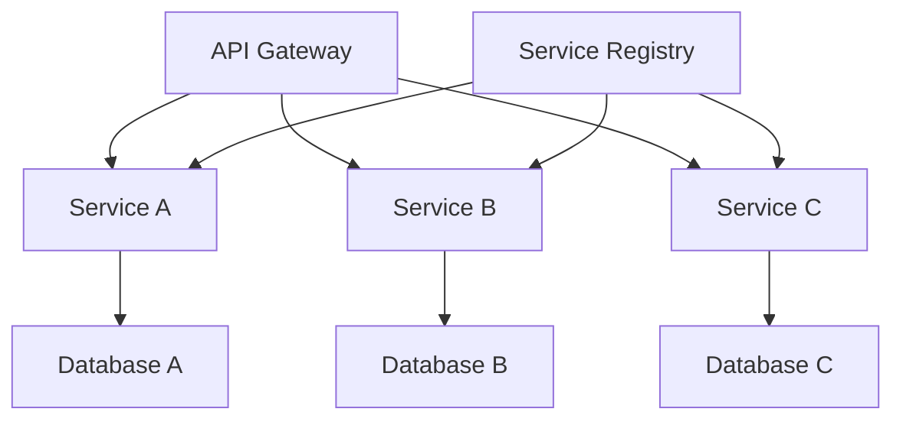

# 微服务

## 1. 什么是微服务

微服务是一种软件架构风格，它将一个大型应用程序拆分成多个小型、独立的服务，每个服务都运行在自己的进程中，并通过轻量级机制（通常是 HTTP API）进行通信。

### 1.1 微服务的核心特征

- **服务独立**：每个服务都是独立的，可以独立开发、部署和扩展
- **技术多样性**：不同服务可以使用不同的技术栈
- **数据自治**：每个服务管理自己的数据
- **去中心化治理**：团队可以自主选择技术栈和工具
- **容错性**：单个服务失败不会影响整个系统

### 1.2 微服务与传统架构对比

- **单体架构**：

  - 所有功能在一个应用中
  - 共享数据库
  - 统一技术栈
  - 集中式部署

- **微服务架构**：
  - 功能分散到多个服务
  - 独立数据库
  - 技术栈灵活
  - 分布式部署

## 2. 微服务的优点

### 2.1 技术优势

- **可扩展性**：

  - 独立扩展各个服务
  - 按需分配资源
  - 更好的性能优化

- **技术灵活性**：

  - 选择最适合的技术栈
  - 更容易采用新技术
  - 降低技术债务

- **容错性**：
  - 服务隔离
  - 故障隔离
  - 优雅降级

### 2.2 业务优势

- **快速迭代**：

  - 独立部署
  - 快速发布
  - 持续交付

- **团队自治**：

  - 小团队负责
  - 独立决策
  - 快速响应

- **可维护性**：
  - 代码库小
  - 职责清晰
  - 易于理解

## 3. 微服务的缺点

### 3.1 技术挑战

- **复杂性**：

  - 分布式系统复杂性
  - 服务间通信
  - 数据一致性
  - 网络延迟

- **运维难度**：

  - 服务监控
  - 日志管理
  - 部署协调
  - 故障排查

- **资源消耗**：
  - 基础设施成本
  - 运维人力
  - 网络开销

### 3.2 组织挑战

- **团队协作**：

  - 跨团队沟通
  - 接口协调
  - 版本管理

- **技能要求**：

  - 分布式系统知识
  - 运维能力
  - 架构设计能力

- **文化转变**：
  - DevOps 文化
  - 团队自治
  - 持续交付

## 4. 微服务的适用场景

### 4.1 适合的场景

- **大型复杂应用**：

  - 功能模块多
  - 团队规模大
  - 需要快速迭代

- **高并发系统**：

  - 需要独立扩展
  - 性能要求高
  - 可用性要求高

- **多技术栈需求**：
  - 不同模块需求不同
  - 需要新技术
  - 技术债务严重

### 4.2 不适合的场景

- **小型应用**：

  - 功能简单
  - 团队规模小
  - 资源有限

- **强一致性要求**：

  - 事务密集型
  - 数据一致性要求高
  - 实时性要求高

- **快速原型开发**：
  - 需要快速验证
  - 需求不稳定
  - 资源有限

## 5. 微服务的架构

### 5.1 核心组件



- **API Gateway**：

  - 统一入口
  - 路由转发
  - 认证授权
  - 限流熔断

- **服务注册与发现**：

  - 服务注册
  - 服务发现
  - 健康检查
  - 负载均衡

- **配置中心**：
  - 配置管理
  - 动态配置
  - 环境隔离
  - 版本控制

### 5.2 通信机制

- **同步通信**：

  - REST API
  - gRPC
  - GraphQL

- **异步通信**：
  - 消息队列
  - 事件总线
  - 发布订阅

### 5.3 数据管理

- **数据库模式**：

  - 每个服务独立数据库
  - 数据库分片
  - 读写分离

- **数据一致性**：
  - 最终一致性
  - 分布式事务
  - 事件溯源

## 6. 微服务的部署

### 6.1 部署策略

- **容器化部署**：

  ```yaml
  # docker-compose.yml
  version: "3"
  services:
    service-a:
      image: service-a:latest
      ports:
        - "8080:8080"
      environment:
        - DB_HOST=db-a
    service-b:
      image: service-b:latest
      ports:
        - "8081:8080"
  ```

- **Kubernetes 部署**：
  ```yaml
  # deployment.yaml
  apiVersion: apps/v1
  kind: Deployment
  metadata:
    name: service-a
  spec:
    replicas: 3
    template:
      spec:
        containers:
          - name: service-a
            image: service-a:latest
            ports:
              - containerPort: 8080
  ```

### 6.2 部署工具

- **容器编排**：

  - Kubernetes
  - Docker Swarm
  - Mesos

- **CI/CD 工具**：
  - Jenkins
  - GitLab CI
  - GitHub Actions

## 7. 微服务的监控

### 7.1 监控指标

- **系统指标**：

  - CPU 使用率
  - 内存使用
  - 磁盘 I/O
  - 网络流量

- **应用指标**：

  - 请求量
  - 响应时间
  - 错误率
  - 并发数

- **业务指标**：
  - 交易量
  - 转化率
  - 用户活跃度
  - 业务异常

### 7.2 监控工具

- **日志收集**：

  - ELK Stack
  - Fluentd
  - Graylog

- **指标监控**：

  - Prometheus
  - Grafana
  - Zabbix

- **链路追踪**：
  - Jaeger
  - Zipkin
  - SkyWalking

## 8. 微服务的总结

### 8.1 成功要素

- **技术准备**：

  - 自动化工具链
  - 监控系统
  - 容器化平台

- **团队能力**：

  - 分布式系统经验
  - DevOps 能力
  - 架构设计能力

- **组织支持**：
  - 管理层支持
  - 资源投入
  - 文化转变

### 8.2 实施建议

1. **渐进式实施**：

   - 从单体开始
   - 逐步拆分
   - 验证效果

2. **基础设施先行**：

   - 自动化部署
   - 监控系统
   - 日志管理

3. **团队培养**：
   - 技术培训
   - 实践指导
   - 经验分享

### 8.3 未来展望

- **服务网格**：

  - 更细粒度的服务治理
  - 更智能的流量管理
  - 更完善的监控能力

- **Serverless**：

  - 更低的运维成本
  - 更灵活的扩展
  - 更快的部署速度

- **AI 运维**：
  - 智能监控
  - 自动扩缩容
  - 预测性维护
