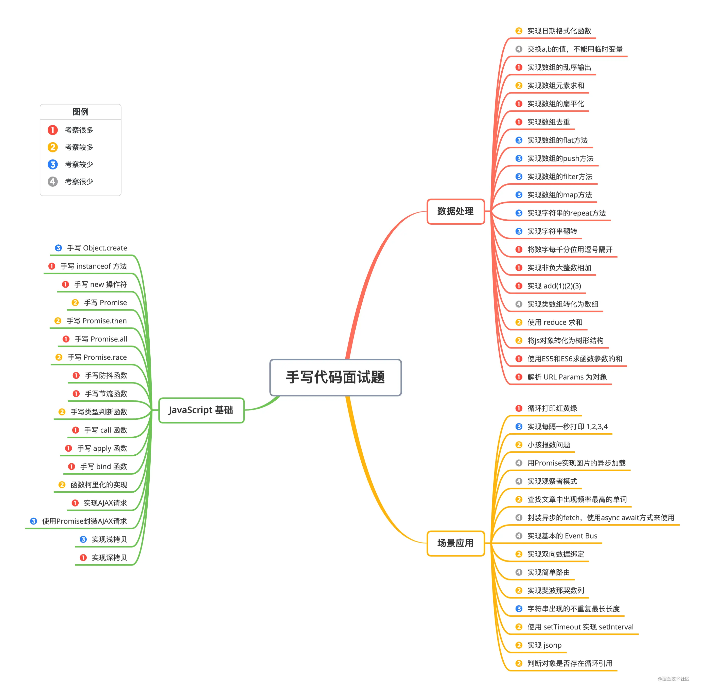

# 手写代码篇




## 一、JavaScript 基础

### 1. 手写 Object.create

思路：将传入的对象作为原型

```javascript
function create(obj) {
  function F() {}
  F.prototype = obj
  return new F()
}

```

### 2. 手写 instanceof 方法

instanceof 运算符用于判断构造函数的 prototype 属性是否出现在对象的原型链中的任何位置。

实现步骤：

1. 首先获取类型的原型
2. 然后获得对象的原型
3. 然后一直循环判断对象的原型是否等于类型的原型，直到对象原型为 `null`，因为原型链最终为 `null`

具体实现：

```javascript
function myInstanceof(left, right) {
  let proto = Object.getPrototypeOf(left), // 获取对象的原型
      prototype = right.prototype; // 获取构造函数的 prototype 对象

  // 判断构造函数的 prototype 对象是否在对象的原型链上
  while (true) {
    if (!proto) return false;
    if (proto === prototype) return true;

    proto = Object.getPrototypeOf(proto);
  }
}

```

### 3. 手写 new 操作符

在调用 `new` 的过程中会发生以上四件事情：

（1）首先创建了一个新的空对象

（2）设置原型，将对象的原型设置为函数的 prototype 对象。

（3）让函数的 this 指向这个对象，执行构造函数的代码（为这个新对象添加属性）

（4）判断函数的返回值类型，如果是值类型，返回创建的对象。如果是引用类型，就返回这个引用类型的对象。

```javascript
function objectFactory() {
  let newObject = null;
  let constructor = Array.prototype.shift.call(arguments);
  let result = null;
  // 判断参数是否是一个函数
  if (typeof constructor !== "function") {
    console.error("type error");
    return;
  }
  // 新建一个空对象，对象的原型为构造函数的 prototype 对象
  newObject = Object.create(constructor.prototype);
  // 将 this 指向新建对象，并执行函数
  result = constructor.apply(newObject, arguments);
  // 判断返回对象
  let flag = result && (typeof result === "object" || typeof result === "function");
  // 判断返回结果
  return flag ? result : newObject;
}
// 使用方法
objectFactory(构造函数, 初始化参数);

```

### 4. 手写 Promise

```javascript
const PENDING = "pending";
const RESOLVED = "resolved";
const REJECTED = "rejected";

function MyPromise(fn) {
  // 保存初始化状态
  var self = this;

  // 初始化状态
  this.state = PENDING;

  // 用于保存 resolve 或者 rejected 传入的值
  this.value = null;

  // 用于保存 resolve 的回调函数
  this.resolvedCallbacks = [];

  // 用于保存 reject 的回调函数
  this.rejectedCallbacks = [];

  // 状态转变为 resolved 方法
  function resolve(value) {
    // 判断传入元素是否为 Promise 值，如果是，则状态改变必须等待前一个状态改变后再进行改变
    if (value instanceof MyPromise) {
      return value.then(resolve, reject);
    }

    // 保证代码的执行顺序为本轮事件循环的末尾
    setTimeout(() => {
      // 只有状态为 pending 时才能转变，
      if (self.state === PENDING) {
        // 修改状态
        self.state = RESOLVED;

        // 设置传入的值
        self.value = value;

        // 执行回调函数
        self.resolvedCallbacks.forEach(callback => {
          callback(value);
        });
      }
    }, 0);
  }

  // 状态转变为 rejected 方法
  function reject(value) {
    // 保证代码的执行顺序为本轮事件循环的末尾
    setTimeout(() => {
      // 只有状态为 pending 时才能转变
      if (self.state === PENDING) {
        // 修改状态
        self.state = REJECTED;

        // 设置传入的值
        self.value = value;

        // 执行回调函数
        self.rejectedCallbacks.forEach(callback => {
          callback(value);
        });
      }
    }, 0);
  }

  // 将两个方法传入函数执行
  try {
    fn(resolve, reject);
  } catch (e) {
    // 遇到错误时，捕获错误，执行 reject 函数
    reject(e);
  }
}

MyPromise.prototype.then = function(onResolved, onRejected) {
  // 首先判断两个参数是否为函数类型，因为这两个参数是可选参数
  onResolved =
    typeof onResolved === "function"
      ? onResolved
      : function(value) {
          return value;
        };

  onRejected =
    typeof onRejected === "function"
      ? onRejected
      : function(error) {
          throw error;
        };

  // 如果是等待状态，则将函数加入对应列表中
  if (this.state === PENDING) {
    this.resolvedCallbacks.push(onResolved);
    this.rejectedCallbacks.push(onRejected);
  }

  // 如果状态已经凝固，则直接执行对应状态的函数

  if (this.state === RESOLVED) {
    onResolved(this.value);
  }

  if (this.state === REJECTED) {
    onRejected(this.value);
  }
};

```

### 5. 手写 Promise.then

`then` 方法返回一个新的 `promise` 实例，为了在 `promise` 状态发生变化时（`resolve` / `reject` 被调用时）再执行 `then` 里的函数，我们使用一个 `callbacks` 数组先把传给then的函数暂存起来，等状态改变时再调用。

**那么，怎么保证后一个 \**`\*\*then\*\*`\** 里的方法在前一个 \**`\*\*then\*\*`\**（可能是异步）结束之后再执行呢？** 我们可以将传给 `then` 的函数和新 `promise` 的 `resolve` 一起 `push` 到前一个 `promise` 的 `callbacks` 数组中，达到承前启后的效果：

- 承前：当前一个 `promise` 完成后，调用其 `resolve` 变更状态，在这个 `resolve` 里会依次调用 `callbacks` 里的回调，这样就执行了 `then` 里的方法了
- 启后：上一步中，当 `then` 里的方法执行完成后，返回一个结果，如果这个结果是个简单的值，就直接调用新 `promise` 的 `resolve`，让其状态变更，这又会依次调用新 `promise` 的 `callbacks` 数组里的方法，循环往复。。如果返回的结果是个 `promise`，则需要等它完成之后再触发新 `promise` 的 `resolve`，所以可以在其结果的 `then` 里调用新 `promise` 的 `resolve`

```javascript
then(onFulfilled, onReject){
    // 保存前一个promise的this
    const self = this; 
    return new MyPromise((resolve, reject) => {
      // 封装前一个promise成功时执行的函数
      let fulfilled = () => {
        try{
          const result = onFulfilled(self.value); // 承前
          return result instanceof MyPromise? result.then(resolve, reject) : resolve(result); //启后
        }catch(err){
          reject(err)
        }
      }
      // 封装前一个promise失败时执行的函数
      let rejected = () => {
        try{
          const result = onReject(self.reason);
          return result instanceof MyPromise? result.then(resolve, reject) : reject(result);
        }catch(err){
          reject(err)
        }
      }
      switch(self.status){
        case PENDING: 
          self.onFulfilledCallbacks.push(fulfilled);
          self.onRejectedCallbacks.push(rejected);
          break;
        case FULFILLED:
          fulfilled();
          break;
        case REJECT:
          rejected();
          break;
      }
    })
   }

```

**注意：**

- 连续多个 `then` 里的回调方法是同步注册的，但注册到了不同的 `callbacks` 数组中，因为每次 `then` 都返回新的 `promise` 实例（参考上面的例子和图）
- 注册完成后开始执行构造函数中的异步事件，异步完成之后依次调用 `callbacks` 数组中提前注册的回调

### 6. 手写 Promise.all

**1) 核心思路**

1. 接收一个 Promise 实例的数组或具有 Iterator 接口的对象作为参数
2. 这个方法返回一个新的 promise 对象，
3. 遍历传入的参数，用Promise.resolve()将参数"包一层"，使其变成一个promise对象
4. 参数所有回调成功才是成功，返回值数组与参数顺序一致
5. 参数数组其中一个失败，则触发失败状态，第一个触发失败的 Promise 错误信息作为 Promise.all 的错误信息。

**2）实现代码**

一般来说，Promise.all 用来处理多个并发请求，也是为了页面数据构造的方便，将一个页面所用到的在不同接口的数据一起请求过来，不过，如果其中一个接口失败了，多个请求也就失败了，页面可能啥也出不来，这就看当前页面的耦合程度了

```javascript
function promiseAll(promises) {
  return new Promise(function(resolve, reject) {
    if(!Array.isArray(promises)){
        throw new TypeError(`argument must be a array`)
    }
    var resolvedCounter = 0;
    var promiseNum = promises.length;
    var resolvedResult = [];
    for (let i = 0; i < promiseNum; i++) {
      Promise.resolve(promises[i]).then(value=>{
        resolvedCounter++;
        resolvedResult[i] = value;
        if (resolvedCounter == promiseNum) {
            return resolve(resolvedResult)
          }
      },error=>{
        return reject(error)
      })
    }
  })
}
// test
let p1 = new Promise(function (resolve, reject) {
    setTimeout(function () {
        resolve(1)
    }, 1000)
})
let p2 = new Promise(function (resolve, reject) {
    setTimeout(function () {
        resolve(2)
    }, 2000)
})
let p3 = new Promise(function (resolve, reject) {
    setTimeout(function () {
        resolve(3)
    }, 3000)
})
promiseAll([p3, p1, p2]).then(res => {
    console.log(res) // [3, 1, 2]
})

```

### 7. 手写 Promise.race

该方法的参数是 Promise 实例数组, 然后其 then 注册的回调方法是数组中的某一个 Promise 的状态变为 fulfilled 的时候就执行. 因为 Promise 的状态**只能改变一次**, 那么我们只需要把 Promise.race 中产生的 Promise 对象的 resolve 方法, 注入到数组中的每一个 Promise 实例中的回调函数中即可.

```javascript
Promise.race = function (args) {
  return new Promise((resolve, reject) => {
    for (let i = 0, len = args.length; i < len; i++) {
      args[i].then(resolve, reject)
    }
  })
}

```

### 8. 手写防抖函数

函数防抖是指在事件被触发 n 秒后再执行回调，如果在这 n 秒内事件又被触发，则重新计时。这可以使用在一些点击请求的事件上，避免因为用户的多次点击向后端发送多次请求。

```javascript
// 函数防抖的实现
function debounce(fn, wait) {
  let timer = null;

  return function() {
    let context = this,
        args = arguments;

    // 如果此时存在定时器的话，则取消之前的定时器重新记时
    if (timer) {
      clearTimeout(timer);
      timer = null;
    }

    // 设置定时器，使事件间隔指定事件后执行
    timer = setTimeout(() => {
      fn.apply(context, args);
    }, wait);
  };
}

```

### 9. 手写节流函数

函数节流是指规定一个单位时间，在这个单位时间内，只能有一次触发事件的回调函数执行，如果在同一个单位时间内某事件被触发多次，只有一次能生效。节流可以使用在 scroll 函数的事件监听上，通过事件节流来降低事件调用的频率。

```javascript
// 函数节流的实现;
function throttle(fn, delay) {
  let curTime = Date.now();

  return function() {
    let context = this,
        args = arguments,
        nowTime = Date.now();

    // 如果两次时间间隔超过了指定时间，则执行函数。
    if (nowTime - curTime >= delay) {
      curTime = Date.now();
      return fn.apply(context, args);
    }
  };
}

```

### 10. 手写类型判断函数

```javascript
function getType(value) {
  // 判断数据是 null 的情况
  if (value === null) {
    return value + "";
  }
  // 判断数据是引用类型的情况
  if (typeof value === "object") {
    let valueClass = Object.prototype.toString.call(value),
      type = valueClass.split(" ")[1].split("");
    type.pop();
    return type.join("").toLowerCase();
  } else {
    // 判断数据是基本数据类型的情况和函数的情况
    return typeof value;
  }
}

```

### 11. 手写 call 函数

call 函数的实现步骤：

1. 判断调用对象是否为函数，即使我们是定义在函数的原型上的，但是可能出现使用 call 等方式调用的情况。
2. 判断传入上下文对象是否存在，如果不存在，则设置为 window 。
3. 处理传入的参数，截取第一个参数后的所有参数。
4. 将函数作为上下文对象的一个属性。
5. 使用上下文对象来调用这个方法，并保存返回结果。
6. 删除刚才新增的属性。
7. 返回结果。

```javascript
// call函数实现
Function.prototype.myCall = function(context) {
  // 判断调用对象
  if (typeof this !== "function") {
    console.error("type error");
  }
  // 获取参数
  let args = [...arguments].slice(1),
      result = null;
  // 判断 context 是否传入，如果未传入则设置为 window
  context = context || window;
  // 将调用函数设为对象的方法
  context.fn = this;
  // 调用函数
  result = context.fn(...args);
  // 将属性删除
  delete context.fn;
  return result;
};

```

### 12. 手写 apply 函数

apply 函数的实现步骤：

1. 判断调用对象是否为函数，即使我们是定义在函数的原型上的，但是可能出现使用 call 等方式调用的情况。
2. 判断传入上下文对象是否存在，如果不存在，则设置为 window 。
3. 将函数作为上下文对象的一个属性。
4. 判断参数值是否传入
5. 使用上下文对象来调用这个方法，并保存返回结果。
6. 删除刚才新增的属性
7. 返回结果

```javascript
// apply 函数实现
Function.prototype.myApply = function(context) {
  // 判断调用对象是否为函数
  if (typeof this !== "function") {
    throw new TypeError("Error");
  }
  let result = null;
  // 判断 context 是否存在，如果未传入则为 window
  context = context || window;
  // 将函数设为对象的方法
  context.fn = this;
  // 调用方法
  if (arguments[1]) {
    result = context.fn(...arguments[1]);
  } else {
    result = context.fn();
  }
  // 将属性删除
  delete context.fn;
  return result;
};

```

### 13. 手写 bind 函数

bind 函数的实现步骤：

1. 判断调用对象是否为函数，即使我们是定义在函数的原型上的，但是可能出现使用 call 等方式调用的情况。
2. 保存当前函数的引用，获取其余传入参数值。
3. 创建一个函数返回
4. 函数内部使用 apply 来绑定函数调用，需要判断函数作为构造函数的情况，这个时候需要传入当前函数的 this 给 apply 调用，其余情况都传入指定的上下文对象。

```javascript
// bind 函数实现
Function.prototype.myBind = function(context) {
  // 判断调用对象是否为函数
  if (typeof this !== "function") {
    throw new TypeError("Error");
  }
  // 获取参数
  var args = [...arguments].slice(1),
      fn = this;
  return function Fn() {
    // 根据调用方式，传入不同绑定值
    return fn.apply(
      this instanceof Fn ? this : context,
      args.concat(...arguments)
    );
  };
};

```

### 14. 函数柯里化的实现

函数柯里化指的是一种将使用多个参数的一个函数转换成一系列使用一个参数的函数的技术。

```javascript
function curry(fn, args) {
  // 获取函数需要的参数长度
  let length = fn.length;

  args = args || [];

  return function() {
    let subArgs = args.slice(0);

    // 拼接得到现有的所有参数
    for (let i = 0; i < arguments.length; i++) {
      subArgs.push(arguments[i]);
    }

    // 判断参数的长度是否已经满足函数所需参数的长度
    if (subArgs.length >= length) {
      // 如果满足，执行函数
      return fn.apply(this, subArgs);
    } else {
      // 如果不满足，递归返回科里化的函数，等待参数的传入
      return curry.call(this, fn, subArgs);
    }
  };
}

// es6 实现
function curry(fn, ...args) {
  return fn.length <= args.length ? fn(...args) : curry.bind(null, fn, ...args);
}

```

### 15. 实现AJAX请求

AJAX是 Asynchronous JavaScript and XML 的缩写，指的是通过 JavaScript 的 异步通信，从服务器获取 XML 文档从中提取数据，再更新当前网页的对应部分，而不用刷新整个网页。

创建AJAX请求的步骤：

- **创建一个 XMLHttpRequest 对象。**
- 在这个对象上**使用 open 方法创建一个 HTTP 请求**，open 方法所需要的参数是请求的方法、请求的地址、是否异步和用户的认证信息。
- 在发起请求前，可以为这个对象**添加一些信息和监听函数**。比如说可以通过 setRequestHeader 方法来为请求添加头信息。还可以为这个对象添加一个状态监听函数。一个 XMLHttpRequest 对象一共有 5 个状态，当它的状态变化时会触发onreadystatechange 事件，可以通过设置监听函数，来处理请求成功后的结果。当对象的 readyState 变为 4 的时候，代表服务器返回的数据接收完成，这个时候可以通过判断请求的状态，如果状态是 2xx 或者 304 的话则代表返回正常。这个时候就可以通过 response 中的数据来对页面进行更新了。
- 当对象的属性和监听函数设置完成后，最后调**用 sent 方法来向服务器发起请求**，可以传入参数作为发送的数据体。

```javascript
const SERVER_URL = "/server";
let xhr = new XMLHttpRequest();
// 创建 Http 请求
xhr.open("GET", SERVER_URL, true);
// 设置状态监听函数
xhr.onreadystatechange = function() {
  if (this.readyState !== 4) return;
  // 当请求成功时
  if (this.status === 200) {
    handle(this.response);
  } else {
    console.error(this.statusText);
  }
};
// 设置请求失败时的监听函数
xhr.onerror = function() {
  console.error(this.statusText);
};
// 设置请求头信息
xhr.responseType = "json";
xhr.setRequestHeader("Accept", "application/json");
// 发送 Http 请求
xhr.send(null);

```

### 16. 使用Promise封装AJAX请求

```javascript
// promise 封装实现：
function getJSON(url) {
  // 创建一个 promise 对象
  let promise = new Promise(function(resolve, reject) {
    let xhr = new XMLHttpRequest();
    // 新建一个 http 请求
    xhr.open("GET", url, true);
    // 设置状态的监听函数
    xhr.onreadystatechange = function() {
      if (this.readyState !== 4) return;
      // 当请求成功或失败时，改变 promise 的状态
      if (this.status === 200) {
        resolve(this.response);
      } else {
        reject(new Error(this.statusText));
      }
    };
    // 设置错误监听函数
    xhr.onerror = function() {
      reject(new Error(this.statusText));
    };
    // 设置响应的数据类型
    xhr.responseType = "json";
    // 设置请求头信息
    xhr.setRequestHeader("Accept", "application/json");
    // 发送 http 请求
    xhr.send(null);
  });
  return promise;
}

```

### 17. 实现浅拷贝

浅拷贝是指，一个新的对象对原始对象的属性值进行精确地拷贝，如果拷贝的是基本数据类型，拷贝的就是基本数据类型的值，如果是引用数据类型，拷贝的就是内存地址。如果其中一个对象的引用内存地址发生改变，另一个对象也会发生变化。

#### （1）Object.assign()

`Object.assign()`是ES6中对象的拷贝方法，接受的第一个参数是目标对象，其余参数是源对象，用法：`Object.assign(target, source_1, ···)`，该方法可以实现浅拷贝，也可以实现一维对象的深拷贝。

**注意：**

- 如果目标对象和源对象有同名属性，或者多个源对象有同名属性，则后面的属性会覆盖前面的属性。
- 如果该函数只有一个参数，当参数为对象时，直接返回该对象；当参数不是对象时，会先将参数转为对象然后返回。
- 因为`null` 和 `undefined` 不能转化为对象，所以第一个参数不能为`null`或 `undefined`，会报错。

```javascript
let target = {a: 1};
let object2 = {b: 2};
let object3 = {c: 3};
Object.assign(target,object2,object3);  
console.log(target);  // {a: 1, b: 2, c: 3}

```

#### （2）扩展运算符

使用扩展运算符可以在构造字面量对象的时候，进行属性的拷贝。语法：`let cloneObj = { ...obj };`

```javascript
let obj1 = {a:1,b:{c:1}}
let obj2 = {...obj1};
obj1.a = 2;
console.log(obj1); //{a:2,b:{c:1}}
console.log(obj2); //{a:1,b:{c:1}}
obj1.b.c = 2;
console.log(obj1); //{a:2,b:{c:2}}
console.log(obj2); //{a:1,b:{c:2}}

```

#### （3）数组方法实现数组浅拷贝

###### **1）Array.prototype.slice**

- `slice()`方法是JavaScript数组的一个方法，这个方法可以从已有数组中返回选定的元素：用法：`array.slice(start, end)`，该方法不会改变原始数组。
- 该方法有两个参数，两个参数都可选，如果两个参数都不写，就可以实现一个数组的浅拷贝。

```javascript
let arr = [1,2,3,4];
console.log(arr.slice()); // [1,2,3,4]
console.log(arr.slice() === arr); //false

```

###### **2）Array.prototype.concat**

- `concat()` 方法用于合并两个或多个数组。此方法不会更改现有数组，而是返回一个新数组。
- 该方法有两个参数，两个参数都可选，如果两个参数都不写，就可以实现一个数组的浅拷贝。

```javascript
let arr = [1,2,3,4];
console.log(arr.concat()); // [1,2,3,4]
console.log(arr.concat() === arr); //false

```

#### （4）手写实现浅拷贝

```javascript
// 浅拷贝的实现;

function shallowCopy(object) {
  // 只拷贝对象
  if (!object || typeof object !== "object") return;

  // 根据 object 的类型判断是新建一个数组还是对象
  let newObject = Array.isArray(object) ? [] : {};

  // 遍历 object，并且判断是 object 的属性才拷贝
  for (let key in object) {
    if (object.hasOwnProperty(key)) {
      newObject[key] = object[key];
    }
  }

  return newObject;
}// 浅拷贝的实现;

function shallowCopy(object) {
  // 只拷贝对象
  if (!object || typeof object !== "object") return;

  // 根据 object 的类型判断是新建一个数组还是对象
  let newObject = Array.isArray(object) ? [] : {};

  // 遍历 object，并且判断是 object 的属性才拷贝
  for (let key in object) {
    if (object.hasOwnProperty(key)) {
      newObject[key] = object[key];
    }
  }

  return newObject;
}// 浅拷贝的实现;
function shallowCopy(object) {
  // 只拷贝对象
  if (!object || typeof object !== "object") return;
  // 根据 object 的类型判断是新建一个数组还是对象
  let newObject = Array.isArray(object) ? [] : {};
  // 遍历 object，并且判断是 object 的属性才拷贝
  for (let key in object) {
    if (object.hasOwnProperty(key)) {
      newObject[key] = object[key];
    }
  }
  return newObject;
}

```

### 18. 实现深拷贝

- **浅拷贝：** 浅拷贝指的是将一个对象的属性值复制到另一个对象，如果有的属性的值为引用类型的话，那么会将这个引用的地址复制给对象，因此两个对象会有同一个引用类型的引用。浅拷贝可以使用  Object.assign 和展开运算符来实现。
- **深拷贝：** 深拷贝相对浅拷贝而言，如果遇到属性值为引用类型的时候，它新建一个引用类型并将对应的值复制给它，因此对象获得的一个新的引用类型而不是一个原有类型的引用。深拷贝对于一些对象可以使用 JSON 的两个函数来实现，但是由于 JSON 的对象格式比 js 的对象格式更加严格，所以如果属性值里边出现函数或者 Symbol 类型的值时，会转换失败

#### （1）JSON.stringify()

- `JSON.parse(JSON.stringify(obj))`是目前比较常用的深拷贝方法之一，它的原理就是利用`JSON.stringify` 将`js`对象序列化（JSON字符串），再使用`JSON.parse`来反序列化(还原)`js`对象。
- 这个方法可以简单粗暴的实现深拷贝，但是还存在问题，拷贝的对象中如果有函数，undefined，symbol，当使用过`JSON.stringify()`进行处理之后，都会消失。

```javascript
let obj1 = {  a: 0,
              b: {
                 c: 0
                 }
            };
let obj2 = JSON.parse(JSON.stringify(obj1));
obj1.a = 1;
obj1.b.c = 1;
console.log(obj1); // {a: 1, b: {c: 1}}
console.log(obj2); // {a: 0, b: {c: 0}}

```

#### （2）函数库lodash的_.cloneDeep方法

该函数库也有提供_.cloneDeep用来做 Deep Copy

```javascript
var _ = require('lodash');
var obj1 = {
    a: 1,
    b: { f: { g: 1 } },
    c: [1, 2, 3]
};
var obj2 = _.cloneDeep(obj1);
console.log(obj1.b.f === obj2.b.f);// false

```

#### （3）手写实现深拷贝函数

```javascript
// 深拷贝的实现
function deepCopy(object) {
  if (!object || typeof object !== "object") return;

  let newObject = Array.isArray(object) ? [] : {};

  for (let key in object) {
    if (object.hasOwnProperty(key)) {
      newObject[key] =
        typeof object[key] === "object" ? deepCopy(object[key]) : object[key];
    }
  }

  return newObject;
}

```

## 二、数据处理

### 1. 实现日期格式化函数

输入：

```javascript
dateFormat(new Date('2020-12-01'), 'yyyy/MM/dd') // 2020/12/01
dateFormat(new Date('2020-04-01'), 'yyyy/MM/dd') // 2020/04/01
dateFormat(new Date('2020-04-01'), 'yyyy年MM月dd日') // 2020年04月01日

const dateFormat = (dateInput, format)=>{
    var day = dateInput.getDate() 
    var month = dateInput.getMonth() + 1  
    var year = dateInput.getFullYear()   
    format = format.replace(/yyyy/, year)
    format = format.replace(/MM/,month)
    format = format.replace(/dd/,day)
    return format
}

```

### 2. 交换a,b的值，不能用临时变量

巧妙的利用两个数的和、差：

```javascript
a = a + b
b = a - b
a = a - b

```

### 3. 实现数组的乱序输出

主要的实现思路就是：

- 取出数组的第一个元素，随机产生一个索引值，将该第一个元素和这个索引对应的元素进行交换。
- 第二次取出数据数组第二个元素，随机产生一个除了索引为1的之外的索引值，并将第二个元素与该索引值对应的元素进行交换
- 按照上面的规律执行，直到遍历完成

```javascript
var arr = [1,2,3,4,5,6,7,8,9,10];
for (var i = 0; i < arr.length; i++) {
  const randomIndex = Math.round(Math.random() * (arr.length - 1 - i)) + i;
  [arr[i], arr[randomIndex]] = [arr[randomIndex], arr[i]];
}
console.log(arr)

```

还有一方法就是倒序遍历：

```javascript
var arr = [1,2,3,4,5,6,7,8,9,10];
let length = arr.length,
    randomIndex,
    temp;
  while (length) {
    randomIndex = Math.floor(Math.random() * length--);
    temp = arr[length];
    arr[length] = arr[randomIndex];
    arr[randomIndex] = temp;
  }
console.log(arr)

```

### 4. 实现数组元素求和

- arr=[1,2,3,4,5,6,7,8,9,10]，求和

```javascript
let arr=[1,2,3,4,5,6,7,8,9,10]
let sum = arr.reduce( (total,i) => total += i,0);
console.log(sum);

```

- arr=[1,2,3,[[4,5],6],7,8,9]，求和

```javascript
var = arr=[1,2,3,[[4,5],6],7,8,9]
let arr= arr.toString().split(',').reduce( (total,i) => total += Number(i),0);
console.log(arr);

```

递归实现：

```javascript
let arr = [1, 2, 3, 4, 5, 6] 

function add(arr) {
    if (arr.length == 1) return arr[0] 
    return arr[0] + add(arr.slice(1)) 
}
console.log(add(arr)) // 21

```

### 5. 实现数组的扁平化

**（1）递归实现**

普通的递归思路很容易理解，就是通过循环递归的方式，一项一项地去遍历，如果每一项还是一个数组，那么就继续往下遍历，利用递归程序的方法，来实现数组的每一项的连接：

```javascript
let arr = [1, [2, [3, 4, 5]]];
function flatten(arr) {
  let result = [];

  for(let i = 0; i < arr.length; i++) {
    if(Array.isArray(arr[i])) {
      result = result.concat(flatten(arr[i]));
    } else {
      result.push(arr[i]);
    }
  }
  return result;
}
flatten(arr);  //  [1, 2, 3, 4，5]

```

**（2）reduce 函数迭代**

从上面普通的递归函数中可以看出，其实就是对数组的每一项进行处理，那么其实也可以用reduce 来实现数组的拼接，从而简化第一种方法的代码，改造后的代码如下所示：

```javascript
let arr = [1, [2, [3, 4]]];
function flatten(arr) {
    return arr.reduce(function(prev, next){
        return prev.concat(Array.isArray(next) ? flatten(next) : next)
    }, [])
}
console.log(flatten(arr));//  [1, 2, 3, 4，5]

```

**（3）扩展运算符实现**

这个方法的实现，采用了扩展运算符和 some 的方法，两者共同使用，达到数组扁平化的目的：

```javascript
let arr = [1, [2, [3, 4]]];
function flatten(arr) {
    while (arr.some(item => Array.isArray(item))) {
        arr = [].concat(...arr);
    }
    return arr;
}
console.log(flatten(arr)); //  [1, 2, 3, 4，5]

```

**（4）split 和 toString**

可以通过 split 和 toString 两个方法来共同实现数组扁平化，由于数组会默认带一个 toString 的方法，所以可以把数组直接转换成逗号分隔的字符串，然后再用 split 方法把字符串重新转换为数组，如下面的代码所示：

```javascript
let arr = [1, [2, [3, 4]]];
function flatten(arr) {
    return arr.toString().split(',');
}
console.log(flatten(arr)); //  [1, 2, 3, 4，5]

```

通过这两个方法可以将多维数组直接转换成逗号连接的字符串，然后再重新分隔成数组。

**（5）ES6 中的 flat**

我们还可以直接调用 ES6 中的 flat 方法来实现数组扁平化。flat 方法的语法：`arr.flat([depth])`

其中 depth 是 flat 的参数，depth 是可以传递数组的展开深度（默认不填、数值是 1），即展开一层数组。如果层数不确定，参数可以传进 Infinity，代表不论多少层都要展开：

```javascript
let arr = [1, [2, [3, 4]]];
function flatten(arr) {
  return arr.flat(Infinity);
}
console.log(flatten(arr)); //  [1, 2, 3, 4，5]

```

可以看出，一个嵌套了两层的数组，通过将 flat 方法的参数设置为 Infinity，达到了我们预期的效果。其实同样也可以设置成 2，也能实现这样的效果。在编程过程中，如果数组的嵌套层数不确定，最好直接使用 Infinity，可以达到扁平化。 **（6）正则和 JSON 方法** 在第4种方法中已经使用 toString 方法，其中仍然采用了将 JSON.stringify 的方法先转换为字符串，然后通过正则表达式过滤掉字符串中的数组的方括号，最后再利用 JSON.parse 把它转换成数组：

```javascript
let arr = [1, [2, [3, [4, 5]]], 6];
function flatten(arr) {
  let str = JSON.stringify(arr);
  str = str.replace(/(\[|\])/g, '');
  str = '[' + str + ']';
  return JSON.parse(str); 
}
console.log(flatten(arr)); //  [1, 2, 3, 4，5]

```

### 6. 实现数组去重

给定某无序数组，要求去除数组中的重复数字并且返回新的无重复数组。

ES6方法（使用数据结构集合）：

```javascript
const array = [1, 2, 3, 5, 1, 5, 9, 1, 2, 8];

Array.from(new Set(array)); // [1, 2, 3, 5, 9, 8]

```

ES5方法：使用map存储不重复的数字

```javascript
const array = [1, 2, 3, 5, 1, 5, 9, 1, 2, 8];

uniqueArray(array); // [1, 2, 3, 5, 9, 8]

function uniqueArray(array) {
  let map = {};
  let res = [];
  for(var i = 0; i < array.length; i++) {
    if(!map.hasOwnProperty([array[i]])) {
      map[array[i]] = 1;
      res.push(array[i]);
    }
  }
  return res;
}

```

### 7. 实现数组的flat方法

```javascript
function _flat(arr, depth) {
  if(!Array.isArray(arr) || depth <= 0) {
    return arr;
  }
  return arr.reduce((prev, cur) => {
    if (Array.isArray(cur)) {
      return prev.concat(_flat(cur, depth - 1))
    } else {
      return prev.concat(cur);
    }
  }, []);
}

```

### 8. 实现数组的push方法

```javascript
let arr = [];
Array.prototype.push = function() {
    for( let i = 0 ; i < arguments.length ; i++){
        this[this.length] = arguments[i] ;
    }
    return this.length;
}

```

### 9. 实现数组的filter方法

```javascript
Array.prototype._filter = function(fn) {
    if (typeof fn !== "function") {
        throw Error('参数必须是一个函数');
    }
    const res = [];
    for (let i = 0, len = this.length; i < len; i++) {
        fn(this[i]) && res.push(this[i]);
    }
    return res;
}

```

### 10. 实现数组的map方法

```javascript
Array.prototype._map = function(fn) {
   if (typeof fn !== "function") {
        throw Error('参数必须是一个函数');
    }
    const res = [];
    for (let i = 0, len = this.length; i < len; i++) {
        res.push(fn(this[i]));
    }
    return res;
}

```

### 11. 实现字符串的repeat方法

输入字符串s，以及其重复的次数，输出重复的结果，例如输入abc，2，输出abcabc。

```javascript
function repeat(s, n) {
    return (new Array(n + 1)).join(s);
}

```

递归：

```javascript
function repeat(s, n) {
    return (n > 0) ? s.concat(repeat(s, --n)) : "";
}

```

### 12. 实现字符串翻转

在字符串的原型链上添加一个方法，实现字符串翻转：

```javascript
String.prototype._reverse = function(a){
    return a.split("").reverse().join("");
}
var obj = new String();
var res = obj._reverse ('hello');
console.log(res);    // olleh

```

需要注意的是，必须通过实例化对象之后再去调用定义的方法，不然找不到该方法。

### 13. 将数字每千分位用逗号隔开

**数字有小数版本：**

```javascript
let format = n => {
    let num = n.toString() // 转成字符串
    let decimals = ''
        // 判断是否有小数
    num.indexOf('.') > -1 ? decimals = num.split('.')[1] : decimals
    let len = num.length
    if (len <= 3) {
        return num
    } else {
        let temp = ''
        let remainder = len % 3
        decimals ? temp = '.' + decimals : temp
        if (remainder > 0) { // 不是3的整数倍
            return num.slice(0, remainder) + ',' + num.slice(remainder, len).match(/\d{3}/g).join(',') + temp
        } else { // 是3的整数倍
            return num.slice(0, len).match(/\d{3}/g).join(',') + temp 
        }
    }
}
format(12323.33)  // '12,323.33'

```

**数字无小数版本：**

```javascript
let format = n => {
    let num = n.toString() 
    let len = num.length
    if (len <= 3) {
        return num
    } else {
        let remainder = len % 3
        if (remainder > 0) { // 不是3的整数倍
            return num.slice(0, remainder) + ',' + num.slice(remainder, len).match(/\d{3}/g).join(',') 
        } else { // 是3的整数倍
            return num.slice(0, len).match(/\d{3}/g).join(',') 
        }
    }
}
format(1232323)  // '1,232,323'

```

### 14. 实现非负大整数相加

JavaScript对数值有范围的限制，限制如下：

```javascript
Number.MAX_VALUE // 1.7976931348623157e+308
Number.MAX_SAFE_INTEGER // 9007199254740991
Number.MIN_VALUE // 5e-324
Number.MIN_SAFE_INTEGER // -9007199254740991

```

如果想要对一个超大的整数(`> Number.MAX_SAFE_INTEGER`)进行加法运算，但是又想输出一般形式，那么使用 + 是无法达到的，一旦数字超过 `Number.MAX_SAFE_INTEGER` 数字会被立即转换为科学计数法，并且数字精度相比以前将会有误差。

实现一个算法进行大数的相加：

```javascript
function sumBigNumber(a, b) {
  let res = '';
  let temp = 0;
  
  a = a.split('');
  b = b.split('');
  
  while (a.length || b.length || temp) {
    temp += ~~a.pop() + ~~b.pop();
    res = (temp % 10) + res;
    temp  = temp > 9
  }
  return res.replace(/^0+/, '');
}

```

其主要的思路如下：

- 首先用字符串的方式来保存大数，这样数字在数学表示上就不会发生变化
- 初始化res，temp来保存中间的计算结果，并将两个字符串转化为数组，以便进行每一位的加法运算
- 将两个数组的对应的位进行相加，两个数相加的结果可能大于10，所以可能要仅为，对10进行取余操作，将结果保存在当前位
- 判断当前位是否大于9，也就是是否会进位，若是则将temp赋值为true，因为在加法运算中，true会自动隐式转化为1，以便于下一次相加
- 重复上述操作，直至计算结束

### 13. 实现 add(1)(2)(3)

函数柯里化概念： 柯里化（Currying）是把接受多个参数的函数转变为接受一个单一参数的函数，并且返回接受余下的参数且返回结果的新函数的技术。

1）粗暴版

```javascript
function add (a) {
return function (b) {
    return function (c) {
      return a + b + c;
    }
}
}
console.log(add(1)(2)(3)); // 6

```

2）柯里化解决方案

- 参数长度固定

```javascript
var add = function (m) {
  var temp = function (n) {
    return add(m + n);
  }
  temp.toString = function () {
    return m;
  }
  return temp;
};
console.log(add(3)(4)(5)); // 12
console.log(add(3)(6)(9)(25)); // 43

```

对于add(3)(4)(5)，其执行过程如下：

1. 先执行add(3)，此时m=3，并且返回temp函数；
2. 执行temp(4)，这个函数内执行add(m+n)，n是此次传进来的数值4，m值还是上一步中的3，所以add(m+n)=add(3+4)=add(7)，此时m=7，并且返回temp函数
3. 执行temp(5)，这个函数内执行add(m+n)，n是此次传进来的数值5，m值还是上一步中的7，所以add(m+n)=add(7+5)=add(12)，此时m=12，并且返回temp函数
4. 由于后面没有传入参数，等于返回的temp函数不被执行而是打印，了解JS的朋友都知道对象的toString是修改对象转换字符串的方法，因此代码中temp函数的toString函数return m值，而m值是最后一步执行函数时的值m=12，所以返回值是12。

- 参数长度不固定

```javascript
function add (...args) {
    //求和
    return args.reduce((a, b) => a + b)
}
function currying (fn) {
    let args = []
    return function temp (...newArgs) {
        if (newArgs.length) {
            args = [
                ...args,
                ...newArgs
            ]
            return temp
        } else {
            let val = fn.apply(this, args)
            args = [] //保证再次调用时清空
            return val
        }
    }
}
let addCurry = currying(add)
console.log(addCurry(1)(2)(3)(4, 5)())  //15
console.log(addCurry(1)(2)(3, 4, 5)())  //15
console.log(addCurry(1)(2, 3, 4, 5)())  //15

```

### 14. 实现类数组转化为数组

类数组转换为数组的方法有这样几种：

- 通过 call 调用数组的 slice 方法来实现转换

```javascript
Array.prototype.slice.call(arrayLike);

```

- 通过 call 调用数组的 splice 方法来实现转换

```javascript
Array.prototype.splice.call(arrayLike, 0);

```

- 通过 apply 调用数组的 concat 方法来实现转换

```javascript
Array.prototype.concat.apply([], arrayLike);

```

- 通过 Array.from 方法来实现转换

```javascript
Array.from(arrayLike);

```

### 15. 使用 reduce 求和

arr = [1,2,3,4,5,6,7,8,9,10]，求和

```javascript
let arr = [1,2,3,4,5,6,7,8,9,10]
arr.reduce((prev, cur) => { return prev + cur }, 0)

```

arr = [1,2,3,[[4,5],6],7,8,9]，求和

```javascript
let arr = [1,2,3,4,5,6,7,8,9,10]
arr.flat(Infinity).reduce((prev, cur) => { return prev + cur }, 0)

```

arr = [{a:1, b:3}, {a:2, b:3, c:4}, {a:3}]，求和

```javascript
let arr = [{a:9, b:3, c:4}, {a:1, b:3}, {a:3}] 

arr.reduce((prev, cur) => {
    return prev + cur["a"];
}, 0)

```

### 16. 将js对象转化为树形结构

```javascript
// 转换前：
source = [{
            id: 1,
            pid: 0,
            name: 'body'
          }, {
            id: 2,
            pid: 1,
            name: 'title'
          }, {
            id: 3,
            pid: 2,
            name: 'div'
          }]
// 转换为: 
tree = [{
          id: 1,
          pid: 0,
          name: 'body',
          children: [{
            id: 2,
            pid: 1,
            name: 'title',
            children: [{
              id: 3,
              pid: 1,
              name: 'div'
            }]
          }
        }]

```

代码实现：

```javascript
function jsonToTree(data) {
  // 初始化结果数组，并判断输入数据的格式
  let result = []
  if(!Array.isArray(data)) {
    return result
  }
  // 使用map，将当前对象的id与当前对象对应存储起来
  let map = {};
  data.forEach(item => {
    map[item.id] = item;
  });
  // 
  data.forEach(item => {
    let parent = map[item.pid];
    if(parent) {
      (parent.children || (parent.children = [])).push(item);
    } else {
      result.push(item);
    }
  });
  return result;
}

```

### 17. 使用ES5和ES6求函数参数的和

ES5：

```javascript
function sum() {
    let sum = 0
    Array.prototype.forEach.call(arguments, function(item) {
        sum += item * 1
    })
    return sum
}

```

ES6：

```javascript
function sum(...nums) {
    let sum = 0
    nums.forEach(function(item) {
        sum += item * 1
    })
    return sum
}

```

### 18. 解析 URL Params 为对象

```javascript
let url = 'http://www.domain.com/?user=anonymous&id=123&id=456&city=%E5%8C%97%E4%BA%AC&enabled';
parseParam(url)
/* 结果
{ user: 'anonymous',
  id: [ 123, 456 ], // 重复出现的 key 要组装成数组，能被转成数字的就转成数字类型
  city: '北京', // 中文需解码
  enabled: true, // 未指定值得 key 约定为 true
}
*/

function parseParam(url) {
  const paramsStr = /.+\?(.+)$/.exec(url)[1]; // 将 ? 后面的字符串取出来
  const paramsArr = paramsStr.split('&'); // 将字符串以 & 分割后存到数组中
  let paramsObj = {};
  // 将 params 存到对象中
  paramsArr.forEach(param => {
    if (/=/.test(param)) { // 处理有 value 的参数
      let [key, val] = param.split('='); // 分割 key 和 value
      val = decodeURIComponent(val); // 解码
      val = /^\d+$/.test(val) ? parseFloat(val) : val; // 判断是否转为数字
      if (paramsObj.hasOwnProperty(key)) { // 如果对象有 key，则添加一个值
        paramsObj[key] = [].concat(paramsObj[key], val);
      } else { // 如果对象没有这个 key，创建 key 并设置值
        paramsObj[key] = val;
      }
    } else { // 处理没有 value 的参数
      paramsObj[param] = true;
    }
  })
  return paramsObj;
}

```

## 三、场景应用

### 1. 循环打印红黄绿

下面来看一道比较典型的问题，通过这个问题来对比几种异步编程方法：**红灯 3s 亮一次，绿灯 1s 亮一次，黄灯 2s 亮一次；如何让三个灯不断交替重复亮灯？**

三个亮灯函数：

```javascript
function red() {
    console.log('red');
}
function green() {
    console.log('green');
}
function yellow() {
    console.log('yellow');
}

```

这道题复杂的地方在于**需要“交替重复”亮灯**，而不是“亮完一次”就结束了。

#### （1）用 callback 实现

```javascript
const task = (timer, light, callback) => {
    setTimeout(() => {
        if (light === 'red') {
            red()
        }
        else if (light === 'green') {
            green()
        }
        else if (light === 'yellow') {
            yellow()
        }
        callback()
    }, timer)
}
task(3000, 'red', () => {
    task(2000, 'green', () => {
        task(1000, 'yellow', Function.prototype)
    })
})

```

这里存在一个 bug：代码只是完成了一次流程，执行后红黄绿灯分别只亮一次。该如何让它交替重复进行呢？

上面提到过递归，可以递归亮灯的一个周期：

```javascript
const step = () => {
    task(3000, 'red', () => {
        task(2000, 'green', () => {
            task(1000, 'yellow', step)
        })
    })
}
step()

```

**注意看黄灯亮的回调里又再次调用了 step 方法** 以完成循环亮灯。

#### （2）用 promise 实现

```javascript
const task = (timer, light) => 
    new Promise((resolve, reject) => {
        setTimeout(() => {
            if (light === 'red') {
                red()
            }
            else if (light === 'green') {
                green()
            }
            else if (light === 'yellow') {
                yellow()
            }
            resolve()
        }, timer)
    })
const step = () => {
    task(3000, 'red')
        .then(() => task(2000, 'green'))
        .then(() => task(2100, 'yellow'))
        .then(step)
}
step()

```

这里将回调移除，在一次亮灯结束后，resolve 当前 promise，并依然使用递归进行。

#### （3）用 async/await 实现

```javascript
const taskRunner =  async () => {
    await task(3000, 'red')
    await task(2000, 'green')
    await task(2100, 'yellow')
    taskRunner()
}
taskRunner()

```

### 2. 实现每隔一秒打印 1,2,3,4

```javascript
// 使用闭包实现
for (var i = 0; i < 5; i++) {
  (function(i) {
    setTimeout(function() {
      console.log(i);
    }, i * 1000);
  })(i);
}
// 使用 let 块级作用域
for (let i = 0; i < 5; i++) {
  setTimeout(function() {
    console.log(i);
  }, i * 1000);
}

```

### 3. 小孩报数问题

有30个小孩儿，编号从1-30，围成一圈依此报数，1、2、3 数到 3 的小孩儿退出这个圈， 然后下一个小孩 重新报数 1、2、3，问最后剩下的那个小孩儿的编号是多少?

```javascript
function childNum(num, count){
    let allplayer = [];    
    for(let i = 0; i < num; i++){
        allplayer[i] = i + 1;
    }
    
    let exitCount = 0;    // 离开人数
    let counter = 0;      // 记录报数
    let curIndex = 0;     // 当前下标
    
    while(exitCount < num - 1){
        if(allplayer[curIndex] !== 0) counter++;    
        
        if(counter == count){
            allplayer[curIndex] = 0;                 
            counter = 0;
            exitCount++;  
        }
        curIndex++;
        if(curIndex == num){
            curIndex = 0               
        };           
    }    
    for(i = 0; i < num; i++){
        if(allplayer[i] !== 0){
            return allplayer[i]
        }      
    }
}
childNum(30, 3)

```

### 4. 用Promise实现图片的异步加载

```javascript
let imageAsync=(url)=>{
            return new Promise((resolve,reject)=>{
                let img = new Image();
                img.src = url;
                img.οnlοad=()=>{
                    console.log(`图片请求成功，此处进行通用操作`);
                    resolve(image);
                }
                img.οnerrοr=(err)=>{
                    console.log(`失败，此处进行失败的通用操作`);
                    reject(err);
                }
            })
        }
        
imageAsync("url").then(()=>{
    console.log("加载成功");
}).catch((error)=>{
    console.log("加载失败");
})

```

### 5. 实现发布-订阅模式

```javascript
class EventCenter{
  // 1. 定义事件容器，用来装事件数组
    let handlers = {}

  // 2. 添加事件方法，参数：事件名 事件方法
  addEventListener(type, handler) {
    // 创建新数组容器
    if (!this.handlers[type]) {
      this.handlers[type] = []
    }
    // 存入事件
    this.handlers[type].push(handler)
  }

  // 3. 触发事件，参数：事件名 事件参数
  dispatchEvent(type, params) {
    // 若没有注册该事件则抛出错误
    if (!this.handlers[type]) {
      return new Error('该事件未注册')
    }
    // 触发事件
    this.handlers[type].forEach(handler => {
      handler(...params)
    })
  }

  // 4. 事件移除，参数：事件名 要删除事件，若无第二个参数则删除该事件的订阅和发布
  removeEventListener(type, handler) {
    if (!this.handlers[type]) {
      return new Error('事件无效')
    }
    if (!handler) {
      // 移除事件
      delete this.handlers[type]
    } else {
      const index = this.handlers[type].findIndex(el => el === handler)
      if (index === -1) {
        return new Error('无该绑定事件')
      }
      // 移除事件
      this.handlers[type].splice(index, 1)
      if (this.handlers[type].length === 0) {
        delete this.handlers[type]
      }
    }
  }
}

```

### 6. 查找文章中出现频率最高的单词

```javascript
function findMostWord(article) {
  // 合法性判断
  if (!article) return;
  // 参数处理
  article = article.trim().toLowerCase();
  let wordList = article.match(/[a-z]+/g),
    visited = [],
    maxNum = 0,
    maxWord = "";
  article = " " + wordList.join("  ") + " ";
  // 遍历判断单词出现次数
  wordList.forEach(function(item) {
    if (visited.indexOf(item) < 0) {
      // 加入 visited 
      visited.push(item);
      let word = new RegExp(" " + item + " ", "g"),
        num = article.match(word).length;
      if (num > maxNum) {
        maxNum = num;
        maxWord = item;
      }
    }
  });
  return maxWord + "  " + maxNum;
}

```

### 7. 封装异步的fetch，使用async await方式来使用

```javascript
(async () => {
    class HttpRequestUtil {
        async get(url) {
            const res = await fetch(url);
            const data = await res.json();
            return data;
        }
        async post(url, data) {
            const res = await fetch(url, {
                method: 'POST',
                headers: {
                    'Content-Type': 'application/json'
                },
                body: JSON.stringify(data)
            });
            const result = await res.json();
            return result;
        }
        async put(url, data) {
            const res = await fetch(url, {
                method: 'PUT',
                headers: {
                    'Content-Type': 'application/json'
                },
                data: JSON.stringify(data)
            });
            const result = await res.json();
            return result;
        }
        async delete(url, data) {
            const res = await fetch(url, {
                method: 'DELETE',
                headers: {
                    'Content-Type': 'application/json'
                },
                data: JSON.stringify(data)
            });
            const result = await res.json();
            return result;
        }
    }
    const httpRequestUtil = new HttpRequestUtil();
    const res = await httpRequestUtil.get('http://golderbrother.cn/');
    console.log(res);
})();

```

### 8. 实现prototype继承

所谓的原型链继承就是让新实例的原型等于父类的实例：

```javascript
//父方法
function SupperFunction(flag1){
    this.flag1 = flag1;
}

//子方法
function SubFunction(flag2){
    this.flag2 = flag2;
}

//父实例
var superInstance = new SupperFunction(true);

//子继承父
SubFunction.prototype = superInstance;

//子实例
var subInstance = new SubFunction(false);
//子调用自己和父的属性
subInstance.flag1;   // true
subInstance.flag2;   // false

```

### 9. 实现双向数据绑定

```javascript
let obj = {}
let input = document.getElementById('input')
let span = document.getElementById('span')
// 数据劫持
Object.defineProperty(obj, 'text', {
  configurable: true,
  enumerable: true,
  get() {
    console.log('获取数据了')
  },
  set(newVal) {
    console.log('数据更新了')
    input.value = newVal
    span.innerHTML = newVal
  }
})
// 输入监听
input.addEventListener('keyup', function(e) {
  obj.text = e.target.value
})

```

### 10. 实现简单路由

```javascript
// hash路由
class Route{
  constructor(){
    // 路由存储对象
    this.routes = {}
    // 当前hash
    this.currentHash = ''
    // 绑定this，避免监听时this指向改变
    this.freshRoute = this.freshRoute.bind(this)
    // 监听
    window.addEventListener('load', this.freshRoute, false)
    window.addEventListener('hashchange', this.freshRoute, false)
  }
  // 存储
  storeRoute (path, cb) {
    this.routes[path] = cb || function () {}
  }
  // 更新
  freshRoute () {
    this.currentHash = location.hash.slice(1) || '/'
    this.routes[this.currentHash]()
  }
}

```

### 11. 实现斐波那契数列

```javascript
// 递归
function fn (n){
    if(n==0) return 0
    if(n==1) return 1
    return fn(n-2)+fn(n-1)
}
// 优化
function fibonacci2(n) {
    const arr = [1, 1, 2];
    const arrLen = arr.length;

    if (n <= arrLen) {
        return arr[n];
    }

    for (let i = arrLen; i < n; i++) {
        arr.push(arr[i - 1] + arr[ i - 2]);
    }

    return arr[arr.length - 1];
}
// 非递归
function fn(n) {
    let pre1 = 1;
    let pre2 = 1;
    let current = 2;

    if (n <= 2) {
        return current;
    }

    for (let i = 2; i < n; i++) {
        pre1 = pre2;
        pre2 = current;
        current = pre1 + pre2;
    }

    return current;
}

```

### 12. 字符串出现的不重复最长长度

用一个滑动窗口装没有重复的字符，枚举字符记录最大值即可。用 map 维护字符的索引，遇到相同的字符，把左边界移动过去即可。挪动的过程中记录最大长度：

```javascript
var lengthOfLongestSubstring = function (s) {
    let map = new Map();
    let i = -1
    let res = 0
    let n = s.length
    for (let j = 0; j < n; j++) {
        if (map.has(s[j])) {
            i = Math.max(i, map.get(s[j]))
        }
        res = Math.max(res, j - i)
        map.set(s[j], j)
    }
    return res
};

```

### 13. 使用 setTimeout 实现 setInterval

setInterval 的作用是每隔一段指定时间执行一个函数，但是这个执行不是真的到了时间立即执行，它真正的作用是每隔一段时间将事件加入事件队列中去，只有当当前的执行栈为空的时候，才能去从事件队列中取出事件执行。所以可能会出现这样的情况，就是当前执行栈执行的时间很长，导致事件队列里边积累多个定时器加入的事件，当执行栈结束的时候，这些事件会依次执行，因此就不能到间隔一段时间执行的效果。

针对 setInterval 的这个缺点，我们可以使用 setTimeout 递归调用来模拟 setInterval，这样我们就确保了只有一个事件结束了，我们才会触发下一个定时器事件，这样解决了 setInterval 的问题。

实现思路是使用递归函数，不断地去执行 setTimeout 从而达到 setInterval 的效果

```javascript
function mySetInterval(fn, timeout) {
  // 控制器，控制定时器是否继续执行
  var timer = {
    flag: true
  };
  // 设置递归函数，模拟定时器执行。
  function interval() {
    if (timer.flag) {
      fn();
      setTimeout(interval, timeout);
    }
  }
  // 启动定时器
  setTimeout(interval, timeout);
  // 返回控制器
  return timer;
}

```

### 14. 实现 jsonp

```javascript
// 动态的加载js文件
function addScript(src) {
  const script = document.createElement('script');
  script.src = src;
  script.type = "text/javascript";
  document.body.appendChild(script);
}
addScript("http://xxx.xxx.com/xxx.js?callback=handleRes");
// 设置一个全局的callback函数来接收回调结果
function handleRes(res) {
  console.log(res);
}
// 接口返回的数据格式
handleRes({a: 1, b: 2});

```

### 15. 判断对象是否存在循环引用

循环引用对象本来没有什么问题，但是序列化的时候就会发生问题，比如调用`JSON.stringify()`对该类对象进行序列化，就会报错: `Converting circular structure to JSON.`

下面方法可以用来判断一个对象中是否已存在循环引用：

```javascript
const isCycleObject = (obj,parent) => {
    const parentArr = parent || [obj];
    for(let i in obj) {
        if(typeof obj[i] === 'object') {
            let flag = false;
            parentArr.forEach((pObj) => {
                if(pObj === obj[i]){
                    flag = true;
                }
            })
            if(flag) return true;
            flag = isCycleObject(obj[i],[...parentArr,obj[i]]);
            if(flag) return true;
        }
    }
    return false;
}


const a = 1;
const b = {a};
const c = {b};
const o = {d:{a:3},c}
o.c.b.aa = a;

console.log(isCycleObject(o)

```

查找有序二维数组的目标值：

```javascript
var findNumberIn2DArray = function(matrix, target) {
    if (matrix == null || matrix.length == 0) {
        return false;
    }
    let row = 0;
    let column = matrix[0].length - 1;
    while (row < matrix.length && column >= 0) {
        if (matrix[row][column] == target) {
            return true;
        } else if (matrix[row][column] > target) {
            column--;
        } else {
            row++;
        }
    }
    return false;
};


```

二维数组斜向打印：

```javascript
function printMatrix(arr){
  let m = arr.length, n = arr[0].length
    let res = []
  
  // 左上角，从0 到 n - 1 列进行打印
  for (let k = 0; k < n; k++) {
    for (let i = 0, j = k; i < m && j >= 0; i++, j--) {
      res.push(arr[i][j]);
    }
  }

  // 右下角，从1 到 n - 1 行进行打印
  for (let k = 1; k < m; k++) {
    for (let i = k, j = n - 1; i < m && j >= 0; i++, j--) {
      res.push(arr[i][j]);
    }
  }
  return res
}
```


# 代码输出结果篇

### 前言：

**代码输出结果**是面试中常考的题目，一段代码中可能涉及到很多的知识点，这就考察到了应聘者的基础能力。在前端面试中，常考的代码输出问题主要涉及到以下知识点：**异步编程、事件循环、this指向、作用域、变量提升、闭包、原型、继承**等，这些知识点往往不是单独出现的，而是在同一段代码中包含多个知识点。所以，笔者将这些问题大致分为四类进行讨论。这里不会系统的阐述基础知识，而是通过面试例题的形式，来讲述每个题目的知识点以及代码的执行过程。如果会了这些例题，在前端面试中多数代码输出问题就可以轻而易举的解决了。

## 一、异步&事件循环

### 1. 代码输出结果

```javascript
const promise = new Promise((resolve, reject) => {
  console.log(1);
  console.log(2);
});
promise.then(() => {
  console.log(3);
});
console.log(4);

```

输出结果如下：

```javascript
1 
2 
4

```

promise.then 是微任务，它会在所有的宏任务执行完之后才会执行，同时需要promise内部的状态发生变化，因为这里内部没有发生变化，一直处于pending状态，所以不输出3。

### 2. 代码输出结果

```javascript
const promise1 = new Promise((resolve, reject) => {
  console.log('promise1')
  resolve('resolve1')
})
const promise2 = promise1.then(res => {
  console.log(res)
})
console.log('1', promise1);
console.log('2', promise2);

```

输出结果如下：

```javascript
promise1
1 Promise{<resolved>: resolve1}
2 Promise{<pending>}
resolve1

```

需要注意的是，直接打印promise1，会打印出它的状态值和参数。

代码执行过程如下：

1. script是一个宏任务，按照顺序执行这些代码；
2. 首先进入Promise，执行该构造函数中的代码，打印`promise1`；
3. 碰到`resolve`函数, 将`promise1`的状态改变为`resolved`, 并将结果保存下来；
4. 碰到`promise1.then`这个微任务，将它放入微任务队列；
5. `promise2`是一个新的状态为`pending`的`Promise`；
6. 执行同步代码1， 同时打印出`promise1`的状态是`resolved`；
7. 执行同步代码2，同时打印出`promise2`的状态是`pending`；
8. 宏任务执行完毕，查找微任务队列，发现`promise1.then`这个微任务且状态为`resolved`，执行它。

### 3. 代码输出结果

```javascript
const promise = new Promise((resolve, reject) => {
  console.log(1);
  setTimeout(() => {
    console.log("timerStart");
    resolve("success");
    console.log("timerEnd");
  }, 0);
  console.log(2);
});
promise.then((res) => {
  console.log(res);
});
console.log(4);

```

输出结果如下：

```javascript
1
2
4
timerStart
timerEnd
success

```

代码执行过程如下：

- 首先遇到Promise构造函数，会先执行里面的内容，打印`1`；
- 遇到定时器`steTimeout`，它是一个宏任务，放入宏任务队列；
- 继续向下执行，打印出2；
- 由于`Promise`的状态此时还是`pending`，所以`promise.then`先不执行；
- 继续执行下面的同步任务，打印出4；
- 此时微任务队列没有任务，继续执行下一轮宏任务，执行`steTimeout`；
- 首先执行`timerStart`，然后遇到了`resolve`，将`promise`的状态改为`resolved`且保存结果并将之前的`promise.then`推入微任务队列，再执行`timerEnd`；
- 执行完这个宏任务，就去执行微任务`promise.then`，打印出`resolve`的结果。

### 4. 代码输出结果

```javascript
Promise.resolve().then(() => {
  console.log('promise1');
  const timer2 = setTimeout(() => {
    console.log('timer2')
  }, 0)
});
const timer1 = setTimeout(() => {
  console.log('timer1')
  Promise.resolve().then(() => {
    console.log('promise2')
  })
}, 0)
console.log('start');

```

输出结果如下：

```javascript
start
promise1
timer1
promise2
timer2

```

代码执行过程如下：

1. 首先，`Promise.resolve().then`是一个微任务，加入微任务队列
2. 执行timer1，它是一个宏任务，加入宏任务队列
3. 继续执行下面的同步代码，打印出`start`
4. 这样第一轮宏任务就执行完了，开始执行微任务`Promise.resolve().then`，打印出`promise1`
5. 遇到`timer2`，它是一个宏任务，将其加入宏任务队列，此时宏任务队列有两个任务，分别是`timer1`、`timer2`；
6. 这样第一轮微任务就执行完了，开始执行第二轮宏任务，首先执行定时器`timer1`，打印`timer1`；
7. 遇到`Promise.resolve().then`，它是一个微任务，加入微任务队列
8. 开始执行微任务队列中的任务，打印`promise2`；
9. 最后执行宏任务`timer2`定时器，打印出`timer2`；

### 5. 代码输出结果

```javascript
const promise = new Promise((resolve, reject) => {
    resolve('success1');
    reject('error');
    resolve('success2');
});
promise.then((res) => {
    console.log('then:', res);
}).catch((err) => {
    console.log('catch:', err);
})

```

输出结果如下：

```javascript
then：success1

```

这个题目考察的就是**Promise的状态在发生变化之后，就不会再发生变化**。开始状态由`pending`变为`resolve`，说明已经变为已完成状态，下面的两个状态的就不会再执行，同时下面的catch也不会捕获到错误。

### 6. 代码输出结果

```javascript
Promise.resolve(1)
  .then(2)
  .then(Promise.resolve(3))
  .then(console.log)

```

输出结果如下：

```javascript
1
Promise {<fulfilled>: undefined}

```

Promise.resolve方法的参数如果是一个原始值，或者是一个不具有then方法的对象，则Promise.resolve方法返回一个新的Promise对象，状态为resolved，Promise.resolve方法的参数，会同时传给回调函数。

then方法接受的参数是函数，而如果传递的并非是一个函数，它实际上会将其解释为then(null)，这就会导致前一个Promise的结果会传递下面。

### 7. 代码输出结果

```javascript
const promise1 = new Promise((resolve, reject) => {
  setTimeout(() => {
    resolve('success')
  }, 1000)
})
const promise2 = promise1.then(() => {
  throw new Error('error!!!')
})
console.log('promise1', promise1)
console.log('promise2', promise2)
setTimeout(() => {
  console.log('promise1', promise1)
  console.log('promise2', promise2)
}, 2000)

```

输出结果如下：

```javascript
promise1 Promise {<pending>}
promise2 Promise {<pending>}

Uncaught (in promise) Error: error!!!
promise1 Promise {<fulfilled>: "success"}
promise2 Promise {<rejected>: Error: error!!}

```

### 8. 代码输出结果

```javascript
Promise.resolve(1)
  .then(res => {
    console.log(res);
    return 2;
  })
  .catch(err => {
    return 3;
  })
  .then(res => {
    console.log(res);
  });

```

输出结果如下：

```javascript
1   
2

```

Promise是可以链式调用的，由于每次调用 `.then` 或者 `.catch` 都会返回一个新的 promise，从而实现了链式调用, 它并不像一般任务的链式调用一样return this。

上面的输出结果之所以依次打印出1和2，是因为`resolve(1)`之后走的是第一个then方法，并没有进catch里，所以第二个then中的res得到的实际上是第一个then的返回值。并且return 2会被包装成`resolve(2)`，被最后的then打印输出2。

### 9. 代码输出结果

```javascript
Promise.resolve().then(() => {
  return new Error('error!!!')
}).then(res => {
  console.log("then: ", res)
}).catch(err => {
  console.log("catch: ", err)
})

```

输出结果如下：

```javascript
"then: " "Error: error!!!"

```

返回任意一个非 promise 的值都会被包裹成 promise 对象，因此这里的`return new Error('error!!!')`也被包裹成了`return Promise.resolve(new Error('error!!!'))`，因此它会被then捕获而不是catch。

### 10. 代码输出结果

```javascript
const promise = Promise.resolve().then(() => {
  return promise;
})
promise.catch(console.err)

```

输出结果如下：

```javascript
Uncaught (in promise) TypeError: Chaining cycle detected for promise #<Promise>

```

这里其实是一个坑，`.then` 或 `.catch` 返回的值不能是 promise 本身，否则会造成死循环。

### 11. 代码输出结果

```javascript
Promise.resolve(1)
  .then(2)
  .then(Promise.resolve(3))
  .then(console.log)

```

输出结果如下：

```javascript
1

```

看到这个题目，好多的then，实际上只需要记住一个原则：`.then` 或`.catch` 的参数期望是函数，传入非函数则会发生**值透传**。

第一个then和第二个then中传入的都不是函数，一个是数字，一个是对象，因此发生了透传，将`resolve(1)` 的值直接传到最后一个then里，直接打印出1。

### 12. 代码输出结果

```javascript
Promise.reject('err!!!')
  .then((res) => {
    console.log('success', res)
  }, (err) => {
    console.log('error', err)
  }).catch(err => {
    console.log('catch', err)
  })

```

输出结果如下：

```javascript
error err!!!

```

我们知道，`.then`函数中的两个参数：

- 第一个参数是用来处理Promise成功的函数
- 第二个则是处理失败的函数

也就是说`Promise.resolve('1')`的值会进入成功的函数，`Promise.reject('2')`的值会进入失败的函数。

在这道题中，错误直接被`then`的第二个参数捕获了，所以就不会被`catch`捕获了，输出结果为：`error err!!!'`

但是，如果是像下面这样：

```javascript
Promise.resolve()
  .then(function success (res) {
    throw new Error('error!!!')
  }, function fail1 (err) {
    console.log('fail1', err)
  }).catch(function fail2 (err) {
    console.log('fail2', err)
  })

```

在`then`的第一参数中抛出了错误，那么他就不会被第二个参数不活了，而是被后面的`catch`捕获到。

### 13. 代码输出结果

```javascript
Promise.resolve('1')
  .then(res => {
    console.log(res)
  })
  .finally(() => {
    console.log('finally')
  })
Promise.resolve('2')
  .finally(() => {
    console.log('finally2')
    return '我是finally2返回的值'
  })
  .then(res => {
    console.log('finally2后面的then函数', res)
  })

```

输出结果如下：

```javascript
1
finally2
finally
finally2后面的then函数 2

```

`.finally()`一般用的很少，只要记住以下几点就可以了：

- `.finally()`方法不管Promise对象最后的状态如何都会执行
- `.finally()`方法的回调函数不接受任何的参数，也就是说你在`.finally()`函数中是无法知道Promise最终的状态是`resolved`还是`rejected`的
- 它最终返回的默认会是一个上一次的Promise对象值，不过如果抛出的是一个异常则返回异常的Promise对象。
- finally本质上是then方法的特例

`.finally()`的错误捕获：

```javascript
Promise.resolve('1')
  .finally(() => {
    console.log('finally1')
    throw new Error('我是finally中抛出的异常')
  })
  .then(res => {
    console.log('finally后面的then函数', res)
  })
  .catch(err => {
    console.log('捕获错误', err)
  })

```

输出结果为：

```javascript
'finally1'
'捕获错误' Error: 我是finally中抛出的异常

```

### 14. 代码输出结果

```javascript
function runAsync (x) {
    const p = new Promise(r => setTimeout(() => r(x, console.log(x)), 1000))
    return p
}

Promise.all([runAsync(1), runAsync(2), runAsync(3)]).then(res => console.log(res))

```

输出结果如下：

```javascript
1
2
3
[1, 2, 3]

```

首先，定义了一个Promise，来异步执行函数runAsync，该函数传入一个值x，然后间隔一秒后打印出这个x。

之后再使用`Promise.all`来执行这个函数，执行的时候，看到一秒之后输出了1，2，3，同时输出了数组[1, 2, 3]，三个函数是同步执行的，并且在一个回调函数中返回了所有的结果。并且结果和函数的执行顺序是一致的。

### 15. 代码输出结果

```javascript
function runAsync (x) {
  const p = new Promise(r => setTimeout(() => r(x, console.log(x)), 1000))
  return p
}
function runReject (x) {
  const p = new Promise((res, rej) => setTimeout(() => rej(`Error: ${x}`, console.log(x)), 1000 * x))
  return p
}
Promise.all([runAsync(1), runReject(4), runAsync(3), runReject(2)])
       .then(res => console.log(res))
       .catch(err => console.log(err))

```

输出结果如下：

```javascript
// 1s后输出
1
3
// 2s后输出
2
Error: 2
// 4s后输出
4

```

可以看到。catch捕获到了第一个错误，在这道题目中最先的错误就是`runReject(2)`的结果。如果一组异步操作中有一个异常都不会进入`.then()`的第一个回调函数参数中。会被`.then()`的第二个回调函数捕获。

### 16. 代码输出结果

```javascript
function runAsync (x) {
  const p = new Promise(r => setTimeout(() => r(x, console.log(x)), 1000))
  return p
}
Promise.race([runAsync(1), runAsync(2), runAsync(3)])
  .then(res => console.log('result: ', res))
  .catch(err => console.log(err))

```

输出结果如下：

```javascript
1
'result: ' 1
2
3

```

then只会捕获第一个成功的方法，其他的函数虽然还会继续执行，但是不是被then捕获了。

### 17. 代码输出结果

```javascript
function runAsync(x) {
  const p = new Promise(r =>
    setTimeout(() => r(x, console.log(x)), 1000)
  );
  return p;
}
function runReject(x) {
  const p = new Promise((res, rej) =>
    setTimeout(() => rej(`Error: ${x}`, console.log(x)), 1000 * x)
  );
  return p;
}
Promise.race([runReject(0), runAsync(1), runAsync(2), runAsync(3)])
  .then(res => console.log("result: ", res))
  .catch(err => console.log(err));

```

输出结果如下：

```javascript
0
Error: 0
1
2
3

```

可以看到在catch捕获到第一个错误之后，后面的代码还不执行，不过不会再被捕获了。

注意：`all`和`race`传入的数组中如果有会抛出异常的异步任务，那么只有最先抛出的错误会被捕获，并且是被then的第二个参数或者后面的catch捕获；但并不会影响数组中其它的异步任务的执行。

### 18. 代码输出结果

```javascript
async function async1() {
  console.log("async1 start");
  await async2();
  console.log("async1 end");
}
async function async2() {
  console.log("async2");
}
async1();
console.log('start')

```

输出结果如下：

```javascript
async1 start
async2
start
async1 end

```

代码的执行过程如下：

1. 首先执行函数中的同步代码`async1 start`，之后遇到了`await`，它会阻塞`async1`后面代码的执行，因此会先去执行`async2`中的同步代码`async2`，然后跳出`async1`；
2. 跳出`async1`函数后，执行同步代码`start`；
3. 在一轮宏任务全部执行完之后，再来执行`await`后面的内容`async1 end`。

这里可以理解为await后面的语句相当于放到了new Promise中，下一行及之后的语句相当于放在Promise.then中。

### 19. 代码输出结果

```javascript
async function async1() {
  console.log("async1 start");
  await async2();
  console.log("async1 end");
  setTimeout(() => {
    console.log('timer1')
  }, 0)
}
async function async2() {
  setTimeout(() => {
    console.log('timer2')
  }, 0)
  console.log("async2");
}
async1();
setTimeout(() => {
  console.log('timer3')
}, 0)
console.log("start")

```

输出结果如下：

```javascript
async1 start
async2
start
async1 end
timer2
timer3
timer1

```

代码的执行过程如下：

1. 首先进入`async1`，打印出`async1 start`；
2. 之后遇到`async2`，进入`async2`，遇到定时器`timer2`，加入宏任务队列，之后打印`async2`；
3. 由于`async2`阻塞了后面代码的执行，所以执行后面的定时器`timer3`，将其加入宏任务队列，之后打印`start`；
4. 然后执行async2后面的代码，打印出`async1 end`，遇到定时器timer1，将其加入宏任务队列；
5. 最后，宏任务队列有三个任务，先后顺序为`timer2`，`timer3`，`timer1`，没有微任务，所以直接所有的宏任务按照先进先出的原则执行。

### 20. 代码输出结果

```javascript
async function async1 () {
  console.log('async1 start');
  await new Promise(resolve => {
    console.log('promise1')
  })
  console.log('async1 success');
  return 'async1 end'
}
console.log('srcipt start')
async1().then(res => console.log(res))
console.log('srcipt end')

```

输出结果如下：

```javascript
script start
async1 start
promise1
script end

```

这里需要注意的是在`async1`中`await`后面的Promise是没有返回值的，也就是它的状态始终是`pending`状态，所以在`await`之后的内容是不会执行的，包括`async1`后面的 `.then`。

### 21. 代码输出结果

```javascript
async function async1 () {
  console.log('async1 start');
  await new Promise(resolve => {
    console.log('promise1')
    resolve('promise1 resolve')
  }).then(res => console.log(res))
  console.log('async1 success');
  return 'async1 end'
}
console.log('srcipt start')
async1().then(res => console.log(res))
console.log('srcipt end')

```

这里是对上面一题进行了改造，加上了resolve。

输出结果如下：

```javascript
script start
async1 start
promise1
script end
promise1 resolve
async1 success
async1 end

```

### 22. 代码输出结果

```javascript
async function async1() {
  console.log("async1 start");
  await async2();
  console.log("async1 end");
}

async function async2() {
  console.log("async2");
}

console.log("script start");

setTimeout(function() {
  console.log("setTimeout");
}, 0);

async1();

new Promise(resolve => {
  console.log("promise1");
  resolve();
}).then(function() {
  console.log("promise2");
});
console.log('script end')

```

输出结果如下：

```javascript
script start
async1 start
async2
promise1
script end
async1 end
promise2
setTimeout

```

代码执行过程如下：

1. 开头定义了async1和async2两个函数，但是并未执行，执行script中的代码，所以打印出script start；
2. 遇到定时器Settimeout，它是一个宏任务，将其加入到宏任务队列；
3. 之后执行函数async1，首先打印出async1 start；
4. 遇到await，执行async2，打印出async2，并阻断后面代码的执行，将后面的代码加入到微任务队列；
5. 然后跳出async1和async2，遇到Promise，打印出promise1；
6. 遇到resolve，将其加入到微任务队列，然后执行后面的script代码，打印出script end；
7. 之后就该执行微任务队列了，首先打印出async1 end，然后打印出promise2；
8. 执行完微任务队列，就开始执行宏任务队列中的定时器，打印出setTimeout。

### 23. 代码输出结果

```javascript
async function async1 () {
  await async2();
  console.log('async1');
  return 'async1 success'
}
async function async2 () {
  return new Promise((resolve, reject) => {
    console.log('async2')
    reject('error')
  })
}
async1().then(res => console.log(res))

```

输出结果如下：

```javascript
async2
Uncaught (in promise) error

```

可以看到，如果async函数中抛出了错误，就会终止错误结果，不会继续向下执行。

如果想要让错误不足之处后面的代码执行，可以使用catch来捕获：

```javascript
async function async1 () {
  await Promise.reject('error!!!').catch(e => console.log(e))
  console.log('async1');
  return Promise.resolve('async1 success')
}
async1().then(res => console.log(res))
console.log('script start')

```

这样的输出结果就是：

```javascript
script start
error!!!
async1
async1 success

```

### 24. 代码输出结果

```javascript
const first = () => (new Promise((resolve, reject) => {
    console.log(3);
    let p = new Promise((resolve, reject) => {
        console.log(7);
        setTimeout(() => {
            console.log(5);
            resolve(6);
            console.log(p)
        }, 0)
        resolve(1);
    });
    resolve(2);
    p.then((arg) => {
        console.log(arg);
    });
}));
first().then((arg) => {
    console.log(arg);
});
console.log(4);

```

输出结果如下：

```javascript
3
7
4
1
2
5
Promise{<resolved>: 1}

```

代码的执行过程如下：

1. 首先会进入Promise，打印出3，之后进入下面的Promise，打印出7；
2. 遇到了定时器，将其加入宏任务队列；
3. 执行Promise  p中的resolve，状态变为resolved，返回值为1；
4. 执行Promise first中的resolve，状态变为resolved，返回值为2；
5. 遇到p.then，将其加入微任务队列，遇到first().then，将其加入任务队列；
6. 执行外面的代码，打印出4；
7. 这样第一轮宏任务就执行完了，开始执行微任务队列中的任务，先后打印出1和2；
8. 这样微任务就执行完了，开始执行下一轮宏任务，宏任务队列中有一个定时器，执行它，打印出5，由于执行已经变为resolved状态，所以`resolve(6)`不会再执行；
9. 最后`console.log(p)`打印出`Promise{<resolved>: 1}`；

### 25. 代码输出结果

```javascript
const async1 = async () => {
  console.log('async1');
  setTimeout(() => {
    console.log('timer1')
  }, 2000)
  await new Promise(resolve => {
    console.log('promise1')
  })
  console.log('async1 end')
  return 'async1 success'
} 
console.log('script start');
async1().then(res => console.log(res));
console.log('script end');
Promise.resolve(1)
  .then(2)
  .then(Promise.resolve(3))
  .catch(4)
  .then(res => console.log(res))
setTimeout(() => {
  console.log('timer2')
}, 1000)

```

输出结果如下：

```javascript
script start
async1
promise1
script end
1
timer2
timer1

```

代码的执行过程如下：

1. 首先执行同步带吗，打印出script start；
2. 遇到定时器timer1将其加入宏任务队列；
3. 之后是执行Promise，打印出promise1，由于Promise没有返回值，所以后面的代码不会执行；
4. 然后执行同步代码，打印出script end；
5. 继续执行下面的Promise，.then和.catch期望参数是一个函数，这里传入的是一个数字，因此就会发生值渗透，将resolve(1)的值传到最后一个then，直接打印出1；
6. 遇到第二个定时器，将其加入到微任务队列，执行微任务队列，按顺序依次执行两个定时器，但是由于定时器时间的原因，会在两秒后先打印出timer2，在四秒后打印出timer1。

### 26. 代码输出结果

```javascript
const p1 = new Promise((resolve) => {
  setTimeout(() => {
    resolve('resolve3');
    console.log('timer1')
  }, 0)
  resolve('resovle1');
  resolve('resolve2');
}).then(res => {
  console.log(res)  // resolve1
  setTimeout(() => {
    console.log(p1)
  }, 1000)
}).finally(res => {
  console.log('finally', res)
})

```

执行结果为如下：

```javascript
resolve1
finally  undefined
timer1
Promise{<resolved>: undefined}

```

需要注意的是最后一个定时器打印出的p1其实是`.finally`的返回值，我们知道`.finally`的返回值如果在没有抛出错误的情况下默认会是上一个Promise的返回值，而这道题中`.finally`上一个Promise是`.then()`，但是这个`.then()`并没有返回值，所以p1打印出来的Promise的值会是`undefined`，如果在定时器的下面加上一个`return 1`，则值就会变成1。

### 27. 代码输出结果

```javascript
console.log('1');

setTimeout(function() {
    console.log('2');
    process.nextTick(function() {
        console.log('3');
    })
    new Promise(function(resolve) {
        console.log('4');
        resolve();
    }).then(function() {
        console.log('5')
    })
})
process.nextTick(function() {
    console.log('6');
})
new Promise(function(resolve) {
    console.log('7');
    resolve();
}).then(function() {
    console.log('8')
})

setTimeout(function() {
    console.log('9');
    process.nextTick(function() {
        console.log('10');
    })
    new Promise(function(resolve) {
        console.log('11');
        resolve();
    }).then(function() {
        console.log('12')
    })
})

```

输出结果如下：

```javascript
1
7
6
8
2
4
3
5
9
11
10
12

```

**（1）第一轮事件循环流程分析如下：**

- 整体script作为第一个宏任务进入主线程，遇到`console.log`，输出1。
- 遇到`setTimeout`，其回调函数被分发到宏任务Event Queue中。暂且记为`setTimeout1`。
- 遇到`process.nextTick()`，其回调函数被分发到微任务Event Queue中。记为`process1`。
- 遇到`Promise`，`new Promise`直接执行，输出7。`then`被分发到微任务Event Queue中。记为`then1`。
- 又遇到了`setTimeout`，其回调函数被分发到宏任务Event Queue中，记为`setTimeout2`。

| 宏任务Event Queue | 微任务Event Queue |
| ----------------- | ----------------- |
| setTimeout1       | process1          |
| setTimeout2       | then1             |

上表是第一轮事件循环宏任务结束时各Event Queue的情况，此时已经输出了1和7。发现了`process1`和`then1`两个微任务：

- 执行`process1`，输出6。
- 执行`then1`，输出8。

第一轮事件循环正式结束，这一轮的结果是输出1，7，6，8。

**（2）第二轮时间循环从**`**setTimeout1**`**宏任务开始：**

- 首先输出2。接下来遇到了`process.nextTick()`，同样将其分发到微任务Event Queue中，记为`process2`。
- `new Promise`立即执行输出4，`then`也分发到微任务Event Queue中，记为`then2`。

| 宏任务Event Queue | 微任务Event Queue |
| ----------------- | ----------------- |
| setTimeout2       | process2          |
|                   | then2             |

第二轮事件循环宏任务结束，发现有`process2`和`then2`两个微任务可以执行：

- 输出3。
- 输出5。

第二轮事件循环结束，第二轮输出2，4，3，5。

**（3）第三轮事件循环开始，此时只剩setTimeout2了，执行。**

- 直接输出9。
- 将`process.nextTick()`分发到微任务Event Queue中。记为`process3`。
- 直接执行`new Promise`，输出11。
- 将`then`分发到微任务Event Queue中，记为`then3`。

| 宏任务Event Queue | 微任务Event Queue |
| ----------------- | ----------------- |
|                   | process3          |
|                   | then3             |

第三轮事件循环宏任务执行结束，执行两个微任务`process3`和`then3`：

- 输出10。
- 输出12。

第三轮事件循环结束，第三轮输出9，11，10，12。

整段代码，共进行了三次事件循环，完整的输出为1，7，6，8，2，4，3，5，9，11，10，12。

### 28. 代码输出结果

```javascript
console.log(1)

setTimeout(() => {
  console.log(2)
})

new Promise(resolve =>  {
  console.log(3)
  resolve(4)
}).then(d => console.log(d))

setTimeout(() => {
  console.log(5)
  new Promise(resolve =>  {
    resolve(6)
  }).then(d => console.log(d))
})

setTimeout(() => {
  console.log(7)
})

console.log(8)

```

输出结果如下：

```javascript
1
3
8
4
2
5
6
7

```

代码执行过程如下：

1. 首先执行script代码，打印出1；
2. 遇到第一个定时器，加入到宏任务队列；
3. 遇到Promise，执行代码，打印出3，遇到resolve，将其加入到微任务队列；
4. 遇到第二个定时器，加入到宏任务队列；
5. 遇到第三个定时器，加入到宏任务队列；
6. 继续执行script代码，打印出8，第一轮执行结束；
7. 执行微任务队列，打印出第一个Promise的resolve结果：4；
8. 开始执行宏任务队列，执行第一个定时器，打印出2；
9. 此时没有微任务，继续执行宏任务中的第二个定时器，首先打印出5，遇到Promise，首选打印出6，遇到resolve，将其加入到微任务队列；
10. 执行微任务队列，打印出6；
11. 执行宏任务队列中的最后一个定时器，打印出7。

### 29. 代码输出结果

```javascript
console.log(1);
    
setTimeout(() => {
  console.log(2);
  Promise.resolve().then(() => {
    console.log(3)
  });
});

new Promise((resolve, reject) => {
  console.log(4)
  resolve(5)
}).then((data) => {
  console.log(data);
})

setTimeout(() => {
  console.log(6);
})

console.log(7);

```

代码输出结果如下：

```javascript
1
4
7
5
2
3
6

```

代码执行过程如下：

1. 首先执行scrip代码，打印出1；
2. 遇到第一个定时器setTimeout，将其加入到宏任务队列；
3. 遇到Promise，执行里面的同步代码，打印出4，遇到resolve，将其加入到微任务队列；
4. 遇到第二个定时器setTimeout，将其加入到红任务队列；
5. 执行script代码，打印出7，至此第一轮执行完成；
6. 指定微任务队列中的代码，打印出resolve的结果：5；
7. 执行宏任务中的第一个定时器setTimeout，首先打印出2，然后遇到 Promise.resolve().then()，将其加入到微任务队列；
8. 执行完这个宏任务，就开始执行微任务队列，打印出3；
9. 继续执行宏任务队列中的第二个定时器，打印出6。

### 30. 代码输出结果

```javascript
Promise.resolve().then(() => {
    console.log('1');
    throw 'Error';
}).then(() => {
    console.log('2');
}).catch(() => {
    console.log('3');
    throw 'Error';
}).then(() => {
    console.log('4');
}).catch(() => {
    console.log('5');
}).then(() => {
    console.log('6');
});

```

执行结果如下：

```javascript
1 
3 
5 
6

```

在这道题目中，我们需要知道，无论是thne还是catch中，只要throw 抛出了错误，就会被catch捕获，如果没有throw出错误，就被继续执行后面的then。

### 31. 代码输出结果

```javascript
setTimeout(function () {
  console.log(1);
}, 100);

new Promise(function (resolve) {
  console.log(2);
  resolve();
  console.log(3);
}).then(function () {
  console.log(4);
  new Promise((resove, reject) => {
    console.log(5);
    setTimeout(() =>  {
      console.log(6);
    }, 10);
  })
});
console.log(7);
console.log(8);

```

输出结果为：

```javascript
2
3
7
8
4
5
6
1

```

代码执行过程如下：

1. 首先遇到定时器，将其加入到宏任务队列；
2. 遇到Promise，首先执行里面的同步代码，打印出2，遇到resolve，将其加入到微任务队列，执行后面同步代码，打印出3；
3. 继续执行script中的代码，打印出7和8，至此第一轮代码执行完成；
4. 执行微任务队列中的代码，首先打印出4，如遇到Promise，执行其中的同步代码，打印出5，遇到定时器，将其加入到宏任务队列中，此时宏任务队列中有两个定时器；
5. 执行宏任务队列中的代码，这里我们需要注意是的第一个定时器的时间为100ms，第二个定时器的时间为10ms，所以先执行第二个定时器，打印出6；
6. 此时微任务队列为空，继续执行宏任务队列，打印出1。

做完这道题目，我们就需要格外注意，每个定时器的时间，并不是所有定时器的时间都为0哦。

## 二、this

### 1. 代码输出结果

```javascript
function foo() {
  console.log( this.a );
}

function doFoo() {
  foo();
}

var obj = {
  a: 1,
  doFoo: doFoo
};

var a = 2; 
obj.doFoo()

```

输出结果：2

在Javascript中，this指向函数执行时的当前对象。在执行foo的时候，执行环境就是doFoo函数，执行环境为全局。所以，foo中的this是指向window的，所以会打印出2。

### 2. 代码输出结果

```javascript
var a = 10
var obj = {
  a: 20,
  say: () => {
    console.log(this.a)
  }
}
obj.say() 

var anotherObj = { a: 30 } 
obj.say.apply(anotherObj) 

```

输出结果：10  10

我么知道，箭头函数时不绑定this的，它的this来自原其父级所处的上下文，所以首先会打印全局中的 a 的值10。后面虽然让say方法指向了另外一个对象，但是仍不能改变箭头函数的特性，它的this仍然是指向全局的，所以依旧会输出10。

但是，如果是普通函数，那么就会有完全不一样的结果：

```javascript
var a = 10  
var obj = {  
  a: 20,  
  say(){
    console.log(this.a)  
  }  
}  
obj.say()   
var anotherObj={a:30}   
obj.say.apply(anotherObj)

```

输出结果：20 30

这时，say方法中的this就会指向他所在的对象，输出其中的a的值。

### 3. 代码输出结果

```javascript
function a() {
  console.log(this);
}
a.call(null);

```

打印结果：window对象

根据ECMAScript262规范规定：如果第一个参数传入的对象调用者是null或者undefined，call方法将把全局对象（浏览器上是window对象）作为this的值。所以，不管传入null 还是 undefined，其this都是全局对象window。所以，在浏览器上答案是输出 window 对象。

要注意的是，在严格模式中，null 就是 null，undefined 就是 undefined：

```javascript
'use strict';

function a() {
    console.log(this);
}
a.call(null); // null
a.call(undefined); // undefined

```

### 4. 代码输出结果

```javascript
var obj = { 
  name : 'cuggz', 
  fun : function(){ 
    console.log(this.name); 
  } 
} 
obj.fun()     // cuggz
new obj.fun() // undefined

```

使用new构造函数时，其this指向的是全局环境window。

### 6. 代码输出结果

```javascript
var obj = {
   say: function() {
     var f1 = () =>  {
       console.log("1111", this);
     }
     f1();
   },
   pro: {
     getPro:() =>  {
        console.log(this);
     }
   }
}
var o = obj.say;
o();
obj.say();
obj.pro.getPro();

```

输出结果：

```javascript
1111 window对象
1111 obj对象
window对象

```

**解析：**

1. o()，o是在全局执行的，而f1是箭头函数，它是没有绑定this的，它的this指向其父级的this，其父级say方法的this指向的是全局作用域，所以会打印出window；
2. obj.say()，谁调用say，say 的this就指向谁，所以此时this指向的是obj对象；
3. obj.pro.getPro()，我们知道，箭头函数时不绑定this的，getPro处于pro中，而对象不构成单独的作用域，所以箭头的函数的this就指向了全局作用域window。

### 7. 代码输出结果

```javascript
var myObject = {
    foo: "bar",
    func: function() {
        var self = this;
        console.log(this.foo);  
        console.log(self.foo);  
        (function() {
            console.log(this.foo);  
            console.log(self.foo);  
        }());
    }
};
myObject.func();

```

输出结果：bar bar undefined bar

**解析：**

1. 首先func是由myObject调用的，this指向myObject。又因为var self = this;所以self指向myObject。
2. 这个立即执行匿名函数表达式是由window调用的，this指向window 。立即执行匿名函数的作用域处于myObject.func的作用域中，在这个作用域找不到self变量，沿着作用域链向上查找self变量，找到了指向 myObject对象的self。

### 8. 代码输出问题

```javascript
window.number = 2;
var obj = {
 number: 3,
 db1: (function(){
   console.log(this);
   this.number *= 4;
   return function(){
     console.log(this);
     this.number *= 5;
   }
 })()
}
var db1 = obj.db1;
db1();
obj.db1();
console.log(obj.number);     // 15
console.log(window.number);  // 40

```

这道题目看清起来有点乱，但是实际上是考察this指向的:

1. 执行db1()时，this指向全局作用域，所以window.number * 4 = 8，然后执行匿名函数， 所以window.number * 5 = 40；
2. 执行obj.db1();时，this指向obj对象，执行匿名函数，所以obj.numer * 5 = 15。

### 9. 代码输出结果

```javascript
var length = 10;
function fn() {
    console.log(this.length);
}
 
var obj = {
  length: 5,
  method: function(fn) {
    fn();
    arguments[0]();
  }
};
 
obj.method(fn, 1);

```

输出结果： 10 2

**解析：**

1. 第一次执行fn()，this指向window对象，输出10。
2. 第二次执行arguments[0](https://link.juejin.cn?target=)，相当于arguments调用方法，this指向arguments，而这里传了两个参数，故输出arguments长度为2。

### 10. 代码输出结果

```javascript
var a = 1;
function printA(){
  console.log(this.a);
}
var obj={
  a:2,
  foo:printA,
  bar:function(){
    printA();
  }
}

obj.foo(); // 2
obj.bar(); // 1
var foo = obj.foo;
foo(); // 1

```

输出结果： 2 1 1

**解析：**

1. obj.foo()，foo 的this指向obj对象，所以a会输出2；
2. obj.bar()，printA在bar方法中执行，所以此时printA的this指向的是window，所以会输出1；
3. foo()，foo是在全局对象中执行的，所以其this指向的是window，所以会输出1；

### 11. 代码输出结果

```javascript
var x = 3;
var y = 4;
var obj = {
    x: 1,
    y: 6,
    getX: function() {
        var x = 5;
        return function() {
            return this.x;
        }();
    },
    getY: function() {
        var y = 7;
        return this.y;
    }
}
console.log(obj.getX()) // 3
console.log(obj.getY()) // 6

```

输出结果：3  6

**解析：**

1. 我们知道，匿名函数的this是指向全局对象的，所以this指向window，会打印出3；
2. getY是由obj调用的，所以其this指向的是obj对象，会打印出6。

### 12. 代码输出结果

```javascript
 var a = 10; 
 var obt = { 
   a: 20, 
   fn: function(){ 
     var a = 30; 
     console.log(this.a)
   } 
 }
 obt.fn();  // 20
 obt.fn.call(); // 10
 (obt.fn)(); // 20

```

输出结果： 20  10  20

**解析：**

1.  obt.fn()，fn是由obt调用的，所以其this指向obt对象，会打印出20；
2.  obt.fn.call()，这里call的参数啥都没写，就表示null，我们知道如果call的参数为undefined或null，那么this就会指向全局对象this，所以会打印出 10；
3.  (obt.fn)()， 这里给表达式加了括号，而括号的作用是改变表达式的运算顺序，而在这里加与不加括号并无影响；相当于  obt.fn()，所以会打印出 20；

### 13. 代码输出结果

```javascript
function a(xx){
  this.x = xx;
  return this
};
var x = a(5);
var y = a(6);

console.log(x.x)  // undefined
console.log(y.x)  // 6

```

输出结果： undefined  6

**解析：**

1. 最关键的就是var x = a(5)，函数a是在全局作用域调用，所以函数内部的this指向window对象。**所以 this.x = 5 就相当于：window.x = 5。**之后 return this，也就是说 var x = a(5) 中的x变量的值是window，这里的x将函数内部的x的值覆盖了。然后执行console.log(x.x)， 也就是console.log(window.x)，而window对象中没有x属性，所以会输出undefined。
2. 当指向y.x时，会给全局变量中的x赋值为6，所以会打印出6。

### 14. 代码输出结果

```javascript
function foo(something){
    this.a = something
}

var obj1 = {
    foo: foo
}

var obj2 = {}

obj1.foo(2); 
console.log(obj1.a); // 2

obj1.foo.call(obj2, 3);
console.log(obj2.a); // 3

var bar = new obj1.foo(4)
console.log(obj1.a); // 2
console.log(bar.a); // 4

```

输出结果： 2  3  2  4

**解析：**

1. 首先执行obj1.foo(2); 会在obj中添加a属性，其值为2。之后执行obj1.a，a是右obj1调用的，所以this指向obj，打印出2；
2. 执行 obj1.foo.call(obj2, 3) 时，会将foo的this指向obj2，后面就和上面一样了，所以会打印出3；
3. obj1.a会打印出2；
4. 最后就是考察this绑定的优先级了，new 绑定是比隐式绑定优先级高，所以会输出4。

### 15. 代码输出结果

```javascript
function foo(something){
    this.a = something
}

var obj1 = {}

var bar = foo.bind(obj1);
bar(2);
console.log(obj1.a); // 2

var baz = new bar(3);
console.log(obj1.a); // 2
console.log(baz.a); // 3

```

输出结果： 2  2  3

这道题目和上面题目差不多，主要都是考察this绑定的优先级。记住以下结论即可：**this绑定的优先级：new绑定 > 显式绑定 > 隐式绑定 > 默认绑定。**

## 三、作用域&变量提升&闭包

### 1. 代码输出结果

```javascript
(function(){
   var x = y = 1;
})();
var z;

console.log(y); // 1
console.log(z); // undefined
console.log(x); // Uncaught ReferenceError: x is not defined

```

这段代码的关键在于：var x = y = 1; 实际上这里是从右往左执行的，首先执行y = 1, 因为y没有使用var声明，所以它是一个全局变量，然后第二步是将y赋值给x，讲一个全局变量赋值给了一个局部变量，最终，x是一个局部变量，y是一个全局变量，所以打印x是报错。

### 2. 代码输出结果

```javascript
var a, b
(function () {
   console.log(a);
   console.log(b);
   var a = (b = 3);
   console.log(a);
   console.log(b);   
})()
console.log(a);
console.log(b);

```

输出结果：

```javascript
undefined 
undefined 
3 
3 
undefined 
3

```

这个题目和上面题目考察的知识点类似，b赋值为3，b此时是一个全局变量，而将3赋值给a，a是一个局部变量，所以最后打印的时候，a仍旧是undefined。

### 3. 代码输出结果

```javascript
var friendName = 'World';
(function() {
  if (typeof friendName === 'undefined') {
    var friendName = 'Jack';
    console.log('Goodbye ' + friendName);
  } else {
    console.log('Hello ' + friendName);
  }
})();

```

输出结果：Goodbye Jack

我们知道，在 JavaScript中， Function 和 var 都会被提升（变量提升），所以上面的代码就相当于：

```javascript
var name = 'World!';
(function () {
    var name;
    if (typeof name === 'undefined') {
        name = 'Jack';
        console.log('Goodbye ' + name);
    } else {
        console.log('Hello ' + name);
    }
})();

```

这样，答案就一目了然了。

### 4. 代码输出结果

```javascript
function fn1(){
  console.log('fn1')
}
var fn2
 
fn1()
fn2()
 
fn2 = function() {
  console.log('fn2')
}
 
fn2()

```

输出结果：

```javascript
fn1
Uncaught TypeError: fn2 is not a function
fn2

```

这里也是在考察变量提升，关键在于第一个fn2()，这时fn2仍是一个undefined的变量，所以会报错fn2不是一个函数。

### 5. 代码输出结果

```javascript
function a() {
    var temp = 10;
    function b() {
        console.log(temp); // 10
    }
    b();
}
a();

function a() {
    var temp = 10;
    b();
}
function b() {
    console.log(temp); // 报错 Uncaught ReferenceError: temp is not defined
}
a();

```

在上面的两段代码中，第一段是可以正常输出，这个应该没啥问题，关键在于第二段代码，它会报错Uncaught ReferenceError: temp is not defined。这时因为在b方法执行时，temp 的值为undefined。

### 6. 代码输出结果

```javascript
 var a=3;
 function c(){
    alert(a);
 }
 (function(){
  var a=4;
  c();
 })();

```

js中变量的作用域链与定义时的环境有关，与执行时无关。执行环境只会改变this、传递的参数、全局变量等

### 7.  代码输出问题

```javascript
function fun(n, o) {
  console.log(o)
  return {
    fun: function(m){
      return fun(m, n);
    }
  };
}
var a = fun(0);  a.fun(1);  a.fun(2);  a.fun(3);
var b = fun(0).fun(1).fun(2).fun(3);
var c = fun(0).fun(1);  c.fun(2);  c.fun(3);

```

输出结果：

```javascript
undefined  0  0  0
undefined  0  1  2
undefined  0  1  1

```

这是一道关于闭包的题目，对于fun方法，调用之后返回的是一个对象。我们知道，当调用函数的时候传入的实参比函数声明时指定的形参个数要少，剩下的形参都将设置为undefined值。所以 `console.log(o);` 会输出undefined。而a就是是fun(0)返回的那个对象。也就是说，函数fun中参数 n 的值是0，而返回的那个对象中，需要一个参数n，而这个对象的作用域中没有n，它就继续沿着作用域向上一级的作用域中寻找n，最后在函数fun中找到了n，n的值是0。了解了这一点，其他运算就很简单了，以此类推。

### 8. 代码输出结果

```javascript
f = function() {return true;};   
g = function() {return false;};   
(function() {   
   if (g() && [] == ![]) {   
      f = function f() {return false;};   
      function g() {return true;}   
   }   
})();   
console.log(f());

```

输出结果： false

这里首先定义了两个变量f和g，我们知道变量是可以重新赋值的。后面是一个匿名自执行函数，在 if 条件中调用了函数 g()，由于在匿名函数中，又重新定义了函数g，就覆盖了外部定义的变量g，所以，这里调用的是内部函数 g 方法，返回为 true。第一个条件通过，进入第二个条件。

第二个条件是[] == ![]，先看 ![] ，在 JavaScript 中，当用于布尔运算时，比如在这里，对象的非空引用被视为 true，空引用 null 则被视为 false。由于这里不是一个 null, 而是一个没有元素的数组，所以 [] 被视为 true, 而 ![] 的结果就是 false 了。当一个布尔值参与到条件运算的时候，true 会被看作 1, 而 false 会被看作 0。现在条件变成了 [] == 0 的问题了，当一个对象参与条件比较的时候，它会被求值，求值的结果是数组成为一个字符串，[] 的结果就是 '' ，而 '' 会被当作 0 ，所以，条件成立。

两个条件都成立，所以会执行条件中的代码， f 在定义是没有使用var，所以他是一个全局变量。因此，这里会通过闭包访问到外部的变量 f, 重新赋值，现在执行 f 函数返回值已经成为 false 了。而 g 则不会有这个问题，这里是一个函数内定义的 g，不会影响到外部的 g 函数。所以最后的结果就是 false。

## 四、原型&继承

### 1. 代码输出结果

```javascript
function Person(name) {
    this.name = name
}
var p2 = new Person('king');
console.log(p2.__proto__) //Person.prototype
console.log(p2.__proto__.__proto__) //Object.prototype
console.log(p2.__proto__.__proto__.__proto__) // null
console.log(p2.__proto__.__proto__.__proto__.__proto__)//null后面没有了，报错
console.log(p2.__proto__.__proto__.__proto__.__proto__.__proto__)//null后面没有了，报错
console.log(p2.constructor)//Person
console.log(p2.prototype)//undefined p2是实例，没有prototype属性
console.log(Person.constructor)//Function 一个空函数
console.log(Person.prototype)//打印出Person.prototype这个对象里所有的方法和属性
console.log(Person.prototype.constructor)//Person
console.log(Person.prototype.__proto__)// Object.prototype
console.log(Person.__proto__) //Function.prototype
console.log(Function.prototype.__proto__)//Object.prototype
console.log(Function.__proto__)//Function.prototype
console.log(Object.__proto__)//Function.prototype
console.log(Object.prototype.__proto__)//null

```

这道义题目考察原型、原型链的基础，记住就可以了。

### 2. 代码输出结果

```javascript
// a
function Foo () {
 getName = function () {
   console.log(1);
 }
 return this;
}
// b
Foo.getName = function () {
 console.log(2);
}
// c
Foo.prototype.getName = function () {
 console.log(3);
}
// d
var getName = function () {
 console.log(4);
}
// e
function getName () {
 console.log(5);
}

Foo.getName();           // 2
getName();               // 4
Foo().getName();         // 1
getName();               // 1 
new Foo.getName();       // 2
new Foo().getName();     // 3
new new Foo().getName(); // 3

```

输出结果：2  4  1  1  2  3  3

**解析：**

1. **Foo.getName()，** Foo为一个函数对象，对象都可以有属性，b 处定义Foo的getName属性为函数，输出2；
2. **getName()，** 这里看d、e处，d为函数表达式，e为函数声明，两者区别在于变量提升，函数声明的 5 会被后边函数表达式的 4 覆盖；
3. ** Foo().getName()，** 这里要看a处，在Foo内部将全局的getName重新赋值为 console.log(1) 的函数，执行Foo()返回 this，这个this指向window，Foo().getName() 即为window.getName()，输出 1；
4. **getName()，** 上面3中，全局的getName已经被重新赋值，所以这里依然输出 1；
5. **new Foo.getName()，** 这里等价于 new (Foo.getName())，先执行 Foo.getName()，输出 2，然后new一个实例；
6. **new Foo().getName()，** 这 里等价于 (new Foo()).getName(), 先new一个Foo的实例，再执行这个实例的getName方法，但是这个实例本身没有这个方法，所以去原型链__protot__上边找，实例.**protot** === Foo.prototype，所以输出 3；
7. **new new Foo().getName()，** 这里等价于new (new Foo().getName())，如上述6，先输出 3，然后new 一个 new Foo().getName() 的实例。

### 3. 代码输出结果

```javascript
var F = function() {};
Object.prototype.a = function() {
  console.log('a');
};
Function.prototype.b = function() {
  console.log('b');
}
var f = new F();
f.a();
f.b();
F.a();
F.b()

```

输出结果：

```javascript
a
Uncaught TypeError: f.b is not a function
a
b

```

**解析：**

1. f 并不是 Function 的实例，因为它本来就不是构造函数，调用的是 Function 原型链上的相关属性和方法，只能访问到 Object 原型链。所以 f.a() 输出 a ，而 f.b() 就报错了。
2. F 是个构造函数，而 F 是构造函数 Function 的一个实例。因为 F instanceof Object === true，F instanceof Function === true，由此可以得出结论：F 是 Object 和 Function 两个的实例，即 F 能访问到 a， 也能访问到 b。所以 F.a() 输出 a ，F.b() 输出 b。

### 4. 代码输出结果

```javascript
function Foo(){
    Foo.a = function(){
        console.log(1);
    }
    this.a = function(){
        console.log(2)
    }
}

Foo.prototype.a = function(){
    console.log(3);
}

Foo.a = function(){
    console.log(4);
}

Foo.a();
let obj = new Foo();
obj.a();
Foo.a();

```

输出结果：4 2 1

**解析：**

1. Foo.a() 这个是调用 Foo 函数的静态方法 a，虽然 Foo 中有优先级更高的属性方法 a，但 Foo 此时没有被调用，所以此时输出 Foo 的静态方法 a 的结果：4
2. let obj = new Foo(); 使用了 new 方法调用了函数，返回了函数实例对象，此时 Foo 函数内部的属性方法初始化，原型链建立。
3. obj.a() ; 调用 obj 实例上的方法 a，该实例上目前有两个 a 方法：一个是内部属性方法，另一个是原型上的方法。当这两者都存在时，首先查找 ownProperty ，如果没有才去原型链上找，所以调用实例上的 a 输出：2
4. Foo.a() ; 根据第2步可知 Foo 函数内部的属性方法已初始化，覆盖了同名的静态方法，所以输出：1

### 5. 代码输出结果

```javascript
function Dog() {
  this.name = 'puppy'
}
Dog.prototype.bark = () => {
  console.log('woof!woof!')
}
const dog = new Dog()
console.log(Dog.prototype.constructor === Dog && dog.constructor === Dog && dog instanceof Dog)

```

输出结果：true

**解析：** 因为constructor是prototype上的属性，所以dog.constructor实际上就是指向Dog.prototype.constructor；constructor属性指向构造函数。instanceof而实际检测的是类型是否在实例的原型链上。

constructor是prototype上的属性，这一点很容易被忽略掉。constructor和instanceof 的作用是不同的，感性地来说，constructor的限制比较严格，它只能严格对比对象的构造函数是不是指定的值；而instanceof比较松散，只要检测的类型在原型链上，就会返回true。

### 6. 代码输出结果

```javascript
var A = {n: 4399};
var B =  function(){this.n = 9999};
var C =  function(){var n = 8888};
B.prototype = A;
C.prototype = A;
var b = new B();
var c = new C();
A.n++
console.log(b.n);
console.log(c.n);

```

输出结果：9999  4400

**解析：**

1. console.log(b.n)，在查找b.n是首先查找 b 对象自身有没有 n 属性，如果没有会去原型（prototype）上查找，当执行var b = new B()时，函数内部this.n=9999(此时this指向 b) 返回b对象，b对象有自身的n属性，所以返回 9999。
2. console.log(c.n)，同理，当执行var c = new C()时，c对象没有自身的n属性，向上查找，找到原型 （prototype）上的 n 属性，因为 A.n++(此时对象A中的n为4400)， 所以返回4400。

### 7. 代码输出问题

```javascript
function A(){
}
function B(a){
　　this.a = a;
}
function C(a){
　　if(a){
this.a = a;
　　}
}
A.prototype.a = 1;
B.prototype.a = 1;
C.prototype.a = 1;
 
console.log(new A().a);
console.log(new B().a);
console.log(new C(2).a);

```

输出结果：1  undefined  2

**解析：**

1. console.log(new A().a)，new A()为构造函数创建的对象，本身没有a属性，所以向它的原型去找，发现原型的a属性的属性值为1，故该输出值为1；
2. console.log(new B().a)，ew B()为构造函数创建的对象，该构造函数有参数a，但该对象没有传参，故该输出值为undefined;
3. console.log(new C(2).a)，new C()为构造函数创建的对象，该构造函数有参数a，且传的实参为2，执行函数内部，发现if为真，执行this.a = 2,故属性a的值为2。

### 8 代码输出问题

```javascript
function Parent() {
    this.a = 1;
    this.b = [1, 2, this.a];
    this.c = { demo: 5 };
    this.show = function () {
        console.log(this.a , this.b , this.c.demo );
    }
}

function Child() {
    this.a = 2;
    this.change = function () {
        this.b.push(this.a);
        this.a = this.b.length;
        this.c.demo = this.a++;
    }
}

Child.prototype = new Parent();
var parent = new Parent();
var child1 = new Child();
var child2 = new Child();
child1.a = 11;
child2.a = 12;
parent.show();
child1.show();
child2.show();
child1.change();
child2.change();
parent.show();
child1.show();
child2.show();

```

输出结果：

```javascript
parent.show(); // 1  [1,2,1] 5

child1.show(); // 11 [1,2,1] 5
child2.show(); // 12 [1,2,1] 5

parent.show(); // 1 [1,2,1] 5

child1.show(); // 5 [1,2,1,11,12] 5

child2.show(); // 6 [1,2,1,11,12] 5

```

这道题目值得神帝，他涉及到的知识点很多，例如**this的指向、原型、原型链、类的继承、数据类型**等。

**解析：**

1. parent.show()，可以直接获得所需的值，没啥好说的；
2. child1.show()，`Child`的构造函数原本是指向`Child`的，题目显式将`Child`类的原型对象指向了`Parent`类的一个实例，需要注意`Child.prototype`指向的是`Parent`的实例`parent`，而不是指向`Parent`这个类。
3. child2.show()，这个也没啥好说的；
4. parent.show()，`parent`是一个`Parent`类的实例，`Child.prorotype`指向的是`Parent`类的另一个实例，两者在堆内存中互不影响，所以上述操作不影响`parent`实例，所以输出结果不变；
5. child1.show()，`child1`执行了`change()`方法后，发生了怎样的变化呢?

- **this.b.push(this.a)，\**由于this的动态指向特性，this.b会指向`Child.prototype`上的\**b**数组,this.a会指向`child1`的**a**属性,所以`Child.prototype.b`变成了**[1,2,1,11]**;
- **this.a = this.b.length，\**这条语句中`this.a`和`this.b`的指向与上一句一致，故结果为`child1.a`变为\**4**;
- **this.c.demo = this.a++，\**由于`child1`自身属性并没有\**c**这个属性，所以此处的`this.c`会指向`Child.prototype.c`，`this.a`值为**4**，为原始类型，故赋值操作时会直接赋值，`Child.prototype.c.demo`的结果为**4**，而`this.a`随后自增为**5(4 + 1 = 5)。**

1. `child2`执行了`change()`方法, 而`child2`和`child1`均是`Child`类的实例，所以他们的原型链指向同一个原型对象`Child.prototype`,也就是同一个`parent`实例，所以`child2.change()`中所有影响到原型对象的语句都会影响`child1`的最终输出结果。

- **this.b.push(this.a)，\**由于this的动态指向特性，this.b会指向`Child.prototype`上的\**b**数组,this.a会指向`child2`的**a**属性,所以`Child.prototype.b`变成了**[1,2,1,11,12]**;
- **this.a = this.b.length，\**这条语句中`this.a`和`this.b`的指向与上一句一致，故结果为`child2.a`变为\**5**;
- **this.c.demo = this.a++，\**由于`child2`自身属性并没有\**c**这个属性，所以此处的`this.c`会指向`Child.prototype.c`，故执行结果为`Child.prototype.c.demo`的值变为`child2.a`的值**5**，而`child2.a`最终自增为**6(5 + 1 = 6)。**

### 9. 代码输出结果

```javascript
function SuperType(){
    this.property = true;
}

SuperType.prototype.getSuperValue = function(){
    return this.property;
};

function SubType(){
    this.subproperty = false;
}

SubType.prototype = new SuperType();
SubType.prototype.getSubValue = function (){
    return this.subproperty;
};

var instance = new SubType();
console.log(instance.getSuperValue());

```

输出结果：true

实际上，这段代码就是在实现原型链继承，SubType继承了SuperType，本质是重写了SubType的原型对象，代之以一个新类型的实例。SubType的原型被重写了，所以instance.constructor指向的是SuperType。具体如下： (待补充图片)


