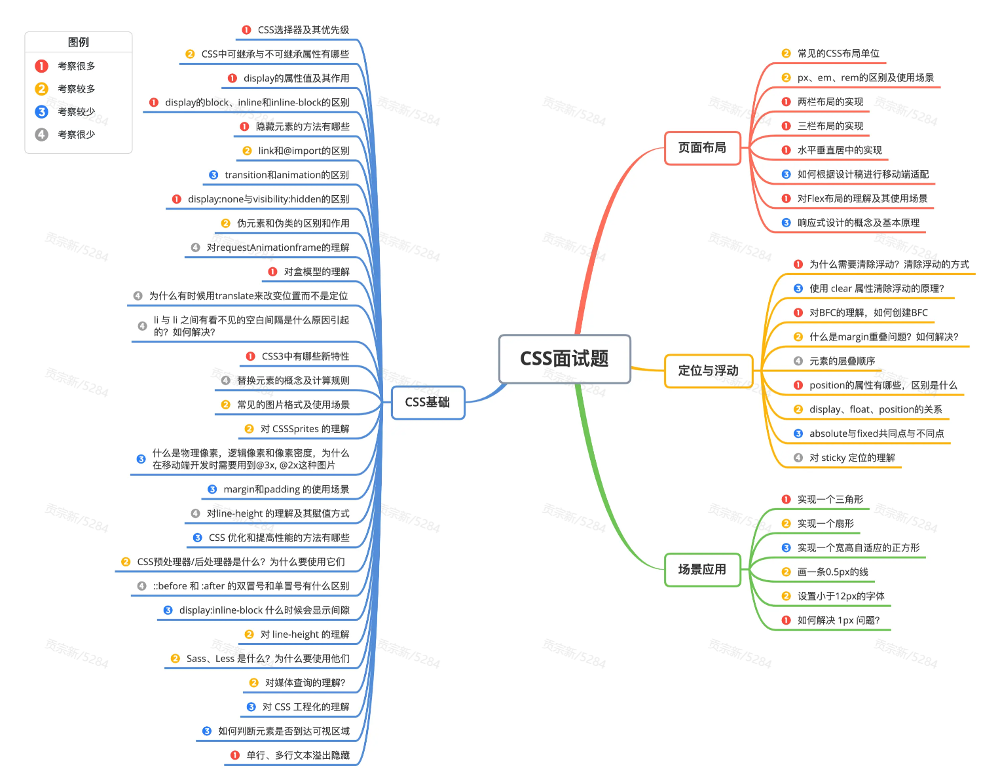
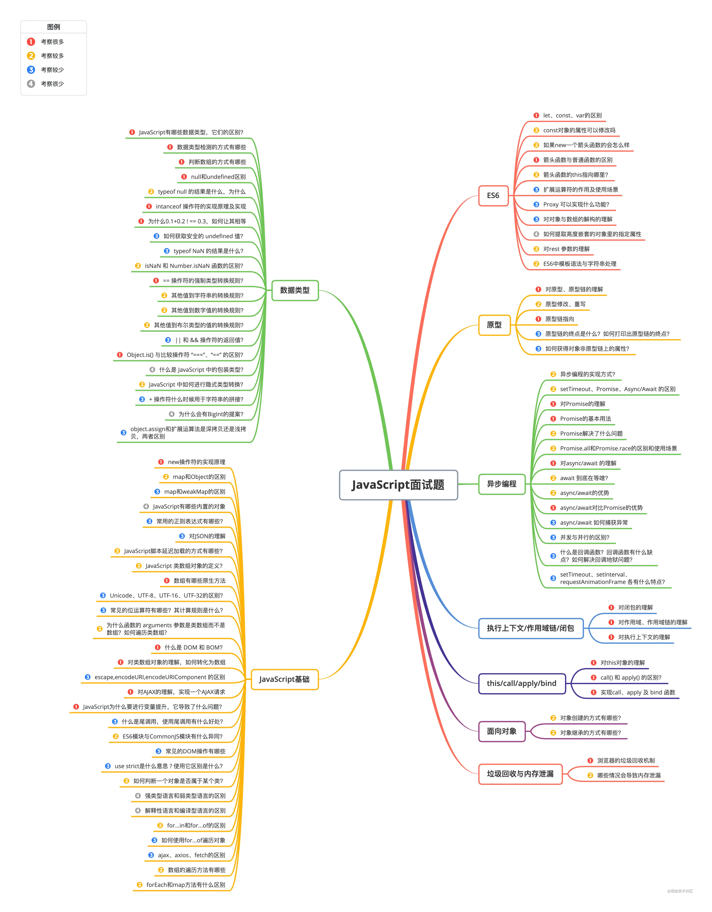
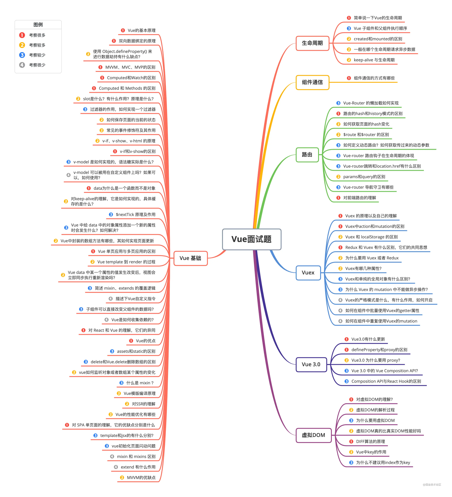
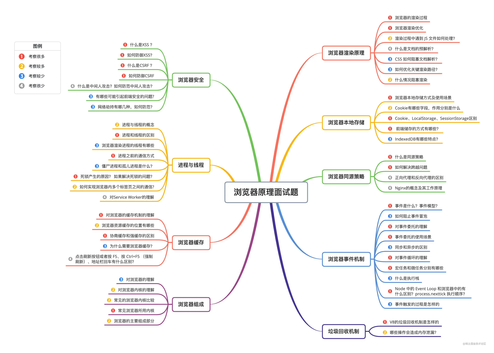
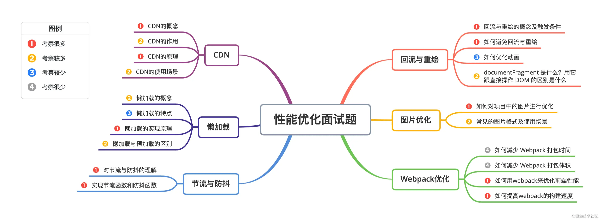
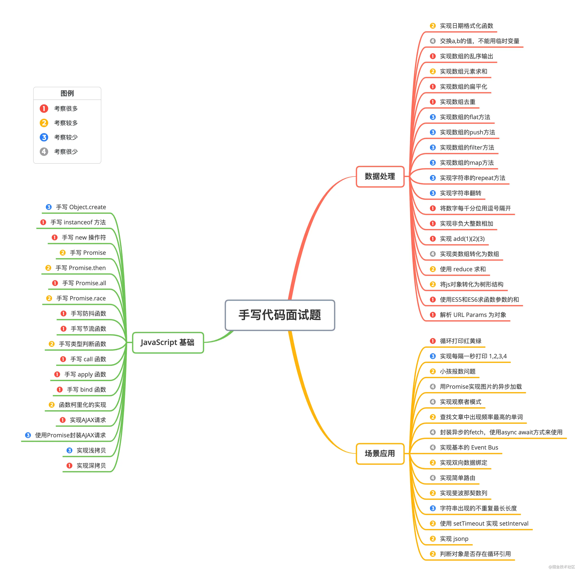

# HTML篇


### 1. src和href的区别

src和href都是**用来引用外部的资源**，它们的区别如下：

- **src：** 表示对资源的引用，它指向的内容会嵌入到当前标签所在的位置。src会将其指向的资源下载并应⽤到⽂档内，如请求js脚本。当浏览器解析到该元素时，会暂停其他资源的下载和处理，直到将该资源加载、编译、执⾏完毕，所以⼀般js脚本会放在页面底部。
- **href：** 表示超文本引用，它指向一些网络资源，建立和当前元素或本文档的链接关系。当浏览器识别到它他指向的⽂件时，就会并⾏下载资源，不会停⽌对当前⽂档的处理。 常用在a、link等标签上。

### 2. 对HTML语义化的理解

**语义化是指根据内容的结构化（内容语义化），选择合适的标签（代码语义化）**。通俗来讲就是用正确的标签做正确的事情。

语义化的优点如下：

- 对机器友好，带有语义的文字表现力丰富，更适合搜索引擎的爬虫爬取有效信息，有利于SEO。除此之外，语义类还支持读屏软件，根据文章可以自动生成目录；
- 对开发者友好，使用语义类标签增强了可读性，结构更加清晰，开发者能清晰的看出网页的结构，便于团队的开发与维护。

常见的语义化标签：

```html
<header></header>  头部

<nav></nav>  导航栏

<section></section>  区块（有语义化的div）

<main></main>  主要区域

<article></article>  主要内容

<aside></aside>  侧边栏

<footer></footer>  底部

```

### 3. DOCTYPE(⽂档类型) 的作⽤

DOCTYPE是HTML5中一种标准通用标记语言的文档类型声明，它的目的是**告诉浏览器（解析器）应该以什么样（html或xhtml）的文档类型定义来解析文档**，不同的渲染模式会影响浏览器对 CSS 代码甚⾄ JavaScript 脚本的解析。它必须声明在HTML⽂档的第⼀⾏。

浏览器渲染页面的两种模式（可通过document.compatMode获取，比如，语雀官网的文档类型是**CSS1Compat**）：

- **CSS1Compat：标准模式（Strick mode）**，默认模式，浏览器使用W3C的标准解析渲染页面。在标准模式中，浏览器以其支持的最高标准呈现页面。
- **BackCompat：怪异模式(混杂模式)(Quick mode)**，浏览器使用自己的怪异模式解析渲染页面。在怪异模式中，页面以一种比较宽松的向后兼容的方式显示。

### 4. script标签中defer和async的区别

如果没有defer或async属性，浏览器会立即加载并执行相应的脚本。它不会等待后续加载的文档元素，读取到就会开始加载和执行，这样就阻塞了后续文档的加载。

下图可以直观的看出三者之间的区别:  其中蓝色代表js脚本网络加载时间，红色代表js脚本执行时间，绿色代表html解析。

**defer 和 async属性都是去异步加载外部的JS脚本文件，它们都不会阻塞页面的解析**，其区别如下：

- **执行顺序：** 多个带async属性的标签，不能保证加载的顺序；多个带defer属性的标签，按照加载顺序执行；
- **脚本是否并行执行：\**async属性，表示\**后续文档的加载和执行与js脚本的加载和执行是并行进行的**，即异步执行；defer属性，加载后续文档的过程和js脚本的加载(此时仅加载不执行)是并行进行的(异步)，js脚本需要等到文档所有元素解析完成之后才执行，DOMContentLoaded事件触发执行之前。

### 5. 常⽤的meta标签有哪些

`meta` 标签由 `name` 和 `content` 属性定义，**用来描述网页文档的属性**，比如网页的作者，网页描述，关键词等，除了HTTP标准固定了一些`name`作为大家使用的共识，开发者还可以自定义name。

常用的meta标签： （1）`charset`，用来描述HTML文档的编码类型：

```html
<meta charset="UTF-8" >

```

（2） `keywords`，页面关键词：

```html
<meta name="keywords" content="关键词" />

```

（3）`description`，页面描述：

```html
<meta name="description" content="页面描述内容" />

```

（4）`refresh`，页面重定向和刷新：

```html
<meta http-equiv="refresh" content="0;url=" />

```

（5）`viewport`，适配移动端，可以控制视口的大小和比例：

```html
<meta name="viewport" content="width=device-width, initial-scale=1, maximum-scale=1">

```

其中，`content` 参数有以下几种：

- `width viewport` ：宽度(数值/device-width)
- `height viewport` ：高度(数值/device-height)
- `initial-scale` ：初始缩放比例
- `maximum-scale` ：最大缩放比例
- `minimum-scale` ：最小缩放比例
- `user-scalable` ：是否允许用户缩放(yes/no）

（6）搜索引擎索引方式：

```html
<meta name="robots" content="index,follow" />

```

其中，`content` 参数有以下几种：

- `all`：文件将被检索，且页面上的链接可以被查询；
- `none`：文件将不被检索，且页面上的链接不可以被查询；
- `index`：文件将被检索；
- `follow`：页面上的链接可以被查询；
- `noindex`：文件将不被检索；
- `nofollow`：页面上的链接不可以被查询。

### 6. HTML5有哪些更新

#### 1. 语义化标签

- header：定义文档的页眉（头部）；
- nav：定义导航链接的部分；
- footer：定义文档或节的页脚（底部）；
- article：定义文章内容；
- section：定义文档中的节（section、区段）；
- aside：定义其所处内容之外的内容（侧边）；

#### 2. 媒体标签

（1） audio：音频

```html
<audio src='' controls autoplay loop='true'></audio>

```

属性：

- controls 控制面板
- autoplay 自动播放
- loop=‘true’ 循环播放

（2）video视频

```html
<video src='' poster='imgs/aa.jpg' controls></video>

```

属性：

- poster：指定视频还没有完全下载完毕，或者用户还没有点击播放前显示的封面。默认显示当前视频文件的第一针画面，当然通过poster也可以自己指定。
- controls 控制面板
- width
- height

（3）source标签 因为浏览器对视频格式支持程度不一样，为了能够兼容不同的浏览器，可以通过source来指定视频源。

```html
<video>
 	<source src='aa.flv' type='video/flv'></source>
 	<source src='aa.mp4' type='video/mp4'></source>
</video>

```

#### 3. 表单

**表单类型：**

- email ：能够验证当前输入的邮箱地址是否合法
- url ： 验证URL
- number ： 只能输入数字，其他输入不了，而且自带上下增大减小箭头，max属性可以设置为最大值，min可以设置为最小值，value为默认值。
- search ： 输入框后面会给提供一个小叉，可以删除输入的内容，更加人性化。
- range ： 可以提供给一个范围，其中可以设置max和min以及value，其中value属性可以设置为默认值
- color ： 提供了一个颜色拾取器
- time ： 时分秒
- data ： 日期选择年月日
- datatime ： 时间和日期(目前只有Safari支持)
- datatime-local ：日期时间控件
- week ：周控件
- month：月控件

**表单属性：**

- placeholder ：提示信息
- autofocus ：自动获取焦点
- autocomplete=“on” 或者 autocomplete=“off” 使用这个属性需要有两个前提：
  - 表单必须提交过
  - 必须有name属性。
- required：要求输入框不能为空，必须有值才能够提交。
- pattern=" " 里面写入想要的正则模式，例如手机号patte="^(+86)?\d{10}$"
- multiple：可以选择多个文件或者多个邮箱
- form=" form表单的ID"

**表单事件：**

- oninput 每当input里的输入框内容发生变化都会触发此事件。
- oninvalid 当验证不通过时触发此事件。

#### 4. 进度条、度量器

- progress标签：用来表示任务的进度（IE、Safari不支持），max用来表示任务的进度，value表示已完成多少
- meter属性：用来显示剩余容量或剩余库存（IE、Safari不支持）
  - high/low：规定被视作高/低的范围
  - max/min：规定最大/小值
  - value：规定当前度量值

设置规则：min < low < high < max

#### 5.DOM查询操作

- document.querySelector()
- document.querySelectorAll()

它们选择的对象可以是标签，可以是类(需要加点)，可以是ID(需要加#)

#### 6. Web存储

HTML5 提供了两种在客户端存储数据的新方法：

- localStorage - 没有时间限制的数据存储
- sessionStorage - 针对一个 session 的数据存储

#### 7. 其他

- 拖放：拖放是一种常见的特性，即抓取对象以后拖到另一个位置。设置元素可拖放：

```html


```

- 画布（canvas ）： canvas 元素使用 JavaScript 在网页上绘制图像。画布是一个矩形区域，可以控制其每一像素。canvas 拥有多种绘制路径、矩形、圆形、字符以及添加图像的方法。

```html
<canvas id="myCanvas" width="200" height="100"></canvas>

```

- SVG：SVG 指可伸缩矢量图形，用于定义用于网络的基于矢量的图形，使用 XML 格式定义图形，图像在放大或改变尺寸的情况下其图形质量不会有损失，它是万维网联盟的标准
- 地理定位：Geolocation（地理定位）用于定位用户的位置。‘

**总结：** （1）新增语义化标签：nav、header、footer、aside、section、article （2）音频、视频标签：audio、video （3）数据存储：localStorage、sessionStorage （4）canvas（画布）、Geolocation（地理定位）、websocket（通信协议） （5）input标签新增属性：placeholder、autocomplete、autofocus、required （6）history API：go、forward、back、pushstate

**移除的元素有：**

- 纯表现的元素：basefont，big，center，font, s，strike，tt，u;
- 对可用性产生负面影响的元素：frame，frameset，noframes；

### 7. img的srcset属性的作⽤？

响应式页面中经常用到根据屏幕密度设置不同的图片。这时就用到了 img 标签的srcset属性。srcset属性用于设置不同屏幕密度下，img 会自动加载不同的图片。用法如下：

```html


```

使用上面的代码，就能实现在屏幕密度为1x的情况下加载image-128.png, 屏幕密度为2x时加载image-256.png。

按照上面的实现，不同的屏幕密度都要设置图片地址，目前的屏幕密度有1x,2x,3x,4x四种，如果每一个图片都设置4张图片，加载就会很慢。所以就有了新的srcset标准。代码如下：

```html


```

其中srcset指定图片的地址和对应的图片质量。sizes用来设置图片的尺寸零界点。对于 srcset 中的 w 单位，可以理解成图片质量。如果可视区域小于这个质量的值，就可以使用。浏览器会自动选择一个最小的可用图片。

sizes语法如下：

```html
sizes="[media query] [length], [media query] [length] ... "

```

sizes就是指默认显示128px, 如果视区宽度大于360px, 则显示340px。

### 8.  行内元素有哪些？块级元素有哪些？ 空(void)元素有那些？

- 行内元素有：`a b span img input select strong`；
- 块级元素有：`div ul ol li dl dt dd h1 h2 h3 h4 h5 h6 p`；

空元素，即没有内容的HTML元素。空元素是在开始标签中关闭的，也就是空元素没有闭合标签：

- 常见的有：`<br>`、`<hr>`、``、`<input>`、`<link>`、`<meta>`；
- 鲜见的有：`<area>`、`<base>`、`<col>`、`<colgroup>`、`<command>`、`<embed>`、`<keygen>`、`<param>`、`<source>`、`<track>`、`<wbr>`。

### 9. 说一下 web worker

在 HTML 页面中，如果在执行脚本时，页面的状态是不可相应的，直到脚本执行完成后，页面才变成可相应。web worker 是运行在后台的 js，独立于其他脚本，不会影响页面的性能。 并且通过 postMessage 将结果回传到主线程。这样在进行复杂操作的时候，就不会阻塞主线程了。

如何创建 web worker：

1. 检测浏览器对于 web worker 的支持性
2. 创建 web worker 文件（js，回传函数等）
3. 创建 web worker 对象

### 10. HTML5的离线储存怎么使用，它的工作原理是什么

离线存储指的是：在用户没有与因特网连接时，可以正常访问站点或应用，在用户与因特网连接时，更新用户机器上的缓存文件。

**原理：**HTML5的离线存储是基于一个新建的 `.appcache` 文件的缓存机制(不是存储技术)，通过这个文件上的解析清单离线存储资源，这些资源就会像cookie一样被存储了下来。之后当网络在处于离线状态下时，浏览器会通过被离线存储的数据进行页面展示

**使用方法：** （1）创建一个和 html 同名的 manifest 文件，然后在页面头部加入 manifest 属性：

```html
<html lang="en" manifest="index.manifest">

```

（2）在 `cache.manifest` 文件中编写需要离线存储的资源：

```html
CACHE MANIFEST
    #v0.11
    CACHE:
    js/app.js
    css/style.css
    NETWORK:
    resourse/logo.png
    FALLBACK:
    / /offline.html

```

- **CACHE**: 表示需要离线存储的资源列表，由于包含 manifest 文件的页面将被自动离线存储，所以不需要把页面自身也列出来。
-   *: 表示在它下面列出来的资源只有在在线的情况下才能访问，他们不会被离线存储，所以在离线情况下无法使用这些资源。不过，如果在 CACHE 和 NETWORK 中有一个相同的资源，那么这个资源还是会被离线存储，也就是说 CACHE 的优先级更高。
- **FALLBACK**: 表示如果访问第一个资源失败，那么就使用第二个资源来替换他，比如上面这个文件表示的就是如果访问根目录下任何一个资源失败了，那么就去访问 offline.html 。

（3）在离线状态时，操作 `window.applicationCache` 进行离线缓存的操作。

**如何更新缓存：**

（1）更新 manifest 文件

（2）通过 javascript 操作

（3）清除浏览器缓存

**注意事项：**

（1）浏览器对缓存数据的容量限制可能不太一样（某些浏览器设置的限制是每个站点 5MB）。

（2）如果 manifest 文件，或者内部列举的某一个文件不能正常下载，整个更新过程都将失败，浏览器继续全部使用老的缓存。

（3）引用 manifest 的 html 必须与 manifest 文件同源，在同一个域下。

（4）FALLBACK 中的资源必须和 manifest 文件同源。

（5）当一个资源被缓存后，该浏览器直接请求这个绝对路径也会访问缓存中的资源。

（6）站点中的其他页面即使没有设置 manifest 属性，请求的资源如果在缓存中也从缓存中访问。

（7）当 manifest 文件发生改变时，资源请求本身也会触发更新。

### 11. 浏览器是如何对 HTML5 的离线储存资源进行管理和加载？

- **在线的情况下**，浏览器发现 html 头部有 manifest 属性，它会请求 manifest 文件，如果是第一次访问页面 ，那么浏览器就会根据 manifest 文件的内容下载相应的资源并且进行离线存储。如果已经访问过页面并且资源已经进行离线存储了，那么浏览器就会使用离线的资源加载页面，然后浏览器会对比新的 manifest 文件与旧的 manifest 文件，如果文件没有发生改变，就不做任何操作，如果文件改变了，就会重新下载文件中的资源并进行离线存储。
- **离线的情况下**，浏览器会直接使用离线存储的资源。

### 12. title与h1的区别、b与strong的区别、i与em的区别？

- strong标签有语义，是起到加重语气的效果，而b标签是没有的，b标签只是一个简单加粗标签。b标签之间的字符都设为粗体，strong标签加强字符的语气都是通过粗体来实现的，而搜索引擎更侧重strong标签。
- title属性没有明确意义只表示是个标题，H1则表示层次明确的标题，对页面信息的抓取有很大的影响
- **i内容展示为斜体，em表示强调的文本**

### 13. **iframe 有那些优点和缺点？**

iframe 元素会创建包含另外一个文档的内联框架（即行内框架）。

**优点：**

- 用来加载速度较慢的内容（如广告）
- 可以使脚本可以并行下载
- 可以实现跨子域通信

**缺点：**

- iframe 会阻塞主页面的 onload 事件
- 无法被一些搜索引擎索识别
- 会产生很多页面，不容易管理

### 14. label 的作用是什么？如何使用？

label标签来定义表单控件的关系：当用户选择label标签时，浏览器会自动将焦点转到和label标签相关的表单控件上。

- 使用方法1：

```html
<label for="mobile">Number:</label>
<input type="text" id="mobile"/>

```

- 使用方法2：

```html
<label>Date:<input type="text"/></label>

```

### 15. Canvas和SVG的区别

**（1）SVG：** SVG可缩放矢量图形（Scalable Vector Graphics）是基于可扩展标记语言XML描述的2D图形的语言，SVG基于XML就意味着SVG DOM中的每个元素都是可用的，可以为某个元素附加Javascript事件处理器。在 SVG 中，每个被绘制的图形均被视为对象。如果 SVG 对象的属性发生变化，那么浏览器能够自动重现图形。

其特点如下：

- 不依赖分辨率
- 支持事件处理器
- 最适合带有大型渲染区域的应用程序（比如谷歌地图）
- 复杂度高会减慢渲染速度（任何过度使用 DOM 的应用都不快）
- 不适合游戏应用

**（2）Canvas：** Canvas是画布，通过Javascript来绘制2D图形，是逐像素进行渲染的。其位置发生改变，就会重新进行绘制。

其特点如下：

- 依赖分辨率
- 不支持事件处理器
- 弱的文本渲染能力
- 能够以 .png 或 .jpg 格式保存结果图像
- 最适合图像密集型的游戏，其中的许多对象会被频繁重绘

注：矢量图，也称为面向对象的图像或绘图图像，在数学上定义为一系列由线连接的点。矢量文件中的图形元素称为对象。每个对象都是一个自成一体的实体，它具有颜色、形状、轮廓、大小和屏幕位置等属性。

### 16. head 标签有什么作用，其中什么标签必不可少？

 标签用于定义文档的头部，它是所有头部元素的容器。 中的元素可以引用脚本、指示浏览器在哪里找到样式表、提供元信息等。

文档的头部描述了文档的各种属性和信息，包括文档的标题、在 Web 中的位置以及和其他文档的关系等。绝大多数文档头部包含的数据都不会真正作为内容显示给读者。

下面这些标签可用在 head 部分：`<base>, <link>, <meta>, <script>, <style>, <title>`。

其中 `<title>` 定义文档的标题，它是 head 部分中唯一必需的元素。

### 17. 文档声明（Doctype）和`<!Doctype html>`有何作用? 严格模式与混杂模式如何区分？它们有何意义?

**文档声明的作用：** 文档声明是为了告诉浏览器，当前`HTML`文档使用什么版本的`HTML`来写的，这样浏览器才能按照声明的版本来正确的解析。

**的作用：**`<!doctype html>` 的作用就是让浏览器进入标准模式，使用最新的 `HTML5` 标准来解析渲染页面；如果不写，浏览器就会进入混杂模式，我们需要避免此类情况发生。

**严格模式与混杂模式的区分：**

- **严格模式**： 又称为标准模式，指浏览器按照`W3C`标准解析代码；
- **混杂模式**： 又称怪异模式、兼容模式，是指浏览器用自己的方式解析代码。混杂模式通常模拟老式浏览器的行为，以防止老站点无法工作；

**区分**：网页中的`DTD`，直接影响到使用的是严格模式还是浏览模式，可以说`DTD`的使用与这两种方式的区别息息相关。

- 如果文档包含严格的`DOCTYPE` ，那么它一般以严格模式呈现（**严格 DTD ——严格模式**）；
- 包含过渡 `DTD` 和 `URI` 的 `DOCTYPE` ，也以严格模式呈现，但有过渡 `DTD` 而没有 `URI` （统一资源标识符，就是声明最后的地址）会导致页面以混杂模式呈现（**有 URI 的过渡 DTD ——严格模式；没有 URI 的过渡 DTD ——混杂模式**）；
- `DOCTYPE` 不存在或形式不正确会导致文档以混杂模式呈现（**DTD不存在或者格式不正确——混杂模式**）；
- `HTML5` 没有 `DTD` ，因此也就没有严格模式与混杂模式的区别，`HTML5` 有相对宽松的 法，实现时，已经尽可能大的实现了向后兼容(**HTML5 没有严格和混杂之分**)。

总之，**严格模式让各个浏览器统一执行一套规范兼容模式保证了旧网站的正常运行。**

### 18. 浏览器乱码的原因是什么？如何解决？

**产生乱码的原因：**

- 网页源代码是`gbk`的编码，而内容中的中文字是`utf-8`编码的，这样浏览器打开即会出现`html`乱码，反之也会出现乱码；
- `html`网页编码是`gbk`，而程序从数据库中调出呈现是`utf-8`编码的内容也会造成编码乱码；
- 浏览器不能自动检测网页编码，造成网页乱码。

**解决办法：**

- 使用软件编辑HTML网页内容；
- 如果网页设置编码是`gbk`，而数据库储存数据编码格式是`UTF-8`，此时需要程序查询数据库数据显示数据前进程序转码；
- 如果浏览器浏览时候出现网页乱码，在浏览器中找到转换编码的菜单进行转换。

### 19. 渐进增强和优雅降级之间的区别

**（1）渐进增强（progressive enhancement）**：主要是针对低版本的浏览器进行页面重构，保证基本的功能情况下，再针对高级浏览器进行效果、交互等方面的改进和追加功能，以达到更好的用户体验。 **（2）优雅降级 graceful degradation**： 一开始就构建完整的功能，然后再针对低版本的浏览器进行兼容。

**两者区别：**

- 优雅降级是从复杂的现状开始的，并试图减少用户体验的供给；而渐进增强是从一个非常基础的，能够起作用的版本开始的，并在此基础上不断扩充，以适应未来环境的需要；
- 降级（功能衰竭）意味着往回看，而渐进增强则意味着往前看，同时保证其根基处于安全地带。

“优雅降级”观点认为应该针对那些最高级、最完善的浏览器来设计网站。而将那些被认为“过时”或有功能缺失的浏览器下的测试工作安排在开发周期的最后阶段，并把测试对象限定为主流浏览器（如 IE、Mozilla 等）的前一个版本。 在这种设计范例下，旧版的浏览器被认为仅能提供“简陋却无妨 (poor, but passable)” 的浏览体验。可以做一些小的调整来适应某个特定的浏览器。但由于它们并非我们所关注的焦点，因此除了修复较大的错误之外，其它的差异将被直接忽略。

“渐进增强”观点则认为应关注于内容本身。内容是建立网站的诱因，有的网站展示它，有的则收集它，有的寻求，有的操作，还有的网站甚至会包含以上的种种，但相同点是它们全都涉及到内容。这使得“渐进增强”成为一种更为合理的设计范例。这也是它立即被 Yahoo 所采纳并用以构建其“分级式浏览器支持 (Graded Browser Support)”策略的原因所在。

### 20. 说一下 HTML5 drag API

- dragstart：事件主体是被拖放元素，在开始拖放被拖放元素时触发。
- darg：事件主体是被拖放元素，在正在拖放被拖放元素时触发。
- dragenter：事件主体是目标元素，在被拖放元素进入某元素时触发。
- dragover：事件主体是目标元素，在被拖放在某元素内移动时触发。
- dragleave：事件主体是目标元素，在被拖放元素移出目标元素是触发。
- drop：事件主体是目标元素，在目标元素完全接受被拖放元素时触发。
- dragend：事件主体是被拖放元素，在整个拖放操作结束时触发。

# CSS篇



## 一、CSS基础

### 1. CSS选择器及其优先级

| **选择器**     | **格式**      | **优先级权重** |
| -------------- | ------------- | -------------- |
| id选择器       | #id           | 100            |
| 类选择器       | #classname    | 10             |
| 属性选择器     | a[ref=“eee”]  | 10             |
| 伪类选择器     | li:last-child | 10             |
| 标签选择器     | div           | 1              |
| 伪元素选择器   | li:after      | 1              |
| 相邻兄弟选择器 | h1+p          | 0              |
| 子选择器       | ul>li         | 0              |
| 后代选择器     | li a          | 0              |
| 通配符选择器   | *             | 0              |

对于选择器的**优先级**：

- 标签选择器、伪元素选择器：1
- 类选择器、伪类选择器、属性选择器：10
- id 选择器：100
- 内联样式：1000

**注意事项：**

- !important声明的样式的优先级最高；
- 如果优先级相同，则最后出现的样式生效；
- 继承得到的样式的优先级最低；
- 通用选择器（*）、子选择器（>）和相邻同胞选择器（+）并不在这四个等级中，所以它们的权值都为 0 ；
- 样式表的来源不同时，优先级顺序为：内联样式 > 内部样式 > 外部样式 > 浏览器用户自定义样式 > 浏览器默认样式。

### 2. CSS中可继承与不可继承属性有哪些

**一、无继承性的属性**

1. **display**：规定元素应该生成的框的类型
2. **文本属性**：

- vertical-align：垂直文本对齐
- text-decoration：规定添加到文本的装饰
- text-shadow：文本阴影效果
- white-space：空白符的处理
- unicode-bidi：设置文本的方向

1. **盒子模型的属性**：width、height、margin、border、padding
2. **背景属性**：background、background-color、background-image、background-repeat、background-position、background-attachment
3. **定位属性**：float、clear、position、top、right、bottom、left、min-width、min-height、max-width、max-height、overflow、clip、z-index
4. **生成内容属性**：content、counter-reset、counter-increment
5. **轮廓样式属性**：outline-style、outline-width、outline-color、outline
6. **页面样式属性**：size、page-break-before、page-break-after
7. **声音样式属性**：pause-before、pause-after、pause、cue-before、cue-after、cue、play-during

**二、有继承性的属性**

1. **字体系列属性**

- font-family：字体系列
- font-weight：字体的粗细
- font-size：字体的大小
- font-style：字体的风格

1. **文本系列属性**

- text-indent：文本缩进
- text-align：文本水平对齐
- line-height：行高
- word-spacing：单词之间的间距
- letter-spacing：中文或者字母之间的间距
- text-transform：控制文本大小写（就是uppercase、lowercase、capitalize这三个）
- color：文本颜色

1. **元素可见性**

- visibility：控制元素显示隐藏

1. **列表布局属性**

- list-style：列表风格，包括list-style-type、list-style-image等

1. **光标属性**

- cursor：光标显示为何种形态

### 3. display的属性值及其作用

| **属性值**   | **作用**                                                   |
| ------------ | ---------------------------------------------------------- |
| none         | 元素不显示，并且会从文档流中移除。                         |
| block        | 块类型。默认宽度为父元素宽度，可设置宽高，换行显示。       |
| inline       | 行内元素类型。默认宽度为内容宽度，不可设置宽高，同行显示。 |
| inline-block | 默认宽度为内容宽度，可以设置宽高，同行显示。               |
| list-item    | 像块类型元素一样显示，并添加样式列表标记。                 |
| table        | 此元素会作为块级表格来显示。                               |
| inherit      | 规定应该从父元素继承display属性的值。                      |

### 4. display的block、inline和inline-block的区别

（1）**block：** 会独占一行，多个元素会另起一行，可以设置width、height、margin和padding属性；

（2）**inline：** 元素不会独占一行，设置width、height属性无效。但可以设置水平方向的margin和padding属性，不能设置垂直方向的padding和margin；

（3）**inline-block：** 将对象设置为inline对象，但对象的内容作为block对象呈现，之后的内联对象会被排列在同一行内。

对于行内元素和块级元素，其特点如下：

**（1）行内元素**

- 设置宽高无效；
- 可以设置水平方向的margin和padding属性，不能设置垂直方向的padding和margin；
- 不会自动换行；

**（2）块级元素**

- 可以设置宽高；
- 设置margin和padding都有效；
- 可以自动换行；
- 多个块状，默认排列从上到下。

### 5. 隐藏元素的方法有哪些

- **display: none**：渲染树不会包含该渲染对象，因此该元素不会在页面中占据位置，也不会响应绑定的监听事件。
- **visibility: hidden**：元素在页面中仍占据空间，但是不会响应绑定的监听事件。
- **opacity: 0**：将元素的透明度设置为 0，以此来实现元素的隐藏。元素在页面中仍然占据空间，并且能够响应元素绑定的监听事件。
- **position: absolute**：通过使用绝对定位将元素移除可视区域内，以此来实现元素的隐藏。
- **z-index: 负值**：来使其他元素遮盖住该元素，以此来实现隐藏。
- **clip/clip-path** ：使用元素裁剪的方法来实现元素的隐藏，这种方法下，元素仍在页面中占据位置，但是不会响应绑定的监听事件。
- **transform: scale(0,0)**：将元素缩放为 0，来实现元素的隐藏。这种方法下，元素仍在页面中占据位置，但是不会响应绑定的监听事件。

### 6. link和@import的区别

两者都是外部引用CSS的方式，它们的区别如下：

- link是XHTML标签，除了加载CSS外，还可以定义RSS等其他事务；@import属于CSS范畴，只能加载CSS。
- link引用CSS时，在页面载入时同时加载；@import需要页面网页完全载入以后加载。
- link是XHTML标签，无兼容问题；@import是在CSS2.1提出的，低版本的浏览器不支持。
- link支持使用Javascript控制DOM去改变样式；而@import不支持。

### 7. transition和animation的区别

- **transition是过度属性**，强调过度，它的实现需要触发一个事件（比如鼠标移动上去，焦点，点击等）才执行动画。它类似于flash的补间动画，设置一个开始关键帧，一个结束关键帧。
- **animation是动画属性**，它的实现不需要触发事件，设定好时间之后可以自己执行，且可以循环一个动画。它也类似于flash的补间动画，但是它可以设置多个关键帧（用@keyframe定义）完成动画。

### 8. display:none与visibility:hidden的区别

这两个属性都是让元素隐藏，不可见。**两者区别如下：**

（1）**在渲染树中**

- `display:none`会让元素完全从渲染树中消失，渲染时不会占据任何空间；
- `visibility:hidden`不会让元素从渲染树中消失，渲染的元素还会占据相应的空间，只是内容不可见。

（2）**是否是继承属性**

- `display:none`是非继承属性，子孙节点会随着父节点从渲染树消失，通过修改子孙节点的属性也无法显示；
- `visibility:hidden`是继承属性，子孙节点消失是由于继承了`hidden`，通过设置`visibility:visible`可以让子孙节点显示；

（3）修改常规文档流中元素的 `display` 通常会造成文档的重排，但是修改`visibility`属性只会造成本元素的重绘；

（4）如果使用读屏器，设置为`display:none`的内容不会被读取，设置为`visibility:hidden`的内容会被读取。

### 9. **伪元素和伪类的区别和作用？**

- 伪元素：在内容元素的前后插入额外的元素或样式，但是这些元素实际上并不在文档中生成。它们只在外部显示可见，但不会在文档的源代码中找到它们，因此，称为“伪”元素。例如：

```css
p::before {content:"第一章：";}
p::after {content:"Hot!";}
p::first-line {background:red;}
p::first-letter {font-size:30px;}

```

- 伪类：将特殊的效果添加到特定选择器上。它是已有元素上添加类别的，不会产生新的元素。例如：

```css
a:hover {color: #FF00FF}
p:first-child {color: red}

```

**总结：** 伪类是通过在元素选择器上加⼊伪类改变元素状态，⽽伪元素通过对元素的操作进⾏对元素的改变。

### 10. 对requestAnimationframe的理解

实现动画效果的方法比较多，Javascript 中可以通过定时器 setTimeout 来实现，CSS3 中可以使用 transition 和 animation 来实现，HTML5 中的 canvas 也可以实现。除此之外，HTML5 提供一个专门用于请求动画的API，那就是 requestAnimationFrame，顾名思义就是**请求动画帧**。

MDN对该方法的描述：

> window.requestAnimationFrame() 告诉浏览器——你希望执行一个动画，并且要求浏览器在下次重绘之前调用指定的回调函数更新动画。该方法需要传入一个回调函数作为参数，该回调函数会在浏览器下一次重绘之前执行。

**语法：** `window.requestAnimationFrame(callback);`  其中，callback是**下一次重绘之前更新动画帧所调用的函数**(即上面所说的回调函数)。该回调函数会被传入DOMHighResTimeStamp参数，它表示requestAnimationFrame() 开始去执行回调函数的时刻。该方法属于**宏任务**，所以会在执行完微任务之后再去执行。

**取消动画：** 使用cancelAnimationFrame()来取消执行动画，该方法接收一个参数——requestAnimationFrame默认返回的id，只需要传入这个id就可以取消动画了。

**优势：**

- **CPU节能**：使用SetTinterval 实现的动画，当页面被隐藏或最小化时，SetTinterval 仍然在后台执行动画任务，由于此时页面处于不可见或不可用状态，刷新动画是没有意义的，完全是浪费CPU资源。而RequestAnimationFrame则完全不同，当页面处理未激活的状态下，该页面的屏幕刷新任务也会被系统暂停，因此跟着系统走的RequestAnimationFrame也会停止渲染，当页面被激活时，动画就从上次停留的地方继续执行，有效节省了CPU开销。
- **函数节流**：在高频率事件( resize, scroll 等)中，为了防止在一个刷新间隔内发生多次函数执行，RequestAnimationFrame可保证每个刷新间隔内，函数只被执行一次，这样既能保证流畅性，也能更好的节省函数执行的开销，一个刷新间隔内函数执行多次时没有意义的，因为多数显示器每16.7ms刷新一次，多次绘制并不会在屏幕上体现出来。
- **减少DOM操作**：requestAnimationFrame 会把每一帧中的所有DOM操作集中起来，在一次重绘或回流中就完成，并且重绘或回流的时间间隔紧紧跟随浏览器的刷新频率，一般来说，这个频率为每秒60帧。

**setTimeout执行动画的缺点**：它通过设定间隔时间来不断改变图像位置，达到动画效果。但是容易出现卡顿、抖动的现象；原因是：

- settimeout任务被放入异步队列，只有当主线程任务执行完后才会执行队列中的任务，因此实际执行时间总是比设定时间要晚；
- settimeout的固定时间间隔不一定与屏幕刷新间隔时间相同，会引起丢帧。

### 11. 对盒模型的理解

CSS3中的盒模型有以下两种：标准盒子模型、IE盒子模型   盒模型都是由四个部分组成的，分别是margin、border、padding和content。

标准盒模型和IE盒模型的区别在于设置width和height时，所对应的范围不同：

- 标准盒模型的width和height属性的范围只包含了content，
- IE盒模型的width和height属性的范围包含了border、padding和content。

可以通过修改元素的box-sizing属性来改变元素的盒模型：

- `box-sizeing: content-box`表示标准盒模型（默认值）
- `box-sizeing: border-box`表示IE盒模型（怪异盒模型）

### 12. 为什么有时候⽤**translate**来改变位置⽽不是定位？

translate 是 transform 属性的⼀个值。改变transform或opacity不会触发浏览器重新布局（reflow）或重绘（repaint），只会触发复合（compositions）。⽽改变绝对定位会触发重新布局，进⽽触发重绘和复合。transform使浏览器为元素创建⼀个 GPU 图层，但改变绝对定位会使⽤到 CPU。 因此translate()更⾼效，可以缩短平滑动画的绘制时间。 ⽽translate改变位置时，元素依然会占据其原始空间，绝对定位就不会发⽣这种情况。

### 13. li 与 li 之间有看不见的空白间隔是什么原因引起的？如何解决？

浏览器会把inline内联元素间的空白字符（空格、换行、Tab等）渲染成一个空格。为了美观，通常是一个`<li>`放在一行，这导致`<li>`换行后产生换行字符，它变成一个空格，占用了一个字符的宽度。

**解决办法：**

（1）为`<li>`设置float:left。不足：有些容器是不能设置浮动，如左右切换的焦点图等。

（2）将所有`<li>`写在同一行。不足：代码不美观。

（3）将`<ul>`内的字符尺寸直接设为0，即font-size:0。不足：`<ul>`中的其他字符尺寸也被设为0，需要额外重新设定其他字符尺寸，且在Safari浏览器依然会出现空白间隔。

（4）消除`<ul>`的字符间隔letter-spacing:-8px，不足：这也设置了`<li>`内的字符间隔，因此需要将`<li>`内的字符间隔设为默认letter-spacing:normal。

### 14. CSS3中有哪些新特性

- 新增各种CSS选择器 （: not(.input)：所有 class 不是“input”的节点）
- 圆角 （border-radius:8px）
- 多列布局 （multi-column layout）
- 阴影和反射 （Shadoweflect）
- 文字特效 （text-shadow）
- 文字渲染 （Text-decoration）
- 线性渐变 （gradient）
- 旋转 （transform）
- 增加了旋转,缩放,定位,倾斜,动画,多背景

### 15. 替换元素的概念及计算规则

通过修改某个属性值呈现的内容就可以被替换的元素就称为“替换元素”。

替换元素除了内容可替换这一特性以外，还有以下特性：

- **内容的外观不受页面上的CSS的影响**：用专业的话讲就是在样式表现在CSS作用域之外。如何更改替换元素本身的外观需要类似appearance属性，或者浏览器自身暴露的一些样式接口。
- **有自己的尺寸**：在Web中，很多替换元素在没有明确尺寸设定的情况下，其默认的尺寸（不包括边框）是300像素×150像素，如
- **在很多CSS属性上有自己的一套表现规则**：比较具有代表性的就是vertical-align属性，对于替换元素和非替换元素，vertical-align属性值的解释是不一样的。比方说vertical-align的默认值的baseline，很简单的属性值，基线之意，被定义为字符x的下边缘，而替换元素的基线却被硬生生定义成了元素的下边缘。
- **所有的替换元素都是内联水平元素**：也就是替换元素和替换元素、替换元素和文字都是可以在一行显示的。但是，替换元素默认的display值却是不一样的，有的是inline，有的是inline-block。

替换元素的尺寸从内而外分为三类：

- **固有尺寸：** 指的是替换内容原本的尺寸。例如，图片、视频作为一个独立文件存在的时候，都是有着自己的宽度和高度的。
- **HTML尺寸：** 只能通过HTML原生属性改变，这些HTML原生属性包括的width和height属性、的size属性。
- **CSS尺寸：** 特指可以通过CSS的width和height或者max-width/min-width和max-height/min-height设置的尺寸，对应盒尺寸中的content box。

这三层结构的计算规则具体如下： （1）如果没有CSS尺寸和HTML尺寸，则使用固有尺寸作为最终的宽高。 （2）如果没有CSS尺寸，则使用HTML尺寸作为最终的宽高。 （3）如果有CSS尺寸，则最终尺寸由CSS属性决定。 （4）如果“固有尺寸”含有固有的宽高比例，同时仅设置了宽度或仅设置了高度，则元素依然按照固有的宽高比例显示。 （5）如果上面的条件都不符合，则最终宽度表现为300像素，高度为150像素。 （6）内联替换元素和块级替换元素使用上面同一套尺寸计算规则。

### 16. 常见的图片格式及使用场景

（1）**BMP**，是无损的、既支持索引色也支持直接色的点阵图。这种图片格式几乎没有对数据进行压缩，所以BMP格式的图片通常是较大的文件。

（2）**GIF**是无损的、采用索引色的点阵图。采用LZW压缩算法进行编码。文件小，是GIF格式的优点，同时，GIF格式还具有支持动画以及透明的优点。但是GIF格式仅支持8bit的索引色，所以GIF格式适用于对色彩要求不高同时需要文件体积较小的场景。

（3）**JPEG**是有损的、采用直接色的点阵图。JPEG的图片的优点是采用了直接色，得益于更丰富的色彩，JPEG非常适合用来存储照片，与GIF相比，JPEG不适合用来存储企业Logo、线框类的图。因为有损压缩会导致图片模糊，而直接色的选用，又会导致图片文件较GIF更大。

（4）**PNG-8**是无损的、使用索引色的点阵图。PNG是一种比较新的图片格式，PNG-8是非常好的GIF格式替代者，在可能的情况下，应该尽可能的使用PNG-8而不是GIF，因为在相同的图片效果下，PNG-8具有更小的文件体积。除此之外，PNG-8还支持透明度的调节，而GIF并不支持。除非需要动画的支持，否则没有理由使用GIF而不是PNG-8。

（5）**PNG-24**是无损的、使用直接色的点阵图。PNG-24的优点在于它压缩了图片的数据，使得同样效果的图片，PNG-24格式的文件大小要比BMP小得多。当然，PNG24的图片还是要比JPEG、GIF、PNG-8大得多。

（6）**SVG**是无损的矢量图。SVG是矢量图意味着SVG图片由直线和曲线以及绘制它们的方法组成。当放大SVG图片时，看到的还是线和曲线，而不会出现像素点。SVG图片在放大时，不会失真，所以它适合用来绘制Logo、Icon等。

（7）**WebP**是谷歌开发的一种新图片格式，WebP是同时支持有损和无损压缩的、使用直接色的点阵图。从名字就可以看出来它是为Web而生的，什么叫为Web而生呢？就是说相同质量的图片，WebP具有更小的文件体积。现在网站上充满了大量的图片，如果能够降低每一个图片的文件大小，那么将大大减少浏览器和服务器之间的数据传输量，进而降低访问延迟，提升访问体验。目前只有Chrome浏览器和Opera浏览器支持WebP格式，兼容性不太好。

- 在无损压缩的情况下，相同质量的WebP图片，文件大小要比PNG小26%；
- 在有损压缩的情况下，具有相同图片精度的WebP图片，文件大小要比JPEG小25%~34%；
- WebP图片格式支持图片透明度，一个无损压缩的WebP图片，如果要支持透明度只需要22%的格外文件大小。

### 17. 对 CSSSprites 的理解

CSSSprites（精灵图），将一个页面涉及到的所有图片都包含到一张大图中去，然后利用CSS的 background-image，background-repeat，background-position属性的组合进行背景定位。

**优点：**

- 利用`CSS Sprites`能很好地减少网页的http请求，从而大大提高了页面的性能，这是`CSS Sprites`最大的优点；
- `CSS Sprites`能减少图片的字节，把3张图片合并成1张图片的字节总是小于这3张图片的字节总和。

**缺点：**

- 在图片合并时，要把多张图片有序的、合理的合并成一张图片，还要留好足够的空间，防止板块内出现不必要的背景。在宽屏及高分辨率下的自适应页面，如果背景不够宽，很容易出现背景断裂；
- `CSSSprites`在开发的时候相对来说有点麻烦，需要借助`photoshop`或其他工具来对每个背景单元测量其准确的位置。
- 维护方面：`CSS Sprites`在维护的时候比较麻烦，页面背景有少许改动时，就要改这张合并的图片，无需改的地方尽量不要动，这样避免改动更多的`CSS`，如果在原来的地方放不下，又只能（最好）往下加图片，这样图片的字节就增加了，还要改动`CSS`。

### 18. 什么是物理像素，逻辑像素和像素密度，为什么在移动端开发时需要用到@3x, @2x这种图片？

以 iPhone XS 为例，当写 CSS 代码时，针对于单位 px，其宽度为 414px & 896px，也就是说当赋予一个 DIV元素宽度为 414px，这个 DIV 就会填满手机的宽度；

而如果有一把尺子来实际测量这部手机的物理像素，实际为 1242*2688 物理像素；经过计算可知，1242/414=3，也就是说，在单边上，一个逻辑像素=3个物理像素，就说这个屏幕的像素密度为 3，也就是常说的 3 倍屏。

对于图片来说，为了保证其不失真，1 个图片像素至少要对应一个物理像素，假如原始图片是 500300 像素，那么在 3 倍屏上就要放一个 1500900 像素的图片才能保证 1 个物理像素至少对应一个图片像素，才能不失真。  当然，也可以针对所有屏幕，都只提供最高清图片。虽然低密度屏幕用不到那么多图片像素，而且会因为下载多余的像素造成带宽浪费和下载延迟，但从结果上说能保证图片在所有屏幕上都不会失真。

还可以使用 CSS 媒体查询来判断不同的像素密度，从而选择不同的图片:

```javascript
my-image { background: (low.png); }
@media only screen and (min-device-pixel-ratio: 1.5) {
  #my-image { background: (high.png); }
}

```

### 19. **margin 和 padding 的使用场景**

- 需要在border外侧添加空白，且空白处不需要背景（色）时，使用 margin；
- 需要在border内测添加空白，且空白处需要背景（色）时，使用 padding。

### 20. 对**line-height 的理解及其赋值方式**

**（1）line-height的概念：**

- line-height 指一行文本的高度，包含了字间距，实际上是下一行基线到上一行基线距离；
- 如果一个标签没有定义 height 属性，那么其最终表现的高度由 line-height 决定；
- 一个容器没有设置高度，那么撑开容器高度的是 line-height，而不是容器内的文本内容；
- 把 line-height 值设置为 height 一样大小的值可以实现单行文字的垂直居中；
- line-height 和 height 都能撑开一个高度；

**（2）line-height 的赋值方式：**

- 带单位：px 是固定值，而 em 会参考父元素 font-size 值计算自身的行高
- 纯数字：会把比例传递给后代。例如，父级行高为 1.5，子元素字体为 18px，则子元素行高为 1.5 * 18 = 27px
- 百分比：将计算后的值传递给后代

### 21. CSS 优化和提高性能的方法有哪些？

**加载性能：**

（1）css压缩：将写好的css进行打包压缩，可以减小文件体积。

（2）css单一样式：当需要下边距和左边距的时候，很多时候会选择使用 margin:top 0 bottom 0；但margin-bottom:bottom;margin-left:left;执行效率会更高。

（3）减少使用@import，建议使用link，因为后者在页面加载时一起加载，前者是等待页面加载完成之后再进行加载。

**选择器性能：**

（1）关键选择器（key selector）。选择器的最后面的部分为关键选择器（即用来匹配目标元素的部分）。CSS选择符是从右到左进行匹配的。当使用后代选择器的时候，浏览器会遍历所有子元素来确定是否是指定的元素等等；

（2）如果规则拥有ID选择器作为其关键选择器，则不要为规则增加标签。过滤掉无关的规则（这样样式系统就不会浪费时间去匹配它们了）。

（3）避免使用通配规则，如*{}计算次数惊人，只对需要用到的元素进行选择。

（4）尽量少的去对标签进行选择，而是用class。

（5）尽量少的去使用后代选择器，降低选择器的权重值。后代选择器的开销是最高的，尽量将选择器的深度降到最低，最高不要超过三层，更多的使用类来关联每一个标签元素。

（6）了解哪些属性是可以通过继承而来的，然后避免对这些属性重复指定规则。

**渲染性能：**

（1）慎重使用高性能属性：浮动、定位。

（2）尽量减少页面重排、重绘。

（3）去除空规则：｛｝。空规则的产生原因一般来说是为了预留样式。去除这些空规则无疑能减少css文档体积。

（4）属性值为0时，不加单位。

（5）属性值为浮动小数0.**，可以省略小数点之前的0。

（6）标准化各种浏览器前缀：带浏览器前缀的在前。标准属性在后。

（7）不使用@import前缀，它会影响css的加载速度。

（8）选择器优化嵌套，尽量避免层级过深。

（9）css雪碧图，同一页面相近部分的小图标，方便使用，减少页面的请求次数，但是同时图片本身会变大，使用时，优劣考虑清楚，再使用。

（10）正确使用display的属性，由于display的作用，某些样式组合会无效，徒增样式体积的同时也影响解析性能。

（11）不滥用web字体。对于中文网站来说WebFonts可能很陌生，国外却很流行。web fonts通常体积庞大，而且一些浏览器在下载web fonts时会阻塞页面渲染损伤性能。

**可维护性、健壮性：**

（1）将具有相同属性的样式抽离出来，整合并通过class在页面中进行使用，提高css的可维护性。

（2）样式与内容分离：将css代码定义到外部css中。

### 22. CSS预处理器/后处理器是什么？为什么要使用它们？

**预处理器，** 如：`less`，`sass`，`stylus`，用来预编译`sass`或者`less`，增加了`css`代码的复用性。层级，`mixin`， 变量，循环， 函数等对编写以及开发UI组件都极为方便。

**后处理器，** 如： `postCss`，通常是在完成的样式表中根据`css`规范处理`css`，让其更加有效。目前最常做的是给`css`属性添加浏览器私有前缀，实现跨浏览器兼容性的问题。

`css`预处理器为`css`增加一些编程特性，无需考虑浏览器的兼容问题，可以在`CSS`中使用变量，简单的逻辑程序，函数等在编程语言中的一些基本的性能，可以让`css`更加的简洁，增加适应性以及可读性，可维护性等。

其它`css`预处理器语言：`Sass（Scss）`, `Less`, `Stylus`, `Turbine`, `Swithch css`, `CSS Cacheer`, `DT Css`。

使用原因：

- 结构清晰， 便于扩展
- 可以很方便的屏蔽浏览器私有语法的差异
- 可以轻松实现多重继承
- 完美的兼容了`CSS`代码，可以应用到老项目中

### 23. ::before 和 :after 的双冒号和单冒号有什么区别？

（1）冒号(`:`)用于`CSS3`伪类，双冒号(`::`)用于`CSS3`伪元素。 （2）`::before`就是以一个子元素的存在，定义在元素主体内容之前的一个伪元素。并不存在于`dom`之中，只存在在页面之中。

**注意：** `:before `和 `:after` 这两个伪元素，是在`CSS2.1`里新出现的。起初，伪元素的前缀使用的是单冒号语法，但随着`Web`的进化，在`CSS3`的规范里，伪元素的语法被修改成使用双冒号，成为`::before`、`::after`。

### 24. display:inline-block 什么时候会显示间隙？

- 有空格时会有间隙，可以删除空格解决；
- `margin`正值时，可以让`margin`使用负值解决；
- 使用`font-size`时，可通过设置`font-size:0`、`letter-spacing`、`word-spacing`解决；

### 25. 单行、多行文本溢出隐藏

- 单行文本溢出

```css
overflow: hidden;            // 溢出隐藏
text-overflow: ellipsis;      // 溢出用省略号显示
white-space: nowrap;         // 规定段落中的文本不进行换行

```

- 多行文本溢出

```css
overflow: hidden;            // 溢出隐藏
text-overflow: ellipsis;     // 溢出用省略号显示
display:-webkit-box;         // 作为弹性伸缩盒子模型显示。
-webkit-box-orient:vertical; // 设置伸缩盒子的子元素排列方式：从上到下垂直排列
-webkit-line-clamp:3;        // 显示的行数

```

注意：由于上面的三个属性都是 CSS3 的属性，没有浏览器可以兼容，所以要在前面加一个`-webkit-` 来兼容一部分浏览器。

### 26. Sass、Less 是什么？为什么要使用他们？

他们都是 CSS 预处理器，是 CSS 上的一种抽象层。他们是一种特殊的语法/语言编译成 CSS。 例如 Less 是一种动态样式语言，将 CSS 赋予了动态语言的特性，如变量，继承，运算， 函数，LESS 既可以在客户端上运行 (支持 IE 6+, Webkit, Firefox)，也可以在服务端运行 (借助 Node.js)。

**为什么要使用它们？**

- 结构清晰，便于扩展。 可以方便地屏蔽浏览器私有语法差异。封装对浏览器语法差异的重复处理， 减少无意义的机械劳动。
- 可以轻松实现多重继承。 完全兼容 CSS 代码，可以方便地应用到老项目中。LESS 只是在 CSS 语法上做了扩展，所以老的 CSS 代码也可以与 LESS 代码一同编译。

### 27. 对媒体查询的理解？

媒体查询由⼀个可选的媒体类型和零个或多个使⽤媒体功能的限制了样式表范围的表达式组成，例如宽度、⾼度和颜⾊。媒体查询，添加⾃CSS3，允许内容的呈现针对⼀个特定范围的输出设备⽽进⾏裁剪，⽽不必改变内容本身，适合web⽹⻚应对不同型号的设备⽽做出对应的响应适配。

媒体查询包含⼀个可选的媒体类型和满⾜CSS3规范的条件下，包含零个或多个表达式，这些表达式描述了媒体特征，最终会被解析为true或false。如果媒体查询中指定的媒体类型匹配展示⽂档所使⽤的设备类型，并且所有的表达式的值都是true，那么该媒体查询的结果为true。那么媒体查询内的样式将会⽣效。

```javascript
<!-- link元素中的CSS媒体查询 --> 
<link rel="stylesheet" media="(max-width: 800px)" href="example.css" /> 
<!-- 样式表中的CSS媒体查询 --> 
<style> 
@media (max-width: 600px) { 
  .facet_sidebar { 
    display: none; 
  } 
}
</style>

```

简单来说，使用 @media 查询，可以针对不同的媒体类型定义不同的样式。@media 可以针对不同的屏幕尺寸设置不同的样式，特别是需要设置设计响应式的页面，@media 是非常有用的。当重置浏览器大小的过程中，页面也会根据浏览器的宽度和高度重新渲染页面。

### 28. 对 CSS 工程化的理解

CSS 工程化是为了解决以下问题：

1. **宏观设计**：CSS 代码如何组织、如何拆分、模块结构怎样设计？
2. **编码优化**：怎样写出更好的 CSS？
3. **构建**：如何处理我的 CSS，才能让它的打包结果最优？
4. **可维护性**：代码写完了，如何最小化它后续的变更成本？如何确保任何一个同事都能轻松接手？

以下三个方向都是时下比较流行的、普适性非常好的 CSS 工程化实践：

- 预处理器：Less、 Sass 等；
- 重要的工程化插件： PostCss；
- Webpack loader 等 。

基于这三个方向，可以衍生出一些具有典型意义的子问题，这里我们逐个来看：

**（1）预处理器：为什么要用预处理器？它的出现是为了解决什么问题？**

预处理器，其实就是 CSS 世界的“轮子”。预处理器支持我们写一种类似 CSS、但实际并不是 CSS 的语言，然后把它编译成 CSS 代码：  那为什么写 CSS 代码写得好好的，偏偏要转去写“类 CSS”呢？这就和本来用 JS 也可以实现所有功能，但最后却写 React 的 jsx 或者 Vue 的模板语法一样——为了爽！要想知道有了预处理器有多爽，首先要知道的是传统 CSS 有多不爽。随着前端业务复杂度的提高，前端工程中对 CSS 提出了以下的诉求：

1. 宏观设计上：我们希望能优化 CSS 文件的目录结构，对现有的 CSS 文件实现复用；
2. 编码优化上：我们希望能写出结构清晰、简明易懂的 CSS，需要它具有一目了然的嵌套层级关系，而不是无差别的一铺到底写法；我们希望它具有变量特征、计算能力、循环能力等等更强的可编程性，这样我们可以少写一些无用的代码；
3. 可维护性上：更强的可编程性意味着更优质的代码结构，实现复用意味着更简单的目录结构和更强的拓展能力，这两点如果能做到，自然会带来更强的可维护性。

这三点是传统 CSS 所做不到的，也正是预处理器所解决掉的问题。预处理器普遍会具备这样的特性：

- 嵌套代码的能力，通过嵌套来反映不同 css 属性之间的层级关系 ；
- 支持定义 css 变量；
- 提供计算函数；
- 允许对代码片段进行 extend 和 mixin；
- 支持循环语句的使用；
- 支持将 CSS 文件模块化，实现复用。

**（2）PostCss：PostCss 是如何工作的？我们在什么场景下会使用 PostCss？**

 它和预处理器的不同就在于，预处理器处理的是 类CSS，而 PostCss 处理的就是 CSS 本身。Babel 可以将高版本的 JS 代码转换为低版本的 JS 代码。PostCss 做的是类似的事情：它可以编译尚未被浏览器广泛支持的先进的 CSS 语法，还可以自动为一些需要额外兼容的语法增加前缀。更强的是，由于 PostCss 有着强大的插件机制，支持各种各样的扩展，极大地强化了 CSS 的能力。

PostCss 在业务中的使用场景非常多：

- 提高 CSS 代码的可读性：PostCss 其实可以做类似预处理器能做的工作；
- 当我们的 CSS 代码需要适配低版本浏览器时，PostCss 的 [Autoprefixer](https://link.juejin.cn?target=https%3A%2F%2Fgithub.com%2Fpostcss%2Fautoprefixer) 插件可以帮助我们自动增加浏览器前缀；
- 允许我们编写面向未来的 CSS：PostCss 能够帮助我们编译 CSS next 代码；

**（3）Webpack 能处理 CSS 吗？如何实现？** Webpack 能处理 CSS 吗：

- **Webpack 在裸奔的状态下，是不能处理 CSS 的**，Webpack 本身是一个面向 JavaScript 且只能处理 JavaScript 代码的模块化打包工具；
- Webpack 在 loader 的辅助下，是可以处理 CSS 的。

如何用 Webpack 实现对 CSS 的处理：

- Webpack 中操作 CSS 需要使用的两个关键的 loader：css-loader 和 style-loader
- 注意，答出“用什么”有时候可能还不够，面试官会怀疑你是不是在背答案，所以你还需要了解每个 loader 都做了什么事情：
  - css-loader：导入 CSS 模块，对 CSS 代码进行编译处理；
  - style-loader：创建style标签，把 CSS 内容写入标签。

在实际使用中，**css-loader 的执行顺序一定要安排在 style-loader 的前面**。因为只有完成了编译过程，才可以对 css 代码进行插入；若提前插入了未编译的代码，那么 webpack 是无法理解这坨东西的，它会无情报错。

### 29. 如何判断元素是否到达可视区域

以图片显示为例：

- `window.innerHeight` 是浏览器可视区的高度；
- `document.body.scrollTop || document.documentElement.scrollTop` 是浏览器滚动的过的距离；
- `imgs.offsetTop` 是元素顶部距离文档顶部的高度（包括滚动条的距离）；
- 内容达到显示区域的：`img.offsetTop < window.innerHeight + document.body.scrollTop;`


### 30. z-index属性在什么情况下会失效

通常 z-index 的使用是在有两个重叠的标签，在一定的情况下控制其中一个在另一个的上方或者下方出现。z-index值越大就越是在上层。z-index元素的position属性需要是relative，absolute或是fixed。

z-index属性在下列情况下会失效：

- 父元素position为relative时，子元素的z-index失效。解决：父元素position改为absolute或static；
- 元素没有设置position属性为非static属性。解决：设置该元素的position属性为relative，absolute或是fixed中的一种；
- 元素在设置z-index的同时还设置了float浮动。解决：float去除，改为display：inline-block；

### 31. CSS3中的transform有哪些属性

## 二、页面布局

### 1. 常见的CSS布局单位

常用的布局单位包括像素（`px`），百分比（`%`），`em`，`rem`，`vw/vh`。

**（1）像素**（`px`）是页面布局的基础，一个像素表示终端（电脑、手机、平板等）屏幕所能显示的最小的区域，像素分为两种类型：CSS像素和物理像素：

- **CSS像素**：为web开发者提供，在CSS中使用的一个抽象单位；
- **物理像素**：只与设备的硬件密度有关，任何设备的物理像素都是固定的。

**（2）百分比**（`%`），当浏览器的宽度或者高度发生变化时，通过百分比单位可以使得浏览器中的组件的宽和高随着浏览器的变化而变化，从而实现响应式的效果。一般认为子元素的百分比相对于直接父元素。

**（3）em和rem**相对于px更具灵活性，它们都是相对长度单位，它们之间的区别：**em相对于父元素，rem相对于根元素。**

- **em：** 文本相对长度单位。相对于当前对象内文本的字体尺寸。如果当前行内文本的字体尺寸未被人为设置，则相对于浏览器的默认字体尺寸(默认16px)。(相对父元素的字体大小倍数)。
- **rem：** rem是CSS3新增的一个相对单位，相对于根元素（html元素）的font-size的倍数。**作用**：利用rem可以实现简单的响应式布局，可以利用html元素中字体的大小与屏幕间的比值来设置font-size的值，以此实现当屏幕分辨率变化时让元素也随之变化。

**（4）vw/vh**是与视图窗口有关的单位，vw表示相对于视图窗口的宽度，vh表示相对于视图窗口高度，除了vw和vh外，还有vmin和vmax两个相关的单位。

- vw：相对于视窗的宽度，视窗宽度是100vw；
- vh：相对于视窗的高度，视窗高度是100vh；
- vmin：vw和vh中的较小值；
- vmax：vw和vh中的较大值；

**vw/vh** 和百分比很类似，两者的区别：

- 百分比（`%`）：大部分相对于祖先元素，也有相对于自身的情况比如（border-radius、translate等)
- vw/vm：相对于视窗的尺寸

### 2. px、em、rem的区别及使用场景

**三者的区别：**

- px是固定的像素，一旦设置了就无法因为适应页面大小而改变。
- em和rem相对于px更具有灵活性，他们是相对长度单位，其长度不是固定的，更适用于响应式布局。
- em是相对于其父元素来设置字体大小，这样就会存在一个问题，进行任何元素设置，都有可能需要知道他父元素的大小。而rem是相对于根元素，这样就意味着，只需要在根元素确定一个参考值。

**使用场景：**

- 对于只需要适配少部分移动设备，且分辨率对页面影响不大的，使用px即可 。
- 对于需要适配各种移动设备，使用rem，例如需要适配iPhone和iPad等分辨率差别比较挺大的设备。

### 3. 两栏布局的实现

一般两栏布局指的是**左边一栏宽度固定，右边一栏宽度自适应**，两栏布局的具体实现：

- 利用浮动，将左边元素宽度设置为200px，并且设置向左浮动。将右边元素的margin-left设置为200px，宽度设置为auto（默认为auto，撑满整个父元素）。

```css
.outer {
  height: 100px;
}
.left {
  float: left;
  width: 200px;
  background: tomato;
}
.right {
  margin-left: 200px;
  width: auto;
  background: gold;
}

```

- 利用浮动，左侧元素设置固定大小，并左浮动，右侧元素设置overflow: hidden; 这样右边就触发了BFC，BFC的区域不会与浮动元素发生重叠，所以两侧就不会发生重叠。

```css
.left{
     width: 100px;
     height: 200px;
     background: red;
     float: left;
 }
 .right{
     height: 300px;
     background: blue;
     overflow: hidden;
 }

```

- 利用flex布局，将左边元素设置为固定宽度200px，将右边的元素设置为flex:1。

```css
.outer {
  display: flex;
  height: 100px;
}
.left {
  width: 200px;
  background: tomato;
}
.right {
  flex: 1;
  background: gold;
}

```

- 利用绝对定位，将父级元素设置为相对定位。左边元素设置为absolute定位，并且宽度设置为200px。将右边元素的margin-left的值设置为200px。

```css
.outer {
  position: relative;
  height: 100px;
}
.left {
  position: absolute;
  width: 200px;
  height: 100px;
  background: tomato;
}
.right {
  margin-left: 200px;
  background: gold;
}

```

- 利用绝对定位，将父级元素设置为相对定位。左边元素宽度设置为200px，右边元素设置为绝对定位，左边定位为200px，其余方向定位为0。

```css
.outer {
  position: relative;
  height: 100px;
}
.left {
  width: 200px;
  background: tomato;
}
.right {
  position: absolute;
  top: 0;
  right: 0;
  bottom: 0;
  left: 200px;
  background: gold;
}

```

### 4. 三栏布局的实现

三栏布局一般指的是页面中一共有三栏，**左右两栏宽度固定，中间自适应的布局**，三栏布局的具体实现：

- 利用**绝对定位**，左右两栏设置为绝对定位，中间设置对应方向大小的margin的值。

```css
.outer {
  position: relative;
  height: 100px;
}

.left {
  position: absolute;
  width: 100px;
  height: 100px;
  background: tomato;
}

.right {
  position: absolute;
  top: 0;
  right: 0;
  width: 200px;
  height: 100px;
  background: gold;
}

.center {
  margin-left: 100px;
  margin-right: 200px;
  height: 100px;
  background: lightgreen;
}

```

- 利用flex布局，左右两栏设置固定大小，中间一栏设置为flex:1。

```css
.outer {
  display: flex;
  height: 100px;
}

.left {
  width: 100px;
  background: tomato;
}

.right {
  width: 100px;
  background: gold;
}

.center {
  flex: 1;
  background: lightgreen;
}

```

- 利用浮动，左右两栏设置固定大小，并设置对应方向的浮动。中间一栏设置左右两个方向的margin值，注意这种方式**，中间一栏必须放到最后：**

```css
.outer {
  height: 100px;
}

.left {
  float: left;
  width: 100px;
  height: 100px;
  background: tomato;
}

.right {
  float: right;
  width: 200px;
  height: 100px;
  background: gold;
}

.center {
  height: 100px;
  margin-left: 100px;
  margin-right: 200px;
  background: lightgreen;
}

```

- 圣杯布局，利用浮动和负边距来实现。父级元素设置左右的 padding，三列均设置向左浮动，中间一列放在最前面，宽度设置为父级元素的宽度，因此后面两列都被挤到了下一行，通过设置 margin 负值将其移动到上一行，再利用相对定位，定位到两边。

```css
.outer {
  height: 100px;
  padding-left: 100px;
  padding-right: 200px;
}

.left {
  position: relative;
  left: -100px;

  float: left;
  margin-left: -100%;

  width: 100px;
  height: 100px;
  background: tomato;
}

.right {
  position: relative;
  left: 200px;

  float: right;
  margin-left: -200px;

  width: 200px;
  height: 100px;
  background: gold;
}

.center {
  float: left;

  width: 100%;
  height: 100px;
  background: lightgreen;
}

```

- 双飞翼布局，双飞翼布局相对于圣杯布局来说，左右位置的保留是通过中间列的 margin 值来实现的，而不是通过父元素的 padding 来实现的。本质上来说，也是通过浮动和外边距负值来实现的。

```css
.outer {
  height: 100px;
}

.left {
  float: left;
  margin-left: -100%;

  width: 100px;
  height: 100px;
  background: tomato;
}

.right {
  float: left;
  margin-left: -200px;

  width: 200px;
  height: 100px;
  background: gold;
}

.wrapper {
  float: left;

  width: 100%;
  height: 100px;
  background: lightgreen;
}

.center {
  margin-left: 100px;
  margin-right: 200px;
  height: 100px;
}

```

### 5. 水平垂直居中的实现

- 利用绝对定位，先将元素的左上角通过top:50%和left:50%定位到页面的中心，然后再通过translate来调整元素的中心点到页面的中心。该方法需要**考虑浏览器兼容问题。**

```css
.parent {    position: relative;} .child {    position: absolute;    left: 50%;    top: 50%;    transform: translate(-50%,-50%);}

```

- 利用绝对定位，设置四个方向的值都为0，并将margin设置为auto，由于宽高固定，因此对应方向实现平分，可以实现水平和垂直方向上的居中。该方法适用于**盒子有宽高**的情况：

```css
.parent {
    position: relative;
}
 
.child {
    position: absolute;
    top: 0;
    bottom: 0;
    left: 0;
    right: 0;
    margin: auto;
}

```

- 利用绝对定位，先将元素的左上角通过top:50%和left:50%定位到页面的中心，然后再通过margin负值来调整元素的中心点到页面的中心。该方法适用于**盒子宽高已知**的情况

```css
.parent {
    position: relative;
}
 
.child {
    position: absolute;
    top: 50%;
    left: 50%;
    margin-top: -50px;     /* 自身 height 的一半 */
    margin-left: -50px;    /* 自身 width 的一半 */
}

```

- 使用flex布局，通过align-items:center和justify-content:center设置容器的垂直和水平方向上为居中对齐，然后它的子元素也可以实现垂直和水平的居中。该方法要**考虑兼容的问题**，该方法在移动端用的较多：

```css
.parent {
    display: flex;
    justify-content:center;
    align-items:center;
}

```

### 6. 如何根据设计稿进行移动端适配？

移动端适配主要有两个维度：

- **适配不同像素密度，** 针对不同的像素密度，使用 CSS 媒体查询，选择不同精度的图片，以保证图片不会失真；
- **适配不同屏幕大小，** 由于不同的屏幕有着不同的逻辑像素大小，所以如果直接使用 px 作为开发单位，会使得开发的页面在某一款手机上可以准确显示，但是在另一款手机上就会失真。为了适配不同屏幕的大小，应按照比例来还原设计稿的内容。

为了能让页面的尺寸自适应，可以使用 rem，em，vw，vh 等相对单位。

### 7. 对Flex布局的理解及其使用场景

Flex是FlexibleBox的缩写，意为"弹性布局"，用来为盒状模型提供最大的灵活性。任何一个容器都可以指定为Flex布局。行内元素也可以使用Flex布局。注意，设为Flex布局以后，**子元素的float、clear和vertical-align属性将失效**。采用Flex布局的元素，称为Flex容器（flex container），简称"容器"。它的所有子元素自动成为容器成员，称为Flex项目（flex item），简称"项目"。容器默认存在两根轴：水平的主轴（main axis）和垂直的交叉轴（cross axis），项目默认沿水平主轴排列。

以下6个属性设置在**容器上**：

- flex-direction属性决定主轴的方向（即项目的排列方向）。
- flex-wrap属性定义，如果一条轴线排不下，如何换行。
- flex-flow属性是flex-direction属性和flex-wrap属性的简写形式，默认值为row nowrap。
- justify-content属性定义了项目在主轴上的对齐方式。
- align-items属性定义项目在交叉轴上如何对齐。
- align-content属性定义了多根轴线的对齐方式。如果项目只有一根轴线，该属性不起作用。

以下6个属性设置在**项目上**：

- order属性定义项目的排列顺序。数值越小，排列越靠前，默认为0。
- flex-grow属性定义项目的放大比例，默认为0，即如果存在剩余空间，也不放大。
- flex-shrink属性定义了项目的缩小比例，默认为1，即如果空间不足，该项目将缩小。
- flex-basis属性定义了在分配多余空间之前，项目占据的主轴空间。浏览器根据这个属性，计算主轴是否有多余空间。它的默认值为auto，即项目的本来大小。
- flex属性是flex-grow，flex-shrink和flex-basis的简写，默认值为0 1 auto。
- align-self属性允许单个项目有与其他项目不一样的对齐方式，可覆盖align-items属性。默认值为auto，表示继承父元素的align-items属性，如果没有父元素，则等同于stretch。

**简单来说：** flex布局是CSS3新增的一种布局方式，可以通过将一个元素的display属性值设置为flex从而使它成为一个flex容器，它的所有子元素都会成为它的项目。一个容器默认有两条轴：一个是水平的主轴，一个是与主轴垂直的交叉轴。可以使用flex-direction来指定主轴的方向。可以使用justify-content来指定元素在主轴上的排列方式，使用align-items来指定元素在交叉轴上的排列方式。还可以使用flex-wrap来规定当一行排列不下时的换行方式。对于容器中的项目，可以使用order属性来指定项目的排列顺序，还可以使用flex-grow来指定当排列空间有剩余的时候，项目的放大比例，还可以使用flex-shrink来指定当排列空间不足时，项目的缩小比例。

### 8. 响应式设计的概念及基本原理

响应式网站设计`（Responsive Web design`）是一个网站能够兼容多个终端，而不是为每一个终端做一个特定的版本。

关于原理： 基本原理是通过媒体查询`（@media）`查询检测不同的设备屏幕尺寸做处理。 关于兼容： 页面头部必须有mate声明的`viewport`。

```html
<meta name="’viewport’" content="”width=device-width," initial-scale="1." maximum-scale="1,user-scalable=no”"/>

```

## 三、定位与浮动

### 1. 为什么需要清除浮动？清除浮动的方式

**浮动的定义：** 非IE浏览器下，容器不设高度且子元素浮动时，容器高度不能被内容撑开。 此时，内容会溢出到容器外面而影响布局。这种现象被称为浮动（溢出）。

**浮动的工作原理：**

- 浮动元素脱离文档流，不占据空间（引起“高度塌陷”现象）
- 浮动元素碰到包含它的边框或者其他浮动元素的边框停留

浮动元素可以左右移动，直到遇到另一个浮动元素或者遇到它外边缘的包含框。浮动框不属于文档流中的普通流，当元素浮动之后，不会影响块级元素的布局，只会影响内联元素布局。此时文档流中的普通流就会表现得该浮动框不存在一样的布局模式。当包含框的高度小于浮动框的时候，此时就会出现“高度塌陷”。

**浮动元素引起的问题？**

- 父元素的高度无法被撑开，影响与父元素同级的元素
- 与浮动元素同级的非浮动元素会跟随其后
- 若浮动的元素不是第一个元素，则该元素之前的元素也要浮动，否则会影响页面的显示结构

**清除浮动的方式如下：**

- 给父级div定义`height`属性
- 最后一个浮动元素之后添加一个空的div标签，并添加`clear:both`样式
- 包含浮动元素的父级标签添加`overflow:hidden`或者`overflow:auto`
- 使用 :after 伪元素。由于IE6-7不支持 :after，使用 zoom:1 触发 hasLayout**

```css
.clearfix:after{
    content: "\200B";
    display: table; 
    height: 0;
    clear: both;
  }
  .clearfix{
    *zoom: 1;
  }

```

### 2. 使用 clear 属性清除浮动的原理？

使用clear属性清除浮动，其语法如下：

```css
clear:none|left|right|both

```

如果单看字面意思，clear:left 是“清除左浮动”，clear:right 是“清除右浮动”，实际上，这种解释是有问题的，因为浮动一直还在，并没有清除。

官方对clear属性解释：“**元素盒子的边不能和前面的浮动元素相邻**”，对元素设置clear属性是为了避免浮动元素对该元素的影响，而不是清除掉浮动。

还需要注意 clear 属性指的是元素盒子的边不能和前面的浮动元素相邻，注意这里“**前面的**”3个字，也就是clear属性对“后面的”浮动元素是不闻不问的。考虑到float属性要么是left，要么是right，不可能同时存在，同时由于clear属性对“后面的”浮动元素不闻不问，因此，当clear:left有效的时候，clear:right必定无效，也就是此时clear:left等同于设置clear:both；同样地，clear:right如果有效也是等同于设置clear:both。由此可见，clear:left和clear:right这两个声明就没有任何使用的价值，至少在CSS世界中是如此，直接使用clear:both吧。

一般使用伪元素的方式清除浮动：

```css
.clear::after{  content:'';  display: block;   clear:both;}

```

clear属性只有块级元素才有效的，而::after等伪元素默认都是内联水平，这就是借助伪元素清除浮动影响时需要设置display属性值的原因。

### 3. 对BFC的理解，如何创建BFC

先来看两个相关的概念：

- Box: Box 是 CSS 布局的对象和基本单位，⼀个⻚⾯是由很多个 Box 组成的，这个Box就是我们所说的盒模型。
- Formatting context：块级上下⽂格式化，它是⻚⾯中的⼀块渲染区域，并且有⼀套渲染规则，它决定了其⼦元素将如何定位，以及和其他元素的关系和相互作⽤。

块格式化上下文（Block Formatting Context，BFC）是Web页面的可视化CSS渲染的一部分，是布局过程中生成块级盒子的区域，也是浮动元素与其他元素的交互限定区域。

通俗来讲：BFC是一个独立的布局环境，可以理解为一个容器，在这个容器中按照一定规则进行物品摆放，并且不会影响其它环境中的物品。如果一个元素符合触发BFC的条件，则BFC中的元素布局不受外部影响。

**创建BFC的条件：**

- 根元素：body；
- 元素设置浮动：float 除 none 以外的值；
- 元素设置绝对定位：position (absolute、fixed)；
- display 值为：inline-block、table-cell、table-caption、flex等；
- overflow 值为：hidden、auto、scroll；

**BFC的特点：**

- 垂直方向上，自上而下排列，和文档流的排列方式一致。
- 在BFC中上下相邻的两个容器的margin会重叠
- 计算BFC的高度时，需要计算浮动元素的高度
- BFC区域不会与浮动的容器发生重叠
- BFC是独立的容器，容器内部元素不会影响外部元素
- 每个元素的左margin值和容器的左border相接触

**BFC的作用：**

- **解决margin的重叠问题**：由于BFC是一个独立的区域，内部的元素和外部的元素互不影响，将两个元素变为两个BFC，就解决了margin重叠的问题。
- **解决高度塌陷的问题**：在对子元素设置浮动后，父元素会发生高度塌陷，也就是父元素的高度变为0。解决这个问题，只需要把父元素变成一个BFC。常用的办法是给父元素设置`overflow:hidden`。
- **创建自适应两栏布局**：可以用来创建自适应两栏布局：左边的宽度固定，右边的宽度自适应。

```css
.left{
     width: 100px;
     height: 200px;
     background: red;
     float: left;
 }
 .right{
     height: 300px;
     background: blue;
     overflow: hidden;
 }
 
<div class="left"></div>
<div class="right"></div>

```

左侧设置`float:left`，右侧设置`overflow: hidden`。这样右边就触发了BFC，BFC的区域不会与浮动元素发生重叠，所以两侧就不会发生重叠，实现了自适应两栏布局。

### 4. 什么是margin重叠问题？如何解决？

**问题描述：** 两个块级元素的上外边距和下外边距可能会合并（折叠）为一个外边距，其大小会取其中外边距值大的那个，这种行为就是外边距折叠。需要注意的是，**浮动的元素和绝对定位**这种脱离文档流的元素的外边距不会折叠。重叠只会出现在**垂直方向**。

**计算原则：** 折叠合并后外边距的计算原则如下：

- 如果两者都是正数，那么就去最大者
- 如果是一正一负，就会正值减去负值的绝对值
- 两个都是负值时，用0减去两个中绝对值大的那个

**解决办法：** 对于折叠的情况，主要有两种：**兄弟之间重叠**和**父子之间重叠** （1）兄弟之间重叠

- 底部元素变为行内盒子：`display: inline-block`
- 底部元素设置浮动：`float`
- 底部元素的position的值为`absolute/fixed`

（2）父子之间重叠

- 父元素加入：`overflow: hidden`
- 父元素添加透明边框：`border:1px solid transparent`
- 子元素变为行内盒子：`display: inline-block`
- 子元素加入浮动属性或定位

### 5. 元素的层叠顺序

层叠顺序，英文称作 stacking order，表示元素发生层叠时有着特定的垂直显示顺序。下面是盒模型的层叠规则：  对于上图，由上到下分别是： （1）背景和边框：建立当前层叠上下文元素的背景和边框。 （2）负的z-index：当前层叠上下文中，z-index属性值为负的元素。 （3）块级盒：文档流内非行内级非定位后代元素。 （4）浮动盒：非定位浮动元素。 （5）行内盒：文档流内行内级非定位后代元素。 （6）z-index:0：层叠级数为0的定位元素。 （7）正z-index：z-index属性值为正的定位元素。

**注意:** 当定位元素z-index:auto，生成盒在当前层叠上下文中的层级为 0，不会建立新的层叠上下文，除非是根元素。

### 6. position的属性有哪些，区别是什么

position有以下属性值：

| 属性值   | 概述                                                         |
| -------- | ------------------------------------------------------------ |
| absolute | 生成绝对定位的元素，相对于static定位以外的一个父元素进行定位。元素的位置通过left、top、right、bottom属性进行规定。 |
| relative | 生成相对定位的元素，相对于其原来的位置进行定位。元素的位置通过left、top、right、bottom属性进行规定。 |
| fixed    | 生成绝对定位的元素，指定元素相对于屏幕视⼝（viewport）的位置来指定元素位置。元素的位置在屏幕滚动时不会改变，⽐如回到顶部的按钮⼀般都是⽤此定位⽅式。 |
| static   | 默认值，没有定位，元素出现在正常的文档流中，会忽略 top, bottom, left, right 或者 z-index 声明，块级元素从上往下纵向排布，⾏级元素从左向右排列。 |
| inherit  | 规定从父元素继承position属性的值                             |

前面三者的定位方式如下：

- **relative：** 元素的定位永远是相对于元素自身位置的，和其他元素没关系，也不会影响其他元素。


- **fixed：** 元素的定位是相对于 window （或者 iframe）边界的，和其他元素没有关系。但是它具有破坏性，会导致其他元素位置的变化。


- **absolute：** 元素的定位相对于前两者要复杂许多。如果为 absolute 设置了 top、left，浏览器会根据什么去确定它的纵向和横向的偏移量呢？答案是浏览器会递归查找该元素的所有父元素，如果找到一个设置了`position:relative/absolute/fixed`的元素，就以该元素为基准定位，如果没找到，就以浏览器边界定位。如下两个图所示：

 

### 7. **display、float、position的关系**

（1）首先判断display属性是否为none，如果为none，则position和float属性的值不影响元素最后的表现。

（2）然后判断position的值是否为absolute或者fixed，如果是，则float属性失效，并且display的值应该被设置为table或者block，具体转换需要看初始转换值。

（3）如果position的值不为absolute或者fixed，则判断float属性的值是否为none，如果不是，则display的值则按上面的规则转换。注意，如果position的值为relative并且float属性的值存在，则relative相对于浮动后的最终位置定位。

（4）如果float的值为none，则判断元素是否为根元素，如果是根元素则display属性按照上面的规则转换，如果不是，则保持指定的display属性值不变。

总的来说，可以把它看作是一个类似优先级的机制，"position:absolute"和"position:fixed"优先级最高，有它存在的时候，浮动不起作用，'display'的值也需要调整；其次，元素的'float'特性的值不是"none"的时候或者它是根元素的时候，调整'display'的值；最后，非根元素，并且非浮动元素，并且非绝对定位的元素，'display'特性值同设置值。

### 8. absolute与fixed共同点与不同点

**共同点：**

- 改变行内元素的呈现方式，将display置为inline-block 
- 使元素脱离普通文档流，不再占据文档物理空间
- 覆盖非定位文档元素

**不同点：**

- abuselute与fixed的根元素不同，abuselute的根元素可以设置，fixed根元素是浏览器。
- 在有滚动条的页面中，absolute会跟着父元素进行移动，fixed固定在页面的具体位置。

### 9. 对 sticky 定位的理解

sticky 英文字面意思是粘贴，所以可以把它称之为粘性定位。语法：**position: sticky;** 基于用户的滚动位置来定位。

粘性定位的元素是依赖于用户的滚动，在 **position:relative** 与 **position:fixed** 定位之间切换。它的行为就像 **position:relative;** 而当页面滚动超出目标区域时，它的表现就像 **position:fixed;**，它会固定在目标位置。元素定位表现为在跨越特定阈值前为相对定位，之后为固定定位。这个特定阈值指的是 top, right, bottom 或 left 之一，换言之，指定 top, right, bottom 或 left 四个阈值其中之一，才可使粘性定位生效。否则其行为与相对定位相同。

## 四、场景应用

### 1. 实现一个三角形

CSS绘制三角形主要用到的是border属性，也就是边框。

平时在给盒子设置边框时，往往都设置很窄，就可能误以为边框是由矩形组成的。实际上，border属性是右三角形组成的，下面看一个例子：

```css
div {
    width: 0;
    height: 0;
    border: 100px solid;
    border-color: orange blue red green;
}

```

将元素的长宽都设置为0，显示出来的效果是这样的：  所以可以根据border这个特性来绘制三角形： **（1）三角1**

```css
div {    width: 0;    height: 0;    border-top: 50px solid red;    border-right: 50px solid transparent;    border-left: 50px solid transparent;}

```

 **（2）三角2**

```css
div {
    width: 0;
    height: 0;
    border-bottom: 50px solid red;
    border-right: 50px solid transparent;
    border-left: 50px solid transparent;
}

```

 **（3）三角3**

```css
div {
    width: 0;
    height: 0;
    border-left: 50px solid red;
    border-top: 50px solid transparent;
    border-bottom: 50px solid transparent;
}

```

 **（4）三角4**

```css
div {
    width: 0;
    height: 0;
    border-right: 50px solid red;
    border-top: 50px solid transparent;
    border-bottom: 50px solid transparent;
}

```

 **（5）三角5**

```css
div {
    width: 0;
    height: 0;
    border-top: 100px solid red;
    border-right: 100px solid transparent;
}

```

 还有很多，就不一一实现了，总体的原则就是通过上下左右边框来控制三角形的方向，用边框的宽度比来控制三角形的角度。

### 2. 实现一个扇形

用CSS实现扇形的思路和三角形基本一致，就是多了一个圆角的样式，实现一个90°的扇形：

```css
div{
    border: 100px solid transparent;
    width: 0;
    heigt: 0;
    border-radius: 100px;
    border-top-color: red;
}

```


### 3. 实现一个宽高自适应的正方形

- 利用vw来实现：

```css
.square {
  width: 10%;
  height: 10vw;
  background: tomato;
}

```

- 利用元素的margin/padding百分比是相对父元素width的性质来实现：

```css
.square {
  width: 20%;
  height: 0;
  padding-top: 20%;
  background: orange;
}

```

- 利用子元素的margin-top的值来实现：

```css
.square {
  width: 30%;
  overflow: hidden;
  background: yellow;
}
.square::after {
  content: '';
  display: block;
  margin-top: 100%;
}

```

### 4. 画一条0.5px的线

- **采用transform: scale()的方式**，该方法用来定义元素的2D 缩放转换：

```css
transform: scale(0.5,0.5);

```

- **采用meta viewport的方式**

```css
<meta name="viewport" content="width=device-width, initial-scale=0.5, minimum-scale=0.5, maximum-scale=0.5"/>

```

这样就能缩放到原来的0.5倍，如果是1px那么就会变成0.5px。viewport只针对于移动端，只在移动端上才能看到效果

### 5. 设置小于12px的字体

在谷歌下css设置字体大小为12px及以下时，显示都是一样大小，都是默认12px。

**解决办法：**

- 使用Webkit的内核的-webkit-text-size-adjust的私有CSS属性来解决，只要加了-webkit-text-size-adjust:none;字体大小就不受限制了。但是chrome更新到27版本之后就不可以用了。所以高版本chrome谷歌浏览器已经不再支持-webkit-text-size-adjust样式，所以要使用时候慎用。
- 使用css3的transform缩放属性-webkit-transform:scale(0.5); 注意-webkit-transform:scale(0.75);收缩的是整个元素的大小，这时候，如果是内联元素，必须要将内联元素转换成块元素，可以使用display：block/inline-block/...；
- 使用图片：如果是内容固定不变情况下，使用将小于12px文字内容切出做图片，这样不影响兼容也不影响美观。

### 6. 如何解决 1px 问题？

1px 问题指的是：在一些 `Retina屏幕` 的机型上，移动端页面的 1px 会变得很粗，呈现出不止 1px 的效果。原因很简单——CSS 中的 1px 并不能和移动设备上的 1px 划等号。它们之间的比例关系有一个专门的属性来描述：

```html
window.devicePixelRatio = 设备的物理像素 / CSS像素。

```

打开 Chrome 浏览器，启动移动端调试模式，在控制台去输出这个 `devicePixelRatio` 的值。这里选中 iPhone6/7/8 这系列的机型，输出的结果就是2：  这就意味着设置的 1px CSS 像素，在这个设备上实际会用 2 个物理像素单元来进行渲染，所以实际看到的一定会比 1px 粗一些。 **解决1px 问题的三种思路：**

#### 思路一：直接写 0.5px

如果之前 1px 的样式这样写：

```css
border:1px solid #333

```

可以先在 JS 中拿到 window.devicePixelRatio 的值，然后把这个值通过 JSX 或者模板语法给到 CSS 的 data 里，达到这样的效果（这里用 JSX 语法做示范）：

```javascript
<div id="container" data-device={{window.devicePixelRatio}}></div>

```

然后就可以在 CSS 中用属性选择器来命中 devicePixelRatio 为某一值的情况，比如说这里尝试命中 devicePixelRatio 为2的情况：

```css
#container[data-device="2"] {
  border:0.5px solid #333
}

```

直接把 1px 改成 1/devicePixelRatio 后的值，这是目前为止最简单的一种方法。这种方法的缺陷在于兼容性不行，IOS 系统需要8及以上的版本，安卓系统则直接不兼容。

#### 思路二：伪元素先放大后缩小

这个方法的可行性会更高，兼容性也更好。唯一的缺点是代码会变多。

思路是**先放大、后缩小：在目标元素的后面追加一个 ::after 伪元素，让这个元素布局为 absolute 之后、整个伸展开铺在目标元素上，然后把它的宽和高都设置为目标元素的两倍，border值设为 1px。接着借助 CSS 动画特效中的放缩能力，把整个伪元素缩小为原来的 50%。此时，伪元素的宽高刚好可以和原有的目标元素对齐，而 border 也缩小为了 1px 的二分之一，间接地实现了 0.5px 的效果。**

代码如下：

```css
#container[data-device="2"] {
    position: relative;
}
#container[data-device="2"]::after{
      position:absolute;
      top: 0;
      left: 0;
      width: 200%;
      height: 200%;
      content:"";
      transform: scale(0.5);
      transform-origin: left top;
      box-sizing: border-box;
      border: 1px solid #333;
    }
}

```

#### 思路三：viewport 缩放来解决

这个思路就是对 meta 标签里几个关键属性下手：

```html
<meta name="viewport" content="initial-scale=0.5, maximum-scale=0.5, minimum-scale=0.5, user-scalable=no">

```

这里针对像素比为2的页面，把整个页面缩放为了原来的1/2大小。这样，本来占用2个物理像素的 1px 样式，现在占用的就是标准的一个物理像素。根据像素比的不同，这个缩放比例可以被计算为不同的值，用 js 代码实现如下：

```javascript
const scale = 1 / window.devicePixelRatio;
// 这里 metaEl 指的是 meta 标签对应的 Dom
metaEl.setAttribute('content', `width=device-width,user-scalable=no,initial-scale=${scale},maximum-scale=${scale},minimum-scale=${scale}`);

```

这样解决了，但这样做的副作用也很大，整个页面被缩放了。这时 1px 已经被处理成物理像素大小，这样的大小在手机上显示边框很合适。但是，一些原本不需要被缩小的内容，比如文字、图片等，也被无差别缩小掉了。

# JavaScript篇（上）



## 一、数据类型

### 1. JavaScript有哪些数据类型，它们的区别？

JavaScript共有八种数据类型，分别是 Undefined、Null、Boolean、Number、String、Object、Symbol、BigInt。

其中 Symbol 和 BigInt 是ES6 中新增的数据类型：

- Symbol 代表创建后独一无二且不可变的数据类型，它主要是为了解决可能出现的全局变量冲突的问题。
- BigInt 是一种数字类型的数据，它可以表示任意精度格式的整数，使用 BigInt 可以安全地存储和操作大整数，即使这个数已经超出了 Number 能够表示的安全整数范围。

这些数据可以分为原始数据类型和引用数据类型：   65

- 栈：原始数据类型（Undefined、Null、Boolean、Number、String）
- 堆：引用数据类型（对象、数组和函数）

两种类型的区别在于**存储位置的不同：**

- 原始数据类型直接存储在栈（stack）中的简单数据段，占据空间小、大小固定，属于被频繁使用数据，所以放入栈中存储；
- 引用数据类型存储在堆（heap）中的对象，占据空间大、大小不固定。如果存储在栈中，将会影响程序运行的性能；引用数据类型在栈中存储了指针，该指针指向堆中该实体的起始地址。当解释器寻找引用值时，会首先检索其在栈中的地址，取得地址后从堆中获得实体。

堆和栈的概念存在于数据结构和操作系统内存中，在数据结构中：

- 在数据结构中，栈中数据的存取方式为先进后出。
- 堆是一个优先队列，是按优先级来进行排序的，优先级可以按照大小来规定。

在操作系统中，内存被分为栈区和堆区：

- 栈区内存由编译器自动分配释放，存放函数的参数值，局部变量的值等。其操作方式类似于数据结构中的栈。
- 堆区内存一般由开发着分配释放，若开发者不释放，程序结束时可能由垃圾回收机制回收。

### 2. 数据类型检测的方式有哪些

**（1）typeof**

```javascript
console.log(typeof 2);               // number
console.log(typeof true);            // boolean
console.log(typeof 'str');           // string
console.log(typeof []);              // object    
console.log(typeof function(){});    // function
console.log(typeof {});              // object
console.log(typeof undefined);       // undefined
console.log(typeof null);            // object

```

其中数组、对象、null都会被判断为object，其他判断都正确。

**（2）instanceof**

`instanceof`可以正确判断对象的类型，**其内部运行机制是判断在其原型链中能否找到该类型的原型**。

```javascript
console.log(2 instanceof Number);                    // false
console.log(true instanceof Boolean);                // false 
console.log('str' instanceof String);                // false 
 
console.log([] instanceof Array);                    // true
console.log(function(){} instanceof Function);       // true
console.log({} instanceof Object);                   // true

```

可以看到，`instanceof`**只能正确判断引用数据类型**，而不能判断基本数据类型。`instanceof` 运算符可以用来测试一个对象在其原型链中是否存在一个构造函数的 `prototype` 属性。

**（3） constructor**

```javascript
console.log((2).constructor === Number); // true
console.log((true).constructor === Boolean); // true
console.log(('str').constructor === String); // true
console.log(([]).constructor === Array); // true
console.log((function() {}).constructor === Function); // true
console.log(({}).constructor === Object); // true

```

`constructor`有两个作用，一是判断数据的类型，二是对象实例通过 `constrcutor` 对象访问它的构造函数。需要注意，如果创建一个对象来改变它的原型，`constructor`就不能用来判断数据类型了：

```javascript
function Fn(){};
 
Fn.prototype = new Array();
 
var f = new Fn();
 
console.log(f.constructor===Fn);    // false
console.log(f.constructor===Array); // true

```

**（4）Object.prototype.toString.call()**

`Object.prototype.toString.call()` 使用 Object 对象的原型方法 toString 来判断数据类型：

```javascript
var a = Object.prototype.toString;
 
console.log(a.call(2));
console.log(a.call(true));
console.log(a.call('str'));
console.log(a.call([]));
console.log(a.call(function(){}));
console.log(a.call({}));
console.log(a.call(undefined));
console.log(a.call(null));

```

同样是检测对象obj调用toString方法，obj.toString()的结果和Object.prototype.toString.call(obj)的结果不一样，这是为什么？

这是因为toString是Object的原型方法，而Array、function等**类型作为Object的实例，都重写了toString方法**。不同的对象类型调用toString方法时，根据原型链的知识，调用的是对应的重写之后的toString方法（function类型返回内容为函数体的字符串，Array类型返回元素组成的字符串…），而不会去调用Object上原型toString方法（返回对象的具体类型），所以采用obj.toString()不能得到其对象类型，只能将obj转换为字符串类型；因此，在想要得到对象的具体类型时，应该调用Object原型上的toString方法。

### 3. 判断数组的方式有哪些

- 通过Object.prototype.toString.call()做判断

```javascript
Object.prototype.toString.call(obj).slice(8,-1) === 'Array';

```

- 通过原型链做判断

```javascript
obj.__proto__ === Array.prototype;

```

- 通过ES6的Array.isArray()做判断

```javascript
Array.isArrray(obj);

```

- 通过instanceof做判断

```javascript
obj instanceof Array

```

- 通过Array.prototype.isPrototypeOf

```javascript
Array.prototype.isPrototypeOf(obj)

```

### 4. null和undefined区别

首先 Undefined 和 Null 都是基本数据类型，这两个基本数据类型分别都只有一个值，就是 undefined 和 null。

undefined 代表的含义是**未定义**，null 代表的含义是**空对象**。一般变量声明了但还没有定义的时候会返回 undefined，null主要用于赋值给一些可能会返回对象的变量，作为初始化。

undefined 在 JavaScript 中不是一个保留字，这意味着可以使用 undefined 来作为一个变量名，但是这样的做法是非常危险的，它会影响对 undefined 值的判断。我们可以通过一些方法获得安全的 undefined 值，比如说 void 0。

当对这两种类型使用 typeof 进行判断时，Null 类型化会返回 “object”，这是一个历史遗留的问题。当使用双等号对两种类型的值进行比较时会返回 true，使用三个等号时会返回 false。

### 5. typeof null 的结果是什么，为什么？

typeof null 的结果是Object。

在 JavaScript 第一个版本中，所有值都存储在 32 位的单元中，每个单元包含一个小的 **类型标签(1-3 bits)** 以及当前要存储值的真实数据。类型标签存储在每个单元的低位中，共有五种数据类型：

```javascript
000: object   - 当前存储的数据指向一个对象。
  1: int      - 当前存储的数据是一个 31 位的有符号整数。
010: double   - 当前存储的数据指向一个双精度的浮点数。
100: string   - 当前存储的数据指向一个字符串。
110: boolean  - 当前存储的数据是布尔值。

```

如果最低位是 1，则类型标签标志位的长度只有一位；如果最低位是 0，则类型标签标志位的长度占三位，为存储其他四种数据类型提供了额外两个 bit 的长度。

有两种特殊数据类型：

- undefined的值是 (-2)30(一个超出整数范围的数字)；
- null 的值是机器码 NULL 指针(null 指针的值全是 0)

那也就是说null的类型标签也是000，和Object的类型标签一样，所以会被判定为Object。

### 6. intanceof 操作符的实现原理及实现

instanceof 运算符用于判断构造函数的 prototype 属性是否出现在对象的原型链中的任何位置。

```javascript
function myInstanceof(left, right) {
  // 获取对象的原型
  let proto = Object.getPrototypeOf(left)
  // 获取构造函数的 prototype 对象
  let prototype = right.prototype; 
 
  // 判断构造函数的 prototype 对象是否在对象的原型链上
  while (true) {
    if (!proto) return false;
    if (proto === prototype) return true;
    // 如果没有找到，就继续从其原型上找，Object.getPrototypeOf方法用来获取指定对象的原型
    proto = Object.getPrototypeOf(proto);
  }
}

```

### 7. 为什么0.1+0.2 ! == 0.3，如何让其相等  

在开发过程中遇到类似这样的问题：

```javascript
let n1 = 0.1, n2 = 0.2
console.log(n1 + n2)  // 0.30000000000000004

```

这里得到的不是想要的结果，要想等于0.3，就要把它进行转化：

```javascript
(n1 + n2).toFixed(2) // 注意，toFixed为四舍五入

```

`toFixed(num)` 方法可把 Number 四舍五入为指定小数位数的数字。那为什么会出现这样的结果呢？

计算机是通过二进制的方式存储数据的，所以计算机计算0.1+0.2的时候，实际上是计算的两个数的二进制的和。0.1的二进制是`0.0001100110011001100...`（1100循环），0.2的二进制是：`0.00110011001100...`（1100循环），这两个数的二进制都是无限循环的数。那JavaScript是如何处理无限循环的二进制小数呢？

一般我们认为数字包括整数和小数，但是在 JavaScript 中只有一种数字类型：Number，它的实现遵循IEEE 754标准，使用64位固定长度来表示，也就是标准的double双精度浮点数。在二进制科学表示法中，双精度浮点数的小数部分最多只能保留52位，再加上前面的1，其实就是保留53位有效数字，剩余的需要舍去，遵从“0舍1入”的原则。

根据这个原则，0.1和0.2的二进制数相加，再转化为十进制数就是：`0.30000000000000004`。

下面看一下**双精度数是如何保存**的： 

- 第一部分（蓝色）：用来存储符号位（sign），用来区分正负数，0表示正数，占用1位
- 第二部分（绿色）：用来存储指数（exponent），占用11位
- 第三部分（红色）：用来存储小数（fraction），占用52位

对于0.1，它的二进制为：

```javascript
0.00011001100110011001100110011001100110011001100110011001 10011...

```

转为科学计数法（科学计数法的结果就是浮点数）：

```javascript
1.1001100110011001100110011001100110011001100110011001*2^-4

```

可以看出0.1的符号位为0，指数位为-4，小数位为：

```javascript
1001100110011001100110011001100110011001100110011001

```

那么问题又来了，**指数位是负数，该如何保存**呢？

IEEE标准规定了一个偏移量，对于指数部分，每次都加这个偏移量进行保存，这样即使指数是负数，那么加上这个偏移量也就是正数了。由于JavaScript的数字是双精度数，这里就以双精度数为例，它的指数部分为11位，能表示的范围就是0~2047，IEEE固定**双精度数的偏移量为1023**。

- 当指数位不全是0也不全是1时(规格化的数值)，IEEE规定，阶码计算公式为 e-Bias。 此时e最小值是1，则1-1023= -1022，e最大值是2046，则2046-1023=1023，可以看到，这种情况下取值范围是`-1022~1013`。
- 当指数位全部是0的时候(非规格化的数值)，IEEE规定，阶码的计算公式为1-Bias，即1-1023= -1022。
- 当指数位全部是1的时候(特殊值)，IEEE规定这个浮点数可用来表示3个特殊值，分别是正无穷，负无穷，NaN。 具体的，小数位不为0的时候表示NaN；小数位为0时，当符号位s=0时表示正无穷，s=1时候表示负无穷。

对于上面的0.1的指数位为-4，-4+1023 = 1019 转化为二进制就是：`1111111011`.

所以，0.1表示为：

```javascript
0 1111111011 1001100110011001100110011001100110011001100110011001

```

说了这么多，是时候该最开始的问题了，如何实现0.1+0.2=0.3呢？

对于这个问题，一个直接的解决方法就是设置一个误差范围，通常称为“机器精度”。对JavaScript来说，这个值通常为2-52，在ES6中，提供了`Number.EPSILON`属性，而它的值就是2-52，只要判断`0.1+0.2-0.3`是否小于`Number.EPSILON`，如果小于，就可以判断为0.1+0.2 ===0.3

```javascript
function numberepsilon(arg1,arg2){                   
  return Math.abs(arg1 - arg2) < Number.EPSILON;        
}        

console.log(numberepsilon(0.1 + 0.2, 0.3)); // true

```

### 8. 如何获取安全的 undefined 值？

因为 undefined 是一个标识符，所以可以被当作变量来使用和赋值，但是这样会影响 undefined 的正常判断。表达式 void ___ 没有返回值，因此返回结果是 undefined。void 并不改变表达式的结果，只是让表达式不返回值。因此可以用 void 0 来获得 undefined。

### 9. typeof NaN 的结果是什么？

NaN 指“不是一个数字”（not a number），NaN 是一个“警戒值”（sentinel value，有特殊用途的常规值），用于指出数字类型中的错误情况，即“执行数学运算没有成功，这是失败后返回的结果”。

```javascript
typeof NaN; // "number"

```

NaN 是一个特殊值，它和自身不相等，是唯一一个非自反（自反，reflexive，即 x === x 不成立）的值。而 NaN !== NaN 为 true。

### 10. isNaN 和 Number.isNaN 函数的区别？

- 函数 isNaN 接收参数后，会尝试将这个参数转换为数值，任何不能被转换为数值的的值都会返回 true，因此非数字值传入也会返回 true ，会影响 NaN 的判断。
- 函数 Number.isNaN 会首先判断传入参数是否为数字，如果是数字再继续判断是否为 NaN ，不会进行数据类型的转换，这种方法对于 NaN 的判断更为准确。

### 11. == 操作符的强制类型转换规则？

对于 `==` 来说，如果对比双方的类型**不一样**，就会进行**类型转换**。假如对比 `x` 和 `y` 是否相同，就会进行如下判断流程：

1. 首先会判断两者类型是否**相同，**相同的话就比较两者的大小；
2. 类型不相同的话，就会进行类型转换；
3. 会先判断是否在对比 `null` 和 `undefined`，是的话就会返回 `true`
4. 判断两者类型是否为 `string` 和 `number`，是的话就会将字符串转换为 `number`

```javascript
1 == '1'
      ↓
1 ==  1

```

1. 判断其中一方是否为 `boolean`，是的话就会把 `boolean` 转为 `number` 再进行判断

```javascript
'1' == true
        ↓
'1' ==  1
        ↓
 1  ==  1

```

1. 判断其中一方是否为 `object` 且另一方为 `string`、`number` 或者 `symbol`，是的话就会把 `object` 转为原始类型再进行判断

```javascript
'1' == { name: 'js' }        ↓'1' == '[object Object]'

```

其流程图如下： 

### 12. 其他值到字符串的转换规则？

- Null 和 Undefined 类型 ，null 转换为 "null"，undefined 转换为 "undefined"，
- Boolean 类型，true 转换为 "true"，false 转换为 "false"。
- Number 类型的值直接转换，不过那些极小和极大的数字会使用指数形式。
- Symbol 类型的值直接转换，但是只允许显式强制类型转换，使用隐式强制类型转换会产生错误。
- 对普通对象来说，除非自行定义 toString() 方法，否则会调用 toString()（Object.prototype.toString()）来返回内部属性 [[Class]] 的值，如"[object Object]"。如果对象有自己的 toString() 方法，字符串化时就会调用该方法并使用其返回值。

### 13. 其他值到数字值的转换规则？

- Undefined 类型的值转换为 NaN。
- Null 类型的值转换为 0。
- Boolean 类型的值，true 转换为 1，false 转换为 0。
- String 类型的值转换如同使用 Number() 函数进行转换，如果包含非数字值则转换为 NaN，空字符串为 0。
- Symbol 类型的值不能转换为数字，会报错。
- 对象（包括数组）会首先被转换为相应的基本类型值，如果返回的是非数字的基本类型值，则再遵循以上规则将其强制转换为数字。

为了将值转换为相应的基本类型值，抽象操作 ToPrimitive 会首先（通过内部操作 DefaultValue）检查该值是否有valueOf()方法。如果有并且返回基本类型值，就使用该值进行强制类型转换。如果没有就使用 toString() 的返回值（如果存在）来进行强制类型转换。

如果 valueOf() 和 toString() 均不返回基本类型值，会产生 TypeError 错误。

### 14. 其他值到布尔类型的值的转换规则？

以下这些是假值： • undefined • null • false • +0、-0 和 NaN • ""

假值的布尔强制类型转换结果为 false。从逻辑上说，假值列表以外的都应该是真值。

### 15. || 和 && 操作符的返回值？

|| 和 && 首先会对第一个操作数执行条件判断，如果其不是布尔值就先强制转换为布尔类型，然后再执行条件判断。

- 对于 || 来说，如果条件判断结果为 true 就返回第一个操作数的值，如果为 false 就返回第二个操作数的值。
- && 则相反，如果条件判断结果为 true 就返回第二个操作数的值，如果为 false 就返回第一个操作数的值。

|| 和 && 返回它们其中一个操作数的值，而非条件判断的结果

### 16. Object.is() 与比较操作符 “===”、“==” 的区别？

- 使用双等号（==）进行相等判断时，如果两边的类型不一致，则会进行强制类型转化后再进行比较。
- 使用三等号（===）进行相等判断时，如果两边的类型不一致时，不会做强制类型准换，直接返回 false。
- 使用 Object.is 来进行相等判断时，一般情况下和三等号的判断相同，它处理了一些特殊的情况，比如 -0 和 +0 不再相等，两个 NaN 是相等的。

### 17. 什么是 JavaScript 中的包装类型？

在 JavaScript 中，基本类型是没有属性和方法的，但是为了便于操作基本类型的值，在调用基本类型的属性或方法时 JavaScript 会在后台隐式地将基本类型的值转换为对象，如：

```javascript
const a = "abc";
a.length; // 3
a.toUpperCase(); // "ABC"

```

在访问`'abc'.length`时，JavaScript 将`'abc'`在后台转换成`String('abc')`，然后再访问其`length`属性。

JavaScript也可以使用`Object`函数显式地将基本类型转换为包装类型：

```javascript
var a = 'abc'
Object(a) // String {"abc"}

```

也可以使用`valueOf`方法将包装类型倒转成基本类型：

```javascript
var a = 'abc'
var b = Object(a)
var c = b.valueOf() // 'abc'

```

看看如下代码会打印出什么：

```javascript
var a = new Boolean( false );
if (!a) {
	console.log( "Oops" ); // never runs
}

```

答案是什么都不会打印，因为虽然包裹的基本类型是`false`，但是`false`被包裹成包装类型后就成了对象，所以其非值为`false`，所以循环体中的内容不会运行。

### 18. JavaScript 中如何进行隐式类型转换？

首先要介绍`ToPrimitive`方法，这是 JavaScript 中每个值隐含的自带的方法，用来将值 （无论是基本类型值还是对象）转换为基本类型值。如果值为基本类型，则直接返回值本身；如果值为对象，其看起来大概是这样：

```javascript
/**
* @obj 需要转换的对象
* @type 期望的结果类型
*/
ToPrimitive(obj,type)

```

`type`的值为`number`或者`string`。

**（1）当**`type`**为**`number`**时规则如下：**

- 调用`obj`的`valueOf`方法，如果为原始值，则返回，否则下一步；
- 调用`obj`的`toString`方法，后续同上；
- 抛出`TypeError` 异常。

**（2）当**`type`**为**`string`**时规则如下：**

- 调用`obj`的`toString`方法，如果为原始值，则返回，否则下一步；
- 调用`obj`的`valueOf`方法，后续同上；
- 抛出`TypeError` 异常。

可以看出两者的主要区别在于调用`toString`和`valueOf`的先后顺序。默认情况下：

- 如果对象为 Date 对象，则`type`默认为`string`；
- 其他情况下，`type`默认为`number`。

总结上面的规则，对于 Date 以外的对象，转换为基本类型的大概规则可以概括为一个函数：

```javascript
var objToNumber = value => Number(value.valueOf().toString())
objToNumber([]) === 0
objToNumber({}) === NaN

```

而 JavaScript 中的隐式类型转换主要发生在`+、-、*、/`以及`==、>、<`这些运算符之间。而这些运算符只能操作基本类型值，所以在进行这些运算前的第一步就是将两边的值用`ToPrimitive`转换成基本类型，再进行操作。

以下是基本类型的值在不同操作符的情况下隐式转换的规则 （对于对象，其会被`ToPrimitive`转换成基本类型，所以最终还是要应用基本类型转换规则）：

1. `+`**操作符**

`+`操作符的两边有至少一个`string`类型变量时，两边的变量都会被隐式转换为字符串；其他情况下两边的变量都会被转换为数字。

```javascript
1 + '23' // '123'
 1 + false // 1 
 1 + Symbol() // Uncaught TypeError: Cannot convert a Symbol value to a number
 '1' + false // '1false'
 false + true // 1

```

1. `-`、`*`、`\`**操作符**

`NaN`也是一个数字

```javascript
1 * '23' // 23
 1 * false // 0
 1 / 'aa' // NaN

```

1. **对于**`==`**操作符**

操作符两边的值都尽量转成`number`：

```javascript
3 == true // false, 3 转为number为3，true转为number为1
'0' == false //true, '0'转为number为0，false转为number为0
'0' == 0 // '0'转为number为0

```

1. **对于**`<`**和**`>`**比较符**

如果两边都是字符串，则比较字母表顺序：

```javascript
'ca' < 'bd' // false
'a' < 'b' // true

```

其他情况下，转换为数字再比较：

```javascript
'12' < 13 // true
false > -1 // true

```

以上说的是基本类型的隐式转换，而对象会被`ToPrimitive`转换为基本类型再进行转换：

```javascript
var a = {}
a > 2 // false

```

其对比过程如下：

```javascript
a.valueOf() // {}, 上面提到过，ToPrimitive默认type为number，所以先valueOf，结果还是个对象，下一步
a.toString() // "[object Object]"，现在是一个字符串了
Number(a.toString()) // NaN，根据上面 < 和 > 操作符的规则，要转换成数字
NaN > 2 //false，得出比较结果

```

又比如：

```javascript
var a = {name:'Jack'}
var b = {age: 18}
a + b // "[object Object][object Object]"

```

运算过程如下：

```javascript
a.valueOf() // {}，上面提到过，ToPrimitive默认type为number，所以先valueOf，结果还是个对象，下一步
a.toString() // "[object Object]"
b.valueOf() // 同理
b.toString() // "[object Object]"
a + b // "[object Object][object Object]"

```

### 19. `+` 操作符什么时候用于字符串的拼接？

根据 ES5 规范，如果某个操作数是字符串或者能够通过以下步骤转换为字符串的话，+ 将进行拼接操作。如果其中一个操作数是对象（包括数组），则首先对其调用 ToPrimitive 抽象操作，该抽象操作再调用 [[DefaultValue]]，以数字作为上下文。如果不能转换为字符串，则会将其转换为数字类型来进行计算。

简单来说就是，如果 + 的其中一个操作数是字符串（或者通过以上步骤最终得到字符串），则执行字符串拼接，否则执行数字加法。

那么对于除了加法的运算符来说，只要其中一方是数字，那么另一方就会被转为数字。

### 20. 为什么会有**BigInt**的提案？

JavaScript中Number.MAX_SAFE_INTEGER表示最⼤安全数字，计算结果是9007199254740991，即在这个数范围内不会出现精度丢失（⼩数除外）。但是⼀旦超过这个范围，js就会出现计算不准确的情况，这在⼤数计算的时候不得不依靠⼀些第三⽅库进⾏解决，因此官⽅提出了BigInt来解决此问题。

### 21. object.assign和扩展运算法是深拷贝还是浅拷贝，两者区别

扩展运算符：

```javascript
let outObj = {
  inObj: {a: 1, b: 2}
}
let newObj = {...outObj}
newObj.inObj.a = 2
console.log(outObj) // {inObj: {a: 2, b: 2}}

```

Object.assign():

```javascript
let outObj = {
  inObj: {a: 1, b: 2}
}
let newObj = Object.assign({}, outObj)
newObj.inObj.a = 2
console.log(outObj) // {inObj: {a: 2, b: 2}}

```

可以看到，两者都是浅拷贝。

- Object.assign()方法接收的第一个参数作为目标对象，后面的所有参数作为源对象。然后把所有的源对象合并到目标对象中。它会修改了一个对象，因此会触发 ES6 setter。
- 扩展操作符（…）使用它时，数组或对象中的每一个值都会被拷贝到一个新的数组或对象中。它不复制继承的属性或类的属性，但是它会复制ES6的 symbols 属性。

## 二、ES6

### 1. let、const、var的区别

**（1）块级作用域：** 块作用域由 `{ }`包括，let和const具有块级作用域，var不存在块级作用域。块级作用域解决了ES5中的两个问题：

- 内层变量可能覆盖外层变量
- 用来计数的循环变量泄露为全局变量

**（2）变量提升：** var存在变量提升，let和const不存在变量提升，即在变量只能在声明之后使用，否在会报错。

**（3）给全局添加属性：** 浏览器的全局对象是window，Node的全局对象是global。var声明的变量为全局变量，并且会将该变量添加为全局对象的属性，但是let和const不会。

**（4）重复声明：** var声明变量时，可以重复声明变量，后声明的同名变量会覆盖之前声明的遍历。const和let不允许重复声明变量。

**（5）暂时性死区：** 在使用let、const命令声明变量之前，该变量都是不可用的。这在语法上，称为**暂时性死区**。使用var声明的变量不存在暂时性死区。

**（6）初始值设置：** 在变量声明时，var 和 let 可以不用设置初始值。而const声明变量必须设置初始值。

**（7）指针指向：** let和const都是ES6新增的用于创建变量的语法。 let创建的变量是可以更改指针指向（可以重新赋值）。但const声明的变量是不允许改变指针的指向。

| **区别**           | **var** | **let** | **const** |
| ------------------ | ------- | ------- | --------- |
| 是否有块级作用域   | ×       | ✔️       | ✔️         |
| 是否存在变量提升   | ✔️       | ×       | ×         |
| 是否添加全局属性   | ✔️       | ×       | ×         |
| 能否重复声明变量   | ✔️       | ×       | ×         |
| 是否存在暂时性死区 | ×       | ✔️       | ✔️         |
| 是否必须设置初始值 | ×       | ×       | ✔️         |
| 能否改变指针指向   | ✔️       | ✔️       | ×         |

### 2. const对象的属性可以修改吗

const保证的并不是变量的值不能改动，而是变量指向的那个内存地址不能改动。对于基本类型的数据（数值、字符串、布尔值），其值就保存在变量指向的那个内存地址，因此等同于常量。

但对于引用类型的数据（主要是对象和数组）来说，变量指向数据的内存地址，保存的只是一个指针，const只能保证这个指针是固定不变的，至于它指向的数据结构是不是可变的，就完全不能控制了。

### 3. 如果new一个箭头函数的会怎么样

箭头函数是ES6中的提出来的，它没有prototype，也没有自己的this指向，更不可以使用arguments参数，所以不能New一个箭头函数。

new操作符的实现步骤如下：

1. 创建一个对象
2. 将构造函数的作用域赋给新对象（也就是将对象的__proto__属性指向构造函数的prototype属性）
3. 指向构造函数中的代码，构造函数中的this指向该对象（也就是为这个对象添加属性和方法）
4. 返回新的对象

所以，上面的第二、三步，箭头函数都是没有办法执行的。

### 4. 箭头函数与普通函数的区别

**（1）箭头函数比普通函数更加简洁**

- 如果没有参数，就直接写一个空括号即可
- 如果只有一个参数，可以省去参数的括号
- 如果有多个参数，用逗号分割
- 如果函数体的返回值只有一句，可以省略大括号
- 如果函数体不需要返回值，且只有一句话，可以给这个语句前面加一个void关键字。最常见的就是调用一个函数：

```javascript
let fn = () => void doesNotReturn();

```

**（2）箭头函数没有自己的this**

箭头函数不会创建自己的this， 所以它没有自己的this，它只会在自己作用域的上一层继承this。所以箭头函数中this的指向在它在定义时已经确定了，之后不会改变。

**（3）箭头函数继承来的this指向永远不会改变**

```javascript
var id = 'GLOBAL';
var obj = {
  id: 'OBJ',
  a: function(){
    console.log(this.id);
  },
  b: () => {
    console.log(this.id);
  }
};
obj.a();    // 'OBJ'
obj.b();    // 'GLOBAL'
new obj.a()  // undefined
new obj.b()  // Uncaught TypeError: obj.b is not a constructor

```

对象obj的方法b是使用箭头函数定义的，这个函数中的this就永远指向它定义时所处的全局执行环境中的this，即便这个函数是作为对象obj的方法调用，this依旧指向Window对象。需要注意，定义对象的大括号`{}`是无法形成一个单独的执行环境的，它依旧是处于全局执行环境中。

**（4）call()、apply()、bind()等方法不能改变箭头函数中this的指向**

```javascript
var id = 'Global';
let fun1 = () => {
    console.log(this.id)
};
fun1();                     // 'Global'
fun1.call({id: 'Obj'});     // 'Global'
fun1.apply({id: 'Obj'});    // 'Global'
fun1.bind({id: 'Obj'})();   // 'Global'

```

**（5）箭头函数不能作为构造函数使用**

构造函数在new的步骤在上面已经说过了，实际上第二步就是将函数中的this指向该对象。 但是由于箭头函数时没有自己的this的，且this指向外层的执行环境，且不能改变指向，所以不能当做构造函数使用。

**（6）箭头函数没有自己的arguments**

箭头函数没有自己的arguments对象。在箭头函数中访问arguments实际上获得的是它外层函数的arguments值。

**（7）箭头函数没有prototype**

**（8）箭头函数不能用作Generator函数，不能使用yeild关键字**

### 5. 箭头函数的**this**指向哪⾥？

箭头函数不同于传统JavaScript中的函数，箭头函数并没有属于⾃⼰的this，它所谓的this是捕获其所在上下⽂的 this 值，作为⾃⼰的 this 值，并且由于没有属于⾃⼰的this，所以是不会被new调⽤的，这个所谓的this也不会被改变。

可以⽤Babel理解⼀下箭头函数:

```javascript
// ES6 
const obj = { 
  getArrow() { 
    return () => { 
      console.log(this === obj); 
    }; 
  } 
}

```

转化后：

```javascript
// ES5，由 Babel 转译
var obj = { 
   getArrow: function getArrow() { 
     var _this = this; 
     return function () { 
        console.log(_this === obj); 
     }; 
   } 
};

```

### 6. 扩展运算符的作用及使用场景

**（1）对象扩展运算符**

对象的扩展运算符(...)用于取出参数对象中的所有可遍历属性，拷贝到当前对象之中。

```javascript
let bar = { a: 1, b: 2 };
let baz = { ...bar }; // { a: 1, b: 2 }

```

上述方法实际上等价于:

```javascript
let bar = { a: 1, b: 2 };
let baz = Object.assign({}, bar); // { a: 1, b: 2 }

```

`Object.assign`方法用于对象的合并，将源对象`（source）`的所有可枚举属性，复制到目标对象`（target）`。`Object.assign`方法的第一个参数是目标对象，后面的参数都是源对象。(**如果目标对象与源对象有同名属性，或多个源对象有同名属性，则后面的属性会覆盖前面的属性**)。

同样，如果用户自定义的属性，放在扩展运算符后面，则扩展运算符内部的同名属性会被覆盖掉。

```javascript
let bar = {a: 1, b: 2};
let baz = {...bar, ...{a:2, b: 4}};  // {a: 2, b: 4}

```

利用上述特性就可以很方便的修改对象的部分属性。在`redux`中的`reducer`函数规定必须是**一个纯函数**，`reducer`中的`state`对象要求不能直接修改，可以通过扩展运算符把修改路径的对象都复制一遍，然后产生一个新的对象返回。

需要注意：**扩展运算符对对象实例的拷贝属于浅拷贝**。

**（2）数组扩展运算符**

数组的扩展运算符可以将一个数组转为用逗号分隔的参数序列，且每次只能展开一层数组。

```javascript
console.log(...[1, 2, 3])
// 1 2 3
console.log(...[1, [2, 3, 4], 5])
// 1 [2, 3, 4] 5

```

下面是数组的扩展运算符的应用：

- **将数组转换为参数序列**

```javascript
function add(x, y) {
  return x + y;
}
const numbers = [1, 2];
add(...numbers) // 3

```

- **复制数组**

```javascript
const arr1 = [1, 2];
const arr2 = [...arr1];

```

要记住：**扩展运算符(…)用于取出参数对象中的所有可遍历属性，拷贝到当前对象之中**，这里参数对象是个数组，数组里面的所有对象都是基础数据类型，将所有基础数据类型重新拷贝到新的数组中。

- **合并数组**

如果想在数组内合并数组，可以这样：

```javascript
const arr1 = ['two', 'three'];const arr2 = ['one', ...arr1, 'four', 'five'];// ["one", "two", "three", "four", "five"]

```

- **扩展运算符与解构赋值结合起来，用于生成数组**

```javascript
const [first, ...rest] = [1, 2, 3, 4, 5];first // 1rest  // [2, 3, 4, 5]

```

需要注意：**如果将扩展运算符用于数组赋值，只能放在参数的最后一位，否则会报错。**

```javascript
const [...rest, last] = [1, 2, 3, 4, 5];         // 报错const [first, ...rest, last] = [1, 2, 3, 4, 5];  // 报错

```

- **将字符串转为真正的数组**

```javascript
[...'hello']    // [ "h", "e", "l", "l", "o" ]

```

- **任何 Iterator 接口的对象，都可以用扩展运算符转为真正的数组**

比较常见的应用是可以将某些数据结构转为数组：

```javascript
// arguments对象
function foo() {
  const args = [...arguments];
}

```

用于替换`es5`中的`Array.prototype.slice.call(arguments)`写法。

- **使用**`Math`**函数获取数组中特定的值**

```javascript
const numbers = [9, 4, 7, 1];
Math.min(...numbers); // 1
Math.max(...numbers); // 9

```

### 7. Proxy 可以实现什么功能？

在 Vue3.0 中通过 `Proxy` 来替换原本的 `Object.defineProperty` 来实现数据响应式。

Proxy 是 ES6 中新增的功能，它可以用来自定义对象中的操作。

```javascript
let p = new Proxy(target, handler)

```

`target` 代表需要添加代理的对象，`handler` 用来自定义对象中的操作，比如可以用来自定义 `set` 或者 `get` 函数。

下面来通过 `Proxy` 来实现一个数据响应式：

```javascript
let onWatch = (obj, setBind, getLogger) => {
  let handler = {
    get(target, property, receiver) {
      getLogger(target, property)
      return Reflect.get(target, property, receiver)
    },
    set(target, property, value, receiver) {
      setBind(value, property)
      return Reflect.set(target, property, value)
    }
  }
  return new Proxy(obj, handler)
}
let obj = { a: 1 }
let p = onWatch(
  obj,
  (v, property) => {
    console.log(`监听到属性${property}改变为${v}`)
  },
  (target, property) => {
    console.log(`'${property}' = ${target[property]}`)
  }
)
p.a = 2 // 监听到属性a改变
p.a // 'a' = 2

```

在上述代码中，通过自定义 `set` 和 `get` 函数的方式，在原本的逻辑中插入了我们的函数逻辑，实现了在对对象任何属性进行读写时发出通知。

当然这是简单版的响应式实现，如果需要实现一个 Vue 中的响应式，需要在 `get` 中收集依赖，在 `set` 派发更新，之所以 Vue3.0 要使用 `Proxy` 替换原本的 API 原因在于 `Proxy` 无需一层层递归为每个属性添加代理，一次即可完成以上操作，性能上更好，并且原本的实现有一些数据更新不能监听到，但是 `Proxy` 可以完美监听到任何方式的数据改变，唯一缺陷就是浏览器的兼容性不好。

### 8. 对对象与数组的解构的理解

解构是 ES6 提供的一种新的提取数据的模式，这种模式能够从对象或数组里有针对性地拿到想要的数值。 **1）数组的解构** 在解构数组时，以元素的位置为匹配条件来提取想要的数据的：

```javascript
const [a, b, c] = [1, 2, 3]

```

最终，a、b、c分别被赋予了数组第0、1、2个索引位的值：  数组里的0、1、2索引位的元素值，精准地被映射到了左侧的第0、1、2个变量里去，这就是数组解构的工作模式。还可以通过给左侧变量数组设置空占位的方式，实现对数组中某几个元素的精准提取：

```javascript
const [a,,c] = [1,2,3]

```

通过把中间位留空，可以顺利地把数组第一位和最后一位的值赋给 a、c 两个变量： 

**2）对象的解构** 对象解构比数组结构稍微复杂一些，也更显强大。在解构对象时，是以属性的名称为匹配条件，来提取想要的数据的。现在定义一个对象：

```javascript
const stu = {
  name: 'Bob',
  age: 24
}

```

假如想要解构它的两个自有属性，可以这样：

```javascript
const { name, age } = stu

```

这样就得到了 name 和 age 两个和 stu 平级的变量： 

注意，对象解构严格以属性名作为定位依据，所以就算调换了 name 和 age 的位置，结果也是一样的：

```javascript
const { age, name } = stu

```

### 9. **如何提取高度嵌套的对象里的指定属性？**

有时会遇到一些嵌套程度非常深的对象：

```javascript
const school = {
   classes: {
      stu: {
         name: 'Bob',
         age: 24,
      }
   }
}

```

像此处的 name 这个变量，嵌套了四层，此时如果仍然尝试老方法来提取它：

```javascript
const { name } = school

```

显然是不奏效的，因为 school 这个对象本身是没有 name 这个属性的，name 位于 school 对象的“儿子的儿子”对象里面。要想把 name 提取出来，一种比较笨的方法是逐层解构：

```javascript
const { classes } = school
const { stu } = classes
const { name } = stu
name // 'Bob'

```

但是还有一种更标准的做法，可以用一行代码来解决这个问题：

```javascript
const { classes: { stu: { name } }} = school
       
console.log(name)  // 'Bob'

```

可以在解构出来的变量名右侧，通过冒号+{目标属性名}这种形式，进一步解构它，一直解构到拿到目标数据为止。

### 10. 对 rest 参数的理解

扩展运算符被用在函数形参上时，**它还可以把一个分离的参数序列整合成一个数组**：

```javascript
function mutiple(...args) {
  let result = 1;
  for (var val of args) {
    result *= val;
  }
  return result;
}
mutiple(1, 2, 3, 4) // 24

```

这里，传入 mutiple 的是四个分离的参数，但是如果在 mutiple 函数里尝试输出 args 的值，会发现它是一个数组：

```javascript
function mutiple(...args) {
  console.log(args)
}
mutiple(1, 2, 3, 4) // [1, 2, 3, 4]

```

这就是 … rest运算符的又一层威力了，它可以把函数的多个入参收敛进一个数组里。这一点**经常用于获取函数的多余参数，或者像上面这样处理函数参数个数不确定的情况。**

### 11. ES6中模板语法与字符串处理

ES6 提出了“模板语法”的概念。在 ES6 以前，拼接字符串是很麻烦的事情：

```javascript
var name = 'css'   
var career = 'coder' 
var hobby = ['coding', 'writing']
var finalString = 'my name is ' + name + ', I work as a ' + career + ', I love ' + hobby[0] + ' and ' + hobby[1]

```

仅仅几个变量，写了这么多加号，还要时刻小心里面的空格和标点符号有没有跟错地方。但是有了模板字符串，拼接难度直线下降：

```javascript
var name = 'css'   
var career = 'coder' 
var hobby = ['coding', 'writing']
var finalString = `my name is ${name}, I work as a ${career} I love ${hobby[0]} and ${hobby[1]}`

```

字符串不仅更容易拼了，也更易读了，代码整体的质量都变高了。这就是模板字符串的第一个优势——允许用${}的方式嵌入变量。但这还不是问题的关键，模板字符串的关键优势有两个：

- 在模板字符串中，空格、缩进、换行都会被保留
- 模板字符串完全支持“运算”式的表达式，可以在${}里完成一些计算

基于第一点，可以在模板字符串里无障碍地直接写 html 代码：

```javascript
let list = `
	<ul>
		<li>列表项1</li>
		<li>列表项2</li>
	</ul>
`;
console.log(message); // 正确输出，不存在报错

```

基于第二点，可以把一些简单的计算和调用丢进 ${} 来做：

```javascript
function add(a, b) {
  const finalString = `${a} + ${b} = ${a+b}`
  console.log(finalString)
}
add(1, 2) // 输出 '1 + 2 = 3'

```

除了模板语法外， ES6中还新增了一系列的字符串方法用于提升开发效率：

（1）**存在性判定**：在过去，当判断一个字符/字符串是否在某字符串中时，只能用 indexOf > -1 来做。现在 ES6 提供了三个方法：includes、startsWith、endsWith，它们都会返回一个布尔值来告诉你是否存在。

- **includes**：判断字符串与子串的包含关系：

```javascript
const son = 'haha' 
const father = 'xixi haha hehe'
father.includes(son) // true

```

- **startsWith**：判断字符串是否以某个/某串字符开头：

```javascript
const father = 'xixi haha hehe'
father.startsWith('haha') // false
father.startsWith('xixi') // true

```

- **endsWith**：判断字符串是否以某个/某串字符结尾：

```javascript
const father = 'xixi haha hehe'
  father.endsWith('hehe') // true

```

（2）**自动重复**：可以使用 repeat 方法来使同一个字符串输出多次（被连续复制多次）：

```javascript
const sourceCode = 'repeat for 3 times;'
const repeated = sourceCode.repeat(3) 
console.log(repeated) // repeat for 3 times;repeat for 3 times;repeat for 3 times;

```

## 三、JavaScript基础

### 1. new操作符的实现原理

**new操作符的执行过程：**

（1）首先创建了一个新的空对象

（2）设置原型，将对象的原型设置为函数的 prototype 对象。

（3）让函数的 this 指向这个对象，执行构造函数的代码（为这个新对象添加属性）

（4）判断函数的返回值类型，如果是值类型，返回创建的对象。如果是引用类型，就返回这个引用类型的对象。

具体实现：

```javascript
function objectFactory() {
  let newObject = null;
  let constructor = Array.prototype.shift.call(arguments);
  let result = null;
  // 判断参数是否是一个函数
  if (typeof constructor !== "function") {
    console.error("type error");
    return;
  }
  // 新建一个空对象，对象的原型为构造函数的 prototype 对象
  newObject = Object.create(constructor.prototype);
  // 将 this 指向新建对象，并执行函数
  result = constructor.apply(newObject, arguments);
  // 判断返回对象
  let flag = result && (typeof result === "object" || typeof result === "function");
  // 判断返回结果
  return flag ? result : newObject;
}
// 使用方法
objectFactory(构造函数, 初始化参数);

```

### 2. map和Object的区别

|          | Map                                                          | Object                                                       |
| -------- | ------------------------------------------------------------ | ------------------------------------------------------------ |
| 意外的键 | Map默认情况不包含任何键，只包含显式插入的键。                | Object 有一个原型, 原型链上的键名有可能和自己在对象上的设置的键名产生冲突。 |
| 键的类型 | Map的键可以是任意值，包括函数、对象或任意基本类型。          | Object 的键必须是 String 或是Symbol。                        |
| 键的顺序 | Map 中的 key 是有序的。因此，当迭代的时候， Map 对象以插入的顺序返回键值。 | Object 的键是无序的                                          |
| Size     | Map 的键值对个数可以轻易地通过size 属性获取                  | Object 的键值对个数只能手动计算                              |
| 迭代     | Map 是 iterable 的，所以可以直接被迭代。                     | 迭代Object需要以某种方式获取它的键然后才能迭代。             |
| 性能     | 在频繁增删键值对的场景下表现更好。                           | 在频繁添加和删除键值对的场景下未作出优化。                   |

### 3. map和weakMap的区别

**（1）Map** map本质上就是键值对的集合，但是普通的Object中的键值对中的键只能是字符串。而ES6提供的Map数据结构类似于对象，但是它的键不限制范围，可以是任意类型，是一种更加完善的Hash结构。如果Map的键是一个原始数据类型，只要两个键严格相同，就视为是同一个键。

实际上Map是一个数组，它的每一个数据也都是一个数组，其形式如下：

```javascript
const map = [
     ["name","张三"],
     ["age",18],
]

```

Map数据结构有以下操作方法：

- **size**： `map.size` 返回Map结构的成员总数。
- **set(key,value)**：设置键名key对应的键值value，然后返回整个Map结构，如果key已经有值，则键值会被更新，否则就新生成该键。（因为返回的是当前Map对象，所以可以链式调用）
- **get(key)**：该方法读取key对应的键值，如果找不到key，返回undefined。
- **has(key)**：该方法返回一个布尔值，表示某个键是否在当前Map对象中。
- **delete(key)**：该方法删除某个键，返回true，如果删除失败，返回false。
- **clear()**：map.clear()清除所有成员，没有返回值。

Map结构原生提供是三个遍历器生成函数和一个遍历方法

- keys()：返回键名的遍历器。
- values()：返回键值的遍历器。
- entries()：返回所有成员的遍历器。
- forEach()：遍历Map的所有成员。

```javascript
const map = new Map([
     ["foo",1],
     ["bar",2],
])
for(let key of map.keys()){
    console.log(key);  // foo bar
}
for(let value of map.values()){
     console.log(value); // 1 2
}
for(let items of map.entries()){
    console.log(items);  // ["foo",1]  ["bar",2]
}
map.forEach( (value,key,map) => {
     console.log(key,value); // foo 1    bar 2
})

```

**（2）WeakMap** WeakMap 对象也是一组键值对的集合，其中的键是弱引用的。**其键必须是对象**，原始数据类型不能作为key值，而值可以是任意的。

该对象也有以下几种方法：

- **set(key,value)**：设置键名key对应的键值value，然后返回整个Map结构，如果key已经有值，则键值会被更新，否则就新生成该键。（因为返回的是当前Map对象，所以可以链式调用）
- **get(key)**：该方法读取key对应的键值，如果找不到key，返回undefined。
- **has(key)**：该方法返回一个布尔值，表示某个键是否在当前Map对象中。
- **delete(key)**：该方法删除某个键，返回true，如果删除失败，返回false。

其clear()方法已经被弃用，所以可以通过创建一个空的WeakMap并替换原对象来实现清除。

WeakMap的设计目的在于，有时想在某个对象上面存放一些数据，但是这会形成对于这个对象的引用。一旦不再需要这两个对象，就必须手动删除这个引用，否则垃圾回收机制就不会释放对象占用的内存。

而WeakMap的**键名所引用的对象都是弱引用**，即垃圾回收机制不将该引用考虑在内。因此，只要所引用的对象的其他引用都被清除，垃圾回收机制就会释放该对象所占用的内存。也就是说，一旦不再需要，WeakMap 里面的**键名对象和所对应的键值对会自动消失，不用手动删除引用**。

**总结：**

- Map 数据结构。它类似于对象，也是键值对的集合，但是“键”的范围不限于字符串，各种类型的值（包括对象）都可以当作键。
- WeakMap 结构与 Map 结构类似，也是用于生成键值对的集合。但是 WeakMap 只接受对象作为键名（ null 除外），不接受其他类型的值作为键名。而且 WeakMap 的键名所指向的对象，不计入垃圾回收机制。

### 4. JavaScript有哪些内置对象

全局的对象（ global objects ）或称标准内置对象，不要和 "全局对象（global object）" 混淆。这里说的全局的对象是说在 全局作用域里的对象。全局作用域中的其他对象可以由用户的脚本创建或由宿主程序提供。

**标准内置对象的分类：**

（1）值属性，这些全局属性返回一个简单值，这些值没有自己的属性和方法。例如 Infinity、NaN、undefined、null 字面量

（2）函数属性，全局函数可以直接调用，不需要在调用时指定所属对象，执行结束后会将结果直接返回给调用者。例如 eval()、parseFloat()、parseInt() 等

（3）基本对象，基本对象是定义或使用其他对象的基础。基本对象包括一般对象、函数对象和错误对象。例如 Object、Function、Boolean、Symbol、Error 等

（4）数字和日期对象，用来表示数字、日期和执行数学计算的对象。例如 Number、Math、Date

（5）字符串，用来表示和操作字符串的对象。例如 String、RegExp

（6）可索引的集合对象，这些对象表示按照索引值来排序的数据集合，包括数组和类型数组，以及类数组结构的对象。例如 Array

（7）使用键的集合对象，这些集合对象在存储数据时会使用到键，支持按照插入顺序来迭代元素。 例如 Map、Set、WeakMap、WeakSet

（8）矢量集合，SIMD 矢量集合中的数据会被组织为一个数据序列。 例如 SIMD 等

（9）结构化数据，这些对象用来表示和操作结构化的缓冲区数据，或使用 JSON 编码的数据。例如 JSON 等

（10）控制抽象对象 例如 Promise、Generator 等

（11）反射。例如 Reflect、Proxy

（12）国际化，为了支持多语言处理而加入 ECMAScript 的对象。例如 Intl、Intl.Collator 等

（13）WebAssembly

（14）其他。例如 arguments

**总结：** js 中的内置对象主要指的是在程序执行前存在全局作用域里的由 js 定义的一些全局值属性、函数和用来实例化其他对象的构造函数对象。一般经常用到的如全局变量值 NaN、undefined，全局函数如 parseInt()、parseFloat() 用来实例化对象的构造函数如 Date、Object 等，还有提供数学计算的单体内置对象如 Math 对象。

### 5. 常用的正则表达式有哪些？

```javascript
// （1）匹配 16 进制颜色值
var regex = /#([0-9a-fA-F]{6}|[0-9a-fA-F]{3})/g;

// （2）匹配日期，如 yyyy-mm-dd 格式
var regex = /^[0-9]{4}-(0[1-9]|1[0-2])-(0[1-9]|[12][0-9]|3[01])$/;

// （3）匹配 qq 号
var regex = /^[1-9][0-9]{4,10}$/g;

// （4）手机号码正则
var regex = /^1[34578]\d{9}$/g;

// （5）用户名正则
var regex = /^[a-zA-Z\$][a-zA-Z0-9_\$]{4,16}$/;

```

### 6. 对JSON的理解

JSON 是一种基于文本的轻量级的数据交换格式。它可以被任何的编程语言读取和作为数据格式来传递。

在项目开发中，使用 JSON 作为前后端数据交换的方式。在前端通过将一个符合 JSON 格式的数据结构序列化为 JSON 字符串，然后将它传递到后端，后端通过 JSON 格式的字符串解析后生成对应的数据结构，以此来实现前后端数据的一个传递。

因为 JSON 的语法是基于 js 的，因此很容易将 JSON 和 js 中的对象弄混，但是应该注意的是 JSON 和 js 中的对象不是一回事，JSON 中对象格式更加严格，比如说在 JSON 中属性值不能为函数，不能出现 NaN 这样的属性值等，因此大多数的 js 对象是不符合 JSON 对象的格式的。

在 js 中提供了两个函数来实现 js 数据结构和 JSON 格式的转换处理，

- JSON.stringify 函数，通过传入一个符合 JSON 格式的数据结构，将其转换为一个 JSON 字符串。如果传入的数据结构不符合 JSON 格式，那么在序列化的时候会对这些值进行对应的特殊处理，使其符合规范。在前端向后端发送数据时，可以调用这个函数将数据对象转化为 JSON 格式的字符串。
- JSON.parse() 函数，这个函数用来将 JSON 格式的字符串转换为一个 js 数据结构，如果传入的字符串不是标准的 JSON 格式的字符串的话，将会抛出错误。当从后端接收到 JSON 格式的字符串时，可以通过这个方法来将其解析为一个 js 数据结构，以此来进行数据的访问。

### 7. JavaScript脚本延迟加载的方式有哪些？

延迟加载就是等页面加载完成之后再加载 JavaScript 文件。 js 延迟加载有助于提高页面加载速度。

一般有以下几种方式：

- **defer 属性：** 给 js 脚本添加 defer 属性，这个属性会让脚本的加载与文档的解析同步解析，然后在文档解析完成后再执行这个脚本文件，这样的话就能使页面的渲染不被阻塞。多个设置了 defer 属性的脚本按规范来说最后是顺序执行的，但是在一些浏览器中可能不是这样。
- **async 属性：** 给 js 脚本添加 async 属性，这个属性会使脚本异步加载，不会阻塞页面的解析过程，但是当脚本加载完成后立即执行 js 脚本，这个时候如果文档没有解析完成的话同样会阻塞。多个 async 属性的脚本的执行顺序是不可预测的，一般不会按照代码的顺序依次执行。
- **动态创建 DOM 方式：** 动态创建 DOM 标签的方式，可以对文档的加载事件进行监听，当文档加载完成后再动态的创建 script 标签来引入 js 脚本。
- **使用 setTimeout 延迟方法：** 设置一个定时器来延迟加载js脚本文件
- **让 JS 最后加载：** 将 js 脚本放在文档的底部，来使 js 脚本尽可能的在最后来加载执行。

### 8. JavaScript 类数组对象的定义？

一个拥有 length 属性和若干索引属性的对象就可以被称为类数组对象，类数组对象和数组类似，但是不能调用数组的方法。常见的类数组对象有 arguments 和 DOM 方法的返回结果，还有一个函数也可以被看作是类数组对象，因为它含有 length 属性值，代表可接收的参数个数。

常见的类数组转换为数组的方法有这样几种：

（1）通过 call 调用数组的 slice 方法来实现转换

```javascript
Array.prototype.slice.call(arrayLike);

```

（2）通过 call 调用数组的 splice 方法来实现转换

```javascript
Array.prototype.splice.call(arrayLike, 0);

```

（3）通过 apply 调用数组的 concat 方法来实现转换

```javascript
Array.prototype.concat.apply([], arrayLike);

```

（4）通过 Array.from 方法来实现转换

```javascript
Array.from(arrayLike);

```

### 9. 数组有哪些原生方法？

- 数组和字符串的转换方法：toString()、toLocalString()、join() 其中 join() 方法可以指定转换为字符串时的分隔符。
- 数组尾部操作的方法 pop() 和 push()，push 方法可以传入多个参数。
- 数组首部操作的方法 shift() 和 unshift() 重排序的方法 reverse() 和 sort()，sort() 方法可以传入一个函数来进行比较，传入前后两个值，如果返回值为正数，则交换两个参数的位置。
- 数组连接的方法 concat() ，返回的是拼接好的数组，不影响原数组。
- 数组截取办法 slice()，用于截取数组中的一部分返回，不影响原数组。
- 数组插入方法 splice()，影响原数组查找特定项的索引的方法，indexOf() 和 lastIndexOf() 迭代方法 every()、some()、filter()、map() 和 forEach() 方法
- 数组归并方法 reduce() 和 reduceRight() 方法

### 10. **Unicode、UTF-8、UTF-16、UTF-32的区别？**

#### （1）Unicode

在说`Unicode`之前需要先了解一下`ASCII`码：ASCII 码（`American Standard Code for Information Interchange`）称为美国标准信息交换码。

- 它是基于拉丁字母的一套电脑编码系统。
- 它定义了一个用于代表常见字符的字典。
- 它包含了"A-Z"(包含大小写)，数据"0-9" 以及一些常见的符号。
- 它是专门为英语而设计的，有128个编码，对其他语言无能为力

`ASCII`码可以表示的编码有限，要想表示其他语言的编码，还是要使用`Unicode`来表示，可以说`Unicode`是`ASCII` 的超集。

`Unicode`全称 `Unicode Translation Format`，又叫做统一码、万国码、单一码。`Unicode` 是为了解决传统的字符编码方案的局限而产生的，它为每种语言中的每个字符设定了统一并且唯一的二进制编码，以满足跨语言、跨平台进行文本转换、处理的要求。

`Unicode`的实现方式（也就是编码方式）有很多种，常见的是**UTF-8**、**UTF-16**、**UTF-32**和**USC-2**。

#### （2）UTF-8

`UTF-8`是使用最广泛的`Unicode`编码方式，它是一种可变长的编码方式，可以是1—4个字节不等，它可以完全兼容`ASCII`码的128个字符。

**注意：** `UTF-8` 是一种编码方式，`Unicode`是一个字符集合。

`UTF-8`的编码规则：

- 对于**单字节**的符号，字节的第一位为0，后面的7位为这个字符的`Unicode`编码，因此对于英文字母，它的`Unicode`编码和`ACSII`编码一样。
- 对于**n字节**的符号，第一个字节的前n位都是1，第n+1位设为0，后面字节的前两位一律设为10，剩下的没有提及的二进制位，全部为这个符号的`Unicode`码 。

来看一下具体的`Unicode`编号范围与对应的`UTF-8`二进制格式 ：

| 编码范围（编号对应的十进制数）  | 二进制格式                          |
| ------------------------------- | ----------------------------------- |
| 0x00—0x7F （0-127）             | 0xxxxxxx                            |
| 0x80—0x7FF （128-2047）         | 110xxxxx 10xxxxxx                   |
| 0x800—0xFFFF  （2048-65535）    | 1110xxxx 10xxxxxx 10xxxxxx          |
| 0x10000—0x10FFFF  （65536以上） | 11110xxx 10xxxxxx 10xxxxxx 10xxxxxx |

那该如何通过具体的`Unicode`编码，进行具体的`UTF-8`编码呢？**步骤如下：**

- 找到该`Unicode`编码的所在的编号范围，进而找到与之对应的二进制格式
- 将`Unicode`编码转换为二进制数（去掉最高位的0）
- 将二进制数从右往左一次填入二进制格式的`X`中，如果有`X`未填，就设为0

来看一个实际的例子： “**马**” 字的`Unicode`编码是：`0x9A6C`，整数编号是`39532` （1）首选确定了该字符在第三个范围内，它的格式是 `1110xxxx 10xxxxxx 10xxxxxx` （2）39532对应的二进制数为`1001 1010 0110 1100` （3）将二进制数填入X中，结果是：`11101001 10101001 10101100`

#### （3）UTF-16

**1. 平面的概念**

在了解`UTF-16`之前，先看一下**平面**的概念： `Unicode`编码中有很多很多的字符，它并不是一次性定义的，而是分区进行定义的，每个区存放**65536**（216）个字符，这称为一个**平面**，目前总共有17 个平面。

最前面的一个平面称为**基本平面**，它的码点从**0 — 216-1**，写成16进制就是`U+0000 — U+FFFF`，那剩下的16个平面就是**辅助平面**，码点范围是 `U+10000—U+10FFFF`。

**2. UTF-16 概念：**

`UTF-16`也是`Unicode`编码集的一种编码形式，把`Unicode`字符集的抽象码位映射为16位长的整数（即码元）的序列，用于数据存储或传递。`Unicode`字符的码位需要1个或者2个16位长的码元来表示，因此`UTF-16`也是用变长字节表示的。

**3. UTF-16 编码规则：**

- 编号在 `U+0000—U+FFFF` 的字符（常用字符集），直接用两个字节表示。
- 编号在 `U+10000—U+10FFFF` 之间的字符，需要用四个字节表示。

**4. 编码识别**

那么问题来了，当遇到两个字节时，怎么知道是把它当做一个字符还是和后面的两个字节一起当做一个字符呢？

`UTF-16` 编码肯定也考虑到了这个问题，在基本平面内，从 `U+D800 — U+DFFF` 是一个空段，也就是说这个区间的码点不对应任何的字符，因此这些空段就可以用来映射辅助平面的字符。

辅助平面共有 **220** 个字符位，因此表示这些字符至少需要 20 个二进制位。`UTF-16` 将这 20 个二进制位分成两半，前 10 位映射在 `U+D800 — U+DBFF`，称为**高位**（H），后 10 位映射在 `U+DC00 — U+DFFF`，称为**低位**（L）。这就相当于，将一个辅助平面的字符拆成了两个基本平面的字符来表示。

因此，当遇到两个字节时，发现它的码点在 `U+D800 —U+DBFF`之间，就可以知道，它后面的两个字节的码点应该在 `U+DC00 — U+DFFF` 之间，这四个字节必须放在一起进行解读。

**5. 举例说明**

以 "**𡠀**" 字为例，它的 `Unicode` 码点为 `0x21800`，该码点超出了基本平面的范围，因此需要用四个字节来表示，步骤如下：

- 首先计算超出部分的结果：`0x21800 - 0x10000`
- 将上面的计算结果转为20位的二进制数，不足20位就在前面补0，结果为：`0001000110 0000000000`
- 将得到的两个10位二进制数分别对应到两个区间中
- `U+D800` 对应的二进制数为 `1101100000000000`， 将`0001000110`填充在它的后10 个二进制位，得到 `1101100001000110`，转成 16 进制数为 `0xD846`。同理，低位为 `0xDC00`，所以这个字的`UTF-16` 编码为 `0xD846 0xDC00`

#### （4） UTF-32

`UTF-32` 就是字符所对应编号的整数二进制形式，每个字符占四个字节，这个是直接进行转换的。该编码方式占用的储存空间较多，所以使用较少。

比如“**马**” 字的Unicode编号是：`U+9A6C`，整数编号是`39532`，直接转化为二进制：`1001 1010 0110 1100`，这就是它的UTF-32编码。

#### （5）总结

**Unicode、UTF-8、UTF-16、UTF-32有什么区别？**

- `Unicode` 是编码字符集（字符集），而`UTF-8`、`UTF-16`、`UTF-32`是字符集编码（编码规则）；
- `UTF-16` 使用变长码元序列的编码方式，相较于定长码元序列的`UTF-32`算法更复杂，甚至比同样是变长码元序列的`UTF-8`也更为复杂，因为其引入了独特的**代理对**这样的代理机制；
- `UTF-8`需要判断每个字节中的开头标志信息，所以如果某个字节在传送过程中出错了，就会导致后面的字节也会解析出错；而`UTF-16`不会判断开头标志，即使错也只会错一个字符，所以容错能力教强；
- 如果字符内容全部英文或英文与其他文字混合，但英文占绝大部分，那么用`UTF-8`就比`UTF-16`节省了很多空间；而如果字符内容全部是中文这样类似的字符或者混合字符中中文占绝大多数，那么`UTF-16`就占优势了，可以节省很多空间；

### 11. 常见的位运算符有哪些？其计算规则是什么？

现代计算机中数据都是以二进制的形式存储的，即0、1两种状态，计算机对二进制数据进行的运算加减乘除等都是叫位运算，即将符号位共同参与运算的运算。

常见的位运算有以下几种：

| 运算符     | 描述 | 运算规则                                                 |
| ---------- | ---- | -------------------------------------------------------- |
| `&`        | 与   | 两个位都为1时，结果才为1                                 |
| `      | ` | 或   |                                                          |
| `^`        | 异或 | 两个位相同为0，相异为1                                   |
| `~`        | 取反 | 0变1，1变0                                               |
| `<<`       | 左移 | 各二进制位全部左移若干位，高位丢弃，低位补0              |
| `>>`       | 右移 | 各二进制位全部右移若干位，正数左补0，负数左补1，右边丢弃 |

#### 1. 按位与运算符（&）

**定义：** 参加运算的两个数据**按二进制位**进行“与”运算。 **运算规则：**

```javascript
0 & 0 = 0  
0 & 1 = 0  
1 & 0 = 0  
1 & 1 = 1

```

总结：两位同时为1，结果才为1，否则结果为0。 例如：3&5 即：

```javascript
0000 0011 
   0000 0101 
 = 0000 0001

```

因此 3&5 的值为1。 注意：负数按补码形式参加按位与运算。

**用途：**

**（1）判断奇偶**

只要根据最未位是0还是1来决定，为0就是偶数，为1就是奇数。因此可以用`if ((i & 1) == 0)`代替`if (i % 2 == 0)`来判断a是不是偶数。

**（2）清零**

如果想将一个单元清零，即使其全部二进制位为0，只要与一个各位都为零的数值相与，结果为零。

#### 2. 按位或运算符（|）

**定义：** 参加运算的两个对象按二进制位进行“或”运算。

**运算规则：**

```javascript
0 | 0 = 0
0 | 1 = 1  
1 | 0 = 1  
1 | 1 = 1

```

总结：参加运算的两个对象只要有一个为1，其值为1。 例如：3|5即：

```javascript
0000 0011
  0000 0101 
= 0000 0111

```

因此，3|5的值为7。 注意：负数按补码形式参加按位或运算。

#### 3. 异或运算符（^）

**定义：** 参加运算的两个数据按二进制位进行“异或”运算。

**运算规则：**

```javascript
0 ^ 0 = 0  
0 ^ 1 = 1  
1 ^ 0 = 1  
1 ^ 1 = 0

```

总结：参加运算的两个对象，如果两个相应位相同为0，相异为1。 例如：3|5即：

```javascript
0000 0011
  0000 0101 
= 0000 0110

```

因此，3^5的值为6。 异或运算的性质:

- 交换律：`(a^b)^c == a^(b^c)`
- 结合律：`(a + b)^c == a^b + b^c`
- 对于任何数x，都有 `x^x=0，x^0=x`
- 自反性: `a^b^b=a^0=a`;

#### 4. 取反运算符 (~)

**定义：** 参加运算的一个数据按二进制进行“取反”运算。

**运算规则：**

```javascript
~ 1 = 0~ 0 = 1

```

总结：对一个二进制数按位取反，即将0变1，1变0。 例如：~6 即：

```javascript
0000 0110= 1111 1001

```

在计算机中，正数用原码表示，负数使用补码存储，首先看最高位，最高位1表示负数，0表示正数。此计算机二进制码为负数，最高位为符号位。 当发现按位取反为负数时，就**直接取其补码**，变为十进制：

```javascript
0000 0110   = 1111 1001反码：1000 0110补码：1000 0111

```

因此，~6的值为-7。

#### 5. 左移运算符（<<）

**定义：** 将一个运算对象的各二进制位全部左移若干位，左边的二进制位丢弃，右边补0。 设 a=1010 1110，a = a<< 2 将a的二进制位左移2位、右补0，即得a=1011 1000。 若左移时舍弃的高位不包含1，则每左移一位，相当于该数乘以2。

#### 6. 右移运算符（>>）

**定义：** 将一个数的各二进制位全部右移若干位，正数左补0，负数左补1，右边丢弃。 例如：a=a>>2 将a的二进制位右移2位，左补0 或者 左补1得看被移数是正还是负。 操作数每右移一位，相当于该数除以2。

#### 7. 原码、补码、反码

上面提到了补码、反码等知识，这里就补充一下。 计算机中的**有符号数**有三种表示方法，即原码、反码和补码。三种表示方法均有符号位和数值位两部分，符号位都是用0表示“正”，用1表示“负”，而数值位，三种表示方法各不相同。

**（1）原码**

原码就是一个数的二进制数。例如：10的原码为0000 1010

**（2）反码**

- 正数的反码与原码相同，如：10 反码为 0000 1010
- 负数的反码为除符号位，按位取反，即0变1，1变0。

例如：-10

```javascript
原码：1000 1010
反码：1111 0101

```

**（3）补码**

- 正数的补码与原码相同，如：10 补码为 0000 1010
- 负数的补码是原码除符号位外的所有位取反即0变1，1变0，然后加1，也就是反码加1。

例如：-10

```javascript
原码：1000 1010
反码：1111 0101
补码：1111 0110

```

### 12. 为什么函数的 arguments 参数是类数组而不是数组？如何遍历类数组?

`arguments`是一个对象，它的属性是从 0 开始依次递增的数字，还有`callee`和`length`等属性，与数组相似；但是它却没有数组常见的方法属性，如`forEach`, `reduce`等，所以叫它们类数组。

要遍历类数组，有三个方法：

（1）将数组的方法应用到类数组上，这时候就可以使用`call`和`apply`方法，如：

```javascript
function foo(){ 
  Array.prototype.forEach.call(arguments, a => console.log(a))
}

```

（2）使用Array.from方法将类数组转化成数组：‌

```javascript
function foo(){ 
  const arrArgs = Array.from(arguments) 
  arrArgs.forEach(a => console.log(a))
}

```

（3）使用展开运算符将类数组转化成数组

```javascript
function foo(){ 
    const arrArgs = [...arguments] 
    arrArgs.forEach(a => console.log(a)) 
}

```

### 13. 什么是 DOM 和 BOM？

- DOM 指的是文档对象模型，它指的是把文档当做一个对象，这个对象主要定义了处理网页内容的方法和接口。
- BOM 指的是浏览器对象模型，它指的是把浏览器当做一个对象来对待，这个对象主要定义了与浏览器进行交互的法和接口。BOM的核心是 window，而 window 对象具有双重角色，它既是通过 js 访问浏览器窗口的一个接口，又是一个 Global（全局）对象。这意味着在网页中定义的任何对象，变量和函数，都作为全局对象的一个属性或者方法存在。window 对象含有 location 对象、navigator 对象、screen 对象等子对象，并且 DOM 的最根本的对象 document 对象也是 BOM 的 window 对象的子对象。

### 14. 对类数组对象的理解，如何转化为数组

一个拥有 length 属性和若干索引属性的对象就可以被称为类数组对象，类数组对象和数组类似，但是不能调用数组的方法。常见的类数组对象有 arguments 和 DOM 方法的返回结果，函数参数也可以被看作是类数组对象，因为它含有 length属性值，代表可接收的参数个数。

常见的类数组转换为数组的方法有这样几种：

- 通过 call 调用数组的 slice 方法来实现转换

```javascript
Array.prototype.slice.call(arrayLike);

```

- 通过 call 调用数组的 splice 方法来实现转换

```javascript
Array.prototype.splice.call(arrayLike, 0);

```

- 通过 apply 调用数组的 concat 方法来实现转换

```javascript
Array.prototype.concat.apply([], arrayLike);

```

- 通过 Array.from 方法来实现转换

```javascript
Array.from(arrayLike);

```

### 15. escape、encodeURI、encodeURIComponent 的区别

- encodeURI 是对整个 URI 进行转义，将 URI 中的非法字符转换为合法字符，所以对于一些在 URI 中有特殊意义的字符不会进行转义。
- encodeURIComponent 是对 URI 的组成部分进行转义，所以一些特殊字符也会得到转义。
- escape 和 encodeURI 的作用相同，不过它们对于 unicode 编码为 0xff 之外字符的时候会有区别，escape 是直接在字符的 unicode 编码前加上 %u，而 encodeURI 首先会将字符转换为 UTF-8 的格式，再在每个字节前加上 %。

### 16. 对AJAX的理解，实现一个AJAX请求

AJAX是 Asynchronous JavaScript and XML 的缩写，指的是通过 JavaScript 的 异步通信，从服务器获取 XML 文档从中提取数据，再更新当前网页的对应部分，而不用刷新整个网页。

创建AJAX请求的步骤：

- **创建一个 XMLHttpRequest 对象。**
- 在这个对象上**使用 open 方法创建一个 HTTP 请求**，open 方法所需要的参数是请求的方法、请求的地址、是否异步和用户的认证信息。
- 在发起请求前，可以为这个对象**添加一些信息和监听函数**。比如说可以通过 setRequestHeader 方法来为请求添加头信息。还可以为这个对象添加一个状态监听函数。一个 XMLHttpRequest 对象一共有 5 个状态，当它的状态变化时会触发onreadystatechange 事件，可以通过设置监听函数，来处理请求成功后的结果。当对象的 readyState 变为 4 的时候，代表服务器返回的数据接收完成，这个时候可以通过判断请求的状态，如果状态是 2xx 或者 304 的话则代表返回正常。这个时候就可以通过 response 中的数据来对页面进行更新了。
- 当对象的属性和监听函数设置完成后，最后调**用 sent 方法来向服务器发起请求**，可以传入参数作为发送的数据体。

```javascript
const SERVER_URL = "/server";
let xhr = new XMLHttpRequest();
// 创建 Http 请求
xhr.open("GET", url, true);
// 设置状态监听函数
xhr.onreadystatechange = function() {
  if (this.readyState !== 4) return;
  // 当请求成功时
  if (this.status === 200) {
    handle(this.response);
  } else {
    console.error(this.statusText);
  }
};
// 设置请求失败时的监听函数
xhr.onerror = function() {
  console.error(this.statusText);
};
// 设置请求头信息
xhr.responseType = "json";
xhr.setRequestHeader("Accept", "application/json");
// 发送 Http 请求
xhr.send(null);

```

使用Promise封装AJAX：

```javascript
// promise 封装实现：
function getJSON(url) {
  // 创建一个 promise 对象
  let promise = new Promise(function(resolve, reject) {
    let xhr = new XMLHttpRequest();
    // 新建一个 http 请求
    xhr.open("GET", url, true);
    // 设置状态的监听函数
    xhr.onreadystatechange = function() {
      if (this.readyState !== 4) return;
      // 当请求成功或失败时，改变 promise 的状态
      if (this.status === 200) {
        resolve(this.response);
      } else {
        reject(new Error(this.statusText));
      }
    };
    // 设置错误监听函数
    xhr.onerror = function() {
      reject(new Error(this.statusText));
    };
    // 设置响应的数据类型
    xhr.responseType = "json";
    // 设置请求头信息
    xhr.setRequestHeader("Accept", "application/json");
    // 发送 http 请求
    xhr.send(null);
  });
  return promise;
}

```

### 17. JavaScript为什么要进行变量提升，它导致了什么问题？

变量提升的表现是，无论在函数中何处位置声明的变量，好像都被提升到了函数的首部，可以在变量声明前访问到而不会报错。

造成变量声明提升的**本质原因**是 js 引擎在代码执行前有一个解析的过程，创建了执行上下文，初始化了一些代码执行时需要用到的对象。当访问一个变量时，会到当前执行上下文中的作用域链中去查找，而作用域链的首端指向的是当前执行上下文的变量对象，这个变量对象是执行上下文的一个属性，它包含了函数的形参、所有的函数和变量声明，这个对象的是在代码解析的时候创建的。

首先要知道，JS在拿到一个变量或者一个函数的时候，会有两步操作，即解析和执行。

- 在解析阶段

  ，JS会检查语法，并对函数进行预编译。解析的时候会先创建一个全局执行上下文环境，先把代码中即将执行的变量、函数声明都拿出来，变量先赋值为undefined，函数先声明好可使用。在一个函数执行之前，也会创建一个函数执行上下文环境，跟全局执行上下文类似，不过函数执行上下文会多出this、arguments和函数的参数。

  - 全局上下文：变量定义，函数声明
  - 函数上下文：变量定义，函数声明，this，arguments

- **在执行阶段**，就是按照代码的顺序依次执行。

那为什么会进行变量提升呢？主要有以下两个原因：

- 提高性能
- 容错性更好

**（1）提高性能** 在JS代码执行之前，会进行语法检查和预编译，并且这一操作只进行一次。这么做就是为了提高性能，如果没有这一步，那么每次执行代码前都必须重新解析一遍该变量（函数），而这是没有必要的，因为变量（函数）的代码并不会改变，解析一遍就够了。

在解析的过程中，还会为函数生成预编译代码。在预编译时，会统计声明了哪些变量、创建了哪些函数，并对函数的代码进行压缩，去除注释、不必要的空白等。这样做的好处就是每次执行函数时都可以直接为该函数分配栈空间（不需要再解析一遍去获取代码中声明了哪些变量，创建了哪些函数），并且因为代码压缩的原因，代码执行也更快了。

**（2）容错性更好**

变量提升可以在一定程度上提高JS的容错性，看下面的代码：

```javascript
a = 1;var a;console.log(a);

```

如果没有变量提升，这两行代码就会报错，但是因为有了变量提升，这段代码就可以正常执行。

虽然，在可以开发过程中，可以完全避免这样写，但是有时代码很复杂的时候。可能因为疏忽而先使用后定义了，这样也不会影响正常使用。由于变量提升的存在，而会正常运行。

**总结：**

- 解析和预编译过程中的声明提升可以提高性能，让函数可以在执行时预先为变量分配栈空间
- 声明提升还可以提高JS代码的容错性，使一些不规范的代码也可以正常执行

变量提升虽然有一些优点，但是他也会造成一定的问题，在ES6中提出了let、const来定义变量，它们就没有变量提升的机制。下面看一下变量提升可能会导致的问题：

```javascript
var tmp = new Date();

function fn(){
	console.log(tmp);
	if(false){
		var tmp = 'hello world';
	}
}

fn();  // undefined

```

在这个函数中，原本是要打印出外层的tmp变量，但是因为变量提升的问题，内层定义的tmp被提到函数内部的最顶部，相当于覆盖了外层的tmp，所以打印结果为undefined。

```javascript
var tmp = 'hello world';

for (var i = 0; i < tmp.length; i++) {
	console.log(tmp[i]);
}

console.log(i); // 11

```

由于遍历时定义的i会变量提升成为一个全局变量，在函数结束之后不会被销毁，所以打印出来11。

### 18. 什么是尾调用，使用尾调用有什么好处？

尾调用指的是函数的最后一步调用另一个函数。代码执行是基于执行栈的，所以当在一个函数里调用另一个函数时，会保留当前的执行上下文，然后再新建另外一个执行上下文加入栈中。使用尾调用的话，因为已经是函数的最后一步，所以这时可以不必再保留当前的执行上下文，从而节省了内存，这就是尾调用优化。但是 ES6 的尾调用优化只在严格模式下开启，正常模式是无效的。

### 19.  **ES6**模块与**CommonJS**模块有什么异同？

ES6 Module和CommonJS模块的区别：

- CommonJS是对模块的浅拷⻉，ES6 Module是对模块的引⽤，即ES6 Module只存只读，不能改变其值，也就是指针指向不能变，类似const；
- import的接⼝是read-only（只读状态），不能修改其变量值。 即不能修改其变量的指针指向，但可以改变变量内部指针指向，可以对commonJS对重新赋值（改变指针指向），但是对ES6 Module赋值会编译报错。

ES6 Module和CommonJS模块的共同点：

- CommonJS和ES6 Module都可以对引⼊的对象进⾏赋值，即对对象内部属性的值进⾏改变。

### 20. 常见的DOM操作有哪些

#### 1）DOM 节点的获取

DOM 节点的获取的API及使用：

```javascript
getElementById // 按照 id 查询
getElementsByTagName // 按照标签名查询
getElementsByClassName // 按照类名查询
querySelectorAll // 按照 css 选择器查询

// 按照 id 查询
var imooc = document.getElementById('imooc') // 查询到 id 为 imooc 的元素
// 按照标签名查询
var pList = document.getElementsByTagName('p')  // 查询到标签为 p 的集合
console.log(divList.length)
console.log(divList[0])
// 按照类名查询
var moocList = document.getElementsByClassName('mooc') // 查询到类名为 mooc 的集合
// 按照 css 选择器查询
var pList = document.querySelectorAll('.mooc') // 查询到类名为 mooc 的集合

```

#### 2）DOM 节点的创建

**创建一个新节点，并把它添加到指定节点的后面。** 已知的 HTML 结构如下：

```html
<html>
  <head>
    <title>DEMO</title>
  </head>
  <body>
    <div id="container"> 
      <h1 id="title">我是标题</h1>
    </div>   
  </body>
</html>

```

要求添加一个有内容的 span 节点到 id 为 title 的节点后面，做法就是：

```javascript
// 首先获取父节点
var container = document.getElementById('container')
// 创建新节点
var targetSpan = document.createElement('span')
// 设置 span 节点的内容
targetSpan.innerHTML = 'hello world'
// 把新创建的元素塞进父节点里去
container.appendChild(targetSpan)

```

#### 3）DOM 节点的删除

**删除指定的 DOM 节点，** 已知的 HTML 结构如下：

```javascript
<html>
  <head>
    <title>DEMO</title>
  </head>
  <body>
    <div id="container"> 
      <h1 id="title">我是标题</h1>
    </div>   
  </body>
</html>

```

需要删除 id 为 title 的元素，做法是：

```javascript
// 获取目标元素的父元素
var container = document.getElementById('container')
// 获取目标元素
var targetNode = document.getElementById('title')
// 删除目标元素
container.removeChild(targetNode)

```

或者通过子节点数组来完成删除：

```javascript
// 获取目标元素的父元素var container = document.getElementById('container')// 获取目标元素var targetNode = container.childNodes[1]// 删除目标元素container.removeChild(targetNode)

```

#### 4）修改 DOM 元素

修改 DOM 元素这个动作可以分很多维度，比如说移动 DOM 元素的位置，修改 DOM 元素的属性等。

**将指定的两个 DOM 元素交换位置，** 已知的 HTML 结构如下：

```javascript
<html>
  <head>
    <title>DEMO</title>
  </head>
  <body>
    <div id="container"> 
      <h1 id="title">我是标题</h1>
      <p id="content">我是内容</p>
    </div>   
  </body>
</html>

```

现在需要调换 title 和 content 的位置，可以考虑 insertBefore 或者 appendChild：

```javascript
// 获取父元素
var container = document.getElementById('container')   
 
// 获取两个需要被交换的元素
var title = document.getElementById('title')
var content = document.getElementById('content')
// 交换两个元素，把 content 置于 title 前面
container.insertBefore(content, title)

```

### 21. use strict是什么意思 ? 使用它区别是什么？

use strict 是一种 ECMAscript5 添加的（严格模式）运行模式，这种模式使得 Javascript 在更严格的条件下运行。设立严格模式的目的如下：

- 消除 Javascript 语法的不合理、不严谨之处，减少怪异行为;
- 消除代码运行的不安全之处，保证代码运行的安全；
- 提高编译器效率，增加运行速度；
- 为未来新版本的 Javascript 做好铺垫。

区别：

- 禁止使用 with 语句。
- 禁止 this 关键字指向全局对象。
- 对象不能有重名的属性。

### 22. 如何判断一个对象是否属于某个类？

- 第一种方式，使用 instanceof 运算符来判断构造函数的 prototype 属性是否出现在对象的原型链中的任何位置。
- 第二种方式，通过对象的 constructor 属性来判断，对象的 constructor 属性指向该对象的构造函数，但是这种方式不是很安全，因为 constructor 属性可以被改写。
- 第三种方式，如果需要判断的是某个内置的引用类型的话，可以使用 Object.prototype.toString() 方法来打印对象的[[Class]] 属性来进行判断。

### 23. 强类型语言和弱类型语言的区别

- **强类型语言**：强类型语言也称为强类型定义语言，是一种总是强制类型定义的语言，要求变量的使用要严格符合定义，所有变量都必须先定义后使用。Java和C++等语言都是强制类型定义的，也就是说，一旦一个变量被指定了某个数据类型，如果不经过强制转换，那么它就永远是这个数据类型了。例如你有一个整数，如果不显式地进行转换，你不能将其视为一个字符串。
- **弱类型语言**：弱类型语言也称为弱类型定义语言，与强类型定义相反。JavaScript语言就属于弱类型语言。简单理解就是一种变量类型可以被忽略的语言。比如JavaScript是弱类型定义的，在JavaScript中就可以将字符串'12'和整数3进行连接得到字符串'123'，在相加的时候会进行强制类型转换。

两者对比：强类型语言在速度上可能略逊色于弱类型语言，但是强类型语言带来的严谨性可以有效地帮助避免许多错误。

### 24. 解释性语言和编译型语言的区别

（1）解释型语言 使用专门的解释器对源程序逐行解释成特定平台的机器码并立即执行。是代码在执行时才被解释器一行行动态翻译和执行，而不是在执行之前就完成翻译。解释型语言不需要事先编译，其直接将源代码解释成机器码并立即执行，所以只要某一平台提供了相应的解释器即可运行该程序。其特点总结如下

- 解释型语言每次运行都需要将源代码解释称机器码并执行，效率较低；
- 只要平台提供相应的解释器，就可以运行源代码，所以可以方便源程序移植；
- JavaScript、Python等属于解释型语言。

（2）编译型语言 使用专门的编译器，针对特定的平台，将高级语言源代码一次性的编译成可被该平台硬件执行的机器码，并包装成该平台所能识别的可执行性程序的格式。在编译型语言写的程序执行之前，需要一个专门的编译过程，把源代码编译成机器语言的文件，如exe格式的文件，以后要再运行时，直接使用编译结果即可，如直接运行exe文件。因为只需编译一次，以后运行时不需要编译，所以编译型语言执行效率高。其特点总结如下：

- 一次性的编译成平台相关的机器语言文件，运行时脱离开发环境，运行效率高；
- 与特定平台相关，一般无法移植到其他平台；
- C、C++等属于编译型语言。

**两者主要区别在于：** 前者源程序编译后即可在该平台运行，后者是在运行期间才编译。所以前者运行速度快，后者跨平台性好。

### 25. for...in和for...of的区别

for…of 是ES6新增的遍历方式，允许遍历一个含有iterator接口的数据结构（数组、对象等）并且返回各项的值，和ES3中的for…in的区别如下

- for…of 遍历获取的是对象的键值，for…in 获取的是对象的键名；
- for… in 会遍历对象的整个原型链，性能非常差不推荐使用，而 for … of 只遍历当前对象不会遍历原型链；
- 对于数组的遍历，for…in 会返回数组中所有可枚举的属性(包括原型链上可枚举的属性)，for…of 只返回数组的下标对应的属性值；

**总结：** for...in 循环主要是为了遍历对象而生，不适用于遍历数组；for...of 循环可以用来遍历数组、类数组对象，字符串、Set、Map 以及 Generator 对象。

### 26. 如何使用for...of遍历对象

for…of是作为ES6新增的遍历方式，允许遍历一个含有iterator接口的数据结构（数组、对象等）并且返回各项的值，普通的对象用for..of遍历是会报错的。

如果需要遍历的对象是类数组对象，用Array.from转成数组即可。

```javascript
var obj = {
    0:'one',
    1:'two',
    length: 2
};
obj = Array.from(obj);
for(var k of obj){
    console.log(k)
}

```

如果不是类数组对象，就给对象添加一个[Symbol.iterator]属性，并指向一个迭代器即可。

```javascript
//方法一：
var obj = {
    a:1,
    b:2,
    c:3
};

obj[Symbol.iterator] = function(){
	var keys = Object.keys(this);
	var count = 0;
	return {
		next(){
			if(count<keys.length){
				return {value: obj[keys[count++]],done:false};
			}else{
				return {value:undefined,done:true};
			}
		}
	}
};

for(var k of obj){
	console.log(k);
}


// 方法二
var obj = {
    a:1,
    b:2,
    c:3
};
obj[Symbol.iterator] = function*(){
    var keys = Object.keys(obj);
    for(var k of keys){
        yield [k,obj[k]]
    }
};

for(var [k,v] of obj){
    console.log(k,v);
}


```

### 27. ajax、axios、fetch的区别

**（1）AJAX** Ajax 即“AsynchronousJavascriptAndXML”（异步 JavaScript 和 XML），是指一种创建交互式网页应用的网页开发技术。它是一种在无需重新加载整个网页的情况下，能够更新部分网页的技术。通过在后台与服务器进行少量数据交换，Ajax 可以使网页实现异步更新。这意味着可以在不重新加载整个网页的情况下，对网页的某部分进行更新。传统的网页（不使用 Ajax）如果需要更新内容，必须重载整个网页页面。其缺点如下：

- 本身是针对MVC编程，不符合前端MVVM的浪潮
- 基于原生XHR开发，XHR本身的架构不清晰
- 不符合关注分离（Separation of Concerns）的原则
- 配置和调用方式非常混乱，而且基于事件的异步模型不友好。

**（2）Fetch** fetch号称是AJAX的替代品，是在ES6出现的，使用了ES6中的promise对象。Fetch是基于promise设计的。Fetch的代码结构比起ajax简单多。**fetch不是ajax的进一步封装，而是原生js，没有使用XMLHttpRequest对象**。

fetch的优点：

- 语法简洁，更加语义化
- 基于标准 Promise 实现，支持 async/await
- 更加底层，提供的API丰富（request, response）
- 脱离了XHR，是ES规范里新的实现方式

fetch的缺点：

- fetch只对网络请求报错，对400，500都当做成功的请求，服务器返回 400，500 错误码时并不会 reject，只有网络错误这些导致请求不能完成时，fetch 才会被 reject。
- fetch默认不会带cookie，需要添加配置项： fetch(url, {credentials: 'include'})
- fetch不支持abort，不支持超时控制，使用setTimeout及Promise.reject的实现的超时控制并不能阻止请求过程继续在后台运行，造成了流量的浪费
- fetch没有办法原生监测请求的进度，而XHR可以

**（3）Axios** Axios 是一种基于Promise封装的HTTP客户端，其特点如下：

- 浏览器端发起XMLHttpRequests请求
- node端发起http请求
- 支持Promise API
- 监听请求和返回
- 对请求和返回进行转化
- 取消请求
- 自动转换json数据
- 客户端支持抵御XSRF攻击

### 28. 数组的遍历方法有哪些

| **方法**                  | **是否改变原数组** | **特点**                                                     |
| ------------------------- | ------------------ | ------------------------------------------------------------ |
| forEach()                 | 否                 | 数组方法，不改变原数组，没有返回值                           |
| map()                     | 否                 | 数组方法，不改变原数组，有返回值，可链式调用                 |
| filter()                  | 否                 | 数组方法，过滤数组，返回包含符合条件的元素的数组，可链式调用 |
| for...of                  | 否                 | for...of遍历具有Iterator迭代器的对象的属性，返回的是数组的元素、对象的属性值，不能遍历普通的obj对象，将异步循环变成同步循环 |
| every() 和 some()         | 否                 | 数组方法，some()只要有一个是true，便返回true；而every()只要有一个是false，便返回false. |
| find() 和 findIndex()     | 否                 | 数组方法，find()返回的是第一个符合条件的值；findIndex()返回的是第一个返回条件的值的索引值 |
| reduce() 和 reduceRight() | 否                 | 数组方法，reduce()对数组正序操作；reduceRight()对数组逆序操作 |

遍历方法的详细解释：[《细数JavaScript中那些遍历和循环》](https://link.juejin.cn?target=https%3A%2F%2Fcuggz.blog.csdn.net%2Farticle%2Fdetails%2F107649549)

### 29. forEach和map方法有什么区别

这方法都是用来遍历数组的，两者区别如下：

- forEach()方法会针对每一个元素执行提供的函数，对数据的操作会改变原数组，该方法没有返回值；
- map()方法不会改变原数组的值，返回一个新数组，新数组中的值为原数组调用函数处理之后的值；

## 四、原型与原型链

### 1. 对原型、原型链的理解

在JavaScript中是使用构造函数来新建一个对象的，每一个构造函数的内部都有一个 prototype 属性，它的属性值是一个对象，这个对象包含了可以由该构造函数的所有实例共享的属性和方法。当使用构造函数新建一个对象后，在这个对象的内部将包含一个指针，这个指针指向构造函数的 prototype 属性对应的值，在 ES5 中这个指针被称为对象的原型。一般来说不应该能够获取到这个值的，但是现在浏览器中都实现了 **proto** 属性来访问这个属性，但是最好不要使用这个属性，因为它不是规范中规定的。ES5 中新增了一个 Object.getPrototypeOf() 方法，可以通过这个方法来获取对象的原型。

当访问一个对象的属性时，如果这个对象内部不存在这个属性，那么它就会去它的原型对象里找这个属性，这个原型对象又会有自己的原型，于是就这样一直找下去，也就是原型链的概念。原型链的尽头一般来说都是 Object.prototype 所以这就是新建的对象为什么能够使用 toString() 等方法的原因。

**特点：** JavaScript 对象是通过引用来传递的，创建的每个新对象实体中并没有一份属于自己的原型副本。当修改原型时，与之相关的对象也会继承这一改变。 

### 2. 原型修改、重写

```javascript
function Person(name) {
    this.name = name
}
// 修改原型
Person.prototype.getName = function() {}
var p = new Person('hello')
console.log(p.__proto__ === Person.prototype) // true
console.log(p.__proto__ === p.constructor.prototype) // true
// 重写原型
Person.prototype = {
    getName: function() {}
}
var p = new Person('hello')
console.log(p.__proto__ === Person.prototype)        // true
console.log(p.__proto__ === p.constructor.prototype) // false

```

可以看到修改原型的时候p的构造函数不是指向Person了，因为直接给Person的原型对象直接用对象赋值时，它的构造函数指向的了根构造函数Object，所以这时候`p.constructor === Object` ，而不是`p.constructor === Person`。要想成立，就要用constructor指回来：

```javascript
Person.prototype = {
    getName: function() {}
}
var p = new Person('hello')
p.constructor = Person
console.log(p.__proto__ === Person.prototype)        // true
console.log(p.__proto__ === p.constructor.prototype) // true


```

### 3. 原型链指向

```javascript
p.__proto__  // Person.prototype
Person.prototype.__proto__  // Object.prototype
p.__proto__.__proto__ //Object.prototype
p.__proto__.constructor.prototype.__proto__ // Object.prototype
Person.prototype.constructor.prototype.__proto__ // Object.prototype
p1.__proto__.constructor // Person
Person.prototype.constructor  // Person

```

### 4. 原型链的终点是什么？如何打印出原型链的终点？

由于`Object`是构造函数，原型链终点是`Object.prototype.__proto__`，而`Object.prototype.__proto__=== null // true`，所以，原型链的终点是`null`。原型链上的所有原型都是对象，所有的对象最终都是由`Object`构造的，而`Object.prototype`的下一级是`Object.prototype.__proto__`。 

### 5. 如何获得对象非原型链上的属性？

使用后`hasOwnProperty()`方法来判断属性是否属于原型链的属性：

```javascript
function iterate(obj){
   var res=[];
   for(var key in obj){
        if(obj.hasOwnProperty(key))
           res.push(key+': '+obj[key]);
   }
   return res;
} 

```

## 五、执行上下文/作用域链/闭包

### 1. 对闭包的理解

**闭包是指有权访问另一个函数作用域中变量的函数**，创建闭包的最常见的方式就是在一个函数内创建另一个函数，创建的函数可以访问到当前函数的局部变量。

闭包有两个常用的用途；

- 闭包的第一个用途是使我们在函数外部能够访问到函数内部的变量。通过使用闭包，可以通过在外部调用闭包函数，从而在外部访问到函数内部的变量，可以使用这种方法来创建私有变量。
- 闭包的另一个用途是使已经运行结束的函数上下文中的变量对象继续留在内存中，因为闭包函数保留了这个变量对象的引用，所以这个变量对象不会被回收。

比如，函数 A 内部有一个函数 B，函数 B 可以访问到函数 A 中的变量，那么函数 B 就是闭包。

```javascript
function A() {
  let a = 1
  window.B = function () {
      console.log(a)
  }
}
A()
B() // 1

```

在 JS 中，闭包存在的意义就是让我们可以间接访问函数内部的变量。经典面试题：循环中使用闭包解决 var 定义函数的问题

```javascript
for (var i = 1; i <= 5; i++) {
  setTimeout(function timer() {
    console.log(i)
  }, i * 1000)
}

```

首先因为 `setTimeout` 是个异步函数，所以会先把循环全部执行完毕，这时候 `i` 就是 6 了，所以会输出一堆 6。解决办法有三种：

- 第一种是使用闭包的方式

```javascript
for (var i = 1; i <= 5; i++) {  ;(function(j) {    setTimeout(function timer() {      console.log(j)    }, j * 1000)  })(i)}

```

在上述代码中，首先使用了立即执行函数将 `i` 传入函数内部，这个时候值就被固定在了参数 `j` 上面不会改变，当下次执行 `timer` 这个闭包的时候，就可以使用外部函数的变量 `j`，从而达到目的。

- 第二种就是使用 `setTimeout` 的第三个参数，这个参数会被当成 `timer` 函数的参数传入。

```javascript
for (var i = 1; i <= 5; i++) {
  setTimeout(
    function timer(j) {
      console.log(j)
    },
    i * 1000,
    i
  )
}

```

- 第三种就是使用 `let` 定义 `i` 了来解决问题了，这个也是最为推荐的方式

```javascript
for (let i = 1; i <= 5; i++) {
  setTimeout(function timer() {
    console.log(i)
  }, i * 1000)
}

```

### 2. 对作用域、作用域链的理解

##### 1）全局作用域和函数作用域

（1）全局作用域

- 最外层函数和最外层函数外面定义的变量拥有全局作用域
- 所有未定义直接赋值的变量自动声明为全局作用域
- 所有window对象的属性拥有全局作用域
- 全局作用域有很大的弊端，过多的全局作用域变量会污染全局命名空间，容易引起命名冲突。

（2）函数作用域

- 函数作用域声明在函数内部的变零，一般只有固定的代码片段可以访问到
- 作用域是分层的，内层作用域可以访问外层作用域，反之不行

##### 2）块级作用域

- 使用ES6中新增的let和const指令可以声明块级作用域，块级作用域可以在函数中创建也可以在一个代码块中的创建（由`{ }`包裹的代码片段）
- let和const声明的变量不会有变量提升，也不可以重复声明
- 在循环中比较适合绑定块级作用域，这样就可以把声明的计数器变量限制在循环内部。

**作用域链：** 在当前作用域中查找所需变量，但是该作用域没有这个变量，那这个变量就是自由变量。如果在自己作用域找不到该变量就去父级作用域查找，依次向上级作用域查找，直到访问到window对象就被终止，这一层层的关系就是作用域链。

作用域链的作用是**保证对执行环境有权访问的所有变量和函数的有序访问，通过作用域链，可以访问到外层环境的变量和函数。**

作用域链的本质上是一个指向变量对象的指针列表。变量对象是一个包含了执行环境中所有变量和函数的对象。作用域链的前端始终都是当前执行上下文的变量对象。全局执行上下文的变量对象（也就是全局对象）始终是作用域链的最后一个对象。

当查找一个变量时，如果当前执行环境中没有找到，可以沿着作用域链向后查找。

### 3. 对执行上下文的理解

##### 1. 执行上下文类型

**（1）全局执行上下文**

任何不在函数内部的都是全局执行上下文，它首先会创建一个全局的window对象，并且设置this的值等于这个全局对象，一个程序中只有一个全局执行上下文。

**（2）函数执行上下文**

当一个函数被调用时，就会为该函数创建一个新的执行上下文，函数的上下文可以有任意多个。

**（3）**`eval`**函数执行上下文**

执行在eval函数中的代码会有属于他自己的执行上下文，不过eval函数不常使用，不做介绍。

##### 2. 执行上下文栈

- JavaScript引擎使用执行上下文栈来管理执行上下文
- 当JavaScript执行代码时，首先遇到全局代码，会创建一个全局执行上下文并且压入执行栈中，每当遇到一个函数调用，就会为该函数创建一个新的执行上下文并压入栈顶，引擎会执行位于执行上下文栈顶的函数，当函数执行完成之后，执行上下文从栈中弹出，继续执行下一个上下文。当所有的代码都执行完毕之后，从栈中弹出全局执行上下文。

```javascript
let a = 'Hello World!';
function first() {
  console.log('Inside first function');
  second();
  console.log('Again inside first function');
}
function second() {
  console.log('Inside second function');
}
first();
//执行顺序
//先执行second(),在执行first()

```

##### 3. 创建执行上下文

创建执行上下文有两个阶段：**创建阶段**和**执行阶段**

**1）创建阶段**

（1）this绑定

- 在全局执行上下文中，this指向全局对象（window对象）
- 在函数执行上下文中，this指向取决于函数如何调用。如果它被一个引用对象调用，那么 this 会被设置成那个对象，否则 this 的值被设置为全局对象或者 undefined

（2）创建词法环境组件

- 词法环境是一种有**标识符——变量映射**的数据结构，标识符是指变量/函数名，变量是对实际对象或原始数据的引用。
- 词法环境的内部有两个组件：**加粗样式**：环境记录器:用来储存变量个函数声明的实际位置**外部环境的引用**：可以访问父级作用域

（3）创建变量环境组件

- 变量环境也是一个词法环境，其环境记录器持有变量声明语句在执行上下文中创建的绑定关系。

**2）执行阶段** 此阶段会完成对变量的分配，最后执行完代码。

**简单来说执行上下文就是指：**

在执行一点JS代码之前，需要先解析代码。解析的时候会先创建一个全局执行上下文环境，先把代码中即将执行的变量、函数声明都拿出来，变量先赋值为undefined，函数先声明好可使用。这一步执行完了，才开始正式的执行程序。

在一个函数执行之前，也会创建一个函数执行上下文环境，跟全局执行上下文类似，不过函数执行上下文会多出this、arguments和函数的参数。

- 全局上下文：变量定义，函数声明
- 函数上下文：变量定义，函数声明，`this`，`arguments`

# JavaScript篇（下）


## 六、this/call/apply/bind

### 1. 对this对象的理解

this 是执行上下文中的一个属性，它指向最后一次调用这个方法的对象。在实际开发中，this 的指向可以通过四种调用模式来判断。

- 第一种是**函数调用模式**，当一个函数不是一个对象的属性时，直接作为函数来调用时，this 指向全局对象。
- 第二种是**方法调用模式**，如果一个函数作为一个对象的方法来调用时，this 指向这个对象。
- 第三种是**构造器调用模式**，如果一个函数用 new 调用时，函数执行前会新创建一个对象，this 指向这个新创建的对象。
- 第四种是 **apply 、 call 和 bind 调用模式**，这三个方法都可以显示的指定调用函数的 this 指向。其中 apply 方法接收两个参数：一个是 this 绑定的对象，一个是参数数组。call 方法接收的参数，第一个是 this 绑定的对象，后面的其余参数是传入函数执行的参数。也就是说，在使用 call() 方法时，传递给函数的参数必须逐个列举出来。bind 方法通过传入一个对象，返回一个 this 绑定了传入对象的新函数。这个函数的 this 指向除了使用 new 时会被改变，其他情况下都不会改变。

这四种方式，使用构造器调用模式的优先级最高，然后是 apply、call 和 bind 调用模式，然后是方法调用模式，然后是函数调用模式。

### 2. call() 和 apply() 的区别？

它们的作用一模一样，区别仅在于传入参数的形式的不同。

- apply 接受两个参数，第一个参数指定了函数体内 this 对象的指向，第二个参数为一个带下标的集合，这个集合可以为数组，也可以为类数组，apply 方法把这个集合中的元素作为参数传递给被调用的函数。
- call 传入的参数数量不固定，跟 apply 相同的是，第一个参数也是代表函数体内的 this 指向，从第二个参数开始往后，每个参数被依次传入函数。

### 3. 实现call、apply 及 bind 函数

**（1）call 函数的实现步骤：**

- 判断调用对象是否为函数，即使是定义在函数的原型上的，但是可能出现使用 call 等方式调用的情况。
- 判断传入上下文对象是否存在，如果不存在，则设置为 window 。
- 处理传入的参数，截取第一个参数后的所有参数。
- 将函数作为上下文对象的一个属性。
- 使用上下文对象来调用这个方法，并保存返回结果。
- 删除刚才新增的属性。
- 返回结果。

```javascript
Function.prototype.myCall = function(context) {
  // 判断调用对象
  if (typeof this !== "function") {
    console.error("type error");
  }
  // 获取参数
  let args = [...arguments].slice(1),
    result = null;
  // 判断 context 是否传入，如果未传入则设置为 window
  context = context || window;
  // 将调用函数设为对象的方法
  context.fn = this;
  // 调用函数
  result = context.fn(...args);
  // 将属性删除
  delete context.fn;
  return result;
};

```

**（2）apply 函数的实现步骤：**

- 判断调用对象是否为函数，即使是定义在函数的原型上的，但是可能出现使用 call 等方式调用的情况。
- 判断传入上下文对象是否存在，如果不存在，则设置为 window 。
- 将函数作为上下文对象的一个属性。
- 判断参数值是否传入
- 使用上下文对象来调用这个方法，并保存返回结果。
- 删除刚才新增的属性
- 返回结果

```javascript
Function.prototype.myApply = function(context) {
  // 判断调用对象是否为函数
  if (typeof this !== "function") {
    throw new TypeError("Error");
  }
  let result = null;
  // 判断 context 是否存在，如果未传入则为 window
  context = context || window;
  // 将函数设为对象的方法
  context.fn = this;
  // 调用方法
  if (arguments[1]) {
    result = context.fn(...arguments[1]);
  } else {
    result = context.fn();
  }
  // 将属性删除
  delete context.fn;
  return result;
};

```

**（3）bind 函数的实现步骤：**

- 判断调用对象是否为函数，即使是定义在函数的原型上的，但是可能出现使用 call 等方式调用的情况。
- 保存当前函数的引用，获取其余传入参数值。
- 创建一个函数返回
- 函数内部使用 apply 来绑定函数调用，需要判断函数作为构造函数的情况，这个时候需要传入当前函数的 this 给 apply 调用，其余情况都传入指定的上下文对象。

```javascript
Function.prototype.myBind = function(context) {
  // 判断调用对象是否为函数
  if (typeof this !== "function") {
    throw new TypeError("Error");
  }
  // 获取参数
  var args = [...arguments].slice(1),
    fn = this;
  return function Fn() {
    // 根据调用方式，传入不同绑定值
    return fn.apply(
      this instanceof Fn ? this : context,
      args.concat(...arguments)
    );
  };
};

```

## 七、异步编程

### 1. 异步编程的实现方式？

JavaScript中的异步机制可以分为以下几种：

- **回调函数** 的方式，使用回调函数的方式有一个缺点是，多个回调函数嵌套的时候会造成回调函数地狱，上下两层的回调函数间的代码耦合度太高，不利于代码的可维护。
- **Promise** 的方式，使用 Promise 的方式可以将嵌套的回调函数作为链式调用。但是使用这种方法，有时会造成多个 then 的链式调用，可能会造成代码的语义不够明确。
- **generator** 的方式，它可以在函数的执行过程中，将函数的执行权转移出去，在函数外部还可以将执行权转移回来。当遇到异步函数执行的时候，将函数执行权转移出去，当异步函数执行完毕时再将执行权给转移回来。因此在 generator 内部对于异步操作的方式，可以以同步的顺序来书写。使用这种方式需要考虑的问题是何时将函数的控制权转移回来，因此需要有一个自动执行 generator 的机制，比如说 co 模块等方式来实现 generator 的自动执行。
- **async 函数** 的方式，async 函数是 generator 和 promise 实现的一个自动执行的语法糖，它内部自带执行器，当函数内部执行到一个 await 语句的时候，如果语句返回一个 promise 对象，那么函数将会等待 promise 对象的状态变为 resolve 后再继续向下执行。因此可以将异步逻辑，转化为同步的顺序来书写，并且这个函数可以自动执行。

### 2. setTimeout、Promise、Async/Await 的区别

#### （1）setTimeout

```javascript
console.log('script start')	//1. 打印 script start
setTimeout(function(){
    console.log('settimeout')	// 4. 打印 settimeout
})	// 2. 调用 setTimeout 函数，并定义其完成后执行的回调函数
console.log('script end')	//3. 打印 script start
// 输出顺序：script start->script end->settimeout

```

#### （2）Promise

Promise本身是**同步的立即执行函数**， 当在executor中执行resolve或者reject的时候, 此时是异步操作， 会先执行then/catch等，当主栈完成后，才会去调用resolve/reject中存放的方法执行，打印p的时候，是打印的返回结果，一个Promise实例。

```javascript
console.log('script start')
let promise1 = new Promise(function (resolve) {
    console.log('promise1')
    resolve()
    console.log('promise1 end')
}).then(function () {
    console.log('promise2')
})
setTimeout(function(){
    console.log('settimeout')
})
console.log('script end')
// 输出顺序: script start->promise1->promise1 end->script end->promise2->settimeout

```

当JS主线程执行到Promise对象时：

- promise1.then() 的回调就是一个 task
- promise1 是 resolved或rejected: 那这个 task 就会放入当前事件循环回合的 microtask queue
- promise1 是 pending: 这个 task 就会放入 事件循环的未来的某个(可能下一个)回合的 microtask queue 中
- setTimeout 的回调也是个 task ，它会被放入 macrotask queue 即使是 0ms 的情况

#### （3）async/await

```javascript
async function async1(){
   console.log('async1 start');
    await async2();
    console.log('async1 end')
}
async function async2(){
    console.log('async2')
}
console.log('script start');
async1();
console.log('script end')
// 输出顺序：script start->async1 start->async2->script end->async1 end

```

async 函数返回一个 Promise 对象，当函数执行的时候，一旦遇到 await 就会先返回，等到触发的异步操作完成，再执行函数体内后面的语句。可以理解为，是让出了线程，跳出了 async 函数体。

例如：

```javascript
async function func1() {
    return 1
}
console.log(func1())

```

 func1的运行结果其实就是一个Promise对象。因此也可以使用then来处理后续逻辑。

```javascript
func1().then(res => {
    console.log(res);  // 30
})

```

await的含义为等待，也就是 async 函数需要等待await后的函数执行完成并且有了返回结果（Promise对象）之后，才能继续执行下面的代码。await通过返回一个Promise对象来实现同步的效果。

### 3. 对Promise的理解

Promise是异步编程的一种解决方案，它是一个对象，可以获取异步操作的消息，他的出现大大改善了异步编程的困境，避免了地狱回调，它比传统的解决方案回调函数和事件更合理和更强大。

所谓Promise，简单说就是一个容器，里面保存着某个未来才会结束的事件（通常是一个异步操作）的结果。从语法上说，Promise 是一个对象，从它可以获取异步操作的消息。Promise 提供统一的 API，各种异步操作都可以用同样的方法进行处理。

（1）Promise的实例有**三个状态**:

- Pending（进行中）
- Resolved（已完成）
- Rejected（已拒绝）

当把一件事情交给promise时，它的状态就是Pending，任务完成了状态就变成了Resolved、没有完成失败了就变成了Rejected。

（2）Promise的实例有**两个过程**：

- pending -> fulfilled : Resolved（已完成）
- pending -> rejected：Rejected（已拒绝）

注意：一旦从进行状态变成为其他状态就永远不能更改状态了。

**Promise的特点：**

- 对象的状态不受外界影响。promise对象代表一个异步操作，有三种状态，`pending`（进行中）、`fulfilled`（已成功）、`rejected`（已失败）。只有异步操作的结果，可以决定当前是哪一种状态，任何其他操作都无法改变这个状态，这也是promise这个名字的由来——“**承诺**”；
- 一旦状态改变就不会再变，任何时候都可以得到这个结果。promise对象的状态改变，只有两种可能：从`pending`变为`fulfilled`，从`pending`变为`rejected`。这时就称为`resolved`（已定型）。如果改变已经发生了，你再对promise对象添加回调函数，也会立即得到这个结果。这与事件（event）完全不同，事件的特点是：如果你错过了它，再去监听是得不到结果的。

**Promise的缺点：**

- 无法取消Promise，一旦新建它就会立即执行，无法中途取消。
- 如果不设置回调函数，Promise内部抛出的错误，不会反应到外部。
- 当处于pending状态时，无法得知目前进展到哪一个阶段（刚刚开始还是即将完成）。

**总结：** Promise 对象是异步编程的一种解决方案，最早由社区提出。Promise 是一个构造函数，接收一个函数作为参数，返回一个 Promise 实例。一个 Promise 实例有三种状态，分别是pending、resolved 和 rejected，分别代表了进行中、已成功和已失败。实例的状态只能由 pending 转变 resolved 或者rejected 状态，并且状态一经改变，就凝固了，无法再被改变了。

状态的改变是通过 resolve() 和 reject() 函数来实现的，可以在异步操作结束后调用这两个函数改变 Promise 实例的状态，它的原型上定义了一个 then 方法，使用这个 then 方法可以为两个状态的改变注册回调函数。这个回调函数属于微任务，会在本轮事件循环的末尾执行。

**注意：** 在构造 `Promise` 的时候，构造函数内部的代码是立即执行的

### 4. Promise的基本用法

#### （1）创建Promise对象

Promise对象代表一个异步操作，有三种状态：pending（进行中）、fulfilled（已成功）和rejected（已失败）。

Promise构造函数接受一个函数作为参数，该函数的两个参数分别是`resolve`和`reject`。

```javascript
const promise = new Promise(function(resolve, reject) {
  // ... some code
  if (/* 异步操作成功 */){
    resolve(value);
  } else {
    reject(error);
  }
});

```

**一般情况下都会使用**`new Promise()`**来创建promise对象，但是也可以使用**`promise.resolve`**和**`promise.reject`**这两个方法：**

- **Promise.resolve**

`Promise.resolve(value)`的返回值也是一个promise对象，可以对返回值进行.then调用，代码如下：

```javascript
Promise.resolve(11).then(function(value){
  console.log(value); // 打印出11
});

```

`resolve(11)`代码中，会让promise对象进入确定(`resolve`状态)，并将参数`11`传递给后面的`then`所指定的`onFulfilled` 函数；

创建promise对象可以使用`new Promise`的形式创建对象，也可以使用`Promise.resolve(value)`的形式创建promise对象；

- **Promise.reject**

`Promise.reject` 也是`new Promise`的快捷形式，也创建一个promise对象。代码如下：

```javascript
Promise.reject(new Error(“我错了，请原谅俺！！”));

```

就是下面的代码new Promise的简单形式：

```javascript
new Promise(function(resolve,reject){
   reject(new Error("我错了！"));
});

```

下面是使用resolve方法和reject方法：

```javascript
function testPromise(ready) {
  return new Promise(function(resolve,reject){
    if(ready) {
      resolve("hello world");
    }else {
      reject("No thanks");
    }
  });
};
// 方法调用
testPromise(true).then(function(msg){
  console.log(msg);
},function(error){
  console.log(error);
});

```

上面的代码的含义是给`testPromise`方法传递一个参数，返回一个promise对象，如果为`true`的话，那么调用promise对象中的`resolve()`方法，并且把其中的参数传递给后面的`then`第一个函数内，因此打印出 “`hello world`”, 如果为`false`的话，会调用promise对象中的`reject()`方法，则会进入`then`的第二个函数内，会打印`No thanks`；

#### （2）Promise方法

Promise有五个常用的方法：then()、catch()、all()、race()、finally。下面就来看一下这些方法。

1. **then()**

当Promise执行的内容符合成功条件时，调用`resolve`函数，失败就调用`reject`函数。Promise创建完了，那该如何调用呢？

```
promise.then(function(value) {
  // success
}, function(error) {
  // failure
});

```

`then`方法可以接受两个回调函数作为参数。第一个回调函数是Promise对象的状态变为`resolved`时调用，第二个回调函数是Promise对象的状态变为`rejected`时调用。其中第二个参数可以省略。 `then`方法返回的是一个新的Promise实例（不是原来那个Promise实例）。因此可以采用链式写法，即`then`方法后面再调用另一个then方法。

当要写有顺序的异步事件时，需要串行时，可以这样写：

```javascript
let promise = new Promise((resolve,reject)=>{
    ajax('first').success(function(res){
        resolve(res);
    })
})
promise.then(res=>{
    return new Promise((resovle,reject)=>{
        ajax('second').success(function(res){
            resolve(res)
        })
    })
}).then(res=>{
    return new Promise((resovle,reject)=>{
        ajax('second').success(function(res){
            resolve(res)
        })
    })
}).then(res=>{
    
})

```

那当要写的事件没有顺序或者关系时，还如何写呢？可以使用`all` 方法来解决。

**2. catch()**

Promise对象除了有then方法，还有一个catch方法，该方法相当于`then`方法的第二个参数，指向`reject`的回调函数。不过`catch`方法还有一个作用，就是在执行`resolve`回调函数时，如果出现错误，抛出异常，不会停止运行，而是进入`catch`方法中。

```javascript
p.then((data) => {
     console.log('resolved',data);
},(err) => {
     console.log('rejected',err);
     }
); 
p.then((data) => {
    console.log('resolved',data);
}).catch((err) => {
    console.log('rejected',err);
});

```

**3. all()**

`all`方法可以完成并行任务， 它接收一个数组，数组的每一项都是一个`promise`对象。当数组中所有的`promise`的状态都达到`resolved`的时候，`all`方法的状态就会变成`resolved`，如果有一个状态变成了`rejected`，那么`all`方法的状态就会变成`rejected`。

```javascript
javascript
let promise1 = new Promise((resolve,reject)=>{
	setTimeout(()=>{
       resolve(1);
	},2000)
});
let promise2 = new Promise((resolve,reject)=>{
	setTimeout(()=>{
       resolve(2);
	},1000)
});
let promise3 = new Promise((resolve,reject)=>{
	setTimeout(()=>{
       resolve(3);
	},3000)
});
Promise.all([promise1,promise2,promise3]).then(res=>{
    console.log(res);
    //结果为：[1,2,3] 
})

```

调用`all`方法时的结果成功的时候是回调函数的参数也是一个数组，这个数组按顺序保存着每一个promise对象`resolve`执行时的值。

**（4）race()**

`race`方法和`all`一样，接受的参数是一个每项都是`promise`的数组，但是与`all`不同的是，当最先执行完的事件执行完之后，就直接返回该`promise`对象的值。如果第一个`promise`对象状态变成`resolved`，那自身的状态变成了`resolved`；反之第一个`promise`变成`rejected`，那自身状态就会变成`rejected`。

```javascript
let promise1 = new Promise((resolve,reject)=>{
	setTimeout(()=>{
       reject(1);
	},2000)
});
let promise2 = new Promise((resolve,reject)=>{
	setTimeout(()=>{
       resolve(2);
	},1000)
});
let promise3 = new Promise((resolve,reject)=>{
	setTimeout(()=>{
       resolve(3);
	},3000)
});
Promise.race([promise1,promise2,promise3]).then(res=>{
	console.log(res);
	//结果：2
},rej=>{
    console.log(rej)};
)

```

那么`race`方法有什么实际作用呢？当要做一件事，超过多长时间就不做了，可以用这个方法来解决：

```javascript
Promise.race([promise1,timeOutPromise(5000)]).then(res=>{})

```

**5. finally()**

`finally`方法用于指定不管 Promise 对象最后状态如何，都会执行的操作。该方法是 ES2018 引入标准的。

```javascript
promise
.then(result => {···})
.catch(error => {···})
.finally(() => {···});

```

上面代码中，不管`promise`最后的状态，在执行完`then`或`catch`指定的回调函数以后，都会执行`finally`方法指定的回调函数。

下面是一个例子，服务器使用 Promise 处理请求，然后使用`finally`方法关掉服务器。

```javascript
server.listen(port)
  .then(function () {
    // ...
  })
  .finally(server.stop);

```

`finally`方法的回调函数不接受任何参数，这意味着没有办法知道，前面的 Promise 状态到底是`fulfilled`还是`rejected`。这表明，`finally`方法里面的操作，应该是与状态无关的，不依赖于 Promise 的执行结果。`finally`本质上是`then`方法的特例：

```javascript
promise
.finally(() => {
  // 语句
});
// 等同于
promise
.then(
  result => {
    // 语句
    return result;
  },
  error => {
    // 语句
    throw error;
  }
);

```

上面代码中，如果不使用`finally`方法，同样的语句需要为成功和失败两种情况各写一次。有了`finally`方法，则只需要写一次。

### 5. Promise解决了什么问题

在工作中经常会碰到这样一个需求，比如我使用ajax发一个A请求后，成功后拿到数据，需要把数据传给B请求；那么需要如下编写代码：

```javascript
let fs = require('fs')
fs.readFile('./a.txt','utf8',function(err,data){
  fs.readFile(data,'utf8',function(err,data){
    fs.readFile(data,'utf8',function(err,data){
      console.log(data)
    })
  })
})

```

上面的代码有如下缺点：

- 后一个请求需要依赖于前一个请求成功后，将数据往下传递，会导致多个ajax请求嵌套的情况，代码不够直观。
- 如果前后两个请求不需要传递参数的情况下，那么后一个请求也需要前一个请求成功后再执行下一步操作，这种情况下，那么也需要如上编写代码，导致代码不够直观。

`Promise`出现之后，代码变成这样：

```javascript
let fs = require('fs')
function read(url){
  return new Promise((resolve,reject)=>{
    fs.readFile(url,'utf8',function(error,data){
      error && reject(error)
      resolve(data)
    })
  })
}
read('./a.txt').then(data=>{
  return read(data) 
}).then(data=>{
  return read(data)  
}).then(data=>{
  console.log(data)
})

```

这样代码看起了就简洁了很多，解决了地狱回调的问题。

### 6. Promise.all和Promise.race的区别的使用场景

**（1）Promise.all** `Promise.all`可以将多个`Promise`实例包装成一个新的Promise实例。同时，成功和失败的返回值是不同的，成功的时候返回的是**一个结果数组**，而失败的时候则返回**最先被reject失败状态的值**。

Promise.all中传入的是数组，返回的也是是数组，并且会将进行映射，传入的promise对象返回的值是按照顺序在数组中排列的，但是注意的是他们执行的顺序并不是按照顺序的，除非可迭代对象为空。

需要注意，Promise.all获得的成功结果的数组里面的数据顺序和Promise.all接收到的数组顺序是一致的，这样当遇到发送多个请求并根据请求顺序获取和使用数据的场景，就可以使用Promise.all来解决。

**（2）Promise.race**

顾名思义，Promse.race就是赛跑的意思，意思就是说，Promise.race([p1, p2, p3])里面哪个结果获得的快，就返回那个结果，不管结果本身是成功状态还是失败状态。当要做一件事，超过多长时间就不做了，可以用这个方法来解决：

```javascript
Promise.race([promise1,timeOutPromise(5000)]).then(res=>{})

```

### 7.  对async/await 的理解

async/await其实是`Generator` 的语法糖，它能实现的效果都能用then链来实现，它是为优化then链而开发出来的。从字面上来看，async是“异步”的简写，await则为等待，所以很好理解async 用于申明一个 function 是异步的，而 await 用于等待一个异步方法执行完成。当然语法上强制规定await只能出现在asnyc函数中，先来看看async函数返回了什么：

```javascript
async function testAsy(){
   return 'hello world';
}
let result = testAsy(); 
console.log(result)

```


所以，async 函数返回的是一个 Promise 对象。async 函数（包含函数语句、函数表达式、Lambda表达式）会返回一个 Promise 对象，如果在函数中 `return` 一个直接量，async 会把这个直接量通过 `Promise.resolve()` 封装成 Promise 对象。

async 函数返回的是一个 Promise 对象，所以在最外层不能用 await 获取其返回值的情况下，当然应该用原来的方式：`then()` 链来处理这个 Promise 对象，就像这样：

```javascript
async function testAsy(){
   return 'hello world'
}
let result = testAsy() 
console.log(result)
result.then(v=>{
    console.log(v)   // hello world
})

```

那如果 async 函数没有返回值，又该如何？很容易想到，它会返回 `Promise.resolve(undefined)`。

联想一下 Promise 的特点——无等待，所以在没有 `await` 的情况下执行 async 函数，它会立即执行，返回一个 Promise 对象，并且，绝不会阻塞后面的语句。这和普通返回 Promise 对象的函数并无二致。

**注意：**`Promise.resolve(x)` 可以看作是 `new Promise(resolve => resolve(x))` 的简写，可以用于快速封装字面量对象或其他对象，将其封装成 Promise 实例。

### 8. await 到底在等啥？

**await 在等待什么呢？** 一般来说，都认为 await 是在等待一个 async 函数完成。不过按语法说明，await 等待的是一个表达式，这个表达式的计算结果是 Promise 对象或者其它值（换句话说，就是没有特殊限定）。

因为 async 函数返回一个 Promise 对象，所以 await 可以用于等待一个 async 函数的返回值——这也可以说是 await 在等 async 函数，但要清楚，它等的实际是一个返回值。注意到 await 不仅仅用于等 Promise 对象，它可以等任意表达式的结果，所以，await 后面实际是可以接普通函数调用或者直接量的。所以下面这个示例完全可以正确运行：

```javascript
function getSomething() {
    return "something";
}
async function testAsync() {
    return Promise.resolve("hello async");
}
async function test() {
    const v1 = await getSomething();
    const v2 = await testAsync();
    console.log(v1, v2);
}
test();

```

await 表达式的运算结果取决于它等的是什么。

- 如果它等到的不是一个 Promise 对象，那 await 表达式的运算结果就是它等到的东西。
- 如果它等到的是一个 Promise 对象，await 就忙起来了，它会阻塞后面的代码，等着 Promise 对象 resolve，然后得到 resolve 的值，作为 await 表达式的运算结果。

来看一个例子：

```javascript
function testAsy(x){
   return new Promise(resolve=>{setTimeout(() => {
       resolve(x);
     }, 3000)
    }
   )
}
async function testAwt(){    
  let result =  await testAsy('hello world');
  console.log(result);    // 3秒钟之后出现hello world
  console.log('cuger')   // 3秒钟之后出现cug
}
testAwt();
console.log('cug')  //立即输出cug

```

这就是 await 必须用在 async 函数中的原因。async 函数调用不会造成阻塞，它内部所有的阻塞都被封装在一个 Promise 对象中异步执行。await暂停当前async的执行，所以'cug''最先输出，hello world'和‘cuger’是3秒钟后同时出现的。

### 9.  async/await的优势

单一的 Promise 链并不能发现 async/await 的优势，但是，如果需要处理由多个 Promise 组成的 then 链的时候，优势就能体现出来了（很有意思，Promise 通过 then 链来解决多层回调的问题，现在又用 async/await 来进一步优化它）。

假设一个业务，分多个步骤完成，每个步骤都是异步的，而且依赖于上一个步骤的结果。仍然用 `setTimeout` 来模拟异步操作：

```javascript
/**
 * 传入参数 n，表示这个函数执行的时间（毫秒）
 * 执行的结果是 n + 200，这个值将用于下一步骤
 */
function takeLongTime(n) {
    return new Promise(resolve => {
        setTimeout(() => resolve(n + 200), n);
    });
}
function step1(n) {
    console.log(`step1 with ${n}`);
    return takeLongTime(n);
}
function step2(n) {
    console.log(`step2 with ${n}`);
    return takeLongTime(n);
}
function step3(n) {
    console.log(`step3 with ${n}`);
    return takeLongTime(n);
}

```

现在用 Promise 方式来实现这三个步骤的处理：

```javascript
function doIt() {
    console.time("doIt");
    const time1 = 300;
    step1(time1)
        .then(time2 => step2(time2))
        .then(time3 => step3(time3))
        .then(result => {
            console.log(`result is ${result}`);
            console.timeEnd("doIt");
        });
}
doIt();
// c:\var\test>node --harmony_async_await .
// step1 with 300
// step2 with 500
// step3 with 700
// result is 900
// doIt: 1507.251ms

```

输出结果 `result` 是 `step3()` 的参数 `700 + 200` = `900`。`doIt()` 顺序执行了三个步骤，一共用了 `300 + 500 + 700 = 1500` 毫秒，和 `console.time()/console.timeEnd()` 计算的结果一致。

如果用 async/await 来实现呢，会是这样：

```javascript
async function doIt() {
    console.time("doIt");
    const time1 = 300;
    const time2 = await step1(time1);
    const time3 = await step2(time2);
    const result = await step3(time3);
    console.log(`result is ${result}`);
    console.timeEnd("doIt");
}
doIt();

```

结果和之前的 Promise 实现是一样的，但是这个代码看起来是不是清晰得多，几乎跟同步代码一样

### 10. async/await对比Promise的优势

- 代码读起来更加同步，Promise虽然摆脱了回调地狱，但是then的链式调⽤也会带来额外的阅读负担
- Promise传递中间值⾮常麻烦，⽽async/await⼏乎是同步的写法，⾮常优雅
- 错误处理友好，async/await可以⽤成熟的try/catch，Promise的错误捕获⾮常冗余
- 调试友好，Promise的调试很差，由于没有代码块，你不能在⼀个返回表达式的箭头函数中设置断点，如果你在⼀个.then代码块中使⽤调试器的步进(step-over)功能，调试器并不会进⼊后续的.then代码块，因为调试器只能跟踪同步代码的每⼀步。

### 11. async/await 如何捕获异常

```javascript
async function fn(){
    try{
        let a = await Promise.reject('error')
    }catch(error){
        console.log(error)
    }
}

```

### 12. 并发与并行的区别？

- 并发是宏观概念，我分别有任务 A 和任务 B，在一段时间内通过任务间的切换完成了这两个任务，这种情况就可以称之为并发。
- 并行是微观概念，假设 CPU 中存在两个核心，那么我就可以同时完成任务 A、B。同时完成多个任务的情况就可以称之为并行。

### 13. 什么是回调函数？回调函数有什么缺点？如何解决回调地狱问题？

以下代码就是一个回调函数的例子：

```javascript
ajax(url, () => {
    // 处理逻辑
})

```

回调函数有一个致命的弱点，就是容易写出回调地狱（Callback hell）。假设多个请求存在依赖性，可能会有如下代码：

```javascript
ajax(url, () => {
    // 处理逻辑
    ajax(url1, () => {
        // 处理逻辑
        ajax(url2, () => {
            // 处理逻辑
        })
    })
})

```

以上代码看起来不利于阅读和维护，当然，也可以把函数分开来写：

```javascript
function firstAjax() {
  ajax(url1, () => {
    // 处理逻辑
    secondAjax()
  })
}
function secondAjax() {
  ajax(url2, () => {
    // 处理逻辑
  })
}
ajax(url, () => {
  // 处理逻辑
  firstAjax()
})

```

以上的代码虽然看上去利于阅读了，但是还是没有解决根本问题。回调地狱的根本问题就是：

1. 嵌套函数存在耦合性，一旦有所改动，就会牵一发而动全身
2. 嵌套函数一多，就很难处理错误

当然，回调函数还存在着别的几个缺点，比如不能使用 `try catch` 捕获错误，不能直接 `return`。

### 14. setTimeout、setInterval、requestAnimationFrame 各有什么特点？

异步编程当然少不了定时器了，常见的定时器函数有 `setTimeout`、`setInterval`、`requestAnimationFrame`。最常用的是`setTimeout`，很多人认为 `setTimeout` 是延时多久，那就应该是多久后执行。

其实这个观点是错误的，因为 JS 是单线程执行的，如果前面的代码影响了性能，就会导致 `setTimeout` 不会按期执行。当然了，可以通过代码去修正 `setTimeout`，从而使定时器相对准确：

```javascript
let period = 60 * 1000 * 60 * 2
let startTime = new Date().getTime()
let count = 0
let end = new Date().getTime() + period
let interval = 1000
let currentInterval = interval
function loop() {
  count++
  // 代码执行所消耗的时间
  let offset = new Date().getTime() - (startTime + count * interval);
  let diff = end - new Date().getTime()
  let h = Math.floor(diff / (60 * 1000 * 60))
  let hdiff = diff % (60 * 1000 * 60)
  let m = Math.floor(hdiff / (60 * 1000))
  let mdiff = hdiff % (60 * 1000)
  let s = mdiff / (1000)
  let sCeil = Math.ceil(s)
  let sFloor = Math.floor(s)
  // 得到下一次循环所消耗的时间
  currentInterval = interval - offset 
  console.log('时：'+h, '分：'+m, '毫秒：'+s, '秒向上取整：'+sCeil, '代码执行时间：'+offset, '下次循环间隔'+currentInterval) 
  setTimeout(loop, currentInterval)
}
setTimeout(loop, currentInterval)

```

接下来看 `setInterval`，其实这个函数作用和 `setTimeout` 基本一致，只是该函数是每隔一段时间执行一次回调函数。

通常来说不建议使用 `setInterval`。第一，它和 `setTimeout` 一样，不能保证在预期的时间执行任务。第二，它存在执行累积的问题，请看以下伪代码

```javascript
function demo() {
  setInterval(function(){
    console.log(2)
  },1000)
  sleep(2000)
}
demo()

```

以上代码在浏览器环境中，如果定时器执行过程中出现了耗时操作，多个回调函数会在耗时操作结束以后同时执行，这样可能就会带来性能上的问题。

如果有循环定时器的需求，其实完全可以通过 `requestAnimationFrame` 来实现：

```javascript
function setInterval(callback, interval) {
  let timer
  const now = Date.now
  let startTime = now()
  let endTime = startTime
  const loop = () => {
    timer = window.requestAnimationFrame(loop)
    endTime = now()
    if (endTime - startTime >= interval) {
      startTime = endTime = now()
      callback(timer)
    }
  }
  timer = window.requestAnimationFrame(loop)
  return timer
}
let a = 0
setInterval(timer => {
  console.log(1)
  a++
  if (a === 3) cancelAnimationFrame(timer)
}, 1000)

```

首先 `requestAnimationFrame` 自带函数节流功能，基本可以保证在 16.6 毫秒内只执行一次（不掉帧的情况下），并且该函数的延时效果是精确的，没有其他定时器时间不准的问题，当然你也可以通过该函数来实现 `setTimeout`。

## 八、面向对象

### 1. 对象创建的方式有哪些？

一般使用字面量的形式直接创建对象，但是这种创建方式对于创建大量相似对象的时候，会产生大量的重复代码。但 js和一般的面向对象的语言不同，在 ES6 之前它没有类的概念。但是可以使用函数来进行模拟，从而产生出可复用的对象创建方式，常见的有以下几种：

（1）第一种是工厂模式，工厂模式的主要工作原理是用函数来封装创建对象的细节，从而通过调用函数来达到复用的目的。但是它有一个很大的问题就是创建出来的对象无法和某个类型联系起来，它只是简单的封装了复用代码，而没有建立起对象和类型间的关系。

（2）第二种是构造函数模式。js 中每一个函数都可以作为构造函数，只要一个函数是通过 new 来调用的，那么就可以把它称为构造函数。执行构造函数首先会创建一个对象，然后将对象的原型指向构造函数的 prototype 属性，然后将执行上下文中的 this 指向这个对象，最后再执行整个函数，如果返回值不是对象，则返回新建的对象。因为 this 的值指向了新建的对象，因此可以使用 this 给对象赋值。构造函数模式相对于工厂模式的优点是，所创建的对象和构造函数建立起了联系，因此可以通过原型来识别对象的类型。但是构造函数存在一个缺点就是，造成了不必要的函数对象的创建，因为在 js 中函数也是一个对象，因此如果对象属性中如果包含函数的话，那么每次都会新建一个函数对象，浪费了不必要的内存空间，因为函数是所有的实例都可以通用的。

（3）第三种模式是原型模式，因为每一个函数都有一个 prototype 属性，这个属性是一个对象，它包含了通过构造函数创建的所有实例都能共享的属性和方法。因此可以使用原型对象来添加公用属性和方法，从而实现代码的复用。这种方式相对于构造函数模式来说，解决了函数对象的复用问题。但是这种模式也存在一些问题，一个是没有办法通过传入参数来初始化值，另一个是如果存在一个引用类型如 Array 这样的值，那么所有的实例将共享一个对象，一个实例对引用类型值的改变会影响所有的实例。

（4）第四种模式是组合使用构造函数模式和原型模式，这是创建自定义类型的最常见方式。因为构造函数模式和原型模式分开使用都存在一些问题，因此可以组合使用这两种模式，通过构造函数来初始化对象的属性，通过原型对象来实现函数方法的复用。这种方法很好的解决了两种模式单独使用时的缺点，但是有一点不足的就是，因为使用了两种不同的模式，所以对于代码的封装性不够好。

（5）第五种模式是动态原型模式，这一种模式将原型方法赋值的创建过程移动到了构造函数的内部，通过对属性是否存在的判断，可以实现仅在第一次调用函数时对原型对象赋值一次的效果。这一种方式很好地对上面的混合模式进行了封装。

（6）第六种模式是寄生构造函数模式，这一种模式和工厂模式的实现基本相同，我对这个模式的理解是，它主要是基于一个已有的类型，在实例化时对实例化的对象进行扩展。这样既不用修改原来的构造函数，也达到了扩展对象的目的。它的一个缺点和工厂模式一样，无法实现对象的识别。

### 2. 对象继承的方式有哪些？

（1）第一种是以原型链的方式来实现继承，但是这种实现方式存在的缺点是，在包含有引用类型的数据时，会被所有的实例对象所共享，容易造成修改的混乱。还有就是在创建子类型的时候不能向超类型传递参数。

（2）第二种方式是使用借用构造函数的方式，这种方式是通过在子类型的函数中调用超类型的构造函数来实现的，这一种方法解决了不能向超类型传递参数的缺点，但是它存在的一个问题就是无法实现函数方法的复用，并且超类型原型定义的方法子类型也没有办法访问到。

（3）第三种方式是组合继承，组合继承是将原型链和借用构造函数组合起来使用的一种方式。通过借用构造函数的方式来实现类型的属性的继承，通过将子类型的原型设置为超类型的实例来实现方法的继承。这种方式解决了上面的两种模式单独使用时的问题，但是由于我们是以超类型的实例来作为子类型的原型，所以调用了两次超类的构造函数，造成了子类型的原型中多了很多不必要的属性。

（4）第四种方式是原型式继承，原型式继承的主要思路就是基于已有的对象来创建新的对象，实现的原理是，向函数中传入一个对象，然后返回一个以这个对象为原型的对象。这种继承的思路主要不是为了实现创造一种新的类型，只是对某个对象实现一种简单继承，ES5 中定义的 Object.create() 方法就是原型式继承的实现。缺点与原型链方式相同。

（5）第五种方式是寄生式继承，寄生式继承的思路是创建一个用于封装继承过程的函数，通过传入一个对象，然后复制一个对象的副本，然后对象进行扩展，最后返回这个对象。这个扩展的过程就可以理解是一种继承。这种继承的优点就是对一个简单对象实现继承，如果这个对象不是自定义类型时。缺点是没有办法实现函数的复用。

（6）第六种方式是寄生式组合继承，组合继承的缺点就是使用超类型的实例做为子类型的原型，导致添加了不必要的原型属性。寄生式组合继承的方式是使用超类型的原型的副本来作为子类型的原型，这样就避免了创建不必要的属性。

## 九、垃圾回收与内存泄漏

### 1. 浏览器的垃圾回收机制

#### （1）垃圾回收的概念

**垃圾回收**：JavaScript代码运行时，需要分配内存空间来储存变量和值。当变量不在参与运行时，就需要系统收回被占用的内存空间，这就是垃圾回收。

**回收机制**：

- Javascript 具有自动垃圾回收机制，会定期对那些不再使用的变量、对象所占用的内存进行释放，原理就是找到不再使用的变量，然后释放掉其占用的内存。
- JavaScript中存在两种变量：局部变量和全局变量。全局变量的生命周期会持续要页面卸载；而局部变量声明在函数中，它的生命周期从函数执行开始，直到函数执行结束，在这个过程中，局部变量会在堆或栈中存储它们的值，当函数执行结束后，这些局部变量不再被使用，它们所占有的空间就会被释放。
- 不过，当局部变量被外部函数使用时，其中一种情况就是闭包，在函数执行结束后，函数外部的变量依然指向函数内部的局部变量，此时局部变量依然在被使用，所以不会回收。

#### （2）垃圾回收的方式

浏览器通常使用的垃圾回收方法有两种：标记清除，引用计数。 **1）标记清除**

- 标记清除是浏览器常见的垃圾回收方式，当变量进入执行环境时，就标记这个变量“进入环境”，被标记为“进入环境”的变量是不能被回收的，因为他们正在被使用。当变量离开环境时，就会被标记为“离开环境”，被标记为“离开环境”的变量会被内存释放。
- 垃圾收集器在运行的时候会给存储在内存中的所有变量都加上标记。然后，它会去掉环境中的变量以及被环境中的变量引用的标记。而在此之后再被加上标记的变量将被视为准备删除的变量，原因是环境中的变量已经无法访问到这些变量了。最后。垃圾收集器完成内存清除工作，销毁那些带标记的值，并回收他们所占用的内存空间。

**2）引用计数**

- 另外一种垃圾回收机制就是引用计数，这个用的相对较少。引用计数就是跟踪记录每个值被引用的次数。当声明了一个变量并将一个引用类型赋值给该变量时，则这个值的引用次数就是1。相反，如果包含对这个值引用的变量又取得了另外一个值，则这个值的引用次数就减1。当这个引用次数变为0时，说明这个变量已经没有价值，因此，在在机回收期下次再运行时，这个变量所占有的内存空间就会被释放出来。
- 这种方法会引起**循环引用**的问题：例如：` obj1`和`obj2`通过属性进行相互引用，两个对象的引用次数都是2。当使用循环计数时，由于函数执行完后，两个对象都离开作用域，函数执行结束，`obj1`和`obj2`还将会继续存在，因此它们的引用次数永远不会是0，就会引起循环引用。

```javascript
function fun() {
    let obj1 = {};
    let obj2 = {};
    obj1.a = obj2; // obj1 引用 obj2
    obj2.a = obj1; // obj2 引用 obj1
}

```

这种情况下，就要手动释放变量占用的内存：

```javascript
obj1.a =  null
 obj2.a =  null

```

#### （3）减少垃圾回收

虽然浏览器可以进行垃圾自动回收，但是当代码比较复杂时，垃圾回收所带来的代价比较大，所以应该尽量减少垃圾回收。

- **对数组进行优化：** 在清空一个数组时，最简单的方法就是给其赋值为[ ]，但是与此同时会创建一个新的空对象，可以将数组的长度设置为0，以此来达到清空数组的目的。
- **对**`object`**进行优化：** 对象尽量复用，对于不再使用的对象，就将其设置为null，尽快被回收。
- **对函数进行优化：** 在循环中的函数表达式，如果可以复用，尽量放在函数的外面。

### 2. 哪些情况会导致内存泄漏

以下四种情况会造成内存的泄漏：

- **意外的全局变量：** 由于使用未声明的变量，而意外的创建了一个全局变量，而使这个变量一直留在内存中无法被回收。
- **被遗忘的计时器或回调函数：** 设置了 setInterval 定时器，而忘记取消它，如果循环函数有对外部变量的引用的话，那么这个变量会被一直留在内存中，而无法被回收。
- **脱离 DOM 的引用：** 获取一个 DOM 元素的引用，而后面这个元素被删除，由于一直保留了对这个元素的引用，所以它也无法被回收。
- **闭包：** 不合理的使用闭包，从而导致某些变量一直被留在内存当中。

# Vue篇 （上）

### 1. Vue的基本原理

当一个Vue实例创建时，Vue会遍历data中的属性，用 Object.defineProperty（vue3.0使用proxy ）将它们转为 getter/setter，并且在内部追踪相关依赖，在属性被访问和修改时通知变化。 每个组件实例都有相应的 watcher 程序实例，它会在组件渲染的过程中把属性记录为依赖，之后当依赖项的setter被调用时，会通知watcher重新计算，从而致使它关联的组件得以更新。


### 2. 双向数据绑定的原理

Vue.js 是采用**数据劫持**结合**发布者-订阅者模式**的方式，通过Object.defineProperty()来劫持各个属性的setter，getter，在数据变动时发布消息给订阅者，触发相应的监听回调。主要分为以下几个步骤：

1. 需要observe的数据对象进行递归遍历，包括子属性对象的属性，都加上setter和getter这样的话，给这个对象的某个值赋值，就会触发setter，那么就能监听到了数据变化
2. compile解析模板指令，将模板中的变量替换成数据，然后初始化渲染页面视图，并将每个指令对应的节点绑定更新函数，添加监听数据的订阅者，一旦数据有变动，收到通知，更新视图
3. Watcher订阅者是Observer和Compile之间通信的桥梁，主要做的事情是: ①在自身实例化时往属性订阅器(dep)里面添加自己 ②自身必须有一个update()方法 ③待属性变动dep.notice()通知时，能调用自身的update()方法，并触发Compile中绑定的回调，则功成身退。
4. MVVM作为数据绑定的入口，整合Observer、Compile和Watcher三者，通过Observer来监听自己的model数据变化，通过Compile来解析编译模板指令，最终利用Watcher搭起Observer和Compile之间的通信桥梁，达到数据变化 -> 视图更新；视图交互变化(input) -> 数据model变更的双向绑定效果。


### 3. 使用 Object.defineProperty() 来进行数据劫持有什么缺点？

在对一些属性进行操作时，使用这种方法无法拦截，比如通过下标方式修改数组数据或者给对象新增属性，这都不能触发组件的重新渲染，因为 Object.defineProperty 不能拦截到这些操作。更精确的来说，对于数组而言，大部分操作都是拦截不到的，只是 Vue 内部通过重写函数的方式解决了这个问题。

在 Vue3.0 中已经不使用这种方式了，而是通过使用 Proxy 对对象进行代理，从而实现数据劫持。使用Proxy 的好处是它可以完美的监听到任何方式的数据改变，唯一的缺点是兼容性的问题，因为 Proxy 是 ES6 的语法。

### 4. MVVM、MVC、MVP的区别

MVC、MVP 和 MVVM 是三种常见的软件架构设计模式，主要通过分离关注点的方式来组织代码结构，优化开发效率。

在开发单页面应用时，往往一个路由页面对应了一个脚本文件，所有的页面逻辑都在一个脚本文件里。页面的渲染、数据的获取，对用户事件的响应所有的应用逻辑都混合在一起，这样在开发简单项目时，可能看不出什么问题，如果项目变得复杂，那么整个文件就会变得冗长、混乱，这样对项目开发和后期的项目维护是非常不利的。

**（1）MVC**

MVC 通过分离 Model、View 和 Controller 的方式来组织代码结构。其中 View 负责页面的显示逻辑，Model 负责存储页面的业务数据，以及对相应数据的操作。并且 View 和 Model 应用了观察者模式，当 Model 层发生改变的时候它会通知有关 View 层更新页面。Controller 层是 View 层和 Model 层的纽带，它主要负责用户与应用的响应操作，当用户与页面产生交互的时候，Controller 中的事件触发器就开始工作了，通过调用 Model 层，来完成对 Model 的修改，然后 Model 层再去通知 View 层更新。 

（2）MVVM

MVVM 分为 Model、View、ViewModel：

- Model代表数据模型，数据和业务逻辑都在Model层中定义；
- View代表UI视图，负责数据的展示；
- ViewModel负责监听Model中数据的改变并且控制视图的更新，处理用户交互操作；

Model和View并无直接关联，而是通过ViewModel来进行联系的，Model和ViewModel之间有着双向数据绑定的联系。因此当Model中的数据改变时会触发View层的刷新，View中由于用户交互操作而改变的数据也会在Model中同步。

这种模式实现了 Model和View的数据自动同步，因此开发者只需要专注于数据的维护操作即可，而不需要自己操作DOM。 

**（3）MVP**

MVP 模式与 MVC 唯一不同的在于 Presenter 和 Controller。在 MVC 模式中使用观察者模式，来实现当 Model 层数据发生变化的时候，通知 View 层的更新。这样 View 层和 Model 层耦合在一起，当项目逻辑变得复杂的时候，可能会造成代码的混乱，并且可能会对代码的复用性造成一些问题。MVP 的模式通过使用 Presenter 来实现对 View 层和 Model 层的解耦。MVC 中的Controller 只知道 Model 的接口，因此它没有办法控制 View 层的更新，MVP 模式中，View 层的接口暴露给了 Presenter 因此可以在 Presenter 中将 Model 的变化和 View 的变化绑定在一起，以此来实现 View 和 Model 的同步更新。这样就实现了对 View 和 Model 的解耦，Presenter 还包含了其他的响应逻辑。

### 5. Computed 和 Watch 的区别

**对于Computed：**

- 它支持缓存，只有依赖的数据发生了变化，才会重新计算
- 不支持异步，当Computed中有异步操作时，无法监听数据的变化
- computed的值会默认走缓存，计算属性是基于它们的响应式依赖进行缓存的，也就是基于data声明过，或者父组件传递过来的props中的数据进行计算的。
- 如果一个属性是由其他属性计算而来的，这个属性依赖其他的属性，一般会使用computed
- 如果computed属性的属性值是函数，那么默认使用get方法，函数的返回值就是属性的属性值；在computed中，属性有一个get方法和一个set方法，当数据发生变化时，会调用set方法。

**对于Watch：**

- 它不支持缓存，数据变化时，它就会触发相应的操作
- 支持异步监听 
- 监听的函数接收两个参数，第一个参数是最新的值，第二个是变化之前的值
- 当一个属性发生变化时，就需要执行相应的操作
- 监听数据必须是data中声明的或者父组件传递过来的props中的数据，当发生变化时，会触发其他操作，函数有两个的参数：
  - immediate：组件加载立即触发回调函数
  - deep：深度监听，发现数据内部的变化，在复杂数据类型中使用，例如数组中的对象发生变化。需要注意的是，deep无法监听到数组和对象内部的变化。

当想要执行异步或者昂贵的操作以响应不断的变化时，就需要使用watch。

**总结：**

- computed 计算属性 : 依赖其它属性值，并且 computed 的值有缓存，只有它依赖的属性值发生改变，下一次获取 computed 的值时才会重新计算 computed 的值。
- watch 侦听器 : 更多的是**观察**的作用，**无缓存性**，类似于某些数据的监听回调，每当监听的数据变化时都会执行回调进行后续操作。

**运用场景：**

- 当需要进行数值计算,并且依赖于其它数据时，应该使用 computed，因为可以利用 computed 的缓存特性，避免每次获取值时都要重新计算。
- 当需要在数据变化时执行异步或开销较大的操作时，应该使用 watch，使用 watch 选项允许执行异步操作 ( 访问一个 API )，限制执行该操作的频率，并在得到最终结果前，设置中间状态。这些都是计算属性无法做到的。

### 6. Computed 和 Methods 的区别

可以将同一函数定义为一个 method 或者一个计算属性。对于最终的结果，两种方式是相同的

**不同点：**

- computed: 计算属性是基于它们的依赖进行缓存的，只有在它的相关依赖发生改变时才会重新求值；
- method 调用总会执行该函数。

### 7. slot是什么？有什么作用？原理是什么？

slot又名插槽，是Vue的内容分发机制，组件内部的模板引擎使用slot元素作为承载分发内容的出口。插槽slot是子组件的一个模板标签元素，而这一个标签元素是否显示，以及怎么显示是由父组件决定的。slot又分三类，默认插槽，具名插槽和作用域插槽。

- 默认插槽：又名匿名查抄，当slot没有指定name属性值的时候一个默认显示插槽，一个组件内只有有一个匿名插槽。
- 具名插槽：带有具体名字的插槽，也就是带有name属性的slot，一个组件可以出现多个具名插槽。
- 作用域插槽：默认插槽、具名插槽的一个变体，可以是匿名插槽，也可以是具名插槽，该插槽的不同点是在子组件渲染作用域插槽时，可以将子组件内部的数据传递给父组件，让父组件根据子组件的传递过来的数据决定如何渲染该插槽。

实现原理：当子组件vm实例化时，获取到父组件传入的slot标签的内容，存放在`vm.$slot`中，默认插槽为`vm.$slot.default`，具名插槽为`vm.$slot.xxx`，xxx 为插槽名，当组件执行渲染函数时候，遇到slot标签，使用`$slot`中的内容进行替换，此时可以为插槽传递数据，若存在数据，则可称该插槽为作用域插槽。

### 8. 过滤器的作用，如何实现一个过滤器

根据过滤器的名称，过滤器是用来过滤数据的，在Vue中使用`filters`来过滤数据，`filters`不会修改数据，而是过滤数据，改变用户看到的输出（计算属性 `computed` ，方法 `methods` 都是通过修改数据来处理数据格式的输出显示）。

**使用场景：**

- 需要格式化数据的情况，比如需要处理时间、价格等数据格式的输出 / 显示。
- 比如后端返回一个 **年月日的日期字符串**，前端需要展示为 **多少天前** 的数据格式，此时就可以用`fliters`过滤器来处理数据。

过滤器是一个函数，它会把表达式中的值始终当作函数的第一个参数。过滤器用在**插值表达式 \**`{{ }}` 和 `v-bind`\** 表达式** 中，然后放在操作符“ `|` ”后面进行指示。

例如，在显示金额，给商品价格添加单位：

```javascript
<li>商品价格：{{item.price | filterPrice}}</li>

 filters: {
    filterPrice (price) {
      return price ? ('￥' + price) : '--'
    }
  }

```

### 9. 如何保存页面的当前的状态

既然是要保持页面的状态（其实也就是组件的状态），那么会出现以下两种情况：

- 前组件会被卸载
- 前组件不会被卸载

那么可以按照这两种情况分别得到以下方法：

**组件会被卸载：**

**（1）将状态存储在LocalStorage / SessionStorage**

只需要在组件即将被销毁的生命周期 `componentWillUnmount` （react）中在 LocalStorage / SessionStorage 中把当前组件的 state 通过 JSON.stringify() 储存下来就可以了。在这里面需要注意的是组件更新状态的时机。

比如从 B 组件跳转到 A 组件的时候，A 组件需要更新自身的状态。但是如果从别的组件跳转到 B 组件的时候，实际上是希望 B 组件重新渲染的，也就是不要从 Storage 中读取信息。所以需要在 Storage 中的状态加入一个 flag 属性，用来控制 A 组件是否读取 Storage 中的状态。

**优点：**

- 兼容性好，不需要额外库或工具。
- 简单快捷，基本可以满足大部分需求。

**缺点：**

- 状态通过 JSON 方法储存（相当于深拷贝），如果状态中有特殊情况（比如 Date 对象、Regexp 对象等）的时候会得到字符串而不是原来的值。（具体参考用 JSON 深拷贝的缺点）
- 如果 B 组件后退或者下一页跳转并不是前组件，那么 flag 判断会失效，导致从其他页面进入 A 组件页面时 A 组件会重新读取 Storage，会造成很奇怪的现象

**（2）路由传值**

通过 react-router 的 Link 组件的 prop —— to 可以实现路由间传递参数的效果。

在这里需要用到 state 参数，在 B 组件中通过 history.location.state 就可以拿到 state 值，保存它。返回 A 组件时再次携带 state 达到路由状态保持的效果。

**优点：**

- 简单快捷，不会污染 LocalStorage / SessionStorage。
- 可以传递 Date、RegExp 等特殊对象（不用担心 JSON.stringify / parse 的不足）

**缺点：**

- 如果 A 组件可以跳转至多个组件，那么在每一个跳转组件内都要写相同的逻辑。

**组件不会被卸载：**

**（1）单页面渲染**

要切换的组件作为子组件全屏渲染，父组件中正常储存页面状态。

**优点：**

- 代码量少
- 不需要考虑状态传递过程中的错误

**缺点：**

- 增加 A 组件维护成本
- 需要传入额外的 prop 到 B 组件
- 无法利用路由定位页面

除此之外，在Vue中，还可以是用keep-alive来缓存页面，当组件在keep-alive内被切换时组件的**activated、deactivated**这两个生命周期钩子函数会被执行 被包裹在keep-alive中的组件的状态将会被保留：

```javascript
<keep-alive>
	<router-view v-if="$route.meta.keepAlive"></router-view>
</kepp-alive>

```

**router.js**

```javascript
{
  path: '/',
  name: 'xxx',
  component: ()=>import('../src/views/xxx.vue'),
  meta:{
    keepAlive: true // 需要被缓存
  }
},

```

### 10. 常见的事件修饰符及其作用

- `.stop`：等同于 JavaScript 中的 `event.stopPropagation()` ，防止事件冒泡；
- `.prevent` ：等同于 JavaScript 中的 `event.preventDefault()` ，防止执行预设的行为（如果事件可取消，则取消该事件，而不停止事件的进一步传播）；
- `.capture` ：与事件冒泡的方向相反，事件捕获由外到内；
- `.self` ：只会触发自己范围内的事件，不包含子元素；
- `.once` ：只会触发一次。

### 11. v-if、v-show、v-html 的原理

- v-if会调用addIfCondition方法，生成vnode的时候会忽略对应节点，render的时候就不会渲染；
- v-show会生成vnode，render的时候也会渲染成真实节点，只是在render过程中会在节点的属性中修改show属性值，也就是常说的display；
- v-html会先移除节点下的所有节点，调用html方法，通过addProp添加innerHTML属性，归根结底还是设置innerHTML为v-html的值。

### 13. v-if和v-show的区别

- **手段**：v-if是动态的向DOM树内添加或者删除DOM元素；v-show是通过设置DOM元素的display样式属性控制显隐；
- **编译过程**：v-if切换有一个局部编译/卸载的过程，切换过程中合适地销毁和重建内部的事件监听和子组件；v-show只是简单的基于css切换；
- **编译条件**：v-if是惰性的，如果初始条件为假，则什么也不做；只有在条件第一次变为真时才开始局部编译; v-show是在任何条件下，无论首次条件是否为真，都被编译，然后被缓存，而且DOM元素保留；
- **性能消耗**：v-if有更高的切换消耗；v-show有更高的初始渲染消耗；
- **使用场景**：v-if适合运营条件不大可能改变；v-show适合频繁切换。

### 14. v-model 是如何实现的，语法糖实际是什么？

**（1）作用在表单元素上** 动态绑定了 input 的 value 指向了 messgae 变量，并且在触发 input 事件的时候去动态把 message设置为目标值：

```javascript
<input v-model="sth" />
//  等同于
<input 
    v-bind:value="message" 
    v-on:input="message=$event.target.value"
>
//$event 指代当前触发的事件对象;
//$event.target 指代当前触发的事件对象的dom;
//$event.target.value 就是当前dom的value值;
//在@input方法中，value => sth;
//在:value中,sth => value;

```

**（2）作用在组件上** 在自定义组件中，v-model 默认会利用名为 value 的 prop和名为 input 的事件

**本质是一个父子组件通信的语法糖，通过prop和$.emit实现。** 因此父组件 v-model 语法糖本质上可以修改为：

```javascript
<child :value="message"  @input="function(e){message = e}"></child>

```

在组件的实现中，可以通过 v-model属性来配置子组件接收的prop名称，以及派发的事件名称。 例子：

```javascript
// 父组件
<aa-input v-model="aa"></aa-input>
// 等价于
<aa-input v-bind:value="aa" v-on:input="aa=$event.target.value"></aa-input>

// 子组件：
<input v-bind:value="aa" v-on:input="onmessage"></aa-input>

props:{value:aa,}
methods:{
    onmessage(e){
        $emit('input',e.target.value)
    }
}

```

默认情况下，一个组件上的v-model 会把 value 用作 prop且把 input 用作 event。但是一些输入类型比如单选框和复选框按钮可能想使用 value prop 来达到不同的目的。使用 model 选项可以回避这些情况产生的冲突。js 监听input 输入框输入数据改变，用oninput，数据改变以后就会立刻出发这个事件。通过input事件把数据$emit 出去，在父组件接受。父组件设置v-model的值为input `$emit`过来的值。

### 15. v-model 可以被用在自定义组件上吗？如果可以，如何使用？

可以。v-model 实际上是一个语法糖，如：

```javascript
<input v-model="searchText">
```

实际上相当于：

```javascript
<input
  v-bind:value="searchText"
  v-on:input="searchText = $event.target.value"
>
```

用在自定义组件上也是同理：

```javascript
<custom-input v-model="searchText">

```

相当于：

```javascript
<custom-input
  v-bind:value="searchText"
  v-on:input="searchText = $event"
></custom-input>

```

显然，custom-input 与父组件的交互如下：

1. 父组件将`searchText`变量传入custom-input 组件，使用的 prop 名为`value`；
2. custom-input 组件向父组件传出名为`input`的事件，父组件将接收到的值赋值给`searchText`；

所以，custom-input 组件的实现应该类似于这样：

```javascript
Vue.component('custom-input', {
  props: ['value'],
  template: `
    <input
      v-bind:value="value"
      v-on:input="$emit('input', $event.target.value)"
    >
  `
})

```

### 16. data为什么是一个函数而不是对象

JavaScript中的对象是引用类型的数据，当多个实例引用同一个对象时，只要一个实例对这个对象进行操作，其他实例中的数据也会发生变化。

而在Vue中，更多的是想要复用组件，那就需要每个组件都有自己的数据，这样组件之间才不会相互干扰。

所以组件的数据不能写成对象的形式，而是要写成函数的形式。数据以函数返回值的形式定义，这样当每次复用组件的时候，就会返回一个新的data，也就是说每个组件都有自己的私有数据空间，它们各自维护自己的数据，不会干扰其他组件的正常运行。

### 17. 对keep-alive的理解，它是如何实现的，具体缓存的是什么？

如果需要在组件切换的时候，保存一些组件的状态防止多次渲染，就可以使用 keep-alive 组件包裹需要保存的组件。

**（1）keep-alive**

keep-alive有以下三个属性：

- include 字符串或正则表达式，只有名称匹配的组件会被匹配；
- exclude 字符串或正则表达式，任何名称匹配的组件都不会被缓存；
- max 数字，最多可以缓存多少组件实例。

注意：keep-alive 包裹动态组件时，会缓存不活动的组件实例。

**主要流程**

1. 判断组件 name ，不在 include 或者在 exclude 中，直接返回 vnode，说明该组件不被缓存。
2. 获取组件实例 key ，如果有获取实例的 key，否则重新生成。
3. key生成规则，cid +"∶∶"+ tag ，仅靠cid是不够的，因为相同的构造函数可以注册为不同的本地组件。
4. 如果缓存对象内存在，则直接从缓存对象中获取组件实例给 vnode ，不存在则添加到缓存对象中。 5.最大缓存数量，当缓存组件数量超过 max 值时，清除 keys 数组内第一个组件。

**（2）keep-alive 的实现**

```javascript
const patternTypes: Array<Function> = [String, RegExp, Array] // 接收：字符串，正则，数组

export default {
  name: 'keep-alive',
  abstract: true, // 抽象组件，是一个抽象组件：它自身不会渲染一个 DOM 元素，也不会出现在父组件链中。

  props: {
    include: patternTypes, // 匹配的组件，缓存
    exclude: patternTypes, // 不去匹配的组件，不缓存
    max: [String, Number], // 缓存组件的最大实例数量, 由于缓存的是组件实例（vnode），数量过多的时候，会占用过多的内存，可以用max指定上限
  },

  created() {
    // 用于初始化缓存虚拟DOM数组和vnode的key
    this.cache = Object.create(null)
    this.keys = []
  },

  destroyed() {
    // 销毁缓存cache的组件实例
    for (const key in this.cache) {
      pruneCacheEntry(this.cache, key, this.keys)
    }
  },

  mounted() {
    // prune 削减精简[v.]
    // 去监控include和exclude的改变，根据最新的include和exclude的内容，来实时削减缓存的组件的内容
    this.$watch('include', (val) => {
      pruneCache(this, (name) => matches(val, name))
    })
    this.$watch('exclude', (val) => {
      pruneCache(this, (name) => !matches(val, name))
    })
  },
}

```

**render函数：**

1. 会在 keep-alive 组件内部去写自己的内容，所以可以去获取默认 slot 的内容，然后根据这个去获取组件
2. keep-alive 只对第一个组件有效，所以获取第一个子组件。
3. 和 keep-alive 搭配使用的一般有：动态组件 和router-view

```javascript
render () {
  //
  function getFirstComponentChild (children: ?Array<VNode>): ?VNode {
    if (Array.isArray(children)) {
  for (let i = 0; i < children.length; i++) {
    const c = children[i]
    if (isDef(c) && (isDef(c.componentOptions) || isAsyncPlaceholder(c))) {
      return c
    }
  }
  }
  }
  const slot = this.$slots.default // 获取默认插槽
  const vnode: VNode = getFirstComponentChild(slot)// 获取第一个子组件
  const componentOptions: ?VNodeComponentOptions = vnode && vnode.componentOptions // 组件参数
  if (componentOptions) { // 是否有组件参数
    // check pattern
    const name: ?string = getComponentName(componentOptions) // 获取组件名
    const { include, exclude } = this
    if (
      // not included
      (include && (!name || !matches(include, name))) ||
      // excluded
      (exclude && name && matches(exclude, name))
    ) {
      // 如果不匹配当前组件的名字和include以及exclude
      // 那么直接返回组件的实例
      return vnode
    }

    const { cache, keys } = this

    // 获取这个组件的key
    const key: ?string = vnode.key == null
      // same constructor may get registered as different local components
      // so cid alone is not enough (#3269)
      ? componentOptions.Ctor.cid + (componentOptions.tag ? `::${componentOptions.tag}` : '')
      : vnode.key

    if (cache[key]) {
      // LRU缓存策略执行
      vnode.componentInstance = cache[key].componentInstance // 组件初次渲染的时候componentInstance为undefined

      // make current key freshest
      remove(keys, key)
      keys.push(key)
      // 根据LRU缓存策略执行，将key从原来的位置移除，然后将这个key值放到最后面
    } else {
      // 在缓存列表里面没有的话，则加入，同时判断当前加入之后，是否超过了max所设定的范围，如果是，则去除
      // 使用时间间隔最长的一个
      cache[key] = vnode
      keys.push(key)
      // prune oldest entry
      if (this.max && keys.length > parseInt(this.max)) {
        pruneCacheEntry(cache, keys[0], keys, this._vnode)
      }
    }
    // 将组件的keepAlive属性设置为true
    vnode.data.keepAlive = true // 作用：判断是否要执行组件的created、mounted生命周期函数
  }
  return vnode || (slot && slot[0])
}

```

keep-alive 具体是通过 cache 数组缓存所有组件的 vnode 实例。当 cache 内原有组件被使用时会将该组件 key 从 keys 数组中删除，然后 push 到 keys数组最后，以便清除最不常用组件。

**实现步骤：**

1. 获取 keep-alive 下第一个子组件的实例对象，通过他去获取这个组件的组件名
2. 通过当前组件名去匹配原来 include 和 exclude，判断当前组件是否需要缓存，不需要缓存，直接返回当前组件的实例vNode
3. 需要缓存，判断他当前是否在缓存数组里面：

- 存在，则将他原来位置上的 key 给移除，同时将这个组件的 key 放到数组最后面（LRU）
- 不存在，将组件 key 放入数组，然后判断当前 key数组是否超过 max 所设置的范围，超过，那么削减未使用时间最长的一个组件的 key

1. 最后将这个组件的 keepAlive 设置为 true

**（3）keep-alive 本身的创建过程和 patch 过程**

缓存渲染的时候，会根据 vnode.componentInstance（首次渲染 vnode.componentInstance 为 undefined） 和 keepAlive 属性判断不会执行组件的 created、mounted 等钩子函数，而是对缓存的组件执行 patch 过程∶ 直接把缓存的 DOM 对象直接插入到目标元素中，完成了数据更新的情况下的渲染过程。

**首次渲染**

- 组件的首次渲染∶判断组件的 abstract 属性，才往父组件里面挂载 DOM

```javascript
// core/instance/lifecycle
function initLifecycle (vm: Component) {
  const options = vm.$options

  // locate first non-abstract parent
  let parent = options.parent
  if (parent && !options.abstract) { // 判断组件的abstract属性，才往父组件里面挂载DOM
    while (parent.$options.abstract && parent.$parent) {
      parent = parent.$parent
    }
    parent.$children.push(vm)
  }

  vm.$parent = parent
  vm.$root = parent ? parent.$root : vm

  vm.$children = []
  vm.$refs = {}

  vm._watcher = null
  vm._inactive = null
  vm._directInactive = false
  vm._isMounted = false
  vm._isDestroyed = false
  vm._isBeingDestroyed = false
}

```

- 判断当前 keepAlive 和 componentInstance 是否存在来判断是否要执行组件 prepatch 还是执行创建 componentlnstance

```javascript
// core/vdom/create-component
init (vnode: VNodeWithData, hydrating: boolean): ?boolean {
    if (
      vnode.componentInstance &&
      !vnode.componentInstance._isDestroyed &&
      vnode.data.keepAlive
    ) { // componentInstance在初次是undefined!!!
      // kept-alive components, treat as a patch
      const mountedNode: any = vnode // work around flow
      componentVNodeHooks.prepatch(mountedNode, mountedNode) // prepatch函数执行的是组件更新的过程
    } else {
      const child = vnode.componentInstance = createComponentInstanceForVnode(
        vnode,
        activeInstance
      )
      child.$mount(hydrating ? vnode.elm : undefined, hydrating)
    }
  },

```

prepatch 操作就不会在执行组件的 mounted 和 created 生命周期函数，而是直接将 DOM 插入

**（4）LRU （least recently used）缓存策略**

LRU 缓存策略∶ 从内存中找出最久未使用的数据并置换新的数据。 LRU（Least rencently used）算法根据数据的历史访问记录来进行淘汰数据，其核心思想是 **"如果数据最近被访问过，那么将来被访问的几率也更高"**。 最常见的实现是使用一个链表保存缓存数据，详细算法实现如下∶

- 新数据插入到链表头部
- 每当缓存命中（即缓存数据被访问），则将数据移到链表头部
- 链表满的时候，将链表尾部的数据丢弃。

### 18. $nextTick 原理及作用

Vue 的 nextTick 其本质是对 JavaScript 执行原理 EventLoop 的一种应用。

nextTick 的核心是利用了如 Promise 、MutationObserver、setImmediate、setTimeout的原生 JavaScript 方法来模拟对应的微/宏任务的实现，本质是为了利用 JavaScript 的这些异步回调任务队列来实现 Vue 框架中自己的异步回调队列。

nextTick 不仅是 Vue 内部的异步队列的调用方法，同时也允许开发者在实际项目中使用这个方法来满足实际应用中对 DOM 更新数据时机的后续逻辑处理

nextTick 是典型的将底层 JavaScript 执行原理应用到具体案例中的示例，引入异步更新队列机制的原因∶

- 如果是同步更新，则多次对一个或多个属性赋值，会频繁触发 UI/DOM 的渲染，可以减少一些无用渲染
- 同时由于 VirtualDOM 的引入，每一次状态发生变化后，状态变化的信号会发送给组件，组件内部使用 VirtualDOM 进行计算得出需要更新的具体的 DOM 节点，然后对 DOM 进行更新操作，每次更新状态后的渲染过程需要更多的计算，而这种无用功也将浪费更多的性能，所以异步渲染变得更加至关重要

Vue采用了数据驱动视图的思想，但是在一些情况下，仍然需要操作DOM。有时候，可能遇到这样的情况，DOM1的数据发生了变化，而DOM2需要从DOM1中获取数据，那这时就会发现DOM2的视图并没有更新，这时就需要用到了`nextTick`了。

由于Vue的DOM操作是异步的，所以，在上面的情况中，就要将DOM2获取数据的操作写在`$nextTick`中。

```javascript
this.$nextTick(() => {    // 获取数据的操作...})

```

所以，在以下情况下，会用到nextTick：

- 在数据变化后执行的某个操作，而这个操作需要使用随数据变化而变化的DOM结构的时候，这个操作就需要方法在`nextTick()`的回调函数中。
- 在vue生命周期中，如果在created()钩子进行DOM操作，也一定要放在`nextTick()`的回调函数中。

因为在created()钩子函数中，页面的DOM还未渲染，这时候也没办法操作DOM，所以，此时如果想要操作DOM，必须将操作的代码放在`nextTick()`的回调函数中。

### **19. Vue 中给 data 中的对象属性添加一个新的属性时会发生什么？如何解决？**

```javascript
<template> 
   <div>
      <ul>
         <li v-for="value in obj" :key="value"> {{value}} </li> 
      </ul> 
      <button @click="addObjB">添加 obj.b</button> 
   </div>
</template>

<script>
    export default { 
       data () { 
          return { 
              obj: { 
                  a: 'obj.a' 
              } 
          } 
       },
       methods: { 
          addObjB () { 
              this.obj.b = 'obj.b' 
              console.log(this.obj) 
          } 
      }
   }
</script>

```

点击 button 会发现，obj.b 已经成功添加，但是视图并未刷新。这是因为在Vue实例创建时，obj.b并未声明，因此就没有被Vue转换为响应式的属性，自然就不会触发视图的更新，这时就需要使用Vue的全局 api **$set()：**

```javascript
addObjB () (
   this.$set(this.obj, 'b', 'obj.b')
   console.log(this.obj)
}

```

$set()方法相当于手动的去把obj.b处理成一个响应式的属性，此时视图也会跟着改变了。

### 20. Vue中封装的数组方法有哪些，其如何实现页面更新

在Vue中，对响应式处理利用的是Object.defineProperty对数据进行拦截，而这个方法并不能监听到数组内部变化，数组长度变化，数组的截取变化等，所以需要对这些操作进行hack，让Vue能监听到其中的变化。  那Vue是如何实现让这些数组方法实现元素的实时更新的呢，下面是Vue中对这些方法的封装：

```javascript
// 缓存数组原型
const arrayProto = Array.prototype;
// 实现 arrayMethods.__proto__ === Array.prototype
export const arrayMethods = Object.create(arrayProto);
// 需要进行功能拓展的方法
const methodsToPatch = [
  "push",
  "pop",
  "shift",
  "unshift",
  "splice",
  "sort",
  "reverse"
];

/**
 * Intercept mutating methods and emit events
 */
methodsToPatch.forEach(function(method) {
  // 缓存原生数组方法
  const original = arrayProto[method];
  def(arrayMethods, method, function mutator(...args) {
    // 执行并缓存原生数组功能
    const result = original.apply(this, args);
    // 响应式处理
    const ob = this.__ob__;
    let inserted;
    switch (method) {
    // push、unshift会新增索引，所以要手动observer
      case "push":
      case "unshift":
        inserted = args;
        break;
      // splice方法，如果传入了第三个参数，也会有索引加入，也要手动observer。
      case "splice":
        inserted = args.slice(2);
        break;
    }
    // 
    if (inserted) ob.observeArray(inserted);// 获取插入的值，并设置响应式监听
    // notify change
    ob.dep.notify();// 通知依赖更新
    // 返回原生数组方法的执行结果
    return result;
  });
});

```

简单来说就是，重写了数组中的那些原生方法，首先获取到这个数组的__ob__，也就是它的Observer对象，如果有新的值，就调用observeArray继续对新的值观察变化（也就是通过`target__proto__ == arrayMethods`来改变了数组实例的型），然后手动调用notify，通知渲染watcher，执行update。

### 21. Vue 单页应用与多页应用的区别

**概念：**

- SPA单页面应用（SinglePage Web Application），指只有一个主页面的应用，一开始只需要加载一次js、css等相关资源。所有内容都包含在主页面，对每一个功能模块组件化。单页应用跳转，就是切换相关组件，仅仅刷新局部资源。
- MPA多页面应用 （MultiPage Application），指有多个独立页面的应用，每个页面必须重复加载js、css等相关资源。多页应用跳转，需要整页资源刷新。

**区别：** 

### 22. Vue template 到 render 的过程

vue的模版编译过程主要如下：**template -> ast -> render函数**

vue 在模版编译版本的码中会执行 compileToFunctions 将template转化为render函数：

```javascript
// 将模板编译为render函数const { render, staticRenderFns } = compileToFunctions(template,options//省略}, this)

```

CompileToFunctions中的主要逻辑如下∶ **（1）调用parse方法将template转化为ast（抽象语法树）**

```javascript
constast = parse(template.trim(), options)

```

- **parse的目标**：把tamplate转换为AST树，它是一种用 JavaScript对象的形式来描述整个模板。
- **解析过程**：利用正则表达式顺序解析模板，当解析到开始标签、闭合标签、文本的时候都会分别执行对应的 回调函数，来达到构造AST树的目的。

AST元素节点总共三种类型：type为1表示普通元素、2为表达式、3为纯文本

**（2）对静态节点做优化**

```javascript
optimize(ast,options)

```

这个过程主要分析出哪些是静态节点，给其打一个标记，为后续更新渲染可以直接跳过静态节点做优化

深度遍历AST，查看每个子树的节点元素是否为静态节点或者静态节点根。如果为静态节点，他们生成的DOM永远不会改变，这对运行时模板更新起到了极大的优化作用。

**（3）生成代码**

```javascript
const code = generate(ast, options)

```

generate将ast抽象语法树编译成 render字符串并将静态部分放到 staticRenderFns 中，最后通过 `new Function(`` render``)` 生成render函数。

### 23. Vue data 中某一个属性的值发生改变后，视图会立即同步执行重新渲染吗？

不会立即同步执行重新渲染。Vue 实现响应式并不是数据发生变化之后 DOM 立即变化，而是按一定的策略进行 DOM 的更新。Vue 在更新 DOM 时是异步执行的。只要侦听到数据变化， Vue 将开启一个队列，并缓冲在同一事件循环中发生的所有数据变更。

如果同一个watcher被多次触发，只会被推入到队列中一次。这种在缓冲时去除重复数据对于避免不必要的计算和 DOM 操作是非常重要的。然后，在下一个的事件循环tick中，Vue 刷新队列并执行实际（已去重的）工作。

### 24. 简述 mixin、extends 的覆盖逻辑

**（1）mixin 和 extends** mixin 和 extends均是用于合并、拓展组件的，两者均通过 mergeOptions 方法实现合并。

- mixins 接收一个混入对象的数组，其中混入对象可以像正常的实例对象一样包含实例选项，这些选项会被合并到最终的选项中。Mixin 钩子按照传入顺序依次调用，并在调用组件自身的钩子之前被调用。
- extends 主要是为了便于扩展单文件组件，接收一个对象或构造函数。

 **（2）mergeOptions 的执行过程**

- 规范化选项（normalizeProps、normalizelnject、normalizeDirectives)
- 对未合并的选项，进行判断

```javascript
if(!child._base) {    if(child.extends) {        parent = mergeOptions(parent, child.extends, vm)    }    if(child.mixins) {        for(let i = 0, l = child.mixins.length; i < l; i++){            parent = mergeOptions(parent, child.mixins[i], vm)        }    }}

```

- 合并处理。根据一个通用 Vue 实例所包含的选项进行分类逐一判断合并，如 props、data、 methods、watch、computed、生命周期等，将合并结果存储在新定义的 options 对象里。
- 返回合并结果 options。

### 25. 描述下Vue自定义指令

在 Vue2.0 中，代码复用和抽象的主要形式是组件。然而，有的情况下，你仍然需要对普通 DOM 元素进行底层操作，这时候就会用到自定义指令。 一般需要对DOM元素进行底层操作时使用，尽量只用来操作 DOM展示，不修改内部的值。当使用自定义指令直接修改 value 值时绑定v-model的值也不会同步更新；如必须修改可以在自定义指令中使用keydown事件，在vue组件中使用 change事件，回调中修改vue数据;

**（1）自定义指令基本内容**

- 全局定义：`Vue.directive("focus",{})`

- 局部定义：`directives:{focus:{}}`

- 钩子函数：指令定义对象提供钩子函数

  o bind：只调用一次，指令第一次绑定到元素时调用。在这里可以进行一次性的初始化设置。

  o inSerted：被绑定元素插入父节点时调用（仅保证父节点存在，但不一定已被插入文档中）。

  o update：所在组件的VNode更新时调用，但是可能发生在其子VNode更新之前调用。指令的值可能发生了改变，也可能没有。但是可以通过比较更新前后的值来忽略不必要的模板更新。

  o ComponentUpdate：指令所在组件的 VNode及其子VNode全部更新后调用。

  o unbind：只调用一次，指令与元素解绑时调用。

- 钩子函数参数 o el：绑定元素

  o bing： 指令核心对象，描述指令全部信息属性

  o name

  o value

  o oldValue

  o expression

  o arg

  o modifers

  o vnode  虚拟节点

  o oldVnode：上一个虚拟节点（更新钩子函数中才有用）

**（2）使用场景**

- 普通DOM元素进行底层操作的时候，可以使用自定义指令
- 自定义指令是用来操作DOM的。尽管Vue推崇数据驱动视图的理念，但并非所有情况都适合数据驱动。自定义指令就是一种有效的补充和扩展，不仅可用于定义任何的DOM操作，并且是可复用的。

**（3）使用案例**

初级应用：

- 鼠标聚焦
- 下拉菜单
- 相对时间转换
- 滚动动画

高级应用：

- 自定义指令实现图片懒加载
- 自定义指令集成第三方插件

### 26. 子组件可以直接改变父组件的数据吗？

子组件不可以直接改变父组件的数据。这样做主要是为了维护父子组件的单向数据流。每次父级组件发生更新时，子组件中所有的 prop 都将会刷新为最新的值。如果这样做了，Vue 会在浏览器的控制台中发出警告。

Vue提倡单向数据流，即父级 props 的更新会流向子组件，但是反过来则不行。这是为了防止意外的改变父组件状态，使得应用的数据流变得难以理解，导致数据流混乱。如果破坏了单向数据流，当应用复杂时，debug 的成本会非常高。

**只能通过 \**`$emit`\** 派发一个自定义事件，父组件接收到后，由父组件修改。**

### 27. Vue是如何收集依赖的？

在初始化 Vue 的每个组件时，会对组件的 data 进行初始化，就会将由普通对象变成响应式对象，在这个过程中便会进行依赖收集的相关逻辑，如下所示∶

```javascript
function defieneReactive (obj, key, val){
  const dep = new Dep();
  ...
  Object.defineProperty(obj, key, {
    ...
    get: function reactiveGetter () {
      if(Dep.target){
        dep.depend();
        ...
      }
      return val
    }
    ...
  })
}

```

以上只保留了关键代码，主要就是 `const dep = new Dep()`实例化一个 Dep 的实例，然后在 get 函数中通过 `dep.depend()` 进行依赖收集。 **（1）Dep** Dep是整个依赖收集的核心，其关键代码如下：

```javascript
class Dep {
  static target;
  subs;

  constructor () {
    ...
    this.subs = [];
  }
  addSub (sub) {
    this.subs.push(sub)
  }
  removeSub (sub) {
    remove(this.sub, sub)
  }
  depend () {
    if(Dep.target){
      Dep.target.addDep(this)
    }
  }
  notify () {
    const subs = this.subds.slice();
    for(let i = 0;i < subs.length; i++){
      subs[i].update()
    }
  }
}

```

Dep 是一个 class ，其中有一个关 键的静态属性 static，它指向了一个全局唯一 Watcher，保证了同一时间全局只有一个 watcher 被计算，另一个属性 subs 则是一个 Watcher 的数组，所以 Dep 实际上就是对 Watcher 的管理，再看看 Watcher 的相关代码∶

**（2）Watcher**

```javascript
class Watcher {
  getter;
  ...
  constructor (vm, expression){
    ...
    this.getter = expression;
    this.get();
  }
  get () {
    pushTarget(this);
    value = this.getter.call(vm, vm)
    ...
    return value
  }
  addDep (dep){
        ...
    dep.addSub(this)
  }
  ...
}
function pushTarget (_target) {
  Dep.target = _target
}

```

Watcher 是一个 class，它定义了一些方法，其中和依赖收集相关的主要有 get、addDep 等。

**（3）过程**

在实例化 Vue 时，依赖收集的相关过程如下∶ 初 始 化 状 态 initState ， 这 中 间 便 会 通 过 defineReactive 将数据变成响应式对象，其中的 getter 部分便是用来依赖收集的。 初始化最终会走 mount 过程，其中会实例化 Watcher ，进入 Watcher 中，便会执行 this.get() 方法，

```javascript
updateComponent = () => {
  vm._update(vm._render())
}
new Watcher(vm, updateComponent)

```

get 方法中的 pushTarget 实际上就是把 Dep.target 赋值为当前的 watcher。

this.getter.call（vm，vm），这里的 getter 会执行 vm._render() 方法，在这个过程中便会触发数据对象的 getter。那么每个对象值的 getter 都持有一个 dep，在触发 getter 的时候会调用 dep.depend() 方法，也就会执行 Dep.target.addDep(this)。刚才 Dep.target 已经被赋值为 watcher，于是便会执行 addDep 方法，然后走到 dep.addSub() 方法，便将当前的 watcher 订阅到这个数据持有的 dep 的 subs 中，这个目的是为后续数据变化时候能通知到哪些 subs 做准备。所以在 vm._render() 过程中，会触发所有数据的 getter，这样便已经完成了一个依赖收集的过程。

### 28. 对 React 和 Vue 的理解，它们的异同

**相似之处：**

- 都将注意力集中保持在核心库，而将其他功能如路由和全局状态管理交给相关的库；
- 都有自己的构建工具，能让你得到一个根据最佳实践设置的项目模板；
- 都使用了Virtual DOM（虚拟DOM）提高重绘性能；
- 都有props的概念，允许组件间的数据传递；
- 都鼓励组件化应用，将应用分拆成一个个功能明确的模块，提高复用性。

**不同之处 ：**

**1）数据流**

Vue默认支持数据双向绑定，而React一直提倡单向数据流

**2）虚拟DOM**

Vue2.x开始引入"Virtual DOM"，消除了和React在这方面的差异，但是在具体的细节还是有各自的特点。

- Vue宣称可以更快地计算出Virtual DOM的差异，这是由于它在渲染过程中，会跟踪每一个组件的依赖关系，不需要重新渲染整个组件树。
- 对于React而言，每当应用的状态被改变时，全部子组件都会重新渲染。当然，这可以通过 PureComponent/shouldComponentUpdate这个生命周期方法来进行控制，但Vue将此视为默认的优化。

**3）组件化**

React与Vue最大的不同是模板的编写。

- Vue鼓励写近似常规HTML的模板。写起来很接近标准 HTML元素，只是多了一些属性。
- React推荐你所有的模板通用JavaScript的语法扩展——JSX书写。

具体来讲：React中render函数是支持闭包特性的，所以import的组件在render中可以直接调用。但是在Vue中，由于模板中使用的数据都必须挂在 this 上进行一次中转，所以 import 一个组件完了之后，还需要在 components 中再声明下。 **4）监听数据变化的实现原理不同**

- Vue 通过 getter/setter 以及一些函数的劫持，能精确知道数据变化，不需要特别的优化就能达到很好的性能
- React 默认是通过比较引用的方式进行的，如果不优化（PureComponent/shouldComponentUpdate）可能导致大量不必要的vDOM的重新渲染。这是因为 Vue 使用的是可变数据，而React更强调数据的不可变。

**5）高阶组件**

react可以通过高阶组件（HOC）来扩展，而Vue需要通过mixins来扩展。

高阶组件就是高阶函数，而React的组件本身就是纯粹的函数，所以高阶函数对React来说易如反掌。相反Vue.js使用HTML模板创建视图组件，这时模板无法有效的编译，因此Vue不能采用HOC来实现。

**6）构建工具**

两者都有自己的构建工具：

- React ==> Create React APP
- Vue ==> vue-cli

**7）跨平台**

- React ==> React Native
- Vue ==> Weex

### 29. Vue的优点

- 轻量级框架：只关注视图层，是一个构建数据的视图集合，大小只有几十 `kb` ；
- 简单易学：国人开发，中文文档，不存在语言障碍 ，易于理解和学习；
- 双向数据绑定：保留了 `angular` 的特点，在数据操作方面更为简单；
- 组件化：保留了 `react` 的优点，实现了 `html` 的封装和重用，在构建单页面应用方面有着独特的优势；
- 视图，数据，结构分离：使数据的更改更为简单，不需要进行逻辑代码的修改，只需要操作数据就能完成相关操作；
- 虚拟DOM：`dom` 操作是非常耗费性能的，不再使用原生的 `dom` 操作节点，极大解放 `dom` 操作，但具体操作的还是 `dom` 不过是换了另一种方式；
- 运行速度更快：相比较于 `react` 而言，同样是操作虚拟 `dom`，就性能而言， `vue` 存在很大的优势。

### 30. assets和static的区别

**相同点：** `assets` 和 `static` 两个都是存放静态资源文件。项目中所需要的资源文件图片，字体图标，样式文件等都可以放在这两个文件下，这是相同点

**不相同点：**`assets` 中存放的静态资源文件在项目打包时，也就是运行 `npm run build` 时会将 `assets` 中放置的静态资源文件进行打包上传，所谓打包简单点可以理解为压缩体积，代码格式化。而压缩后的静态资源文件最终也都会放置在 `static` 文件中跟着 `index.html` 一同上传至服务器。`static` 中放置的静态资源文件就不会要走打包压缩格式化等流程，而是直接进入打包好的目录，直接上传至服务器。因为避免了压缩直接进行上传，在打包时会提高一定的效率，但是 `static` 中的资源文件由于没有进行压缩等操作，所以文件的体积也就相对于 `assets` 中打包后的文件提交较大点。在服务器中就会占据更大的空间。

**建议：** 将项目中 `template`需要的样式文件js文件等都可以放置在 `assets` 中，走打包这一流程。减少体积。而项目中引入的第三方的资源文件如`iconfoont.css` 等文件可以放置在 `static` 中，因为这些引入的第三方文件已经经过处理，不再需要处理，直接上传。

### 31. delete和Vue.delete删除数组的区别

- `delete` 只是被删除的元素变成了 `empty/undefined` 其他的元素的键值还是不变。
- `Vue.delete` 直接删除了数组 改变了数组的键值。

### 32. vue如何监听对象或者数组某个属性的变化

当在项目中直接设置数组的某一项的值，或者直接设置对象的某个属性值，这个时候，你会发现页面并没有更新。这是因为Object.defineProperty()限制，监听不到变化。

解决方式：

- this.$set(你要改变的数组/对象，你要改变的位置/key，你要改成什么value)

```javascript
this.$set(this.arr, 0, "OBKoro1"); // 改变数组this.$set(this.obj, "c", "OBKoro1"); // 改变对象

```

- 调用以下几个数组的方法

```javascript
splice()、 push()、pop()、shift()、unshift()、sort()、reverse()

```

vue源码里缓存了array的原型链，然后重写了这几个方法，触发这几个方法的时候会observer数据，意思是使用这些方法不用再进行额外的操作，视图自动进行更新。 推荐使用splice方法会比较好自定义,因为splice可以在数组的任何位置进行删除/添加操作

vm.`$set` 的实现原理是：

- 如果目标是数组，直接使用数组的 splice 方法触发相应式；
- 如果目标是对象，会先判读属性是否存在、对象是否是响应式，最终如果要对属性进行响应式处理，则是通过调用 defineReactive 方法进行响应式处理（ defineReactive 方法就是 Vue 在初始化对象时，给对象属性采用 Object.defineProperty 动态添加 getter 和 setter 的功能所调用的方法）

### 33. 什么是 mixin ？

- Mixin 使我们能够为 Vue 组件编写可插拔和可重用的功能。
- 如果希望在多个组件之间重用一组组件选项，例如生命周期 hook、 方法等，则可以将其编写为 mixin，并在组件中简单的引用它。
- 然后将 mixin 的内容合并到组件中。如果你要在 mixin 中定义生命周期 hook，那么它在执行时将优化于组件自已的 hook。

### 34. Vue模版编译原理

vue中的模板template无法被浏览器解析并渲染，因为这不属于浏览器的标准，不是正确的HTML语法，所有需要将template转化成一个JavaScript函数，这样浏览器就可以执行这一个函数并渲染出对应的HTML元素，就可以让视图跑起来了，这一个转化的过程，就成为模板编译。模板编译又分三个阶段，解析parse，优化optimize，生成generate，最终生成可执行函数render。

- **解析阶段**：使用大量的正则表达式对template字符串进行解析，将标签、指令、属性等转化为抽象语法树AST。
- **优化阶段**：遍历AST，找到其中的一些静态节点并进行标记，方便在页面重渲染的时候进行diff比较时，直接跳过这一些静态节点，优化runtime的性能。
- **生成阶段**：将最终的AST转化为render函数字符串。

### 35. 对SSR的理解

SSR也就是服务端渲染，也就是将Vue在客户端把标签渲染成HTML的工作放在服务端完成，然后再把html直接返回给客户端

SSR的优势：

- 更好的SEO
- 首屏加载速度更快

SSR的缺点：

- 开发条件会受到限制，服务器端渲染只支持beforeCreate和created两个钩子；
- 当需要一些外部扩展库时需要特殊处理，服务端渲染应用程序也需要处于Node.js的运行环境；
- 更多的服务端负载。

### 36. Vue的性能优化有哪些

**（1）编码阶段**

- 尽量减少data中的数据，data中的数据都会增加getter和setter，会收集对应的watcher
- v-if和v-for不能连用
- 如果需要使用v-for给每项元素绑定事件时使用事件代理
- SPA 页面采用keep-alive缓存组件
- 在更多的情况下，使用v-if替代v-show
- key保证唯一
- 使用路由懒加载、异步组件
- 防抖、节流
- 第三方模块按需导入
- 长列表滚动到可视区域动态加载
- 图片懒加载

**（2）SEO优化**

- 预渲染
- 服务端渲染SSR

**（3）打包优化**

- 压缩代码
- Tree Shaking/Scope Hoisting
- 使用cdn加载第三方模块
- 多线程打包happypack
- splitChunks抽离公共文件
- sourceMap优化

**（4）用户体验**

- 骨架屏
- PWA
- 还可以使用缓存(客户端缓存、服务端缓存)优化、服务端开启gzip压缩等。

### 37. 对 SPA 单页面的理解，它的优缺点分别是什么？

SPA（ single-page application ）仅在 Web 页面初始化时加载相应的 HTML、JavaScript 和 CSS。一旦页面加载完成，SPA 不会因为用户的操作而进行页面的重新加载或跳转；取而代之的是利用路由机制实现 HTML 内容的变换，UI 与用户的交互，避免页面的重新加载。

**优点：**

- 用户体验好、快，内容的改变不需要重新加载整个页面，避免了不必要的跳转和重复渲染；
- 基于上面一点，SPA 相对对服务器压力小；
- 前后端职责分离，架构清晰，前端进行交互逻辑，后端负责数据处理；

**缺点：**

- 初次加载耗时多：为实现单页 Web 应用功能及显示效果，需要在加载页面的时候将 JavaScript、CSS 统一加载，部分页面按需加载；
- 前进后退路由管理：由于单页应用在一个页面中显示所有的内容，所以不能使用浏览器的前进后退功能，所有的页面切换需要自己建立堆栈管理；
- SEO 难度较大：由于所有的内容都在一个页面中动态替换显示，所以在 SEO 上其有着天然的弱势。

### 38. template和jsx的有什么分别？

对于 runtime 来说，只需要保证组件存在 render 函数即可，而有了预编译之后，只需要保证构建过程中生成 render 函数就可以。在 webpack 中，使用`vue-loader`编译.vue文件，内部依赖的`vue-template-compiler`模块，在 webpack 构建过程中，将template预编译成 render 函数。与 react 类似，在添加了jsx的语法糖解析器`babel-plugin-transform-vue-jsx`之后，就可以直接手写render函数。

所以，template和jsx的都是render的一种表现形式，不同的是：JSX相对于template而言，具有更高的灵活性，在复杂的组件中，更具有优势，而 template 虽然显得有些呆滞。但是 template 在代码结构上更符合视图与逻辑分离的习惯，更简单、更直观、更好维护。

### 39. vue初始化页面闪动问题

使用vue开发时，在vue初始化之前，由于div是不归vue管的，所以我们写的代码在还没有解析的情况下会容易出现花屏现象，看到类似于{{message}}的字样，虽然一般情况下这个时间很短暂，但是还是有必要让解决这个问题的。

首先：在css里加上以下代码：

```javascript
[v-cloak] {    display: none;}

```

如果没有彻底解决问题，则在根元素加上`style="display: none;" :style="{display: 'block'}"`

### 40. extend 有什么作用

这个 API 很少用到，作用是扩展组件生成一个构造器，通常会与 `$mount` 一起使用。

```javascript
// 创建组件构造器let Component = Vue.extend({  template: '<div>test</div>'})// 挂载到 #app 上new Component().$mount('#app')// 除了上面的方式，还可以用来扩展已有的组件let SuperComponent = Vue.extend(Component)new SuperComponent({    created() {        console.log(1)    }})new SuperComponent().$mount('#app')

```

### 41. mixin 和 mixins 区别

`mixin` 用于全局混入，会影响到每个组件实例，通常插件都是这样做初始化的。

```javascript
Vue.mixin({    beforeCreate() {        // ...逻辑        // 这种方式会影响到每个组件的 beforeCreate 钩子函数    }})

```

虽然文档不建议在应用中直接使用 `mixin`，但是如果不滥用的话也是很有帮助的，比如可以全局混入封装好的 `ajax` 或者一些工具函数等等。

`mixins` 应该是最常使用的扩展组件的方式了。如果多个组件中有相同的业务逻辑，就可以将这些逻辑剥离出来，通过 `mixins` 混入代码，比如上拉下拉加载数据这种逻辑等等。 另外需要注意的是 `mixins` 混入的钩子函数会先于组件内的钩子函数执行，并且在遇到同名选项的时候也会有选择性的进行合并。

### 42. **MVVM**的优缺点?

优点:

- 分离视图（View）和模型（Model），降低代码耦合，提⾼视图或者逻辑的重⽤性: ⽐如视图（View）可以独⽴于Model变化和修改，⼀个ViewModel可以绑定不同的"View"上，当View变化的时候Model不可以不变，当Model变化的时候View也可以不变。你可以把⼀些视图逻辑放在⼀个ViewModel⾥⾯，让很多view重⽤这段视图逻辑
- 提⾼可测试性: ViewModel的存在可以帮助开发者更好地编写测试代码
- ⾃动更新dom: 利⽤双向绑定,数据更新后视图⾃动更新,让开发者从繁琐的⼿动dom中解放

缺点:

- Bug很难被调试: 因为使⽤双向绑定的模式，当你看到界⾯异常了，有可能是你View的代码有Bug，也可能是Model的代码有问题。数据绑定使得⼀个位置的Bug被快速传递到别的位置，要定位原始出问题的地⽅就变得不那么容易了。另外，数据绑定的声明是指令式地写在View的模版当中的，这些内容是没办法去打断点debug的
- ⼀个⼤的模块中model也会很⼤，虽然使⽤⽅便了也很容易保证了数据的⼀致性，当时⻓期持有，不释放内存就造成了花费更多的内存
- 对于⼤型的图形应⽤程序，视图状态较多，ViewModel的构建和维护的成本都会⽐较⾼。

## 二、生命周期

### 1. 说一下Vue的生命周期

Vue 实例有⼀个完整的⽣命周期，也就是从开始创建、初始化数据、编译模版、挂载Dom -> 渲染、更新 -> 渲染、卸载 等⼀系列过程，称这是Vue的⽣命周期。

1. **beforeCreate（创建前）**：数据观测和初始化事件还未开始，此时 data 的响应式追踪、event/watcher 都还没有被设置，也就是说不能访问到data、computed、watch、methods上的方法和数据。
2. **created（创建后）** ：实例创建完成，实例上配置的 options 包括 data、computed、watch、methods 等都配置完成，但是此时渲染得节点还未挂载到 DOM，所以不能访问到 `$el` 属性。
3. **beforeMount（挂载前）**：在挂载开始之前被调用，相关的render函数首次被调用。实例已完成以下的配置：编译模板，把data里面的数据和模板生成html。此时还没有挂载html到页面上。
4. **mounted（挂载后）**：在el被新创建的 vm.$el 替换，并挂载到实例上去之后调用。实例已完成以下的配置：用上面编译好的html内容替换el属性指向的DOM对象。完成模板中的html渲染到html 页面中。此过程中进行ajax交互。
5. **beforeUpdate（更新前）**：响应式数据更新时调用，此时虽然响应式数据更新了，但是对应的真实 DOM 还没有被渲染。
6. **updated（更新后）** ：在由于数据更改导致的虚拟DOM重新渲染和打补丁之后调用。此时 DOM 已经根据响应式数据的变化更新了。调用时，组件 DOM已经更新，所以可以执行依赖于DOM的操作。然而在大多数情况下，应该避免在此期间更改状态，因为这可能会导致更新无限循环。该钩子在服务器端渲染期间不被调用。
7. **beforeDestroy（销毁前）**：实例销毁之前调用。这一步，实例仍然完全可用，`this` 仍能获取到实例。
8. **destroyed（销毁后）**：实例销毁后调用，调用后，Vue 实例指示的所有东西都会解绑定，所有的事件监听器会被移除，所有的子实例也会被销毁。该钩子在服务端渲染期间不被调用。

另外还有 `keep-alive` 独有的生命周期，分别为 `activated` 和 `deactivated` 。用 `keep-alive` 包裹的组件在切换时不会进行销毁，而是缓存到内存中并执行 `deactivated` 钩子函数，命中缓存渲染后会执行 `activated` 钩子函数。

### 2. Vue 子组件和父组件执行顺序

**加载渲染过程：**

1. 父组件 beforeCreate
2. 父组件 created
3. 父组件 beforeMount
4. 子组件 beforeCreate
5. 子组件 created
6. 子组件 beforeMount
7. 子组件 mounted
8. 父组件 mounted

**更新过程：**

1. 父组件 beforeUpdate
2. 子组件 beforeUpdate
3. 子组件 updated
4. 父组件 updated

**销毁过程：**

1. 父组件 beforeDestroy
2. 子组件 beforeDestroy
3. 子组件 destroyed
4. 父组件 destoryed

### 3. created和mounted的区别

- created:在模板渲染成html前调用，即通常初始化某些属性值，然后再渲染成视图。
- mounted:在模板渲染成html后调用，通常是初始化页面完成后，再对html的dom节点进行一些需要的操作。

### 4. 一般在哪个生命周期请求异步数据

我们可以在钩子函数 created、beforeMount、mounted 中进行调用，因为在这三个钩子函数中，data 已经创建，可以将服务端端返回的数据进行赋值。 

推荐在 created 钩子函数中调用异步请求，因为在 created 钩子函数中调用异步请求有以下优点：

- 能更快获取到服务端数据，减少页面加载时间，用户体验更好；
- SSR不支持 beforeMount 、mounted 钩子函数，放在 created 中有助于一致性。

### 5. keep-alive 中的生命周期哪些

keep-alive是 Vue 提供的一个内置组件，用来对组件进行缓存——在组件切换过程中将状态保留在内存中，防止重复渲染DOM。

如果为一个组件包裹了 keep-alive，那么它会多出两个生命周期：deactivated、activated。同时，beforeDestroy 和 destroyed 就不会再被触发了，因为组件不会被真正销毁。

当组件被换掉时，会被缓存到内存中、触发 deactivated 生命周期；当组件被切回来时，再去缓存里找这个组件、触发 activated钩子函数。

## 三、组件通信

组件通信的方式如下：

### （1） props  /  $emit

父组件通过`props`向子组件传递数据，子组件通过`$emit`和父组件通信

##### 1. 父组件向子组件传值

- `props`只能是父组件向子组件进行传值，`props`使得父子组件之间形成了一个单向下行绑定。子组件的数据会随着父组件不断更新。
- `props` 可以显示定义一个或一个以上的数据，对于接收的数据，可以是各种数据类型，同样也可以传递一个函数。
- `props`属性名规则：若在`props`中使用驼峰形式，模板中需要使用短横线的形式

```javascript
// 父组件
<template>
    <div id="father">
        <son :msg="msgData" :fn="myFunction"></son>
    </div>
</template>

<script>
import son from "./son.vue";
export default {
    name: father,
    data() {
        msgData: "父组件数据";
    },
    methods: {
        myFunction() {
            console.log("vue");
        }
    },
    components: {
        son
    }
};
</script>

// 子组件
<template>
    <div id="son">
        <p>{{msg}}</p>
        <button @click="fn">按钮</button>
    </div>
</template>
<script>
export default {
    name: "son",
    props: ["msg", "fn"]
};
</script>

```

##### 2. 子组件向父组件传值

- `$emit`绑定一个自定义事件，当这个事件被执行的时就会将参数传递给父组件，而父组件通过`v-on`监听并接收参数。

```javascript
// 父组件
<template>
  <div class="section">
    <com-article :articles="articleList" @onEmitIndex="onEmitIndex"></com-article>
    <p>{{currentIndex}}</p>
  </div>
</template>

<script>
import comArticle from './test/article.vue'
export default {
  name: 'comArticle',
  components: { comArticle },
  data() {
    return {
      currentIndex: -1,
      articleList: ['红楼梦', '西游记', '三国演义']
    }
  },
  methods: {
    onEmitIndex(idx) {
      this.currentIndex = idx
    }
  }
}
</script>

//子组件
<template>
  <div>
    <div v-for="(item, index) in articles" :key="index" @click="emitIndex(index)">{{item}}</div>
  </div>
</template>

<script>
export default {
  props: ['articles'],
  methods: {
    emitIndex(index) {
      this.$emit('onEmitIndex', index) // 触发父组件的方法，并传递参数index
    }
  }
}
</script>

```

### （2）eventBus事件总线（`$emit / $on`）

`eventBus`事件总线适用于**父子组件**、**非父子组件**等之间的通信，使用步骤如下： **（1）创建事件中心管理组件之间的通信**

```javascript
// event-bus.js

import Vue from 'vue'
export const EventBus = new Vue()

```

**（2）发送事件** 假设有两个兄弟组件`firstCom`和`secondCom`：

```javascript
<template>
  <div>
    <first-com></first-com>
    <second-com></second-com>
  </div>
</template>

<script>
import firstCom from './firstCom.vue'
import secondCom from './secondCom.vue'
export default {
  components: { firstCom, secondCom }
}
</script>

```

在`firstCom`组件中发送事件：

```javascript
<template>
  <div>
    <button @click="add">加法</button>    
  </div>
</template>

<script>
import {EventBus} from './event-bus.js' // 引入事件中心

export default {
  data(){
    return{
      num:0
    }
  },
  methods:{
    add(){
      EventBus.$emit('addition', {
        num:this.num++
      })
    }
  }
}
</script>

```

**（3）接收事件** 在`secondCom`组件中发送事件：

```javascript
<template>
  <div>求和: {{count}}</div>
</template>

<script>
import { EventBus } from './event-bus.js'
export default {
  data() {
    return {
      count: 0
    }
  },
  mounted() {
    EventBus.$on('addition', param => {
      this.count = this.count + param.num;
    })
  }
}
</script>

```

在上述代码中，这就相当于将`num`值存贮在了事件总线中，在其他组件中可以直接访问。事件总线就相当于一个桥梁，不用组件通过它来通信。

虽然看起来比较简单，但是这种方法也有不变之处，如果项目过大，使用这种方式进行通信，后期维护起来会很困难。

### （3）依赖注入（provide / inject）

这种方式就是Vue中的**依赖注入**，该方法用于**父子组件之间的通信**。当然这里所说的父子不一定是真正的父子，也可以是祖孙组件，在层数很深的情况下，可以使用这种方法来进行传值。就不用一层一层的传递了。

`provide / inject`是Vue提供的两个钩子，和`data`、`methods`是同级的。并且`provide`的书写形式和`data`一样。

- `provide` 钩子用来发送数据或方法
- `inject`钩子用来接收数据或方法

在父组件中：

```javascript
provide() { 
    return {     
        num: this.num  
    };
}

```

在子组件中：

```javascript
inject: ['num']

```

还可以这样写，这样写就可以访问父组件中的所有属性：

```javascript
provide() {
 return {
    app: this
  };
}
data() {
 return {
    num: 1
  };
}

inject: ['app']
console.log(this.app.num)

```

**注意：** 依赖注入所提供的属性是**非响应式**的。

### （3）ref / $refs

这种方式也是实现**父子组件**之间的通信。

`ref`： 这个属性用在子组件上，它的引用就指向了子组件的实例。可以通过实例来访问组件的数据和方法。

在子组件中：

```javascript
export default {
  data () {
    return {
      name: 'JavaScript'
    }
  },
  methods: {
    sayHello () {
      console.log('hello')
    }
  }
}

```

在父组件中：

```javascript
<template>
  <child ref="child"></component-a>
</template>
<script>
  import child from './child.vue'
  export default {
    components: { child },
    mounted () {
      console.log(this.$refs.child.name);  // JavaScript
      this.$refs.child.sayHello();  // hello
    }
  }
</script>

```

### （4）`$parent / $children`

- 使用`$parent`可以让组件访问父组件的实例（访问的是上一级父组件的属性和方法）
- 使用`$children`可以让组件访问子组件的实例，但是，`$children`并不能保证顺序，并且访问的数据也不是响应式的。

在子组件中：

```javascript
<template>
  <div>
    <span>{{message}}</span>
    <p>获取父组件的值为:  {{parentVal}}</p>
  </div>
</template>

<script>
export default {
  data() {
    return {
      message: 'Vue'
    }
  },
  computed:{
    parentVal(){
      return this.$parent.msg;
    }
  }
}
</script>

```

在父组件中：

```javascript
// 父组件中
<template>
  <div class="hello_world">
    <div>{{msg}}</div>
    <child></child>
    <button @click="change">点击改变子组件值</button>
  </div>
</template>

<script>
import child from './child.vue'
export default {
  components: { child },
  data() {
    return {
      msg: 'Welcome'
    }
  },
  methods: {
    change() {
      // 获取到子组件
      this.$children[0].message = 'JavaScript'
    }
  }
}
</script>

```

在上面的代码中，子组件获取到了父组件的`parentVal`值，父组件改变了子组件中`message`的值。 **需要注意：**

- 通过`$parent`访问到的是上一级父组件的实例，可以使用`$root`来访问根组件的实例
- 在组件中使用`$children`拿到的是所有的子组件的实例，它是一个数组，并且是无序的
- 在根组件`#app`上拿`$parent`得到的是`new Vue()`的实例，在这实例上再拿`$parent`得到的是`undefined`，而在最底层的子组件拿`$children`是个空数组
- `$children` 的值是**数组**，而`$parent`是个**对象**

### （5）`$attrs / $listeners`

考虑一种场景，如果A是B组件的父组件，B是C组件的父组件。如果想要组件A给组件C传递数据，这种隔代的数据，该使用哪种方式呢？

如果是用`props/$emit`来一级一级的传递，确实可以完成，但是比较复杂；如果使用事件总线，在多人开发或者项目较大的时候，维护起来很麻烦；如果使用Vuex，的确也可以，但是如果仅仅是传递数据，那可能就有点浪费了。

针对上述情况，Vue引入了`$attrs / $listeners`，实现组件之间的跨代通信。

先来看一下`inheritAttrs`，它的默认值true，继承所有的父组件属性除`props`之外的所有属性；`inheritAttrs：false` 只继承class属性 。

- `$attrs`：继承所有的父组件属性（除了prop传递的属性、class 和 style ），一般用在子组件的子元素上
- `$listeners`：该属性是一个对象，里面包含了作用在这个组件上的所有监听器，可以配合 `v-on="$listeners"` 将所有的事件监听器指向这个组件的某个特定的子元素。（相当于子组件继承父组件的事件）

A组件（`APP.vue`）：

```javascript
<template>
    <div id="app">
        //此处监听了两个事件，可以在B组件或者C组件中直接触发 
        <child1 :p-child1="child1" :p-child2="child2" @test1="onTest1" @test2="onTest2"></child1>
    </div>
</template>
<script>
import Child1 from './Child1.vue';
export default {
    components: { Child1 },
    methods: {
        onTest1() {
            console.log('test1 running');
        },
        onTest2() {
            console.log('test2 running');
        }
    }
};
</script>

```

B组件（`Child1.vue`）：

```javascript
<template>
    <div class="child-1">
        <p>props: {{pChild1}}</p>
        <p>$attrs: {{$attrs}}</p>
        <child2 v-bind="$attrs" v-on="$listeners"></child2>
    </div>
</template>
<script>
import Child2 from './Child2.vue';
export default {
    props: ['pChild1'],
    components: { Child2 },
    inheritAttrs: false,
    mounted() {
        this.$emit('test1'); // 触发APP.vue中的test1方法
    }
};
</script>

```

C 组件 (`Child2.vue`)：

```javascript
<template>
    <div class="child-2">
        <p>props: {{pChild2}}</p>
        <p>$attrs: {{$attrs}}</p>
    </div>
</template>
<script>
export default {
    props: ['pChild2'],
    inheritAttrs: false,
    mounted() {
        this.$emit('test2');// 触发APP.vue中的test2方法
    }
};
</script>

```

在上述代码中：

- C组件中能直接触发test的原因在于 B组件调用C组件时 使用 v-on 绑定了`$listeners` 属性
- 在B组件中通过v-bind 绑定`$attrs`属性，C组件可以直接获取到A组件中传递下来的props（除了B组件中props声明的）

### （6）总结

**（1）父子组件间通信**

- 子组件通过 props 属性来接受父组件的数据，然后父组件在子组件上注册监听事件，子组件通过 emit 触发事件来向父组件发送数据。
- 通过 ref 属性给子组件设置一个名字。父组件通过 `$refs` 组件名来获得子组件，子组件通过 `$parent` 获得父组件，这样也可以实现通信。
- 使用 provide/inject，在父组件中通过 provide提供变量，在子组件中通过 inject 来将变量注入到组件中。不论子组件有多深，只要调用了 inject 那么就可以注入 provide中的数据。

**（2）兄弟组件间通信**

- 使用 eventBus 的方法，它的本质是通过创建一个空的 Vue 实例来作为消息传递的对象，通信的组件引入这个实例，通信的组件通过在这个实例上监听和触发事件，来实现消息的传递。
- 通过 `$parent/$refs` 来获取到兄弟组件，也可以进行通信。

**（3）任意组件之间**

- 使用 eventBus ，其实就是创建一个事件中心，相当于中转站，可以用它来传递事件和接收事件。

如果业务逻辑复杂，很多组件之间需要同时处理一些公共的数据，这个时候采用上面这一些方法可能不利于项目的维护。这个时候可以使用 vuex ，vuex 的思想就是将这一些公共的数据抽离出来，将它作为一个全局的变量来管理，然后其他组件就可以对这个公共数据进行读写操作，这样达到了解耦的目的。


# Vue篇（下）



## 四、路由

### 1. Vue-Router 的懒加载如何实现

非懒加载：

```javascript
import List from '@/components/list.vue'
const router = new VueRouter({
  routes: [
    { path: '/list', component: List }
  ]
})

```

（1）方案一(常用)：使用箭头函数+import动态加载

```javascript
const List = () => import('@/components/list.vue')
const router = new VueRouter({
  routes: [
    { path: '/list', component: List }
  ]
})

```

（2）方案二：使用箭头函数+require动态加载

```javascript
const router = new Router({
  routes: [
   {
     path: '/list',
     component: resolve => require(['@/components/list'], resolve)
   }
  ]
})

```

（3）方案三：使用webpack的require.ensure技术，也可以实现按需加载。 这种情况下，多个路由指定相同的chunkName，会合并打包成一个js文件。

```javascript
// r就是resolve
const List = r => require.ensure([], () => r(require('@/components/list')), 'list');
// 路由也是正常的写法  这种是官方推荐的写的 按模块划分懒加载 
const router = new Router({
  routes: [
  {
    path: '/list',
    component: List,
    name: 'list'
  }
 ]
}))

```

### 2. 路由的hash和history模式的区别

Vue-Router有两种模式：**hash模式**和**history模式**。默认的路由模式是hash模式。

#### 1. hash模式

**简介：** hash模式是开发中默认的模式，它的URL带着一个#，例如：[www.abc.com/#/vue](https://link.juejin.cn?target=http%3A%2F%2Fwww.abc.com%2F%23%2Fvue)，它的hash值就是`#/vue`。

**特点**：hash值会出现在URL里面，但是不会出现在HTTP请求中，对后端完全没有影响。所以改变hash值，不会重新加载页面。这种模式的浏览器支持度很好，低版本的IE浏览器也支持这种模式。hash路由被称为是前端路由，已经成为SPA（单页面应用）的标配。

**原理：** hash模式的主要原理就是**onhashchange()事件**：

```javascript
window.onhashchange = function(event){
	console.log(event.oldURL, event.newURL);
	let hash = location.hash.slice(1);
}

```

使用onhashchange()事件的好处就是，在页面的hash值发生变化时，无需向后端发起请求，window就可以监听事件的改变，并按规则加载相应的代码。除此之外，hash值变化对应的URL都会被浏览器记录下来，这样浏览器就能实现页面的前进和后退。虽然是没有请求后端服务器，但是页面的hash值和对应的URL关联起来了。

#### 2. history模式

**简介：** history模式的URL中没有#，它使用的是传统的路由分发模式，即用户在输入一个URL时，服务器会接收这个请求，并解析这个URL，然后做出相应的逻辑处理。 **特点：** 当使用history模式时，URL就像这样：[abc.com/user/id](https://link.juejin.cn?target=http%3A%2F%2Fabc.com%2Fuser%2Fid)。相比hash模式更加好看。但是，history模式需要后台配置支持。如果后台没有正确配置，访问时会返回404。 **API：** history api可以分为两大部分，切换历史状态和修改历史状态：

- **修改历史状态**：包括了 HTML5 History Interface 中新增的 `pushState()` 和 `replaceState()` 方法，这两个方法应用于浏览器的历史记录栈，提供了对历史记录进行修改的功能。只是当他们进行修改时，虽然修改了url，但浏览器不会立即向后端发送请求。如果要做到改变url但又不刷新页面的效果，就需要前端用上这两个API。
- **切换历史状态：** 包括`forward()`、`back()`、`go()`三个方法，对应浏览器的前进，后退，跳转操作。

虽然history模式丢弃了丑陋的#。但是，它也有自己的缺点，就是在刷新页面的时候，如果没有相应的路由或资源，就会刷出404来。

如果想要切换到history模式，就要进行以下配置（后端也要进行配置）：

```javascript
const router = new VueRouter({
  mode: 'history',
  routes: [...]
})

```

#### 3. 两种模式对比

调用 history.pushState() 相比于直接修改 hash，存在以下优势:

- pushState() 设置的新 URL 可以是与当前 URL 同源的任意 URL；而 hash 只可修改 # 后面的部分，因此只能设置与当前 URL 同文档的 URL；
- pushState() 设置的新 URL 可以与当前 URL 一模一样，这样也会把记录添加到栈中；而 hash 设置的新值必须与原来不一样才会触发动作将记录添加到栈中；
- pushState() 通过 stateObject 参数可以添加任意类型的数据到记录中；而 hash 只可添加短字符串；
- pushState() 可额外设置 title 属性供后续使用。
- hash模式下，仅hash符号之前的url会被包含在请求中，后端如果没有做到对路由的全覆盖，也不会返回404错误；history模式下，前端的url必须和实际向后端发起请求的url一致，如果没有对用的路由处理，将返回404错误。

hash模式和history模式都有各自的优势和缺陷，还是要根据实际情况选择性的使用。

### 3. 如何获取页面的hash变化

**（1）监听$route的变化**

```javascript
// 监听,当路由发生变化的时候执行
watch: {
  $route: {
    handler: function(val, oldVal){
      console.log(val);
    },
    // 深度观察监听
    deep: true
  }
},

```

**（2）window.location.hash读取#值** window.location.hash 的值可读可写，读取来判断状态是否改变，写入时可以在不重载网页的前提下，添加一条历史访问记录。

### 4. `$route 和$router` 的区别

- $route 是“路由信息对象”，包括 path，params，hash，query，fullPath，matched，name 等路由信息参数
- $router 是“路由实例”对象包括了路由的跳转方法，钩子函数等。

### 5. 如何定义动态路由？如何获取传过来的动态参数？

**（1）param方式**

- 配置路由格式：`/router/:id`
- 传递的方式：在path后面跟上对应的值
- 传递后形成的路径：`/router/123`

1）路由定义

```javascript
//在APP.vue中
<router-link :to="'/user/'+userId" replace>用户</router-link>    

//在index.js
{
   path: '/user/:userid',
   component: User,
},

```

2）路由跳转

```javascript
// 方法1：
<router-link :to="{ name: 'users', params: { uname: wade }}">按钮</router-link

// 方法2：
this.$router.push({name:'users',params:{uname:wade}})

// 方法3：
this.$router.push('/user/' + wade)

```

3）参数获取 通过 `$route.params.userid` 获取传递的值

**（2）query方式**

- 配置路由格式：`/router`，也就是普通配置
- 传递的方式：对象中使用query的key作为传递方式
- 传递后形成的路径：`/route?id=123`

1）路由定义

```javascript
//方式1：直接在router-link 标签上以对象的形式
<router-link :to="{path:'/profile',query:{name:'why',age:28,height:188}}">档案</router-link>

// 方式2：写成按钮以点击事件形式
<button @click='profileClick'>我的</button>    

profileClick(){
  this.$router.push({
    path: "/profile",
    query: {
        name: "kobi",
        age: "28",
        height: 198
    }
  });
}

```

2）跳转方法

```javascript
// 方法1：
<router-link :to="{ name: 'users', query: { uname: james }}">按钮</router-link>

// 方法2：
this.$router.push({ name: 'users', query:{ uname:james }})

// 方法3：
<router-link :to="{ path: '/user', query: { uname:james }}">按钮</router-link>

// 方法4：
this.$router.push({ path: '/user', query:{ uname:james }})

// 方法5：
this.$router.push('/user?uname=' + jsmes)

```

3）获取参数

```javascript
通过$route.query 获取传递的值

```

### 6. Vue-router 路由钩子在生命周期的体现

一、Vue-Router导航守卫

有的时候，需要通过路由来进行一些操作，比如最常见的登录权限验证，当用户满足条件时，才让其进入导航，否则就取消跳转，并跳到登录页面让其登录。 为此有很多种方法可以植入路由的导航过程：全局的，单个路由独享的，或者组件级的

1. 全局路由钩子

vue-router全局有三个路由钩子;

- router.beforeEach 全局前置守卫 进入路由之前
- router.beforeResolve 全局解析守卫（2.5.0+）在 beforeRouteEnter 调用之后调用
- router.afterEach 全局后置钩子 进入路由之后

具体使用∶

- beforeEach（判断是否登录了，没登录就跳转到登录页）

```javascript
router.beforeEach((to, from, next) => {  
    let ifInfo = Vue.prototype.$common.getSession('userData');  // 判断是否登录的存储信息
    if (!ifInfo) { 
        // sessionStorage里没有储存user信息    
        if (to.path == '/') { 
            //如果是登录页面路径，就直接next()      
            next();    
        } else { 
            //不然就跳转到登录      
            Message.warning("请重新登录！");     
            window.location.href = Vue.prototype.$loginUrl;    
        }  
    } else {    
        return next();  
    }
})

```

- afterEach （跳转之后滚动条回到顶部）

```javascript
router.afterEach((to, from) => {  
    // 跳转之后滚动条回到顶部  
    window.scrollTo(0,0);
});

```

1. 单个路由独享钩子

**beforeEnter** 如果不想全局配置守卫的话，可以为某些路由单独配置守卫，有三个参数∶ to、from、next

```javascript
export default [    
    {        
        path: '/',        
        name: 'login',        
        component: login,        
        beforeEnter: (to, from, next) => {          
            console.log('即将进入登录页面')          
            next()        
        }    
    }
]

```

1. 组件内钩子

beforeRouteUpdate、beforeRouteEnter、beforeRouteLeave

这三个钩子都有三个参数∶to、from、next

- beforeRouteEnter∶ 进入组件前触发
- beforeRouteUpdate∶ 当前地址改变并且改组件被复用时触发，举例来说，带有动态参数的路径foo/∶id，在 /foo/1 和 /foo/2 之间跳转的时候，由于会渲染同样的foa组件，这个钩子在这种情况下就会被调用
- beforeRouteLeave∶ 离开组件被调用

注意点，beforeRouteEnter组件内还访问不到this，因为该守卫执行前组件实例还没有被创建，需要传一个回调给 next来访问，例如：

```javascript
beforeRouteEnter(to, from, next) {      
    next(target => {        
        if (from.path == '/classProcess') {          
            target.isFromProcess = true        
        }      
    })    
}

```

二、Vue路由钩子在生命周期函数的体现

1. 完整的路由导航解析流程（不包括其他生命周期）

- 触发进入其他路由。
- 调用要离开路由的组件守卫beforeRouteLeave
- 调用局前置守卫∶ beforeEach
- 在重用的组件里调用 beforeRouteUpdate
- 调用路由独享守卫 beforeEnter。
- 解析异步路由组件。
- 在将要进入的路由组件中调用 beforeRouteEnter
- 调用全局解析守卫 beforeResolve
- 导航被确认。
- 调用全局后置钩子的 afterEach 钩子。
- 触发DOM更新（mounted）。
- 执行beforeRouteEnter 守卫中传给 next 的回调函数

1. 触发钩子的完整顺序

路由导航、keep-alive、和组件生命周期钩子结合起来的，触发顺序，假设是从a组件离开，第一次进入b组件∶

- beforeRouteLeave：路由组件的组件离开路由前钩子，可取消路由离开。
- beforeEach：路由全局前置守卫，可用于登录验证、全局路由loading等。
- beforeEnter：路由独享守卫
- beforeRouteEnter：路由组件的组件进入路由前钩子。
- beforeResolve：路由全局解析守卫
- afterEach：路由全局后置钩子
- beforeCreate：组件生命周期，不能访问tAis。
- created;组件生命周期，可以访问tAis，不能访问dom。
- beforeMount：组件生命周期
- deactivated：离开缓存组件a，或者触发a的beforeDestroy和destroyed组件销毁钩子。
- mounted：访问/操作dom。
- activated：进入缓存组件，进入a的嵌套子组件（如果有的话）。
- 执行beforeRouteEnter回调函数next。

1. 导航行为被触发到导航完成的整个过程

- 导航行为被触发，此时导航未被确认。
- 在失活的组件里调用离开守卫 beforeRouteLeave。
- 调用全局的 beforeEach守卫。
- 在重用的组件里调用 beforeRouteUpdate 守卫(2.2+)。
- 在路由配置里调用 beforeEnteY。
- 解析异步路由组件（如果有）。
- 在被激活的组件里调用 beforeRouteEnter。
- 调用全局的 beforeResolve 守卫（2.5+），标示解析阶段完成。
- 导航被确认。
- 调用全局的 afterEach 钩子。
- 非重用组件，开始组件实例的生命周期：beforeCreate&created、beforeMount&mounted
- 触发 DOM 更新。
- 用创建好的实例调用 beforeRouteEnter守卫中传给 next 的回调函数。
- 导航完成

### 7. Vue-router跳转和location.href有什么区别

- 使用 `location.href= /url `来跳转，简单方便，但是刷新了页面；
- 使用 `history.pushState( /url )` ，无刷新页面，静态跳转；
- 引进 router ，然后使用 `router.push( /url )` 来跳转，使用了 `diff` 算法，实现了按需加载，减少了 dom 的消耗。其实使用 router 跳转和使用 `history.pushState()` 没什么差别的，因为vue-router就是用了 `history.pushState()` ，尤其是在history模式下。

### 8. params和query的区别

**用法**：query要用path来引入，params要用name来引入，接收参数都是类似的，分别是 `this.$route.query.name` 和 `this.$route.params.name` 。

**url地址显示**：query更加类似于ajax中get传参，params则类似于post，说的再简单一点，前者在浏览器地址栏中显示参数，后者则不显示

**注意**：query刷新不会丢失query里面的数据 params刷新会丢失 params里面的数据。

### 9. Vue-router 导航守卫有哪些

- 全局前置/钩子：beforeEach、beforeResolve、afterEach
- 路由独享的守卫：beforeEnter
- 组件内的守卫：beforeRouteEnter、beforeRouteUpdate、beforeRouteLeave

### 10. 对前端路由的理解

在前端技术早期，一个 url 对应一个页面，如果要从 A 页面切换到 B 页面，那么必然伴随着页面的刷新。这个体验并不好，不过在最初也是无奈之举——用户只有在刷新页面的情况下，才可以重新去请求数据。

后来，改变发生了——Ajax 出现了，它允许人们在不刷新页面的情况下发起请求；与之共生的，还有“不刷新页面即可更新页面内容”这种需求。在这样的背景下，出现了 **SPA（单页面应用**）。

SPA极大地提升了用户体验，它允许页面在不刷新的情况下更新页面内容，使内容的切换更加流畅。但是在 SPA 诞生之初，人们并没有考虑到“定位”这个问题——在内容切换前后，页面的 URL 都是一样的，这就带来了两个问题：

- SPA 其实并不知道当前的页面“进展到了哪一步”。可能在一个站点下经过了反复的“前进”才终于唤出了某一块内容，但是此时只要刷新一下页面，一切就会被清零，必须重复之前的操作、才可以重新对内容进行定位——SPA 并不会“记住”你的操作。
- 由于有且仅有一个 URL 给页面做映射，这对 SEO 也不够友好，搜索引擎无法收集全面的信息

为了解决这个问题，前端路由出现了。

前端路由可以帮助我们在仅有一个页面的情况下，“记住”用户当前走到了哪一步——为 SPA 中的各个视图匹配一个唯一标识。这意味着用户前进、后退触发的新内容，都会映射到不同的 URL 上去。此时即便他刷新页面，因为当前的 URL 可以标识出他所处的位置，因此内容也不会丢失。

那么如何实现这个目的呢？首先要解决两个问题：

- 当用户刷新页面时，浏览器会默认根据当前 URL 对资源进行重新定位（发送请求）。这个动作对 SPA 是不必要的，因为我们的 SPA 作为单页面，无论如何也只会有一个资源与之对应。此时若走正常的请求-刷新流程，反而会使用户的前进后退操作无法被记录。
- 单页面应用对服务端来说，就是一个URL、一套资源，那么如何做到用“不同的URL”来映射不同的视图内容呢？

从这两个问题来看，服务端已经完全救不了这个场景了。所以要靠咱们前端自力更生，不然怎么叫“前端路由”呢？作为前端，可以提供这样的解决思路：

- 拦截用户的刷新操作，避免服务端盲目响应、返回不符合预期的资源内容。把刷新这个动作完全放到前端逻辑里消化掉。
- 感知 URL 的变化。这里不是说要改造 URL、凭空制造出 N 个 URL 来。而是说 URL 还是那个 URL，只不过我们可以给它做一些微小的处理——这些处理并不会影响 URL 本身的性质，不会影响服务器对它的识别，只有我们前端感知的到。一旦我们感知到了，我们就根据这些变化、用 JS 去给它生成不同的内容。

## 五、Vuex

### 1. Vuex 的原理

Vuex 是一个专为 Vue.js 应用程序开发的状态管理模式。每一个 Vuex 应用的核心就是 store（仓库）。“store” 基本上就是一个容器，它包含着你的应用中大部分的状态 ( state )。

- Vuex 的状态存储是响应式的。当 Vue 组件从 store 中读取状态的时候，若 store 中的状态发生变化，那么相应的组件也会相应地得到高效更新。
- 改变 store 中的状态的唯一途径就是显式地提交 (commit) mutation。这样可以方便地跟踪每一个状态的变化。

 Vuex为Vue Components建立起了一个完整的生态圈，包括开发中的API调用一环。 **（1）核心流程中的主要功能：**

- Vue Components 是 vue 组件，组件会触发（dispatch）一些事件或动作，也就是图中的 Actions;
- 在组件中发出的动作，肯定是想获取或者改变数据的，但是在 vuex 中，数据是集中管理的，不能直接去更改数据，所以会把这个动作提交（Commit）到 Mutations 中;
- 然后 Mutations 就去改变（Mutate）State 中的数据;
- 当 State 中的数据被改变之后，就会重新渲染（Render）到 Vue Components 中去，组件展示更新后的数据，完成一个流程。

**（2）各模块在核心流程中的主要功能：**

- `Vue Components`∶ Vue组件。HTML页面上，负责接收用户操作等交互行为，执行dispatch方法触发对应action进行回应。
- `dispatch`∶操作行为触发方法，是唯一能执行action的方法。
- `actions`∶ 操作行为处理模块。负责处理Vue Components接收到的所有交互行为。包含同步/异步操作，支持多个同名方法，按照注册的顺序依次触发。向后台API请求的操作就在这个模块中进行，包括触发其他action以及提交mutation的操作。该模块提供了Promise的封装，以支持action的链式触发。
- `commit`∶状态改变提交操作方法。对mutation进行提交，是唯一能执行mutation的方法。
- `mutations`∶状态改变操作方法。是Vuex修改state的唯一推荐方法，其他修改方式在严格模式下将会报错。该方法只能进行同步操作，且方法名只能全局唯一。操作之中会有一些hook暴露出来，以进行state的监控等。
- `state`∶ 页面状态管理容器对象。集中存储Vuecomponents中data对象的零散数据，全局唯一，以进行统一的状态管理。页面显示所需的数据从该对象中进行读取，利用Vue的细粒度数据响应机制来进行高效的状态更新。
- `getters`∶ state对象读取方法。图中没有单独列出该模块，应该被包含在了render中，Vue Components通过该方法读取全局state对象。

### 2. Vuex中action和mutation的区别

mutation中的操作是一系列的同步函数，用于修改state中的变量的的状态。当使用vuex时需要通过commit来提交需要操作的内容。mutation 非常类似于事件：每个 mutation 都有一个字符串的 事件类型 (type) 和 一个 回调函数 (handler)。这个回调函数就是实际进行状态更改的地方，并且它会接受 state 作为第一个参数：

```javascript
const store = new Vuex.Store({
  state: {
    count: 1
  },
  mutations: {
    increment (state) {
      state.count++      // 变更状态
    }
  }
})

```

当触发一个类型为 increment 的 mutation 时，需要调用此函数：

```javascript
store.commit('increment')

```

而Action类似于mutation，不同点在于：

- Action 可以包含任意异步操作。
- Action 提交的是 mutation，而不是直接变更状态。

```javascript
const store = new Vuex.Store({
  state: {
    count: 0
  },
  mutations: {
    increment (state) {
      state.count++
    }
  },
  actions: {
    increment (context) {
      context.commit('increment')
    }
  }
})

```

Action 函数接受一个与 store 实例具有相同方法和属性的 context 对象，因此你可以调用 context.commit 提交一个 mutation，或者通过 context.state 和 context.getters 来获取 state 和 getters。 所以，两者的不同点如下：

- Mutation专注于修改State，理论上是修改State的唯一途径；Action业务代码、异步请求。
- Mutation：必须同步执行；Action：可以异步，但不能直接操作State。
- 在视图更新时，先触发actions，actions再触发mutation
- mutation的参数是state，它包含store中的数据；store的参数是context，它是 state 的父级，包含 state、getters

### 3. Vuex 和 localStorage 的区别

**（1）最重要的区别**

- vuex存储在内存中
- localstorage 则以文件的方式存储在本地，只能存储字符串类型的数据，存储对象需要 JSON的stringify和parse方法进行处理。 读取内存比读取硬盘速度要快

**（2）应用场景**

- Vuex 是一个专为 Vue.js 应用程序开发的状态管理模式。它采用集中式存储管理应用的所有组件的状态，并以相应的规则保证状态以一种可预测的方式发生变化。vuex用于组件之间的传值。
- localstorage是本地存储，是将数据存储到浏览器的方法，一般是在跨页面传递数据时使用 。
- Vuex能做到数据的响应式，localstorage不能

**（3）永久性**

刷新页面时vuex存储的值会丢失，localstorage不会。

**注意：** 对于不变的数据确实可以用localstorage可以代替vuex，但是当两个组件共用一个数据源（对象或数组）时，如果其中一个组件改变了该数据源，希望另一个组件响应该变化时，localstorage无法做到，原因就是区别1。

### 4. Redux 和 Vuex 有什么区别，它们的共同思想

**（1）Redux 和 Vuex区别**

- Vuex改进了Redux中的Action和Reducer函数，以mutations变化函数取代Reducer，无需switch，只需在对应的mutation函数里改变state值即可
- Vuex由于Vue自动重新渲染的特性，无需订阅重新渲染函数，只要生成新的State即可
- Vuex数据流的顺序是∶View调用store.commit提交对应的请求到Store中对应的mutation函数->store改变（vue检测到数据变化自动渲染）

通俗点理解就是，vuex 弱化 dispatch，通过commit进行 store状态的一次更变;取消了action概念，不必传入特定的 action形式进行指定变更;弱化reducer，基于commit参数直接对数据进行转变，使得框架更加简易;

**（2）共同思想**

- 单—的数据源
- 变化可以预测

本质上：redux与vuex都是对mvvm思想的服务，将数据从视图中抽离的一种方案; 形式上：vuex借鉴了redux，将store作为全局的数据中心，进行mode管理;

### 5. 为什么要用 Vuex 或者 Redux

由于传参的方法对于多层嵌套的组件将会非常繁琐，并且对于兄弟组件间的状态传递无能为力。我们经常会采用父子组件直接引用或者通过事件来变更和同步状态的多份拷贝。以上的这些模式非常脆弱，通常会导致代码无法维护。

所以需要把组件的共享状态抽取出来，以一个全局单例模式管理。在这种模式下，组件树构成了一个巨大的"视图"，不管在树的哪个位置，任何组件都能获取状态或者触发行为。

另外，通过定义和隔离状态管理中的各种概念并强制遵守一定的规则，代码将会变得更结构化且易维护。

### 6. Vuex有哪几种属性？

有五种，分别是 State、 Getter、Mutation 、Action、 Module

- state => 基本数据(数据源存放地)
- getters => 从基本数据派生出来的数据
- mutations => 提交更改数据的方法，同步
- actions => 像一个装饰器，包裹mutations，使之可以异步。
- modules => 模块化Vuex

### 7. Vuex和单纯的全局对象有什么区别？

- Vuex 的状态存储是响应式的。当 Vue 组件从 store 中读取状态的时候，若 store 中的状态发生变化，那么相应的组件也会相应地得到高效更新。
- 不能直接改变 store 中的状态。改变 store 中的状态的唯一途径就是显式地提交 (commit) mutation。这样可以方便地跟踪每一个状态的变化，从而能够实现一些工具帮助更好地了解我们的应用。

### 8. 为什么 Vuex 的 mutation 中不能做异步操作？

- Vuex中所有的状态更新的唯一途径都是mutation，异步操作通过 Action 来提交 mutation实现，这样可以方便地跟踪每一个状态的变化，从而能够实现一些工具帮助更好地了解我们的应用。
- 每个mutation执行完成后都会对应到一个新的状态变更，这样devtools就可以打个快照存下来，然后就可以实现 time-travel 了。如果mutation支持异步操作，就没有办法知道状态是何时更新的，无法很好的进行状态的追踪，给调试带来困难。

### 9. Vuex的严格模式是什么,有什么作用，如何开启？

在严格模式下，无论何时发生了状态变更且不是由mutation函数引起的，将会抛出错误。这能保证所有的状态变更都能被调试工具跟踪到。

在Vuex.Store 构造器选项中开启,如下

```
const store = new Vuex.Store({
    strict:true,
})

```

### 10. 如何在组件中批量使用Vuex的getter属性

使用mapGetters辅助函数, 利用对象展开运算符将getter混入computed 对象中

```javascript
import {mapGetters} from 'vuex'
export default{
    computed:{
        ...mapGetters(['total','discountTotal'])
    }
}

```

### 11. 如何在组件中重复使用Vuex的mutation

使用mapMutations辅助函数,在组件中这么使用

```javascript
import { mapMutations } from 'vuex'
methods:{
    ...mapMutations({
        setNumber:'SET_NUMBER',
    })
}

```

然后调用`this.setNumber(10)`相当调用`this.$store.commit('SET_NUMBER',10)`

## 六、Vue 3.0

### 1. Vue3.0有什么更新

**（1）监测机制的改变**

- 3.0 将带来基于代理 Proxy的 observer 实现，提供全语言覆盖的反应性跟踪。
- 消除了 Vue 2 当中基于 Object.defineProperty 的实现所存在的很多限制：

**（2）只能监测属性，不能监测对象**

- 检测属性的添加和删除；
- 检测数组索引和长度的变更；
- 支持 Map、Set、WeakMap 和 WeakSet。

**（3）模板**

- 作用域插槽，2.x 的机制导致作用域插槽变了，父组件会重新渲染，而 3.0 把作用域插槽改成了函数的方式，这样只会影响子组件的重新渲染，提升了渲染的性能。
- 同时，对于 render 函数的方面，vue3.0 也会进行一系列更改来方便习惯直接使用 api 来生成 vdom 。

**（4）对象式的组件声明方式**

- vue2.x 中的组件是通过声明的方式传入一系列 option，和 TypeScript 的结合需要通过一些装饰器的方式来做，虽然能实现功能，但是比较麻烦。
- 3.0 修改了组件的声明方式，改成了类式的写法，这样使得和 TypeScript 的结合变得很容易

**（5）其它方面的更改**

- 支持自定义渲染器，从而使得 weex 可以通过自定义渲染器的方式来扩展，而不是直接 fork 源码来改的方式。
- 支持 Fragment（多个根节点）和 Protal（在 dom 其他部分渲染组建内容）组件，针对一些特殊的场景做了处理。
- 基于 tree shaking 优化，提供了更多的内置功能。

### 2. defineProperty和proxy的区别

Vue 在实例初始化时遍历 data 中的所有属性，并使用 Object.defineProperty 把这些属性全部转为 getter/setter。这样当追踪数据发生变化时，setter 会被自动调用。

Object.defineProperty 是 ES5 中一个无法 shim 的特性，这也就是 Vue 不支持 IE8 以及更低版本浏览器的原因。

但是这样做有以下问题：

1. 添加或删除对象的属性时，Vue 检测不到。因为添加或删除的对象没有在初始化进行响应式处理，只能通过`$set` 来调用`Object.defineProperty()`处理。
2. 无法监控到数组下标和长度的变化。

Vue3 使用 Proxy 来监控数据的变化。Proxy 是 ES6 中提供的功能，其作用为：用于定义基本操作的自定义行为（如属性查找，赋值，枚举，函数调用等）。相对于`Object.defineProperty()`，其有以下特点：

1. Proxy 直接代理整个对象而非对象属性，这样只需做一层代理就可以监听同级结构下的所有属性变化，包括新增属性和删除属性。
2. Proxy 可以监听数组的变化。

### 3. Vue3.0 为什么要用 proxy？

在 Vue2 中， 0bject.defineProperty 会改变原始数据，而 Proxy 是创建对象的虚拟表示，并提供 set 、get 和 deleteProperty 等处理器，这些处理器可在访问或修改原始对象上的属性时进行拦截，有以下特点∶

- 不需用使用 `Vue.$set` 或 `Vue.$delete` 触发响应式。
- 全方位的数组变化检测，消除了Vue2 无效的边界情况。
- 支持 Map，Set，WeakMap 和 WeakSet。

Proxy 实现的响应式原理与 Vue2的实现原理相同，实现方式大同小异∶

- get 收集依赖
- Set、delete 等触发依赖
- 对于集合类型，就是对集合对象的方法做一层包装：原方法执行后执行依赖相关的收集或触发逻辑。

### 4.  Vue 3.0 中的 Vue Composition API？

在 Vue2 中，代码是 Options API 风格的，也就是通过填充 (option) data、methods、computed 等属性来完成一个 Vue 组件。这种风格使得 Vue 相对于 React极为容易上手，同时也造成了几个问题：

1. 由于 Options API 不够灵活的开发方式，使得Vue开发缺乏优雅的方法来在组件间共用代码。
2. Vue 组件过于依赖`this`上下文，Vue 背后的一些小技巧使得 Vue 组件的开发看起来与 JavaScript 的开发原则相悖，比如在`methods` 中的`this`竟然指向组件实例来不指向`methods`所在的对象。这也使得 TypeScript 在Vue2 中很不好用。

于是在 Vue3 中，舍弃了 Options API，转而投向 Composition API。Composition API本质上是将 Options API 背后的机制暴露给用户直接使用，这样用户就拥有了更多的灵活性，也使得 Vue3 更适合于 TypeScript 结合。

如下，是一个使用了 Vue Composition API 的 Vue3 组件：

```javascript
<template>
  <button @click="increment">
    Count: {{ count }}
  </button>
</template>
 
<script>
// Composition API 将组件属性暴露为函数，因此第一步是导入所需的函数
import { ref, computed, onMounted } from 'vue'
 
export default {
  setup() {
// 使用 ref 函数声明了称为 count 的响应属性，对应于Vue2中的data函数
    const count = ref(0)
 
// Vue2中需要在methods option中声明的函数，现在直接声明
    function increment() {
      count.value++
    }
 // 对应于Vue2中的mounted声明周期
    onMounted(() => console.log('component mounted!'))
 
    return {
      count,
      increment
    }
  }
}
</script>

```

显而易见，Vue Composition API 使得 Vue3 的开发风格更接近于原生 JavaScript，带给开发者更多地灵活性

### 5. Composition API与React Hook很像，区别是什么

从React Hook的实现角度看，React Hook是根据useState调用的顺序来确定下一次重渲染时的state是来源于哪个useState，所以出现了以下限制

- 不能在循环、条件、嵌套函数中调用Hook
- 必须确保总是在你的React函数的顶层调用Hook
- useEffect、useMemo等函数必须手动确定依赖关系

而Composition API是基于Vue的响应式系统实现的，与React Hook的相比

- 声明在setup函数内，一次组件实例化只调用一次setup，而React Hook每次重渲染都需要调用Hook，使得React的GC比Vue更有压力，性能也相对于Vue来说也较慢
- Compositon API的调用不需要顾虑调用顺序，也可以在循环、条件、嵌套函数中使用
- 响应式系统自动实现了依赖收集，进而组件的部分的性能优化由Vue内部自己完成，而React Hook需要手动传入依赖，而且必须必须保证依赖的顺序，让useEffect、useMemo等函数正确的捕获依赖变量，否则会由于依赖不正确使得组件性能下降。

虽然Compositon API看起来比React Hook好用，但是其设计思想也是借鉴React Hook的。

## 七、虚拟DOM

### 1. 对虚拟DOM的理解？

从本质上来说，Virtual Dom是一个JavaScript对象，通过对象的方式来表示DOM结构。将页面的状态抽象为JS对象的形式，配合不同的渲染工具，使跨平台渲染成为可能。通过事务处理机制，将多次DOM修改的结果一次性的更新到页面上，从而有效的减少页面渲染的次数，减少修改DOM的重绘重排次数，提高渲染性能。

虚拟DOM是对DOM的抽象，这个对象是更加轻量级的对 DOM的描述。它设计的最初目的，就是更好的跨平台，比如Node.js就没有DOM，如果想实现SSR，那么一个方式就是借助虚拟DOM，因为虚拟DOM本身是js对象。 在代码渲染到页面之前，vue会把代码转换成一个对象（虚拟 DOM）。以对象的形式来描述真实DOM结构，最终渲染到页面。在每次数据发生变化前，虚拟DOM都会缓存一份，变化之时，现在的虚拟DOM会与缓存的虚拟DOM进行比较。在vue内部封装了diff算法，通过这个算法来进行比较，渲染时修改改变的变化，原先没有发生改变的通过原先的数据进行渲染。

另外现代前端框架的一个基本要求就是无须手动操作DOM，一方面是因为手动操作DOM无法保证程序性能，多人协作的项目中如果review不严格，可能会有开发者写出性能较低的代码，另一方面更重要的是省略手动DOM操作可以大大提高开发效率。

### 2. 虚拟DOM的解析过程

虚拟DOM的解析过程：

- 首先对将要插入到文档中的 DOM 树结构进行分析，使用 js 对象将其表示出来，比如一个元素对象，包含 TagName、props 和 Children 这些属性。然后将这个 js 对象树给保存下来，最后再将 DOM 片段插入到文档中。
- 当页面的状态发生改变，需要对页面的 DOM 的结构进行调整的时候，首先根据变更的状态，重新构建起一棵对象树，然后将这棵新的对象树和旧的对象树进行比较，记录下两棵树的的差异。
- 最后将记录的有差异的地方应用到真正的 DOM 树中去，这样视图就更新了。

### 3. 为什么要用虚拟DOM

**（1）保证性能下限，在不进行手动优化的情况下，提供过得去的性能** 看一下页面渲染的流程：**解析HTML -> 生成DOM -> 生成 CSSOM -> Layout -> Paint -> Compiler** 下面对比一下修改DOM时真实DOM操作和Virtual DOM的过程，来看一下它们重排重绘的性能消耗∶

- 真实DOM∶ 生成HTML字符串＋重建所有的DOM元素
- 虚拟DOM∶ 生成vNode+ DOMDiff＋必要的dom更新

Virtual DOM的更新DOM的准备工作耗费更多的时间，也就是JS层面，相比于更多的DOM操作它的消费是极其便宜的。尤雨溪在社区论坛中说道∶ 框架给你的保证是，你不需要手动优化的情况下，依然可以给你提供过得去的性能。 **（2）跨平台** Virtual DOM本质上是JavaScript的对象，它可以很方便的跨平台操作，比如服务端渲染、uniapp等。

### 4. 虚拟DOM真的比真实DOM性能好吗

- 首次渲染大量DOM时，由于多了一层虚拟DOM的计算，会比innerHTML插入慢。
- 正如它能保证性能下限，在真实DOM操作的时候进行针对性的优化时，还是更快的。

### 5. DIFF算法的原理

在新老虚拟DOM对比时：

- 首先，对比节点本身，判断是否为同一节点，如果不为相同节点，则删除该节点重新创建节点进行替换
- 如果为相同节点，进行patchVnode，判断如何对该节点的子节点进行处理，先判断一方有子节点一方没有子节点的情况(如果新的children没有子节点，将旧的子节点移除)
- 比较如果都有子节点，则进行updateChildren，判断如何对这些新老节点的子节点进行操作（diff核心）。
- 匹配时，找到相同的子节点，递归比较子节点

在diff中，只对同层的子节点进行比较，放弃跨级的节点比较，使得时间复杂从O(n3)降低值O(n)，也就是说，只有当新旧children都为多个子节点时才需要用核心的Diff算法进行同层级比较。

### 6. Vue中key的作用

vue 中 key 值的作用可以分为两种情况来考虑：

- 第一种情况是 v-if 中使用 key。由于 Vue 会尽可能高效地渲染元素，通常会复用已有元素而不是从头开始渲染。因此当使用 v-if 来实现元素切换的时候，如果切换前后含有相同类型的元素，那么这个元素就会被复用。如果是相同的 input 元素，那么切换前后用户的输入不会被清除掉，这样是不符合需求的。因此可以通过使用 key 来唯一的标识一个元素，这个情况下，使用 key 的元素不会被复用。这个时候 key 的作用是用来标识一个独立的元素。
- 第二种情况是 v-for 中使用 key。用 v-for 更新已渲染过的元素列表时，它默认使用“就地复用”的策略。如果数据项的顺序发生了改变，Vue 不会移动 DOM 元素来匹配数据项的顺序，而是简单复用此处的每个元素。因此通过为每个列表项提供一个 key 值，来以便 Vue 跟踪元素的身份，从而高效的实现复用。这个时候 key 的作用是为了高效的更新渲染虚拟 DOM。

key 是为 Vue 中 vnode 的唯一标记，通过这个 key，diff 操作可以更准确、更快速

- 更准确：因为带 key 就不是就地复用了，在 sameNode 函数a.key === b.key对比中可以避免就地复用的情况。所以会更加准确。
- 更快速：利用 key 的唯一性生成 map 对象来获取对应节点，比遍历方式更快

### 7. 为什么不建议用index作为key?

使用index 作为 key和没写基本上没区别，因为不管数组的顺序怎么颠倒，index 都是 0, 1, 2...这样排列，导致 Vue 会复用错误的旧子节点，做很多额外的工作。

# React篇（上）


## 一、组件基础

### 1. React 事件机制

```javascript
<div onClick={this.handleClick.bind(this)}>点我</div>

```

React并不是将click事件绑定到了div的真实DOM上，而是在document处监听了所有的事件，当事件发生并且冒泡到document处的时候，React将事件内容封装并交由真正的处理函数运行。这样的方式不仅仅减少了内存的消耗，还能在组件挂在销毁时统一订阅和移除事件。

除此之外，冒泡到document上的事件也不是原生的浏览器事件，而是由react自己实现的合成事件（SyntheticEvent）。因此如果不想要是事件冒泡的话应该调用event.preventDefault()方法，而不是调用event.stopProppagation()方法。  JSX 上写的事件并没有绑定在对应的真实 DOM 上，而是通过事件代理的方式，将所有的事件都统一绑定在了 `document` 上。这样的方式不仅减少了内存消耗，还能在组件挂载销毁时统一订阅和移除事件。

另外冒泡到 `document` 上的事件也不是原生浏览器事件，而是 React 自己实现的合成事件（SyntheticEvent）。因此我们如果不想要事件冒泡的话，调用 `event.stopPropagation` 是无效的，而应该调用 `event.preventDefault`。

实现合成事件的目的如下：

- 合成事件首先抹平了浏览器之间的兼容问题，另外这是一个跨浏览器原生事件包装器，赋予了跨浏览器开发的能力；
- 对于原生浏览器事件来说，浏览器会给监听器创建一个事件对象。如果你有很多的事件监听，那么就需要分配很多的事件对象，造成高额的内存分配问题。但是对于合成事件来说，有一个事件池专门来管理它们的创建和销毁，当事件需要被使用时，就会从池子中复用对象，事件回调结束后，就会销毁事件对象上的属性，从而便于下次复用事件对象。

### 2. React的事件和普通的HTML事件有什么不同？

区别：

- 对于事件名称命名方式，原生事件为全小写，react 事件采用小驼峰；
- 对于事件函数处理语法，原生事件为字符串，react 事件为函数；
- react 事件不能采用 return false 的方式来阻止浏览器的默认行为，而必须要地明确地调用`preventDefault()`来阻止默认行为。

合成事件是 react 模拟原生 DOM 事件所有能力的一个事件对象，其优点如下：

- 兼容所有浏览器，更好的跨平台；
- 将事件统一存放在一个数组，避免频繁的新增与删除（垃圾回收）。
- 方便 react 统一管理和事务机制。

事件的执行顺序为原生事件先执行，合成事件后执行，合成事件会冒泡绑定到 document 上，所以尽量避免原生事件与合成事件混用，如果原生事件阻止冒泡，可能会导致合成事件不执行，因为需要冒泡到document 上合成事件才会执行。

### 3. React 组件中怎么做事件代理？它的原理是什么？

React基于Virtual DOM实现了一个SyntheticEvent层（合成事件层），定义的事件处理器会接收到一个合成事件对象的实例，它符合W3C标准，且与原生的浏览器事件拥有同样的接口，支持冒泡机制，所有的事件都自动绑定在最外层上。

在React底层，主要对合成事件做了两件事：

- **事件委派：** React会把所有的事件绑定到结构的最外层，使用统一的事件监听器，这个事件监听器上维持了一个映射来保存所有组件内部事件监听和处理函数。
- **自动绑定：** React组件中，每个方法的上下文都会指向该组件的实例，即自动绑定this为当前组件。

### 4. React 高阶组件、Render props、hooks 有什么区别，为什么要不断迭代

这三者是目前react解决代码复用的主要方式：

- 高阶组件（HOC）是 React 中用于复用组件逻辑的一种高级技巧。HOC 自身不是 React API 的一部分，它是一种基于 React 的组合特性而形成的设计模式。具体而言，高阶组件是参数为组件，返回值为新组件的函数。
- render props是指一种在 React 组件之间使用一个值为函数的 prop 共享代码的简单技术，更具体的说，render prop 是一个用于告知组件需要渲染什么内容的函数 prop。
- 通常，render props 和高阶组件只渲染一个子节点。让 Hook 来服务这个使用场景更加简单。这两种模式仍有用武之地，（例如，一个虚拟滚动条组件或许会有一个 renderltem 属性，或是一个可见的容器组件或许会有它自己的 DOM 结构）。但在大部分场景下，Hook 足够了，并且能够帮助减少嵌套。

**（1）HOC** 官方解释∶

> 高阶组件（HOC）是 React 中用于复用组件逻辑的一种高级技巧。HOC 自身不是 React API 的一部分，它是一种基于 React 的组合特性而形成的设计模式。

简言之，HOC是一种组件的设计模式，HOC接受一个组件和额外的参数（如果需要），返回一个新的组件。HOC 是纯函数，没有副作用。

```javascript
// hoc的定义
function withSubscription(WrappedComponent, selectData) {
  return class extends React.Component {
    constructor(props) {
      super(props);
      this.state = {
        data: selectData(DataSource, props)
      };
    }
    // 一些通用的逻辑处理
    render() {
      // ... 并使用新数据渲染被包装的组件!
      return <WrappedComponent data={this.state.data} {...this.props} />;
    }
  };

// 使用
const BlogPostWithSubscription = withSubscription(BlogPost,
  (DataSource, props) => DataSource.getBlogPost(props.id));

```

HOC的优缺点∶

- 优点∶ 逻辑服用、不影响被包裹组件的内部逻辑。
- 缺点∶ hoc传递给被包裹组件的props容易和被包裹后的组件重名，进而被覆盖

**（2）Render props** 官方解释∶

> "render prop"是指一种在 React 组件之间使用一个值为函数的 prop 共享代码的简单技术

具有render prop 的组件接受一个返回React元素的函数，将render的渲染逻辑注入到组件内部。在这里，"render"的命名可以是任何其他有效的标识符。

```javascript
// DataProvider组件内部的渲染逻辑如下
class DataProvider extends React.Components {
     state = {
    name: 'Tom'
  }

    render() {
    return (
        <div>
          <p>共享数据组件自己内部的渲染逻辑</p>
          { this.props.render(this.state) }
      </div>
    );
  }
}

// 调用方式
<DataProvider render={data => (
  <h1>Hello {data.name}</h1>
)}/>


```

由此可以看到，render props的优缺点也很明显∶

- 优点：数据共享、代码复用，将组件内的state作为props传递给调用者，将渲染逻辑交给调用者。
- 缺点：无法在 return 语句外访问数据、嵌套写法不够优雅

**（3）Hooks** 官方解释∶

> Hook是 React 16.8 的新增特性。它可以让你在不编写 class 的情况下使用 state 以及其他的 React 特性。通过自定义hook，可以复用代码逻辑。

```javascript
// 自定义一个获取订阅数据的hook
function useSubscription() {
  const data = DataSource.getComments();
  return [data];
}
// 
function CommentList(props) {
  const {data} = props;
  const [subData] = useSubscription();
    ...
}
// 使用
<CommentList data='hello' />

```

以上可以看出，hook解决了hoc的prop覆盖的问题，同时使用的方式解决了render props的嵌套地狱的问题。hook的优点如下∶

- 使用直观；
- 解决hoc的prop 重名问题；
- 解决render props 因共享数据 而出现嵌套地狱的问题；
- 能在return之外使用数据的问题。

需要注意的是：hook只能在组件顶层使用，不可在分支语句中使用。

**总结∶** Hoc、render props和hook都是为了解决代码复用的问题，但是hoc和render props都有特定的使用场景和明显的缺点。hook是react16.8更新的新的API，让组件逻辑复用更简洁明了，同时也解决了hoc和render props的一些缺点。

### 5. 对React-Fiber的理解，它解决了什么问题？

React V15 在渲染时，会递归比对 VirtualDOM 树，找出需要变动的节点，然后同步更新它们， 一气呵成。这个过程期间， React 会占据浏览器资源，这会导致用户触发的事件得不到响应，并且会导致掉帧，**导致用户感觉到卡顿**。

为了给用户制造一种应用很快的“假象”，不能让一个任务长期霸占着资源。 可以将浏览器的渲染、布局、绘制、资源加载(例如 HTML 解析)、事件响应、脚本执行视作操作系统的“进程”，需要通过某些调度策略合理地分配 CPU 资源，从而提高浏览器的用户响应速率, 同时兼顾任务执行效率。

所以 React 通过Fiber 架构，让这个执行过程变成可被中断。“适时”地让出 CPU 执行权，除了可以让浏览器及时地响应用户的交互，还有其他好处:

- 分批延时对DOM进行操作，避免一次性操作大量 DOM 节点，可以得到更好的用户体验；
- 给浏览器一点喘息的机会，它会对代码进行编译优化（JIT）及进行热代码优化，或者对 reflow 进行修正。

**核心思想:** Fiber 也称协程或者纤程。它和线程并不一样，协程本身是没有并发或者并行能力的（需要配合线程），它只是一种控制流程的让出机制。让出 CPU 的执行权，让 CPU 能在这段时间执行其他的操作。渲染的过程可以被中断，可以将控制权交回浏览器，让位给高优先级的任务，浏览器空闲后再恢复渲染。

### 6. React.Component 和 React.PureComponent 的区别

PureComponent表示一个纯组件，可以用来优化React程序，减少render函数执行的次数，从而提高组件的性能。

在React中，当prop或者state发生变化时，可以通过在shouldComponentUpdate生命周期函数中执行return false来阻止页面的更新，从而减少不必要的render执行。React.PureComponent会自动执行 shouldComponentUpdate。

不过，pureComponent中的 shouldComponentUpdate() 进行的是**浅比较**，也就是说如果是引用数据类型的数据，只会比较不是同一个地址，而不会比较这个地址里面的数据是否一致。浅比较会忽略属性和或状态突变情况，其实也就是数据引用指针没有变化，而数据发生改变的时候render是不会执行的。如果需要重新渲染那么就需要重新开辟空间引用数据。PureComponent一般会用在一些纯展示组件上。

使用pureComponent的**好处**：当组件更新时，如果组件的props或者state都没有改变，render函数就不会触发。省去虚拟DOM的生成和对比过程，达到提升性能的目的。这是因为react自动做了一层浅比较。

### 7. Component, Element, Instance 之间有什么区别和联系？

- **元素：** 一个元素`element`是一个普通对象(plain object)，描述了对于一个DOM节点或者其他组件`component`，你想让它在屏幕上呈现成什么样子。元素`element`可以在它的属性`props`中包含其他元素(译注:用于形成元素树)。创建一个React元素`element`成本很低。元素`element`创建之后是不可变的。
- **组件：** 一个组件`component`可以通过多种方式声明。可以是带有一个`render()`方法的类，简单点也可以定义为一个函数。这两种情况下，它都把属性`props`作为输入，把返回的一棵元素树作为输出。
- **实例：** 一个实例`instance`是你在所写的组件类`component class`中使用关键字`this`所指向的东西(译注:组件实例)。它用来存储本地状态和响应生命周期事件很有用。

函数式组件(`Functional component`)根本没有实例`instance`。类组件(`Class component`)有实例`instance`，但是永远也不需要直接创建一个组件的实例，因为React帮我们做了这些。

### 8. React.createClass和extends Component的区别有哪些？

React.createClass和extends Component的bai区别主要在于：

**（1）语法区别**

- createClass本质上是一个工厂函数，extends的方式更加接近最新的ES6规范的class写法。两种方式在语法上的差别主要体现在方法的定义和静态属性的声明上。
- createClass方式的方法定义使用逗号，隔开，因为creatClass本质上是一个函数，传递给它的是一个Object；而class的方式定义方法时务必谨记不要使用逗号隔开，这是ES6 class的语法规范。

**（2）propType 和 getDefaultProps**

- React.createClass：通过proTypes对象和getDefaultProps()方法来设置和获取props.
- React.Component：通过设置两个属性propTypes和defaultProps

**（3）状态的区别**

- React.createClass：通过getInitialState()方法返回一个包含初始值的对象
- React.Component：通过constructor设置初始状态

**（4）this区别**

- React.createClass：会正确绑定this
- React.Component：由于使用了 ES6，这里会有些微不同，属性并不会自动绑定到 React 类的实例上。

**（5）Mixins**

- React.createClass：使用 React.createClass 的话，可以在创建组件时添加一个叫做 mixins 的属性，并将可供混合的类的集合以数组的形式赋给 mixins。
- 如果使用 ES6 的方式来创建组件，那么 `React mixins` 的特性将不能被使用了。

### 9. React 高阶组件是什么，和普通组件有什么区别，适用什么场景

官方解释∶

> 高阶组件（HOC）是 React 中用于复用组件逻辑的一种高级技巧。HOC 自身不是 React API 的一部分，它是一种基于 React 的组合特性而形成的设计模式。

高阶组件（HOC）就是一个函数，且该函数接受一个组件作为参数，并返回一个新的组件，它只是一种组件的设计模式，这种设计模式是由react自身的组合性质必然产生的。我们将它们称为纯组件，因为它们可以接受任何动态提供的子组件，但它们不会修改或复制其输入组件中的任何行为。

```javascript
// hoc的定义
function withSubscription(WrappedComponent, selectData) {
  return class extends React.Component {
    constructor(props) {
      super(props);
      this.state = {
        data: selectData(DataSource, props)
      };
    }
    // 一些通用的逻辑处理
    render() {
      // ... 并使用新数据渲染被包装的组件!
      return <WrappedComponent data={this.state.data} {...this.props} />;
    }
  };

// 使用
const BlogPostWithSubscription = withSubscription(BlogPost,
  (DataSource, props) => DataSource.getBlogPost(props.id));

```

**1）HOC的优缺点**

- 优点∶ 逻辑服用、不影响被包裹组件的内部逻辑。
- 缺点∶hoc传递给被包裹组件的props容易和被包裹后的组件重名，进而被覆盖

**2）适用场景**

- 代码复用，逻辑抽象
- 渲染劫持
- State 抽象和更改
- Props 更改

**3）具体应用例子**

- **权限控制：** 利用高阶组件的 **条件渲染** 特性可以对页面进行权限控制，权限控制一般分为两个维度：页面级别和 页面元素级别

```javascript
// HOC.js
function withAdminAuth(WrappedComponent) {
    return class extends React.Component {
        state = {
            isAdmin: false,
        }
        async UNSAFE_componentWillMount() {
            const currentRole = await getCurrentUserRole();
            this.setState({
                isAdmin: currentRole === 'Admin',
            });
        }
        render() {
            if (this.state.isAdmin) {
                return <WrappedComponent {...this.props} />;
            } else {
                return (<div>您没有权限查看该页面，请联系管理员！</div>);
            }
        }
    };
}

// pages/page-a.js
class PageA extends React.Component {
    constructor(props) {
        super(props);
        // something here...
    }
    UNSAFE_componentWillMount() {
        // fetching data
    }
    render() {
        // render page with data
    }
}
export default withAdminAuth(PageA);


// pages/page-b.js
class PageB extends React.Component {
    constructor(props) {
        super(props);
    // something here...
        }
    UNSAFE_componentWillMount() {
    // fetching data
    }
    render() {
    // render page with data
    }
}
export default withAdminAuth(PageB);

```

- **组件渲染性能追踪：** 借助父组件子组件生命周期规则捕获子组件的生命周期，可以方便的对某个组件的渲染时间进行记录∶

```javascript
class Home extends React.Component {
        render() {
            return (<h1>Hello World.</h1>);
        }
    }
    function withTiming(WrappedComponent) {
        return class extends WrappedComponent {
            constructor(props) {
                super(props);
                this.start = 0;
                this.end = 0;
            }
            UNSAFE_componentWillMount() {
                super.componentWillMount && super.componentWillMount();
                this.start = Date.now();
            }
            componentDidMount() {
                super.componentDidMount && super.componentDidMount();
                this.end = Date.now();
                console.log(`${WrappedComponent.name} 组件渲染时间为 ${this.end - this.start} ms`);
            }
            render() {
                return super.render();
            }
        };
    }

    export default withTiming(Home);   


```

注意：withTiming 是利用 反向继承 实现的一个高阶组件，功能是计算被包裹组件（这里是 Home 组件）的渲染时间。

- **页面复用**

```javascript
const withFetching = fetching => WrappedComponent => {
    return class extends React.Component {
        state = {
            data: [],
        }
        async UNSAFE_componentWillMount() {
            const data = await fetching();
            this.setState({
                data,
            });
        }
        render() {
            return <WrappedComponent data={this.state.data} {...this.props} />;
        }
    }
}

// pages/page-a.js
export default withFetching(fetching('science-fiction'))(MovieList);
// pages/page-b.js
export default withFetching(fetching('action'))(MovieList);
// pages/page-other.js
export default withFetching(fetching('some-other-type'))(MovieList);

```

### 10. 对componentWillReceiveProps 的理解

该方法当`props`发生变化时执行，初始化`render`时不执行，在这个回调函数里面，你可以根据属性的变化，通过调用`this.setState()`来更新你的组件状态，旧的属性还是可以通过`this.props`来获取,这里调用更新状态是安全的，并不会触发额外的`render`调用。

**使用好处：** 在这个生命周期中，可以在子组件的render函数执行前获取新的props，从而更新子组件自己的state。 可以将数据请求放在这里进行执行，需要传的参数则从componentWillReceiveProps(nextProps)中获取。而不必将所有的请求都放在父组件中。于是该请求只会在该组件渲染时才会发出，从而减轻请求负担。

componentWillReceiveProps在初始化render的时候不会执行，它会在Component接受到新的状态(Props)时被触发，一般用于父组件状态更新时子组件的重新渲染。

### 11. 哪些方法会触发 React 重新渲染？重新渲染 render 会做些什么？

**（1）哪些方法会触发 react 重新渲染?**

- **setState（）方法被调用**

setState 是 React 中最常用的命令，通常情况下，执行 setState 会触发 render。但是这里有个点值得关注，执行 setState 的时候不一定会重新渲染。当 setState 传入 null 时，并不会触发 render。

```javascript
class App extends React.Component {
  state = {
    a: 1
  };

  render() {
    console.log("render");
    return (
      <React.Fragement>
        <p>{this.state.a}</p>
        <button
          onClick={() => {
            this.setState({ a: 1 }); // 这里并没有改变 a 的值
          }}
        >
          Click me
        </button>
        <button onClick={() => this.setState(null)}>setState null</button>
        <Child />
      </React.Fragement>
    );
  }
}

```

- **父组件重新渲染**

只要父组件重新渲染了，即使传入子组件的 props 未发生变化，那么子组件也会重新渲染，进而触发 render

**（2）重新渲染 render 会做些什么?**

- 会对新旧 VNode 进行对比，也就是我们所说的Diff算法。
- 对新旧两棵树进行一个深度优先遍历，这样每一个节点都会一个标记，在到深度遍历的时候，每遍历到一和个节点，就把该节点和新的节点树进行对比，如果有差异就放到一个对象里面
- 遍历差异对象，根据差异的类型，根据对应对规则更新VNode

React 的处理 render 的基本思维模式是每次一有变动就会去重新渲染整个应用。在 Virtual DOM 没有出现之前，最简单的方法就是直接调用 innerHTML。Virtual DOM厉害的地方并不是说它比直接操作 DOM 快，而是说不管数据怎么变，都会尽量以最小的代价去更新 DOM。React 将 render 函数返回的虚拟 DOM 树与老的进行比较，从而确定 DOM 要不要更新、怎么更新。当 DOM 树很大时，遍历两棵树进行各种比对还是相当耗性能的，特别是在顶层 setState 一个微小的修改，默认会去遍历整棵树。尽管 React 使用高度优化的 Diff 算法，但是这个过程仍然会损耗性能.

### 12. React如何判断什么时候重新渲染组件？

组件状态的改变可以因为`props`的改变，或者直接通过`setState`方法改变。组件获得新的状态，然后React决定是否应该重新渲染组件。只要组件的state发生变化，React就会对组件进行重新渲染。这是因为React中的`shouldComponentUpdate`方法默认返回`true`，这就是导致每次更新都重新渲染的原因。

当React将要渲染组件时会执行`shouldComponentUpdate`方法来看它是否返回`true`（组件应该更新，也就是重新渲染）。所以需要重写`shouldComponentUpdate`方法让它根据情况返回`true`或者`false`来告诉React什么时候重新渲染什么时候跳过重新渲染。

### 13. React声明组件有哪几种方法，有什么不同？

React 声明组件的三种方式：

- 函数式定义的`无状态组件`
- ES5原生方式`React.createClass`定义的组件
- ES6形式的`extends React.Component`定义的组件

**（1）无状态函数式组件** 它是为了创建纯展示组件，这种组件只负责根据传入的props来展示，不涉及到state状态的操作 组件不会被实例化，整体渲染性能得到提升，不能访问this对象，不能访问生命周期的方法

**（2）ES5 原生方式 React.createClass // RFC** React.createClass会自绑定函数方法，导致不必要的性能开销，增加代码过时的可能性。

**（3）E6继承形式 React.Component // RCC** 目前极为推荐的创建有状态组件的方式，最终会取代React.createClass形式；相对于 React.createClass可以更好实现代码复用。

**无状态组件相对于于后者的区别：** 与无状态组件相比，React.createClass和React.Component都是创建有状态的组件，这些组件是要被实例化的，并且可以访问组件的生命周期方法。

**React.createClass与React.Component区别：**

**① 函数this自绑定**

- React.createClass创建的组件，其每一个成员函数的this都有React自动绑定，函数中的this会被正确设置。
- React.Component创建的组件，其成员函数不会自动绑定this，需要开发者手动绑定，否则this不能获取当前组件实例对象。

**② 组件属性类型propTypes及其默认props属性defaultProps配置不同**

- React.createClass在创建组件时，有关组件props的属性类型及组件默认的属性会作为组件实例的属性来配置，其中defaultProps是使用getDefaultProps的方法来获取默认组件属性的
- React.Component在创建组件时配置这两个对应信息时，他们是作为组件类的属性，不是组件实例的属性，也就是所谓的类的静态属性来配置的。

**③ 组件初始状态state的配置不同**

- React.createClass创建的组件，其状态state是通过getInitialState方法来配置组件相关的状态；
- React.Component创建的组件，其状态state是在constructor中像初始化组件属性一样声明的。

### 14. 对有状态组件和无状态组件的理解及使用场景

**（1）有状态组件**

**特点：**

- 是类组件
- 有继承
- 可以使用this
- 可以使用react的生命周期
- 使用较多，容易频繁触发生命周期钩子函数，影响性能
- 内部使用 state，维护自身状态的变化，有状态组件根据外部组件传入的 props 和自身的 state进行渲染。

**使用场景：**

- 需要使用到状态的。
- 需要使用状态操作组件的（无状态组件的也可以实现新版本react hooks也可实现）

**总结：** 类组件可以维护自身的状态变量，即组件的 state ，类组件还有不同的生命周期方法，可以让开发者能够在组件的不同阶段（挂载、更新、卸载），对组件做更多的控制。类组件则既可以充当无状态组件，也可以充当有状态组件。当一个类组件不需要管理自身状态时，也可称为无状态组件。

**（2）无状态组件** **特点：**

- 不依赖自身的状态state
- 可以是类组件或者函数组件。
- 可以完全避免使用 this 关键字。（由于使用的是箭头函数事件无需绑定）
- 有更高的性能。当不需要使用生命周期钩子时，应该首先使用无状态函数组件
- 组件内部不维护 state ，只根据外部组件传入的 props 进行渲染的组件，当 props 改变时，组件重新渲染。

**使用场景：**

- 组件不需要管理 state，纯展示

**优点：**

- 简化代码、专注于 render
- 组件不需要被实例化，无生命周期，提升性能。 输出（渲染）只取决于输入（属性），无副作用
- 视图和数据的解耦分离

**缺点：**

- 无法使用 ref
- 无生命周期方法
- 无法控制组件的重渲染，因为无法使用shouldComponentUpdate 方法，当组件接受到新的属性时则会重渲染

**总结：** 组件内部状态且与外部无关的组件，可以考虑用状态组件，这样状态树就不会过于复杂，易于理解和管理。当一个组件不需要管理自身状态时，也就是无状态组件，应该优先设计为函数组件。比如自定义的 `<Button/>`、 `<Input />` 等组件。

### 15. 对React中Fragment的理解，它的使用场景是什么？

在React中，组件返回的元素只能有一个根元素。为了不添加多余的DOM节点，我们可以使用Fragment标签来包裹所有的元素，Fragment标签不会渲染出任何元素。React官方对Fragment的解释：

> React 中的一个常见模式是一个组件返回多个元素。Fragments 允许你将子列表分组，而无需向 DOM 添加额外节点。

```javascript
import React, { Component, Fragment } from 'react'

// 一般形式
render() {
  return (
    <React.Fragment>
      <ChildA />
      <ChildB />
      <ChildC />
    </React.Fragment>
  );
}
// 也可以写成以下形式
render() {
  return (
    <>
      <ChildA />
      <ChildB />
      <ChildC />
    </>
  );
}

```

### 16. React如何获取组件对应的DOM元素？

可以用ref来获取某个子节点的实例，然后通过当前class组件实例的一些特定属性来直接获取子节点实例。ref有三种实现方法:

- **字符串格式**：字符串格式，这是React16版本之前用得最多的，例如：`<p ref="info">span</p>`
- **函数格式**：ref对应一个方法，该方法有一个参数，也就是对应的节点实例，例如：`<p ref={ele => this.info = ele}></p>`
- **createRef方法**：React 16提供的一个API，使用React.createRef()来实现 　　　　　　 

### 17. React中可以在render访问refs吗？为什么？

```javascript
<>
  <span id="name" ref={this.spanRef}>{this.state.title}</span>
  <span>{
     this.spanRef.current ? '有值' : '无值'
  }</span>
</>

```

不可以，render 阶段 DOM 还没有生成，无法获取 DOM。DOM 的获取需要在 pre-commit 阶段和 commit 阶段： 

### 18. 对React的插槽(Portals)的理解，如何使用，有哪些使用场景

React 官方对 Portals 的定义：

> Portal 提供了一种将子节点渲染到存在于父组件以外的 DOM 节点的优秀的方案

Portals 是React 16提供的官方解决方案，使得组件可以脱离父组件层级挂载在DOM树的任何位置。通俗来讲，就是我们 render 一个组件，但这个组件的 DOM 结构并不在本组件内。

Portals语法如下：

```javascript
ReactDOM.createPortal(child, container);

```

- 第一个参数 child 是可渲染的 React 子项，比如元素，字符串或者片段等;
- 第二个参数 container 是一个 DOM 元素。

一般情况下，组件的render函数返回的元素会被挂载在它的父级组件上：

```javascript
import DemoComponent from './DemoComponent';
render() {
  // DemoComponent元素会被挂载在id为parent的div的元素上
  return (
    <div id="parent">
        <DemoComponent />
    </div>
  );
}

```

然而，有些元素需要被挂载在更高层级的位置。最典型的应用场景：当父组件具有`overflow: hidden`或者`z-index`的样式设置时，组件有可能被其他元素遮挡，这时就可以考虑要不要使用Portal使组件的挂载脱离父组件。例如：对话框，模态窗。

```javascript
import DemoComponent from './DemoComponent';
render() {
  // DemoComponent元素会被挂载在id为parent的div的元素上
  return (
    <div id="parent">
        <DemoComponent />
    </div>
  );
}

```

### 19. 在React中如何避免不必要的render？

React 基于虚拟 DOM 和高效 Diff 算法的完美配合，实现了对 DOM 最小粒度的更新。大多数情况下，React 对 DOM 的渲染效率足以业务日常。但在个别复杂业务场景下，性能问题依然会困扰我们。此时需要采取一些措施来提升运行性能，其很重要的一个方向，就是避免不必要的渲染（Render）。这里提下优化的点：

- **shouldComponentUpdate 和 PureComponent**

在 React 类组件中，可以利用 shouldComponentUpdate或者 PureComponent 来减少因父组件更新而触发子组件的 render，从而达到目的。shouldComponentUpdate 来决定是否组件是否重新渲染，如果不希望组件重新渲染，返回 false 即可。

- **利用高阶组件**

在函数组件中，并没有 shouldComponentUpdate 这个生命周期，可以利用高阶组件，封装一个类似 PureComponet 的功能

- **使用 React.memo**

React.memo 是 React 16.6 新的一个 API，用来缓存组件的渲染，避免不必要的更新，其实也是一个高阶组件，与 PureComponent 十分类似，但不同的是， React.memo只能用于函数组件。

### 20. 对 React-Intl 的理解，它的工作原理？

React-intl是雅虎的语言国际化开源项目FormatJS的一部分，通过其提供的组件和API可以与ReactJS绑定。

React-intl提供了两种使用方法，一种是引用React组件，另一种是直接调取API，官方更加推荐在React项目中使用前者，只有在无法使用React组件的地方，才应该调用框架提供的API。它提供了一系列的React组件，包括数字格式化、字符串格式化、日期格式化等。

在React-intl中，可以配置不同的语言包，他的工作原理就是根据需要，在语言包之间进行切换。

### 21. 对 React context 的理解

在React中，数据传递一般使用props传递数据，维持单向数据流，这样可以让组件之间的关系变得简单且可预测，但是单项数据流在某些场景中并不适用。单纯一对的父子组件传递并无问题，但要是组件之间层层依赖深入，props就需要层层传递显然，这样做太繁琐了。

Context 提供了一种在组件之间共享此类值的方式，而不必显式地通过组件树的逐层传递 props。

可以把context当做是特定一个组件树内共享的store，用来做数据传递。**简单说就是，当你不想在组件树中通过逐层传递props或者state的方式来传递数据时，可以使用Context来实现跨层级的组件数据传递。**

JS的代码块在执行期间，会创建一个相应的作用域链，这个作用域链记录着运行时JS代码块执行期间所能访问的活动对象，包括变量和函数，JS程序通过作用域链访问到代码块内部或者外部的变量和函数。

假如以JS的作用域链作为类比，React组件提供的Context对象其实就好比一个提供给子组件访问的作用域，而 Context对象的属性可以看成作用域上的活动对象。由于组件 的 Context 由其父节点链上所有组件通 过 getChildContext（）返回的Context对象组合而成，所以，组件通过Context是可以访问到其父组件链上所有节点组件提供的Context的属性。

### 22. 为什么React并不推荐优先考虑使用Context？

- Context目前还处于实验阶段，可能会在后面的发行版本中有很大的变化，事实上这种情况已经发生了，所以为了避免给今后升级带来大的影响和麻烦，不建议在app中使用context。
- 尽管不建议在app中使用context，但是独有组件而言，由于影响范围小于app，如果可以做到高内聚，不破坏组件树之间的依赖关系，可以考虑使用context
- 对于组件之间的数据通信或者状态管理，有效使用props或者state解决，然后再考虑使用第三方的成熟库进行解决，以上的方法都不是最佳的方案的时候，在考虑context。
- context的更新需要通过setState()触发，但是这并不是很可靠的，Context支持跨组件的访问，但是如果中间的子组件通过一些方法不影响更新，比如 shouldComponentUpdate() 返回false 那么不能保证Context的更新一定可以使用Context的子组件，因此，Context的可靠性需要关注

### 23. React中什么是受控组件和非控组件？

**（1）受控组件** 在使用表单来收集用户输入时，例如`<input><select><textearea>`等元素都要绑定一个change事件，当表单的状态发生变化，就会触发onChange事件，更新组件的state。这种组件在React中被称为**受控组件**，在受控组件中，组件渲染出的状态与它的value或checked属性相对应，react通过这种方式消除了组件的局部状态，使整个状态可控。react官方推荐使用受控表单组件。

受控组件更新state的流程：

- 可以通过初始state中设置表单的默认值
- 每当表单的值发生变化时，调用onChange事件处理器
- 事件处理器通过事件对象e拿到改变后的状态，并更新组件的state
- 一旦通过setState方法更新state，就会触发视图的重新渲染，完成表单组件的更新

**受控组件缺陷：** 表单元素的值都是由React组件进行管理，当有多个输入框，或者多个这种组件时，如果想同时获取到全部的值就必须每个都要编写事件处理函数，这会让代码看着很臃肿，所以为了解决这种情况，出现了非受控组件。

**（2）非受控组件** 如果一个表单组件没有value props（单选和复选按钮对应的是checked props）时，就可以称为非受控组件。在非受控组件中，可以使用一个ref来从DOM获得表单值。而不是为每个状态更新编写一个事件处理程序。

React官方的解释：

> 要编写一个非受控组件，而不是为每个状态更新都编写数据处理函数，你可以使用 ref来从 DOM 节点中获取表单数据。 因为非受控组件将真实数据储存在 DOM 节点中，所以在使用非受控组件时，有时候反而更容易同时集成 React 和非 React 代码。如果你不介意代码美观性，并且希望快速编写代码，使用非受控组件往往可以减少你的代码量。否则，你应该使用受控组件。

例如，下面的代码在非受控组件中接收单个属性：

```javascript
class NameForm extends React.Component {
  constructor(props) {
    super(props);
    this.handleSubmit = this.handleSubmit.bind(this);
  }
  handleSubmit(event) {
    alert('A name was submitted: ' + this.input.value);
    event.preventDefault();
  }
  render() {
    return (
      <form onSubmit={this.handleSubmit}>
        <label>
          Name:
          <input type="text" ref={(input) => this.input = input} />
        </label>
        <input type="submit" value="Submit" />
      </form>
    );
  }
}

```

**总结：** 页面中所有输入类的DOM如果是现用现取的称为非受控组件，而通过setState将输入的值维护到了state中，需要时再从state中取出，这里的数据就受到了state的控制，称为受控组件。

### 24. React中refs的作用是什么？有哪些应用场景？

Refs 提供了一种方式，用于访问在 render 方法中创建的 React 元素或 DOM 节点。Refs 应该谨慎使用，如下场景使用 Refs 比较适合：

- 处理焦点、文本选择或者媒体的控制
- 触发必要的动画
- 集成第三方 DOM 库

Refs 是使用 `React.createRef()` 方法创建的，他通过 `ref` 属性附加到 React 元素上。要在整个组件中使用 Refs，需要将 `ref` 在构造函数中分配给其实例属性：

```javascript
class MyComponent extends React.Component {
  constructor(props) {
    super(props)
    this.myRef = React.createRef()
  }
  render() {
    return <div ref={this.myRef} />
  }
}

```

由于函数组件没有实例，因此不能在函数组件上直接使用 `ref`：

```javascript
function MyFunctionalComponent() {
  return <input />;
}
class Parent extends React.Component {
  constructor(props) {
    super(props);
    this.textInput = React.createRef();
  }
  render() {
    // 这将不会工作！
    return (
      <MyFunctionalComponent ref={this.textInput} />
    );
  }
}

```

但可以通过闭合的帮助在函数组件内部进行使用 Refs：

```javascript
function CustomTextInput(props) {
  // 这里必须声明 textInput，这样 ref 回调才可以引用它
  let textInput = null;
  function handleClick() {
    textInput.focus();
  }
  return (
    <div>
      <input
        type="text"
        ref={(input) => { textInput = input; }} />
      <input
        type="button"
        value="Focus the text input"
        onClick={handleClick}
      />
    </div>
  );  
}

```

**注意：**

- 不应该过度的使用 Refs

- ```
  ref
  ```

   的返回值取决于节点的类型：

  - 当 `ref` 属性被用于一个普通的 HTML 元素时，`React.createRef()` 将接收底层 DOM 元素作为他的 `current` 属性以创建 `ref`。
  - 当 `ref` 属性被用于一个自定义的类组件时，`ref` 对象将接收该组件已挂载的实例作为他的 `current`。

- 当在父组件中需要访问子组件中的 `ref` 时可使用传递 Refs 或回调 Refs。

### 26. React组件的构造函数有什么作用？它是必须的吗？

构造函数主要用于两个目的：

- 通过将对象分配给this.state来初始化本地状态
- 将事件处理程序方法绑定到实例上

所以，当在React class中需要设置state的初始值或者绑定事件时，需要加上构造函数，官方Demo：

```javascript
class LikeButton extends React.Component {
  constructor() {
    super();
    this.state = {
      liked: false
    };
    this.handleClick = this.handleClick.bind(this);
  }
  handleClick() {
    this.setState({liked: !this.state.liked});
  }
  render() {
    const text = this.state.liked ? 'liked' : 'haven\'t liked';
    return (
      <div onClick={this.handleClick}>
        You {text} this. Click to toggle.
      </div>
    );
  }
}
ReactDOM.render(
  <LikeButton />,
  document.getElementById('example')
);

```

构造函数用来新建父类的this对象；子类必须在constructor方法中调用super方法；否则新建实例时会报错；因为子类没有自己的this对象，而是继承父类的this对象，然后对其进行加工。如果不调用super方法；子类就得不到this对象。

**注意：**

- constructor () 必须配上 super(), 如果要在constructor 内部使用 this.props 就要 传入props , 否则不用
- JavaScript中的 bind 每次都会返回一个新的函数, 为了性能等考虑, 尽量在constructor中绑定事件

### 27. React.forwardRef是什么？它有什么作用？

React.forwardRef 会创建一个React组件，这个组件能够将其接受的 ref 属性转发到其组件树下的另一个组件中。这种技术并不常见，但在以下两种场景中特别有用：

- 转发 refs 到 DOM 组件
- 在高阶组件中转发 refs

### 28. 类组件与函数组件有什么异同？

**相同点：** 组件是 React 可复用的最小代码片段，它们会返回要在页面中渲染的 React 元素。也正因为组件是 React 的最小编码单位，所以无论是函数组件还是类组件，在使用方式和最终呈现效果上都是完全一致的。

我们甚至可以将一个类组件改写成函数组件，或者把函数组件改写成一个类组件（虽然并不推荐这种重构行为）。从使用者的角度而言，很难从使用体验上区分两者，而且在现代浏览器中，闭包和类的性能只在极端场景下才会有明显的差别。所以，基本可认为两者作为组件是完全一致的。

**不同点：**

- 它们在开发时的心智模型上却存在巨大的差异。类组件是基于面向对象编程的，它主打的是继承、生命周期等核心概念；而函数组件内核是函数式编程，主打的是 immutable、没有副作用、引用透明等特点。
- 之前，在使用场景上，如果存在需要使用生命周期的组件，那么主推类组件；设计模式上，如果需要使用继承，那么主推类组件。但现在由于 React Hooks 的推出，生命周期概念的淡出，函数组件可以完全取代类组件。其次继承并不是组件最佳的设计模式，官方更推崇“组合优于继承”的设计概念，所以类组件在这方面的优势也在淡出。
- 性能优化上，类组件主要依靠 shouldComponentUpdate 阻断渲染来提升性能，而函数组件依靠 React.memo 缓存渲染结果来提升性能。
- 从上手程度而言，类组件更容易上手，从未来趋势上看，由于React Hooks 的推出，函数组件成了社区未来主推的方案。
- 类组件在未来时间切片与并发模式中，由于生命周期带来的复杂度，并不易于优化。而函数组件本身轻量简单，且在 Hooks 的基础上提供了比原先更细粒度的逻辑组织与复用，更能适应 React 的未来发展。

## 二、数据管理

### 1. React setState 调用的原理

 具体的执行过程如下（源码级解析）：

- 首先调用了`setState` 入口函数，入口函数在这里就是充当一个分发器的角色，根据入参的不同，将其分发到不同的功能函数中去；

```javascript
ReactComponent.prototype.setState = function (partialState, callback) {
  this.updater.enqueueSetState(this, partialState);
  if (callback) {
    this.updater.enqueueCallback(this, callback, 'setState');
  }
};

```

- `enqueueSetState` 方法将新的 `state` 放进组件的状态队列里，并调用 `enqueueUpdate` 来处理将要更新的实例对象；

```javascript
enqueueSetState: function (publicInstance, partialState) {
  // 根据 this 拿到对应的组件实例
  var internalInstance = getInternalInstanceReadyForUpdate(publicInstance, 'setState');
  // 这个 queue 对应的就是一个组件实例的 state 数组
  var queue = internalInstance._pendingStateQueue || (internalInstance._pendingStateQueue = []);
  queue.push(partialState);
  //  enqueueUpdate 用来处理当前的组件实例
  enqueueUpdate(internalInstance);
}

```

- 在 `enqueueUpdate` 方法中引出了一个关键的对象——`batchingStrategy`，该对象所具备的`isBatchingUpdates` 属性直接决定了当下是要走更新流程，还是应该排队等待；如果轮到执行，就调用 `batchedUpdates` 方法来直接发起更新流程。由此可以推测，`batchingStrategy` 或许正是 React 内部专门用于管控批量更新的对象。

```javascript
function enqueueUpdate(component) {
  ensureInjected();
  // 注意这一句是问题的关键，isBatchingUpdates标识着当前是否处于批量创建/更新组件的阶段
  if (!batchingStrategy.isBatchingUpdates) {
    // 若当前没有处于批量创建/更新组件的阶段，则立即更新组件
    batchingStrategy.batchedUpdates(enqueueUpdate, component);
    return;
  }
  // 否则，先把组件塞入 dirtyComponents 队列里，让它“再等等”
  dirtyComponents.push(component);
  if (component._updateBatchNumber == null) {
    component._updateBatchNumber = updateBatchNumber + 1;
  }
}

```

**注意：**`batchingStrategy` 对象可以理解为“锁管理器”。这里的“锁”，是指 React 全局唯一的 `isBatchingUpdates` 变量，`isBatchingUpdates` 的初始值是 `false`，意味着“当前并未进行任何批量更新操作”。每当 React 调用 `batchedUpdate` 去执行更新动作时，会先把这个锁给“锁上”（置为 `true`），表明“现在正处于批量更新过程中”。当锁被“锁上”的时候，任何需要更新的组件都只能暂时进入 `dirtyComponents` 里排队等候下一次的批量更新，而不能随意“插队”。此处体现的“任务锁”的思想，是 React 面对大量状态仍然能够实现有序分批处理的基石。

### 2. React setState 调用之后发生了什么？是同步还是异步？

**（1）React中setState后发生了什么**

在代码中调用setState函数之后，React 会将传入的参数对象与组件当前的状态合并，然后触发调和过程(Reconciliation)。经过调和过程，React 会以相对高效的方式根据新的状态构建 React 元素树并且着手重新渲染整个UI界面。

在 React 得到元素树之后，React 会自动计算出新的树与老树的节点差异，然后根据差异对界面进行最小化重渲染。在差异计算算法中，React 能够相对精确地知道哪些位置发生了改变以及应该如何改变，这就保证了按需更新，而不是全部重新渲染。

如果在短时间内频繁setState。React会将state的改变压入栈中，在合适的时机，批量更新state和视图，达到提高性能的效果。

**（2）setState 是同步还是异步的**

假如所有setState是同步的，意味着每执行一次setState时（有可能一个同步代码中，多次setState），都重新vnode diff + dom修改，这对性能来说是极为不好的。如果是异步，则可以把一个同步代码中的多个setState合并成一次组件更新。所以默认是异步的，但是在一些情况下是同步的。

setState 并不是单纯同步/异步的，它的表现会因调用场景的不同而不同。在源码中，通过 isBatchingUpdates 来判断setState 是先存进 state 队列还是直接更新，如果值为 true 则执行异步操作，为 false 则直接更新。

- **异步：** 在 React 可以控制的地方，就为 true，比如在 React 生命周期事件和合成事件中，都会走合并操作，延迟更新的策略。
- **同步：** 在 React 无法控制的地方，比如原生事件，具体就是在 addEventListener 、setTimeout、setInterval 等事件中，就只能同步更新。

一般认为，做异步设计是为了性能优化、减少渲染次数：

- `setState`设计为异步，可以显著的提升性能。如果每次调用 `setState`都进行一次更新，那么意味着`render`函数会被频繁调用，界面重新渲染，这样效率是很低的；最好的办法应该是获取到多个更新，之后进行批量更新；
- 如果同步更新了`state`，但是还没有执行`render`函数，那么`state`和`props`不能保持同步。`state`和`props`不能保持一致性，会在开发中产生很多的问题；

### 3. React中的setState批量更新的过程是什么？

调用 `setState` 时，组件的 `state` 并不会立即改变， `setState` 只是把要修改的 `state` 放入一个队列， `React` 会优化真正的执行时机，并出于性能原因，会将 `React` 事件处理程序中的多次`React` 事件处理程序中的多次 `setState` 的状态修改合并成一次状态修改。 最终更新只产生一次组件及其子组件的重新渲染，这对于大型应用程序中的性能提升至关重要。

```javascript
this.setState({
  count: this.state.count + 1    ===>    入队，[count+1的任务]
});
this.setState({
  count: this.state.count + 1    ===>    入队，[count+1的任务，count+1的任务]
});
                                          ↓
                                         合并 state，[count+1的任务]
                                          ↓
                                         执行 count+1的任务

```

需要注意的是，只要同步代码还在执行，“攒起来”这个动作就不会停止。（注：这里之所以多次 +1 最终只有一次生效，是因为在同一个方法中多次 setState 的合并动作不是单纯地将更新累加。比如这里对于相同属性的设置，React 只会为其保留最后一次的更新）。

### 4.  React中有使用过getDefaultProps吗？它有什么作用？

通过实现组件的getDefaultProps，对属性设置默认值（ES5的写法）：

```javascript
var ShowTitle = React.createClass({
  getDefaultProps:function(){
    return{
      title : "React"
    }
  },
  render : function(){
    return <h1>{this.props.title}</h1>
  }
});

```

### 5. React中setState的第二个参数作用是什么？

`setState` 的第二个参数是一个可选的回调函数。这个回调函数将在组件重新渲染后执行。等价于在 `componentDidUpdate` 生命周期内执行。通常建议使用 `componentDidUpdate` 来代替此方式。在这个回调函数中你可以拿到更新后 `state` 的值：

```javascript
this.setState({
    key1: newState1,
    key2: newState2,
    ...
}, callback) // 第二个参数是 state 更新完成后的回调函数

```

### 6. React中的setState和replaceState的区别是什么？

**（1）setState()** setState()用于设置状态对象，其语法如下：

```javascript
setState(object nextState[, function callback])

```

- nextState，将要设置的新状态，该状态会和当前的state合并
- callback，可选参数，回调函数。该函数会在setState设置成功，且组件重新渲染后调用。

合并nextState和当前state，并重新渲染组件。setState是React事件处理函数中和请求回调函数中触发UI更新的主要方法。

**（2）replaceState()** replaceState()方法与setState()类似，但是方法只会保留nextState中状态，原state不在nextState中的状态都会被删除。其语法如下：

```javascript
replaceState(object nextState[, function callback])

```

- nextState，将要设置的新状态，该状态会替换当前的state。
- callback，可选参数，回调函数。该函数会在replaceState设置成功，且组件重新渲染后调用。

**总结：** setState 是修改其中的部分状态，相当于 Object.assign，只是覆盖，不会减少原来的状态。而replaceState 是完全替换原来的状态，相当于赋值，将原来的 state 替换为另一个对象，如果新状态属性减少，那么 state 中就没有这个状态了。

### 7. 在React中组件的this.state和setState有什么区别？

this.state通常是用来初始化state的，this.setState是用来修改state值的。如果初始化了state之后再使用this.state，之前的state会被覆盖掉，如果使用this.setState，只会替换掉相应的state值。所以，如果想要修改state的值，就需要使用setState，而不能直接修改state，直接修改state之后页面是不会更新的。

### 8. state 是怎么注入到组件的，从 reducer 到组件经历了什么样的过程

通过connect和mapStateToProps将state注入到组件中：

```javascript
import { connect } from 'react-redux'
import { setVisibilityFilter } from '@/reducers/Todo/actions'
import Link from '@/containers/Todo/components/Link'

const mapStateToProps = (state, ownProps) => ({
    active: ownProps.filter === state.visibilityFilter
})

const mapDispatchToProps = (dispatch, ownProps) => ({
    setFilter: () => {
        dispatch(setVisibilityFilter(ownProps.filter))
    }
})

export default connect(
    mapStateToProps,
    mapDispatchToProps
)(Link)

```

上面代码中，active就是注入到Link组件中的状态。 mapStateToProps（state，ownProps）中带有两个参数，含义是∶

- state-store管理的全局状态对象，所有都组件状态数据都存储在该对象中。
- ownProps 组件通过props传入的参数。

**reducer 到组件经历的过程：**

- reducer对action对象处理，更新组件状态，并将新的状态值返回store。
- 通过connect（mapStateToProps，mapDispatchToProps）（Component）对组件 Component进行升级，此时将状态值从store取出并作为props参数传递到组件。

**高阶组件实现源码∶**

```javascript
import React from 'react'
import PropTypes from 'prop-types'

// 高阶组件 contect 
export const connect = (mapStateToProps, mapDispatchToProps) => (WrappedComponent) => {
    class Connect extends React.Component {
        // 通过对context调用获取store
        static contextTypes = {
            store: PropTypes.object
        }

        constructor() {
            super()
            this.state = {
                allProps: {}
            }
        }

        // 第一遍需初始化所有组件初始状态
        componentWillMount() {
            const store = this.context.store
            this._updateProps()
            store.subscribe(() => this._updateProps()); // 加入_updateProps()至store里的监听事件列表
        }

        // 执行action后更新props，使组件可以更新至最新状态（类似于setState）
        _updateProps() {
            const store = this.context.store;
            let stateProps = mapStateToProps ?
                mapStateToProps(store.getState(), this.props) : {} // 防止 mapStateToProps 没有传入
            let dispatchProps = mapDispatchToProps ?
                mapDispatchToProps(store.dispatch, this.props) : {
                                    dispatch: store.dispatch
                                } // 防止 mapDispatchToProps 没有传入
            this.setState({
                allProps: {
                    ...stateProps,
                    ...dispatchProps,
                    ...this.props
                }
            })
        }

        render() {
            return <WrappedComponent {...this.state.allProps} />
        }
    }
    return Connect
}

```

### 9. React组件的state和props有什么区别？

**（1）props**

props是一个从外部传进组件的参数，主要作为就是从父组件向子组件传递数据，它具有可读性和不变性，只能通过外部组件主动传入新的props来重新渲染子组件，否则子组件的props以及展现形式不会改变。

**（2）state**

state的主要作用是用于组件保存、控制以及修改自己的状态，它只能在constructor中初始化，它算是组件的私有属性，不可通过外部访问和修改，只能通过组件内部的this.setState来修改，修改state属性会导致组件的重新渲染。

**（3）区别**

- props 是传递给组件的（类似于函数的形参），而state 是在组件内被组件自己管理的（类似于在一个函数内声明的变量）。
- props 是不可修改的，所有 React 组件都必须像纯函数一样保护它们的 props 不被更改。
- state 是在组件中创建的，一般在 constructor中初始化 state。state 是多变的、可以修改，每次setState都异步更新的。

### 10. React中的props为什么是只读的？

`this.props`是组件之间沟通的一个接口，原则上来讲，它只能从父组件流向子组件。React具有浓重的函数式编程的思想。

提到函数式编程就要提一个概念：纯函数。它有几个特点：

- 给定相同的输入，总是返回相同的输出。
- 过程没有副作用。
- 不依赖外部状态。

`this.props`就是汲取了纯函数的思想。props的不可以变性就保证的相同的输入，页面显示的内容是一样的，并且不会产生副作用

### 11. 在React中组件的props改变时更新组件的有哪些方法？

在一个组件传入的props更新时重新渲染该组件常用的方法是在`componentWillReceiveProps`中将新的props更新到组件的state中（这种state被成为派生状态（Derived State）），从而实现重新渲染。React 16.3中还引入了一个新的钩子函数`getDerivedStateFromProps`来专门实现这一需求。

**（1）componentWillReceiveProps（已废弃）**

在react的componentWillReceiveProps(nextProps)生命周期中，可以在子组件的render函数执行前，通过this.props获取旧的属性，通过nextProps获取新的props，对比两次props是否相同，从而更新子组件自己的state。

这样的好处是，可以将数据请求放在这里进行执行，需要传的参数则从componentWillReceiveProps(nextProps)中获取。而不必将所有的请求都放在父组件中。于是该请求只会在该组件渲染时才会发出，从而减轻请求负担。

**（2）getDerivedStateFromProps（16.3引入）**

这个生命周期函数是为了替代`componentWillReceiveProps`存在的，所以在需要使用`componentWillReceiveProps`时，就可以考虑使用`getDerivedStateFromProps`来进行替代。

两者的参数是不相同的，而`getDerivedStateFromProps`是一个静态函数，也就是这个函数不能通过this访问到class的属性，也并不推荐直接访问属性。而是应该通过参数提供的nextProps以及prevState来进行判断，根据新传入的props来映射到state。

需要注意的是，**如果props传入的内容不需要影响到你的state，那么就需要返回一个null**，这个返回值是必须的，所以尽量将其写到函数的末尾：

```javascript
static getDerivedStateFromProps(nextProps, prevState) {
    const {type} = nextProps;
    // 当传入的type发生变化的时候，更新state
    if (type !== prevState.type) {
        return {
            type,
        };
    }
    // 否则，对于state不进行任何操作
    return null;
}

```

### 12. React中怎么检验props？验证props的目的是什么？

**React**为我们提供了**PropTypes**以供验证使用。当我们向**Props**传入的数据无效（向Props传入的数据类型和验证的数据类型不符）就会在控制台发出警告信息。它可以避免随着应用越来越复杂从而出现的问题。并且，它还可以让程序变得更易读。

```javascript
import PropTypes from 'prop-types';

class Greeting extends React.Component {
  render() {
    return (
      <h1>Hello, {this.props.name}</h1>
    );
  }
}

Greeting.propTypes = {
  name: PropTypes.string
};

```

当然，如果项目汇中使用了TypeScript，那么就可以不用PropTypes来校验，而使用TypeScript定义接口来校验props。

## 三、生命周期

### 1. React的生命周期有哪些？

React 通常将组件生命周期分为三个阶段：

- 装载阶段（Mount），组件第一次在DOM树中被渲染的过程；
- 更新过程（Update），组件状态发生变化，重新更新渲染的过程；
- 卸载过程（Unmount），组件从DOM树中被移除的过程；


#### 1）组件挂载阶段

挂载阶段组件被创建，然后组件实例插入到 DOM 中，完成组件的第一次渲染，该过程只会发生一次，在此阶段会依次调用以下这些方法：

- constructor
- getDerivedStateFromProps
- render
- componentDidMount

##### （1）constructor

组件的构造函数，第一个被执行，若没有显式定义它，会有一个默认的构造函数，但是若显式定义了构造函数，我们必须在构造函数中执行 `super(props)`，否则无法在构造函数中拿到this。

如果不初始化 state 或不进行方法绑定，则不需要为 React 组件实现构造函数**Constructor**。

constructor中通常只做两件事：

- 初始化组件的 state
- 给事件处理方法绑定 this

```javascript
constructor(props) {
  super(props);
  // 不要在构造函数中调用 setState，可以直接给 state 设置初始值
  this.state = { counter: 0 }
  this.handleClick = this.handleClick.bind(this)
}

```

##### （2）getDerivedStateFromProps

```javascript
static getDerivedStateFromProps(props, state)

```

这是个静态方法，所以不能在这个函数里使用 `this`，有两个参数 `props` 和 `state`，分别指接收到的新参数和当前组件的 `state` 对象，这个函数会返回一个对象用来更新当前的 `state` 对象，如果不需要更新可以返回 `null`。

该函数会在装载时，接收到新的 `props` 或者调用了 `setState` 和 `forceUpdate` 时被调用。如当接收到新的属性想修改 `state` ，就可以使用。

```javascript
// 当 props.counter 变化时，赋值给 state 
class App extends React.Component {
  constructor(props) {
    super(props)
    this.state = {
      counter: 0
    }
  }
  static getDerivedStateFromProps(props, state) {
    if (props.counter !== state.counter) {
      return {
        counter: props.counter
      }
    }
    return null
  }
  
  handleClick = () => {
    this.setState({
      counter: this.state.counter + 1
    })
  }
  render() {
    return (
      <div>
        <h1 onClick={this.handleClick}>Hello, world!{this.state.counter}</h1>
      </div>
    )
  }
}

```

现在可以显式传入 `counter` ，但是这里有个问题，如果想要通过点击实现 `state.counter` 的增加，但这时会发现值不会发生任何变化，一直保持 `props` 传进来的值。这是由于在 React 16.4^ 的版本中 `setState` 和 `forceUpdate` 也会触发这个生命周期，所以当组件内部 `state` 变化后，就会重新走这个方法，同时会把 `state` 值赋值为 `props` 的值。因此需要多加一个字段来记录之前的 `props` 值，这样就会解决上述问题。具体如下：

```javascript
// 这里只列出需要变化的地方
class App extends React.Component {
  constructor(props) {
    super(props)
    this.state = {
      // 增加一个 preCounter 来记录之前的 props 传来的值
      preCounter: 0,
      counter: 0
    }
  }
  static getDerivedStateFromProps(props, state) {
    // 跟 state.preCounter 进行比较
    if (props.counter !== state.preCounter) {
      return {
        counter: props.counter,
        preCounter: props.counter
      }
    }
    return null
  }
  handleClick = () => {
    this.setState({
      counter: this.state.counter + 1
    })
  }
  render() {
    return (
      <div>
        <h1 onClick={this.handleClick}>Hello, world!{this.state.counter}</h1>
      </div>
    )
  }
}

```

##### （3）render

render是React 中最核心的方法，一个组件中必须要有这个方法，它会根据状态 `state` 和属性 `props` 渲染组件。这个函数只做一件事，就是返回需要渲染的内容，所以不要在这个函数内做其他业务逻辑，通常调用该方法会返回以下类型中一个：

- **React 元素**：这里包括原生的 DOM 以及 React 组件；
- **数组和 Fragment（片段）**：可以返回多个元素；
- **Portals（插槽）**：可以将子元素渲染到不同的 DOM 子树种；
- **字符串和数字**：被渲染成 DOM 中的 text 节点；
- **布尔值或 null**：不渲染任何内容。

##### （4）componentDidMount()

componentDidMount()会在组件挂载后（插入 DOM 树中）立即调。该阶段通常进行以下操作：

- 执行依赖于DOM的操作；
- 发送网络请求；（官方建议）
- 添加订阅消息（会在componentWillUnmount取消订阅）；

如果在 `componentDidMount` 中调用 `setState` ，就会触发一次额外的渲染，多调用了一次 `render` 函数，由于它是在浏览器刷新屏幕前执行的，所以用户对此是没有感知的，但是我应当避免这样使用，这样会带来一定的性能问题，尽量是在 `constructor` 中初始化 `state` 对象。

在组件装载之后，将计数数字变为1：

```javascript
class App extends React.Component  {
  constructor(props) {
    super(props)
    this.state = {
      counter: 0
    }
  }
  componentDidMount () {
    this.setState({
      counter: 1
    })
  }
  render ()  {
    return (
      <div className="counter">
        counter值: { this.state.counter }
      </div>
    )
  }
}

```

#### 2）组件更新阶段

当组件的 `props` 改变了，或组件内部调用了 `setState/forceUpdate`，会触发更新重新渲染，这个过程可能会发生多次。这个阶段会依次调用下面这些方法：

- getDerivedStateFromProps
- shouldComponentUpdate
- render
- getSnapshotBeforeUpdate
- componentDidUpdate

##### （1）shouldComponentUpdate

```javascript
shouldComponentUpdate(nextProps, nextState)

```

在说这个生命周期函数之前，来看两个问题：

- **setState 函数在任何情况下都会导致组件重新渲染吗？例如下面这种情况：**

```javascript
this.setState({number: this.state.number})

```

- **如果没有调用 setState，props 值也没有变化，是不是组件就不会重新渲染？**

第一个问题答案是 **会** ，第二个问题如果是父组件重新渲染时，不管传入的 props 有没有变化，都会引起子组件的重新渲染。

那么有没有什么方法解决在这两个场景下不让组件重新渲染进而提升性能呢？这个时候 `shouldComponentUpdate` 登场了，这个生命周期函数是用来提升速度的，它是在重新渲染组件开始前触发的，默认返回 `true`，可以比较 `this.props` 和 `nextProps` ，`this.state` 和 `nextState` 值是否变化，来确认返回 true 或者 `false`。当返回 `false` 时，组件的更新过程停止，后续的 `render`、`componentDidUpdate` 也不会被调用。

**注意：** 添加 `shouldComponentUpdate` 方法时，不建议使用深度相等检查（如使用 `JSON.stringify()`），因为深比较效率很低，可能会比重新渲染组件效率还低。而且该方法维护比较困难，建议使用该方法会产生明显的性能提升时使用。

##### （2）getSnapshotBeforeUpdate

```javascript
getSnapshotBeforeUpdate(prevProps, prevState)

```

这个方法在 `render` 之后，`componentDidUpdate` 之前调用，有两个参数 `prevProps` 和 `prevState`，表示更新之前的 `props` 和 `state`，这个函数必须要和 `componentDidUpdate` 一起使用，并且要有一个返回值，默认是 `null`，这个返回值作为第三个参数传给 `componentDidUpdate`。

##### （3）componentDidUpdate

componentDidUpdate() 会在更新后会被立即调用，首次渲染不会执行此方法。 该阶段通常进行以下操作：

- 当组件更新后，对 DOM 进行操作；
- 如果你对更新前后的 props 进行了比较，也可以选择在此处进行网络请求；（例如，当 props 未发生变化时，则不会执行网络请求）。

```javascript
componentDidUpdate(prevProps, prevState, snapshot){}

```

该方法有三个参数：

- prevProps: 更新前的props
- prevState: 更新前的state
- snapshot: getSnapshotBeforeUpdate()生命周期的返回值

#### 3）组件卸载阶段

卸载阶段只有一个生命周期函数，componentWillUnmount() 会在组件卸载及销毁之前直接调用。在此方法中执行必要的清理操作：

- 清除 timer，取消网络请求或清除
- 取消在 componentDidMount() 中创建的订阅等；

这个生命周期在一个组件被卸载和销毁之前被调用，因此你不应该再这个方法中使用 `setState`，因为组件一旦被卸载，就不会再装载，也就不会重新渲染。

#### 4）错误处理阶段

componentDidCatch(error, info)，此生命周期在后代组件抛出错误后被调用。 它接收两个参数∶

- error：抛出的错误。
- info：带有 componentStack key 的对象，其中包含有关组件引发错误的栈信息

React常见的生命周期如下：  **React常见生命周期的过程大致如下：**

- 挂载阶段，首先执行constructor构造方法，来创建组件
- 创建完成之后，就会执行render方法，该方法会返回需要渲染的内容
- 随后，React会将需要渲染的内容挂载到DOM树上
- **挂载完成之后就会执行componentDidMount生命周期函数**
- 如果我们给组件创建一个props（用于组件通信）、调用setState（更改state中的数据）、调用forceUpdate（强制更新组件）时，都会重新调用render函数
- render函数重新执行之后，就会重新进行DOM树的挂载
- **挂载完成之后就会执行componentDidUpdate生命周期函数**
- **当移除组件时，就会执行componentWillUnmount生命周期函数**

**React主要生命周期总结：**

1. **getDefaultProps**：这个函数会在组件创建之前被调用一次（有且仅有一次），它被用来初始化组件的 Props；
2. **getInitialState**：用于初始化组件的 state 值；
3. **componentWillMount**：在组件创建后、render 之前，会走到 componentWillMount 阶段。这个阶段我个人一直没用过、非常鸡肋。后来React 官方已经不推荐大家在 componentWillMount 里做任何事情、到现在 **React16 直接废弃了这个生命周期**，足见其鸡肋程度了；
4. **render**：这是所有生命周期中唯一一个你必须要实现的方法。一般来说需要返回一个 jsx 元素，这时 React 会根据 props 和 state 来把组件渲染到界面上；不过有时，你可能不想渲染任何东西，这种情况下让它返回 null 或者 false 即可；
5. **componentDidMount**：会在组件挂载后（插入 DOM 树中后）立即调用，标志着组件挂载完成。一些操作如果依赖获取到 DOM 节点信息，我们就会放在这个阶段来做。此外，这还是 React 官方推荐的发起 ajax 请求的时机。该方法和 componentWillMount 一样，有且仅有一次调用。

### 2. React 废弃了哪些生命周期？为什么？

被废弃的三个函数都是在render之前，因为fber的出现，很可能因为高优先级任务的出现而打断现有任务导致它们会被执行多次。另外的一个原因则是，React想约束使用者，好的框架能够让人不得已写出容易维护和扩展的代码，这一点又是从何谈起，可以从新增加以及即将废弃的生命周期分析入手

**1) componentWillMount**

首先这个函数的功能完全可以使用componentDidMount和 constructor来代替，异步获取的数据的情况上面已经说明了，而如果抛去异步获取数据，其余的即是初始化而已，这些功能都可以在constructor中执行，除此之外，如果在 willMount 中订阅事件，但在服务端这并不会执行 willUnMount事件，也就是说服务端会导致内存泄漏所以componentWilIMount完全可以不使用，但使用者有时候难免因为各 种各样的情况在 componentWilMount中做一些操作，那么React为了约束开发者，干脆就抛掉了这个API

**2) componentWillReceiveProps**

在老版本的 React 中，如果组件自身的某个 state 跟其 props 密切相关的话，一直都没有一种很优雅的处理方式去更新 state，而是需要在 componentWilReceiveProps 中判断前后两个 props 是否相同，如果不同再将新的 props更新到相应的 state 上去。这样做一来会破坏 state 数据的单一数据源，导致组件状态变得不可预测，另一方面也会增加组件的重绘次数。类似的业务需求也有很多，如一个可以横向滑动的列表，当前高亮的 Tab 显然隶属于列表自身的时，根据传入的某个值，直接定位到某个 Tab。为了解决这些问题，React引入了第一个新的生命周期：getDerivedStateFromProps。它有以下的优点∶

- getDSFP是静态方法，在这里不能使用this，也就是一个纯函数，开发者不能写出副作用的代码
- 开发者只能通过prevState而不是prevProps来做对比，保证了state和props之间的简单关系以及不需要处理第一次渲染时prevProps为空的情况
- 基于第一点，将状态变化（setState）和昂贵操作（tabChange）区分开，更加便于 render 和 commit 阶段操作或者说优化。

**3) componentWillUpdate**

与 componentWillReceiveProps 类似，许多开发者也会在 componentWillUpdate 中根据 props 的变化去触发一些回调 。 但不论是 componentWilReceiveProps 还 是 componentWilUpdate，都有可能在一次更新中被调用多次，也就是说写在这里的回调函数也有可能会被调用多次，这显然是不可取的。与 componentDidMount 类 似， componentDidUpdate 也不存在这样的问题，一次更新中 componentDidUpdate 只会被调用一次，所以将原先写在 componentWillUpdate 中 的 回 调 迁 移 至 componentDidUpdate 就可以解决这个问题。

另外一种情况则是需要获取DOM元素状态，但是由于在fber中，render可打断，可能在wilMount中获取到的元素状态很可能与实际需要的不同，这个通常可以使用第二个新增的生命函数的解决 getSnapshotBeforeUpdate(prevProps, prevState)

**4) getSnapshotBeforeUpdate(prevProps, prevState)**

返回的值作为componentDidUpdate的第三个参数。与willMount不同的是，getSnapshotBeforeUpdate会在最终确定的render执行之前执行，也就是能保证其获取到的元素状态与didUpdate中获取到的元素状态相同。官方参考代码：

```javascript
class ScrollingList extends React.Component {
  constructor(props) {
    super(props);
    this.listRef = React.createRef();
  }

  getSnapshotBeforeUpdate(prevProps, prevState) {
    // 我们是否在 list 中添加新的 items ？
    // 捕获滚动位置以便我们稍后调整滚动位置。
    if (prevProps.list.length < this.props.list.length) {
      const list = this.listRef.current;
      return list.scrollHeight - list.scrollTop;
    }
    return null;
  }

  componentDidUpdate(prevProps, prevState, snapshot) {
    // 如果我们 snapshot 有值，说明我们刚刚添加了新的 items，
    // 调整滚动位置使得这些新 items 不会将旧的 items 推出视图。
    //（这里的 snapshot 是 getSnapshotBeforeUpdate 的返回值）
    if (snapshot !== null) {
      const list = this.listRef.current;
      list.scrollTop = list.scrollHeight - snapshot;
    }
  }

  render() {
    return (
      <div ref={this.listRef}>{/* ...contents... */}</div>
    );
  }
}

```

### 3. React 16.X 中 props 改变后在哪个生命周期中处理

**在getDerivedStateFromProps中进行处理。**

这个生命周期函数是为了替代`componentWillReceiveProps`存在的，所以在需要使用`componentWillReceiveProps`时，就可以考虑使用`getDerivedStateFromProps`来进行替代。

两者的参数是不相同的，而`getDerivedStateFromProps`是一个静态函数，也就是这个函数不能通过this访问到class的属性，也并不推荐直接访问属性。而是应该通过参数提供的nextProps以及prevState来进行判断，根据新传入的props来映射到state。

需要注意的是，**如果props传入的内容不需要影响到你的state，那么就需要返回一个null**，这个返回值是必须的，所以尽量将其写到函数的末尾：

```javascript
static getDerivedStateFromProps(nextProps, prevState) {
    const {type} = nextProps;
    // 当传入的type发生变化的时候，更新state
    if (type !== prevState.type) {
        return {
            type,
        };
    }
    // 否则，对于state不进行任何操作
    return null;
}

```

### 4. React 性能优化在哪个生命周期？它优化的原理是什么？

react的父级组件的render函数重新渲染会引起子组件的render方法的重新渲染。但是，有的时候子组件的接受父组件的数据没有变动。子组件render的执行会影响性能，这时就可以使用shouldComponentUpdate来解决这个问题。

使用方法如下：

```javascript
shouldComponentUpdate(nexrProps) {
    if (this.props.num === nexrProps.num) {
        return false
    }
    return true;
}

```

shouldComponentUpdate提供了两个参数nextProps和nextState，表示下一次props和一次state的值，当函数返回false时候，render()方法不执行，组件也就不会渲染，返回true时，组件照常重渲染。此方法就是拿当前props中值和下一次props中的值进行对比，数据相等时，返回false，反之返回true。

需要注意，在进行新旧对比的时候，是**浅对比，**也就是说如果比较的数据时引用数据类型，只要数据的引用的地址没变，即使内容变了，也会被判定为true。

面对这个问题，可以使用如下方法进行解决： （1）使用setState改变数据之前，先采用ES6中assgin进行拷贝，但是assgin只深拷贝的数据的第一层，所以说不是最完美的解决办法：

```javascript
const o2 = Object.assign({},this.state.obj)
    o2.student.count = '00000';
    this.setState({
        obj: o2,
    })

```

（2）使用JSON.parse(JSON.stringfy())进行深拷贝，但是遇到数据为undefined和函数时就会错。

```javascript
const o2 = JSON.parse(JSON.stringify(this.state.obj))
    o2.student.count = '00000';
    this.setState({
        obj: o2,
    })

```

### 5. state 和 props 触发更新的生命周期分别有什么区别？

**state 更新流程：**  这个过程当中涉及的函数：

1. shouldComponentUpdate: 当组件的 state 或 props 发生改变时，都会首先触发这个生命周期函数。它会接收两个参数：nextProps, nextState——它们分别代表传入的新 props 和新的 state 值。拿到这两个值之后，我们就可以通过一些对比逻辑来决定是否有 re-render（重渲染）的必要了。如果该函数的返回值为 false，则生命周期终止，反之继续；

> 注意：此方法仅作为**性能优化的方式**而存在。不要企图依靠此方法来“阻止”渲染，因为这可能会产生 bug。应该**考虑使用内置的 PureComponent 组件**，而不是手动编写 `shouldComponentUpdate()`

1. componentWillUpdate：当组件的 state 或 props 发生改变时，会在渲染之前调用 componentWillUpdate。componentWillUpdate **是 React16 废弃的三个生命周期之一**。过去，我们可能希望能在这个阶段去收集一些必要的信息（比如更新前的 DOM 信息等等），现在我们完全可以在 React16 的 getSnapshotBeforeUpdate 中去做这些事；
2. componentDidUpdate：componentDidUpdate() 会在UI更新后会被立即调用。它接收 prevProps（上一次的 props 值）作为入参，也就是说在此处我们仍然可以进行 props 值对比（再次说明 componentWillUpdate 确实鸡肋哈）。

****

**props 更新流程：**  相对于 state 更新，props 更新后唯一的区别是增加了对 componentWillReceiveProps 的调用。关于 componentWillReceiveProps，需要知道这些事情：

- componentWillReceiveProps：它在Component接受到新的 props 时被触发。componentWillReceiveProps 会接收一个名为 nextProps 的参数（对应新的 props 值）。**该生命周期是 React16 废弃掉的三个生命周期之一**。在它被废弃前，可以用它来比较 this.props 和 nextProps 来重新setState。在 React16 中，用一个类似的新生命周期 getDerivedStateFromProps 来代替它。

### 6. React中发起网络请求应该在哪个生命周期中进行？为什么？

对于异步请求，最好放在componentDidMount中去操作，对于同步的状态改变，可以放在componentWillMount中，一般用的比较少。

如果认为在componentWillMount里发起请求能提早获得结果，这种想法其实是错误的，通常componentWillMount比componentDidMount早不了多少微秒，网络上任何一点延迟，这一点差异都可忽略不计。

**react的生命周期：** constructor() -> componentWillMount() -> render() -> componentDidMount()

上面这些方法的调用是有次序的，由上而下依次调用。

- constructor被调用是在组件准备要挂载的最开始，此时组件尚未挂载到网页上。
- componentWillMount方法的调用在constructor之后，在render之前，在这方法里的代码调用setState方法不会触发重新render，所以它一般不会用来作加载数据之用。
- componentDidMount方法中的代码，是在组件已经完全挂载到网页上才会调用被执行，所以可以保证数据的加载。此外，在这方法中调用setState方法，会触发重新渲染。所以，官方设计这个方法就是用来加载外部数据用的，或处理其他的副作用代码。与组件上的数据无关的加载，也可以在constructor里做，但constructor是做组件state初绐化工作，并不是做加载数据这工作的，constructor里也不能setState，还有加载的时间太长或者出错，页面就无法加载出来。所以有副作用的代码都会集中在componentDidMount方法里。

总结：

- 跟服务器端渲染（同构）有关系，如果在componentWillMount里面获取数据，fetch data会执行两次，一次在服务器端一次在客户端。在componentDidMount中可以解决这个问题，componentWillMount同样也会render两次。
- 在componentWillMount中fetch data，数据一定在render后才能到达，如果忘记了设置初始状态，用户体验不好。
- react16.0以后，componentWillMount可能会被执行多次。

### 7. React 16中新生命周期有哪些

关于 React16 开始应用的新生命周期：  可以看出，React16 自上而下地对生命周期做了另一种维度的解读：

- **Render 阶段**：用于计算一些必要的状态信息。这个阶段可能会被 React 暂停，这一点和 React16 引入的 Fiber 架构（我们后面会重点讲解）是有关的；
- **Pre-commit阶段**：所谓“commit”，这里指的是“更新真正的 DOM 节点”这个动作。所谓 Pre-commit，就是说我在这个阶段其实还并没有去更新真实的 DOM，不过 DOM 信息已经是可以读取的了；
- **Commit 阶段**：在这一步，React 会完成真实 DOM 的更新工作。Commit 阶段，我们可以拿到真实 DOM（包括 refs）。

与此同时，新的生命周期在流程方面，仍然遵循“挂载”、“更新”、“卸载”这三个广义的划分方式。它们分别对应到：

- 挂载过程：
  - **constructor**
  - **getDerivedStateFromProps**
  - **render**
  - **componentDidMount**
- 更新过程：
  - **getDerivedStateFromProps**
  - **shouldComponentUpdate**
  - **render**
  - **getSnapshotBeforeUpdate**
  - **componentDidUpdate**
- 卸载过程：
  - **componentWillUnmount**

## 四、组件通信

React组件间通信常见的几种情况:

- 父组件向子组件通信
- 子组件向父组件通信
- 跨级组件通信
- 非嵌套关系的组件通信

### 1. 父子组件的通信方式？

**父组件向子组件通信**：父组件通过 props 向子组件传递需要的信息。

```javascript
// 子组件: Child
const Child = props =>{
  return <p>{props.name}</p>
}
// 父组件 Parent
const Parent = ()=>{
    return <Child name="react"></Child>
}

```

**子组件向父组件通信**：: props+回调的方式。

```javascript
// 子组件: Child
const Child = props =>{
  const cb = msg =>{
      return ()=>{
          props.callback(msg)
      }
  }
  return (
      <button onClick={cb("你好!")}>你好</button>
  )
}
// 父组件 Parent
class Parent extends Component {
    callback(msg){
        console.log(msg)
    }
    render(){
        return <Child callback={this.callback.bind(this)}></Child>    
    }
}

```

### 2. 跨级组件的通信方式？

父组件向子组件的子组件通信，向更深层子组件通信：

- 使用props，利用中间组件层层传递,但是如果父组件结构较深，那么中间每一层组件都要去传递props，增加了复杂度，并且这些props并不是中间组件自己需要的。
- 使用context，context相当于一个大容器，可以把要通信的内容放在这个容器中，这样不管嵌套多深，都可以随意取用，对于跨越多层的全局数据可以使用context实现。

```javascript
// context方式实现跨级组件通信 
// Context 设计目的是为了共享那些对于一个组件树而言是“全局”的数据
const BatteryContext = createContext();
//  子组件的子组件 
class GrandChild extends Component {
    render(){
        return (
            <BatteryContext.Consumer>
                {
                    color => <h1 style={{"color":color}}>我是红色的:{color}</h1>
                }
            </BatteryContext.Consumer>
        )
    }
}
//  子组件
const Child = () =>{
    return (
        <GrandChild/>
    )
}
// 父组件
class Parent extends Component {
      state = {
          color:"red"
      }
      render(){
          const {color} = this.state
          return (
          <BatteryContext.Provider value={color}>
              <Child></Child>
          </BatteryContext.Provider>
          )
      }
}

```

### 

### 3. 非嵌套关系组件的通信方式？

即没有任何包含关系的组件，包括兄弟组件以及不在同一个父级中的非兄弟组件。

- 可以使用自定义事件通信（发布订阅模式）
- 可以通过redux等进行全局状态管理
- 如果是兄弟组件通信，可以找到这两个兄弟节点共同的父节点, 结合父子间通信方式进行通信。

### 4. 如何解决 props 层级过深的问题

- 使用Context API：提供一种组件之间的状态共享，而不必通过显式组件树逐层传递props；
- 使用Redux等状态库。

### 5. 组件通信的方式有哪些

- **⽗组件向⼦组件通讯**: ⽗组件可以向⼦组件通过传 props 的⽅式，向⼦组件进⾏通讯
- **⼦组件向⽗组件通讯**: props+回调的⽅式，⽗组件向⼦组件传递props进⾏通讯，此props为作⽤域为⽗组件⾃身的函 数，⼦组件调⽤该函数，将⼦组件想要传递的信息，作为参数，传递到⽗组件的作⽤域中
- **兄弟组件通信**: 找到这两个兄弟节点共同的⽗节点,结合上⾯两种⽅式由⽗节点转发信息进⾏通信
- **跨层级通信**: Context 设计⽬的是为了共享那些对于⼀个组件树⽽⾔是“全局”的数据，例如当前认证的⽤户、主题或⾸选语⾔，对于跨越多层的全局数据通过 Context 通信再适合不过
- **发布订阅模式**: 发布者发布事件，订阅者监听事件并做出反应,我们可以通过引⼊event模块进⾏通信
- **全局状态管理⼯具**: 借助Redux或者Mobx等全局状态管理⼯具进⾏通信,这种⼯具会维护⼀个全局状态中⼼Store,并根据不同的事件产⽣新的状态

## 五、路由

### 1. React-Router的实现原理是什么？

客户端路由实现的思想：

- 基于 hash 的路由：通过监听

  ```
  hashchange
  ```

  事件，感知 hash 的变化

  - 改变 hash 可以直接通过 location.hash=xxx

- 基于 H5 history 路由：

  - 改变 url 可以通过 history.pushState 和 resplaceState 等，会将URL压入堆栈，同时能够应用 `history.go()` 等 API
  - 监听 url 的变化可以通过自定义事件触发实现

**react-router 实现的思想：**

- 基于 `history` 库来实现上述不同的客户端路由实现思想，并且能够保存历史记录等，磨平浏览器差异，上层无感知
- 通过维护的列表，在每次 URL 发生变化的回收，通过配置的 路由路径，匹配到对应的 Component，并且 render

### 2. 如何配置 React-Router 实现路由切换

**（1）使用`<Route>` 组件**

路由匹配是通过比较 `<Route>` 的 path 属性和当前地址的 pathname 来实现的。当一个 `<Route>` 匹配成功时，它将渲染其内容，当它不匹配时就会渲染 null。没有路径的 `<Route>` 将始终被匹配。

```javascript
// when location = { pathname: '/about' }
<Route path='/about' component={About}/> // renders <About/>
<Route path='/contact' component={Contact}/> // renders null
<Route component={Always}/> // renders <Always/>

```

**（2）结合使用 `<Switch>` 组件和 `<Route>` 组件**

`<Switch>` 用于将 `<Route>` 分组。

```javascript
<Switch>
    <Route exact path="/" component={Home} />
    <Route path="/about" component={About} />
    <Route path="/contact" component={Contact} />
</Switch>

```

`<Switch>` 不是分组 `<Route>` 所必须的，但他通常很有用。 一个 `<Switch>` 会遍历其所有的子 `<Route>`元素，并仅渲染与当前地址匹配的第一个元素。

**（3）使用 `<Link>、 <NavLink>、<Redirect>` 组件**

`<Link>` 组件来在你的应用程序中创建链接。无论你在何处渲染一个`<Link>` ，都会在应用程序的 HTML 中渲染锚（`<a>`）。

```javascript
<Link to="/">Home</Link>   
// <a href='/'>Home</a>

```

 是一种特殊类型的  当它的 to属性与当前地址匹配时，可以将其定义为"活跃的"。

```javascript
// location = { pathname: '/react' }
<NavLink to="/react" activeClassName="hurray">
    React
</NavLink>
// <a href='/react' className='hurray'>React</a>

```

当我们想强制导航时，可以渲染一个`<Redirect>`，当一个`<Redirect>`渲染时，它将使用它的to属性进行定向。

### 3. React-Router怎么设置重定向？

使用`<Redirect>`组件实现路由的重定向：

```javascript
<Switch>
  <Redirect from='/users/:id' to='/users/profile/:id'/>
  <Route path='/users/profile/:id' component={Profile}/>
</Switch>

```

当请求 `/users/:id` 被重定向去 `'/users/profile/:id'`：

- 属性 `from: string`：需要匹配的将要被重定向路径。
- 属性 `to: string`：重定向的 URL 字符串
- 属性 `to: object`：重定向的 location 对象
- 属性 `push: bool`：若为真，重定向操作将会把新地址加入到访问历史记录里面，并且无法回退到前面的页面。

### 4. react-router 里的 Link 标签和 a 标签的区别

从最终渲染的 DOM 来看，这两者都是链接，都是 标签，区别是∶ `<Link>`是react-router 里实现路由跳转的链接，一般配合`<Route>` 使用，react-router接管了其默认的链接跳转行为，区别于传统的页面跳转，`<Link>` 的“跳转”行为只会触发相匹配的`<Route>`对应的页面内容更新，而不会刷新整个页面。

`<Link>`做了3件事情:

- 有onclick那就执行onclick
- click的时候阻止a标签默认事件
- 根据跳转href(即是to)，用history (web前端路由两种方式之一，history & hash)跳转，此时只是链接变了，并没有刷新页面而`<a>`标签就是普通的超链接了，用于从当前页面跳转到href指向的另一 个页面(非锚点情况)。

a标签默认事件禁掉之后做了什么才实现了跳转?

```javascript
let domArr = document.getElementsByTagName('a')
[...domArr].forEach(item=>{
    item.addEventListener('click',function () {
        location.href = this.href
    })
})

```

### 5. React-Router如何获取URL的参数和历史对象？

**（1）获取URL的参数**

- **get传值**

路由配置还是普通的配置，如：`'admin'`，传参方式如：`'admin?id='1111''`。通过`this.props.location.search`获取url获取到一个字符串`'?id='1111'` 可以用url，qs，querystring，浏览器提供的api URLSearchParams对象或者自己封装的方法去解析出id的值。

- **动态路由传值**

路由需要配置成动态路由：如`path='/admin/:id'`，传参方式，如`'admin/111'`。通过`this.props.match.params.id` 取得url中的动态路由id部分的值，除此之外还可以通过`useParams（Hooks）`来获取

- **通过query或state传值**

传参方式如：在Link组件的to属性中可以传递对象`{pathname:'/admin',query:'111',state:'111'};`。通过`this.props.location.state`或`this.props.location.query`来获取即可，传递的参数可以是对象、数组等，但是存在缺点就是只要刷新页面，参数就会丢失。

**（2）获取历史对象**

- 如果React >= 16.8 时可以使用 React Router中提供的Hooks

```javascript
import { useHistory } from "react-router-dom";
let history = useHistory();

```

2.使用this.props.history获取历史对象

```javascript
let history = this.props.history;

```

### 6. React-Router 4怎样在路由变化时重新渲染同一个组件？

当路由变化时，即组件的props发生了变化，会调用componentWillReceiveProps等生命周期钩子。那需要做的只是： 当路由改变时，根据路由，也去请求数据：

```javascript
class NewsList extends Component {
  componentDidMount () {
     this.fetchData(this.props.location);
  }
  
  fetchData(location) {
    const type = location.pathname.replace('/', '') || 'top'
    this.props.dispatch(fetchListData(type))
  }
  componentWillReceiveProps(nextProps) {
     if (nextProps.location.pathname != this.props.location.pathname) {
         this.fetchData(nextProps.location);
     } 
  }
  render () {
    ...
  }
}

```

利用生命周期componentWillReceiveProps，进行重新render的预处理操作。

### 7. React-Router的路由有几种模式？

React-Router 支持使用 hash（对应 HashRouter）和 browser（对应 BrowserRouter） 两种路由规则， react-router-dom 提供了 BrowserRouter 和 HashRouter 两个组件来实现应用的 UI 和 URL 同步：

- BrowserRouter 创建的 URL 格式：[xxx.com/path](https://link.juejin.cn?target=http%3A%2F%2Fxxx.com%2Fpath)
- HashRouter 创建的 URL 格式：[xxx.com/#/path](https://link.juejin.cn?target=http%3A%2F%2Fxxx.com%2F%23%2Fpath)

**（1）BrowserRouter**

它使用 HTML5 提供的 history API（pushState、replaceState 和 popstate 事件）来保持 UI 和 URL 的同步。由此可以看出，**BrowserRouter 是使用 HTML 5 的 history API 来控制路由跳转的：**

```javascript
<BrowserRouter
    basename={string}
    forceRefresh={bool}
    getUserConfirmation={func}
    keyLength={number}
/>

```

**其中的属性如下：**

- basename 所有路由的基准 URL。basename 的正确格式是前面有一个前导斜杠，但不能有尾部斜杠；

```javascript
<BrowserRouter basename="/calendar">
    <Link to="/today" />
</BrowserRouter>

```

等同于

```javascript
<a href="/calendar/today" />

```

- forceRefresh 如果为 true，在导航的过程中整个页面将会刷新。一般情况下，只有在不支持 HTML5 history API 的浏览器中使用此功能；
- getUserConfirmation 用于确认导航的函数，默认使用 window.confirm。例如，当从 /a 导航至 /b 时，会使用默认的 confirm 函数弹出一个提示，用户点击确定后才进行导航，否则不做任何处理；

```javascript
// 这是默认的确认函数
const getConfirmation = (message, callback) => {
  const allowTransition = window.confirm(message);
  callback(allowTransition);
}
<BrowserRouter getUserConfirmation={getConfirmation} />

```

> 需要配合`<Prompt>` 一起使用。

- KeyLength 用来设置 Location.Key 的长度。

**（2）HashRouter**

使用 URL 的 hash 部分（即 window.location.hash）来保持 UI 和 URL 的同步。由此可以看出，**HashRouter 是通过 URL 的 hash 属性来控制路由跳转的：**

```javascript
<HashRouter
    basename={string}
    getUserConfirmation={func}
    hashType={string}  
/>

```

**其参数如下**：

- basename, getUserConfirmation 和 `BrowserRouter` 功能一样；
- hashType window.location.hash 使用的 hash 类型，有如下几种：
  - slash - 后面跟一个斜杠，例如 #/ 和 #/sunshine/lollipops；
  - noslash - 后面没有斜杠，例如 # 和 #sunshine/lollipops；
  - hashbang - Google 风格的 ajax crawlable，例如 #!/ 和 #!/sunshine/lollipops。

### 8. React-Router 4的Switch有什么用？

Switch 通常被用来包裹 Route，用于渲染与路径匹配的第一个子 `<Route>` 或 `<Redirect>`，它里面不能放其他元素。

假如不加 `<Switch>` ：

```javascript
import { Route } from 'react-router-dom'

<Route path="/" component={Home}></Route>
<Route path="/login" component={Login}></Route>

```

Route 组件的 path 属性用于匹配路径，因为需要匹配 `/` 到 `Home`，匹配 `/login` 到 `Login`，所以需要两个 Route，但是不能这么写。这样写的话，当 URL 的 path 为 “/login” 时，`<Route path="/" />`和`<Route path="/login" />` 都会被匹配，因此页面会展示 Home 和 Login 两个组件。这时就需要借助 `<Switch>` 来做到只显示一个匹配组件：

```javascript
import { Switch, Route} from 'react-router-dom'
    
<Switch>
    <Route path="/" component={Home}></Route>
    <Route path="/login" component={Login}></Route>
</Switch>

```

此时，再访问 “/login” 路径时，却只显示了 Home 组件。这是就用到了exact属性，它的作用就是精确匹配路径，经常与`<Switch>` 联合使用。只有当 URL 和该 `<Route>` 的 path 属性完全一致的情况下才能匹配上：

```javascript
import { Switch, Route} from 'react-router-dom'
   
<Switch>
   <Route exact path="/" component={Home}></Route>
   <Route exact path="/login" component={Login}></Route>
</Switch>

```

# React篇（下）


## 六、Redux

### 1. 对 Redux 的理解，主要解决什么问题

React是视图层框架。Redux是一个用来管理数据状态和UI状态的JavaScript应用工具。随着JavaScript单页应用（SPA）开发日趋复杂， JavaScript需要管理比任何时候都要多的state（状态）， Redux就是降低管理难度的。（Redux支持React、Angular、jQuery甚至纯JavaScript）。

在 React 中，UI 以组件的形式来搭建，组件之间可以嵌套组合。但 React 中组件间通信的数据流是单向的，顶层组件可以通过 props 属性向下层组件传递数据，而下层组件不能向上层组件传递数据，兄弟组件之间同样不能。这样简单的单向数据流支撑起了 React 中的数据可控性。

当项目越来越大的时候，管理数据的事件或回调函数将越来越多，也将越来越不好管理。管理不断变化的 state 非常困难。如果一个 model 的变化会引起另一个 model 变化，那么当 view 变化时，就可能引起对应 model 以及另一个 model 的变化，依次地，可能会引起另一个 view 的变化。直至你搞不清楚到底发生了什么。state 在什么时候，由于什么原因，如何变化已然不受控制。 当系统变得错综复杂的时候，想重现问题或者添加新功能就会变得举步维艰。如果这还不够糟糕，考虑一些来自前端开发领域的新需求，如更新调优、服务端渲染、路由跳转前请求数据等。state 的管理在大项目中相当复杂。

Redux 提供了一个叫 store 的统一仓储库，组件通过 dispatch 将 state 直接传入store，不用通过其他的组件。并且组件通过 subscribe 从 store获取到 state 的改变。使用了 Redux，所有的组件都可以从 store 中获取到所需的 state，他们也能从store 获取到 state 的改变。这比组件之间互相传递数据清晰明朗的多。

**主要解决的问题：** 单纯的Redux只是一个状态机，是没有UI呈现的，react- redux作用是将Redux的状态机和React的UI呈现绑定在一起，当你dispatch action改变state的时候，会自动更新页面。

### 2. Redux 原理及工作流程

**（1）原理** Redux源码主要分为以下几个模块文件

- compose.js 提供从右到左进行函数式编程
- createStore.js 提供作为生成唯一store的函数
- combineReducers.js 提供合并多个reducer的函数，保证store的唯一性
- bindActionCreators.js 可以让开发者在不直接接触dispacth的前提下进行更改state的操作
- applyMiddleware.js 这个方法通过中间件来增强dispatch的功能

```javascript
const actionTypes = {
    ADD: 'ADD',
    CHANGEINFO: 'CHANGEINFO',
}

const initState = {
    info: '初始化',
}

export default function initReducer(state=initState, action) {
    switch(action.type) {
        case actionTypes.CHANGEINFO:
            return {
                ...state,
                info: action.preload.info || '',
            }
        default:
            return { ...state };
    }
}

export default function createStore(reducer, initialState, middleFunc) {

    if (initialState && typeof initialState === 'function') {
        middleFunc = initialState;
        initialState = undefined;
    }

    let currentState = initialState;

    const listeners = [];

    if (middleFunc && typeof middleFunc === 'function') {
        // 封装dispatch 
        return middleFunc(createStore)(reducer, initialState);
    }

    const getState = () => {
        return currentState;
    }

    const dispatch = (action) => {
        currentState = reducer(currentState, action);

        listeners.forEach(listener => {
            listener();
        })
    }

    const subscribe = (listener) => {
        listeners.push(listener);
    }

    return {
        getState,
        dispatch,
        subscribe
    }
}

```

**（2）工作流程**

- const store= createStore（fn）生成数据;
- action: {type: Symble('action01), payload:'payload' }定义行为;
- dispatch发起action：store.dispatch(doSomething('action001'));
- reducer：处理action，返回新的state;

通俗点解释：

- 首先，用户（通过View）发出Action，发出方式就用到了dispatch方法
- 然后，Store自动调用Reducer，并且传入两个参数：当前State和收到的Action，Reducer会返回新的State
- State—旦有变化，Store就会调用监听函数，来更新View

以 store 为核心，可以把它看成数据存储中心，但是他要更改数据的时候不能直接修改，数据修改更新的角色由Reducers来担任，store只做存储，中间人，当Reducers的更新完成以后会通过store的订阅来通知react component，组件把新的状态重新获取渲染，组件中也能主动发送action，创建action后这个动作是不会执行的，所以要dispatch这个action，让store通过reducers去做更新React Component 就是react的每个组件。

### 3. Redux 中异步的请求怎么处理

可以在 componentDidmount 中直接进⾏请求⽆须借助redux。但是在⼀定规模的项⽬中,上述⽅法很难进⾏异步流的管理,通常情况下我们会借助redux的异步中间件进⾏异步处理。redux异步流中间件其实有很多，当下主流的异步中间件有两种redux-thunk、redux-saga。

**（1）使用react-thunk中间件**

**redux-thunk**优点:

- 体积⼩: redux-thunk的实现⽅式很简单,只有不到20⾏代码
- 使⽤简单: redux-thunk没有引⼊像redux-saga或者redux-observable额外的范式,上⼿简单

**redux-thunk**缺陷:

- 样板代码过多: 与redux本身⼀样,通常⼀个请求需要⼤量的代码,⽽且很多都是重复性质的
- 耦合严重: 异步操作与redux的action偶合在⼀起,不⽅便管理
- 功能孱弱: 有⼀些实际开发中常⽤的功能需要⾃⼰进⾏封装

使用步骤：

- 配置中间件，在store的创建中配置

```javascript
import {createStore, applyMiddleware, compose} from 'redux';
import reducer from './reducer';
import thunk from 'redux-thunk'

// 设置调试工具
const composeEnhancers = window.__REDUX_DEVTOOLS_EXTENSION_COMPOSE__ ? window.__REDUX_DEVTOOLS_EXTENSION_COMPOSE__({}) : compose;
// 设置中间件
const enhancer = composeEnhancers(
  applyMiddleware(thunk)
);

const store = createStore(reducer, enhancer);

export default store;

```

- 添加一个返回函数的actionCreator，将异步请求逻辑放在里面

```javascript
/**
  发送get请求，并生成相应action，更新store的函数
  @param url {string} 请求地址
  @param func {function} 真正需要生成的action对应的actionCreator
  @return {function} 
*/
// dispatch为自动接收的store.dispatch函数 
export const getHttpAction = (url, func) => (dispatch) => {
    axios.get(url).then(function(res){
        const action = func(res.data)
        dispatch(action)
    })
}

```

- 生成action，并发送action

```javascript
componentDidMount(){
    var action = getHttpAction('/getData', getInitTodoItemAction)
    // 发送函数类型的action时，该action的函数体会自动执行
    store.dispatch(action)
}

```

**（2）使用redux-saga中间件**

**redux-saga**优点:

- 异步解耦: 异步操作被被转移到单独 saga.js 中，不再是掺杂在 action.js 或 component.js 中
- action摆脱thunk function: dispatch 的参数依然是⼀个纯粹的 action (FSA)，⽽不是充满 “⿊魔法” thunk function
- 异常处理: 受益于 generator function 的 saga 实现，代码异常/请求失败 都可以直接通过 try/catch 语法直接捕获处理
- 功能强⼤: redux-saga提供了⼤量的Saga 辅助函数和Effect 创建器供开发者使⽤,开发者⽆须封装或者简单封装即可使⽤
- 灵活: redux-saga可以将多个Saga可以串⾏/并⾏组合起来,形成⼀个⾮常实⽤的异步flow
- 易测试，提供了各种case的测试⽅案，包括mock task，分⽀覆盖等等

**redux-saga**缺陷:

- 额外的学习成本: redux-saga不仅在使⽤难以理解的 generator function,⽽且有数⼗个API,学习成本远超redux-thunk,最重要的是你的额外学习成本是只服务于这个库的,与redux-observable不同,redux-observable虽然也有额外学习成本但是背后是rxjs和⼀整套思想
- 体积庞⼤: 体积略⼤,代码近2000⾏，min版25KB左右
- 功能过剩: 实际上并发控制等功能很难⽤到,但是我们依然需要引⼊这些代码
- ts⽀持不友好: yield⽆法返回TS类型

redux-saga可以捕获action，然后执行一个函数，那么可以把异步代码放在这个函数中，使用步骤如下：

- 配置中间件

```javascript
import {createStore, applyMiddleware, compose} from 'redux';
import reducer from './reducer';
import createSagaMiddleware from 'redux-saga'
import TodoListSaga from './sagas'

const composeEnhancers = window.__REDUX_DEVTOOLS_EXTENSION_COMPOSE__ ? window.__REDUX_DEVTOOLS_EXTENSION_COMPOSE__({}) : compose;
const sagaMiddleware = createSagaMiddleware()

const enhancer = composeEnhancers(
  applyMiddleware(sagaMiddleware)
);

const store = createStore(reducer, enhancer);
sagaMiddleware.run(TodoListSaga)

export default store;

```

- 将异步请求放在sagas.js中

```javascript
import {takeEvery, put} from 'redux-saga/effects'
import {initTodoList} from './actionCreator'
import {GET_INIT_ITEM} from './actionTypes'
import axios from 'axios'

function* func(){
    try{
        // 可以获取异步返回数据
        const res = yield axios.get('/getData')
        const action = initTodoList(res.data)
        // 将action发送到reducer
        yield put(action)
    }catch(e){
        console.log('网络请求失败')
    }
}

function* mySaga(){
    // 自动捕获GET_INIT_ITEM类型的action，并执行func
    yield takeEvery(GET_INIT_ITEM, func)
}

export default mySaga

```

- 发送action

```javascript
componentDidMount(){
  const action = getInitTodoItemAction()
  store.dispatch(action)
}

```

### 4. Redux 怎么实现属性传递，介绍下原理

react-redux 数据传输∶ view-->action-->reducer-->store-->view。看下点击事件的数据是如何通过redux传到view上：

- view 上的AddClick 事件通过mapDispatchToProps 把数据传到action ---> click:()=>dispatch(ADD)
- action 的ADD 传到reducer上
- reducer传到store上 const store = createStore(reducer);
- store再通过 mapStateToProps 映射穿到view上text:State.text

代码示例∶

```javascript
import React from 'react';
import ReactDOM from 'react-dom';
import { createStore } from 'redux';
import { Provider, connect } from 'react-redux';
class App extends React.Component{
    render(){
        let { text, click, clickR } = this.props;
        return(
            <div>
                <div>数据:已有人{text}</div>
                <div onClick={click}>加人</div>
                <div onClick={clickR}>减人</div>
            </div>
        )
    }
}
const initialState = {
    text:5
}
const reducer = function(state,action){
    switch(action.type){
        case 'ADD':
            return {text:state.text+1}
        case 'REMOVE':
            return {text:state.text-1}
        default:
            return initialState;
    }
}

let ADD = {
    type:'ADD'
}
let Remove = {
    type:'REMOVE'
}

const store = createStore(reducer);

let mapStateToProps = function (state){
    return{
        text:state.text
    }
}

let mapDispatchToProps = function(dispatch){
    return{
        click:()=>dispatch(ADD),
        clickR:()=>dispatch(Remove)
    }
}

const App1 = connect(mapStateToProps,mapDispatchToProps)(App);

ReactDOM.render(
    <Provider store = {store}>
        <App1></App1>
    </Provider>,document.getElementById('root')
)

```

### 5. Redux 中间件是什么？接受几个参数？柯里化函数两端的参数具体是什么？

Redux 的中间件提供的是位于 action 被发起之后，到达 reducer 之前的扩展点，换而言之，原本 view -→> action -> reducer -> store 的数据流加上中间件后变成了 view -> action -> middleware -> reducer -> store ，在这一环节可以做一些"副作用"的操作，如异步请求、打印日志等。

applyMiddleware源码：

```javascript
export default function applyMiddleware(...middlewares) {
    return createStore => (...args) => {
        // 利用传入的createStore和reducer和创建一个store
        const store = createStore(...args)
        let dispatch = () => {
            throw new Error()
        }
        const middlewareAPI = {
            getState: store.getState,
            dispatch: (...args) => dispatch(...args)
        }
        // 让每个 middleware 带着 middlewareAPI 这个参数分别执行一遍
        const chain = middlewares.map(middleware => middleware(middlewareAPI))
        // 接着 compose 将 chain 中的所有匿名函数，组装成一个新的函数，即新的 dispatch
        dispatch = compose(...chain)(store.dispatch)
        return {
            ...store,
            dispatch
        }
    }
}

```

从applyMiddleware中可以看出∶

- redux中间件接受一个对象作为参数，对象的参数上有两个字段 dispatch 和 getState，分别代表着 Redux Store 上的两个同名函数。
- 柯里化函数两端一个是 middewares，一个是store.dispatch

### 6. Redux 请求中间件如何处理并发

**使用redux-Saga** redux-saga是一个管理redux应用异步操作的中间件，用于代替 redux-thunk 的。它通过创建 Sagas 将所有异步操作逻辑存放在一个地方进行集中处理，以此将react中的同步操作与异步操作区分开来，以便于后期的管理与维护。 redux-saga如何处理并发：

- **takeEvery**

可以让多个 saga 任务并行被 fork 执行。

```javascript
import {
    fork,
    take
} from "redux-saga/effects"

const takeEvery = (pattern, saga, ...args) => fork(function*() {
    while (true) {
        const action = yield take(pattern)
        yield fork(saga, ...args.concat(action))
    }
})

```

- **takeLatest**

takeLatest 不允许多个 saga 任务并行地执行。一旦接收到新的发起的 action，它就会取消前面所有 fork 过的任务（如果这些任务还在执行的话）。 在处理 AJAX 请求的时候，如果只希望获取最后那个请求的响应， takeLatest 就会非常有用。

```javascript
import {
    cancel,
    fork,
    take
} from "redux-saga/effects"

const takeLatest = (pattern, saga, ...args) => fork(function*() {
    let lastTask
    while (true) {
        const action = yield take(pattern)
        if (lastTask) {
            yield cancel(lastTask) // 如果任务已经结束，则 cancel 为空操作
        }
        lastTask = yield fork(saga, ...args.concat(action))
    }
})

```

### 7. Redux 状态管理器和变量挂载到 window 中有什么区别

两者都是存储数据以供后期使用。但是Redux状态更改可回溯——Time travel，数据多了的时候可以很清晰的知道改动在哪里发生，完整的提供了一套状态管理模式。

随着 JavaScript 单页应用开发日趋复杂，JavaScript 需要管理比任何时候都要多的 state （状态）。 这些 state 可能包括服务器响应、缓存数据、本地生成尚未持久化到服务器的数据，也包括 UI状态，如激活的路由，被选中的标签，是否显示加载动效或者分页器等等。

管理不断变化的 state 非常困难。如果一个 model 的变化会引起另一个 model 变化，那么当 view 变化时，就可能引起对应 model 以及另一个model 的变化，依次地，可能会引起另一个 view 的变化。直至你搞不清楚到底发生了什么。state 在什么时候，由于什么原因，如何变化已然不受控制。 当系统变得错综复杂的时候，想重现问题或者添加新功能就会变得举步维艰。 如果这还不够糟糕，考虑一些来自前端开发领域的新需求，如更新调优、服务端渲染、路由跳转前请求数据等等。前端开发者正在经受前所未有的复杂性，难道就这么放弃了吗?当然不是。

这里的复杂性很大程度上来自于：我们总是将两个难以理清的概念混淆在一起：变化和异步。 可以称它们为曼妥思和可乐。如果把二者分开，能做的很好，但混到一起，就变得一团糟。一些库如 React 视图在视图层禁止异步和直接操作 DOM来解决这个问题。美中不足的是，React 依旧把处理 state 中数据的问题留给了你。Redux就是为了帮你解决这个问题。

### 8. mobox 和 redux 有什么区别？

**（1）共同点**

- 为了解决状态管理混乱，无法有效同步的问题统一维护管理应用状态;
- 某一状态只有一个可信数据来源（通常命名为store，指状态容器）;
- 操作更新状态方式统一，并且可控（通常以action方式提供更新状态的途径）;
- 支持将store与React组件连接，如react-redux，mobx- react;

**（2）区别** Redux更多的是遵循Flux模式的一种实现，是一个 JavaScript库，它关注点主要是以下几方面∶

- Action∶ 一个JavaScript对象，描述动作相关信息，主要包含type属性和payload属性∶

  ```
  o type∶ action 类型; o payload∶ 负载数据;
  
  ```

- Reducer∶ 定义应用状态如何响应不同动作（action），如何更新状态;

- Store∶ 管理action和reducer及其关系的对象，主要提供以下功能∶

  ```
  o 维护应用状态并支持访问状态(getState());
  o 支持监听action的分发，更新状态(dispatch(action)); 
  o 支持订阅store的变更(subscribe(listener));
  
  ```

- 异步流∶ 由于Redux所有对store状态的变更，都应该通过action触发，异步任务（通常都是业务或获取数据任务）也不例外，而为了不将业务或数据相关的任务混入React组件中，就需要使用其他框架配合管理异步任务流程，如redux-thunk，redux-saga等;

Mobx是一个透明函数响应式编程的状态管理库，它使得状态管理简单可伸缩∶

- Action∶定义改变状态的动作函数，包括如何变更状态;
- Store∶ 集中管理模块状态（State）和动作(action)
- Derivation（衍生）∶ 从应用状态中派生而出，且没有任何其他影响的数据

**对比总结：**

- redux将数据保存在单一的store中，mobx将数据保存在分散的多个store中
- redux使用plain object保存数据，需要手动处理变化后的操作;mobx适用observable保存数据，数据变化后自动处理响应的操作
- redux使用不可变状态，这意味着状态是只读的，不能直接去修改它，而是应该返回一个新的状态，同时使用纯函数;mobx中的状态是可变的，可以直接对其进行修改
- mobx相对来说比较简单，在其中有很多的抽象，mobx更多的使用面向对象的编程思维;redux会比较复杂，因为其中的函数式编程思想掌握起来不是那么容易，同时需要借助一系列的中间件来处理异步和副作用
- mobx中有更多的抽象和封装，调试会比较困难，同时结果也难以预测;而redux提供能够进行时间回溯的开发工具，同时其纯函数以及更少的抽象，让调试变得更加的容易

### 9. Redux 和 Vuex 有什么区别，它们的共同思想

**（1）Redux 和 Vuex区别**

- Vuex改进了Redux中的Action和Reducer函数，以mutations变化函数取代Reducer，无需switch，只需在对应的mutation函数里改变state值即可
- Vuex由于Vue自动重新渲染的特性，无需订阅重新渲染函数，只要生成新的State即可
- Vuex数据流的顺序是∶View调用store.commit提交对应的请求到Store中对应的mutation函数->store改变（vue检测到数据变化自动渲染）

通俗点理解就是，vuex 弱化 dispatch，通过commit进行 store状态的一次更变；取消了action概念，不必传入特定的 action形式进行指定变更；弱化reducer，基于commit参数直接对数据进行转变，使得框架更加简易;

**（2）共同思想**

- 单—的数据源
- 变化可以预测

本质上∶ redux与vuex都是对mvvm思想的服务，将数据从视图中抽离的一种方案。

### 10. Redux 中间件是怎么拿到store 和 action? 然后怎么处理?

redux中间件本质就是一个函数柯里化。redux applyMiddleware Api 源码中每个middleware 接受2个参数， Store 的getState 函数和dispatch 函数，分别获得store和action，最终返回一个函数。该函数会被传入 next 的下一个 middleware 的 dispatch 方法，并返回一个接收 action 的新函数，这个函数可以直接调用 next（action），或者在其他需要的时刻调用，甚至根本不去调用它。调用链中最后一个 middleware 会接受真实的 store的 dispatch 方法作为 next 参数，并借此结束调用链。所以，middleware 的函数签名是（{ getState，dispatch })=> next => action。

### 11. Redux中的connect有什么作用

connect负责连接React和Redux

**（1）获取state**

connect 通过 context获取 Provider 中的 store，通过` store.getState()` 获取整个store tree 上所有state

**（2）包装原组件**

将state和action通过props的方式传入到原组件内部 wrapWithConnect 返回—个 ReactComponent 对 象 Connect，Connect 重 新 render 外部传入的原组件 WrappedComponent ，并把 connect 中传入的 mapStateToProps，mapDispatchToProps与组件上原有的 props合并后，通过属性的方式传给WrappedComponent

**（3）监听store tree变化**

connect缓存了store tree中state的状态，通过当前state状态 和变更前 state 状态进行比较，从而确定是否调用 `this.setState()`方法触发Connect及其子组件的重新渲染

## 七、Hooks

### 1. 对 React Hook 的理解，它的实现原理是什么

React-Hooks 是 React 团队在 React 组件开发实践中，逐渐认知到的一个改进点，这背后其实涉及对**类组件**和**函数组件**两种组件形式的思考和侧重。

**（1）类组件：** 所谓类组件，就是基于 ES6 Class 这种写法，通过继承 React.Component 得来的 React 组件。以下是一个类组件：

```javascript
class DemoClass extends React.Component {
  state = {
    text: ""
  };
  componentDidMount() {
    //...
  }
  changeText = (newText) => {
    this.setState({
      text: newText
    });
  };

  render() {
    return (
      <div className="demoClass">
        <p>{this.state.text}</p>
        <button onClick={this.changeText}>修改</button>
      </div>
    );
  }
}


```

可以看出，React 类组件内部预置了相当多的“现成的东西”等着我们去调度/定制，state 和生命周期就是这些“现成东西”中的典型。要想得到这些东西，难度也不大，只需要继承一个 React.Component 即可。

当然，这也是类组件的一个不便，它太繁杂了，对于解决许多问题来说，编写一个类组件实在是一个过于复杂的姿势。复杂的姿势必然带来高昂的理解成本，这也是我们所不想看到的。除此之外，由于开发者编写的逻辑在封装后是和组件粘在一起的，这就使得**类组件内部的逻辑难以实现拆分和复用。**

**（2）函数组件**：函数组件就是以函数的形态存在的 React 组件。早期并没有 React-Hooks，函数组件内部无法定义和维护 state，因此它还有一个别名叫“无状态组件”。以下是一个函数组件：

```javascript
function DemoFunction(props) {
  const { text } = props
  return (
    <div className="demoFunction">
      <p>{`函数组件接收的内容：[${text}]`}</p>
    </div>
  );
}

```

相比于类组件，函数组件肉眼可见的特质自然包括轻量、灵活、易于组织和维护、较低的学习成本等。

通过对比，从形态上可以对两种组件做区分，它们之间的区别如下：

- 类组件需要继承 class，函数组件不需要；
- 类组件可以访问生命周期方法，函数组件不能；
- 类组件中可以获取到实例化后的 this，并基于这个 this 做各种各样的事情，而函数组件不可以；
- 类组件中可以定义并维护 state（状态），而函数组件不可以；

除此之外，还有一些其他的不同。通过上面的区别，我们不能说谁好谁坏，它们各有自己的优势。在 React-Hooks 出现之前，**类组件的能力边界明显强于函数组件。**

实际上，类组件和函数组件之间，是面向对象和函数式编程这两套不同的设计思想之间的差异。而函数组件更加契合 React 框架的设计理念：  React 组件本身的定位就是函数，一个输入数据、输出 UI 的函数。作为开发者，我们编写的是声明式的代码，而 React 框架的主要工作，就是及时地把声明式的代码转换为命令式的 DOM 操作，把数据层面的描述映射到用户可见的 UI 变化中去。这就意味着从原则上来讲，React 的数据应该总是紧紧地和渲染绑定在一起的，而类组件做不到这一点。**函数组件就真正地将数据和渲染绑定到了一起。函数组件是一个更加匹配其设计理念、也更有利于逻辑拆分与重用的组件表达形式。**

为了能让开发者更好的的去编写函数式组件。于是，React-Hooks 便应运而生。

React-Hooks 是一套能够使函数组件更强大、更灵活的“钩子”。

函数组件比起类组件少了很多东西，比如生命周期、对 state 的管理等。这就给函数组件的使用带来了非常多的局限性，导致我们并不能使用函数这种形式，写出一个真正的全功能的组件。而React-Hooks 的出现，就是为了帮助函数组件补齐这些（相对于类组件来说）缺失的能力。

如果说函数组件是一台轻巧的快艇，那么 React-Hooks 就是一个内容丰富的零部件箱。“重装战舰”所预置的那些设备，这个箱子里基本全都有，同时它还不强制你全都要，而是允许你自由地选择和使用你需要的那些能力，然后将这些能力以 Hook（钩子）的形式“钩”进你的组件里，从而定制出一个最适合你的“专属战舰”。

### 2. 为什么 useState 要使用数组而不是对象

useState 的用法：

```javascript
const [count, setCount] = useState(0)

```

可以看到 useState 返回的是一个数组，那么为什么是返回数组而不是返回对象呢？

这里用到了解构赋值，所以先来看一下ES6 的解构赋值：

##### 数组的解构赋值

```javascript
const foo = [1, 2, 3];
const [one, two, three] = foo;
console.log(one);	// 1
console.log(two);	// 2
console.log(three);	// 3

```

##### 对象的解构赋值

```javascript
const user = {
  id: 888,
  name: "xiaoxin"
};
const { id, name } = user;
console.log(id);	// 888
console.log(name);	// "xiaoxin"

```

看完这两个例子，答案应该就出来了：

- 如果 useState 返回的是数组，那么使用者可以对数组中的元素命名，代码看起来也比较干净
- 如果 useState 返回的是对象，在解构对象的时候必须要和 useState 内部实现返回的对象同名，想要使用多次的话，必须得设置别名才能使用返回值

下面来看看如果 useState 返回对象的情况：

```javascript
// 第一次使用
const { state, setState } = useState(false);
// 第二次使用
const { state: counter, setState: setCounter } = useState(0) 

```

这里可以看到，返回对象的使用方式还是挺麻烦的，更何况实际项目中会使用的更频繁。 **总结：\**useState 返回的是 array 而不是 object 的原因就是为了\**降低使用的复杂度**，返回数组的话可以直接根据顺序解构，而返回对象的话要想使用多次就需要定义别名了。

### 3. React Hooks 解决了哪些问题？

React Hooks 主要解决了以下问题：

**（1）在组件之间复用状态逻辑很难**

React 没有提供将可复用性行为“附加”到组件的途径（例如，把组件连接到 store）解决此类问题可以使用 render props 和 高阶组件。但是这类方案需要重新组织组件结构，这可能会很麻烦，并且会使代码难以理解。由 providers，consumers，高阶组件，render props 等其他抽象层组成的组件会形成“嵌套地狱”。尽管可以在 DevTools 过滤掉它们，但这说明了一个更深层次的问题：React 需要为共享状态逻辑提供更好的原生途径。

可以使用 Hook 从组件中提取状态逻辑，使得这些逻辑可以单独测试并复用。Hook 使我们在无需修改组件结构的情况下复用状态逻辑。 这使得在组件间或社区内共享 Hook 变得更便捷。

**（2）复杂组件变得难以理解**

在组件中，每个生命周期常常包含一些不相关的逻辑。例如，组件常常在 componentDidMount 和 componentDidUpdate 中获取数据。但是，同一个 componentDidMount 中可能也包含很多其它的逻辑，如设置事件监听，而之后需在 componentWillUnmount 中清除。相互关联且需要对照修改的代码被进行了拆分，而完全不相关的代码却在同一个方法中组合在一起。如此很容易产生 bug，并且导致逻辑不一致。

在多数情况下，不可能将组件拆分为更小的粒度，因为状态逻辑无处不在。这也给测试带来了一定挑战。同时，这也是很多人将 React 与状态管理库结合使用的原因之一。但是，这往往会引入了很多抽象概念，需要你在不同的文件之间来回切换，使得复用变得更加困难。

为了解决这个问题，Hook 将组件中相互关联的部分拆分成更小的函数（比如设置订阅或请求数据），而并非强制按照生命周期划分。你还可以使用 reducer 来管理组件的内部状态，使其更加可预测。

**（3）难以理解的 class**

除了代码复用和代码管理会遇到困难外，class 是学习 React 的一大屏障。我们必须去理解 JavaScript 中 this 的工作方式，这与其他语言存在巨大差异。还不能忘记绑定事件处理器。没有稳定的语法提案，这些代码非常冗余。大家可以很好地理解 props，state 和自顶向下的数据流，但对 class 却一筹莫展。即便在有经验的 React 开发者之间，对于函数组件与 class 组件的差异也存在分歧，甚至还要区分两种组件的使用场景。

为了解决这些问题，Hook 使你在非 class 的情况下可以使用更多的 React 特性。 从概念上讲，React 组件一直更像是函数。而 Hook 则拥抱了函数，同时也没有牺牲 React 的精神原则。Hook 提供了问题的解决方案，无需学习复杂的函数式或响应式编程技术

### 4. React Hook 的使用限制有哪些？

React Hooks 的限制主要有两条：

- 不要在循环、条件或嵌套函数中调用 Hook；
- 在 React 的函数组件中调用 Hook。

那为什么会有这样的限制呢？Hooks 的设计初衷是为了改进 React 组件的开发模式。在旧有的开发模式下遇到了三个问题。

- 组件之间难以复用状态逻辑。过去常见的解决方案是高阶组件、render props 及状态管理框架。
- 复杂的组件变得难以理解。生命周期函数与业务逻辑耦合太深，导致关联部分难以拆分。
- 人和机器都很容易混淆类。常见的有 this 的问题，但在 React 团队中还有类难以优化的问题，希望在编译优化层面做出一些改进。

这三个问题在一定程度上阻碍了 React 的后续发展，所以为了解决这三个问题，Hooks **基于函数组件**开始设计。然而第三个问题决定了 Hooks 只支持函数组件。

那为什么不要在循环、条件或嵌套函数中调用 Hook 呢？因为 Hooks 的设计是基于数组实现。在调用时按顺序加入数组中，如果使用循环、条件或嵌套函数很有可能导致数组取值错位，执行错误的 Hook。当然，实质上 React 的源码里不是数组，是链表。

这些限制会在编码上造成一定程度的心智负担，新手可能会写错，为了避免这样的情况，可以引入 ESLint 的 Hooks 检查插件进行预防。

### 5. useEffect 与 useLayoutEffect 的区别

**（1）共同点**

- **运用效果：** useEffect 与 useLayoutEffect 两者都是用于处理副作用，这些副作用包括改变 DOM、设置订阅、操作定时器等。在函数组件内部操作副作用是不被允许的，所以需要使用这两个函数去处理。
- **使用方式：** useEffect 与 useLayoutEffect 两者底层的函数签名是完全一致的，都是调用的 mountEffectImpl方法，在使用上也没什么差异，基本可以直接替换。

**（2）不同点**

- **使用场景：** useEffect 在 React 的渲染过程中是被异步调用的，用于绝大多数场景；而 useLayoutEffect 会在所有的 DOM 变更之后同步调用，主要用于处理 DOM 操作、调整样式、避免页面闪烁等问题。也正因为是同步处理，所以需要避免在 useLayoutEffect 做计算量较大的耗时任务从而造成阻塞。
- **使用效果：** useEffect是按照顺序执行代码的，改变屏幕像素之后执行（先渲染，后改变DOM），当改变屏幕内容时可能会产生闪烁；useLayoutEffect是改变屏幕像素之前就执行了（会推迟页面显示的事件，先改变DOM后渲染），不会产生闪烁。**useLayoutEffect总是比useEffect先执行。**

在未来的趋势上，两个 API 是会长期共存的，暂时没有删减合并的计划，需要开发者根据场景去自行选择。React 团队的建议非常实用，如果实在分不清，先用 useEffect，一般问题不大；如果页面有异常，再直接替换为 useLayoutEffect 即可。

### 6. React Hooks在平时开发中需要注意的问题和原因

（1）**不要在循环，条件或嵌套函数中调用Hook，必须始终在 React函数的顶层使用Hook**

这是因为React需要利用调用顺序来正确更新相应的状态，以及调用相应的钩子函数。一旦在循环或条件分支语句中调用Hook，就容易导致调用顺序的不一致性，从而产生难以预料到的后果。

**（2）使用useState时候，使用push，pop，splice等直接更改数组对象的坑**

使用push直接更改数组无法获取到新值，应该采用析构方式，但是在class里面不会有这个问题。代码示例：

```javascript
function Indicatorfilter() {
  let [num,setNums] = useState([0,1,2,3])
  const test = () => {
    // 这里坑是直接采用push去更新num
    // setNums(num)是无法更新num的
    // 必须使用num = [...num ,1]
    num.push(1)
    // num = [...num ,1]
    setNums(num)
  }
return (
    <div className='filter'>
      <div onClick={test}>测试</div>
        <div>
          {num.map((item,index) => (
              <div key={index}>{item}</div>
          ))}
      </div>
    </div>
  )
}

class Indicatorfilter extends React.Component<any,any>{
  constructor(props:any){
      super(props)
      this.state = {
          nums:[1,2,3]
      }
      this.test = this.test.bind(this)
  }

  test(){
      // class采用同样的方式是没有问题的
      this.state.nums.push(1)
      this.setState({
          nums: this.state.nums
      })
  }

  render(){
      let {nums} = this.state
      return(
          <div>
              <div onClick={this.test}>测试</div>
                  <div>
                      {nums.map((item:any,index:number) => (
                          <div key={index}>{item}</div>
                      ))}
                  </div>
          </div>

      )
  }
}

```

（3）**useState设置状态的时候，只有第一次生效，后期需要更新状态，必须通过useEffect**

TableDeail是一个公共组件，在调用它的父组件里面，我们通过set改变columns的值，以为传递给TableDeail 的 columns是最新的值，所以tabColumn每次也是最新的值，但是实际tabColumn是最开始的值，不会随着columns的更新而更新：

```javascript
const TableDeail = ({
    columns,
}:TableData) => {
    const [tabColumn, setTabColumn] = useState(columns) 
}

// 正确的做法是通过useEffect改变这个值
const TableDeail = ({
    columns,
}:TableData) => {
    const [tabColumn, setTabColumn] = useState(columns) 
    useEffect(() =>{setTabColumn(columns)},[columns])
}


```

**（4）善用useCallback**

父组件传递给子组件事件句柄时，如果我们没有任何参数变动可能会选用useMemo。但是每一次父组件渲染子组件即使没变化也会跟着渲染一次。

**（5）不要滥用useContext**

可以使用基于 useContext 封装的状态管理工具。

### 7. React Hooks 和生命周期的关系？

**函数组件** 的本质是函数，没有 state 的概念的，因此**不存在生命周期**一说，仅仅是一个 **render 函数**而已。 但是引入 **Hooks** 之后就变得不同了，它能让组件在不使用 class 的情况下拥有 state，所以就有了生命周期的概念，所谓的生命周期其实就是 `useState`、 `useEffect()` 和 `useLayoutEffect()` 。

即：**Hooks 组件（使用了Hooks的函数组件）有生命周期，而函数组件（未使用Hooks的函数组件）是没有生命周期的**。

下面是具体的 class 与 Hooks 的**生命周期对应关系**：

- `constructor`：函数组件不需要构造函数，可以通过调用 `**useState 来初始化 state**`。如果计算的代价比较昂贵，也可以传一个函数给 `useState`。

```javascript
const [num, UpdateNum] = useState(0)

```

- `getDerivedStateFromProps`：一般情况下，我们不需要使用它，可以在**渲染过程中更新 state**，以达到实现 `getDerivedStateFromProps` 的目的。

```javascript
function ScrollView({row}) {
  let [isScrollingDown, setIsScrollingDown] = useState(false);
  let [prevRow, setPrevRow] = useState(null);
  if (row !== prevRow) {
    // Row 自上次渲染以来发生过改变。更新 isScrollingDown。
    setIsScrollingDown(prevRow !== null && row > prevRow);
    setPrevRow(row);
  }
  return `Scrolling down: ${isScrollingDown}`;
}

```

React 会立即退出第一次渲染并用更新后的 state 重新运行组件以避免耗费太多性能。

- `shouldComponentUpdate`：可以用 `**React.memo**` 包裹一个组件来对它的 `props` 进行浅比较

```javascript
const Button = React.memo((props) => {  // 具体的组件});

```

注意：`**React.memo 等效于 **``**PureComponent**`，它只浅比较 props。这里也可以使用 `useMemo` 优化每一个节点。

- `render`：这是函数组件体本身。
- `componentDidMount`, `componentDidUpdate`： `useLayoutEffect` 与它们两的调用阶段是一样的。但是，我们推荐你**一开始先用 useEffect**，只有当它出问题的时候再尝试使用 `useLayoutEffect`。`useEffect` 可以表达所有这些的组合。

```javascript
// componentDidMount
useEffect(()=>{
  // 需要在 componentDidMount 执行的内容
}, [])
useEffect(() => { 
  // 在 componentDidMount，以及 count 更改时 componentDidUpdate 执行的内容
  document.title = `You clicked ${count} times`; 
  return () => {
    // 需要在 count 更改时 componentDidUpdate（先于 document.title = ... 执行，遵守先清理后更新）
    // 以及 componentWillUnmount 执行的内容       
  } // 当函数中 Cleanup 函数会按照在代码中定义的顺序先后执行，与函数本身的特性无关
}, [count]); // 仅在 count 更改时更新

```

**请记得 React 会等待浏览器完成画面渲染之后才会延迟调用 ，因此会使得额外操作很方便**

- `componentWillUnmount`：相当于 `useEffect `里面返回的 `cleanup` 函数

```javascript
// componentDidMount/componentWillUnmount
useEffect(()=>{
  // 需要在 componentDidMount 执行的内容
  return function cleanup() {
    // 需要在 componentWillUnmount 执行的内容      
  }
}, [])

```

- `componentDidCatch` and `getDerivedStateFromError`：目前**还没有**这些方法的 Hook 等价写法，但很快会加上。

| **class 组件**           | **Hooks 组件**            |
| ------------------------ | ------------------------- |
| constructor              | useState                  |
| getDerivedStateFromProps | useState 里面 update 函数 |
| shouldComponentUpdate    | useMemo                   |
| render                   | 函数本身                  |
| componentDidMount        | useEffect                 |
| componentDidUpdate       | useEffect                 |
| componentWillUnmount     | useEffect 里面返回的函数  |
| componentDidCatch        | 无                        |
| getDerivedStateFromError | 无                        |

## 八、虚拟DOM

### 1. 对虚拟 DOM 的理解？虚拟 DOM 主要做了什么？虚拟 DOM 本身是什么？

从本质上来说，Virtual Dom是一个JavaScript对象，通过对象的方式来表示DOM结构。将页面的状态抽象为JS对象的形式，配合不同的渲染工具，使跨平台渲染成为可能。通过事务处理机制，将多次DOM修改的结果一次性的更新到页面上，从而有效的减少页面渲染的次数，减少修改DOM的重绘重排次数，提高渲染性能。

虚拟DOM是对DOM的抽象，这个对象是更加轻量级的对DOM的描述。它设计的最初目的，就是更好的跨平台，比如node.js就没有DOM，如果想实现SSR，那么一个方式就是借助虚拟dom，因为虚拟dom本身是js对象。 在代码渲染到页面之前，vue或者react会把代码转换成一个对象（虚拟DOM）。以对象的形式来描述真实dom结构，最终渲染到页面。在每次数据发生变化前，虚拟dom都会缓存一份，变化之时，现在的虚拟dom会与缓存的虚拟dom进行比较。在vue或者react内部封装了diff算法，通过这个算法来进行比较，渲染时修改改变的变化，原先没有发生改变的通过原先的数据进行渲染。

另外现代前端框架的一个基本要求就是无须手动操作DOM，一方面是因为手动操作DOM无法保证程序性能，多人协作的项目中如果review不严格，可能会有开发者写出性能较低的代码，另一方面更重要的是省略手动DOM操作可以大大提高开发效率。

**为什么要用 Virtual DOM：**

**（1）保证性能下限，在不进行手动优化的情况下，提供过得去的性能**

下面对比一下修改DOM时真实DOM操作和Virtual DOM的过程，来看一下它们重排重绘的性能消耗∶

- 真实DOM∶ 生成HTML字符串＋ 重建所有的DOM元素
- Virtual DOM∶ 生成vNode＋ DOMDiff＋必要的DOM更新

Virtual DOM的更新DOM的准备工作耗费更多的时间，也就是JS层面，相比于更多的DOM操作它的消费是极其便宜的。尤雨溪在社区论坛中说道∶ 框架给你的保证是，你不需要手动优化的情况下，我依然可以给你提供过得去的性能。 **（2）跨平台** Virtual DOM本质上是JavaScript的对象，它可以很方便的跨平台操作，比如服务端渲染、uniapp等。

### 2. React diff 算法的原理是什么？

实际上，diff 算法探讨的就是虚拟 DOM 树发生变化后，生成 DOM 树更新补丁的方式。它通过对比新旧两株虚拟 DOM 树的变更差异，将更新补丁作用于真实 DOM，以最小成本完成视图更新。  具体的流程如下：

- 真实的 DOM 首先会映射为虚拟 DOM；
- 当虚拟 DOM 发生变化后，就会根据差距计算生成 patch，这个 patch 是一个结构化的数据，内容包含了增加、更新、移除等；
- 根据 patch 去更新真实的 DOM，反馈到用户的界面上。

 一个简单的例子：

```javascript
import React from 'react'
export default class ExampleComponent extends React.Component {
  render() {
    if(this.props.isVisible) {
       return <div className="visible">visbile</div>;
    }
     return <div className="hidden">hidden</div>;
  }
}

```

这里，首先假定 ExampleComponent 可见，然后再改变它的状态，让它不可见 。映射为真实的 DOM 操作是这样的，React 会创建一个 div 节点。

```javascript
<div class="visible">visbile</div>

```

当把 visbile 的值变为 false 时，就会替换 class 属性为 hidden，并重写内部的 innerText 为 hidden。**这样一个生成补丁、更新差异的过程统称为 diff 算法。**

diff算法可以总结为三个策略，分别从树、组件及元素三个层面进行复杂度的优化：

**策略一：忽略节点跨层级操作场景，提升比对效率。（基于树进行对比）**

这一策略需要进行树比对，即对树进行分层比较。树比对的处理手法是非常“暴力”的，即两棵树只对同一层次的节点进行比较，如果发现节点已经不存在了，则该节点及其子节点会被完全删除掉，不会用于进一步的比较，这就提升了比对效率。

**策略二：如果组件的 class 一致，则默认为相似的树结构，否则默认为不同的树结构。（基于组件进行对比）**

在组件比对的过程中：

- 如果组件是同一类型则进行树比对；
- 如果不是则直接放入补丁中。

只要父组件类型不同，就会被重新渲染。这也就是为什么 shouldComponentUpdate、PureComponent 及 React.memo 可以提高性能的原因。

**策略三：同一层级的子节点，可以通过标记 key 的方式进行列表对比。（基于节点进行对比）**

元素比对主要发生在同层级中，通过标记节点操作生成补丁。节点操作包含了插入、移动、删除等。其中节点重新排序同时涉及插入、移动、删除三个操作，所以效率消耗最大，此时策略三起到了至关重要的作用。通过标记 key 的方式，React 可以直接移动 DOM 节点，降低内耗。

### 3. React key 是干嘛用的 为什么要加？key 主要是解决哪一类问题的

Keys 是 React 用于追踪哪些列表中元素被修改、被添加或者被移除的辅助标识。在开发过程中，我们需要保证某个元素的 key 在其同级元素中具有唯一性。

在 React Diff 算法中 React 会借助元素的 Key 值来判断该元素是新近创建的还是被移动而来的元素，从而减少不必要的元素重渲染此外，React 还需要借助 Key 值来判断元素与本地状态的关联关系。

注意事项：

- key值一定要和具体的元素—一对应；
- 尽量不要用数组的index去作为key；
- 不要在render的时候用随机数或者其他操作给元素加上不稳定的key，这样造成的性能开销比不加key的情况下更糟糕。

### 4. 虚拟 DOM 的引入与直接操作原生 DOM 相比，哪一个效率更高，为什么

虚拟DOM相对原生的DOM不一定是效率更高，如果只修改一个按钮的文案，那么虚拟 DOM 的操作无论如何都不可能比真实的 DOM 操作更快。在首次渲染大量DOM时，由于多了一层虚拟DOM的计算，虚拟DOM也会比innerHTML插入慢。它能保证性能下限，在真实DOM操作的时候进行针对性的优化时，还是更快的。所以要根据具体的场景进行探讨。

在整个 DOM 操作的演化过程中，其实主要矛盾并不在于性能，而在于开发者写得爽不爽，在于研发体验/研发效率。虚拟 DOM 不是别的，正是前端开发们为了追求更好的研发体验和研发效率而创造出来的高阶产物。虚拟 DOM 并不一定会带来更好的性能，React 官方也从来没有把虚拟 DOM 作为性能层面的卖点对外输出过。**虚拟 DOM 的优越之处在于，它能够在提供更爽、更高效的研发模式（也就是函数式的 UI 编程方式）的同时，仍然保持一个还不错的性能。**

### 5. React 与 Vue 的 diff 算法有何不同？

diff 算法是指生成更新补丁的方式，主要应用于虚拟 DOM 树变化后，更新真实 DOM。所以 diff 算法一定存在这样一个过程：触发更新 → 生成补丁 → 应用补丁。

React 的 diff 算法，触发更新的时机主要在 state 变化与 hooks 调用之后。此时触发虚拟 DOM 树变更遍历，采用了深度优先遍历算法。但传统的遍历方式，效率较低。为了优化效率，使用了分治的方式。将单一节点比对转化为了 3 种类型节点的比对，分别是树、组件及元素，以此提升效率。

- 树比对：由于网页视图中较少有跨层级节点移动，两株虚拟 DOM 树只对同一层次的节点进行比较。
- 组件比对：如果组件是同一类型，则进行树比对，如果不是，则直接放入到补丁中。
- 元素比对：主要发生在同层级中，通过标记节点操作生成补丁，节点操作对应真实的 DOM 剪裁操作。

以上是经典的 React diff 算法内容。自 React 16 起，引入了 Fiber 架构。为了使整个更新过程可随时暂停恢复，节点与树分别采用了 FiberNode 与 FiberTree 进行重构。fiberNode 使用了双链表的结构，可以直接找到兄弟节点与子节点。整个更新过程由 current 与 workInProgress 两株树双缓冲完成。workInProgress 更新完成后，再通过修改 current 相关指针指向新节点。

Vue 的整体 diff 策略与 React 对齐，虽然缺乏时间切片能力，但这并不意味着 Vue 的性能更差，因为在 Vue 3 初期引入过，后期因为收益不高移除掉了。除了高帧率动画，在 Vue 中其他的场景几乎都可以使用防抖和节流去提高响应性能。

## 九、其他

### 1. React组件命名推荐的方式是哪个？

通过引用而不是使用来命名组件displayName。

使用displayName命名组件：

```javascript
export default React.createClass({  displayName: 'TodoApp',  // ...})

```

React推荐的方法：

```javascript
export default class TodoApp extends React.Component {  // ...}

```

### 2. react 最新版本解决了什么问题，增加了哪些东西

React 16.x的三大新特性 Time Slicing、Suspense、 hooks

- **Time Slicing（解决CPU速度问题**）使得在执行任务的期间可以随时暂停，跑去干别的事情，这个特性使得react能在性能极其差的机器跑时，仍然保持有良好的性能
- **Suspense （解决网络IO问题）** 和lazy配合，实现异步加载组件。 能暂停当前组件的渲染， 当完成某件事以后再继续渲染，解决从react出生到现在都存在的「异步副作用」的问题，而且解决得非的优雅，使用的是 T异步但是同步的写法，这是最好的解决异步问题的方式
- 提供了一个**内置函数componentDidCatch**，当有错误发生时，可以友好地展示 fallback 组件; 可以捕捉到它的子元素（包括嵌套子元素）抛出的异常; 可以复用错误组件。

**（1）React16.8** 加入hooks，让React函数式组件更加灵活，hooks之前，React存在很多问题：

- 在组件间复用状态逻辑很难
- 复杂组件变得难以理解，高阶组件和函数组件的嵌套过深。
- class组件的this指向问题
- 难以记忆的生命周期

hooks很好的解决了上述问题，hooks提供了很多方法

- useState 返回有状态值，以及更新这个状态值的函数
- useEffect 接受包含命令式，可能有副作用代码的函数。
- useContext 接受上下文对象（从 React.createContext返回的值）并返回当前上下文值，
- useReducer useState 的替代方案。接受类型为 （state，action）=> newState的reducer，并返回与dispatch方法配对的当前状态。
- useCalLback 返回一个回忆的memoized版本，该版本仅在其中一个输入发生更改时才会更改。纯函数的输入输出确定性 o useMemo 纯的一个记忆函数 o useRef 返回一个可变的ref对象，其Current 属性被初始化为传递的参数，返回的 ref 对象在组件的整个生命周期内保持不变。
- useImperativeMethods 自定义使用ref时公开给父组件的实例值
- useMutationEffect 更新兄弟组件之前，它在React执行其DOM改变的同一阶段同步触发
- useLayoutEffect DOM改变后同步触发。使用它来从DOM读取布局并同步重新渲染

**（2）React16.9**

- 重命名 Unsafe 的生命周期方法。新的 UNSAFE_前缀将有助于在代码 review 和 debug 期间，使这些有问题的字样更突出
- 废弃 javascrip:形式的 URL。以javascript:开头的URL 非常容易遭受攻击，造成安全漏洞。
- 废弃"Factory"组件。 工厂组件会导致 React 变大且变慢。
- act（）也支持异步函数，并且你可以在调用它时使用 await。
- 使用 <React.ProfiLer> 进行性能评估。在较大的应用中追踪性能回归可能会很方便

**（3）React16.13.0**

- 支持在渲染期间调用setState，但仅适用于同一组件
- 可检测冲突的样式规则并记录警告
- 废弃 unstable_createPortal，使用CreatePortal
- 将组件堆栈添加到其开发警告中，使开发人员能够隔离bug并调试其程序，这可以清楚地说明问题所在，并更快地定位和修复错误。

### 3. react 实现一个全局的 dialog

```javascript
import React, { Component } from 'react';
import { is, fromJS } from 'immutable';
import ReactDOM from 'react-dom';
import ReactCSSTransitionGroup from 'react-addons-css-transition-group';
import './dialog.css';
let defaultState = {
  alertStatus:false,
  alertTip:"提示",
  closeDialog:function(){},
  childs:''
}
class Dialog extends Component{
  state = {
    ...defaultState
  };
  // css动画组件设置为目标组件
  FirstChild = props => {
    const childrenArray = React.Children.toArray(props.children);
    return childrenArray[0] || null;
  }
  //打开弹窗
  open =(options)=>{
    options = options || {};
    options.alertStatus = true;
    var props = options.props || {};
    var childs = this.renderChildren(props,options.childrens) || '';
    console.log(childs);
    this.setState({
      ...defaultState,
      ...options,
      childs
    })
  }
  //关闭弹窗
  close(){
    this.state.closeDialog();
    this.setState({
      ...defaultState
    })
  }
  renderChildren(props,childrens) {
    //遍历所有子组件
    var childs = [];
    childrens = childrens || [];
    var ps = {
        ...props,  //给子组件绑定props
        _close:this.close  //给子组件也绑定一个关闭弹窗的事件    
       };
    childrens.forEach((currentItem,index) => {
        childs.push(React.createElement(
            currentItem,
            {
                ...ps,
                key:index
            }
        ));
    })
    return childs;
  }
  shouldComponentUpdate(nextProps, nextState){
    return !is(fromJS(this.props), fromJS(nextProps)) || !is(fromJS(this.state), fromJS(nextState))
  }
   
  render(){
    return (
      <ReactCSSTransitionGroup
        component={this.FirstChild}
        transitionName='hide'
        transitionEnterTimeout={300}
        transitionLeaveTimeout={300}>
        <div className="dialog-con" style={this.state.alertStatus? {display:'block'}:{display:'none'}}>
            {this.state.childs}
        </div>
      </ReactCSSTransitionGroup>
    );
  }
}
let div = document.createElement('div');
let props = {
   
};
document.body.appendChild(div);
let Box = ReactD

```

子类：

```javascript
//子类jsx
import React, { Component } from 'react';
class Child extends Component {
    constructor(props){
        super(props);
        this.state = {date: new Date()};
  }
  showValue=()=>{
    this.props.showValue && this.props.showValue()
  }
  render() {
    return (
      <div className="Child">
        <div className="content">
           Child
           <button onClick={this.showValue}>调用父的方法</button>
        </div>
      </div>
    );
  }
}
export default Child;

```

css：

```css
.dialog-con{
    position: fixed;
    top: 0;
    left: 0;
    width: 100%;
    height: 100%;
    background: rgba(0, 0, 0, 0.3);
}

```

### 4. React 数据持久化有什么实践吗？

封装数据持久化组件：

```javascript
】let storage={
    // 增加
    set(key, value){
        localStorage.setItem(key, JSON.stringify(value));
    },
    // 获取
    get(key){
        return JSON.parse(localStorage.getItem(key));
    },
    // 删除
    remove(key){
        localStorage.removeItem(key);
    }
};
export default Storage;

```

在React项目中，通过redux存储全局数据时，会有一个问题，如果用户刷新了网页，那么通过redux存储的全局数据就会被全部清空，比如登录信息等。这时就会有全局数据持久化存储的需求。首先想到的就是localStorage，localStorage是没有时间限制的数据存储，可以通过它来实现数据的持久化存储。

但是在已经使用redux来管理和存储全局数据的基础上，再去使用localStorage来读写数据，这样不仅是工作量巨大，还容易出错。那么有没有结合redux来达到持久数据存储功能的框架呢？当然，它就是**redux-persist**。redux-persist会将redux的store中的数据缓存到浏览器的localStorage中。其使用步骤如下：

**（1）首先要安装redux-persist：**

```javascript
npm i redux-persist

```

**（2）对于reducer和action的处理不变，只需修改store的生成代码，修改如下：**

```javascript
import {createStore} from 'redux'
import reducers from '../reducers/index'
import {persistStore, persistReducer} from 'redux-persist';
import storage from 'redux-persist/lib/storage';
import autoMergeLevel2 from 'redux-persist/lib/stateReconciler/autoMergeLevel2';
const persistConfig = {
    key: 'root',
    storage: storage,
    stateReconciler: autoMergeLevel2 // 查看 'Merge Process' 部分的具体情况
};
const myPersistReducer = persistReducer(persistConfig, reducers)
const store = createStore(myPersistReducer)
export const persistor = persistStore(store)
export default store

```

**（3）在index.js中，将PersistGate标签作为网页内容的父标签：**

```javascript
import React from 'react';
import ReactDOM from 'react-dom';
import {Provider} from 'react-redux'
import store from './redux/store/store'
import {persistor} from './redux/store/store'
import {PersistGate} from 'redux-persist/lib/integration/react';
ReactDOM.render(<Provider store={store}>
            <PersistGate loading={null} persistor={persistor}>
                {/*网页内容*/}
            </PersistGate>
        </Provider>, document.getElementById('root'));

```

这就完成了通过redux-persist实现React持久化本地数据存储的简单应用。

### 5. 对 React 和 Vue 的理解，它们的异同

**相似之处：**

- 都将注意力集中保持在核心库，而将其他功能如路由和全局状态管理交给相关的库
- 都有自己的构建工具，能让你得到一个根据最佳实践设置的项目模板。
- 都使用了Virtual DOM（虚拟DOM）提高重绘性能
- 都有props的概念，允许组件间的数据传递
- 都鼓励组件化应用，将应用分拆成一个个功能明确的模块，提高复用性

**不同之处：**

**1）数据流**

Vue默认支持数据双向绑定，而React一直提倡单向数据流

**2）虚拟DOM**

Vue2.x开始引入"Virtual DOM"，消除了和React在这方面的差异，但是在具体的细节还是有各自的特点。

- Vue宣称可以更快地计算出Virtual DOM的差异，这是由于它在渲染过程中，会跟踪每一个组件的依赖关系，不需要重新渲染整个组件树。
- 对于React而言，每当应用的状态被改变时，全部子组件都会重新渲染。当然，这可以通过 PureComponent/shouldComponentUpdate这个生命周期方法来进行控制，但Vue将此视为默认的优化。

**3）组件化**

React与Vue最大的不同是模板的编写。

- Vue鼓励写近似常规HTML的模板。写起来很接近标准 HTML元素，只是多了一些属性。
- React推荐你所有的模板通用JavaScript的语法扩展——JSX书写。

具体来讲：React中render函数是支持闭包特性的，所以我们import的组件在render中可以直接调用。但是在Vue中，由于模板中使用的数据都必须挂在 this 上进行一次中转，所以 import 完组件之后，还需要在 components 中再声明下。

**4）监听数据变化的实现原理不同**

- Vue 通过 getter/setter 以及一些函数的劫持，能精确知道数据变化，不需要特别的优化就能达到很好的性能
- React 默认是通过比较引用的方式进行的，如果不优化（PureComponent/shouldComponentUpdate）可能导致大量不必要的vDOM的重新渲染。这是因为 Vue 使用的是可变数据，而React更强调数据的不可变。

**5）高阶组件**

react可以通过高阶组件（Higher Order Components-- HOC）来扩展，而vue需要通过mixins来扩展。

原因高阶组件就是高阶函数，而React的组件本身就是纯粹的函数，所以高阶函数对React来说易如反掌。相反Vue.js使用HTML模板创建视图组件，这时模板无法有效的编译，因此Vue不采用HOC来实现。

**6）构建工具**

两者都有自己的构建工具

- React ==> Create React APP
- Vue ==> vue-cli

**7）跨平台**

- React ==> React Native
- Vue ==> Weex

### 6. 可以使用TypeScript写React应用吗？怎么操作？

**（1）如果还未创建 Create React App 项目**

- 直接创建一个具有 typescript 的 Create React App 项目：

```javascript
 npx create-react-app demo --typescript

```

**（2）如果已经创建了 Create React App 项目，需要将 typescript 引入到已有项目中**

- 通过命令将 typescript 引入项目：

```javascript
npm install --save typescript @types/node @types/react @types/react-dom @types/jest

```

- 将项目中任何 后缀名为 ‘.js’ 的 JavaScript 文件重命名为 TypeScript 文件即后缀名为 ‘.tsx’（例如 src/index.js 重命名为 src/index.tsx ）

### 7. React 设计思路，它的理念是什么？

**（1）编写简单直观的代码**

React最大的价值不是高性能的虚拟DOM、封装的事件机制、服务器端渲染，而是声明式的直观的编码方式。react文档第一条就是声明式，React 使创建交互式 UI 变得轻而易举。为应用的每一个状态设计简洁的视图，当数据改变时 React 能有效地更新并正确地渲染组件。 以声明式编写 UI，可以让代码更加可靠，且方便调试。

**（2）简化可复用的组件**

React框架里面使用了简化的组件模型，但更彻底地使用了组件化的概念。React将整个UI上的每一个功能模块定义成组件，然后将小的组件通过组合或者嵌套的方式构成更大的组件。React的组件具有如下的特性∶

- 可组合：简单组件可以组合为复杂的组件
- 可重用：每个组件都是独立的，可以被多个组件使用
- 可维护：和组件相关的逻辑和UI都封装在了组件的内部，方便维护
- 可测试：因为组件的独立性，测试组件就变得方便很多。

**（3) Virtual DOM**

真实页面对应一个 DOM 树。在传统页面的开发模式中，每次需要更新页面时，都要手动操作 DOM 来进行更新。 DOM 操作非常昂贵。在前端开发中，性能消耗最大的就是 DOM 操作，而且这部分代码会让整体项目的代码变得难 以维护。React 把真实 DOM 树转换成 JavaScript 对象树，也就是 Virtual DOM，每次数据更新后，重新计算 Virtual DOM，并和上一次生成的 Virtual DOM 做对比，对发生变化的部分做批量更新。React 也提供了直观的 shouldComponentUpdate 生命周期回调，来减少数据变化后不必要的 Virtual DOM 对比过程，以保证性能。

**（4）函数式编程**

React 把过去不断重复构建 UI 的过程抽象成了组件，且在给定参数的情况下约定渲染对应的 UI 界面。React 能充分利用很多函数式方法去减少冗余代码。此外，由于它本身就是简单函数，所以易于测试。

**（5）一次学习，随处编写**

无论现在正在使用什么技术栈，都可以随时引入 React来开发新特性，而不需要重写现有代码。

React 还可以使用 Node 进行服务器渲染，或使用 React Native 开发原生移动应用。因为 React 组件可以映射为对应的原生控件。在输出的时候，是输出 Web DOM，还是 Android 控件，还是 iOS 控件，就由平台本身决定了。所以，react很方便和其他平台集成

### 8. React中props.children和React.Children的区别

在React中，当涉及组件嵌套，在父组件中使用`props.children`把所有子组件显示出来。如下：

```javascript
function ParentComponent(props){
	return (
		<div>
			{props.children}
		</div>
	)
}

```

如果想把父组件中的属性传给所有的子组件，需要使用`React.Children`方法。

比如，把几个Radio组合起来，合成一个RadioGroup，这就要求所有的Radio具有同样的name属性值。可以这样：把Radio看做子组件，RadioGroup看做父组件，name的属性值在RadioGroup这个父组件中设置。

首先是子组件：

```javascript
//子组件
function RadioOption(props) {
  return (
    <label>
      <input type="radio" value={props.value} name={props.name} />
      {props.label}
    </label>
  )
}

```

然后是父组件，不仅需要把它所有的子组件显示出来，还需要为每个子组件赋上name属性和值：

```javascript
//父组件用,props是指父组件的props
function renderChildren(props) {
    
  //遍历所有子组件
  return React.Children.map(props.children, child => {
    if (child.type === RadioOption)
      return React.cloneElement(child, {
        //把父组件的props.name赋值给每个子组件
        name: props.name
      })
    else
      return child
  })
}
//父组件
function RadioGroup(props) {
  return (
    <div>
      {renderChildren(props)}
    </div>
  )
}
function App() {
  return (
    <RadioGroup name="hello">
      <RadioOption label="选项一" value="1" />
      <RadioOption label="选项二" value="2" />
      <RadioOption label="选项三" value="3" />
    </RadioGroup>
  )
}
export default App;

```

以上，`React.Children.map`让我们对父组件的所有子组件又更灵活的控制。

### 9. React的状态提升是什么？使用场景有哪些？

React的状态提升就是用户对子组件操作，子组件不改变自己的状态，通过自己的props把这个操作改变的数据传递给父组件，改变父组件的状态，从而改变受父组件控制的所有子组件的状态，这也是React单项数据流的特性决定的。官方的原话是：共享 state(状态) 是通过将其移动到需要它的组件的最接近的共同祖先组件来实现的。 这被称为“状态提升(Lifting State Up)”。

概括来说就是**将多个组件需要共享的状态提升到它们最近的父组件上**，**在父组件上改变这个状态然后通过props分发给子组件。**

一个简单的例子，父组件中有两个input子组件，如果想在第一个输入框输入数据，来改变第二个输入框的值，这就需要用到状态提升。

```javascript
class Father extends React.Component {
    constructor(props) {
        super(props)
        this.state = {
            Value1: '',
            Value2: ''
        }
    }
    value1Change(aa) {
        this.setState({
            Value1: aa
        })
    }
    value2Change(bb) {
        this.setState({
            Value2: bb
        })
    }
    render() {
        return (
            <div style={{ padding: "100px" }}>
                <Child1 value1={this.state.Value1} onvalue1Change={this.value1Change.bind(this)} />
                

                <Child2 value2={this.state.Value1} />
            </div>
        )
    }
}
class Child1 extends React.Component {
    constructor(props) {
        super(props)
    }
    changeValue(e) {
        this.props.onvalue1Change(e.target.value)
    }
    render() {
        return (
            <input value={this.props.Value1} onChange={this.changeValue.bind(this)} />
        )
    }
}
class Child2 extends React.Component {
    constructor(props) {
        super(props)
    }
    render() {
        return (
            <input value={this.props.value2} />
        )
    }
}
 
ReactDOM.render(
    <Father />,
    document.getElementById('root')
)

```

### 10. React中constructor和getInitialState的区别?

两者都是用来初始化state的。前者是ES6中的语法，后者是ES5中的语法，新版本的React中已经废弃了该方法。

getInitialState是ES5中的方法，如果使用createClass方法创建一个Component组件，可以自动调用它的getInitialState方法来获取初始化的State对象，

```javascript
var APP = React.creatClass ({
  getInitialState() {
    return { 
        userName: 'hi',
        userId: 0
     };
　}
})

```

React在ES6的实现中去掉了getInitialState这个hook函数，规定state在constructor中实现，如下：

```javascript
Class App extends React.Component{
    constructor(props){
      super(props);
      this.state={};
    }
  }

```

### 11. React的严格模式如何使用，有什么用处？

`StrictMode` 是一个用来突出显示应用程序中潜在问题的工具。与 `Fragment` 一样，`StrictMode` 不会渲染任何可见的 UI。它为其后代元素触发额外的检查和警告。 可以为应用程序的任何部分启用严格模式。例如：

```javascript
import React from 'react';
function ExampleApplication() {
  return (
    <div>
      <Header />
      <React.StrictMode>        
        <div>
          <ComponentOne />
          <ComponentTwo />
        </div>
      </React.StrictMode>      
      <Footer />
    </div>
  );
}

```

在上述的示例中，不会对 `Header` 和 `Footer` 组件运行严格模式检查。但是，`ComponentOne` 和 `ComponentTwo` 以及它们的所有后代元素都将进行检查。

`StrictMode` 目前有助于：

- 识别不安全的生命周期
- 关于使用过时字符串 ref API 的警告
- 关于使用废弃的 findDOMNode 方法的警告
- 检测意外的副作用
- 检测过时的 context API

### 12. 在React中遍历的方法有哪些？

**（1）遍历数组：map && forEach**

```javascript
import React from 'react';

class App extends React.Component {
  render() {
    let arr = ['a', 'b', 'c', 'd'];
    return (
      <ul>
        {
          arr.map((item, index) => {
            return <li key={index}>{item}</li>
          })
        }
      </ul>
    )
  }
}

class App extends React.Component {
  render() {
    let arr = ['a', 'b', 'c', 'd'];
    return (
      <ul>
        {
          arr.forEach((item, index) => {
            return <li key={index}>{item}</li>
          })
        }
      </ul>
    )
  }
}

```

**（2）遍历对象：map && for in**

```javascript
class App extends React.Component {
  render() {
    let obj = {
      a: 1,
      b: 2,
      c: 3
    }
    return (
      <ul>
        {
          (() => {
            let domArr = [];
            for(const key in obj) {
              if(obj.hasOwnProperty(key)) {
                const value = obj[key]
                domArr.push(<li key={key}>{value}</li>)
              }
            }
            return domArr;
          })()
        }
      </ul>
    )
  }
}

// Object.entries() 把对象转换成数组
class App extends React.Component {
  render() {
    let obj = {
      a: 1,
      b: 2,
      c: 3
    }
    return (
      <ul>
        {
          Object.entries(obj).map(([key, value], index) => {   // item是一个数组，把item解构，写法是[key, value]
            return <li key={key}>{value}</li>
          }) 
        }
      </ul>
    )
  }
}

```

### 13. 在React中页面重新加载时怎样保留数据？

这个问题就设计到了**数据持久化，** 主要的实现方式有以下几种：

- **Redux：** 将页面的数据存储在redux中，在重新加载页面时，获取Redux中的数据；
- **data.js：** 使用webpack构建的项目，可以建一个文件，data.js，将数据保存data.js中，跳转页面后获取；
- **sessionStorge：** 在进入选择地址页面之前，componentWillUnMount的时候，将数据存储到sessionStorage中，每次进入页面判断sessionStorage中有没有存储的那个值，有，则读取渲染数据；没有，则说明数据是初始化的状态。返回或进入除了选择地址以外的页面，清掉存储的sessionStorage，保证下次进入是初始化的数据
- **history API：** History API 的 `pushState` 函数可以给历史记录关联一个任意的可序列化 `state`，所以可以在路由 `push` 的时候将当前页面的一些信息存到 `state` 中，下次返回到这个页面的时候就能从 `state` 里面取出离开前的数据重新渲染。react-router 直接可以支持。这个方法适合一些需要临时存储的场景。

### 14. 同时引用这三个库react.js、react-dom.js和babel.js它们都有什么作用？

- react：包含react所必须的核心代码
- react-dom：react渲染在不同平台所需要的核心代码
- babel：将jsx转换成React代码的工具

### 15. React必须使用JSX吗？

React 并不强制要求使用 JSX。当不想在构建环境中配置有关 JSX 编译时，不在 React 中使用 JSX 会更加方便。

每个 JSX 元素只是调用 `React.createElement(component, props, ...children)` 的语法糖。因此，使用 JSX 可以完成的任何事情都可以通过纯 JavaScript 完成。

例如，用 JSX 编写的代码：

```javascript
class Hello extends React.Component {
  render() {
    return <div>Hello {this.props.toWhat}</div>;
  }
}
ReactDOM.render(
  <Hello toWhat="World" />,
  document.getElementById('root')
);

```

可以编写为不使用 JSX 的代码：

```javascript
class Hello extends React.Component {
  render() {
    return React.createElement('div', null, `Hello ${this.props.toWhat}`);
  }
}
ReactDOM.render(
  React.createElement(Hello, {toWhat: 'World'}, null),
  document.getElementById('root')
);

```

### 16. 为什么使用jsx的组件中没有看到使用react却需要引入react？

本质上来说JSX是`React.createElement(component, props, ...children)`方法的语法糖。在React 17之前，如果使用了JSX，其实就是在使用React， `babel` 会把组件转换为 `CreateElement` 形式。在React 17之后，就不再需要引入，因为 `babel` 已经可以帮我们自动引入react。

### 17. 在React中怎么使用async/await？

async/await是ES7标准中的新特性。如果是使用React官方的脚手架创建的项目，就可以直接使用。如果是在自己搭建的webpack配置的项目中使用，可能会遇到 **regeneratorRuntime is not defined** 的异常错误。那么我们就需要引入babel，并在babel中配置使用async/await。可以利用babel的 transform-async-to-module-method 插件来转换其成为浏览器支持的语法，虽然没有性能的提升，但对于代码编写体验要更好。

### 18. React.Children.map和js的map有什么区别？

JavaScript中的map不会对为null或者undefined的数据进行处理，而React.Children.map中的map可以处理React.Children为null或者undefined的情况。

### 19. 对React SSR的理解

服务端渲染是数据与模版组成的html，即 HTML = 数据 ＋ 模版。将组件或页面通过服务器生成html字符串，再发送到浏览器，最后将静态标记"混合"为客户端上完全交互的应用程序。页面没使用服务渲染，当请求页面时，返回的body里为空，之后执行js将html结构注入到body里，结合css显示出来;

**SSR的优势：**

- 对SEO友好
- 所有的模版、图片等资源都存在服务器端
- 一个html返回所有数据
- 减少HTTP请求
- 响应快、用户体验好、首屏渲染快

**1）更利于SEO**

不同爬虫工作原理类似，只会爬取源码，不会执行网站的任何脚本使用了React或者其它MVVM框架之后，页面大多数DOM元素都是在客户端根据js动态生成，可供爬虫抓取分析的内容大大减少。另外，浏览器爬虫不会等待我们的数据完成之后再去抓取页面数据。服务端渲染返回给客户端的是已经获取了异步数据并执行JavaScript脚本的最终HTML，网络爬中就可以抓取到完整页面的信息。

**2）更利于首屏渲染**

首屏的渲染是node发送过来的html字符串，并不依赖于js文件了，这就会使用户更快的看到页面的内容。尤其是针对大型单页应用，打包后文件体积比较大，普通客户端渲染加载所有所需文件时间较长，首页就会有一个很长的白屏等待时间。

**SSR的局限：**

**1）服务端压力较大**

本来是通过客户端完成渲染，现在统一到服务端node服务去做。尤其是高并发访问的情况，会大量占用服务端CPU资源;

**2）开发条件受限**

在服务端渲染中，只会执行到componentDidMount之前的生命周期钩子，因此项目引用的第三方的库也不可用其它生命周期钩子，这对引用库的选择产生了很大的限制;

**3）学习成本相对较高** 除了对webpack、MVVM框架要熟悉，还需要掌握node、 Koa2等相关技术。相对于客户端渲染，项目构建、部署过程更加复杂。

**时间耗时比较：**

**1）数据请求**

由服务端请求首屏数据，而不是客户端请求首屏数据，这是"快"的一个主要原因。服务端在内网进行请求，数据响应速度快。客户端在不同网络环境进行数据请求，且外网http请求开销大，导致时间差

- 客户端数据请求


- 服务端数据请求

 **2）html渲染** 服务端渲染是先向后端服务器请求数据，然后生成完整首屏 html返回给浏览器；而客户端渲染是等js代码下载、加载、解析完成后再请求数据渲染，等待的过程页面是什么都没有的，就是用户看到的白屏。就是服务端渲染不需要等待js代码下载完成并请求数据，就可以返回一个已有完整数据的首屏页面。

- 非ssr html渲染


- ssr html渲染


### 20. 为什么 React 要用 JSX？

JSX 是一个 JavaScript 的语法扩展，或者说是一个类似于 XML 的 ECMAScript 语法扩展。它本身没有太多的语法定义，也不期望引入更多的标准。

其实 React 本身并不强制使用 JSX。在没有 JSX 的时候，React 实现一个组件依赖于使用 React.createElement 函数。代码如下：

```javascript
class Hello extends React.Component {
  render() {
    return React.createElement(
        'div',
        null, 
        `Hello ${this.props.toWhat}`
      );
  }
}
ReactDOM.render(
  React.createElement(Hello, {toWhat: 'World'}, null),
  document.getElementById('root')
);

```

而 JSX 更像是一种语法糖，通过类似 XML 的描述方式，描写函数对象。在采用 JSX 之后，这段代码会这样写：

```javascript
class Hello extends React.Component {
  render() {
    return <div>Hello {this.props.toWhat}</div>;
  }
}
ReactDOM.render(
  <Hello toWhat="World" />,
  document.getElementById('root')
);

```

通过对比，可以清晰地发现，代码变得更为简洁，而且代码结构层次更为清晰。

因为 React 需要将组件转化为虚拟 DOM 树，所以在编写代码时，实际上是在手写一棵结构树。而**XML 在树结构的描述上天生具有可读性强的优势。**

但这样可读性强的代码仅仅是给写程序的同学看的，实际上在运行的时候，会使用 Babel 插件将 JSX 语法的代码还原为 React.createElement 的代码。

**总结：** JSX 是一个 JavaScript 的语法扩展，结构类似 XML。JSX 主要用于声明 React 元素，但 React 中并不强制使用 JSX。即使使用了 JSX，也会在构建过程中，通过 Babel 插件编译为 React.createElement。所以 JSX 更像是 React.createElement 的一种语法糖。

React 团队并不想引入 JavaScript 本身以外的开发体系。而是希望通过合理的关注点分离保持组件开发的纯粹性。

### 21. HOC相比 mixins 有什么优点？

HOC 和 Vue 中的 mixins 作用是一致的，并且在早期 React 也是使用 mixins 的方式。但是在使用 class 的方式创建组件以后，mixins 的方式就不能使用了，并且其实 mixins 也是存在一些问题的，比如：

- 隐含了一些依赖，比如我在组件中写了某个 `state` 并且在 `mixin` 中使用了，就这存在了一个依赖关系。万一下次别人要移除它，就得去 `mixin` 中查找依赖
- 多个 `mixin` 中可能存在相同命名的函数，同时代码组件中也不能出现相同命名的函数，否则就是重写了，其实我一直觉得命名真的是一件麻烦事。。
- 雪球效应，虽然我一个组件还是使用着同一个 `mixin`，但是一个 `mixin` 会被多个组件使用，可能会存在需求使得 `mixin` 修改原本的函数或者新增更多的函数，这样可能就会产生一个维护成本

HOC 解决了这些问题，并且它们达成的效果也是一致的，同时也更加的政治正确（毕竟更加函数式了）。

### 22. React 中的高阶组件运用了什么设计模式？

使用了装饰模式，高阶组件的运用：

```javascript
function withWindowWidth(BaseComponent) {
  class DerivedClass extends React.Component {
    state = {
      windowWidth: window.innerWidth,
    }
    onResize = () => {
      this.setState({
        windowWidth: window.innerWidth,
      })
    }
    componentDidMount() {
      window.addEventListener('resize', this.onResize)
    }
    componentWillUnmount() {
      window.removeEventListener('resize', this.onResize);
    }
    render() {
      return <BaseComponent {...this.props} {...this.state}/>
    }
  }
  return DerivedClass;
}
const MyComponent = (props) => {
  return <div>Window width is: {props.windowWidth}</div>
};
export default withWindowWidth(MyComponent);

```

装饰模式的特点是不需要改变 被装饰对象 本身，而只是在外面套一个外壳接口。JavaScript 目前已经有了原生装饰器的提案，其用法如下：

```javascript
@testable
   class MyTestableClass {
}
```

# 计算机网络篇


## 一、HTTP协议

### 1. GET和POST的请求的区别

Post 和 Get 是 HTTP 请求的两种方法，其区别如下：

- **应用场景：** GET 请求是一个幂等的请求，一般 Get 请求用于对服务器资源不会产生影响的场景，比如说请求一个网页的资源。而 Post 不是一个幂等的请求，一般用于对服务器资源会产生影响的情景，比如注册用户这一类的操作。
- **是否缓存：** 因为两者应用场景不同，浏览器一般会对 Get 请求缓存，但很少对 Post 请求缓存。
- **发送的报文格式：** Get 请求的报文中实体部分为空，Post 请求的报文中实体部分一般为向服务器发送的数据。
- **安全性：** Get 请求可以将请求的参数放入 url 中向服务器发送，这样的做法相对于 Post 请求来说是不太安全的，因为请求的 url 会被保留在历史记录中。
- **请求长度：** 浏览器由于对 url 长度的限制，所以会影响 get 请求发送数据时的长度。这个限制是浏览器规定的，并不是 RFC 规定的。
- **参数类型：** post 的参数传递支持更多的数据类型。

### 2. POST和PUT请求的区别

- PUT请求是向服务器端发送数据，从而修改数据的内容，但是不会增加数据的种类等，也就是说无论进行多少次PUT操作，其结果并没有不同。（可以理解为时**更新数据**）
- POST请求是向服务器端发送数据，该请求会改变数据的种类等资源，它会创建新的内容。（可以理解为是**创建数据**）

### 3. 常见的HTTP请求头和响应头

**HTTP Request Header 常见的请求头：**

- Accept:浏览器能够处理的内容类型
- Accept-Charset:浏览器能够显示的字符集
- Accept-Encoding：浏览器能够处理的压缩编码
- Accept-Language：浏览器当前设置的语言
- Connection：浏览器与服务器之间连接的类型
- Cookie：当前页面设置的任何Cookie
- Host：发出请求的页面所在的域
- Referer：发出请求的页面的URL
- User-Agent：浏览器的用户代理字符串

**HTTP Responses Header 常见的响应头：**

- Date：表示消息发送的时间，时间的描述格式由rfc822定义
- server:服务器名称
- Connection：浏览器与服务器之间连接的类型
- Cache-Control：控制HTTP缓存
- content-type:表示后面的文档属于什么MIME类型

常见的 Content-Type 属性值有以下四种：

（1）application/x-www-form-urlencoded：浏览器的原生 form 表单，如果不设置 enctype 属性，那么最终就会以 application/x-www-form-urlencoded 方式提交数据。该种方式提交的数据放在 body 里面，数据按照 key1=val1&key2=val2 的方式进行编码，key 和 val 都进行了 URL转码。

（2）multipart/form-data：该种方式也是一个常见的 POST 提交方式，通常表单上传文件时使用该种方式。

（3）application/json：服务器消息主体是序列化后的 JSON 字符串。

（4）text/xml：该种方式主要用来提交 XML 格式的数据。

### 4. HTTP状态码304是多好还是少好

服务器为了提高网站访问速度，对之前访问的部分页面指定缓存机制，当客户端在此对这些页面进行请求，服务器会根据缓存内容判断页面与之前是否相同，若相同便直接返回304，此时客户端调用缓存内容，不必进行二次下载。

状态码304不应该认为是一种错误，而是对客户端**有缓存情况下**服务端的一种响应。

搜索引擎蜘蛛会更加青睐内容源更新频繁的网站。通过特定时间内对网站抓取返回的状态码来调节对该网站的抓取频次。若网站在一定时间内一直处于304的状态，那么蜘蛛可能会降低对网站的抓取次数。相反，若网站变化的频率非常之快，每次抓取都能获取新内容，那么日积月累，的回访率也会提高。

**产生较多304状态码的原因：**

- 页面更新周期长或不更新
- 纯静态页面或强制生成静态html

**304状态码出现过多会造成以下问题：**

- 网站快照停止；
- 收录减少；
- 权重下降。

### 5. 常见的HTTP请求方法

- GET: 向服务器获取数据；
- POST：将实体提交到指定的资源，通常会造成服务器资源的修改；
- PUT：上传文件，更新数据；
- DELETE：删除服务器上的对象；
- HEAD：获取报文首部，与GET相比，不返回报文主体部分；
- OPTIONS：询问支持的请求方法，用来跨域请求；
- CONNECT：要求在与代理服务器通信时建立隧道，使用隧道进行TCP通信；
- TRACE: 回显服务器收到的请求，主要⽤于测试或诊断。

### 6. OPTIONS请求方法及使用场景

OPTIONS是除了GET和POST之外的其中一种 HTTP请求方法。

OPTIONS方法是用于请求获得由`Request-URI`标识的资源在请求/响应的通信过程中可以使用的功能选项。通过这个方法，客户端可以**在采取具体资源请求之前，决定对该资源采取何种必要措施，或者了解服务器的性能**。该请求方法的响应不能缓存。

OPTIONS请求方法的**主要用途**有两个：

- 获取服务器支持的所有HTTP请求方法；
- 用来检查访问权限。例如：在进行 CORS 跨域资源共享时，对于复杂请求，就是使用 OPTIONS 方法发送嗅探请求，以判断是否有对指定资源的访问权限。

### 7. HTTP 1.0 和 HTTP 1.1 之间有哪些区别？

**HTTP 1.0和 HTTP 1.1 有以下区别**：

- **连接方面**，http1.0 默认使用非持久连接，而 http1.1 默认使用持久连接。http1.1 通过使用持久连接来使多个 http 请求复用同一个 TCP 连接，以此来避免使用非持久连接时每次需要建立连接的时延。
- **资源请求方面**，在 http1.0 中，存在一些浪费带宽的现象，例如客户端只是需要某个对象的一部分，而服务器却将整个对象送过来了，并且不支持断点续传功能，http1.1 则在请求头引入了 range 头域，它允许只请求资源的某个部分，即返回码是 206（Partial Content），这样就方便了开发者自由的选择以便于充分利用带宽和连接。
- **缓存方面**，在 http1.0 中主要使用 header 里的 If-Modified-Since、Expires 来做为缓存判断的标准，http1.1 则引入了更多的缓存控制策略，例如 Etag、If-Unmodified-Since、If-Match、If-None-Match 等更多可供选择的缓存头来控制缓存策略。
- http1.1 中**新增了 host 字段**，用来指定服务器的域名。http1.0 中认为每台服务器都绑定一个唯一的 IP 地址，因此，请求消息中的 URL 并没有传递主机名（hostname）。但随着虚拟主机技术的发展，在一台物理服务器上可以存在多个虚拟主机，并且它们共享一个IP地址。因此有了 host 字段，这样就可以将请求发往到同一台服务器上的不同网站。
- http1.1 相对于 http1.0 还新增了很多**请求方法**，如 PUT、HEAD、OPTIONS 等。

### 8. HTTP 1.1 和 HTTP 2.0 的区别

- **二进制协议**：HTTP/2 是一个二进制协议。在 HTTP/1.1 版中，报文的头信息必须是文本（ASCII 编码），数据体可以是文本，也可以是二进制。HTTP/2 则是一个彻底的二进制协议，头信息和数据体都是二进制，并且统称为"帧"，可以分为头信息帧和数据帧。 帧的概念是它实现多路复用的基础。
- **多路复用：** HTTP/2 实现了多路复用，HTTP/2 仍然复用 TCP 连接，但是在一个连接里，客户端和服务器都可以同时发送多个请求或回应，而且不用按照顺序一一发送，这样就避免了"队头堵塞"【1】的问题。
- **数据流：** HTTP/2 使用了数据流的概念，因为 HTTP/2 的数据包是不按顺序发送的，同一个连接里面连续的数据包，可能属于不同的请求。因此，必须要对数据包做标记，指出它属于哪个请求。HTTP/2 将每个请求或回应的所有数据包，称为一个数据流。每个数据流都有一个独一无二的编号。数据包发送时，都必须标记数据流 ID ，用来区分它属于哪个数据流。
- **头信息压缩：** HTTP/2 实现了头信息压缩，由于 HTTP 1.1 协议不带状态，每次请求都必须附上所有信息。所以，请求的很多字段都是重复的，比如 Cookie 和 User Agent ，一模一样的内容，每次请求都必须附带，这会浪费很多带宽，也影响速度。HTTP/2 对这一点做了优化，引入了头信息压缩机制。一方面，头信息使用 gzip 或 compress 压缩后再发送；另一方面，客户端和服务器同时维护一张头信息表，所有字段都会存入这个表，生成一个索引号，以后就不发送同样字段了，只发送索引号，这样就能提高速度了。
- **服务器推送：** HTTP/2 允许服务器未经请求，主动向客户端发送资源，这叫做服务器推送。使用服务器推送提前给客户端推送必要的资源，这样就可以相对减少一些延迟时间。这里需要注意的是 http2 下服务器主动推送的是静态资源，和 WebSocket 以及使用 SSE 等方式向客户端发送即时数据的推送是不同的。

**【1】队头堵塞：**

> 队头阻塞是由 HTTP 基本的“请求 - 应答”模型所导致的。HTTP 规定报文必须是“一发一收”，这就形成了一个先进先出的“串行”队列。队列里的请求是没有优先级的，只有入队的先后顺序，排在最前面的请求会被最优先处理。如果队首的请求因为处理的太慢耽误了时间，那么队列里后面的所有请求也不得不跟着一起等待，结果就是其他的请求承担了不应有的时间成本，造成了队头堵塞的现象。

### 9. HTTP和HTTPS协议的区别

HTTP和HTTPS协议的主要区别如下：

- HTTPS协议需要CA证书，费用较高；而HTTP协议不需要；
- HTTP协议是超文本传输协议，信息是明文传输的，HTTPS则是具有安全性的SSL加密传输协议；
- 使用不同的连接方式，端口也不同，HTTP协议端口是80，HTTPS协议端口是443；
- HTTP协议连接很简单，是无状态的；HTTPS协议是有SSL和HTTP协议构建的可进行加密传输、身份认证的网络协议，比HTTP更加安全。

### 10. GET方法URL长度限制的原因

实际上HTTP协议规范并没有对get方法请求的url长度进行限制，这个限制是特定的浏览器及服务器对它的限制。 IE对URL长度的限制是2083字节(2K+35)。由于IE浏览器对URL长度的允许值是最小的，所以开发过程中，只要URL不超过2083字节，那么在所有浏览器中工作都不会有问题。

```javascript
GET的长度值 = URL（2083）- （你的Domain+Path）-2（2是get请求中?=两个字符的长度）

```

下面看一下主流浏览器对get方法中url的长度限制范围：

- Microsoft Internet Explorer (Browser)：IE浏览器对URL的最大限制为2083个字符，如果超过这个数字，提交按钮没有任何反应。
- Firefox (Browser)：对于Firefox浏览器URL的长度限制为 65,536 个字符。
- Safari (Browser)：URL最大长度限制为 80,000 个字符。
- Opera (Browser)：URL最大长度限制为 190,000 个字符。
- Google (chrome)：URL最大长度限制为 8182 个字符。

主流的服务器对get方法中url的长度限制范围：

- Apache (Server)：能接受最大url长度为8192个字符。
- Microsoft Internet Information Server(IIS)：能接受最大url的长度为16384个字符。

根据上面的数据，可以知道，get方法中的URL长度最长不超过2083个字符，这样所有的浏览器和服务器都可能正常工作。

### 11. 当在浏览器中输入 Google.com 并且按下回车之后发生了什么？

（1）**解析URL：** 首先会对 URL 进行解析，分析所需要使用的传输协议和请求的资源的路径。如果输入的 URL 中的协议或者主机名不合法，将会把地址栏中输入的内容传递给搜索引擎。如果没有问题，浏览器会检查 URL 中是否出现了非法字符，如果存在非法字符，则对非法字符进行转义后再进行下一过程。

（2）**缓存判断：** 浏览器会判断所请求的资源是否在缓存里，如果请求的资源在缓存里并且没有失效，那么就直接使用，否则向服务器发起新的请求。

（3）**DNS解析：** 下一步首先需要获取的是输入的 URL 中的域名的 IP 地址，首先会判断本地是否有该域名的 IP 地址的缓存，如果有则使用，如果没有则向本地 DNS 服务器发起请求。本地 DNS 服务器也会先检查是否存在缓存，如果没有就会先向根域名服务器发起请求，获得负责的顶级域名服务器的地址后，再向顶级域名服务器请求，然后获得负责的权威域名服务器的地址后，再向权威域名服务器发起请求，最终获得域名的 IP 地址后，本地 DNS 服务器再将这个 IP 地址返回给请求的用户。用户向本地 DNS 服务器发起请求属于递归请求，本地 DNS 服务器向各级域名服务器发起请求属于迭代请求。

（4）**获取MAC地址：** 当浏览器得到 IP 地址后，数据传输还需要知道目的主机 MAC 地址，因为应用层下发数据给传输层，TCP 协议会指定源端口号和目的端口号，然后下发给网络层。网络层会将本机地址作为源地址，获取的 IP 地址作为目的地址。然后将下发给数据链路层，数据链路层的发送需要加入通信双方的 MAC 地址，本机的 MAC 地址作为源 MAC 地址，目的 MAC 地址需要分情况处理。通过将 IP 地址与本机的子网掩码相与，可以判断是否与请求主机在同一个子网里，如果在同一个子网里，可以使用 APR 协议获取到目的主机的 MAC 地址，如果不在一个子网里，那么请求应该转发给网关，由它代为转发，此时同样可以通过 ARP 协议来获取网关的 MAC 地址，此时目的主机的 MAC 地址应该为网关的地址。

（5）**TCP三次握手：** 下面是 TCP 建立连接的三次握手的过程，首先客户端向服务器发送一个 SYN 连接请求报文段和一个随机序号，服务端接收到请求后向服务器端发送一个 SYN ACK报文段，确认连接请求，并且也向客户端发送一个随机序号。客户端接收服务器的确认应答后，进入连接建立的状态，同时向服务器也发送一个ACK 确认报文段，服务器端接收到确认后，也进入连接建立状态，此时双方的连接就建立起来了。

（6）**HTTPS握手：** 如果使用的是 HTTPS 协议，在通信前还存在 TLS 的一个四次握手的过程。首先由客户端向服务器端发送使用的协议的版本号、一个随机数和可以使用的加密方法。服务器端收到后，确认加密的方法，也向客户端发送一个随机数和自己的数字证书。客户端收到后，首先检查数字证书是否有效，如果有效，则再生成一个随机数，并使用证书中的公钥对随机数加密，然后发送给服务器端，并且还会提供一个前面所有内容的 hash 值供服务器端检验。服务器端接收后，使用自己的私钥对数据解密，同时向客户端发送一个前面所有内容的 hash 值供客户端检验。这个时候双方都有了三个随机数，按照之前所约定的加密方法，使用这三个随机数生成一把秘钥，以后双方通信前，就使用这个秘钥对数据进行加密后再传输。

（7）**返回数据：** 当页面请求发送到服务器端后，服务器端会返回一个 html 文件作为响应，浏览器接收到响应后，开始对 html 文件进行解析，开始页面的渲染过程。

（8）**页面渲染：** 浏览器首先会根据 html 文件构建 DOM 树，根据解析到的 css 文件构建 CSSOM 树，如果遇到 script 标签，则判端是否含有 defer 或者 async 属性，要不然 script 的加载和执行会造成页面的渲染的阻塞。当 DOM 树和 CSSOM 树建立好后，根据它们来构建渲染树。渲染树构建好后，会根据渲染树来进行布局。布局完成后，最后使用浏览器的 UI 接口对页面进行绘制。这个时候整个页面就显示出来了。

（9）**TCP四次挥手：** 最后一步是 TCP 断开连接的四次挥手过程。若客户端认为数据发送完成，则它需要向服务端发送连接释放请求。服务端收到连接释放请求后，会告诉应用层要释放 TCP 链接。然后会发送 ACK 包，并进入 CLOSE_WAIT 状态，此时表明客户端到服务端的连接已经释放，不再接收客户端发的数据了。但是因为 TCP 连接是双向的，所以服务端仍旧可以发送数据给客户端。服务端如果此时还有没发完的数据会继续发送，完毕后会向客户端发送连接释放请求，然后服务端便进入 LAST-ACK 状态。客户端收到释放请求后，向服务端发送确认应答，此时客户端进入 TIME-WAIT 状态。该状态会持续 2MSL（最大段生存期，指报文段在网络中生存的时间，超时会被抛弃） 时间，若该时间段内没有服务端的重发请求的话，就进入 CLOSED 状态。当服务端收到确认应答后，也便进入 CLOSED 状态。

### 12. 对keep-alive的理解

HTTP1.0 中默认是在每次请求/应答，客户端和服务器都要新建一个连接，完成之后立即断开连接，这就是**短连接**。当使用Keep-Alive模式时，Keep-Alive功能使客户端到服务器端的连接持续有效，当出现对服务器的后继请求时，Keep-Alive功能避免了建立或者重新建立连接，这就是**长连接**。其使用方法如下：

- HTTP1.0版本是默认没有Keep-alive的（也就是默认会发送keep-alive），所以要想连接得到保持，必须手动配置发送`Connection: keep-alive`字段。若想断开keep-alive连接，需发送`Connection:close`字段；
- HTTP1.1规定了默认保持长连接，数据传输完成了保持TCP连接不断开，等待在同域名下继续用这个通道传输数据。如果需要关闭，需要客户端发送`Connection：close`首部字段。

Keep-Alive的**建立过程**：

- 客户端向服务器在发送请求报文同时在首部添加发送Connection字段
- 服务器收到请求并处理 Connection字段
- 服务器回送Connection:Keep-Alive字段给客户端
- 客户端接收到Connection字段
- Keep-Alive连接建立成功

**服务端自动断开过程（也就是没有keep-alive）**：

- 客户端向服务器只是发送内容报文（不包含Connection字段）
- 服务器收到请求并处理
- 服务器返回客户端请求的资源并关闭连接
- 客户端接收资源，发现没有Connection字段，断开连接

**客户端请求断开连接过程**：

- 客户端向服务器发送Connection:close字段
- 服务器收到请求并处理connection字段
- 服务器回送响应资源并断开连接
- 客户端接收资源并断开连接

开启Keep-Alive的**优点：**

- 较少的CPU和内存的使⽤（由于同时打开的连接的减少了）；
- 允许请求和应答的HTTP管线化；
- 降低拥塞控制 （TCP连接减少了）；
- 减少了后续请求的延迟（⽆需再进⾏握⼿）；
- 报告错误⽆需关闭TCP连；

开启Keep-Alive的**缺点**：

- 长时间的Tcp连接容易导致系统资源无效占用，浪费系统资源。

### 13. 页面有多张图片，HTTP是怎样的加载表现？

- 在`HTTP 1`下，浏览器对一个域名下最大TCP连接数为6，所以会请求多次。可以用**多域名部署**解决。这样可以提高同时请求的数目，加快页面图片的获取速度。
- 在`HTTP 2`下，可以一瞬间加载出来很多资源，因为，HTTP2支持多路复用，可以在一个TCP连接中发送多个HTTP请求。

### 14. HTTP2的头部压缩算法是怎样的？

HTTP2的头部压缩是HPACK算法。在客户端和服务器两端建立“字典”，用索引号表示重复的字符串，采用哈夫曼编码来压缩整数和字符串，可以达到50%~90%的高压缩率。

具体来说:

- 在客户端和服务器端使用“首部表”来跟踪和存储之前发送的键值对，对于相同的数据，不再通过每次请求和响应发送；
- 首部表在HTTP/2的连接存续期内始终存在，由客户端和服务器共同渐进地更新；
- 每个新的首部键值对要么被追加到当前表的末尾，要么替换表中之前的值。

例如下图中的两个请求， 请求一发送了所有的头部字段，第二个请求则只需要发送差异数据，这样可以减少冗余数据，降低开销。 

### 15. HTTP请求报文的是什么样的？

请求报⽂有4部分组成:

- 请求⾏
- 请求头部
- 空⾏
- 请求体

 **其中：** （1）请求⾏包括：请求⽅法字段、URL字段、HTTP协议版本字段。它们⽤空格分隔。例如，GET /index.html HTTP/1.1。 （2）请求头部:请求头部由关键字/值对组成，每⾏⼀对，关键字和值⽤英⽂冒号“:”分隔

- User-Agent：产⽣请求的浏览器类型。
- Accept：客户端可识别的内容类型列表。
- Host：请求的主机名，允许多个域名同处⼀个IP地址，即虚拟主机。

（3）请求体: post put等请求携带的数据 

### 16. HTTP响应报文的是什么样的？

请求报⽂有4部分组成:

- 响应⾏
- 响应头
- 空⾏
- 响应体


- 响应⾏：由网络协议版本，状态码和状态码的原因短语组成，例如 HTTP/1.1 200 OK 。
- 响应头：响应部⾸组成
- 响应体：服务器响应的数据

### 17. HTTP协议的优点和缺点

HTTP 是超文本传输协议，它定义了客户端和服务器之间交换报文的格式和方式，默认使用 80 端口。它使用 TCP 作为传输层协议，保证了数据传输的可靠性。

HTTP协议具有以下**优点**：

- 支持客户端/服务器模式
- **简单快速**：客户向服务器请求服务时，只需传送请求方法和路径。由于 HTTP 协议简单，使得 HTTP 服务器的程序规模小，因而通信速度很快。
- **无连接**：无连接就是限制每次连接只处理一个请求。服务器处理完客户的请求，并收到客户的应答后，即断开连接，采用这种方式可以节省传输时间。
- **无状态**：HTTP 协议是无状态协议，这里的状态是指通信过程的上下文信息。缺少状态意味着如果后续处理需要前面的信息，则它必须重传，这样可能会导致每次连接传送的数据量增大。另一方面，在服务器不需要先前信息时它的应答就比较快。
- **灵活**：HTTP 允许传输任意类型的数据对象。正在传输的类型由 Content-Type 加以标记。

HTTP协议具有以下**缺点**：

- **无状态：** HTTP 是一个无状态的协议，HTTP 服务器不会保存关于客户的任何信息。
- **明文传输：** 协议中的报文使用的是文本形式，这就直接暴露给外界，不安全。
- **不安全**

（1）通信使用明文（不加密），内容可能会被窃听； （2）不验证通信方的身份，因此有可能遭遇伪装； （3）无法证明报文的完整性，所以有可能已遭篡改；

### 18. 说一下HTTP 3.0

HTTP/3基于UDP协议实现了类似于TCP的多路复用数据流、传输可靠性等功能，这套功能被称为QUIC协议。 

1. 流量控制、传输可靠性功能：QUIC在UDP的基础上增加了一层来保证数据传输可靠性，它提供了数据包重传、拥塞控制、以及其他一些TCP中的特性。
2. 集成TLS加密功能：目前QUIC使用TLS1.3，减少了握手所花费的RTT数。
3. 多路复用：同一物理连接上可以有多个独立的逻辑数据流，实现了数据流的单独传输，解决了TCP的队头阻塞问题。


1. 快速握手：由于基于UDP，可以实现使用0 ~ 1个RTT来建立连接。

### 19. HTTP协议的性能怎么样

HTTP 协议是基于 TCP/IP，并且使用了**请求-应答**的通信模式，所以性能的关键就在这两点里。

- **长连接**

HTTP协议有两种连接模式，一种是持续连接，一种非持续连接。 （1）非持续连接指的是服务器必须为每一个请求的对象建立和维护一个全新的连接。 （2）持续连接下，TCP 连接默认不关闭，可以被多个请求复用。采用持续连接的好处是可以避免每次建立 TCP 连接三次握手时所花费的时间。

对于不同版本的采用不同的连接方式：

- 在HTTP/1.0 每发起一个请求，都要新建一次 TCP 连接（三次握手），而且是串行请求，做了无畏的 TCP 连接建立和断开，增加了通信开销。该版本使用的非持续的连接，但是可以在请求时，加上 Connection: keep-a live 来要求服务器不要关闭 TCP 连接。
- 在HTTP/1.1 提出了**长连接**的通信方式，也叫持久连接。这种方式的好处在于减少了 TCP 连接的重复建立和断开所造成的额外开销，减轻了服务器端的负载。该版本及以后版本默认采用的是持续的连接。目前对于同一个域，大多数浏览器支持同时建立 6 个持久连接。


- **管道网络传输**

HTTP/1.1 采用了长连接的方式，这使得管道（pipeline）网络传输成为了可能。

管道（pipeline）网络传输是指：可以在同一个 TCP 连接里面，客户端可以发起多个请求，只要第一个请求发出去了，不必等其回来，就可以发第二个请求出去，可以减少整体的响应时间。但是服务器还是按照顺序回应请求。如果前面的回应特别慢，后面就会有许多请求排队等着。这称为队头堵塞。

- **队头堵塞**

HTTP 传输的报文必须是一发一收，但是，里面的任务被放在一个任务队列中串行执行，一旦队首的请求处理太慢，就会阻塞后面请求的处理。这就是HTTP队头阻塞问题。

**队头阻塞的解决方案：** （1）并发连接：对于一个域名允许分配多个长连接，那么相当于增加了任务队列，不至于一个队伍的任务阻塞其它所有任务。 （2）域名分片：将域名分出很多二级域名，它们都指向同样的一台服务器，能够并发的长连接数变多，解决了队头阻塞的问题。

### 20. URL有哪些组成部分

以下面的URL为例：**[www.aspxfans.com:8080/news/index.…](https://link.juejin.cn?target=http%3A%2F%2Fwww.aspxfans.com%3A8080%2Fnews%2Findex.asp%3FboardID%3D5%26ID%3D24618%26page%3D1%23name)**

从上面的URL可以看出，一个完整的URL包括以下几部分：

- **协议部分**：该URL的协议部分为“http：”，这代表网页使用的是HTTP协议。在Internet中可以使用多种协议，如HTTP，FTP等等本例中使用的是HTTP协议。在"HTTP"后面的“//”为分隔符；
- **域名部分**：该URL的域名部分为“[www.aspxfans.com”。一个URL中，也可以使用IP地址作为域名使用](https://link.juejin.cn?target=http%3A%2F%2Fwww.aspxfans.com%E2%80%9D%E3%80%82%E4%B8%80%E4%B8%AAURL%E4%B8%AD%EF%BC%8C%E4%B9%9F%E5%8F%AF%E4%BB%A5%E4%BD%BF%E7%94%A8IP%E5%9C%B0%E5%9D%80%E4%BD%9C%E4%B8%BA%E5%9F%9F%E5%90%8D%E4%BD%BF%E7%94%A8)
- **端口部分**：跟在域名后面的是端口，域名和端口之间使用“:”作为分隔符。端口不是一个URL必须的部分，如果省略端口部分，将采用默认端口（HTTP协议默认端口是80，HTTPS协议默认端口是443）；
- **虚拟目录部分**：从域名后的第一个“/”开始到最后一个“/”为止，是虚拟目录部分。虚拟目录也不是一个URL必须的部分。本例中的虚拟目录是“/news/”；
- **文件名部分**：从域名后的最后一个“/”开始到“？”为止，是文件名部分，如果没有“?”,则是从域名后的最后一个“/”开始到“#”为止，是文件部分，如果没有“？”和“#”，那么从域名后的最后一个“/”开始到结束，都是文件名部分。本例中的文件名是“index.asp”。文件名部分也不是一个URL必须的部分，如果省略该部分，则使用默认的文件名；
- **锚部分**：从“#”开始到最后，都是锚部分。本例中的锚部分是“name”。锚部分也不是一个URL必须的部分；
- **参数部分**：从“？”开始到“#”为止之间的部分为参数部分，又称搜索部分、查询部分。本例中的参数部分为“boardID=5&ID=24618&page=1”。参数可以允许有多个参数，参数与参数之间用“&”作为分隔符。

### 21. 与缓存相关的HTTP请求头有哪些

强缓存：

- Expires
- Cache-Control

协商缓存：

- Etag、If-None-Match
- Last-Modified、If-Modified-Since

## 二、HTTPS协议

### 1. 什么是HTTPS协议？

超文本传输安全协议（Hypertext Transfer Protocol Secure，简称：HTTPS）是一种通过计算机网络进行安全通信的传输协议。HTTPS经由HTTP进行通信，利用SSL/TLS来加密数据包。HTTPS的主要目的是提供对网站服务器的身份认证，保护交换数据的隐私与完整性。  HTTP协议采用**明文传输**信息，存在**信息窃听**、**信息篡改**和**信息劫持**的风险，而协议TLS/SSL具有**身份验证**、**信息加密**和**完整性校验**的功能，可以避免此类问题发生。

安全层的主要职责就是**对发起的HTTP请求的数据进行加密操作** 和 **对接收到的HTTP的内容进行解密操作**。

### 2. TLS/SSL的工作原理

**TLS/SSL**全称**安全传输层协议**（Transport Layer Security）, 是介于TCP和HTTP之间的一层安全协议，不影响原有的TCP协议和HTTP协议，所以使用HTTPS基本上不需要对HTTP页面进行太多的改造。

TLS/SSL的功能实现主要依赖三类基本算法：**散列函数hash**、**对称加密**、**非对称加密**。这三类算法的作用如下：

- 基于散列函数验证信息的完整性
- 对称加密算法采用协商的秘钥对数据加密
- 非对称加密实现身份认证和秘钥协商


#### （1）散列函数hash

常见的散列函数有MD5、SHA1、SHA256。该函数的特点是单向不可逆，对输入数据非常敏感，输出的长度固定，任何数据的修改都会改变散列函数的结果，可以用于防止信息篡改并验证数据的完整性。

**特点：** 在信息传输过程中，散列函数不能三都实现信息防篡改，由于传输是明文传输，中间人可以修改信息后重新计算信息的摘要，所以需要对传输的信息和信息摘要进行加密。

#### （2）对称加密

对称加密的方法是，双方使用同一个秘钥对数据进行加密和解密。但是对称加密的存在一个问题，就是如何保证秘钥传输的安全性，因为秘钥还是会通过网络传输的，一旦秘钥被其他人获取到，那么整个加密过程就毫无作用了。 这就要用到非对称加密的方法。

常见的对称加密算法有AES-CBC、DES、3DES、AES-GCM等。相同的秘钥可以用于信息的加密和解密。掌握秘钥才能获取信息，防止信息窃听，其通讯方式是一对一。

**特点：** 对称加密的优势就是信息传输使用一对一，需要共享相同的密码，密码的安全是保证信息安全的基础，服务器和N个客户端通信，需要维持N个密码记录且不能修改密码。

#### （3）非对称加密

非对称加密的方法是，我们拥有两个秘钥，一个是公钥，一个是私钥。公钥是公开的，私钥是保密的。用私钥加密的数据，只有对应的公钥才能解密，用公钥加密的数据，只有对应的私钥才能解密。我们可以将公钥公布出去，任何想和我们通信的客户， 都可以使用我们提供的公钥对数据进行加密，这样我们就可以使用私钥进行解密，这样就能保证数据的安全了。但是非对称加密有一个缺点就是加密的过程很慢，因此如果每次通信都使用非对称加密的方式的话，反而会造成等待时间过长的问题。

常见的非对称加密算法有RSA、ECC、DH等。秘钥成对出现，一般称为公钥（公开）和私钥（保密）。公钥加密的信息只有私钥可以解开，私钥加密的信息只能公钥解开，因此掌握公钥的不同客户端之间不能相互解密信息，只能和服务器进行加密通信，服务器可以实现一对多的的通信，客户端也可以用来验证掌握私钥的服务器的身份。

**特点：** 非对称加密的特点就是信息一对多，服务器只需要维持一个私钥就可以和多个客户端进行通信，但服务器发出的信息能够被所有的客户端解密，且该算法的计算复杂，加密的速度慢。

综合上述算法特点，TLS/SSL的工作方式就是客户端使用非对称加密与服务器进行通信，实现身份的验证并协商对称加密使用的秘钥。对称加密算法采用协商秘钥对信息以及信息摘要进行加密通信，不同节点之间采用的对称秘钥不同，从而保证信息只能通信双方获取。这样就解决了两个方法各自存在的问题。

### 3. 数字证书是什么？

现在的方法也不一定是安全的，因为没有办法确定得到的公钥就一定是安全的公钥。可能存在一个中间人，截取了对方发给我们的公钥，然后将他自己的公钥发送给我们，当我们使用他的公钥加密后发送的信息，就可以被他用自己的私钥解密。然后他伪装成我们以同样的方法向对方发送信息，这样我们的信息就被窃取了，然而自己还不知道。为了解决这样的问题，可以使用数字证书。

首先使用一种 Hash 算法来对公钥和其他信息进行加密，生成一个信息摘要，然后让有公信力的认证中心（简称 CA ）用它的私钥对消息摘要加密，形成签名。最后将原始的信息和签名合在一起，称为数字证书。当接收方收到数字证书的时候，先根据原始信息使用同样的 Hash 算法生成一个摘要，然后使用公证处的公钥来对数字证书中的摘要进行解密，最后将解密的摘要和生成的摘要进行对比，就能发现得到的信息是否被更改了。

这个方法最要的是认证中心的可靠性，一般浏览器里会内置一些顶层的认证中心的证书，相当于我们自动信任了他们，只有这样才能保证数据的安全。 

### 4. HTTPS通信（握手）过程

HTTPS的通信过程如下：

1. 客户端向服务器发起请求，请求中包含使用的协议版本号、生成的一个随机数、以及客户端支持的加密方法。
2. 服务器端接收到请求后，确认双方使用的加密方法、并给出服务器的证书、以及一个服务器生成的随机数。
3. 客户端确认服务器证书有效后，生成一个新的随机数，并使用数字证书中的公钥，加密这个随机数，然后发给服 务器。并且还会提供一个前面所有内容的 hash 的值，用来供服务器检验。
4. 服务器使用自己的私钥，来解密客户端发送过来的随机数。并提供前面所有内容的 hash 值来供客户端检验。
5. 客户端和服务器端根据约定的加密方法使用前面的三个随机数，生成对话秘钥，以后的对话过程都使用这个秘钥来加密信息。

### 5. HTTPS的特点

HTTPS的**优点**如下：

- 使用HTTPS协议可以认证用户和服务器，确保数据发送到正确的客户端和服务器；
- 使用HTTPS协议可以进行加密传输、身份认证，通信更加安全，防止数据在传输过程中被窃取、修改，确保数据安全性；
- HTTPS是现行架构下最安全的解决方案，虽然不是绝对的安全，但是大幅增加了中间人攻击的成本；

HTTPS的**缺点**如下：

- HTTPS需要做服务器和客户端双方的加密个解密处理，耗费更多服务器资源，过程复杂；
- HTTPS协议握手阶段比较费时，增加页面的加载时间；
- SSL证书是收费的，功能越强大的证书费用越高；
- HTTPS连接服务器端资源占用高很多，支持访客稍多的网站需要投入更大的成本；
- SSL证书需要绑定IP，不能再同一个IP上绑定多个域名。

### 6. **HTTPS**是如何保证安全的？

先理解两个概念：

- 对称加密：即通信的双⽅都使⽤同⼀个秘钥进⾏加解密，对称加密虽然很简单性能也好，但是⽆法解决⾸次把秘钥发给对⽅的问题，很容易被⿊客拦截秘钥。
- ⾮对称加密：

1. 私钥 + 公钥= 密钥对
2. 即⽤私钥加密的数据,只有对应的公钥才能解密,⽤公钥加密的数据,只有对应的私钥才能解密
3. 因为通信双⽅的⼿⾥都有⼀套⾃⼰的密钥对,通信之前双⽅会先把⾃⼰的公钥都先发给对⽅
4. 然后对⽅再拿着这个公钥来加密数据响应给对⽅,等到到了对⽅那⾥,对⽅再⽤⾃⼰的私钥进⾏解密

⾮对称加密虽然安全性更⾼，但是带来的问题就是速度很慢，影响性能。

**解决⽅案：**

结合两种加密⽅式，将对称加密的密钥使⽤⾮对称加密的公钥进⾏加密，然后发送出去，接收⽅使⽤私钥进⾏解密得到对称加密的密钥，然后双⽅可以使⽤对称加密来进⾏沟通。

此时⼜带来⼀个问题，中间⼈问题： 如果此时在客户端和服务器之间存在⼀个中间⼈,这个中间⼈只需要把原本双⽅通信互发的公钥,换成⾃⼰的公钥,这样中间⼈就可以轻松解密通信双⽅所发送的所有数据。

所以这个时候需要⼀个安全的第三⽅颁发证书（CA），证明身份的身份，防⽌被中间⼈攻击。 证书中包括：签发者、证书⽤途、使⽤者公钥、使⽤者私钥、使⽤者的HASH算法、证书到期时间等。

但是问题来了，如果中间⼈篡改了证书，那么身份证明是不是就⽆效了？这个证明就⽩买了，这个时候需要⼀个新的技术，数字签名。

数字签名就是⽤CA⾃带的HASH算法对证书的内容进⾏HASH得到⼀个摘要，再⽤CA的私钥加密，最终组成数字签名。当别⼈把他的证书发过来的时候,我再⽤同样的Hash算法,再次⽣成消息摘要，然后⽤CA的公钥对数字签名解密,得到CA创建的消息摘要,两者⼀⽐,就知道中间有没有被⼈篡改了。这个时候就能最⼤程度保证通信的安全了。

## 三、HTTP状态码

状态码的类别：

| **类别** | **原因**                        | **描述**                   |
| -------- | ------------------------------- | -------------------------- |
| 1xx      | Informational(信息性状态码)     | 接受的请求正在处理         |
| 2xx      | Success(成功状态码)             | 请求正常处理完毕           |
| 3xx      | Redirection(重定向状态码)       | 需要进行附加操作一完成请求 |
| 4xx      | Client Error (客户端错误状态码) | 服务器无法处理请求         |
| 5xx      | Server Error(服务器错误状态码)  | 服务器处理请求出错         |

### 1. 2XX (Success 成功状态码)

状态码2XX表示请求被正常处理了。

#### （1）200 OK

200 OK表示客户端发来的请求被服务器端正常处理了。

#### （2）204 No Content

该状态码表示客户端发送的请求已经在服务器端正常处理了，但是没有返回的内容，响应报文中不包含实体的主体部分。一般在只需要从客户端往服务器端发送信息，而服务器端不需要往客户端发送内容时使用。

#### （3）206 Partial Content

该状态码表示客户端进行了范围请求，而服务器端执行了这部分的 GET 请求。响应报文中包含由 Content-Range 指定范围的实体内容。

### 2. 3XX (Redirection 重定向状态码)

3XX 响应结果表明浏览器需要执行某些特殊的处理以正确处理请求。

#### （1）301 Moved Permanently

**永久重定向。** 该状态码表示请求的资源已经被分配了新的 URI，以后应使用资源指定的 URI。新的 URI 会在 HTTP 响应头中的 Location 首部字段指定。若用户已经把原来的URI保存为书签，此时会按照 Location 中新的URI重新保存该书签。同时，搜索引擎在抓取新内容的同时也将旧的网址替换为重定向之后的网址。

**使用场景：**

- 当我们想换个域名，旧的域名不再使用时，用户访问旧域名时用301就重定向到新的域名。其实也是告诉搜索引擎收录的域名需要对新的域名进行收录。
- 在搜索引擎的搜索结果中出现了不带www的域名，而带www的域名却没有收录，这个时候可以用301重定向来告诉搜索引擎我们目标的域名是哪一个。

#### （2）302 Found

**临时重定向。** 该状态码表示请求的资源被分配到了新的 URI，希望用户（本次）能使用新的 URI 访问资源。和 301 Moved Permanently 状态码相似，但是 302 代表的资源不是被永久重定向，只是临时性质的。也就是说已移动的资源对应的 URI 将来还有可能发生改变。若用户把 URI 保存成书签，但不会像 301 状态码出现时那样去更新书签，而是仍旧保留返回 302 状态码的页面对应的 URI。同时，搜索引擎会抓取新的内容而保留旧的网址。因为服务器返回302代码，搜索引擎认为新的网址只是暂时的。

**使用场景：**

- 当我们在做活动时，登录到首页自动重定向，进入活动页面。
- 未登陆的用户访问用户中心重定向到登录页面。
- 访问404页面重新定向到首页。

#### （3）303 See Other

该状态码表示由于请求对应的资源存在着另一个 URI，应使用 GET 方法定向获取请求的资源。 303 状态码和 302 Found 状态码有着相似的功能，但是 303 状态码明确表示客户端应当采用 GET 方法获取资源。

303 状态码通常作为 PUT 或 POST 操作的返回结果，它表示重定向链接指向的不是新上传的资源，而是另外一个页面，比如消息确认页面或上传进度页面。而请求重定向页面的方法要总是使用 GET。

注意：

- 当 301、302、303 响应状态码返回时，几乎所有的浏览器都会把 POST 改成GET，并删除请求报文内的主体，之后请求会再次自动发送。
- 301、302 标准是禁止将 POST 方法变成 GET方法的，但实际大家都会这么做。

#### （4）304 Not Modified

**浏览器缓存相关。** 该状态码表示客户端发送附带条件的请求时，服务器端允许请求访问资源，但未满足条件的情况。304 状态码返回时，不包含任何响应的主体部分。304 虽然被划分在 3XX 类别中，但是和重定向没有关系。

带条件的请求（Http 条件请求）：使用 Get方法 请求，请求报文中包含（`if-match`、`if-none-match`、`if-modified-since`、`if-unmodified-since`、`if-range`）中任意首部。

状态码304并不是一种错误，而是告诉客户端有缓存，直接使用缓存中的数据。返回页面的只有头部信息，是没有内容部分的，这样在一定程度上提高了网页的性能。

#### （5）307 Temporary Redirect

**307表示临时重定向。** 该状态码与 302 Found 有着相同含义，尽管 302 标准禁止 POST 变成 GET，但是实际使用时还是这样做了。

307 会遵守浏览器标准，**不会从 POST 变成 GET**。但是对于处理请求的行为时，不同浏览器还是会出现不同的情况。规范要求浏览器继续向 Location 的地址 POST 内容。规范要求浏览器继续向 Location 的地址 POST 内容。

### 3. 4XX (Client Error 客户端错误状态码)

4XX 的响应结果表明客户端是发生错误的原因所在。

#### （1）400 Bad Request

该状态码表示请求报文中存在语法错误。当错误发生时，需修改请求的内容后再次发送请求。另外，浏览器会像 200 OK 一样对待该状态码。

#### （2）401 Unauthorized

该状态码表示发送的请求需要有通过 HTTP 认证(BASIC 认证、DIGEST 认证)的认证信息。若之前已进行过一次请求，则表示用户认证失败

返回含有 401 的响应必须包含一个适用于被请求资源的 WWW-Authenticate 首部用以质询(challenge)用户信息。当浏览器初次接收到 401 响应，会弹出认证用的对话窗口。

以下情况会出现401：

- 401.1 - 登录失败。
- 401.2 - 服务器配置导致登录失败。
- 401.3 - 由于 ACL 对资源的限制而未获得授权。
- 401.4 - 筛选器授权失败。
- 401.5 - ISAPI/CGI 应用程序授权失败。
- 401.7 - 访问被 Web 服务器上的 URL 授权策略拒绝。这个错误代码为 IIS 6.0 所专用。

#### （3）403 Forbidden

该状态码表明请求资源的访问被服务器拒绝了，服务器端没有必要给出详细理由，但是可以在响应报文实体的主体中进行说明。进入该状态后，不能再继续进行验证。该访问是永久禁止的，并且与应用逻辑密切相关。

IIS 定义了许多不同的 403 错误，它们指明更为具体的错误原因：

- 403.1 - 执行访问被禁止。
- 403.2 - 读访问被禁止。
- 403.3 - 写访问被禁止。
- 403.4 - 要求 SSL。
- 403.5 - 要求 SSL 128。
- 403.6 - IP 地址被拒绝。
- 403.7 - 要求客户端证书。
- 403.8 - 站点访问被拒绝。
- 403.9 - 用户数过多。
- 403.10 - 配置无效。
- 403.11 - 密码更改。
- 403.12 - 拒绝访问映射表。
- 403.13 - 客户端证书被吊销。
- 403.14 - 拒绝目录列表。
- 403.15 - 超出客户端访问许可。
- 403.16 - 客户端证书不受信任或无效。
- 403.17 - 客户端证书已过期或尚未生效
- 403.18 - 在当前的应用程序池中不能执行所请求的 URL。这个错误代码为 IIS 6.0 所专用。
- 403.19 - 不能为这个应用程序池中的客户端执行 CGI。这个错误代码为 IIS 6.0 所专用。
- 403.20 - Passport 登录失败。这个错误代码为 IIS 6.0 所专用。

#### （4）404 Not Found

该状态码表明服务器上无法找到请求的资源。除此之外，也可以在服务器端拒绝请求且不想说明理由时使用。 以下情况会出现404：

- 404.0 -（无） – 没有找到文件或目录。
- 404.1 - 无法在所请求的端口上访问 Web 站点。
- 404.2 - Web 服务扩展锁定策略阻止本请求。
- 404.3 - MIME 映射策略阻止本请求。

#### （5）405 Method Not Allowed

该状态码表示客户端请求的方法虽然能被服务器识别，但是服务器禁止使用该方法。GET 和 HEAD 方法，服务器应该总是允许客户端进行访问。客户端可以通过 OPTIONS 方法（预检）来查看服务器允许的访问方法, 如下

```javascript
Access-Control-Allow-Methods: GET,HEAD,PUT,PATCH,POST,DELETE

```

### 4. 5XX (Server Error 服务器错误状态码)

5XX 的响应结果表明服务器本身发生错误.

#### （1）500 Internal Server Error

该状态码表明服务器端在执行请求时发生了错误。也有可能是 Web 应用存在的 bug 或某些临时的故障。

#### （2）502 Bad Gateway

该状态码表明扮演网关或代理角色的服务器，从上游服务器中接收到的响应是无效的。注意，502 错误通常不是客户端能够修复的，而是需要由途经的 Web 服务器或者代理服务器对其进行修复。以下情况会出现502：

- 502.1 - CGI （通用网关接口）应用程序超时。
- 502.2 - CGI （通用网关接口）应用程序出错。

#### （3）503 Service Unavailable

该状态码表明服务器暂时处于超负载或正在进行停机维护，现在无法处理请求。如果事先得知解除以上状况需要的时间，最好写入 RetryAfter 首部字段再返回给客户端。

**使用场景：**

- 服务器停机维护时，主动用503响应请求；
- nginx 设置限速，超过限速，会返回503。

#### （4）504 Gateway Timeout

该状态码表示网关或者代理的服务器无法在规定的时间内获得想要的响应。他是HTTP 1.1中新加入的。

使用场景：代码执行时间超时，或者发生了死循环。

### 5. 总结

**（1）2XX 成功**

- 200 OK，表示从客户端发来的请求在服务器端被正确处理
- 204 No content，表示请求成功，但响应报文不含实体的主体部分
- 205 Reset Content，表示请求成功，但响应报文不含实体的主体部分，但是与 204 响应不同在于要求请求方重置内容
- 206 Partial Content，进行范围请求

**（2）3XX 重定向**

- 301 moved permanently，永久性重定向，表示资源已被分配了新的 URL
- 302 found，临时性重定向，表示资源临时被分配了新的 URL
- 303 see other，表示资源存在着另一个 URL，应使用 GET 方法获取资源
- 304 not modified，表示服务器允许访问资源，但因发生请求未满足条件的情况
- 307 temporary redirect，临时重定向，和302含义类似，但是期望客户端保持请求方法不变向新的地址发出请求

**（3）4XX 客户端错误**

- 400 bad request，请求报文存在语法错误
- 401 unauthorized，表示发送的请求需要有通过 HTTP 认证的认证信息
- 403 forbidden，表示对请求资源的访问被服务器拒绝
- 404 not found，表示在服务器上没有找到请求的资源

**（4）5XX 服务器错误**

- 500 internal sever error，表示服务器端在执行请求时发生了错误
- 501 Not Implemented，表示服务器不支持当前请求所需要的某个功能
- 503 service unavailable，表明服务器暂时处于超负载或正在停机维护，无法处理请求

### 6. 同样是重定向，**307**，**303**，**302**的区别？

302是http1.0的协议状态码，在http1.1版本的时候为了细化302状态码⼜出来了两个303和307。 303明确表示客户端应当采⽤get⽅法获取资源，他会把POST请求变为GET请求进⾏重定向。 307会遵照浏览器标准，不会从post变为get。

## 四、DNS协议介绍

### 1. DNS 协议是什么

**概念**： DNS 是域名系统 (Domain Name System) 的缩写，提供的是一种主机名到 IP 地址的转换服务，就是我们常说的域名系统。它是一个由分层的 DNS 服务器组成的分布式数据库，是定义了主机如何查询这个分布式数据库的方式的应用层协议。能够使人更方便的访问互联网，而不用去记住能够被机器直接读取的IP数串。

**作用**： 将域名解析为IP地址，客户端向DNS服务器（DNS服务器有自己的IP地址）发送域名查询请求，DNS服务器告知客户机Web服务器的 IP 地址。

### 2. DNS同时使用TCP和UDP协议？

**DNS占用53号端口，同时使用TCP和UDP协议。** （1）在区域传输的时候使用TCP协议

- 辅域名服务器会定时（一般3小时）向主域名服务器进行查询以便了解数据是否有变动。如有变动，会执行一次区域传送，进行数据同步。区域传送使用TCP而不是UDP，因为数据同步传送的数据量比一个请求应答的数据量要多得多。
- TCP是一种可靠连接，保证了数据的准确性。

（2）在域名解析的时候使用UDP协议

- 客户端向DNS服务器查询域名，一般返回的内容都不超过512字节，用UDP传输即可。不用经过三次握手，这样DNS服务器负载更低，响应更快。理论上说，客户端也可以指定向DNS服务器查询时用TCP，但事实上，很多DNS服务器进行配置的时候，仅支持UDP查询包。

### 3. DNS完整的查询过程

DNS服务器解析域名的过程：

- 首先会在**浏览器的缓存**中查找对应的IP地址，如果查找到直接返回，若找不到继续下一步
- 将请求发送给**本地DNS服务器**，在本地域名服务器缓存中查询，如果查找到，就直接将查找结果返回，若找不到继续下一步
- 本地DNS服务器向**根域名服务器**发送请求，根域名服务器会返回一个所查询域的顶级域名服务器地址
- 本地DNS服务器向**顶级域名服务器**发送请求，接受请求的服务器查询自己的缓存，如果有记录，就返回查询结果，如果没有就返回相关的下一级的权威域名服务器的地址
- 本地DNS服务器向**权威域名服务器**发送请求，域名服务器返回对应的结果
- 本地DNS服务器将返回结果保存在缓存中，便于下次使用
- 本地DNS服务器将返回结果返回给浏览器

比如要查询 [www.baidu.com](https://link.juejin.cn?target=http%3A%2F%2Fwww.baidu.com%2F) 的 IP 地址，首先会在浏览器的缓存中查找是否有该域名的缓存，如果不存在就将请求发送到本地的 DNS 服务器中，本地DNS服务器会判断是否存在该域名的缓存，如果不存在，则向根域名服务器发送一个请求，根域名服务器返回负责 .com 的顶级域名服务器的 IP 地址的列表。然后本地 DNS 服务器再向其中一个负责 .com 的顶级域名服务器发送一个请求，负责 .com 的顶级域名服务器返回负责 .baidu 的权威域名服务器的 IP 地址列表。然后本地 DNS 服务器再向其中一个权威域名服务器发送一个请求，最后权威域名服务器返回一个对应的主机名的 IP 地址列表。

### 4. 迭代查询与递归查询

实际上，DNS解析是一个包含迭代查询和递归查询的过程。

- **递归查询**指的是查询请求发出后，域名服务器代为向下一级域名服务器发出请求，最后向用户返回查询的最终结果。使用递归 查询，用户只需要发出一次查询请求。
- **迭代查询**指的是查询请求后，域名服务器返回单次查询的结果。下一级的查询由用户自己请求。使用迭代查询，用户需要发出 多次的查询请求。

一般我们向本地 DNS 服务器发送请求的方式就是递归查询，因为我们只需要发出一次请求，然后本地 DNS 服务器返回给我 们最终的请求结果。而本地 DNS 服务器向其他域名服务器请求的过程是迭代查询的过程，因为每一次域名服务器只返回单次 查询的结果，下一级的查询由本地 DNS 服务器自己进行。

### 5. DNS 记录和报文

DNS 服务器中以资源记录的形式存储信息，每一个 DNS 响应报文一般包含多条资源记录。一条资源记录的具体的格式为

```http
（Name，Value，Type，TTL）

```

其中 TTL 是资源记录的生存时间，它定义了资源记录能够被其他的 DNS 服务器缓存多长时间。

常用的一共有四种 Type 的值，分别是 A、NS、CNAME 和 MX ，不同 Type 的值，对应资源记录代表的意义不同：

- 如果 Type = A，则 Name 是主机名，Value 是主机名对应的 IP 地址。因此一条记录为 A 的资源记录，提供了标 准的主机名到 IP 地址的映射。
- 如果 Type = NS，则 Name 是个域名，Value 是负责该域名的 DNS 服务器的主机名。这个记录主要用于 DNS 链式 查询时，返回下一级需要查询的 DNS 服务器的信息。
- 如果 Type = CNAME，则 Name 为别名，Value 为该主机的规范主机名。该条记录用于向查询的主机返回一个主机名 对应的规范主机名，从而告诉查询主机去查询这个主机名的 IP 地址。主机别名主要是为了通过给一些复杂的主机名提供 一个便于记忆的简单的别名。
- 如果 Type = MX，则 Name 为一个邮件服务器的别名，Value 为邮件服务器的规范主机名。它的作用和 CNAME 是一 样的，都是为了解决规范主机名不利于记忆的缺点。

## 五、网络模型

### 1. OSI七层模型

`ISO`为了更好的使网络应用更为普及，推出了`OSI`参考模型。 

#### （1）应用层

`OSI`参考模型中最靠近用户的一层，是为计算机用户提供应用接口，也为用户直接提供各种网络服务。我们常见应用层的网络服务协议有：`HTTP`，`HTTPS`，`FTP`，`POP3`、`SMTP`等。

- 在客户端与服务器中经常会有数据的请求，这个时候就是会用到`http(hyper text transfer protocol)(超文本传输协议)`或者`https`.在后端设计数据接口时，我们常常使用到这个协议。
- `FTP`是文件传输协议，在开发过程中，个人并没有涉及到，但是我想，在一些资源网站，比如`百度网盘``迅雷`应该是基于此协议的。
- `SMTP`是`simple mail transfer protocol（简单邮件传输协议）`。在一个项目中，在用户邮箱验证码登录的功能时，使用到了这个协议。

#### （2）表示层

表示层提供各种用于应用层数据的编码和转换功能,确保一个系统的应用层发送的数据能被另一个系统的应用层识别。如果必要，该层可提供一种标准表示形式，用于将计算机内部的多种数据格式转换成通信中采用的标准表示形式。数据压缩和加密也是表示层可提供的转换功能之一。

在项目开发中，为了方便数据传输，可以使用`base64`对数据进行编解码。如果按功能来划分，`base64`应该是工作在表示层。

#### （3）会话层

会话层就是负责建立、管理和终止表示层实体之间的通信会话。该层的通信由不同设备中的应用程序之间的服务请求和响应组成。

#### （4）传输层

传输层建立了主机端到端的链接，传输层的作用是为上层协议提供端到端的可靠和透明的数据传输服务，包括处理差错控制和流量控制等问题。该层向高层屏蔽了下层数据通信的细节，使高层用户看到的只是在两个传输实体间的一条主机到主机的、可由用户控制和设定的、可靠的数据通路。我们通常说的，`TCP` `UDP`就是在这一层。端口号既是这里的“端”。

#### （5）网络层

本层通过`IP`寻址来建立两个节点之间的连接，为源端的运输层送来的分组，选择合适的路由和交换节点，正确无误地按照地址传送给目的端的运输层。就是通常说的`IP`层。这一层就是我们经常说的`IP`协议层。`IP`协议是`Internet`的基础。我们可以这样理解，网络层规定了数据包的传输路线，而传输层则规定了数据包的传输方式。

#### （6）数据链路层

将比特组合成字节,再将字节组合成帧,使用链路层地址 (以太网使用MAC地址)来访问介质,并进行差错检测。 网络层与数据链路层的对比，通过上面的描述，我们或许可以这样理解，网络层是规划了数据包的传输路线，而数据链路层就是传输路线。不过，在数据链路层上还增加了差错控制的功能。

#### （7）物理层

实际最终信号的传输是通过物理层实现的。通过物理介质传输比特流。规定了电平、速度和电缆针脚。常用设备有（各种物理设备）集线器、中继器、调制解调器、网线、双绞线、同轴电缆。这些都是物理层的传输介质。

**OSI七层模型通信特点：对等通信** 对等通信，为了使数据分组从源传送到目的地，源端OSI模型的每一层都必须与目的端的对等层进行通信，这种通信方式称为对等层通信。在每一层通信过程中，使用本层自己协议进行通信。

### 2. TCP/IP五层协议

`TCP/IP`五层协议和`OSI`的七层协议对应关系如下： 

- **应用层 (application layer)**：直接为应用进程提供服务。应用层协议定义的是应用进程间通讯和交互的规则，不同的应用有着不同的应用层协议，如 HTTP协议（万维网服务）、FTP协议（文件传输）、SMTP协议（电子邮件）、DNS（域名查询）等。

- 传输层 (transport layer)

  ：有时也译为运输层，它负责为两台主机中的进程提供通信服务。该层主要有以下两种协议：

  - 传输控制协议 (Transmission Control Protocol，TCP)：提供面向连接的、可靠的数据传输服务，数据传输的基本单位是报文段（segment）；
  - 用户数据报协议 (User Datagram Protocol，UDP)：提供无连接的、尽最大努力的数据传输服务，但不保证数据传输的可靠性，数据传输的基本单位是用户数据报。

- **网络层 (internet layer)**：有时也译为网际层，它负责为两台主机提供通信服务，并通过选择合适的路由将数据传递到目标主机。

- **数据链路层 (data link layer)**：负责将网络层交下来的 IP 数据报封装成帧，并在链路的两个相邻节点间传送帧，每一帧都包含数据和必要的控制信息（如同步信息、地址信息、差错控制等）。

- **物理层 (physical Layer)**：确保数据可以在各种物理媒介上进行传输，为数据的传输提供可靠的环境。

从上图中可以看出，`TCP/IP`模型比`OSI`模型更加简洁，它把`应用层/表示层/会话层`全部整合为了`应用层`。

在每一层都工作着不同的设备，比如我们常用的交换机就工作在数据链路层的，一般的路由器是工作在网络层的。  在每一层实现的协议也各不同，即每一层的服务也不同，下图列出了每层主要的传输协议： 

同样，`TCP/IP`五层协议的通信方式也是对等通信： 

## 六、TCP与UDP

### 1. TCP 和 UDP的概念及特点

TCP 和 UDP都是传输层协议，他们都属于TCP/IP协议族：

**（1）UDP**

UDP的全称是**用户数据报协议**，在网络中它与TCP协议一样用于处理数据包，是一种无连接的协议。在OSI模型中，在传输层，处于IP协议的上一层。UDP有不提供数据包分组、组装和不能对数据包进行排序的缺点，也就是说，当报文发送之后，是无法得知其是否安全完整到达的。

它的特点如下：

**1）面向无连接**

首先 UDP 是不需要和 TCP一样在发送数据前进行三次握手建立连接的，想发数据就可以开始发送了。并且也只是数据报文的搬运工，不会对数据报文进行任何拆分和拼接操作。

具体来说就是：

- 在发送端，应用层将数据传递给传输层的 UDP 协议，UDP 只会给数据增加一个 UDP 头标识下是 UDP 协议，然后就传递给网络层了
- 在接收端，网络层将数据传递给传输层，UDP 只去除 IP 报文头就传递给应用层，不会任何拼接操作

**2）有单播，多播，广播的功能**

UDP 不止支持一对一的传输方式，同样支持一对多，多对多，多对一的方式，也就是说 UDP 提供了单播，多播，广播的功能。

**3）面向报文**

发送方的UDP对应用程序交下来的报文，在添加首部后就向下交付IP层。UDP对应用层交下来的报文，既不合并，也不拆分，而是保留这些报文的边界。因此，应用程序必须选择合适大小的报文

**4）不可靠性**

首先不可靠性体现在无连接上，通信都不需要建立连接，想发就发，这样的情况肯定不可靠。

并且收到什么数据就传递什么数据，并且也不会备份数据，发送数据也不会关心对方是否已经正确接收到数据了。

再者网络环境时好时坏，但是 UDP 因为没有拥塞控制，一直会以恒定的速度发送数据。即使网络条件不好，也不会对发送速率进行调整。这样实现的弊端就是在网络条件不好的情况下可能会导致丢包，但是优点也很明显，在某些实时性要求高的场景（比如电话会议）就需要使用 UDP 而不是 TCP。

**5）头部开销小，传输数据报文时是很高效的。** 

UDP 头部包含了以下几个数据：

- 两个十六位的端口号，分别为源端口（可选字段）和目标端口
- 整个数据报文的长度
- 整个数据报文的检验和（IPv4 可选字段），该字段用于发现头部信息和数据中的错误

因此 UDP 的头部开销小，只有8字节，相比 TCP 的至少20字节要少得多，在传输数据报文时是很高效的。

**（2）TCP** TCP的全称是传输控制协议是一种面向连接的、可靠的、基于字节流的传输层通信协议。TCP 是面向连接的、可靠的流协议（流就是指不间断的数据结构）。

它有以下几个特点：

**1）面向连接**

面向连接，是指发送数据之前必须在两端建立连接。建立连接的方法是“三次握手”，这样能建立可靠的连接。建立连接，是为数据的可靠传输打下了基础。

**2）仅支持单播传输**

每条TCP传输连接只能有两个端点，只能进行点对点的数据传输，不支持多播和广播传输方式。

**3）面向字节流**

TCP不像UDP一样那样一个个报文独立地传输，而是在不保留报文边界的情况下以字节流方式进行传输。

**4）可靠传输**

对于可靠传输，判断丢包、误码靠的是TCP的段编号以及确认号。TCP为了保证报文传输的可靠，就给每个包一个序号，同时序号也保证了传送到接收端实体的包的按序接收。然后接收端实体对已成功收到的字节发回一个相应的确认(ACK)；如果发送端实体在合理的往返时延(RTT)内未收到确认，那么对应的数据（假设丢失了）将会被重传。

**5）提供拥塞控制**

当网络出现拥塞的时候，TCP能够减小向网络注入数据的速率和数量，缓解拥塞。

**6）提供全双工通信**

TCP允许通信双方的应用程序在任何时候都能发送数据，因为TCP连接的两端都设有缓存，用来临时存放双向通信的数据。当然，TCP可以立即发送一个数据段，也可以缓存一段时间以便一次发送更多的数据段（最大的数据段大小取决于MSS）

### 2. TCP和UDP的区别

|              | UDP                                        | TCP                                                  |
| ------------ | ------------------------------------------ | ---------------------------------------------------- |
| 是否连接     | 无连接                                     | 面向连接                                             |
| 是否可靠     | 不可靠传输，不使用流量控制和拥塞控制       | 可靠传输（数据顺序和正确性），使用流量控制和拥塞控制 |
| 连接对象个数 | 支持一对一，一对多，多对一和多对多交互通信 | 只能是一对一通信                                     |
| 传输方式     | 面向报文                                   | 面向字节流                                           |
| 首部开销     | 首部开销小，仅8字节                        | 首部最小20字节，最大60字节                           |
| 适用场景     | 适用于实时应用，例如视频会议、直播         | 适用于要求可靠传输的应用，例如文件传输               |

### 3. TCP和UDP的使用场景

- **TCP应用场景：** 效率要求相对低，但对准确性要求相对高的场景。因为传输中需要对数据确认、重发、排序等操作，相比之下效率没有UDP高。例如：文件传输（准确高要求高、但是速度可以相对慢）、接受邮件、远程登录。
- **UDP应用场景：** 效率要求相对高，对准确性要求相对低的场景。例如：QQ聊天、在线视频、网络语音电话（即时通讯，速度要求高，但是出现偶尔断续不是太大问题，并且此处完全不可以使用重发机制）、广播通信（广播、多播）。

### 4. UDP协议为什么不可靠？

UDP在传输数据之前不需要先建立连接，远地主机的运输层在接收到UDP报文后，不需要确认，提供不可靠交付。总结就以下四点：

- 不保证消息交付：不确认，不重传，无超时
- 不保证交付顺序：不设置包序号，不重排，不会发生队首阻塞
- 不跟踪连接状态：不必建立连接或重启状态机
- 不进行拥塞控制：不内置客户端或网络反馈机制

### 5. TCP的重传机制

由于TCP的下层网络（网络层）可能出现**丢失、重复或失序**的情况，TCP协议提供可靠数据传输服务。为保证数据传输的正确性，TCP会重传其认为已丢失（包括报文中的比特错误）的包。TCP使用两套独立的机制来完成重传，一是**基于时间**，二是**基于确认信息**。

TCP在发送一个数据之后，就开启一个定时器，若是在这个时间内没有收到发送数据的ACK确认报文，则对该报文进行重传，在达到一定次数还没有成功时放弃并发送一个复位信号。

### 6. TCP的拥塞控制机制

TCP的拥塞控制机制主要是以下四种机制：

- 慢启动（慢开始）
- 拥塞避免
- 快速重传
- 快速恢复

**（1）慢启动（慢开始）**

- 在开始发送的时候设置cwnd = 1（cwnd指的是拥塞窗口）
- 思路：开始的时候不要发送大量数据，而是先测试一下网络的拥塞程度，由小到大增加拥塞窗口的大小。
- 为了防止cwnd增长过大引起网络拥塞，设置一个慢开始门限(ssthresh 状态变量)
  - 当cnwd < ssthresh，使用慢开始算法
  - 当cnwd = ssthresh，既可使用慢开始算法，也可以使用拥塞避免算法
  - 当cnwd > ssthresh，使用拥塞避免算法

**（2）拥塞避免**

- 拥塞避免未必能够完全避免拥塞，是说在拥塞避免阶段将拥塞窗口控制为按线性增长，使网络不容易出现阻塞。
- 思路： 让拥塞窗口cwnd缓慢的增大，即每经过一个返回时间RTT就把发送方的拥塞控制窗口加一
- 无论是在慢开始阶段还是在拥塞避免阶段，只要发送方判断网络出现拥塞，就把慢开始门限设置为出现拥塞时的发送窗口大小的一半。然后把拥塞窗口设置为1，执行慢开始算法。如图所示:  其中，判断网络出现拥塞的根据就是没有收到确认，虽然没有收到确认可能是其他原因的分组丢失，但是因为无法判定，所以都当做拥塞来处理。

**（3）快速重传**

- 快重传要求接收方在收到一个失序的报文段后就立即发出重复确认(为的是使发送方及早知道有报文段没有到达对方)。发送方只要连续收到三个重复确认就立即重传对方尚未收到的报文段，而不必继续等待设置的重传计时器时间到期。
- 由于不需要等待设置的重传计时器到期，能尽早重传未被确认的报文段，能提高整个网络的吞吐量

**（4）快速恢复**

- 当发送方连续收到三个重复确认时，就执行“乘法减小”算法，把ssthresh门限减半。但是接下去并不执行慢开始算法。
- 考虑到如果网络出现拥塞的话就不会收到好几个重复的确认，所以发送方现在认为网络可能没有出现拥塞。所以此时不执行慢开始算法，而是将cwnd设置为ssthresh的大小，然后执行拥塞避免算法。 

### 7. TCP的流量控制机制

一般来说，流量控制就是为了让发送方发送数据的速度不要太快，要让接收方来得及接收。TCP采用大小可变的**滑动窗口**进行流量控制，窗口大小的单位是字节。这里说的窗口大小其实就是每次传输的数据大小。

- 当一个连接建立时，连接的每一端分配一个缓冲区来保存输入的数据，并将缓冲区的大小发送给另一端。
- 当数据到达时，接收方发送确认，其中包含了自己剩余的缓冲区大小。（剩余的缓冲区空间的大小被称为窗口，指出窗口大小的通知称为窗口通告 。接收方在发送的每一确认中都含有一个窗口通告。）
- 如果接收方应用程序读数据的速度能够与数据到达的速度一样快，接收方将在每一确认中发送一个正的窗口通告。
- 如果发送方操作的速度快于接收方，接收到的数据最终将充满接收方的缓冲区，导致接收方通告一个零窗口 。发送方收到一个零窗口通告时，必须停止发送，直到接收方重新通告一个正的窗口。

### 8. TCP的可靠传输机制

TCP 的可靠传输机制是基于连续 ARQ 协议和滑动窗口协议的。

TCP 协议在发送方维持了一个发送窗口，发送窗口以前的报文段是已经发送并确认了的报文段，发送窗口中包含了已经发送但 未确认的报文段和允许发送但还未发送的报文段，发送窗口以后的报文段是缓存中还不允许发送的报文段。当发送方向接收方发 送报文时，会依次发送窗口内的所有报文段，并且设置一个定时器，这个定时器可以理解为是最早发送但未收到确认的报文段。 如果在定时器的时间内收到某一个报文段的确认回答，则滑动窗口，将窗口的首部向后滑动到确认报文段的后一个位置，此时如 果还有已发送但没有确认的报文段，则重新设置定时器，如果没有了则关闭定时器。如果定时器超时，则重新发送所有已经发送 但还未收到确认的报文段，并将超时的间隔设置为以前的两倍。当发送方收到接收方的三个冗余的确认应答后，这是一种指示， 说明该报文段以后的报文段很有可能发生丢失了，那么发送方会启用快速重传的机制，就是当前定时器结束前，发送所有的已发 送但确认的报文段。

接收方使用的是累计确认的机制，对于所有按序到达的报文段，接收方返回一个报文段的肯定回答。如果收到了一个乱序的报文 段，那么接方会直接丢弃，并返回一个最近的按序到达的报文段的肯定回答。使用累计确认保证了返回的确认号之前的报文段都 已经按序到达了，所以发送窗口可以移动到已确认报文段的后面。

发送窗口的大小是变化的，它是由接收窗口剩余大小和网络中拥塞程度来决定的，TCP 就是通过控制发送窗口的长度来控制报文 段的发送速率。

但是 TCP 协议并不完全和滑动窗口协议相同，因为许多的 TCP 实现会将失序的报文段给缓存起来，并且发生重传时，只会重 传一个报文段，因此 TCP 协议的可靠传输机制更像是窗口滑动协议和选择重传协议的一个混合体。

### 9. TCP的三次握手和四次挥手

#### （1）三次握手

 三次握手（Three-way Handshake）其实就是指建立一个TCP连接时，需要客户端和服务器总共发送3个包。进行三次握手的主要作用就是为了确认双方的接收能力和发送能力是否正常、指定自己的初始化序列号为后面的可靠性传送做准备。实质上其实就是连接服务器指定端口，建立TCP连接，并同步连接双方的序列号和确认号，交换TCP窗口大小信息。

刚开始客户端处于 Closed 的状态，服务端处于 Listen 状态。

- 第一次握手：客户端给服务端发一个 SYN 报文，并指明客户端的初始化序列号 ISN，此时客户端处于 SYN_SEND 状态。

> 首部的同步位SYN=1，初始序号seq=x，SYN=1的报文段不能携带数据，但要消耗掉一个序号。

- 第二次握手：服务器收到客户端的 SYN 报文之后，会以自己的 SYN 报文作为应答，并且也是指定了自己的初始化序列号 ISN。同时会把客户端的 ISN + 1 作为ACK 的值，表示自己已经收到了客户端的 SYN，此时服务器处于 SYN_REVD 的状态。

> 在确认报文段中SYN=1，ACK=1，确认号ack=x+1，初始序号seq=y

- 第三次握手：客户端收到 SYN 报文之后，会发送一个 ACK 报文，当然，也是一样把服务器的 ISN + 1 作为 ACK 的值，表示已经收到了服务端的 SYN 报文，此时客户端处于 ESTABLISHED 状态。服务器收到 ACK 报文之后，也处于 ESTABLISHED 状态，此时，双方已建立起了连接。

> 确认报文段ACK=1，确认号ack=y+1，序号seq=x+1（初始为seq=x，第二个报文段所以要+1），ACK报文段可以携带数据，不携带数据则不消耗序号。

**那为什么要三次握手呢？两次不行吗？**

- 为了确认双方的接收能力和发送能力都正常
- 如果是用两次握手，则会出现下面这种情况：

> 如客户端发出连接请求，但因连接请求报文丢失而未收到确认，于是客户端再重传一次连接请求。后来收到了确认，建立了连接。数据传输完毕后，就释放了连接，客户端共发出了两个连接请求报文段，其中第一个丢失，第二个到达了服务端，但是第一个丢失的报文段只是在某些网络结点长时间滞留了，延误到连接释放以后的某个时间才到达服务端，此时服务端误认为客户端又发出一次新的连接请求，于是就向客户端发出确认报文段，同意建立连接，不采用三次握手，只要服务端发出确认，就建立新的连接了，此时客户端忽略服务端发来的确认，也不发送数据，则服务端一致等待客户端发送数据，浪费资源。

**简单来说就是以下三步：**

- **第一次握手：** 客户端向服务端发送连接请求报文段。该报文段中包含自身的数据通讯初始序号。请求发送后，客户端便进入 SYN-SENT 状态。
- **第二次握手：** 服务端收到连接请求报文段后，如果同意连接，则会发送一个应答，该应答中也会包含自身的数据通讯初始序号，发送完成后便进入 SYN-RECEIVED 状态。
- **第三次握手：** 当客户端收到连接同意的应答后，还要向服务端发送一个确认报文。客户端发完这个报文段后便进入 ESTABLISHED 状态，服务端收到这个应答后也进入 ESTABLISHED 状态，此时连接建立成功。

TCP 三次握手的建立连接的过程就是相互确认初始序号的过程，告诉对方，什么样序号的报文段能够被正确接收。 第三次握手的作用是客户端对服务器端的初始序号的确认。如果只使用两次握手，那么服务器就没有办法知道自己的序号是否 已被确认。同时这样也是为了防止失效的请求报文段被服务器接收，而出现错误的情况。

#### （2）四次挥手

 刚开始双方都处于 ESTABLISHED 状态，假如是客户端先发起关闭请求。四次挥手的过程如下：

- 第一次挥手： 客户端会发送一个 FIN 报文，报文中会指定一个序列号。此时客户端处于 FIN_WAIT1 状态。

> 即发出连接释放报文段（FIN=1，序号seq=u），并停止再发送数据，主动关闭TCP连接，进入FIN_WAIT1（终止等待1）状态，等待服务端的确认。

- 第二次挥手：服务端收到 FIN 之后，会发送 ACK 报文，且把客户端的序列号值 +1 作为 ACK 报文的序列号值，表明已经收到客户端的报文了，此时服务端处于 CLOSE_WAIT 状态。

> 即服务端收到连接释放报文段后即发出确认报文段（ACK=1，确认号ack=u+1，序号seq=v），服务端进入CLOSE_WAIT（关闭等待）状态，此时的TCP处于半关闭状态，客户端到服务端的连接释放。客户端收到服务端的确认后，进入FIN_WAIT2（终止等待2）状态，等待服务端发出的连接释放报文段。

- 第三次挥手：如果服务端也想断开连接了，和客户端的第一次挥手一样，发给 FIN 报文，且指定一个序列号。此时服务端处于 LAST_ACK 的状态。

> 即服务端没有要向客户端发出的数据，服务端发出连接释放报文段（FIN=1，ACK=1，序号seq=w，确认号ack=u+1），服务端进入LAST_ACK（最后确认）状态，等待客户端的确认。

- 第四次挥手：客户端收到 FIN 之后，一样发送一个 ACK 报文作为应答，且把服务端的序列号值 +1 作为自己 ACK 报文的序列号值，此时客户端处于 TIME_WAIT 状态。需要过一阵子以确保服务端收到自己的 ACK 报文之后才会进入 CLOSED 状态，服务端收到 ACK 报文之后，就处于关闭连接了，处于 CLOSED 状态。

> 即客户端收到服务端的连接释放报文段后，对此发出确认报文段（ACK=1，seq=u+1，ack=w+1），客户端进入TIME_WAIT（时间等待）状态。此时TCP未释放掉，需要经过时间等待计时器设置的时间2MSL后，客户端才进入CLOSED状态。

**那为什么需要四次挥手呢？**

> 因为当服务端收到客户端的SYN连接请求报文后，可以直接发送SYN+ACK报文。其中ACK报文是用来应答的，SYN报文是用来同步的。但是关闭连接时，当服务端收到FIN报文时，很可能并不会立即关闭SOCKET，所以只能先回复一个ACK报文，告诉客户端，“你发的FIN报文我收到了”。只有等到我服务端所有的报文都发送完了，我才能发送FIN报文，因此不能一起发送，故需要四次挥手。

**简单来说就是以下四步：**

- **第一次挥手：** 若客户端认为数据发送完成，则它需要向服务端发送连接释放请求。
- **第二次挥手**：服务端收到连接释放请求后，会告诉应用层要释放 TCP 链接。然后会发送 ACK 包，并进入 CLOSE_WAIT 状态，此时表明客户端到服务端的连接已经释放，不再接收客户端发的数据了。但是因为 TCP 连接是双向的，所以服务端仍旧可以发送数据给客户端。
- **第三次挥手**：服务端如果此时还有没发完的数据会继续发送，完毕后会向客户端发送连接释放请求，然后服务端便进入 LAST-ACK 状态。
- **第四次挥手：** 客户端收到释放请求后，向服务端发送确认应答，此时客户端进入 TIME-WAIT 状态。该状态会持续 2MSL（最大段生存期，指报文段在网络中生存的时间，超时会被抛弃） 时间，若该时间段内没有服务端的重发请求的话，就进入 CLOSED 状态。当服务端收到确认应答后，也便进入 CLOSED 状态。

TCP 使用四次挥手的原因是因为 TCP 的连接是全双工的，所以需要双方分别释放到对方的连接，单独一方的连接释放，只代 表不能再向对方发送数据，连接处于的是半释放的状态。

最后一次挥手中，客户端会等待一段时间再关闭的原因，是为了防止发送给服务器的确认报文段丢失或者出错，从而导致服务器 端不能正常关闭。

### 10. TCP粘包是怎么回事，如何处理?

默认情况下, TCP 连接会启⽤延迟传送算法 (Nagle 算法), 在数据发送之前缓存他们. 如果短时间有多个数据发送, 会缓冲到⼀起作⼀次发送 (缓冲⼤⼩⻅ socket.bufferSize ), 这样可以减少 IO 消耗提⾼性能.

如果是传输⽂件的话, 那么根本不⽤处理粘包的问题, 来⼀个包拼⼀个包就好了。但是如果是多条消息, 或者是别的⽤途的数据那么就需要处理粘包.

下面看⼀个例⼦, 连续调⽤两次 send 分别发送两段数据 data1 和 data2, 在接收端有以下⼏种常⻅的情况: A. 先接收到 data1, 然后接收到 data2 . B. 先接收到 data1 的部分数据, 然后接收到 data1 余下的部分以及 data2 的全部. C. 先接收到了 data1 的全部数据和 data2 的部分数据, 然后接收到了 data2 的余下的数据. D. ⼀次性接收到了 data1 和 data2 的全部数据.

其中的 BCD 就是我们常⻅的粘包的情况. ⽽对于处理粘包的问题, 常⻅的解决⽅案有:

- **多次发送之前间隔⼀个等待时间**：只需要等上⼀段时间再进⾏下⼀次 send 就好, 适⽤于交互频率特别低的场景. 缺点也很明显, 对于⽐较频繁的场景⽽⾔传输效率实在太低，不过⼏乎不⽤做什么处理.
- **关闭 Nagle 算法**：关闭 Nagle 算法, 在 Node.js 中你可以通过 socket.setNoDelay() ⽅法来关闭 Nagle 算法, 让每⼀次 send 都不缓冲直接发送。该⽅法⽐较适⽤于每次发送的数据都⽐较⼤ (但不是⽂件那么⼤), 并且频率不是特别⾼的场景。如果是每次发送的数据量⽐较⼩, 并且频率特别⾼的, 关闭 Nagle 纯属⾃废武功。另外, 该⽅法不适⽤于⽹络较差的情况, 因为 Nagle 算法是在服务端进⾏的包合并情况, 但是如果短时间内客户端的⽹络情况不好, 或者应⽤层由于某些原因不能及时将 TCP 的数据 recv, 就会造成多个包在客户端缓冲从⽽粘包的情况。 (如果是在稳定的机房内部通信那么这个概率是⽐较⼩可以选择忽略的)
- **进⾏封包/拆包：** 封包/拆包是⽬前业内常⻅的解决⽅案了。即给每个数据包在发送之前, 于其前/后放⼀些有特征的数据, 然后收到数据的时 候根据特征数据分割出来各个数据包。

### 11. 为什么**udp**不会粘包？

- TCP协议是⾯向流的协议，UDP是⾯向消息的协议。UDP段都是⼀条消息，应⽤程序必须以消息为单位提取数据，不能⼀次提取任意字节的数据
- UDP具有保护消息边界，在每个UDP包中就有了消息头（消息来源地址，端⼝等信息），这样对于接收端来说就容易进⾏区分处理了。传输协议把数据当作⼀条独⽴的消息在⽹上传输，接收端只能接收独⽴的消息。接收端⼀次只能接收发送端发出的⼀个数据包,如果⼀次接受数据的⼤⼩⼩于发送端⼀次发送的数据⼤⼩，就会丢失⼀部分数据，即使丢失，接受端也不会分两次去接收。

## 七、WebSocket

### 1. 对 WebSocket 的理解

WebSocket是HTML5提供的一种浏览器与服务器进行**全双工通讯**的网络技术，属于应用层协议。它基于TCP传输协议，并复用HTTP的握手通道。浏览器和服务器只需要完成一次握手，两者之间就直接可以创建持久性的连接， 并进行双向数据传输。

WebSocket 的出现就解决了半双工通信的弊端。它最大的特点是：**服务器可以向客户端主动推动消息，客户端也可以主动向服务器推送消息。**

**WebSocket原理**：客户端向 WebSocket 服务器通知（notify）一个带有所有接收者ID（recipients IDs）的事件（event），服务器接收后立即通知所有活跃的（active）客户端，只有ID在接收者ID序列中的客户端才会处理这个事件。 

**WebSocket 特点的如下：**

- 支持双向通信，实时性更强
- 可以发送文本，也可以发送二进制数据‘’
- 建立在TCP协议之上，服务端的实现比较容易
- 数据格式比较轻量，性能开销小，通信高效
- 没有同源限制，客户端可以与任意服务器通信
- 协议标识符是ws（如果加密，则为wss），服务器网址就是 URL
- 与 HTTP 协议有着良好的兼容性。默认端口也是80和443，并且握手阶段采用 HTTP 协议，因此握手时不容易屏蔽，能通过各种 HTTP 代理服务器。

**Websocket的使用方法如下：** 

在客户端中：

```javascript
// 在index.html中直接写WebSocket，设置服务端的端口号为 9999
let ws = new WebSocket('ws://localhost:9999');
// 在客户端与服务端建立连接后触发
ws.onopen = function() {
    console.log("Connection open."); 
    ws.send('hello');
};
// 在服务端给客户端发来消息的时候触发
ws.onmessage = function(res) {
    console.log(res);       // 打印的是MessageEvent对象
    console.log(res.data);  // 打印的是收到的消息
};
// 在客户端与服务端建立关闭后触发
ws.onclose = function(evt) {
  console.log("Connection closed.");
}; 

```

### 2. 即时通讯的实现：短轮询、长轮询、SSE 和 WebSocket 间的区别？

短轮询和长轮询的目的都是用于实现客户端和服务器端的一个即时通讯。

**短轮询的基本思路：** 浏览器每隔一段时间向浏览器发送 http 请求，服务器端在收到请求后，不论是否有数据更新，都直接进行响应。这种方式实现的即时通信，本质上还是浏览器发送请求，服务器接受请求的一个过程，通过让客户端不断的进行请求，使得客户端能够模拟实时地收到服务器端的数据的变化。这种方式的优点是比较简单，易于理解。缺点是这种方式由于需要不断的建立 http 连接，严重浪费了服务器端和客户端的资源。当用户增加时，服务器端的压力就会变大，这是很不合理的。

**长轮询的基本思路：** 首先由客户端向服务器发起请求，当服务器收到客户端发来的请求后，服务器端不会直接进行响应，而是先将这个请求挂起，然后判断服务器端数据是否有更新。如果有更新，则进行响应，如果一直没有数据，则到达一定的时间限制才返回。客户端 JavaScript 响应处理函数会在处理完服务器返回的信息后，再次发出请求，重新建立连接。长轮询和短轮询比起来，它的优点是明显减少了很多不必要的 http 请求次数，相比之下节约了资源。长轮询的缺点在于，连接挂起也会导致资源的浪费。

**SSE 的基本思想：** 服务器使用流信息向服务器推送信息。严格地说，http 协议无法做到服务器主动推送信息。但是，有一种变通方法，就是服务器向客户端声明，接下来要发送的是流信息。也就是说，发送的不是一次性的数据包，而是一个数据流，会连续不断地发送过来。这时，客户端不会关闭连接，会一直等着服务器发过来的新的数据流，视频播放就是这样的例子。SSE 就是利用这种机制，使用流信息向浏览器推送信息。它基于 http 协议，目前除了 IE/Edge，其他浏览器都支持。它相对于前面两种方式来说，不需要建立过多的 http 请求，相比之下节约了资源。

**WebSocket** 是 HTML5 定义的一个新协议议，与传统的 http 协议不同，该协议允许由服务器主动的向客户端推送信息。使用 WebSocket 协议的缺点是在服务器端的配置比较复杂。WebSocket 是一个全双工的协议，也就是通信双方是平等的，可以相互发送消息，而 SSE 的方式是单向通信的，只能由服务器端向客户端推送信息，如果客户端需要发送信息就是属于下一个 http 请求了。

**上面的四个通信协议，前三个都是基于HTTP协议的。**

对于这四种即使通信协议，从性能的角度来看： **WebSocket > 长连接（SEE） > 长轮询 > 短轮询** 但是，我们如果考虑浏览器的兼容性问题，顺序就恰恰相反了： **短轮询 > 长轮询 > 长连接（SEE） > WebSocket** 所以，还是要根据具体的使用场景来判断使用哪种方式。


# 浏览器原理篇



## 一、浏览器安全

### 1.  什么是 XSS 攻击？

#### （1）概念

XSS 攻击指的是跨站脚本攻击，是一种代码注入攻击。攻击者通过在网站注入恶意脚本，使之在用户的浏览器上运行，从而盗取用户的信息如 cookie 等。

XSS 的本质是因为网站没有对恶意代码进行过滤，与正常的代码混合在一起了，浏览器没有办法分辨哪些脚本是可信的，从而导致了恶意代码的执行。

攻击者可以通过这种攻击方式可以进行以下操作：

- 获取页面的数据，如DOM、cookie、localStorage；
- DOS攻击，发送合理请求，占用服务器资源，从而使用户无法访问服务器；
- 破坏页面结构；
- 流量劫持（将链接指向某网站）；

#### （2）攻击类型

XSS 可以分为存储型、反射型和 DOM 型：

- 存储型指的是恶意脚本会存储在目标服务器上，当浏览器请求数据时，脚本从服务器传回并执行。
- 反射型指的是攻击者诱导用户访问一个带有恶意代码的 URL 后，服务器端接收数据后处理，然后把带有恶意代码的数据发送到浏览器端，浏览器端解析这段带有 XSS 代码的数据后当做脚本执行，最终完成 XSS 攻击。 
- DOM 型指的通过修改页面的 DOM 节点形成的 XSS。

**1）存储型 XSS 的攻击步骤：**

1. 攻击者将恶意代码提交到⽬标⽹站的数据库中。
2. ⽤户打开⽬标⽹站时，⽹站服务端将恶意代码从数据库取出，拼接在 HTML 中返回给浏览器。
3. ⽤户浏览器接收到响应后解析执⾏，混在其中的恶意代码也被执⾏。
4. 恶意代码窃取⽤户数据并发送到攻击者的⽹站，或者冒充⽤户的⾏为，调⽤⽬标⽹站接⼝执⾏攻击者指定的操作。

这种攻击常⻅于带有⽤户保存数据的⽹站功能，如论坛发帖、商品评论、⽤户私信等。

**2）反射型 XSS 的攻击步骤：**

1. 攻击者构造出特殊的 URL，其中包含恶意代码。
2. ⽤户打开带有恶意代码的 URL 时，⽹站服务端将恶意代码从 URL 中取出，拼接在 HTML 中返回给浏览器。
3. ⽤户浏览器接收到响应后解析执⾏，混在其中的恶意代码也被执⾏。
4. 恶意代码窃取⽤户数据并发送到攻击者的⽹站，或者冒充⽤户的⾏为，调⽤⽬标⽹站接⼝执⾏攻击者指定的操作。

反射型 XSS 跟存储型 XSS 的区别是：存储型 XSS 的恶意代码存在数据库⾥，反射型 XSS 的恶意代码存在 URL ⾥。

反射型 XSS 漏洞常⻅于通过 URL 传递参数的功能，如⽹站搜索、跳转等。 由于需要⽤户主动打开恶意的 URL 才能⽣效，攻击者往往会结合多种⼿段诱导⽤户点击。

**3）DOM 型 XSS 的攻击步骤：**

1. 攻击者构造出特殊的 URL，其中包含恶意代码。
2. ⽤户打开带有恶意代码的 URL。
3. ⽤户浏览器接收到响应后解析执⾏，前端 JavaScript 取出 URL 中的恶意代码并执⾏。
4. 恶意代码窃取⽤户数据并发送到攻击者的⽹站，或者冒充⽤户的⾏为，调⽤⽬标⽹站接⼝执⾏攻击者指定的操作。

DOM 型 XSS 跟前两种 XSS 的区别：DOM 型 XSS 攻击中，取出和执⾏恶意代码由浏览器端完成，属于前端JavaScript ⾃身的安全漏洞，⽽其他两种 XSS 都属于服务端的安全漏洞。

### 2. 如何防御 XSS 攻击？

可以看到XSS危害如此之大， 那么在开发网站时就要做好防御措施，具体措施如下：

- 可以从浏览器的执行来进行预防，一种是使用纯前端的方式，不用服务器端拼接后返回（不使用服务端渲染）。另一种是对需要插入到 HTML 中的代码做好充分的转义。对于 DOM 型的攻击，主要是前端脚本的不可靠而造成的，对于数据获取渲染和字符串拼接的时候应该对可能出现的恶意代码情况进行判断。
- 使用 CSP ，CSP 的本质是建立一个白名单，告诉浏览器哪些外部资源可以加载和执行，从而防止恶意代码的注入攻击。

> 1. CSP 指的是内容安全策略，它的本质是建立一个白名单，告诉浏览器哪些外部资源可以加载和执行。我们只需要配置规则，如何拦截由浏览器自己来实现。
> 2. 通常有两种方式来开启 CSP，一种是设置 HTTP 首部中的 Content-Security-Policy，一种是设置 meta 标签的方式 

- 对一些敏感信息进行保护，比如 cookie 使用 http-only，使得脚本无法获取。也可以使用验证码，避免脚本伪装成用户执行一些操作。

### 3. 什么是 CSRF 攻击？

#### （1）概念

CSRF 攻击指的是**跨站请求伪造攻击**，攻击者诱导用户进入一个第三方网站，然后该网站向被攻击网站发送跨站请求。如果用户在被攻击网站中保存了登录状态，那么攻击者就可以利用这个登录状态，绕过后台的用户验证，冒充用户向服务器执行一些操作。

CSRF 攻击的**本质是利用 cookie 会在同源请求中携带发送给服务器的特点，以此来实现用户的冒充。**

#### （2）攻击类型

常见的 CSRF 攻击有三种：

- GET 类型的 CSRF 攻击，比如在网站中的一个 img 标签里构建一个请求，当用户打开这个网站的时候就会自动发起提交。
- POST 类型的 CSRF 攻击，比如构建一个表单，然后隐藏它，当用户进入页面时，自动提交这个表单。
- 链接类型的 CSRF 攻击，比如在 a 标签的 href 属性里构建一个请求，然后诱导用户去点击。

### 4. 如何防御 CSRF 攻击？

**CSRF 攻击可以使用以下方法来防护：**

- **进行同源检测**，服务器根据 http 请求头中 origin 或者 referer 信息来判断请求是否为允许访问的站点，从而对请求进行过滤。当 origin 或者 referer 信息都不存在的时候，直接阻止请求。这种方式的缺点是有些情况下 referer 可以被伪造，同时还会把搜索引擎的链接也给屏蔽了。所以一般网站会允许搜索引擎的页面请求，但是相应的页面请求这种请求方式也可能被攻击者给利用。（Referer 字段会告诉服务器该网页是从哪个页面链接过来的）
- **使用 CSRF Token 进行验证**，服务器向用户返回一个随机数 Token ，当网站再次发起请求时，在请求参数中加入服务器端返回的 token ，然后服务器对这个 token 进行验证。这种方法解决了使用 cookie 单一验证方式时，可能会被冒用的问题，但是这种方法存在一个缺点就是，我们需要给网站中的所有请求都添加上这个 token，操作比较繁琐。还有一个问题是一般不会只有一台网站服务器，如果请求经过负载平衡转移到了其他的服务器，但是这个服务器的 session 中没有保留这个 token 的话，就没有办法验证了。这种情况可以通过改变 token 的构建方式来解决。
- **对 Cookie 进行双重验证**，服务器在用户访问网站页面时，向请求域名注入一个Cookie，内容为随机字符串，然后当用户再次向服务器发送请求的时候，从 cookie 中取出这个字符串，添加到 URL 参数中，然后服务器通过对 cookie 中的数据和参数中的数据进行比较，来进行验证。使用这种方式是利用了攻击者只能利用 cookie，但是不能访问获取 cookie 的特点。并且这种方法比 CSRF Token 的方法更加方便，并且不涉及到分布式访问的问题。这种方法的缺点是如果网站存在 XSS 漏洞的，那么这种方式会失效。同时这种方式不能做到子域名的隔离。
- **在设置 cookie 属性的时候设置 Samesite ，限制 cookie 不能作为被第三方使用**，从而可以避免被攻击者利用。Samesite 一共有两种模式，一种是严格模式，在严格模式下 cookie 在任何情况下都不可能作为第三方 Cookie 使用，在宽松模式下，cookie 可以被请求是 GET 请求，且会发生页面跳转的请求所使用。

### 5. 什么是中间人攻击？如何防范中间人攻击？

中间⼈ (Man-in-the-middle attack, MITM) 是指攻击者与通讯的两端分别创建独⽴的联系, 并交换其所收到的数据, 使通讯的两端认为他们正在通过⼀个私密的连接与对⽅直接对话, 但事实上整个会话都被攻击者完全控制。在中间⼈攻击中，攻击者可以拦截通讯双⽅的通话并插⼊新的内容。

攻击过程如下:

- 客户端发送请求到服务端，请求被中间⼈截获
- 服务器向客户端发送公钥
- 中间⼈截获公钥，保留在⾃⼰⼿上。然后⾃⼰⽣成⼀个**伪造的**公钥，发给客户端
- 客户端收到伪造的公钥后，⽣成加密hash值发给服务器
- 中间⼈获得加密hash值，⽤⾃⼰的私钥解密获得真秘钥,同时⽣成假的加密hash值，发给服务器
- 服务器⽤私钥解密获得假密钥,然后加密数据传输给客户端

### 6. 有哪些可能引起前端安全的问题?

- 跨站脚本 (Cross-Site Scripting, XSS): ⼀种代码注⼊⽅式, 为了与 CSS 区分所以被称作 XSS。早期常⻅于⽹络论坛, 起因是⽹站没有对⽤户的输⼊进⾏严格的限制, 使得攻击者可以将脚本上传到帖⼦让其他⼈浏览到有恶意脚本的⻚⾯, 其注⼊⽅式很简单包括但不限于 JavaScript / CSS / Flash 等；
- iframe的滥⽤: iframe中的内容是由第三⽅来提供的，默认情况下他们不受控制，他们可以在iframe中运⾏JavaScirpt脚本、Flash插件、弹出对话框等等，这可能会破坏前端⽤户体验；
- 跨站点请求伪造（Cross-Site Request Forgeries，CSRF）: 指攻击者通过设置好的陷阱，强制对已完成认证的⽤户进⾏⾮预期的个⼈信息或设定信息等某些状态更新，属于被动攻击
- 恶意第三⽅库: ⽆论是后端服务器应⽤还是前端应⽤开发，绝⼤多数时候都是在借助开发框架和各种类库进⾏快速开发，⼀旦第三⽅库被植⼊恶意代码很容易引起安全问题。

### 7. 网络劫持有哪几种，如何防范？

⽹络劫持分为两种:

（1）**DNS劫持**: (输⼊京东被强制跳转到淘宝这就属于dns劫持)

- DNS强制解析: 通过修改运营商的本地DNS记录，来引导⽤户流量到缓存服务器
- 302跳转的⽅式: 通过监控⽹络出⼝的流量，分析判断哪些内容是可以进⾏劫持处理的,再对劫持的内存发起302跳转的回复，引导⽤户获取内容

（2）**HTTP劫持**: (访问⾕歌但是⼀直有贪玩蓝⽉的⼴告),由于http明⽂传输,运营商会修改你的http响应内容(即加⼴告)

DNS劫持由于涉嫌违法，已经被监管起来，现在很少会有DNS劫持，⽽http劫持依然⾮常盛⾏，最有效的办法就是全站HTTPS，将HTTP加密，这使得运营商⽆法获取明⽂，就⽆法劫持你的响应内容。

## 二、进程与线程

### 1. 进程与线程的概念

从本质上说，进程和线程都是 CPU 工作时间片的一个描述：

- 进程描述了 CPU 在运行指令及加载和保存上下文所需的时间，放在应用上来说就代表了一个程序。
- 线程是进程中的更小单位，描述了执行一段指令所需的时间。

**进程是资源分配的最小单位，线程是CPU调度的最小单位。**

一个进程就是一个程序的运行实例。详细解释就是，启动一个程序的时候，操作系统会为该程序创建一块内存，用来存放代码、运行中的数据和一个执行任务的主线程，我们把这样的一个运行环境叫**进程**。**进程是运行在虚拟内存上的，虚拟内存是用来解决用户对硬件资源的无限需求和有限的硬件资源之间的矛盾的。从操作系统角度来看，虚拟内存即交换文件；从处理器角度看，虚拟内存即虚拟地址空间。**

如果程序很多时，内存可能会不够，操作系统为每个进程提供一套独立的虚拟地址空间，从而使得同一块物理内存在不同的进程中可以对应到不同或相同的虚拟地址，变相的增加了程序可以使用的内存。

进程和线程之间的关系有以下四个特点：

**（1）进程中的任意一线程执行出错，都会导致整个进程的崩溃。**

**（2）线程之间共享进程中的数据。**

**（3）当一个进程关闭之后，操作系统会回收进程所占用的内存，** 当一个进程退出时，操作系统会回收该进程所申请的所有资源；即使其中任意线程因为操作不当导致内存泄漏，当进程退出时，这些内存也会被正确回收。

**（4）进程之间的内容相互隔离。** 进程隔离就是为了使操作系统中的进程互不干扰，每一个进程只能访问自己占有的数据，也就避免出现进程 A 写入数据到进程 B 的情况。正是因为进程之间的数据是严格隔离的，所以一个进程如果崩溃了，或者挂起了，是不会影响到其他进程的。如果进程之间需要进行数据的通信，这时候，就需要使用用于进程间通信的机制了。

**Chrome浏览器的架构图**：  从图中可以看出，最新的 Chrome 浏览器包括：

- 1 个浏览器主进程
- 1 个 GPU 进程
- 1 个网络进程
- 多个渲染进程
- 多个插件进程

这些进程的功能：

- **浏览器进程**：主要负责界面显示、用户交互、子进程管理，同时提供存储等功能。
- **渲染进程**：核心任务是将 HTML、CSS 和 JavaScript 转换为用户可以与之交互的网页，排版引擎 Blink 和 JavaScript 引擎 V8 都是运行在该进程中，默认情况下，Chrome 会为每个 Tab 标签创建一个渲染进程。出于安全考虑，渲染进程都是运行在沙箱模式下。
- **GPU 进程**：其实， GPU 的使用初衷是为了实现 3D CSS 的效果，只是随后网页、Chrome 的 UI 界面都选择采用 GPU 来绘制，这使得 GPU 成为浏览器普遍的需求。最后，Chrome 在其多进程架构上也引入了 GPU 进程。
- **网络进程**：主要负责页面的网络资源加载，之前是作为一个模块运行在浏览器进程里面的，直至最近才独立出来，成为一个单独的进程。
- **插件进程**：主要是负责插件的运行，因插件易崩溃，所以需要通过插件进程来隔离，以保证插件进程崩溃不会对浏览器和页面造成影响。

所以，**打开一个网页，最少需要四个进程**：1 个网络进程、1 个浏览器进程、1 个 GPU 进程以及 1 个渲染进程。如果打开的页面有运行插件的话，还需要再加上 1 个插件进程。

虽然多进程模型提升了浏览器的稳定性、流畅性和安全性，但同样不可避免地带来了一些问题：

- **更高的资源占用**：因为每个进程都会包含公共基础结构的副本（如 JavaScript 运行环境），这就意味着浏览器会消耗更多的内存资源。
- **更复杂的体系架构**：浏览器各模块之间耦合性高、扩展性差等问题，会导致现在的架构已经很难适应新的需求了。

### 2. 进程和线程的区别

- 进程可以看做独立应用，线程不能
- 资源：进程是cpu资源分配的最小单位（是能拥有资源和独立运行的最小单位）；线程是cpu调度的最小单位（线程是建立在进程的基础上的一次程序运行单位，一个进程中可以有多个线程）。
- 通信方面：线程间可以通过直接共享同一进程中的资源，而进程通信需要借助 进程间通信。
- 调度：进程切换比线程切换的开销要大。线程是CPU调度的基本单位，线程的切换不会引起进程切换，但某个进程中的线程切换到另一个进程中的线程时，会引起进程切换。
- 系统开销：由于创建或撤销进程时，系统都要为之分配或回收资源，如内存、I/O 等，其开销远大于创建或撤销线程时的开销。同理，在进行进程切换时，涉及当前执行进程 CPU 环境还有各种各样状态的保存及新调度进程状态的设置，而线程切换时只需保存和设置少量寄存器内容，开销较小。

### 3. 浏览器渲染进程的线程有哪些

浏览器的渲染进程的线程总共有五种：  **（1）GUI渲染线程** 负责渲染浏览器页面，解析HTML、CSS，构建DOM树、构建CSSOM树、构建渲染树和绘制页面；当界面需要**重绘**或由于某种操作引发**回流**时，该线程就会执行。

注意：GUI渲染线程和JS引擎线程是互斥的，当JS引擎执行时GUI线程会被挂起，GUI更新会被保存在一个队列中等到JS引擎空闲时立即被执行。

**（2）JS引擎线程** JS引擎线程也称为JS内核，负责处理Javascript脚本程序，解析Javascript脚本，运行代码；JS引擎线程一直等待着任务队列中任务的到来，然后加以处理，一个Tab页中无论什么时候都只有一个JS引擎线程在运行JS程序；

注意：GUI渲染线程与JS引擎线程的互斥关系，所以如果JS执行的时间过长，会造成页面的渲染不连贯，导致页面渲染加载阻塞。

**（3）时间触发线程** **时间触发线程**属于浏览器而不是JS引擎，用来控制事件循环；当JS引擎执行代码块如setTimeOut时（也可是来自浏览器内核的其他线程,如鼠标点击、AJAX异步请求等），会将对应任务添加到事件触发线程中；当对应的事件符合触发条件被触发时，该线程会把事件添加到待处理队列的队尾，等待JS引擎的处理；

注意：由于JS的单线程关系，所以这些待处理队列中的事件都得排队等待JS引擎处理（当JS引擎空闲时才会去执行）；

**（4）定时器触发进程** **定时器触发进程**即setInterval与setTimeout所在线程；浏览器定时计数器并不是由JS引擎计数的，因为JS引擎是单线程的，如果处于阻塞线程状态就会影响记计时的准确性；因此使用单独线程来计时并触发定时器，计时完毕后，添加到事件队列中，等待JS引擎空闲后执行，所以定时器中的任务在设定的时间点不一定能够准时执行，定时器只是在指定时间点将任务添加到事件队列中；

注意：W3C在HTML标准中规定，定时器的定时时间不能小于4ms，如果是小于4ms，则默认为4ms。

**（5）异步http请求线程**

- XMLHttpRequest连接后通过浏览器新开一个线程请求；
- 检测到状态变更时，如果设置有回调函数，异步线程就产生状态变更事件，将回调函数放入事件队列中，等待JS引擎空闲后执行；

### 4. 进程之前的通信方式

**（1）管道通信**

管道是一种最基本的进程间通信机制。**管道就是操作系统在内核中开辟的一段缓冲区，进程1可以将需要交互的数据拷贝到这段缓冲区，进程2就可以读取了。**

管道的特点：

- 只能单向通信
- 只能血缘关系的进程进行通信
- 依赖于文件系统
- 生命周期随进程
- 面向字节流的服务
- 管道内部提供了同步机制

**（2）消息队列通信**

消息队列就是一个消息的列表。用户可以在消息队列中添加消息、读取消息等。消息队列提供了一种从一个进程向另一个进程发送一个数据块的方法。 每个数据块都被认为含有一个类型，接收进程可以独立地接收含有不同类型的数据结构。可以通过发送消息来避免命名管道的同步和阻塞问题。但是消息队列与命名管道一样，每个数据块都有一个最大长度的限制。

使用消息队列进行进程间通信，可能会收到数据块最大长度的限制约束等，这也是这种通信方式的缺点。如果频繁的发生进程间的通信行为，那么进程需要频繁地读取队列中的数据到内存，相当于间接地从一个进程拷贝到另一个进程，这需要花费时间。

**（3）信号量通信**

共享内存最大的问题就是多进程竞争内存的问题，就像类似于线程安全问题。我们可以使用信号量来解决这个问题。信号量的本质就是一个计数器，用来实现进程之间的互斥与同步。例如信号量的初始值是 1，然后 a 进程来访问内存1的时候，我们就把信号量的值设为 0，然后进程b 也要来访问内存1的时候，看到信号量的值为 0 就知道已经有进程在访问内存1了，这个时候进程 b 就会访问不了内存1。所以说，信号量也是进程之间的一种通信方式。

**（4）信号通信**

信号（Signals ）是Unix系统中使用的最古老的进程间通信的方法之一。操作系统通过信号来通知进程系统中发生了某种预先规定好的事件（一组事件中的一个），它也是用户进程之间通信和同步的一种原始机制。

**（5）共享内存通信**

共享内存就是映射一段能被其他进程所访问的内存，这段共享内存由一个进程创建，但多个进程都可以访问（使多个进程可以访问同一块内存空间）。共享内存是最快的 IPC 方式，它是针对其他进程间通信方式运行效率低而专门设计的。它往往与其他通信机制，如信号量，配合使用，来实现进程间的同步和通信。

**（6）套接字通信**

上面说的共享内存、管道、信号量、消息队列，他们都是多个进程在一台主机之间的通信，那两个相隔几千里的进程能够进行通信吗？答是必须的，这个时候 Socket 这家伙就派上用场了，例如我们平时通过浏览器发起一个 http 请求，然后服务器给你返回对应的数据，这种就是采用 Socket 的通信方式了。

### 5. 僵尸进程和孤儿进程是什么？

- **孤儿进程**：父进程退出了，而它的一个或多个进程还在运行，那这些子进程都会成为孤儿进程。孤儿进程将被init进程(进程号为1)所收养，并由init进程对它们完成状态收集工作。
- **僵尸进程**：子进程比父进程先结束，而父进程又没有释放子进程占用的资源，那么子进程的进程描述符仍然保存在系统中，这种进程称之为僵死进程。

### 6. 死锁产生的原因？ 如果解决死锁的问题？

所谓死锁，是指多个进程在运行过程中因争夺资源而造成的一种僵局，当进程处于这种僵持状态时，若无外力作用，它们都将无法再向前推进。

系统中的资源可以分为两类：

- 可剥夺资源，是指某进程在获得这类资源后，该资源可以再被其他进程或系统剥夺，CPU和主存均属于可剥夺性资源；
- 不可剥夺资源，当系统把这类资源分配给某进程后，再不能强行收回，只能在进程用完后自行释放，如磁带机、打印机等。

**产生死锁的原因：**

**（1）竞争资源**

- 产生死锁中的竞争资源之一指的是**竞争不可剥夺资源**（例如：系统中只有一台打印机，可供进程P1使用，假定P1已占用了打印机，若P2继续要求打印机打印将阻塞）
- 产生死锁中的竞争资源另外一种资源指的是**竞争临时资源**（临时资源包括硬件中断、信号、消息、缓冲区内的消息等），通常消息通信顺序进行不当，则会产生死锁

**（2）进程间推进顺序非法**

若P1保持了资源R1，P2保持了资源R2，系统处于不安全状态，因为这两个进程再向前推进，便可能发生死锁。例如，当P1运行到P1：Request（R2）时，将因R2已被P2占用而阻塞；当P2运行到P2：Request（R1）时，也将因R1已被P1占用而阻塞，于是发生进程死锁

**产生死锁的必要条件：**

- 互斥条件：进程要求对所分配的资源进行排它性控制，即在一段时间内某资源仅为一进程所占用。
- 请求和保持条件：当进程因请求资源而阻塞时，对已获得的资源保持不放。
- 不剥夺条件：进程已获得的资源在未使用完之前，不能剥夺，只能在使用完时由自己释放。
- 环路等待条件：在发生死锁时，必然存在一个进程——资源的环形链。

**预防死锁的方法：**

- 资源一次性分配：一次性分配所有资源，这样就不会再有请求了（破坏请求条件）
- 只要有一个资源得不到分配，也不给这个进程分配其他的资源（破坏请保持条件）
- 可剥夺资源：即当某进程获得了部分资源，但得不到其它资源，则释放已占有的资源（破坏不可剥夺条件）
- 资源有序分配法：系统给每类资源赋予一个编号，每一个进程按编号递增的顺序请求资源，释放则相反（破坏环路等待条件）

### 7. 如何实现浏览器内多个标签页之间的通信?

实现多个标签页之间的通信，本质上都是通过中介者模式来实现的。因为标签页之间没有办法直接通信，因此我们可以找一个中介者，让标签页和中介者进行通信，然后让这个中介者来进行消息的转发。通信方法如下：

- **使用 websocket 协议**，因为 websocket 协议可以实现服务器推送，所以服务器就可以用来当做这个中介者。标签页通过向服务器发送数据，然后由服务器向其他标签页推送转发。
- **使用 ShareWorker 的方式**，shareWorker 会在页面存在的生命周期内创建一个唯一的线程，并且开启多个页面也只会使用同一个线程。这个时候共享线程就可以充当中介者的角色。标签页间通过共享一个线程，然后通过这个共享的线程来实现数据的交换。
- **使用 localStorage 的方式**，我们可以在一个标签页对 localStorage 的变化事件进行监听，然后当另一个标签页修改数据的时候，我们就可以通过这个监听事件来获取到数据。这个时候 localStorage 对象就是充当的中介者的角色。
- **使用 postMessage 方法**，如果我们能够获得对应标签页的引用，就可以使用postMessage 方法，进行通信。

### 8. 对Service Worker的理解

Service Worker 是运行在浏览器背后的**独立线程**，一般可以用来实现缓存功能。使用 Service Worker的话，传输协议必须为 **HTTPS**。因为 Service Worker 中涉及到请求拦截，所以必须使用 HTTPS 协议来保障安全。

Service Worker 实现缓存功能一般分为三个步骤：首先需要先注册 Service Worker，然后监听到 `install` 事件以后就可以缓存需要的文件，那么在下次用户访问的时候就可以通过拦截请求的方式查询是否存在缓存，存在缓存的话就可以直接读取缓存文件，否则就去请求数据。以下是这个步骤的实现：

```javascript
// index.js
if (navigator.serviceWorker) {
  navigator.serviceWorker
    .register('sw.js')
    .then(function(registration) {
      console.log('service worker 注册成功')
    })
    .catch(function(err) {
      console.log('servcie worker 注册失败')
    })
}
// sw.js
// 监听 `install` 事件，回调中缓存所需文件
self.addEventListener('install', e => {
  e.waitUntil(
    caches.open('my-cache').then(function(cache) {
      return cache.addAll(['./index.html', './index.js'])
    })
  )
})
// 拦截所有请求事件
// 如果缓存中已经有请求的数据就直接用缓存，否则去请求数据
self.addEventListener('fetch', e => {
  e.respondWith(
    caches.match(e.request).then(function(response) {
      if (response) {
        return response
      }
      console.log('fetch source')
    })
  )
})

```

打开页面，可以在开发者工具中的 `Application` 看到 Service Worker 已经启动了：  在 Cache 中也可以发现所需的文件已被缓存： 

## 三、浏览器缓存

### 1. 对浏览器的缓存机制的理解

**浏览器缓存的全过程：**

- 浏览器第一次加载资源，服务器返回 200，浏览器从服务器下载资源文件，并缓存资源文件与 response header，以供下次加载时对比使用；
- 下一次加载资源时，由于强制缓存优先级较高，先比较当前时间与上一次返回 200 时的时间差，如果没有超过 cache-control 设置的 max-age，则没有过期，并命中强缓存，直接从本地读取资源。如果浏览器不支持HTTP1.1，则使用 expires 头判断是否过期；
- 如果资源已过期，则表明强制缓存没有被命中，则开始协商缓存，向服务器发送带有 If-None-Match 和 If-Modified-Since 的请求；
- 服务器收到请求后，优先根据 Etag 的值判断被请求的文件有没有做修改，Etag 值一致则没有修改，命中协商缓存，返回 304；如果不一致则有改动，直接返回新的资源文件带上新的 Etag 值并返回 200；
- 如果服务器收到的请求没有 Etag 值，则将 If-Modified-Since 和被请求文件的最后修改时间做比对，一致则命中协商缓存，返回 304；不一致则返回新的 last-modified 和文件并返回 200；

 很多网站的资源后面都加了版本号，这样做的目的是：每次升级了 JS 或 CSS 文件后，为了防止浏览器进行缓存，强制改变版本号，客户端浏览器就会重新下载新的 JS 或 CSS 文件 ，以保证用户能够及时获得网站的最新更新。

### 2. 浏览器资源缓存的位置有哪些？

资源缓存的位置一共有 3 种，按优先级从高到低分别是：

1. **Service Worker：\**Service Worker 运行在 JavaScript 主线程之外，虽然由于脱离了浏览器窗体无法直接访问 DOM，但是它可以完成离线缓存、消息推送、网络代理等功能。它可以让我们\**自由控制**缓存哪些文件、如何匹配缓存、如何读取缓存，并且**缓存是持续性的**。当 Service Worker 没有命中缓存的时候，需要去调用 `fetch` 函数获取  数据。也就是说，如果没有在 Service Worker 命中缓存，会根据缓存查找优先级去查找数据。**但是不管是从 Memory Cache 中还是从网络请求中获取的数据，浏览器都会显示是从 Service Worker 中获取的内容。**
2. **Memory Cache：** Memory Cache 就是内存缓存，它的效率最快，**但是内存缓存虽然读取高效，可是缓存持续性很短，会随着进程的释放而释放。**一旦我们关闭 Tab 页面，内存中的缓存也就被释放了。
3. **Disk Cache：** Disk Cache 也就是存储在硬盘中的缓存，读取速度慢点，但是什么都能存储到磁盘中，比之 Memory Cache **胜在容量和存储时效性上。**在所有浏览器缓存中，Disk Cache 覆盖面基本是最大的。它会根据 HTTP Herder 中的字段判断哪些资源需要缓存，哪些资源可以不请求直接使用，哪些资源已经过期需要重新请求。**并且即使在跨站点的情况下，相同地址的资源一旦被硬盘缓存下来，就不会再次去请求数据。**

**Disk Cache：** Push Cache 是 HTTP/2 中的内容，当以上三种缓存都没有命中时，它才会被使用。并且缓存时间也很短暂，只在会话（Session）中存在，一旦会话结束就被释放。其具有以下特点：

- 所有的资源都能被推送，但是 Edge 和 Safari 浏览器兼容性不怎么好
- 可以推送 `no-cache` 和 `no-store` 的资源
- 一旦连接被关闭，Push Cache 就被释放
- 多个页面可以使用相同的 HTTP/2 连接，也就是说能使用同样的缓存
- Push Cache 中的缓存只能被使用一次
- 浏览器可以拒绝接受已经存在的资源推送
- 可以给其他域名推送资源****

### 3. 协商缓存和强缓存的区别

#### （1）强缓存

使用强缓存策略时，如果缓存资源有效，则直接使用缓存资源，不必再向服务器发起请求。

强缓存策略可以通过两种方式来设置，分别是 http 头信息中的 Expires 属性和 Cache-Control 属性。

（1）服务器通过在响应头中添加 Expires 属性，来指定资源的过期时间。在过期时间以内，该资源可以被缓存使用，不必再向服务器发送请求。这个时间是一个绝对时间，它是服务器的时间，因此可能存在这样的问题，就是客户端的时间和服务器端的时间不一致，或者用户可以对客户端时间进行修改的情况，这样就可能会影响缓存命中的结果。

（2）Expires 是 http1.0 中的方式，因为它的一些缺点，在 HTTP 1.1 中提出了一个新的头部属性就是 Cache-Control 属性，它提供了对资源的缓存的更精确的控制。它有很多不同的值，

`Cache-Control`可设置的字段：

- `public`：设置了该字段值的资源表示可以被任何对象（包括：发送请求的客户端、代理服务器等等）缓存。这个字段值不常用，一般还是使用max-age=来精确控制；
- `private`：设置了该字段值的资源只能被用户浏览器缓存，不允许任何代理服务器缓存。在实际开发当中，对于一些含有用户信息的HTML，通常都要设置这个字段值，避免代理服务器(CDN)缓存；
- `no-cache`：设置了该字段需要先和服务端确认返回的资源是否发生了变化，如果资源未发生变化，则直接使用缓存好的资源；
- `no-store`：设置了该字段表示禁止任何缓存，每次都会向服务端发起新的请求，拉取最新的资源；
- `max-age=`：设置缓存的最大有效期，单位为秒；
- `s-maxage=`：优先级高于max-age=，仅适用于共享缓存(CDN)，优先级高于max-age或者Expires头；
- `max-stale[=]`：设置了该字段表明客户端愿意接收已经过期的资源，但是不能超过给定的时间限制。

一般来说只需要设置其中一种方式就可以实现强缓存策略，当两种方式一起使用时，Cache-Control 的优先级要高于 Expires。

**no-cache和no-store很容易混淆：**

- no-cache 是指先要和服务器确认是否有资源更新，在进行判断。也就是说没有强缓存，但是会有协商缓存；
- no-store 是指不使用任何缓存，每次请求都直接从服务器获取资源。

#### （2）协商缓存

如果命中强制缓存，我们无需发起新的请求，直接使用缓存内容，如果没有命中强制缓存，如果设置了协商缓存，这个时候协商缓存就会发挥作用了。

上面已经说到了，命中协商缓存的条件有两个：

- `max-age=xxx` 过期了
- 值为`no-store`

使用协商缓存策略时，会先向服务器发送一个请求，如果资源没有发生修改，则返回一个 304 状态，让浏览器使用本地的缓存副本。如果资源发生了修改，则返回修改后的资源。

协商缓存也可以通过两种方式来设置，分别是 http 头信息中的**Etag** 和**Last-Modified**属性。

（1）服务器通过在响应头中添加 Last-Modified 属性来指出资源最后一次修改的时间，当浏览器下一次发起请求时，会在请求头中添加一个 If-Modified-Since 的属性，属性值为上一次资源返回时的 Last-Modified 的值。当请求发送到服务器后服务器会通过这个属性来和资源的最后一次的修改时间来进行比较，以此来判断资源是否做了修改。如果资源没有修改，那么返回 304 状态，让客户端使用本地的缓存。如果资源已经被修改了，则返回修改后的资源。使用这种方法有一个缺点，就是 Last-Modified 标注的最后修改时间只能精确到秒级，如果某些文件在1秒钟以内，被修改多次的话，那么文件已将改变了但是 Last-Modified 却没有改变，这样会造成缓存命中的不准确。

（2）因为 Last-Modified 的这种可能发生的不准确性，http 中提供了另外一种方式，那就是 Etag 属性。服务器在返回资源的时候，在头信息中添加了 Etag 属性，这个属性是资源生成的唯一标识符，当资源发生改变的时候，这个值也会发生改变。在下一次资源请求时，浏览器会在请求头中添加一个 If-None-Match 属性，这个属性的值就是上次返回的资源的 Etag 的值。服务接收到请求后会根据这个值来和资源当前的 Etag 的值来进行比较，以此来判断资源是否发生改变，是否需要返回资源。通过这种方式，比 Last-Modified 的方式更加精确。

当 Last-Modified 和 Etag 属性同时出现的时候，Etag 的优先级更高。使用协商缓存的时候，服务器需要考虑负载平衡的问题，因此多个服务器上资源的 Last-Modified 应该保持一致，因为每个服务器上 Etag 的值都不一样，因此在考虑负载平衡时，最好不要设置 Etag 属性。

**总结：**

强缓存策略和协商缓存策略在缓存命中时都会直接使用本地的缓存副本，区别只在于协商缓存会向服务器发送一次请求。它们缓存不命中时，都会向服务器发送请求来获取资源。在实际的缓存机制中，强缓存策略和协商缓存策略是一起合作使用的。浏览器首先会根据请求的信息判断，强缓存是否命中，如果命中则直接使用资源。如果不命中则根据头信息向服务器发起请求，使用协商缓存，如果协商缓存命中的话，则服务器不返回资源，浏览器直接使用本地资源的副本，如果协商缓存不命中，则浏览器返回最新的资源给浏览器。

### 4. 为什么需要浏览器缓存？

对于浏览器的缓存，主要针对的是前端的静态资源，最好的效果就是，在发起请求之后，拉取相应的静态资源，并保存在本地。如果服务器的静态资源没有更新，那么在下次请求的时候，就直接从本地读取即可，如果服务器的静态资源已经更新，那么我们再次请求的时候，就到服务器拉取新的资源，并保存在本地。这样就大大的减少了请求的次数，提高了网站的性能。这就要用到浏览器的缓存策略了。

所谓的**浏览器缓存**指的是浏览器将用户请求过的静态资源，存储到电脑本地磁盘中，当浏览器再次访问时，就可以直接从本地加载，不需要再去服务端请求了。

使用浏览器缓存，有以下优点：

- 减少了服务器的负担，提高了网站的性能
- 加快了客户端网页的加载速度
- 减少了多余网络数据传输

### 5. 点击刷新按钮或者按 F5、按 Ctrl+F5 （强制刷新）、地址栏回车有什么区别？

- **点击刷新按钮或者按 F5：** 浏览器直接对本地的缓存文件过期，但是会带上If-Modifed-Since，If-None-Match，这就意味着服务器会对文件检查新鲜度，返回结果可能是 304，也有可能是 200。
- **用户按 Ctrl+F5（强制刷新）：** 浏览器不仅会对本地文件过期，而且不会带上 If-Modifed-Since，If-None-Match，相当于之前从来没有请求过，返回结果是 200。
- 地址栏回车： 浏览器发起请求，按照正常流程，本地检查是否过期，然后服务器检查新鲜度，最后返回内容。

## 四、浏览器组成

### 1. 对浏览器的理解

浏览器的主要功能是将用户选择的 web 资源呈现出来，它需要从服务器请求资源，并将其显示在浏览器窗口中，资源的格式通常是 HTML，也包括 PDF、image 及其他格式。用户用 URI（Uniform Resource Identifier 统一资源标识符）来指定所请求资源的位置。

HTML 和 CSS 规范中规定了浏览器解释 html 文档的方式，由 W3C 组织对这些规范进行维护，W3C 是负责制定 web 标准的组织。但是浏览器厂商纷纷开发自己的扩展，对规范的遵循并不完善，这为 web 开发者带来了严重的兼容性问题。

浏览器可以分为两部分，shell 和 内核。其中 shell 的种类相对比较多，内核则比较少。也有一些浏览器并不区分外壳和内核。从 Mozilla 将 Gecko 独立出来后，才有了外壳和内核的明确划分。

- shell 是指浏览器的外壳：例如菜单，工具栏等。主要是提供给用户界面操作，参数设置等等。它是调用内核来实现各种功能的。
- 内核是浏览器的核心。内核是基于标记语言显示内容的程序或模块。

### 2. 对浏览器内核的理解

浏览器内核主要分成两部分：

- 渲染引擎的职责就是渲染，即在浏览器窗口中显示所请求的内容。默认情况下，渲染引擎可以显示 html、xml 文档及图片，它也可以借助插件显示其他类型数据，例如使用 PDF 阅读器插件，可以显示 PDF 格式。
- JS 引擎：解析和执行 javascript 来实现网页的动态效果。

最开始渲染引擎和 JS 引擎并没有区分的很明确，后来 JS 引擎越来越独立，内核就倾向于只指渲染引擎。

### 3. 常见的浏览器内核比较

- **Trident：** 这种浏览器内核是 IE 浏览器用的内核，因为在早期 IE 占有大量的市场份额，所以这种内核比较流行，以前有很多网页也是根据这个内核的标准来编写的，但是实际上这个内核对真正的网页标准支持不是很好。但是由于 IE 的高市场占有率，微软也很长时间没有更新 Trident 内核，就导致了 Trident 内核和 W3C 标准脱节。还有就是 Trident 内核的大量 Bug 等安全问题没有得到解决，加上一些专家学者公开自己认为 IE 浏览器不安全的观点，使很多用户开始转向其他浏览器。
- **Gecko：** 这是 Firefox 和 Flock 所采用的内核，这个内核的优点就是功能强大、丰富，可以支持很多复杂网页效果和浏览器扩展接口，但是代价是也显而易见就是要消耗很多的资源，比如内存。
- **Presto：** Opera 曾经采用的就是 Presto 内核，Presto 内核被称为公认的浏览网页速度最快的内核，这得益于它在开发时的天生优势，在处理 JS 脚本等脚本语言时，会比其他的内核快3倍左右，缺点就是为了达到很快的速度而丢掉了一部分网页兼容性。
- **Webkit：** Webkit 是 Safari 采用的内核，它的优点就是网页浏览速度较快，虽然不及 Presto 但是也胜于 Gecko 和 Trident，缺点是对于网页代码的容错性不高，也就是说对网页代码的兼容性较低，会使一些编写不标准的网页无法正确显示。WebKit 前身是 KDE 小组的 KHTML 引擎，可以说 WebKit 是 KHTML 的一个开源的分支。
- **Blink：** 谷歌在 Chromium Blog 上发表博客，称将与苹果的开源浏览器核心 Webkit 分道扬镳，在 Chromium 项目中研发 Blink 渲染引擎（即浏览器核心），内置于 Chrome 浏览器之中。其实 Blink 引擎就是 Webkit 的一个分支，就像 webkit 是KHTML 的分支一样。Blink 引擎现在是谷歌公司与 Opera Software 共同研发，上面提到过的，Opera 弃用了自己的 Presto 内核，加入 Google 阵营，跟随谷歌一起研发 Blink。

### 4. 常见浏览器所用内核

（1） IE 浏览器内核：Trident 内核，也是俗称的 IE 内核；

（2） Chrome 浏览器内核：统称为 Chromium 内核或 Chrome 内核，以前是 Webkit 内核，现在是 Blink内核；

（3） Firefox 浏览器内核：Gecko 内核，俗称 Firefox 内核；

（4） Safari 浏览器内核：Webkit 内核；

（5） Opera 浏览器内核：最初是自己的 Presto 内核，后来加入谷歌大军，从 Webkit 又到了 Blink 内核；

（6） 360浏览器、猎豹浏览器内核：IE + Chrome 双内核；

（7） 搜狗、遨游、QQ 浏览器内核：Trident（兼容模式）+ Webkit（高速模式）；

（8） 百度浏览器、世界之窗内核：IE 内核；

（9） 2345浏览器内核：好像以前是 IE 内核，现在也是 IE + Chrome 双内核了；

（10）UC 浏览器内核：这个众口不一，UC 说是他们自己研发的 U3 内核，但好像还是基于 Webkit 和 Trident ，还有说是基于火狐内核。

### 5. 浏览器的主要组成部分

- **⽤户界⾯** 包括地址栏、前进/后退按钮、书签菜单等。除了浏览器主窗⼝显示的您请求的⻚⾯外，其他显示的各个部分都属于⽤户界⾯。
- **浏览器引擎** 在⽤户界⾯和呈现引擎之间传送指令。
- **呈现引擎** 负责显示请求的内容。如果请求的内容是 HTML，它就负责解析 HTML 和 CSS 内容，并将解析后的内容显示在屏幕上。
- **⽹络** ⽤于⽹络调⽤，⽐如 HTTP 请求。其接⼝与平台⽆关，并为所有平台提供底层实现。
- **⽤户界⾯后端** ⽤于绘制基本的窗⼝⼩部件，⽐如组合框和窗⼝。其公开了与平台⽆关的通⽤接⼝，⽽在底层使⽤操作系统的⽤户界⾯⽅法。
- **JavaScript 解释器**。⽤于解析和执⾏ JavaScript 代码。
- **数据存储** 这是持久层。浏览器需要在硬盘上保存各种数据，例如 Cookie。新的 HTML 规范 (HTML5) 定义了“⽹络数据库”，这是⼀个完整（但是轻便）的浏览器内数据库。

值得注意的是，和⼤多数浏览器不同，Chrome 浏览器的每个标签⻚都分别对应⼀个呈现引擎实例。每个标签⻚都是⼀个独⽴的进程。

## 五、浏览器渲染原理

### 1. 浏览器的渲染过程

浏览器渲染主要有以下步骤：

- 首先解析收到的文档，根据文档定义构建一棵 DOM 树，DOM 树是由 DOM 元素及属性节点组成的。
- 然后对 CSS 进行解析，生成 CSSOM 规则树。
- 根据 DOM 树和 CSSOM 规则树构建渲染树。渲染树的节点被称为渲染对象，渲染对象是一个包含有颜色和大小等属性的矩形，渲染对象和 DOM 元素相对应，但这种对应关系不是一对一的，不可见的 DOM 元素不会被插入渲染树。还有一些 DOM元素对应几个可见对象，它们一般是一些具有复杂结构的元素，无法用一个矩形来描述。
- 当渲染对象被创建并添加到树中，它们并没有位置和大小，所以当浏览器生成渲染树以后，就会根据渲染树来进行布局（也可以叫做回流）。这一阶段浏览器要做的事情是要弄清楚各个节点在页面中的确切位置和大小。通常这一行为也被称为“自动重排”。
- 布局阶段结束后是绘制阶段，遍历渲染树并调用渲染对象的 paint 方法将它们的内容显示在屏幕上，绘制使用 UI 基础组件。

大致过程如图所示： 

**注意：** 这个过程是逐步完成的，为了更好的用户体验，渲染引擎将会尽可能早的将内容呈现到屏幕上，并不会等到所有的html 都解析完成之后再去构建和布局 render 树。它是解析完一部分内容就显示一部分内容，同时，可能还在通过网络下载其余内容。

### 2. 浏览器渲染优化

**（1）针对JavaScript：** JavaScript既会阻塞HTML的解析，也会阻塞CSS的解析。因此我们可以对JavaScript的加载方式进行改变，来进行优化：

（1）尽量将JavaScript文件放在body的最后

（2） body中间尽量不要写`<script>`标签

（3）`<script>`标签的引入资源方式有三种，有一种就是我们常用的直接引入，还有两种就是使用 async 属性和 defer 属性来异步引入，两者都是去异步加载外部的JS文件，不会阻塞DOM的解析（尽量使用异步加载）。三者的区别如下：

- **script** 立即停止页面渲染去加载资源文件，当资源加载完毕后立即执行js代码，js代码执行完毕后继续渲染页面；
- **async** 是在下载完成之后，立即异步加载，加载好后立即执行，多个带async属性的标签，不能保证加载的顺序；
- **defer** 是在下载完成之后，立即异步加载。加载好后，如果 DOM 树还没构建好，则先等 DOM 树解析好再执行；如果DOM树已经准备好，则立即执行。多个带defer属性的标签，按照顺序执行。

**（2）针对CSS：\**使用CSS有三种方式：使用\**link、@import、内联样式**，其中link和@import都是导入外部样式。它们之间的区别：

- **link**：浏览器会派发一个新等线程(HTTP线程)去加载资源文件，与此同时GUI渲染线程会继续向下渲染代码
- **@import**：GUI渲染线程会暂时停止渲染，去服务器加载资源文件，资源文件没有返回之前不会继续渲染(阻碍浏览器渲染)
- **style**：GUI直接渲染

外部样式如果长时间没有加载完毕，浏览器为了用户体验，会使用浏览器会默认样式，确保首次渲染的速度。所以CSS一般写在headr中，让浏览器尽快发送请求去获取css样式。

所以，在开发过程中，导入外部样式使用link，而不用@import。如果css少，尽可能采用内嵌样式，直接写在style标签中。

**（3）针对DOM树、CSSOM树：** 可以通过以下几种方式来减少渲染的时间：

- HTML文件的代码层级尽量不要太深
- 使用语义化的标签，来避免不标准语义化的特殊处理
- 减少CSSD代码的层级，因为选择器是从左向右进行解析的

**（4）减少回流与重绘：**

- 操作DOM时，尽量在低层级的DOM节点进行操作
- 不要使用`table`布局， 一个小的改动可能会使整个`table`进行重新布局
- 使用CSS的表达式
- 不要频繁操作元素的样式，对于静态页面，可以修改类名，而不是样式。
- 使用absolute或者fixed，使元素脱离文档流，这样他们发生变化就不会影响其他元素
- 避免频繁操作DOM，可以创建一个文档片段`documentFragment`，在它上面应用所有DOM操作，最后再把它添加到文档中
- 将元素先设置`display: none`，操作结束后再把它显示出来。因为在display属性为none的元素上进行的DOM操作不会引发回流和重绘。
- 将DOM的多个读操作（或者写操作）放在一起，而不是读写操作穿插着写。这得益于**浏览器的渲染队列机制**。

浏览器针对页面的回流与重绘，进行了自身的优化——**渲染队列**

**浏览器会将所有的回流、重绘的操作放在一个队列中，当队列中的操作到了一定的数量或者到了一定的时间间隔，浏览器就会对队列进行批处理。这样就会让多次的回流、重绘变成一次回流重绘。**

将多个读操作（或者写操作）放在一起，就会等所有的读操作进入队列之后执行，这样，原本应该是触发多次回流，变成了只触发一次回流。

### 3. 渲染过程中遇到 JS 文件如何处理？

JavaScript 的加载、解析与执行会阻塞文档的解析，也就是说，在构建 DOM 时，HTML 解析器若遇到了 JavaScript，那么它会暂停文档的解析，将控制权移交给 JavaScript 引擎，等 JavaScript 引擎运行完毕，浏览器再从中断的地方恢复继续解析文档。也就是说，如果想要首屏渲染的越快，就越不应该在首屏就加载 JS 文件，这也是都建议将 script 标签放在 body 标签底部的原因。当然在当下，并不是说 script 标签必须放在底部，因为你可以给 script 标签添加 defer 或者 async 属性。

### 4. 什么是文档的预解析？

Webkit 和 Firefox 都做了这个优化，当执行 JavaScript 脚本时，另一个线程解析剩下的文档，并加载后面需要通过网络加载的资源。这种方式可以使资源并行加载从而使整体速度更快。需要注意的是，预解析并不改变 DOM 树，它将这个工作留给主解析过程，自己只解析外部资源的引用，比如外部脚本、样式表及图片。

### 5. CSS 如何阻塞文档解析？

理论上，既然样式表不改变 DOM 树，也就没有必要停下文档的解析等待它们。然而，存在一个问题，JavaScript 脚本执行时可能在文档的解析过程中请求样式信息，如果样式还没有加载和解析，脚本将得到错误的值，显然这将会导致很多问题。所以如果浏览器尚未完成 CSSOM 的下载和构建，而我们却想在此时运行脚本，那么浏览器将延迟 JavaScript 脚本执行和文档的解析，直至其完成 CSSOM 的下载和构建。也就是说，在这种情况下，浏览器会先下载和构建 CSSOM，然后再执行 JavaScript，最后再继续文档的解析。

### 6. 如何优化关键渲染路径？

为尽快完成首次渲染，我们需要最大限度减小以下三种可变因素：

（1）关键资源的数量。

（2）关键路径长度。

（3）关键字节的数量。

关键资源是可能阻止网页首次渲染的资源。这些资源越少，浏览器的工作量就越小，对 CPU 以及其他资源的占用也就越少。同样，关键路径长度受所有关键资源与其字节大小之间依赖关系图的影响：某些资源只能在上一资源处理完毕之后才能开始下载，并且资源越大，下载所需的往返次数就越多。最后，浏览器需要下载的关键字节越少，处理内容并让其出现在屏幕上的速度就越快。要减少字节数，我们可以减少资源数（将它们删除或设为非关键资源），此外还要压缩和优化各项资源，确保最大限度减小传送大小。

优化关键渲染路径的常规步骤如下：

（1）对关键路径进行分析和特性描述：资源数、字节数、长度。

（2）最大限度减少关键资源的数量：删除它们，延迟它们的下载，将它们标记为异步等。

（3）优化关键字节数以缩短下载时间（往返次数）。

（4）优化其余关键资源的加载顺序：您需要尽早下载所有关键资产，以缩短关键路径长度

### 7. 什么情况会阻塞渲染？

首先渲染的前提是生成渲染树，所以 HTML 和 CSS 肯定会阻塞渲染。如果你想渲染的越快，你越应该降低一开始需要渲染的文件大小，并且扁平层级，优化选择器。然后当浏览器在解析到 script 标签时，会暂停构建 DOM，完成后才会从暂停的地方重新开始。也就是说，如果你想首屏渲染的越快，就越不应该在首屏就加载 JS 文件，这也是都建议将 script 标签放在 body 标签底部的原因。

当然在当下，并不是说 script 标签必须放在底部，因为你可以给 script 标签添加 defer 或者 async 属性。当 script 标签加上 defer 属性以后，表示该 JS 文件会并行下载，但是会放到 HTML 解析完成后顺序执行，所以对于这种情况你可以把 script 标签放在任意位置。对于没有任何依赖的 JS 文件可以加上 async 属性，表示 JS 文件下载和解析不会阻塞渲染。

## 六、浏览器本地存储

### 1. 浏览器本地存储方式及使用场景

#### （1）Cookie

Cookie是最早被提出来的本地存储方式，在此之前，服务端是无法判断网络中的两个请求是否是同一用户发起的，为解决这个问题，Cookie就出现了。Cookie的大小只有4kb，它是一种纯文本文件，每次发起HTTP请求都会携带Cookie。

**Cookie的特性：**

- Cookie一旦创建成功，名称就无法修改
- Cookie是无法跨域名的，也就是说a域名和b域名下的cookie是无法共享的，这也是由Cookie的隐私安全性决定的，这样就能够阻止非法获取其他网站的Cookie
- 每个域名下Cookie的数量不能超过20个，每个Cookie的大小不能超过4kb
- 有安全问题，如果Cookie被拦截了，那就可获得session的所有信息，即使加密也于事无补，无需知道cookie的意义，只要转发cookie就能达到目的
- Cookie在请求一个新的页面的时候都会被发送过去

如果需要域名之间跨域共享Cookie，有两种方法：

1. 使用Nginx反向代理
2. 在一个站点登陆之后，往其他网站写Cookie。服务端的Session存储到一个节点，Cookie存储sessionId

**Cookie的使用场景：**

- 最常见的使用场景就是Cookie和session结合使用，我们将sessionId存储到Cookie中，每次发请求都会携带这个sessionId，这样服务端就知道是谁发起的请求，从而响应相应的信息。
- 可以用来统计页面的点击次数

#### （2）LocalStorage

LocalStorage是HTML5新引入的特性，由于有的时候我们存储的信息较大，Cookie就不能满足我们的需求，这时候LocalStorage就派上用场了。

**LocalStorage的优点：**

- 在大小方面，LocalStorage的大小一般为5MB，可以储存更多的信息
- LocalStorage是持久储存，并不会随着页面的关闭而消失，除非主动清理，不然会永久存在
- 仅储存在本地，不像Cookie那样每次HTTP请求都会被携带

**LocalStorage的缺点：**

- 存在浏览器兼容问题，IE8以下版本的浏览器不支持
- 如果浏览器设置为隐私模式，那我们将无法读取到LocalStorage
- LocalStorage受到同源策略的限制，即端口、协议、主机地址有任何一个不相同，都不会访问

**LocalStorage的常用API：**

```javascript
// 保存数据到 localStorage
localStorage.setItem('key', 'value');

// 从 localStorage 获取数据
let data = localStorage.getItem('key');

// 从 localStorage 删除保存的数据
localStorage.removeItem('key');

// 从 localStorage 删除所有保存的数据
localStorage.clear();

// 获取某个索引的Key
localStorage.key(index)

```

**LocalStorage的使用场景：**

- 有些网站有换肤的功能，这时候就可以将换肤的信息存储在本地的LocalStorage中，当需要换肤的时候，直接操作LocalStorage即可
- 在网站中的用户浏览信息也会存储在LocalStorage中，还有网站的一些不常变动的个人信息等也可以存储在本地的LocalStorage中

#### （3）SessionStorage

SessionStorage和LocalStorage都是在HTML5才提出来的存储方案，SessionStorage 主要用于临时保存同一窗口(或标签页)的数据，刷新页面时不会删除，关闭窗口或标签页之后将会删除这些数据。

**SessionStorage与LocalStorage对比：**

- SessionStorage和LocalStorage都在**本地进行数据存储**；
- SessionStorage也有同源策略的限制，但是SessionStorage有一条更加严格的限制，SessionStorage**只有在同一浏览器的同一窗口下才能够共享**；
- LocalStorage和SessionStorage**都不能被爬虫爬取**；

**SessionStorage的常用API：**

```javascript
// 保存数据到 sessionStorage
sessionStorage.setItem('key', 'value');

// 从 sessionStorage 获取数据
let data = sessionStorage.getItem('key');

// 从 sessionStorage 删除保存的数据
sessionStorage.removeItem('key');

// 从 sessionStorage 删除所有保存的数据
sessionStorage.clear();

// 获取某个索引的Key
sessionStorage.key(index)

```

**SessionStorage的使用场景**

- 由于SessionStorage具有时效性，所以可以用来存储一些网站的游客登录的信息，还有临时的浏览记录的信息。当关闭网站之后，这些信息也就随之消除了。

### 2. Cookie有哪些字段，作用分别是什么

**Cookie由以下字段组成：**

- **Name**：cookie的名称
- **Value**：cookie的值，对于认证cookie，value值包括web服务器所提供的访问令牌；
- **Size**： cookie的大小
- **Path**：可以访问此cookie的页面路径。 比如domain是abc.com，path是`/test`，那么只有`/test`路径下的页面可以读取此cookie。
- **Secure**： 指定是否使用HTTPS安全协议发送Cookie。使用HTTPS安全协议，可以保护Cookie在浏览器和Web服务器间的传输过程中不被窃取和篡改。该方法也可用于Web站点的身份鉴别，即在HTTPS的连接建立阶段，浏览器会检查Web网站的SSL证书的有效性。但是基于兼容性的原因（比如有些网站使用自签署的证书）在检测到SSL证书无效时，浏览器并不会立即终止用户的连接请求，而是显示安全风险信息，用户仍可以选择继续访问该站点。
- **Domain**：可以访问该cookie的域名，Cookie 机制并未遵循严格的同源策略，允许一个子域可以设置或获取其父域的 Cookie。当需要实现单点登录方案时，Cookie 的上述特性非常有用，然而也增加了 Cookie受攻击的危险，比如攻击者可以借此发动会话定置攻击。因而，浏览器禁止在 Domain 属性中设置.org、.com 等通用顶级域名、以及在国家及地区顶级域下注册的二级域名，以减小攻击发生的范围。
- **HTTP**： 该字段包含`HTTPOnly` 属性 ，该属性用来设置cookie能否通过脚本来访问，默认为空，即可以通过脚本访问。在客户端是不能通过js代码去设置一个httpOnly类型的cookie的，这种类型的cookie只能通过服务端来设置。该属性用于防止客户端脚本通过`document.cookie`属性访问Cookie，有助于保护Cookie不被跨站脚本攻击窃取或篡改。但是，HTTPOnly的应用仍存在局限性，一些浏览器可以阻止客户端脚本对Cookie的读操作，但允许写操作；此外大多数浏览器仍允许通过XMLHTTP对象读取HTTP响应中的Set-Cookie头。
- **Expires/Max-size** ： 此cookie的超时时间。若设置其值为一个时间，那么当到达此时间后，此cookie失效。不设置的话默认值是Session，意思是cookie会和session一起失效。当浏览器关闭(不是浏览器标签页，而是整个浏览器) 后，此cookie失效。

**总结：** 服务器端可以使用 Set-Cookie 的响应头部来配置 cookie 信息。一条cookie 包括了5个属性值 expires、domain、path、secure、HttpOnly。其中 expires 指定了 cookie 失效的时间，domain 是域名、path是路径，domain 和 path 一起限制了 cookie 能够被哪些 url 访问。secure 规定了 cookie 只能在确保安全的情况下传输，HttpOnly 规定了这个 cookie 只能被服务器访问，不能使用 js 脚本访问。

### 3. Cookie、LocalStorage、SessionStorage区别

浏览器端常用的存储技术是 cookie 、localStorage 和 sessionStorage。

- **cookie：** 其实最开始是服务器端用于记录用户状态的一种方式，由服务器设置，在客户端存储，然后每次发起同源请求时，发送给服务器端。cookie 最多能存储 4 k 数据，它的生存时间由 expires 属性指定，并且 cookie 只能被同源的页面访问共享。
- **sessionStorage：** html5 提供的一种浏览器本地存储的方法，它借鉴了服务器端 session 的概念，代表的是一次会话中所保存的数据。它一般能够存储 5M 或者更大的数据，它在当前窗口关闭后就失效了，并且 sessionStorage 只能被同一个窗口的同源页面所访问共享。
- **localStorage：** html5 提供的一种浏览器本地存储的方法，它一般也能够存储 5M 或者更大的数据。它和 sessionStorage 不同的是，除非手动删除它，否则它不会失效，并且 localStorage 也只能被同源页面所访问共享。

上面几种方式都是存储少量数据的时候的存储方式，当需要在本地存储大量数据的时候，我们可以使用浏览器的 indexDB 这是浏览器提供的一种本地的数据库存储机制。它不是关系型数据库，它内部采用对象仓库的形式存储数据，它更接近 NoSQL 数据库。

### 4. 前端储存的⽅式有哪些？

- cookies： 在HTML5标准前本地储存的主要⽅式，优点是兼容性好，请求头⾃带cookie⽅便，缺点是⼤⼩只有4k，⾃动请求头加⼊cookie浪费流量，每个domain限制20个cookie，使⽤起来麻烦，需要⾃⾏封装；
- localStorage：HTML5加⼊的以键值对(Key-Value)为标准的⽅式，优点是操作⽅便，永久性储存（除⾮⼿动删除），⼤⼩为5M，兼容IE8+ ；
- sessionStorage：与localStorage基本类似，区别是sessionStorage当⻚⾯关闭后会被清理，⽽且与cookie、localStorage不同，他不能在所有同源窗⼝中共享，是会话级别的储存⽅式；
- Web SQL：2010年被W3C废弃的本地数据库数据存储⽅案，但是主流浏览器（⽕狐除外）都已经有了相关的实现，web sql类似于SQLite，是真正意义上的关系型数据库，⽤sql进⾏操作，当我们⽤JavaScript时要进⾏转换，较为繁琐；
- IndexedDB： 是被正式纳⼊HTML5标准的数据库储存⽅案，它是NoSQL数据库，⽤键值对进⾏储存，可以进⾏快速读取操作，⾮常适合web场景，同时⽤JavaScript进⾏操作会⾮常便。

### 5. IndexedDB有哪些特点？

IndexedDB 具有以下特点：

- **键值对储存**：IndexedDB 内部采用对象仓库（object store）存放数据。所有类型的数据都可以直接存入，包括 JavaScript 对象。对象仓库中，数据以"键值对"的形式保存，每一个数据记录都有对应的主键，主键是独一无二的，不能有重复，否则会抛出一个错误。
- **异步**：IndexedDB 操作时不会锁死浏览器，用户依然可以进行其他操作，这与 LocalStorage 形成对比，后者的操作是同步的。异步设计是为了防止大量数据的读写，拖慢网页的表现。
- **支持事务**：IndexedDB 支持事务（transaction），这意味着一系列操作步骤之中，只要有一步失败，整个事务就都取消，数据库回滚到事务发生之前的状态，不存在只改写一部分数据的情况。
- **同源限制：** IndexedDB 受到同源限制，每一个数据库对应创建它的域名。网页只能访问自身域名下的数据库，而不能访问跨域的数据库。
- **储存空间大**：IndexedDB 的储存空间比 LocalStorage 大得多，一般来说不少于 250MB，甚至没有上限。
- **支持二进制储存**：IndexedDB 不仅可以储存字符串，还可以储存二进制数据（ArrayBuffer 对象和 Blob 对象）。

## 七、浏览器同源策略

### 1. 什么是同源策略

跨域问题其实就是浏览器的同源策略造成的。

> 同源策略限制了从同一个源加载的文档或脚本如何与另一个源的资源进行交互。这是浏览器的一个用于隔离潜在恶意文件的重要的安全机制。同源指的是：**协议**、**端口号**、**域名**必须一致。

下表给出了与 URL [store.company.com/dir/page.ht…](https://link.juejin.cn?target=http%3A%2F%2Fstore.company.com%2Fdir%2Fpage.html) 的源进行对比的示例:

| URL                                                          | 是否跨域 | 原因                             |
| ------------------------------------------------------------ | -------- | -------------------------------- |
| [store.company.com/dir/page.ht…](https://link.juejin.cn?target=http%3A%2F%2Fstore.company.com%2Fdir%2Fpage.html) | 同源     | 完全相同                         |
| [store.company.com/dir/inner/a…](https://link.juejin.cn?target=http%3A%2F%2Fstore.company.com%2Fdir%2Finner%2Fanother.html) | 同源     | 只有路径不同                     |
| [store.company.com/secure.html](https://link.juejin.cn?target=https%3A%2F%2Fstore.company.com%2Fsecure.html) | 跨域     | 协议不同                         |
| [store.company.com:81/dir/etc.htm…](https://link.juejin.cn?target=http%3A%2F%2Fstore.company.com%3A81%2Fdir%2Fetc.html) | 跨域     | 端口不同 ( http:// 默认端口是80) |
| [news.company.com/dir/other.h…](https://link.juejin.cn?target=http%3A%2F%2Fnews.company.com%2Fdir%2Fother.html) | 跨域     | 主机不同                         |

**同源策略：protocol（协议）、domain（域名）、port（端口）三者必须一致。**

**同源政策主要限制了三个方面：**

- 当前域下的 js 脚本不能够访问其他域下的 cookie、localStorage 和 indexDB。
- 当前域下的 js 脚本不能够操作访问操作其他域下的 DOM。
- 当前域下 ajax 无法发送跨域请求。

同源政策的目的主要是为了保证用户的信息安全，它只是对 js 脚本的一种限制，并不是对浏览器的限制，对于一般的 img、或者script 脚本请求都不会有跨域的限制，这是因为这些操作都不会通过响应结果来进行可能出现安全问题的操作。

### 2. 如何解决跨越问题

#### （1）CORS

下面是MDN对于CORS的定义：

> 跨域资源共享(CORS) 是一种机制，它使用额外的 HTTP 头来告诉浏览器  让运行在一个 origin (domain)上的Web应用被准许访问来自不同源服务器上的指定的资源。当一个资源从与该资源本身所在的服务器不同的域、协议或端口请求一个资源时，资源会发起一个跨域HTTP 请求。

CORS需要浏览器和服务器同时支持，整个CORS过程都是浏览器完成的，无需用户参与。因此实现**CORS的关键就是服务器，只要服务器实现了CORS请求**，就可以跨源通信了。

浏览器将CORS分为**简单请求**和**非简单请求**：

简单请求不会触发CORS预检请求。若该请求满足以下两个条件，就可以看作是简单请求：

**1）请求方法是以下三种方法之一：**

- HEAD
- GET
- POST

**2）HTTP的头信息不超出以下几种字段：**

- Accept
- Accept-Language
- Content-Language
- Last-Event-ID
- Content-Type：只限于三个值application/x-www-form-urlencoded、multipart/form-data、text/plain

若不满足以上条件，就属于非简单请求了。

**（1）简单请求过程：**

对于简单请求，浏览器会直接发出CORS请求，它会在请求的头信息中增加一个Orign字段，该字段用来说明本次请求来自哪个源（协议+端口+域名），服务器会根据这个值来决定是否同意这次请求。如果Orign指定的域名在许可范围之内，服务器返回的响应就会多出以下信息头：

```javascript
Access-Control-Allow-Origin: http://api.bob.com  // 和Orign一直
Access-Control-Allow-Credentials: true   // 表示是否允许发送Cookie
Access-Control-Expose-Headers: FooBar   // 指定返回其他字段的值
Content-Type: text/html; charset=utf-8   // 表示文档类型
```

如果Orign指定的域名不在许可范围之内，服务器会返回一个正常的HTTP回应，浏览器发现没有上面的Access-Control-Allow-Origin头部信息，就知道出错了。这个错误无法通过状态码识别，因为返回的状态码可能是200。

**在简单请求中，在服务器内，至少需要设置字段：**`Access-Control-Allow-Origin`

**（2）非简单请求过程**

非简单请求是对服务器有特殊要求的请求，比如请求方法为DELETE或者PUT等。非简单请求的CORS请求会在正式通信之前进行一次HTTP查询请求，**称为预检请求**。

浏览器会询问服务器，当前所在的网页是否在服务器允许访问的范围内，以及可以使用哪些HTTP请求方式和头信息字段，只有得到肯定的回复，才会进行正式的HTTP请求，否则就会报错。

预检请求使用的**请求方法是OPTIONS**，表示这个请求是来询问的。他的头信息中的关键字段是Orign，表示请求来自哪个源。除此之外，头信息中还包括两个字段：

- **Access-Control-Request-Method**：该字段是必须的，用来列出浏览器的CORS请求会用到哪些HTTP方法。
- **Access-Control-Request-Headers**： 该字段是一个逗号分隔的字符串，指定浏览器CORS请求会额外发送的头信息字段。

服务器在收到浏览器的预检请求之后，会根据头信息的三个字段来进行判断，如果返回的头信息在中有Access-Control-Allow-Origin这个字段就是允许跨域请求，如果没有，就是不同意这个预检请求，就会报错。

服务器回应的CORS的字段如下：

```javascript
Access-Control-Allow-Origin: http://api.bob.com  // 允许跨域的源地址
Access-Control-Allow-Methods: GET, POST, PUT // 服务器支持的所有跨域请求的方法
Access-Control-Allow-Headers: X-Custom-Header  // 服务器支持的所有头信息字段
Access-Control-Allow-Credentials: true   // 表示是否允许发送Cookie
Access-Control-Max-Age: 1728000  // 用来指定本次预检请求的有效期，单位为秒
```

只要服务器通过了预检请求，在以后每次的CORS请求都会自带一个Origin头信息字段。服务器的回应，也都会有一个Access-Control-Allow-Origin头信息字段。

**在非简单请求中，至少需要设置以下字段：**

```javascript
'Access-Control-Allow-Origin'  
'Access-Control-Allow-Methods'
'Access-Control-Allow-Headers'
```

##### 减少OPTIONS请求次数：

OPTIONS请求次数过多就会损耗页面加载的性能，降低用户体验度。所以尽量要减少OPTIONS请求次数，可以后端在请求的返回头部添加：Access-Control-Max-Age：number。它表示预检请求的返回结果可以被缓存多久，单位是秒。该字段只对完全一样的URL的缓存设置生效，所以设置了缓存时间，在这个时间范围内，再次发送请求就不需要进行预检请求了。

##### CORS中Cookie相关问题：

在CORS请求中，如果想要传递Cookie，就要满足以下三个条件：

- 在请求中设置 `withCredentials`

默认情况下在跨域请求，浏览器是不带 cookie 的。但是我们可以通过设置 withCredentials 来进行传递 cookie.

```javascript
// 原生 xml 的设置方式
var xhr = new XMLHttpRequest();
xhr.withCredentials = true;
// axios 设置方式
axios.defaults.withCredentials = true;

```

- Access-Control-Allow-Credentials 设置为 true
- Access-Control-Allow-Origin 设置为非 `*`

#### （2）JSONP

**jsonp**的原理就是利用`<script>`标签没有跨域限制，通过`<script>`标签src属性，发送带有callback参数的GET请求，服务端将接口返回数据拼凑到callback函数中，返回给浏览器，浏览器解析执行，从而前端拿到callback函数返回的数据。 1）原生JS实现：

```javascript
<script>
    var script = document.createElement('script');
    script.type = 'text/javascript';
    // 传参一个回调函数名给后端，方便后端返回时执行这个在前端定义的回调函数
    script.src = 'http://www.domain2.com:8080/login?user=admin&callback=handleCallback';
    document.head.appendChild(script);
    // 回调执行函数
    function handleCallback(res) {
        alert(JSON.stringify(res));
    }
 </script>

```

服务端返回如下（返回时即执行全局函数）：

```javascript
handleCallback({"success": true, "user": "admin"})

```

2）Vue axios实现：

```javascript
this.$http = axios;
this.$http.jsonp('http://www.domain2.com:8080/login', {
    params: {},
    jsonp: 'handleCallback'
}).then((res) => {
    console.log(res); 
})

```

后端node.js代码：

```javascript
var querystring = require('querystring');
var http = require('http');
var server = http.createServer();
server.on('request', function(req, res) {
    var params = querystring.parse(req.url.split('?')[1]);
    var fn = params.callback;
    // jsonp返回设置
    res.writeHead(200, { 'Content-Type': 'text/javascript' });
    res.write(fn + '(' + JSON.stringify(params) + ')');
    res.end();
});
server.listen('8080');
console.log('Server is running at port 8080...');

```

**JSONP的缺点：**

- 具有局限性， 仅支持get方法
- 不安全，可能会遭受XSS攻击

#### （3）postMessage 跨域

postMessage是HTML5 XMLHttpRequest Level 2中的API，且是为数不多可以跨域操作的window属性之一，它可用于解决以下方面的问题：

- 页面和其打开的新窗口的数据传递
- 多窗口之间消息传递
- 页面与嵌套的iframe消息传递
- 上面三个场景的跨域数据传递

用法：postMessage(data,origin)方法接受两个参数：

- **data**： html5规范支持任意基本类型或可复制的对象，但部分浏览器只支持字符串，所以传参时最好用JSON.stringify()序列化。
- **origin**： 协议+主机+端口号，也可以设置为"*"，表示可以传递给任意窗口，如果要指定和当前窗口同源的话设置为"/"。

1）a.html：(domain1.com/a.html)

```javascript
<iframe id="iframe" src="http://www.domain2.com/b.html" style="display:none;"></iframe>
<script>       
    var iframe = document.getElementById('iframe');
    iframe.onload = function() {
        var data = {
            name: 'aym'
        };
        // 向domain2传送跨域数据
        iframe.contentWindow.postMessage(JSON.stringify(data), 'http://www.domain2.com');
    };
    // 接受domain2返回数据
    window.addEventListener('message', function(e) {
        alert('data from domain2 ---> ' + e.data);
    }, false);
</script>

```

2）b.html：(domain2.com/b.html)

```javascript
<script>
    // 接收domain1的数据
    window.addEventListener('message', function(e) {
        alert('data from domain1 ---> ' + e.data);
        var data = JSON.parse(e.data);
        if (data) {
            data.number = 16;
            // 处理后再发回domain1
            window.parent.postMessage(JSON.stringify(data), 'http://www.domain1.com');
        }
    }, false);
</script>

```

#### （4）nginx代理跨域

nginx代理跨域，实质和CORS跨域原理一样，通过配置文件设置请求响应头Access-Control-Allow-Origin…等字段。

1）nginx配置解决iconfont跨域 浏览器跨域访问js、css、img等常规静态资源被同源策略许可，但iconfont字体文件(eot|otf|ttf|woff|svg)例外，此时可在nginx的静态资源服务器中加入以下配置。

```http
location / {
  add_header Access-Control-Allow-Origin *;
}

```

2）nginx反向代理接口跨域 跨域问题：同源策略仅是针对浏览器的安全策略。服务器端调用HTTP接口只是使用HTTP协议，不需要同源策略，也就不存在跨域问题。 实现思路：通过Nginx配置一个代理服务器域名与domain1相同，端口不同）做跳板机，反向代理访问domain2接口，并且可以顺便修改cookie中domain信息，方便当前域cookie写入，实现跨域访问。

nginx具体配置：

```javascript
#proxy服务器
server {
    listen       81;
    server_name  www.domain1.com;
    location / {
        proxy_pass   http://www.domain2.com:8080;  #反向代理
        proxy_cookie_domain www.domain2.com www.domain1.com; #修改cookie里域名
        index  index.html index.htm;
        # 当用webpack-dev-server等中间件代理接口访问nignx时，此时无浏览器参与，故没有同源限制，下面的跨域配置可不启用
        add_header Access-Control-Allow-Origin http://www.domain1.com;  #当前端只跨域不带cookie时，可为*
        add_header Access-Control-Allow-Credentials true;
    }
}

```

#### （5）nodejs 中间件代理跨域

node中间件实现跨域代理，原理大致与nginx相同，都是通过启一个代理服务器，实现数据的转发，也可以通过设置cookieDomainRewrite参数修改响应头中cookie中域名，实现当前域的cookie写入，方便接口登录认证。

**1）非vue框架的跨域** 使用node + express + http-proxy-middleware搭建一个proxy服务器。

- 前端代码：

```javascript
var xhr = new XMLHttpRequest();
// 前端开关：浏览器是否读写cookie
xhr.withCredentials = true;
// 访问http-proxy-middleware代理服务器
xhr.open('get', 'http://www.domain1.com:3000/login?user=admin', true);
xhr.send();

```

- 中间件服务器代码：

```javascript
var express = require('express');
var proxy = require('http-proxy-middleware');
var app = express();
app.use('/', proxy({
    // 代理跨域目标接口
    target: 'http://www.domain2.com:8080',
    changeOrigin: true,
    // 修改响应头信息，实现跨域并允许带cookie
    onProxyRes: function(proxyRes, req, res) {
        res.header('Access-Control-Allow-Origin', 'http://www.domain1.com');
        res.header('Access-Control-Allow-Credentials', 'true');
    },
    // 修改响应信息中的cookie域名
    cookieDomainRewrite: 'www.domain1.com'  // 可以为false，表示不修改
}));
app.listen(3000);
console.log('Proxy server is listen at port 3000...');

```

**2）vue框架的跨域**

node + vue + webpack + webpack-dev-server搭建的项目，跨域请求接口，直接修改webpack.config.js配置。开发环境下，vue渲染服务和接口代理服务都是webpack-dev-server同一个，所以页面与代理接口之间不再跨域。

webpack.config.js部分配置：

```javascript
module.exports = {
    entry: {},
    module: {},
    ...
    devServer: {
        historyApiFallback: true,
        proxy: [{
            context: '/login',
            target: 'http://www.domain2.com:8080',  // 代理跨域目标接口
            changeOrigin: true,
            secure: false,  // 当代理某些https服务报错时用
            cookieDomainRewrite: 'www.domain1.com'  // 可以为false，表示不修改
        }],
        noInfo: true
    }
}

```

#### （6）document.domain + iframe跨域

此方案仅限主域相同，子域不同的跨域应用场景。实现原理：两个页面都通过js强制设置document.domain为基础主域，就实现了同域。 1）父窗口：(domain.com/a.html)

```javascript
<iframe id="iframe" src="http://child.domain.com/b.html"></iframe>
<script>
    document.domain = 'domain.com';
    var user = 'admin';
</script>

```

1）子窗口：(child.domain.com/a.html)

```javascript
<script>
    document.domain = 'domain.com';
    // 获取父窗口中变量
    console.log('get js data from parent ---> ' + window.parent.user);
</script>

```

#### （7）location.hash + iframe跨域

实现原理：a欲与b跨域相互通信，通过中间页c来实现。 三个页面，不同域之间利用iframe的location.hash传值，相同域之间直接js访问来通信。

具体实现：A域：a.html -> B域：b.html -> A域：c.html，a与b不同域只能通过hash值单向通信，b与c也不同域也只能单向通信，但c与a同域，所以c可通过parent.parent访问a页面所有对象。

1）a.html：(domain1.com/a.html)

```javascript
<iframe id="iframe" src="http://www.domain2.com/b.html" style="display:none;"></iframe>
<script>
    var iframe = document.getElementById('iframe');
    // 向b.html传hash值
    setTimeout(function() {
        iframe.src = iframe.src + '#user=admin';
    }, 1000);
    
    // 开放给同域c.html的回调方法
    function onCallback(res) {
        alert('data from c.html ---> ' + res);
    }
</script>

```

2）b.html：(.domain2.com/b.html)

```
<iframe id="iframe" src="http://www.domain1.com/c.html" style="display:none;"></iframe>
<script>
    var iframe = document.getElementById('iframe');
    // 监听a.html传来的hash值，再传给c.html
    window.onhashchange = function () {
        iframe.src = iframe.src + location.hash;
    };
</script>

```

3）c.html：([www.domain1.com/c.html](https://link.juejin.cn?target=https%3A%2F%2Flink.zhihu.com%2F%3Ftarget%3Dhttp%3A%2F%2Fwww.domain1.com%2Fc.html))

```javascript
<script>
    // 监听b.html传来的hash值
    window.onhashchange = function () {
        // 再通过操作同域a.html的js回调，将结果传回
        window.parent.parent.onCallback('hello: ' + location.hash.replace('#user=', ''));
    };
</script>

```

#### （8）window.name + iframe跨域

window.name属性的独特之处：name值在不同的页面（甚至不同域名）加载后依旧存在，并且可以支持非常长的 name 值（2MB）。

1）a.html：(domain1.com/a.html)

```javascript
var proxy = function(url, callback) {
    var state = 0;
    var iframe = document.createElement('iframe');
    // 加载跨域页面
    iframe.src = url;
    // onload事件会触发2次，第1次加载跨域页，并留存数据于window.name
    iframe.onload = function() {
        if (state === 1) {
            // 第2次onload(同域proxy页)成功后，读取同域window.name中数据
            callback(iframe.contentWindow.name);
            destoryFrame();
        } else if (state === 0) {
            // 第1次onload(跨域页)成功后，切换到同域代理页面
            iframe.contentWindow.location = 'http://www.domain1.com/proxy.html';
            state = 1;
        }
    };
    document.body.appendChild(iframe);
    // 获取数据以后销毁这个iframe，释放内存；这也保证了安全（不被其他域frame js访问）
    function destoryFrame() {
        iframe.contentWindow.document.write('');
        iframe.contentWindow.close();
        document.body.removeChild(iframe);
    }
};
// 请求跨域b页面数据
proxy('http://www.domain2.com/b.html', function(data){
    alert(data);
});

```

2）proxy.html：(domain1.com/proxy.html)

中间代理页，与a.html同域，内容为空即可。 3）b.html：(domain2.com/b.html)

```javascript
<script>    
    window.name = 'This is domain2 data!';
</script>

```

通过iframe的src属性由外域转向本地域，跨域数据即由iframe的window.name从外域传递到本地域。这个就巧妙地绕过了浏览器的跨域访问限制，但同时它又是安全操作。

#### （9）WebSocket协议跨域

WebSocket protocol是HTML5一种新的协议。它实现了浏览器与服务器全双工通信，同时允许跨域通讯，是server push技术的一种很好的实现。

原生WebSocket API使用起来不太方便，我们使用Socket.io，它很好地封装了webSocket接口，提供了更简单、灵活的接口，也对不支持webSocket的浏览器提供了向下兼容。

1）前端代码：

```javascript
<div>user input：<input type="text"></div>
<script src="https://cdn.bootcss.com/socket.io/2.2.0/socket.io.js"></script>
<script>
var socket = io('http://www.domain2.com:8080');
// 连接成功处理
socket.on('connect', function() {
    // 监听服务端消息
    socket.on('message', function(msg) {
        console.log('data from server: ---> ' + msg); 
    });
    // 监听服务端关闭
    socket.on('disconnect', function() { 
        console.log('Server socket has closed.'); 
    });
});
document.getElementsByTagName('input')[0].onblur = function() {
    socket.send(this.value);
};
</script>

```

2）Nodejs socket后台：

```javascript
var http = require('http');
var socket = require('socket.io');
// 启http服务
var server = http.createServer(function(req, res) {
    res.writeHead(200, {
        'Content-type': 'text/html'
    });
    res.end();
});
server.listen('8080');
console.log('Server is running at port 8080...');
// 监听socket连接
socket.listen(server).on('connection', function(client) {
    // 接收信息
    client.on('message', function(msg) {
        client.send('hello：' + msg);
        console.log('data from client: ---> ' + msg);
    });
    // 断开处理
    client.on('disconnect', function() {
        console.log('Client socket has closed.'); 
    });
});

```

### 3. 正向代理和反向代理的区别

- **正向代理：**

客户端想获得一个服务器的数据，但是因为种种原因无法直接获取。于是客户端设置了一个代理服务器，并且指定目标服务器，之后代理服务器向目标服务器转交请求并将获得的内容发送给客户端。这样本质上起到了对真实服务器隐藏真实客户端的目的。实现正向代理需要修改客户端，比如修改浏览器配置。

- **反向代理：**

服务器为了能够将工作负载分不到多个服务器来提高网站性能 (负载均衡)等目的，当其受到请求后，会首先根据转发规则来确定请求应该被转发到哪个服务器上，然后将请求转发到对应的真实服务器上。这样本质上起到了对客户端隐藏真实服务器的作用。 一般使用反向代理后，需要通过修改 DNS 让域名解析到代理服务器 IP，这时浏览器无法察觉到真正服务器的存在，当然也就不需要修改配置了。

两者区别如图示：  正向代理和反向代理的结构是一样的，都是 client-proxy-server 的结构，它们主要的区别就在于中间这个 proxy 是哪一方设置的。在正向代理中，proxy 是 client 设置的，用来隐藏 client；而在反向代理中，proxy 是 server 设置的，用来隐藏 server。

### 4. Nginx的概念及其工作原理

Nginx 是一款轻量级的 Web 服务器，也可以用于反向代理、负载平衡和 HTTP 缓存等。Nginx 使用异步事件驱动的方法来处理请求，是一款面向性能设计的 HTTP 服务器。

传统的 Web 服务器如 Apache 是 process-based 模型的，而 Nginx 是基于event-driven模型的。正是这个主要的区别带给了 Nginx 在性能上的优势。

Nginx 架构的最顶层是一个 master process，这个 master process 用于产生其他的 worker process，这一点和Apache 非常像，但是 Nginx 的 worker process 可以同时处理大量的HTTP请求，而每个 Apache process 只能处理一个。

## 八、浏览器事件机制

### 1. 事件是什么？事件模型？

事件是用户操作网页时发生的交互动作，比如 click/move， 事件除了用户触发的动作外，还可以是文档加载，窗口滚动和大小调整。事件被封装成一个 event 对象，包含了该事件发生时的所有相关信息（ event 的属性）以及可以对事件进行的操作（ event 的方法）。

事件是用户操作网页时发生的交互动作或者网页本身的一些操作，现代浏览器一共有三种事件模型：

- **DOM0 级事件模型**，这种模型不会传播，所以没有事件流的概念，但是现在有的浏览器支持以冒泡的方式实现，它可以在网页中直接定义监听函数，也可以通过 js 属性来指定监听函数。所有浏览器都兼容这种方式。直接在dom对象上注册事件名称，就是DOM0写法。
- **IE 事件模型**，在该事件模型中，一次事件共有两个过程，事件处理阶段和事件冒泡阶段。事件处理阶段会首先执行目标元素绑定的监听事件。然后是事件冒泡阶段，冒泡指的是事件从目标元素冒泡到 document，依次检查经过的节点是否绑定了事件监听函数，如果有则执行。这种模型通过attachEvent 来添加监听函数，可以添加多个监听函数，会按顺序依次执行。
- **DOM2 级事件模型**，在该事件模型中，一次事件共有三个过程，第一个过程是事件捕获阶段。捕获指的是事件从 document 一直向下传播到目标元素，依次检查经过的节点是否绑定了事件监听函数，如果有则执行。后面两个阶段和 IE 事件模型的两个阶段相同。这种事件模型，事件绑定的函数是addEventListener，其中第三个参数可以指定事件是否在捕获阶段执行。

### 2. 如何阻止事件冒泡

- 普通浏览器使用：event.stopPropagation()
- IE浏览器使用：event.cancelBubble = true;

### 3. 对事件委托的理解

#### （1）事件委托的概念

事件委托本质上是利用了**浏览器事件冒泡**的机制。因为事件在冒泡过程中会上传到父节点，父节点可以通过事件对象获取到目标节点，因此可以把子节点的监听函数定义在父节点上，由父节点的监听函数统一处理多个子元素的事件，这种方式称为事件委托（事件代理）。

使用事件委托可以不必要为每一个子元素都绑定一个监听事件，这样减少了内存上的消耗。并且使用事件代理还可以实现事件的动态绑定，比如说新增了一个子节点，并不需要单独地为它添加一个监听事件，它绑定的事件会交给父元素中的监听函数来处理。

#### （2）事件委托的特点

- **减少内存消耗**

如果有一个列表，列表之中有大量的列表项，需要在点击列表项的时候响应一个事件：

```html
<ul id="list">
  <li>item 1</li>
  <li>item 2</li>
  <li>item 3</li>
  ......
  <li>item n</li>
</ul>

```

如果给每个列表项一一都绑定一个函数，那对于内存消耗是非常大的，效率上需要消耗很多性能。因此，比较好的方法就是把这个点击事件绑定到他的父层，也就是 ul 上，然后在执行事件时再去匹配判断目标元素，所以事件委托可以减少大量的内存消耗，节约效率。

- **动态绑定事件**

给上述的例子中每个列表项都绑定事件，在很多时候，需要通过 AJAX 或者用户操作动态的增加或者去除列表项元素，那么在每一次改变的时候都需要重新给新增的元素绑定事件，给即将删去的元素解绑事件；如果用了事件委托就没有这种麻烦了，因为事件是绑定在父层的，和目标元素的增减是没有关系的，执行到目标元素是在真正响应执行事件函数的过程中去匹配的，所以使用事件在动态绑定事件的情况下是可以减少很多重复工作的。

```javascript
// 来实现把 #list 下的 li 元素的事件代理委托到它的父层元素也就是 #list 上：
// 给父层元素绑定事件
document.getElementById('list').addEventListener('click', function (e) {
  // 兼容性处理
  var event = e || window.event;
  var target = event.target || event.srcElement;
  // 判断是否匹配目标元素
  if (target.nodeName.toLocaleLowerCase === 'li') {
    console.log('the content is: ', target.innerHTML);
  }
});

```

在上述代码中， target 元素则是在 #list 元素之下具体被点击的元素，然后通过判断 target 的一些属性（比如：nodeName，id 等等）可以更精确地匹配到某一类 #list li 元素之上；

#### （3）局限性

当然，事件委托也是有局限的。比如 focus、blur 之类的事件没有事件冒泡机制，所以无法实现事件委托；mousemove、mouseout 这样的事件，虽然有事件冒泡，但是只能不断通过位置去计算定位，对性能消耗高，因此也是不适合于事件委托的。

当然事件委托不是只有优点，它也是有**缺点**的，事件委托会影响页面性能，主要影响因素有：

- 元素中，绑定事件委托的次数；
- 点击的最底层元素，到绑定事件元素之间的`DOM`层数；

在必须使用事件委托的地方，可以进行如下的处理：

- 只在必须的地方，使用事件委托，比如：`ajax`的局部刷新区域
- 尽量的减少绑定的层级，不在`body`元素上，进行绑定
- 减少绑定的次数，如果可以，那么把多个事件的绑定，合并到一次事件委托中去，由这个事件委托的回调，来进行分发。

### 4. 事件委托的使用场景

场景：给页面的所有的a标签添加click事件，代码如下：

```javascript
document.addEventListener("click", function(e) {
	if (e.target.nodeName == "A")
		console.log("a");
}, false);

```

但是这些a标签可能包含一些像span、img等元素，如果点击到了这些a标签中的元素，就不会触发click事件，因为事件绑定上在a标签元素上，而触发这些内部的元素时，e.target指向的是触发click事件的元素（span、img等其他元素）。

这种情况下就可以使用事件委托来处理，将事件绑定在a标签的内部元素上，当点击它的时候，就会逐级向上查找，知道找到a标签为止，代码如下：

```javascript
document.addEventListener("click", function(e) {
	var node = e.target;
	while (node.parentNode.nodeName != "BODY") {
		if (node.nodeName == "A") {
			console.log("a");
			break;
		}
		node = node.parentNode;
	}
}, false);

```

### 5. 同步和异步的区别

- **同步**指的是当一个进程在执行某个请求时，如果这个请求需要等待一段时间才能返回，那么这个进程会一直等待下去，直到消息返回为止再继续向下执行。
- **异步**指的是当一个进程在执行某个请求时，如果这个请求需要等待一段时间才能返回，这个时候进程会继续往下执行，不会阻塞等待消息的返回，当消息返回时系统再通知进程进行处理。

### 6. 对事件循环的理解

因为 js 是单线程运行的，在代码执行时，通过将不同函数的执行上下文压入执行栈中来保证代码的有序执行。在执行同步代码时，如果遇到异步事件，js 引擎并不会一直等待其返回结果，而是会将这个事件挂起，继续执行执行栈中的其他任务。当异步事件执行完毕后，再将异步事件对应的回调加入到一个任务队列中等待执行。任务队列可以分为宏任务队列和微任务队列，当当前执行栈中的事件执行完毕后，js 引擎首先会判断微任务队列中是否有任务可以执行，如果有就将微任务队首的事件压入栈中执行。当微任务队列中的任务都执行完成后再去执行宏任务队列中的任务。


Event Loop 执行顺序如下所示：

- 首先执行同步代码，这属于宏任务
- 当执行完所有同步代码后，执行栈为空，查询是否有异步代码需要执行
- 执行所有微任务
- 当执行完所有微任务后，如有必要会渲染页面
- 然后开始下一轮 Event Loop，执行宏任务中的异步代码

### 7. 宏任务和微任务分别有哪些

- 微任务包括： promise 的回调、node 中的 process.nextTick 、对 Dom 变化监听的 MutationObserver。
- 宏任务包括： script 脚本的执行、setTimeout ，setInterval ，setImmediate 一类的定时事件，还有如 I/O 操作、UI 渲染等。

### 8. 什么是执行栈

可以把执行栈认为是一个存储函数调用的**栈结构**，遵循先进后出的原则。  当开始执行 JS 代码时，根据先进后出的原则，后执行的函数会先弹出栈，可以看到，`foo` 函数后执行，当执行完毕后就从栈中弹出了。

平时在开发中，可以在报错中找到执行栈的痕迹：

```javascript
function foo() {
  throw new Error('error')
}
function bar() {
  foo()
}
bar()

```

 可以看到报错在 `foo` 函数，`foo` 函数又是在 `bar` 函数中调用的。当使用递归时，因为栈可存放的函数是有**限制**的，一旦存放了过多的函数且没有得到释放的话，就会出现爆栈的问题

```javascript
function bar() {  bar()}bar()

```


### 9. Node 中的 Event Loop 和浏览器中的有什么区别？process.nextTick 执行顺序？

Node 中的 Event Loop 和浏览器中的是完全不相同的东西。

Node 的 Event Loop 分为 6 个阶段，它们会按照**顺序**反复运行。每当进入某一个阶段的时候，都会从对应的回调队列中取出函数去执行。当队列为空或者执行的回调函数数量到达系统设定的阈值，就会进入下一阶段。 

（1）**Timers（计时器阶段）**：初次进入事件循环，会从计时器阶段开始。此阶段会判断是否存在过期的计时器回调（包含 setTimeout 和 setInterval），如果存在则会执行所有过期的计时器回调，执行完毕后，如果回调中触发了相应的微任务，会接着执行所有微任务，执行完微任务后再进入 Pending callbacks 阶段。

（2）**Pending callbacks**：执行推迟到下一个循环迭代的I / O回调（系统调用相关的回调）。

（3）**Idle/Prepare**：仅供内部使用。

（4）**Poll（轮询阶段）**：

- 当回调队列不为空时：会执行回调，若回调中触发了相应的微任务，这里的微任务执行时机和其他地方有所不同，不会等到所有回调执行完毕后才执行，而是针对每一个回调执行完毕后，就执行相应微任务。执行完所有的回调后，变为下面的情况。
- 当回调队列为空时（没有回调或所有回调执行完毕）：但如果存在有计时器（setTimeout、setInterval和setImmediate）没有执行，会结束轮询阶段，进入 Check 阶段。否则会阻塞并等待任何正在执行的I/O操作完成，并马上执行相应的回调，直到所有回调执行完毕。

（5）**Check（查询阶段）**：会检查是否存在 setImmediate 相关的回调，如果存在则执行所有回调，执行完毕后，如果回调中触发了相应的微任务，会接着执行所有微任务，执行完微任务后再进入 Close callbacks 阶段。

（6）**Close callbacks**：执行一些关闭回调，比如socket.on('close', ...)等。

下面来看一个例子，首先在有些情况下，定时器的执行顺序其实是**随机**的

```javascript
setTimeout(() => {    console.log('setTimeout')}, 0)setImmediate(() => {    console.log('setImmediate')})

```

对于以上代码来说，`setTimeout` 可能执行在前，也可能执行在后

- 首先 `setTimeout(fn, 0) === setTimeout(fn, 1)`，这是由源码决定的
- 进入事件循环也是需要成本的，如果在准备时候花费了大于 1ms 的时间，那么在 timer 阶段就会直接执行 `setTimeout` 回调
- 那么如果准备时间花费小于 1ms，那么就是 `setImmediate` 回调先执行了

当然在某些情况下，他们的执行顺序一定是固定的，比如以下代码：

```javascript
const fs = require('fs')
fs.readFile(__filename, () => {
    setTimeout(() => {
        console.log('timeout');
    }, 0)
    setImmediate(() => {
        console.log('immediate')
    })
})

```

在上述代码中，`setImmediate` 永远**先执行**。因为两个代码写在 IO 回调中，IO 回调是在 poll 阶段执行，当回调执行完毕后队列为空，发现存在 `setImmediate` 回调，所以就直接跳转到 check 阶段去执行回调了。

上面都是 macrotask 的执行情况，对于 microtask 来说，它会在以上每个阶段完成前**清空** microtask 队列，下图中的 Tick 就代表了 microtask 

```javascript
setTimeout(() => {
  console.log('timer21')
}, 0)
Promise.resolve().then(function() {
  console.log('promise1')
})

```

对于以上代码来说，其实和浏览器中的输出是一样的，microtask 永远执行在 macrotask 前面。

最后来看 Node 中的 `process.nextTick`，这个函数其实是独立于 Event Loop 之外的，它有一个自己的队列，当每个阶段完成后，如果存在 nextTick 队列，就会**清空队列中的所有回调函数**，并且优先于其他 microtask 执行。

```javascript
setTimeout(() => {
 console.log('timer1')
 Promise.resolve().then(function() {
   console.log('promise1')
 })
}, 0)
process.nextTick(() => {
 console.log('nextTick')
 process.nextTick(() => {
   console.log('nextTick')
   process.nextTick(() => {
     console.log('nextTick')
     process.nextTick(() => {
       console.log('nextTick')
     })
   })
 })
})

```

对于以上代码，永远都是先把 nextTick 全部打印出来。

### 10. 事件触发的过程是怎样的

事件触发有三个阶段：

- `window` 往事件触发处传播，遇到注册的捕获事件会触发
- 传播到事件触发处时触发注册的事件
- 从事件触发处往 `window` 传播，遇到注册的冒泡事件会触发

事件触发一般来说会按照上面的顺序进行，但是也有特例，**如果给一个 \**`body`\** 中的子节点同时注册冒泡和捕获事件，事件触发会按照注册的顺序执行。**

```javascript
// 以下会先打印冒泡然后是捕获
node.addEventListener(
  'click',
  event => {
    console.log('冒泡')
  },
  false
)
node.addEventListener(
  'click',
  event => {
    console.log('捕获 ')
  },
  true
)

```

通常使用 `addEventListener` 注册事件，该函数的第三个参数可以是布尔值，也可以是对象。对于布尔值 `useCapture` 参数来说，该参数默认值为 `false` ，`useCapture` 决定了注册的事件是捕获事件还是冒泡事件。对于对象参数来说，可以使用以下几个属性：

- `capture`：布尔值，和 `useCapture` 作用一样
- `once`：布尔值，值为 `true` 表示该回调只会调用一次，调用后会移除监听
- `passive`：布尔值，表示永远不会调用 `preventDefault`

一般来说，如果只希望事件只触发在目标上，这时候可以使用 `stopPropagation` 来阻止事件的进一步传播。通常认为 `stopPropagation` 是用来阻止事件冒泡的，其实该函数也可以阻止捕获事件。

`stopImmediatePropagation` 同样也能实现阻止事件，但是还能阻止该事件目标执行别的注册事件。

```javascript
node.addEventListener(
  'click',
  event => {
    event.stopImmediatePropagation()
    console.log('冒泡')
  },
  false
)
// 点击 node 只会执行上面的函数，该函数不会执行
node.addEventListener(
  'click',
  event => {
    console.log('捕获 ')
  },
  true
)

```

## 九、浏览器垃圾回收机制

### 1. V8的垃圾回收机制是怎样的

V8 实现了准确式 GC，GC 算法采用了分代式垃圾回收机制。因此，V8 将内存（堆）分为新生代和老生代两部分。

**（1）新生代算法**

新生代中的对象一般存活时间较短，使用 Scavenge GC 算法。

在新生代空间中，内存空间分为两部分，分别为 From 空间和 To 空间。在这两个空间中，必定有一个空间是使用的，另一个空间是空闲的。新分配的对象会被放入 From 空间中，当 From 空间被占满时，新生代 GC 就会启动了。算法会检查 From 空间中存活的对象并复制到 To 空间中，如果有失活的对象就会销毁。当复制完成后将 From 空间和 To 空间互换，这样 GC 就结束了。

**（2）老生代算法**

老生代中的对象一般存活时间较长且数量也多，使用了两个算法，分别是标记清除算法和标记压缩算法。

先来说下什么情况下对象会出现在老生代空间中：

- 新生代中的对象是否已经经历过一次 Scavenge 算法，如果经历过的话，会将对象从新生代空间移到老生代空间中。
- To 空间的对象占比大小超过 25 %。在这种情况下，为了不影响到内存分配，会将对象从新生代空间移到老生代空间中。

老生代中的空间很复杂，有如下几个空间

```javascript
enum AllocationSpace {
  // TODO(v8:7464): Actually map this space's memory as read-only.
  RO_SPACE,    // 不变的对象空间
  NEW_SPACE,   // 新生代用于 GC 复制算法的空间
  OLD_SPACE,   // 老生代常驻对象空间
  CODE_SPACE,  // 老生代代码对象空间
  MAP_SPACE,   // 老生代 map 对象
  LO_SPACE,    // 老生代大空间对象
  NEW_LO_SPACE,  // 新生代大空间对象
  FIRST_SPACE = RO_SPACE,
  LAST_SPACE = NEW_LO_SPACE,
  FIRST_GROWABLE_PAGED_SPACE = OLD_SPACE,
  LAST_GROWABLE_PAGED_SPACE = MAP_SPACE
};

```

在老生代中，以下情况会先启动标记清除算法：

- 某一个空间没有分块的时候
- 空间中被对象超过一定限制
- 空间不能保证新生代中的对象移动到老生代中

在这个阶段中，会遍历堆中所有的对象，然后标记活的对象，在标记完成后，销毁所有没有被标记的对象。在标记大型对内存时，可能需要几百毫秒才能完成一次标记。这就会导致一些性能上的问题。为了解决这个问题，2011 年，V8 从 stop-the-world 标记切换到增量标志。在增量标记期间，GC 将标记工作分解为更小的模块，可以让 JS 应用逻辑在模块间隙执行一会，从而不至于让应用出现停顿情况。但在 2018 年，GC 技术又有了一个重大突破，这项技术名为并发标记。该技术可以让 GC 扫描和标记对象时，同时允许 JS 运行。

清除对象后会造成堆内存出现碎片的情况，当碎片超过一定限制后会启动压缩算法。在压缩过程中，将活的对象向一端移动，直到所有对象都移动完成然后清理掉不需要的内存。

### 2. 哪些操作会造成内存泄漏？

- 第一种情况是由于使用未声明的变量，而意外的创建了一个全局变量，而使这个变量一直留在内存中无法被回收。
- 第二种情况是设置了 setInterval 定时器，而忘记取消它，如果循环函数有对外部变量的引用的话，那么这个变量会被一直留在内存中，而无法被回收。
- 第三种情况是获取一个 DOM 元素的引用，而后面这个元素被删除，由于我们一直保留了对这个元素的引用，所以它也无法被回收。
- 第四种情况是不合理的使用闭包，从而导致某些变量一直被留在内存当中。

# 前端性能优化篇




## 一、CDN

### 1. CDN的概念

CDN（Content Delivery Network，**内容分发网络**）是指一种通过互联网互相连接的电脑网络系统，利用最靠近每位用户的服务器，更快、更可靠地将音乐、图片、视频、应用程序及其他文件发送给用户，来提供高性能、可扩展性及低成本的网络内容传递给用户。

典型的CDN系统由下面三个部分组成：

- **分发服务系统：** 最基本的工作单元就是Cache设备，cache（边缘cache）负责直接响应最终用户的访问请求，把缓存在本地的内容快速地提供给用户。同时cache还负责与源站点进行内容同步，把更新的内容以及本地没有的内容从源站点获取并保存在本地。Cache设备的数量、规模、总服务能力是衡量一个CDN系统服务能力的最基本的指标。
- **负载均衡系统：** 主要功能是负责对所有发起服务请求的用户进行访问调度，确定提供给用户的最终实际访问地址。两级调度体系分为全局负载均衡（GSLB）和本地负载均衡（SLB）。**全局负载均衡**主要根据用户就近性原则，通过对每个服务节点进行“最优”判断，确定向用户提供服务的cache的物理位置。**本地负载均衡**主要负责节点内部的设备负载均衡
- **运营管理系统：** 运营管理系统分为运营管理和网络管理子系统，负责处理业务层面的与外界系统交互所必须的收集、整理、交付工作，包含客户管理、产品管理、计费管理、统计分析等功能。

### 2. CDN的作用

CDN一般会用来托管Web资源（包括文本、图片和脚本等），可供下载的资源（媒体文件、软件、文档等），应用程序（门户网站等）。使用CDN来加速这些资源的访问。

（1）在性能方面，引入CDN的作用在于：

- 用户收到的内容来自最近的数据中心，延迟更低，内容加载更快
- 部分资源请求分配给了CDN，减少了服务器的负载

（2）在安全方面，CDN有助于防御DDoS、MITM等网络攻击：

- 针对DDoS：通过监控分析异常流量，限制其请求频率
- 针对MITM：从源服务器到 CDN 节点到 ISP（Internet Service Provider），全链路 HTTPS 通信

除此之外，CDN作为一种基础的云服务，同样具有资源托管、按需扩展（能够应对流量高峰）等方面的优势。

### 3. CDN的原理

CDN和DNS有着密不可分的联系，先来看一下DNS的解析域名过程，在浏览器输入 [www.test.com](https://link.juejin.cn?target=http%3A%2F%2Fwww.test.com) 的解析过程如下： （1） 检查浏览器缓存 （2）检查操作系统缓存，常见的如hosts文件 （3）检查路由器缓存 （4）如果前几步都没没找到，会向ISP(网络服务提供商)的LDNS服务器查询 （5）如果LDNS服务器没找到，会向根域名服务器(Root Server)请求解析，分为以下几步：

- 根服务器返回顶级域名(TLD)服务器如`.com`，`.cn`，`.org`等的地址，该例子中会返回`.com`的地址
- 接着向顶级域名服务器发送请求，然后会返回次级域名(SLD)服务器的地址，本例子会返回`.test`的地址
- 接着向次级域名服务器发送请求，然后会返回通过域名查询到的目标IP，本例子会返回`www.test.com`的地址
- Local DNS Server会缓存结果，并返回给用户，缓存在系统中

**CDN的工作原理：** （1）用户未使用CDN缓存资源的过程：

1. 浏览器通过DNS对域名进行解析（就是上面的DNS解析过程），依次得到此域名对应的IP地址
2. 浏览器根据得到的IP地址，向域名的服务主机发送数据请求
3. 服务器向浏览器返回响应数据

（2）用户使用CDN缓存资源的过程：

1. 对于点击的数据的URL，经过本地DNS系统的解析，发现该URL对应的是一个CDN专用的DNS服务器，DNS系统就会将域名解析权交给CNAME指向的CDN专用的DNS服务器。
2. CND专用DNS服务器将CND的全局负载均衡设备IP地址返回给用户
3. 用户向CDN的全局负载均衡设备发起数据请求
4. CDN的全局负载均衡设备根据用户的IP地址，以及用户请求的内容URL，选择一台用户所属区域的区域负载均衡设备，告诉用户向这台设备发起请求
5. 区域负载均衡设备选择一台合适的缓存服务器来提供服务，将该缓存服务器的IP地址返回给全局负载均衡设备
6. 全局负载均衡设备把服务器的IP地址返回给用户
7. 用户向该缓存服务器发起请求，缓存服务器响应用户的请求，将用户所需内容发送至用户终端。

如果缓存服务器没有用户想要的内容，那么缓存服务器就会向它的上一级缓存服务器请求内容，以此类推，直到获取到需要的资源。最后如果还是没有，就会回到自己的服务器去获取资源。

 CNAME（意为：别名）：在域名解析中，实际上解析出来的指定域名对应的IP地址，或者该域名的一个CNAME，然后再根据这个CNAME来查找对应的IP地址。

### 4. CDN的使用场景

- **使用第三方的CDN服务：**如果想要开源一些项目，可以使用第三方的CDN服务
- **使用CDN进行静态资源的缓存：**将自己网站的静态资源放在CDN上，比如js、css、图片等。可以将整个项目放在CDN上，完成一键部署。
- **直播传送：**直播本质上是使用流媒体进行传送，CDN也是支持流媒体传送的，所以直播完全可以使用CDN来提高访问速度。CDN在处理流媒体的时候与处理普通静态文件有所不同，普通文件如果在边缘节点没有找到的话，就会去上一层接着寻找，但是流媒体本身数据量就非常大，如果使用回源的方式，必然会带来性能问题，所以流媒体一般采用的都是主动推送的方式来进行。

## 二、懒加载

### 1. 懒加载的概念

懒加载也叫做延迟加载、按需加载，指的是在长网页中延迟加载图片数据，是一种较好的网页性能优化的方式。在比较长的网页或应用中，如果图片很多，所有的图片都被加载出来，而用户只能看到可视窗口的那一部分图片数据，这样就浪费了性能。

如果使用图片的懒加载就可以解决以上问题。在滚动屏幕之前，可视化区域之外的图片不会进行加载，在滚动屏幕时才加载。这样使得网页的加载速度更快，减少了服务器的负载。懒加载适用于图片较多，页面列表较长（长列表）的场景中。

### 2. 懒加载的特点

- **减少无用资源的加载**：使用懒加载明显减少了服务器的压力和流量，同时也减小了浏览器的负担。
- **提升用户体验**: 如果同时加载较多图片，可能需要等待的时间较长，这样影响了用户体验，而使用懒加载就能大大的提高用户体验。
- **防止加载过多图片而影响其他资源文件的加载** ：会影响网站应用的正常使用。

### 3. 懒加载的实现原理

图片的加载是由`src`引起的，当对`src`赋值时，浏览器就会请求图片资源。根据这个原理，我们使用HTML5 的`data-xxx`属性来储存图片的路径，在需要加载图片的时候，将`data-xxx`中图片的路径赋值给`src`，这样就实现了图片的按需加载，即懒加载。

注意：`data-xxx` 中的`xxx`可以自定义，这里我们使用`data-src`来定义。

懒加载的实现重点在于确定用户需要加载哪张图片，在浏览器中，可视区域内的资源就是用户需要的资源。所以当图片出现在可视区域时，获取图片的真实地址并赋值给图片即可。

使用原生JavaScript实现懒加载：

**知识点：**

（1）`window.innerHeight` 是浏览器可视区的高度

（2）`document.body.scrollTop || document.documentElement.scrollTop` 是浏览器滚动的过的距离

（3）`imgs.offsetTop` 是元素顶部距离文档顶部的高度（包括滚动条的距离）

（4）图片加载条件：`img.offsetTop < window.innerHeight + document.body.scrollTop;`

**图示：**  **代码实现：**

```javascript
<div class="container">
     
     
     
     
     
     
</div>
<script>
var imgs = document.querySelectorAll('img');
function lozyLoad(){
		var scrollTop = document.body.scrollTop || document.documentElement.scrollTop;
		var winHeight= window.innerHeight;
		for(var i=0;i < imgs.length;i++){
			if(imgs[i].offsetTop < scrollTop + winHeight ){
				imgs[i].src = imgs[i].getAttribute('data-src');
			}
		}
	}
  window.onscroll = lozyLoad();
</script>

```

### 4. 懒加载与预加载的区别

这两种方式都是提高网页性能的方式，两者主要区别是一个是提前加载，一个是迟缓甚至不加载。懒加载对服务器前端有一定的缓解压力作用，预加载则会增加服务器前端压力。

- **懒加载也叫延迟加载，指的是在长网页中延迟加载图片的时机，当用户需要访问时，再去加载**，这样可以提高网站的首屏加载速度，提升用户的体验，并且可以减少服务器的压力。它适用于图片很多，页面很长的电商网站的场景。懒加载的实现原理是，将页面上的图片的 src 属性设置为空字符串，将图片的真实路径保存在一个自定义属性中，当页面滚动的时候，进行判断，如果图片进入页面可视区域内，则从自定义属性中取出真实路径赋值给图片的 src 属性，以此来实现图片的延迟加载。
- **预加载指的是将所需的资源提前请求加载到本地，这样后面在需要用到时就直接从缓存取资源。** 通过预加载能够减少用户的等待时间，提高用户的体验。我了解的预加载的最常用的方式是使用 js 中的 image 对象，通过为 image 对象来设置 scr 属性，来实现图片的预加载。

## 三、回流与重绘

### 1. 回流与重绘的概念及触发条件

#### （1）回流

当渲染树中部分或者全部元素的尺寸、结构或者属性发生变化时，浏览器会重新渲染部分或者全部文档的过程就称为**回流**。

下面这些操作会导致回流：

- 页面的首次渲染
- 浏览器的窗口大小发生变化
- 元素的内容发生变化
- 元素的尺寸或者位置发生变化
- 元素的字体大小发生变化
- 激活CSS伪类
- 查询某些属性或者调用某些方法
- 添加或者删除可见的DOM元素

在触发回流（重排）的时候，由于浏览器渲染页面是基于流式布局的，所以当触发回流时，会导致周围的DOM元素重新排列，它的影响范围有两种：

- 全局范围：从根节点开始，对整个渲染树进行重新布局
- 局部范围：对渲染树的某部分或者一个渲染对象进行重新布局

#### （2）重绘

当页面中某些元素的样式发生变化，但是不会影响其在文档流中的位置时，浏览器就会对元素进行重新绘制，这个过程就是**重绘**。

下面这些操作会导致回流：

- color、background 相关属性：background-color、background-image 等
- outline 相关属性：outline-color、outline-width 、text-decoration
- border-radius、visibility、box-shadow

注意： **当触发回流时，一定会触发重绘，但是重绘不一定会引发回流。**

### 2. 如何避免回流与重绘？

**减少回流与重绘的措施：**

- 操作DOM时，尽量在低层级的DOM节点进行操作
- 不要使用`table`布局， 一个小的改动可能会使整个`table`进行重新布局
- 使用CSS的表达式
- 不要频繁操作元素的样式，对于静态页面，可以修改类名，而不是样式。
- 使用absolute或者fixed，使元素脱离文档流，这样他们发生变化就不会影响其他元素
- 避免频繁操作DOM，可以创建一个文档片段`documentFragment`，在它上面应用所有DOM操作，最后再把它添加到文档中
- 将元素先设置`display: none`，操作结束后再把它显示出来。因为在display属性为none的元素上进行的DOM操作不会引发回流和重绘。
- 将DOM的多个读操作（或者写操作）放在一起，而不是读写操作穿插着写。这得益于**浏览器的渲染队列机制**。

浏览器针对页面的回流与重绘，进行了自身的优化——**渲染队列**

**浏览器会将所有的回流、重绘的操作放在一个队列中，当队列中的操作到了一定的数量或者到了一定的时间间隔，浏览器就会对队列进行批处理。这样就会让多次的回流、重绘变成一次回流重绘。**

上面，将多个读操作（或者写操作）放在一起，就会等所有的读操作进入队列之后执行，这样，原本应该是触发多次回流，变成了只触发一次回流。

### 3. 如何优化动画？

对于如何优化动画，我们知道，一般情况下，动画需要频繁的操作DOM，就就会导致页面的性能问题，我们可以将动画的`position`属性设置为`absolute`或者`fixed`，将动画脱离文档流，这样他的回流就不会影响到页面了。

### 4. documentFragment 是什么？用它跟直接操作 DOM 的区别是什么？

MDN中对`documentFragment`的解释：

> DocumentFragment，文档片段接口，一个没有父对象的最小文档对象。它被作为一个轻量版的 Document使用，就像标准的document一样，存储由节点（nodes）组成的文档结构。与document相比，最大的区别是DocumentFragment不是真实 DOM 树的一部分，它的变化不会触发 DOM 树的重新渲染，且不会导致性能等问题。

当我们把一个 DocumentFragment 节点插入文档树时，插入的不是 DocumentFragment 自身，而是它的所有子孙节点。在频繁的DOM操作时，我们就可以将DOM元素插入DocumentFragment，之后一次性的将所有的子孙节点插入文档中。和直接操作DOM相比，将DocumentFragment 节点插入DOM树时，不会触发页面的重绘，这样就大大提高了页面的性能。

## 四、节流与防抖

### 1. 对节流与防抖的理解

- 函数防抖是指在事件被触发 n 秒后再执行回调，如果在这 n 秒内事件又被触发，则重新计时。这可以使用在一些点击请求的事件上，避免因为用户的多次点击向后端发送多次请求。
- 函数节流是指规定一个单位时间，在这个单位时间内，只能有一次触发事件的回调函数执行，如果在同一个单位时间内某事件被触发多次，只有一次能生效。节流可以使用在 scroll 函数的事件监听上，通过事件节流来降低事件调用的频率。

**防抖函数的应用场景：**

- 按钮提交场景：防⽌多次提交按钮，只执⾏最后提交的⼀次
- 服务端验证场景：表单验证需要服务端配合，只执⾏⼀段连续的输⼊事件的最后⼀次，还有搜索联想词功能类似⽣存环境请⽤lodash.debounce

**节流函数的适⽤场景：**

- 拖拽场景：固定时间内只执⾏⼀次，防⽌超⾼频次触发位置变动
- 缩放场景：监控浏览器resize
- 动画场景：避免短时间内多次触发动画引起性能问题

### 2. 实现节流函数和防抖函数

**函数防抖的实现：**

```javascript
function debounce(fn, wait) {
  var timer = null;

  return function() {
    var context = this,
      args = [...arguments];

    // 如果此时存在定时器的话，则取消之前的定时器重新记时
    if (timer) {
      clearTimeout(timer);
      timer = null;
    }

    // 设置定时器，使事件间隔指定事件后执行
    timer = setTimeout(() => {
      fn.apply(context, args);
    }, wait);
  };
}

```

**函数节流的实现：**

```javascript
// 时间戳版
function throttle(fn, delay) {
  var preTime = Date.now();

  return function() {
    var context = this,
      args = [...arguments],
      nowTime = Date.now();

    // 如果两次时间间隔超过了指定时间，则执行函数。
    if (nowTime - preTime >= delay) {
      preTime = Date.now();
      return fn.apply(context, args);
    }
  };
}

// 定时器版
function throttle (fun, wait){
  let timeout = null
  return function(){
    let context = this
    let args = [...arguments]
    if(!timeout){
      timeout = setTimeout(() => {
        fun.apply(context, args)
        timeout = null 
      }, wait)
    }
  }
}

```

## 五、图片优化

### 1. 如何对项目中的图片进行优化？

1. 不用图片。很多时候会使用到很多修饰类图片，其实这类修饰图片完全可以用 CSS 去代替。
2. 对于移动端来说，屏幕宽度就那么点，完全没有必要去加载原图浪费带宽。一般图片都用 CDN 加载，可以计算出适配屏幕的宽度，然后去请求相应裁剪好的图片。
3. 小图使用 base64 格式
4. 将多个图标文件整合到一张图片中（雪碧图）
5. 选择正确的图片格式：
   - 对于能够显示 WebP 格式的浏览器尽量使用 WebP 格式。因为 WebP 格式具有更好的图像数据压缩算法，能带来更小的图片体积，而且拥有肉眼识别无差异的图像质量，缺点就是兼容性并不好
   - 小图使用 PNG，其实对于大部分图标这类图片，完全可以使用 SVG 代替
   - 照片使用 JPEG

### 2. 常见的图片格式及使用场景

（1）**BMP**，是无损的、既支持索引色也支持直接色的点阵图。这种图片格式几乎没有对数据进行压缩，所以BMP格式的图片通常是较大的文件。

（2）**GIF**是无损的、采用索引色的点阵图。采用LZW压缩算法进行编码。文件小，是GIF格式的优点，同时，GIF格式还具有支持动画以及透明的优点。但是GIF格式仅支持8bit的索引色，所以GIF格式适用于对色彩要求不高同时需要文件体积较小的场景。

（3）**JPEG**是有损的、采用直接色的点阵图。JPEG的图片的优点是采用了直接色，得益于更丰富的色彩，JPEG非常适合用来存储照片，与GIF相比，JPEG不适合用来存储企业Logo、线框类的图。因为有损压缩会导致图片模糊，而直接色的选用，又会导致图片文件较GIF更大。

（4）**PNG-8**是无损的、使用索引色的点阵图。PNG是一种比较新的图片格式，PNG-8是非常好的GIF格式替代者，在可能的情况下，应该尽可能的使用PNG-8而不是GIF，因为在相同的图片效果下，PNG-8具有更小的文件体积。除此之外，PNG-8还支持透明度的调节，而GIF并不支持。除非需要动画的支持，否则没有理由使用GIF而不是PNG-8。

（5）**PNG-24**是无损的、使用直接色的点阵图。PNG-24的优点在于它压缩了图片的数据，使得同样效果的图片，PNG-24格式的文件大小要比BMP小得多。当然，PNG24的图片还是要比JPEG、GIF、PNG-8大得多。

（6）**SVG**是无损的矢量图。SVG是矢量图意味着SVG图片由直线和曲线以及绘制它们的方法组成。当放大SVG图片时，看到的还是线和曲线，而不会出现像素点。这意味着SVG图片在放大时，不会失真，所以它非常适合用来绘制Logo、Icon等。

（7）**WebP**是谷歌开发的一种新图片格式，WebP是同时支持有损和无损压缩的、使用直接色的点阵图。从名字就可以看出来它是为Web而生的，什么叫为Web而生呢？就是说相同质量的图片，WebP具有更小的文件体积。现在网站上充满了大量的图片，如果能够降低每一个图片的文件大小，那么将大大减少浏览器和服务器之间的数据传输量，进而降低访问延迟，提升访问体验。目前只有Chrome浏览器和Opera浏览器支持WebP格式，兼容性不太好。

- 在无损压缩的情况下，相同质量的WebP图片，文件大小要比PNG小26%；
- 在有损压缩的情况下，具有相同图片精度的WebP图片，文件大小要比JPEG小25%~34%；
- WebP图片格式支持图片透明度，一个无损压缩的WebP图片，如果要支持透明度只需要22%的格外文件大小。

## 六、Webpack优化

### 1. 如何提⾼**webpack**的打包速度?

#### （1）优化 Loader

对于 Loader 来说，影响打包效率首当其冲必属 Babel 了。因为 Babel 会将代码转为字符串生成 AST，然后对 AST 继续进行转变最后再生成新的代码，项目越大，**转换代码越多，效率就越低**。当然了，这是可以优化的。

首先我们**优化 Loader 的文件搜索范围**

```javascript
module.exports = {
  module: {
    rules: [
      {
        // js 文件才使用 babel
        test: /\.js$/,
        loader: 'babel-loader',
        // 只在 src 文件夹下查找
        include: [resolve('src')],
        // 不会去查找的路径
        exclude: /node_modules/
      }
    ]
  }
}

```

对于 Babel 来说，希望只作用在 JS 代码上的，然后 `node_modules` 中使用的代码都是编译过的，所以完全没有必要再去处理一遍。

当然这样做还不够，还可以将 Babel 编译过的文件**缓存**起来，下次只需要编译更改过的代码文件即可，这样可以大幅度加快打包时间

```javascript
loader: 'babel-loader?cacheDirectory=true'

```

#### （2）HappyPack

受限于 Node 是单线程运行的，所以 Webpack 在打包的过程中也是单线程的，特别是在执行 Loader 的时候，长时间编译的任务很多，这样就会导致等待的情况。

**HappyPack 可以将 Loader 的同步执行转换为并行的**，这样就能充分利用系统资源来加快打包效率了

```javascript
module: {
  loaders: [
    {
      test: /\.js$/,
      include: [resolve('src')],
      exclude: /node_modules/,
      // id 后面的内容对应下面
      loader: 'happypack/loader?id=happybabel'
    }
  ]
},
plugins: [
  new HappyPack({
    id: 'happybabel',
    loaders: ['babel-loader?cacheDirectory'],
    // 开启 4 个线程
    threads: 4
  })
]

```

#### （3）DllPlugin

**DllPlugin 可以将特定的类库提前打包然后引入**。这种方式可以极大的减少打包类库的次数，只有当类库更新版本才有需要重新打包，并且也实现了将公共代码抽离成单独文件的优化方案。DllPlugin的使用方法如下：

```javascript
// 单独配置在一个文件中
// webpack.dll.conf.js
const path = require('path')
const webpack = require('webpack')
module.exports = {
  entry: {
    // 想统一打包的类库
    vendor: ['react']
  },
  output: {
    path: path.join(__dirname, 'dist'),
    filename: '[name].dll.js',
    library: '[name]-[hash]'
  },
  plugins: [
    new webpack.DllPlugin({
      // name 必须和 output.library 一致
      name: '[name]-[hash]',
      // 该属性需要与 DllReferencePlugin 中一致
      context: __dirname,
      path: path.join(__dirname, 'dist', '[name]-manifest.json')
    })
  ]
}

```

然后需要执行这个配置文件生成依赖文件，接下来需要使用 `DllReferencePlugin` 将依赖文件引入项目中

```javascript
// webpack.conf.js
module.exports = {
  // ...省略其他配置
  plugins: [
    new webpack.DllReferencePlugin({
      context: __dirname,
      // manifest 就是之前打包出来的 json 文件
      manifest: require('./dist/vendor-manifest.json'),
    })
  ]
}

```

#### （4）代码压缩

在 Webpack3 中，一般使用 `UglifyJS` 来压缩代码，但是这个是单线程运行的，为了加快效率，可以使用 `webpack-parallel-uglify-plugin` 来并行运行 `UglifyJS`，从而提高效率。

在 Webpack4 中，不需要以上这些操作了，只需要将 `mode` 设置为 `production` 就可以默认开启以上功能。代码压缩也是我们必做的性能优化方案，当然我们不止可以压缩 JS 代码，还可以压缩 HTML、CSS 代码，并且在压缩 JS 代码的过程中，我们还可以通过配置实现比如删除 `console.log` 这类代码的功能。

#### （5）其他

可以通过一些小的优化点来加快打包速度

- `resolve.extensions`：用来表明文件后缀列表，默认查找顺序是 `['.js', '.json']`，如果你的导入文件没有添加后缀就会按照这个顺序查找文件。我们应该尽可能减少后缀列表长度，然后将出现频率高的后缀排在前面
- `resolve.alias`：可以通过别名的方式来映射一个路径，能让 Webpack 更快找到路径
- `module.noParse`：如果你确定一个文件下没有其他依赖，就可以使用该属性让 Webpack 不扫描该文件，这种方式对于大型的类库很有帮助

### 2. 如何减少 Webpack 打包体积

#### （1）按需加载

在开发 SPA 项目的时候，项目中都会存在很多路由页面。如果将这些页面全部打包进一个 JS 文件的话，虽然将多个请求合并了，但是同样也加载了很多并不需要的代码，耗费了更长的时间。那么为了首页能更快地呈现给用户，希望首页能加载的文件体积越小越好，**这时候就可以使用按需加载，将每个路由页面单独打包为一个文件**。当然不仅仅路由可以按需加载，对于 `loadash` 这种大型类库同样可以使用这个功能。

按需加载的代码实现这里就不详细展开了，因为鉴于用的框架不同，实现起来都是不一样的。当然了，虽然他们的用法可能不同，但是底层的机制都是一样的。都是当使用的时候再去下载对应文件，返回一个 `Promise`，当 `Promise` 成功以后去执行回调。

#### （2）Scope Hoisting

**Scope Hoisting 会分析出模块之间的依赖关系，尽可能的把打包出来的模块合并到一个函数中去。**

比如希望打包两个文件：

```javascript
// test.js
export const a = 1
// index.js
import { a } from './test.js'

```

对于这种情况，打包出来的代码会类似这样：

```javascript
[
  /* 0 */
  function (module, exports, require) {
    //...
  },
  /* 1 */
  function (module, exports, require) {
    //...
  }
]

```

但是如果使用 Scope Hoisting ，代码就会尽可能的合并到一个函数中去，也就变成了这样的类似代码：

```javascript
[
  /* 0 */
  function (module, exports, require) {
    //...
  }
]

```

这样的打包方式生成的代码明显比之前的少多了。如果在 Webpack4 中你希望开启这个功能，只需要启用 `optimization.concatenateModules` 就可以了：

```javascript
module.exports = {
  optimization: {
    concatenateModules: true
  }
}

```

#### （3）Tree Shaking

**Tree Shaking 可以实现删除项目中未被引用的代码**，比如：

```
// test.js
export const a = 1
export const b = 2
// index.js
import { a } from './test.js'

```

对于以上情况，`test` 文件中的变量 `b` 如果没有在项目中使用到的话，就不会被打包到文件中。

如果使用 Webpack 4 的话，开启生产环境就会自动启动这个优化功能。

### 3. 如何⽤**webpack**来优化前端性能？

⽤webpack优化前端性能是指优化webpack的输出结果，让打包的最终结果在浏览器运⾏快速⾼效。

- **压缩代码**：删除多余的代码、注释、简化代码的写法等等⽅式。可以利⽤webpack的 UglifyJsPlugin 和 ParallelUglifyPlugin 来压缩JS⽂件， 利⽤ cssnano （css-loader?minimize）来压缩css
- **利⽤CDN加速**: 在构建过程中，将引⽤的静态资源路径修改为CDN上对应的路径。可以利⽤webpack对于 output 参数和各loader的 publicPath 参数来修改资源路径
- **Tree Shaking**: 将代码中永远不会⾛到的⽚段删除掉。可以通过在启动webpack时追加参数 --optimize-minimize 来实现
- **Code Splitting:** 将代码按路由维度或者组件分块(chunk),这样做到按需加载,同时可以充分利⽤浏览器缓存
- **提取公共第三⽅库**: SplitChunksPlugin插件来进⾏公共模块抽取,利⽤浏览器缓存可以⻓期缓存这些⽆需频繁变动的公共代码

### 4. 如何提⾼**webpack**的构建速度？

1. 多⼊⼝情况下，使⽤ CommonsChunkPlugin 来提取公共代码
2. 通过 externals 配置来提取常⽤库
3. 利⽤ DllPlugin 和 DllReferencePlugin 预编译资源模块 通过 DllPlugin 来对那些我们引⽤但是绝对不会修改的npm包来进⾏预编译，再通过 DllReferencePlugin 将预编译的模块加载进来。
4. 使⽤ Happypack 实现多线程加速编译
5. 使⽤ webpack-uglify-parallel 来提升 uglifyPlugin 的压缩速度。 原理上 webpack-uglify-parallel 采⽤了多核并⾏压缩来提升压缩速度
6. 使⽤ Tree-shaking 和 Scope Hoisting 来剔除多余代码

# 手写代码篇




## 一、JavaScript 基础

### 1. 手写 Object.create

思路：将传入的对象作为原型

```javascript
function create(obj) {
  function F() {}
  F.prototype = obj
  return new F()
}

```

### 2. 手写 instanceof 方法

instanceof 运算符用于判断构造函数的 prototype 属性是否出现在对象的原型链中的任何位置。

实现步骤：

1. 首先获取类型的原型
2. 然后获得对象的原型
3. 然后一直循环判断对象的原型是否等于类型的原型，直到对象原型为 `null`，因为原型链最终为 `null`

具体实现：

```javascript
function myInstanceof(left, right) {
  let proto = Object.getPrototypeOf(left), // 获取对象的原型
      prototype = right.prototype; // 获取构造函数的 prototype 对象

  // 判断构造函数的 prototype 对象是否在对象的原型链上
  while (true) {
    if (!proto) return false;
    if (proto === prototype) return true;

    proto = Object.getPrototypeOf(proto);
  }
}

```

### 3. 手写 new 操作符

在调用 `new` 的过程中会发生以上四件事情：

（1）首先创建了一个新的空对象

（2）设置原型，将对象的原型设置为函数的 prototype 对象。

（3）让函数的 this 指向这个对象，执行构造函数的代码（为这个新对象添加属性）

（4）判断函数的返回值类型，如果是值类型，返回创建的对象。如果是引用类型，就返回这个引用类型的对象。

```javascript
function objectFactory() {
  let newObject = null;
  let constructor = Array.prototype.shift.call(arguments);
  let result = null;
  // 判断参数是否是一个函数
  if (typeof constructor !== "function") {
    console.error("type error");
    return;
  }
  // 新建一个空对象，对象的原型为构造函数的 prototype 对象
  newObject = Object.create(constructor.prototype);
  // 将 this 指向新建对象，并执行函数
  result = constructor.apply(newObject, arguments);
  // 判断返回对象
  let flag = result && (typeof result === "object" || typeof result === "function");
  // 判断返回结果
  return flag ? result : newObject;
}
// 使用方法
objectFactory(构造函数, 初始化参数);

```

### 4. 手写 Promise

```javascript
const PENDING = "pending";
const RESOLVED = "resolved";
const REJECTED = "rejected";

function MyPromise(fn) {
  // 保存初始化状态
  var self = this;

  // 初始化状态
  this.state = PENDING;

  // 用于保存 resolve 或者 rejected 传入的值
  this.value = null;

  // 用于保存 resolve 的回调函数
  this.resolvedCallbacks = [];

  // 用于保存 reject 的回调函数
  this.rejectedCallbacks = [];

  // 状态转变为 resolved 方法
  function resolve(value) {
    // 判断传入元素是否为 Promise 值，如果是，则状态改变必须等待前一个状态改变后再进行改变
    if (value instanceof MyPromise) {
      return value.then(resolve, reject);
    }

    // 保证代码的执行顺序为本轮事件循环的末尾
    setTimeout(() => {
      // 只有状态为 pending 时才能转变，
      if (self.state === PENDING) {
        // 修改状态
        self.state = RESOLVED;

        // 设置传入的值
        self.value = value;

        // 执行回调函数
        self.resolvedCallbacks.forEach(callback => {
          callback(value);
        });
      }
    }, 0);
  }

  // 状态转变为 rejected 方法
  function reject(value) {
    // 保证代码的执行顺序为本轮事件循环的末尾
    setTimeout(() => {
      // 只有状态为 pending 时才能转变
      if (self.state === PENDING) {
        // 修改状态
        self.state = REJECTED;

        // 设置传入的值
        self.value = value;

        // 执行回调函数
        self.rejectedCallbacks.forEach(callback => {
          callback(value);
        });
      }
    }, 0);
  }

  // 将两个方法传入函数执行
  try {
    fn(resolve, reject);
  } catch (e) {
    // 遇到错误时，捕获错误，执行 reject 函数
    reject(e);
  }
}

MyPromise.prototype.then = function(onResolved, onRejected) {
  // 首先判断两个参数是否为函数类型，因为这两个参数是可选参数
  onResolved =
    typeof onResolved === "function"
      ? onResolved
      : function(value) {
          return value;
        };

  onRejected =
    typeof onRejected === "function"
      ? onRejected
      : function(error) {
          throw error;
        };

  // 如果是等待状态，则将函数加入对应列表中
  if (this.state === PENDING) {
    this.resolvedCallbacks.push(onResolved);
    this.rejectedCallbacks.push(onRejected);
  }

  // 如果状态已经凝固，则直接执行对应状态的函数

  if (this.state === RESOLVED) {
    onResolved(this.value);
  }

  if (this.state === REJECTED) {
    onRejected(this.value);
  }
};

```

### 5. 手写 Promise.then

`then` 方法返回一个新的 `promise` 实例，为了在 `promise` 状态发生变化时（`resolve` / `reject` 被调用时）再执行 `then` 里的函数，我们使用一个 `callbacks` 数组先把传给then的函数暂存起来，等状态改变时再调用。

**那么，怎么保证后一个 \**`\*\*then\*\*`\** 里的方法在前一个 \**`\*\*then\*\*`\**（可能是异步）结束之后再执行呢？** 我们可以将传给 `then` 的函数和新 `promise` 的 `resolve` 一起 `push` 到前一个 `promise` 的 `callbacks` 数组中，达到承前启后的效果：

- 承前：当前一个 `promise` 完成后，调用其 `resolve` 变更状态，在这个 `resolve` 里会依次调用 `callbacks` 里的回调，这样就执行了 `then` 里的方法了
- 启后：上一步中，当 `then` 里的方法执行完成后，返回一个结果，如果这个结果是个简单的值，就直接调用新 `promise` 的 `resolve`，让其状态变更，这又会依次调用新 `promise` 的 `callbacks` 数组里的方法，循环往复。。如果返回的结果是个 `promise`，则需要等它完成之后再触发新 `promise` 的 `resolve`，所以可以在其结果的 `then` 里调用新 `promise` 的 `resolve`

```javascript
then(onFulfilled, onReject){
    // 保存前一个promise的this
    const self = this; 
    return new MyPromise((resolve, reject) => {
      // 封装前一个promise成功时执行的函数
      let fulfilled = () => {
        try{
          const result = onFulfilled(self.value); // 承前
          return result instanceof MyPromise? result.then(resolve, reject) : resolve(result); //启后
        }catch(err){
          reject(err)
        }
      }
      // 封装前一个promise失败时执行的函数
      let rejected = () => {
        try{
          const result = onReject(self.reason);
          return result instanceof MyPromise? result.then(resolve, reject) : reject(result);
        }catch(err){
          reject(err)
        }
      }
      switch(self.status){
        case PENDING: 
          self.onFulfilledCallbacks.push(fulfilled);
          self.onRejectedCallbacks.push(rejected);
          break;
        case FULFILLED:
          fulfilled();
          break;
        case REJECT:
          rejected();
          break;
      }
    })
   }

```

**注意：**

- 连续多个 `then` 里的回调方法是同步注册的，但注册到了不同的 `callbacks` 数组中，因为每次 `then` 都返回新的 `promise` 实例（参考上面的例子和图）
- 注册完成后开始执行构造函数中的异步事件，异步完成之后依次调用 `callbacks` 数组中提前注册的回调

### 6. 手写 Promise.all

**1) 核心思路**

1. 接收一个 Promise 实例的数组或具有 Iterator 接口的对象作为参数
2. 这个方法返回一个新的 promise 对象，
3. 遍历传入的参数，用Promise.resolve()将参数"包一层"，使其变成一个promise对象
4. 参数所有回调成功才是成功，返回值数组与参数顺序一致
5. 参数数组其中一个失败，则触发失败状态，第一个触发失败的 Promise 错误信息作为 Promise.all 的错误信息。

**2）实现代码**

一般来说，Promise.all 用来处理多个并发请求，也是为了页面数据构造的方便，将一个页面所用到的在不同接口的数据一起请求过来，不过，如果其中一个接口失败了，多个请求也就失败了，页面可能啥也出不来，这就看当前页面的耦合程度了

```javascript
function promiseAll(promises) {
  return new Promise(function(resolve, reject) {
    if(!Array.isArray(promises)){
        throw new TypeError(`argument must be a array`)
    }
    var resolvedCounter = 0;
    var promiseNum = promises.length;
    var resolvedResult = [];
    for (let i = 0; i < promiseNum; i++) {
      Promise.resolve(promises[i]).then(value=>{
        resolvedCounter++;
        resolvedResult[i] = value;
        if (resolvedCounter == promiseNum) {
            return resolve(resolvedResult)
          }
      },error=>{
        return reject(error)
      })
    }
  })
}
// test
let p1 = new Promise(function (resolve, reject) {
    setTimeout(function () {
        resolve(1)
    }, 1000)
})
let p2 = new Promise(function (resolve, reject) {
    setTimeout(function () {
        resolve(2)
    }, 2000)
})
let p3 = new Promise(function (resolve, reject) {
    setTimeout(function () {
        resolve(3)
    }, 3000)
})
promiseAll([p3, p1, p2]).then(res => {
    console.log(res) // [3, 1, 2]
})

```

### 7. 手写 Promise.race

该方法的参数是 Promise 实例数组, 然后其 then 注册的回调方法是数组中的某一个 Promise 的状态变为 fulfilled 的时候就执行. 因为 Promise 的状态**只能改变一次**, 那么我们只需要把 Promise.race 中产生的 Promise 对象的 resolve 方法, 注入到数组中的每一个 Promise 实例中的回调函数中即可.

```javascript
Promise.race = function (args) {
  return new Promise((resolve, reject) => {
    for (let i = 0, len = args.length; i < len; i++) {
      args[i].then(resolve, reject)
    }
  })
}

```

### 8. 手写防抖函数

函数防抖是指在事件被触发 n 秒后再执行回调，如果在这 n 秒内事件又被触发，则重新计时。这可以使用在一些点击请求的事件上，避免因为用户的多次点击向后端发送多次请求。

```javascript
// 函数防抖的实现
function debounce(fn, wait) {
  let timer = null;

  return function() {
    let context = this,
        args = arguments;

    // 如果此时存在定时器的话，则取消之前的定时器重新记时
    if (timer) {
      clearTimeout(timer);
      timer = null;
    }

    // 设置定时器，使事件间隔指定事件后执行
    timer = setTimeout(() => {
      fn.apply(context, args);
    }, wait);
  };
}

```

### 9. 手写节流函数

函数节流是指规定一个单位时间，在这个单位时间内，只能有一次触发事件的回调函数执行，如果在同一个单位时间内某事件被触发多次，只有一次能生效。节流可以使用在 scroll 函数的事件监听上，通过事件节流来降低事件调用的频率。

```javascript
// 函数节流的实现;
function throttle(fn, delay) {
  let curTime = Date.now();

  return function() {
    let context = this,
        args = arguments,
        nowTime = Date.now();

    // 如果两次时间间隔超过了指定时间，则执行函数。
    if (nowTime - curTime >= delay) {
      curTime = Date.now();
      return fn.apply(context, args);
    }
  };
}

```

### 10. 手写类型判断函数

```javascript
function getType(value) {
  // 判断数据是 null 的情况
  if (value === null) {
    return value + "";
  }
  // 判断数据是引用类型的情况
  if (typeof value === "object") {
    let valueClass = Object.prototype.toString.call(value),
      type = valueClass.split(" ")[1].split("");
    type.pop();
    return type.join("").toLowerCase();
  } else {
    // 判断数据是基本数据类型的情况和函数的情况
    return typeof value;
  }
}

```

### 11. 手写 call 函数

call 函数的实现步骤：

1. 判断调用对象是否为函数，即使我们是定义在函数的原型上的，但是可能出现使用 call 等方式调用的情况。
2. 判断传入上下文对象是否存在，如果不存在，则设置为 window 。
3. 处理传入的参数，截取第一个参数后的所有参数。
4. 将函数作为上下文对象的一个属性。
5. 使用上下文对象来调用这个方法，并保存返回结果。
6. 删除刚才新增的属性。
7. 返回结果。

```javascript
// call函数实现
Function.prototype.myCall = function(context) {
  // 判断调用对象
  if (typeof this !== "function") {
    console.error("type error");
  }
  // 获取参数
  let args = [...arguments].slice(1),
      result = null;
  // 判断 context 是否传入，如果未传入则设置为 window
  context = context || window;
  // 将调用函数设为对象的方法
  context.fn = this;
  // 调用函数
  result = context.fn(...args);
  // 将属性删除
  delete context.fn;
  return result;
};

```

### 12. 手写 apply 函数

apply 函数的实现步骤：

1. 判断调用对象是否为函数，即使我们是定义在函数的原型上的，但是可能出现使用 call 等方式调用的情况。
2. 判断传入上下文对象是否存在，如果不存在，则设置为 window 。
3. 将函数作为上下文对象的一个属性。
4. 判断参数值是否传入
5. 使用上下文对象来调用这个方法，并保存返回结果。
6. 删除刚才新增的属性
7. 返回结果

```javascript
// apply 函数实现
Function.prototype.myApply = function(context) {
  // 判断调用对象是否为函数
  if (typeof this !== "function") {
    throw new TypeError("Error");
  }
  let result = null;
  // 判断 context 是否存在，如果未传入则为 window
  context = context || window;
  // 将函数设为对象的方法
  context.fn = this;
  // 调用方法
  if (arguments[1]) {
    result = context.fn(...arguments[1]);
  } else {
    result = context.fn();
  }
  // 将属性删除
  delete context.fn;
  return result;
};

```

### 13. 手写 bind 函数

bind 函数的实现步骤：

1. 判断调用对象是否为函数，即使我们是定义在函数的原型上的，但是可能出现使用 call 等方式调用的情况。
2. 保存当前函数的引用，获取其余传入参数值。
3. 创建一个函数返回
4. 函数内部使用 apply 来绑定函数调用，需要判断函数作为构造函数的情况，这个时候需要传入当前函数的 this 给 apply 调用，其余情况都传入指定的上下文对象。

```javascript
// bind 函数实现
Function.prototype.myBind = function(context) {
  // 判断调用对象是否为函数
  if (typeof this !== "function") {
    throw new TypeError("Error");
  }
  // 获取参数
  var args = [...arguments].slice(1),
      fn = this;
  return function Fn() {
    // 根据调用方式，传入不同绑定值
    return fn.apply(
      this instanceof Fn ? this : context,
      args.concat(...arguments)
    );
  };
};

```

### 14. 函数柯里化的实现

函数柯里化指的是一种将使用多个参数的一个函数转换成一系列使用一个参数的函数的技术。

```javascript
function curry(fn, args) {
  // 获取函数需要的参数长度
  let length = fn.length;

  args = args || [];

  return function() {
    let subArgs = args.slice(0);

    // 拼接得到现有的所有参数
    for (let i = 0; i < arguments.length; i++) {
      subArgs.push(arguments[i]);
    }

    // 判断参数的长度是否已经满足函数所需参数的长度
    if (subArgs.length >= length) {
      // 如果满足，执行函数
      return fn.apply(this, subArgs);
    } else {
      // 如果不满足，递归返回科里化的函数，等待参数的传入
      return curry.call(this, fn, subArgs);
    }
  };
}

// es6 实现
function curry(fn, ...args) {
  return fn.length <= args.length ? fn(...args) : curry.bind(null, fn, ...args);
}

```

### 15. 实现AJAX请求

AJAX是 Asynchronous JavaScript and XML 的缩写，指的是通过 JavaScript 的 异步通信，从服务器获取 XML 文档从中提取数据，再更新当前网页的对应部分，而不用刷新整个网页。

创建AJAX请求的步骤：

- **创建一个 XMLHttpRequest 对象。**
- 在这个对象上**使用 open 方法创建一个 HTTP 请求**，open 方法所需要的参数是请求的方法、请求的地址、是否异步和用户的认证信息。
- 在发起请求前，可以为这个对象**添加一些信息和监听函数**。比如说可以通过 setRequestHeader 方法来为请求添加头信息。还可以为这个对象添加一个状态监听函数。一个 XMLHttpRequest 对象一共有 5 个状态，当它的状态变化时会触发onreadystatechange 事件，可以通过设置监听函数，来处理请求成功后的结果。当对象的 readyState 变为 4 的时候，代表服务器返回的数据接收完成，这个时候可以通过判断请求的状态，如果状态是 2xx 或者 304 的话则代表返回正常。这个时候就可以通过 response 中的数据来对页面进行更新了。
- 当对象的属性和监听函数设置完成后，最后调**用 sent 方法来向服务器发起请求**，可以传入参数作为发送的数据体。

```javascript
const SERVER_URL = "/server";
let xhr = new XMLHttpRequest();
// 创建 Http 请求
xhr.open("GET", SERVER_URL, true);
// 设置状态监听函数
xhr.onreadystatechange = function() {
  if (this.readyState !== 4) return;
  // 当请求成功时
  if (this.status === 200) {
    handle(this.response);
  } else {
    console.error(this.statusText);
  }
};
// 设置请求失败时的监听函数
xhr.onerror = function() {
  console.error(this.statusText);
};
// 设置请求头信息
xhr.responseType = "json";
xhr.setRequestHeader("Accept", "application/json");
// 发送 Http 请求
xhr.send(null);

```

### 16. 使用Promise封装AJAX请求

```javascript
// promise 封装实现：
function getJSON(url) {
  // 创建一个 promise 对象
  let promise = new Promise(function(resolve, reject) {
    let xhr = new XMLHttpRequest();
    // 新建一个 http 请求
    xhr.open("GET", url, true);
    // 设置状态的监听函数
    xhr.onreadystatechange = function() {
      if (this.readyState !== 4) return;
      // 当请求成功或失败时，改变 promise 的状态
      if (this.status === 200) {
        resolve(this.response);
      } else {
        reject(new Error(this.statusText));
      }
    };
    // 设置错误监听函数
    xhr.onerror = function() {
      reject(new Error(this.statusText));
    };
    // 设置响应的数据类型
    xhr.responseType = "json";
    // 设置请求头信息
    xhr.setRequestHeader("Accept", "application/json");
    // 发送 http 请求
    xhr.send(null);
  });
  return promise;
}

```

### 17. 实现浅拷贝

浅拷贝是指，一个新的对象对原始对象的属性值进行精确地拷贝，如果拷贝的是基本数据类型，拷贝的就是基本数据类型的值，如果是引用数据类型，拷贝的就是内存地址。如果其中一个对象的引用内存地址发生改变，另一个对象也会发生变化。

#### （1）Object.assign()

`Object.assign()`是ES6中对象的拷贝方法，接受的第一个参数是目标对象，其余参数是源对象，用法：`Object.assign(target, source_1, ···)`，该方法可以实现浅拷贝，也可以实现一维对象的深拷贝。

**注意：**

- 如果目标对象和源对象有同名属性，或者多个源对象有同名属性，则后面的属性会覆盖前面的属性。
- 如果该函数只有一个参数，当参数为对象时，直接返回该对象；当参数不是对象时，会先将参数转为对象然后返回。
- 因为`null` 和 `undefined` 不能转化为对象，所以第一个参数不能为`null`或 `undefined`，会报错。

```javascript
let target = {a: 1};
let object2 = {b: 2};
let object3 = {c: 3};
Object.assign(target,object2,object3);  
console.log(target);  // {a: 1, b: 2, c: 3}

```

#### （2）扩展运算符

使用扩展运算符可以在构造字面量对象的时候，进行属性的拷贝。语法：`let cloneObj = { ...obj };`

```javascript
let obj1 = {a:1,b:{c:1}}
let obj2 = {...obj1};
obj1.a = 2;
console.log(obj1); //{a:2,b:{c:1}}
console.log(obj2); //{a:1,b:{c:1}}
obj1.b.c = 2;
console.log(obj1); //{a:2,b:{c:2}}
console.log(obj2); //{a:1,b:{c:2}}

```

#### （3）数组方法实现数组浅拷贝

###### **1）Array.prototype.slice**

- `slice()`方法是JavaScript数组的一个方法，这个方法可以从已有数组中返回选定的元素：用法：`array.slice(start, end)`，该方法不会改变原始数组。
- 该方法有两个参数，两个参数都可选，如果两个参数都不写，就可以实现一个数组的浅拷贝。

```javascript
let arr = [1,2,3,4];
console.log(arr.slice()); // [1,2,3,4]
console.log(arr.slice() === arr); //false

```

###### **2）Array.prototype.concat**

- `concat()` 方法用于合并两个或多个数组。此方法不会更改现有数组，而是返回一个新数组。
- 该方法有两个参数，两个参数都可选，如果两个参数都不写，就可以实现一个数组的浅拷贝。

```javascript
let arr = [1,2,3,4];
console.log(arr.concat()); // [1,2,3,4]
console.log(arr.concat() === arr); //false

```

#### （4）手写实现浅拷贝

```javascript
// 浅拷贝的实现;

function shallowCopy(object) {
  // 只拷贝对象
  if (!object || typeof object !== "object") return;

  // 根据 object 的类型判断是新建一个数组还是对象
  let newObject = Array.isArray(object) ? [] : {};

  // 遍历 object，并且判断是 object 的属性才拷贝
  for (let key in object) {
    if (object.hasOwnProperty(key)) {
      newObject[key] = object[key];
    }
  }

  return newObject;
}// 浅拷贝的实现;

function shallowCopy(object) {
  // 只拷贝对象
  if (!object || typeof object !== "object") return;

  // 根据 object 的类型判断是新建一个数组还是对象
  let newObject = Array.isArray(object) ? [] : {};

  // 遍历 object，并且判断是 object 的属性才拷贝
  for (let key in object) {
    if (object.hasOwnProperty(key)) {
      newObject[key] = object[key];
    }
  }

  return newObject;
}// 浅拷贝的实现;
function shallowCopy(object) {
  // 只拷贝对象
  if (!object || typeof object !== "object") return;
  // 根据 object 的类型判断是新建一个数组还是对象
  let newObject = Array.isArray(object) ? [] : {};
  // 遍历 object，并且判断是 object 的属性才拷贝
  for (let key in object) {
    if (object.hasOwnProperty(key)) {
      newObject[key] = object[key];
    }
  }
  return newObject;
}

```

### 18. 实现深拷贝

- **浅拷贝：** 浅拷贝指的是将一个对象的属性值复制到另一个对象，如果有的属性的值为引用类型的话，那么会将这个引用的地址复制给对象，因此两个对象会有同一个引用类型的引用。浅拷贝可以使用  Object.assign 和展开运算符来实现。
- **深拷贝：** 深拷贝相对浅拷贝而言，如果遇到属性值为引用类型的时候，它新建一个引用类型并将对应的值复制给它，因此对象获得的一个新的引用类型而不是一个原有类型的引用。深拷贝对于一些对象可以使用 JSON 的两个函数来实现，但是由于 JSON 的对象格式比 js 的对象格式更加严格，所以如果属性值里边出现函数或者 Symbol 类型的值时，会转换失败

#### （1）JSON.stringify()

- `JSON.parse(JSON.stringify(obj))`是目前比较常用的深拷贝方法之一，它的原理就是利用`JSON.stringify` 将`js`对象序列化（JSON字符串），再使用`JSON.parse`来反序列化(还原)`js`对象。
- 这个方法可以简单粗暴的实现深拷贝，但是还存在问题，拷贝的对象中如果有函数，undefined，symbol，当使用过`JSON.stringify()`进行处理之后，都会消失。

```javascript
let obj1 = {  a: 0,
              b: {
                 c: 0
                 }
            };
let obj2 = JSON.parse(JSON.stringify(obj1));
obj1.a = 1;
obj1.b.c = 1;
console.log(obj1); // {a: 1, b: {c: 1}}
console.log(obj2); // {a: 0, b: {c: 0}}

```

#### （2）函数库lodash的_.cloneDeep方法

该函数库也有提供_.cloneDeep用来做 Deep Copy

```javascript
var _ = require('lodash');
var obj1 = {
    a: 1,
    b: { f: { g: 1 } },
    c: [1, 2, 3]
};
var obj2 = _.cloneDeep(obj1);
console.log(obj1.b.f === obj2.b.f);// false

```

#### （3）手写实现深拷贝函数

```javascript
// 深拷贝的实现
function deepCopy(object) {
  if (!object || typeof object !== "object") return;

  let newObject = Array.isArray(object) ? [] : {};

  for (let key in object) {
    if (object.hasOwnProperty(key)) {
      newObject[key] =
        typeof object[key] === "object" ? deepCopy(object[key]) : object[key];
    }
  }

  return newObject;
}

```

## 二、数据处理

### 1. 实现日期格式化函数

输入：

```javascript
dateFormat(new Date('2020-12-01'), 'yyyy/MM/dd') // 2020/12/01
dateFormat(new Date('2020-04-01'), 'yyyy/MM/dd') // 2020/04/01
dateFormat(new Date('2020-04-01'), 'yyyy年MM月dd日') // 2020年04月01日

const dateFormat = (dateInput, format)=>{
    var day = dateInput.getDate() 
    var month = dateInput.getMonth() + 1  
    var year = dateInput.getFullYear()   
    format = format.replace(/yyyy/, year)
    format = format.replace(/MM/,month)
    format = format.replace(/dd/,day)
    return format
}

```

### 2. 交换a,b的值，不能用临时变量

巧妙的利用两个数的和、差：

```javascript
a = a + b
b = a - b
a = a - b

```

### 3. 实现数组的乱序输出

主要的实现思路就是：

- 取出数组的第一个元素，随机产生一个索引值，将该第一个元素和这个索引对应的元素进行交换。
- 第二次取出数据数组第二个元素，随机产生一个除了索引为1的之外的索引值，并将第二个元素与该索引值对应的元素进行交换
- 按照上面的规律执行，直到遍历完成

```javascript
var arr = [1,2,3,4,5,6,7,8,9,10];
for (var i = 0; i < arr.length; i++) {
  const randomIndex = Math.round(Math.random() * (arr.length - 1 - i)) + i;
  [arr[i], arr[randomIndex]] = [arr[randomIndex], arr[i]];
}
console.log(arr)

```

还有一方法就是倒序遍历：

```javascript
var arr = [1,2,3,4,5,6,7,8,9,10];
let length = arr.length,
    randomIndex,
    temp;
  while (length) {
    randomIndex = Math.floor(Math.random() * length--);
    temp = arr[length];
    arr[length] = arr[randomIndex];
    arr[randomIndex] = temp;
  }
console.log(arr)

```

### 4. 实现数组元素求和

- arr=[1,2,3,4,5,6,7,8,9,10]，求和

```javascript
let arr=[1,2,3,4,5,6,7,8,9,10]
let sum = arr.reduce( (total,i) => total += i,0);
console.log(sum);

```

- arr=[1,2,3,[[4,5],6],7,8,9]，求和

```javascript
var = arr=[1,2,3,[[4,5],6],7,8,9]
let arr= arr.toString().split(',').reduce( (total,i) => total += Number(i),0);
console.log(arr);

```

递归实现：

```javascript
let arr = [1, 2, 3, 4, 5, 6] 

function add(arr) {
    if (arr.length == 1) return arr[0] 
    return arr[0] + add(arr.slice(1)) 
}
console.log(add(arr)) // 21

```

### 5. 实现数组的扁平化

**（1）递归实现**

普通的递归思路很容易理解，就是通过循环递归的方式，一项一项地去遍历，如果每一项还是一个数组，那么就继续往下遍历，利用递归程序的方法，来实现数组的每一项的连接：

```javascript
let arr = [1, [2, [3, 4, 5]]];
function flatten(arr) {
  let result = [];

  for(let i = 0; i < arr.length; i++) {
    if(Array.isArray(arr[i])) {
      result = result.concat(flatten(arr[i]));
    } else {
      result.push(arr[i]);
    }
  }
  return result;
}
flatten(arr);  //  [1, 2, 3, 4，5]

```

**（2）reduce 函数迭代**

从上面普通的递归函数中可以看出，其实就是对数组的每一项进行处理，那么其实也可以用reduce 来实现数组的拼接，从而简化第一种方法的代码，改造后的代码如下所示：

```javascript
let arr = [1, [2, [3, 4]]];
function flatten(arr) {
    return arr.reduce(function(prev, next){
        return prev.concat(Array.isArray(next) ? flatten(next) : next)
    }, [])
}
console.log(flatten(arr));//  [1, 2, 3, 4，5]

```

**（3）扩展运算符实现**

这个方法的实现，采用了扩展运算符和 some 的方法，两者共同使用，达到数组扁平化的目的：

```javascript
let arr = [1, [2, [3, 4]]];
function flatten(arr) {
    while (arr.some(item => Array.isArray(item))) {
        arr = [].concat(...arr);
    }
    return arr;
}
console.log(flatten(arr)); //  [1, 2, 3, 4，5]

```

**（4）split 和 toString**

可以通过 split 和 toString 两个方法来共同实现数组扁平化，由于数组会默认带一个 toString 的方法，所以可以把数组直接转换成逗号分隔的字符串，然后再用 split 方法把字符串重新转换为数组，如下面的代码所示：

```javascript
let arr = [1, [2, [3, 4]]];
function flatten(arr) {
    return arr.toString().split(',');
}
console.log(flatten(arr)); //  [1, 2, 3, 4，5]

```

通过这两个方法可以将多维数组直接转换成逗号连接的字符串，然后再重新分隔成数组。

**（5）ES6 中的 flat**

我们还可以直接调用 ES6 中的 flat 方法来实现数组扁平化。flat 方法的语法：`arr.flat([depth])`

其中 depth 是 flat 的参数，depth 是可以传递数组的展开深度（默认不填、数值是 1），即展开一层数组。如果层数不确定，参数可以传进 Infinity，代表不论多少层都要展开：

```javascript
let arr = [1, [2, [3, 4]]];
function flatten(arr) {
  return arr.flat(Infinity);
}
console.log(flatten(arr)); //  [1, 2, 3, 4，5]

```

可以看出，一个嵌套了两层的数组，通过将 flat 方法的参数设置为 Infinity，达到了我们预期的效果。其实同样也可以设置成 2，也能实现这样的效果。在编程过程中，如果数组的嵌套层数不确定，最好直接使用 Infinity，可以达到扁平化。 **（6）正则和 JSON 方法** 在第4种方法中已经使用 toString 方法，其中仍然采用了将 JSON.stringify 的方法先转换为字符串，然后通过正则表达式过滤掉字符串中的数组的方括号，最后再利用 JSON.parse 把它转换成数组：

```javascript
let arr = [1, [2, [3, [4, 5]]], 6];
function flatten(arr) {
  let str = JSON.stringify(arr);
  str = str.replace(/(\[|\])/g, '');
  str = '[' + str + ']';
  return JSON.parse(str); 
}
console.log(flatten(arr)); //  [1, 2, 3, 4，5]

```

### 6. 实现数组去重

给定某无序数组，要求去除数组中的重复数字并且返回新的无重复数组。

ES6方法（使用数据结构集合）：

```javascript
const array = [1, 2, 3, 5, 1, 5, 9, 1, 2, 8];

Array.from(new Set(array)); // [1, 2, 3, 5, 9, 8]

```

ES5方法：使用map存储不重复的数字

```javascript
const array = [1, 2, 3, 5, 1, 5, 9, 1, 2, 8];

uniqueArray(array); // [1, 2, 3, 5, 9, 8]

function uniqueArray(array) {
  let map = {};
  let res = [];
  for(var i = 0; i < array.length; i++) {
    if(!map.hasOwnProperty([array[i]])) {
      map[array[i]] = 1;
      res.push(array[i]);
    }
  }
  return res;
}

```

### 7. 实现数组的flat方法

```javascript
function _flat(arr, depth) {
  if(!Array.isArray(arr) || depth <= 0) {
    return arr;
  }
  return arr.reduce((prev, cur) => {
    if (Array.isArray(cur)) {
      return prev.concat(_flat(cur, depth - 1))
    } else {
      return prev.concat(cur);
    }
  }, []);
}

```

### 8. 实现数组的push方法

```javascript
let arr = [];
Array.prototype.push = function() {
	for( let i = 0 ; i < arguments.length ; i++){
		this[this.length] = arguments[i] ;
	}
	return this.length;
}

```

### 9. 实现数组的filter方法

```javascript
Array.prototype._filter = function(fn) {
    if (typeof fn !== "function") {
        throw Error('参数必须是一个函数');
    }
    const res = [];
    for (let i = 0, len = this.length; i < len; i++) {
        fn(this[i]) && res.push(this[i]);
    }
    return res;
}

```

### 10. 实现数组的map方法

```javascript
Array.prototype._map = function(fn) {
   if (typeof fn !== "function") {
        throw Error('参数必须是一个函数');
    }
    const res = [];
    for (let i = 0, len = this.length; i < len; i++) {
        res.push(fn(this[i]));
    }
    return res;
}

```

### 11. 实现字符串的repeat方法

输入字符串s，以及其重复的次数，输出重复的结果，例如输入abc，2，输出abcabc。

```javascript
function repeat(s, n) {
    return (new Array(n + 1)).join(s);
}

```

递归：

```javascript
function repeat(s, n) {
    return (n > 0) ? s.concat(repeat(s, --n)) : "";
}

```

### 12. 实现字符串翻转

在字符串的原型链上添加一个方法，实现字符串翻转：

```javascript
String.prototype._reverse = function(a){
    return a.split("").reverse().join("");
}
var obj = new String();
var res = obj._reverse ('hello');
console.log(res);    // olleh

```

需要注意的是，必须通过实例化对象之后再去调用定义的方法，不然找不到该方法。

### 13. 将数字每千分位用逗号隔开

**数字有小数版本：**

```javascript
let format = n => {
    let num = n.toString() // 转成字符串
    let decimals = ''
        // 判断是否有小数
    num.indexOf('.') > -1 ? decimals = num.split('.')[1] : decimals
    let len = num.length
    if (len <= 3) {
        return num
    } else {
        let temp = ''
        let remainder = len % 3
        decimals ? temp = '.' + decimals : temp
        if (remainder > 0) { // 不是3的整数倍
            return num.slice(0, remainder) + ',' + num.slice(remainder, len).match(/\d{3}/g).join(',') + temp
        } else { // 是3的整数倍
            return num.slice(0, len).match(/\d{3}/g).join(',') + temp 
        }
    }
}
format(12323.33)  // '12,323.33'

```

**数字无小数版本：**

```javascript
let format = n => {
    let num = n.toString() 
    let len = num.length
    if (len <= 3) {
        return num
    } else {
        let remainder = len % 3
        if (remainder > 0) { // 不是3的整数倍
            return num.slice(0, remainder) + ',' + num.slice(remainder, len).match(/\d{3}/g).join(',') 
        } else { // 是3的整数倍
            return num.slice(0, len).match(/\d{3}/g).join(',') 
        }
    }
}
format(1232323)  // '1,232,323'

```

### 14. 实现非负大整数相加

JavaScript对数值有范围的限制，限制如下：

```javascript
Number.MAX_VALUE // 1.7976931348623157e+308
Number.MAX_SAFE_INTEGER // 9007199254740991
Number.MIN_VALUE // 5e-324
Number.MIN_SAFE_INTEGER // -9007199254740991

```

如果想要对一个超大的整数(`> Number.MAX_SAFE_INTEGER`)进行加法运算，但是又想输出一般形式，那么使用 + 是无法达到的，一旦数字超过 `Number.MAX_SAFE_INTEGER` 数字会被立即转换为科学计数法，并且数字精度相比以前将会有误差。

实现一个算法进行大数的相加：

```javascript
function sumBigNumber(a, b) {
  let res = '';
  let temp = 0;
  
  a = a.split('');
  b = b.split('');
  
  while (a.length || b.length || temp) {
    temp += ~~a.pop() + ~~b.pop();
    res = (temp % 10) + res;
    temp  = temp > 9
  }
  return res.replace(/^0+/, '');
}

```

其主要的思路如下：

- 首先用字符串的方式来保存大数，这样数字在数学表示上就不会发生变化
- 初始化res，temp来保存中间的计算结果，并将两个字符串转化为数组，以便进行每一位的加法运算
- 将两个数组的对应的位进行相加，两个数相加的结果可能大于10，所以可能要仅为，对10进行取余操作，将结果保存在当前位
- 判断当前位是否大于9，也就是是否会进位，若是则将temp赋值为true，因为在加法运算中，true会自动隐式转化为1，以便于下一次相加
- 重复上述操作，直至计算结束

### 13. 实现 add(1)(2)(3)

函数柯里化概念： 柯里化（Currying）是把接受多个参数的函数转变为接受一个单一参数的函数，并且返回接受余下的参数且返回结果的新函数的技术。

1）粗暴版

```javascript
function add (a) {
return function (b) {
 	return function (c) {
      return a + b + c;
 	}
}
}
console.log(add(1)(2)(3)); // 6

```

2）柯里化解决方案

- 参数长度固定

```javascript
var add = function (m) {
  var temp = function (n) {
    return add(m + n);
  }
  temp.toString = function () {
    return m;
  }
  return temp;
};
console.log(add(3)(4)(5)); // 12
console.log(add(3)(6)(9)(25)); // 43

```

对于add(3)(4)(5)，其执行过程如下：

1. 先执行add(3)，此时m=3，并且返回temp函数；
2. 执行temp(4)，这个函数内执行add(m+n)，n是此次传进来的数值4，m值还是上一步中的3，所以add(m+n)=add(3+4)=add(7)，此时m=7，并且返回temp函数
3. 执行temp(5)，这个函数内执行add(m+n)，n是此次传进来的数值5，m值还是上一步中的7，所以add(m+n)=add(7+5)=add(12)，此时m=12，并且返回temp函数
4. 由于后面没有传入参数，等于返回的temp函数不被执行而是打印，了解JS的朋友都知道对象的toString是修改对象转换字符串的方法，因此代码中temp函数的toString函数return m值，而m值是最后一步执行函数时的值m=12，所以返回值是12。

- 参数长度不固定

```javascript
function add (...args) {
    //求和
    return args.reduce((a, b) => a + b)
}
function currying (fn) {
    let args = []
    return function temp (...newArgs) {
        if (newArgs.length) {
            args = [
                ...args,
                ...newArgs
            ]
            return temp
        } else {
            let val = fn.apply(this, args)
            args = [] //保证再次调用时清空
            return val
        }
    }
}
let addCurry = currying(add)
console.log(addCurry(1)(2)(3)(4, 5)())  //15
console.log(addCurry(1)(2)(3, 4, 5)())  //15
console.log(addCurry(1)(2, 3, 4, 5)())  //15

```

### 14. 实现类数组转化为数组

类数组转换为数组的方法有这样几种：

- 通过 call 调用数组的 slice 方法来实现转换

```javascript
Array.prototype.slice.call(arrayLike);

```

- 通过 call 调用数组的 splice 方法来实现转换

```javascript
Array.prototype.splice.call(arrayLike, 0);

```

- 通过 apply 调用数组的 concat 方法来实现转换

```javascript
Array.prototype.concat.apply([], arrayLike);

```

- 通过 Array.from 方法来实现转换

```javascript
Array.from(arrayLike);

```

### 15. 使用 reduce 求和

arr = [1,2,3,4,5,6,7,8,9,10]，求和

```javascript
let arr = [1,2,3,4,5,6,7,8,9,10]
arr.reduce((prev, cur) => { return prev + cur }, 0)

```

arr = [1,2,3,[[4,5],6],7,8,9]，求和

```javascript
let arr = [1,2,3,4,5,6,7,8,9,10]
arr.flat(Infinity).reduce((prev, cur) => { return prev + cur }, 0)

```

arr = [{a:1, b:3}, {a:2, b:3, c:4}, {a:3}]，求和

```javascript
let arr = [{a:9, b:3, c:4}, {a:1, b:3}, {a:3}] 

arr.reduce((prev, cur) => {
    return prev + cur["a"];
}, 0)

```

### 16. 将js对象转化为树形结构

```javascript
// 转换前：
source = [{
            id: 1,
            pid: 0,
            name: 'body'
          }, {
            id: 2,
            pid: 1,
            name: 'title'
          }, {
            id: 3,
            pid: 2,
            name: 'div'
          }]
// 转换为: 
tree = [{
          id: 1,
          pid: 0,
          name: 'body',
          children: [{
            id: 2,
            pid: 1,
            name: 'title',
            children: [{
              id: 3,
              pid: 1,
              name: 'div'
            }]
          }
        }]

```

代码实现：

```javascript
function jsonToTree(data) {
  // 初始化结果数组，并判断输入数据的格式
  let result = []
  if(!Array.isArray(data)) {
    return result
  }
  // 使用map，将当前对象的id与当前对象对应存储起来
  let map = {};
  data.forEach(item => {
    map[item.id] = item;
  });
  // 
  data.forEach(item => {
    let parent = map[item.pid];
    if(parent) {
      (parent.children || (parent.children = [])).push(item);
    } else {
      result.push(item);
    }
  });
  return result;
}

```

### 17. 使用ES5和ES6求函数参数的和

ES5：

```javascript
function sum() {
    let sum = 0
    Array.prototype.forEach.call(arguments, function(item) {
        sum += item * 1
    })
    return sum
}

```

ES6：

```javascript
function sum(...nums) {
    let sum = 0
    nums.forEach(function(item) {
        sum += item * 1
    })
    return sum
}

```

### 18. 解析 URL Params 为对象

```javascript
let url = 'http://www.domain.com/?user=anonymous&id=123&id=456&city=%E5%8C%97%E4%BA%AC&enabled';
parseParam(url)
/* 结果
{ user: 'anonymous',
  id: [ 123, 456 ], // 重复出现的 key 要组装成数组，能被转成数字的就转成数字类型
  city: '北京', // 中文需解码
  enabled: true, // 未指定值得 key 约定为 true
}
*/

function parseParam(url) {
  const paramsStr = /.+\?(.+)$/.exec(url)[1]; // 将 ? 后面的字符串取出来
  const paramsArr = paramsStr.split('&'); // 将字符串以 & 分割后存到数组中
  let paramsObj = {};
  // 将 params 存到对象中
  paramsArr.forEach(param => {
    if (/=/.test(param)) { // 处理有 value 的参数
      let [key, val] = param.split('='); // 分割 key 和 value
      val = decodeURIComponent(val); // 解码
      val = /^\d+$/.test(val) ? parseFloat(val) : val; // 判断是否转为数字
      if (paramsObj.hasOwnProperty(key)) { // 如果对象有 key，则添加一个值
        paramsObj[key] = [].concat(paramsObj[key], val);
      } else { // 如果对象没有这个 key，创建 key 并设置值
        paramsObj[key] = val;
      }
    } else { // 处理没有 value 的参数
      paramsObj[param] = true;
    }
  })
  return paramsObj;
}

```

## 三、场景应用

### 1. 循环打印红黄绿

下面来看一道比较典型的问题，通过这个问题来对比几种异步编程方法：**红灯 3s 亮一次，绿灯 1s 亮一次，黄灯 2s 亮一次；如何让三个灯不断交替重复亮灯？**

三个亮灯函数：

```javascript
function red() {
    console.log('red');
}
function green() {
    console.log('green');
}
function yellow() {
    console.log('yellow');
}

```

这道题复杂的地方在于**需要“交替重复”亮灯**，而不是“亮完一次”就结束了。

#### （1）用 callback 实现

```javascript
const task = (timer, light, callback) => {
    setTimeout(() => {
        if (light === 'red') {
            red()
        }
        else if (light === 'green') {
            green()
        }
        else if (light === 'yellow') {
            yellow()
        }
        callback()
    }, timer)
}
task(3000, 'red', () => {
    task(2000, 'green', () => {
        task(1000, 'yellow', Function.prototype)
    })
})

```

这里存在一个 bug：代码只是完成了一次流程，执行后红黄绿灯分别只亮一次。该如何让它交替重复进行呢？

上面提到过递归，可以递归亮灯的一个周期：

```javascript
const step = () => {
    task(3000, 'red', () => {
        task(2000, 'green', () => {
            task(1000, 'yellow', step)
        })
    })
}
step()

```

**注意看黄灯亮的回调里又再次调用了 step 方法** 以完成循环亮灯。

#### （2）用 promise 实现

```javascript
const task = (timer, light) => 
    new Promise((resolve, reject) => {
        setTimeout(() => {
            if (light === 'red') {
                red()
            }
            else if (light === 'green') {
                green()
            }
            else if (light === 'yellow') {
                yellow()
            }
            resolve()
        }, timer)
    })
const step = () => {
    task(3000, 'red')
        .then(() => task(2000, 'green'))
        .then(() => task(2100, 'yellow'))
        .then(step)
}
step()

```

这里将回调移除，在一次亮灯结束后，resolve 当前 promise，并依然使用递归进行。

#### （3）用 async/await 实现

```javascript
const taskRunner =  async () => {
    await task(3000, 'red')
    await task(2000, 'green')
    await task(2100, 'yellow')
    taskRunner()
}
taskRunner()

```

### 2. 实现每隔一秒打印 1,2,3,4

```javascript
// 使用闭包实现
for (var i = 0; i < 5; i++) {
  (function(i) {
    setTimeout(function() {
      console.log(i);
    }, i * 1000);
  })(i);
}
// 使用 let 块级作用域
for (let i = 0; i < 5; i++) {
  setTimeout(function() {
    console.log(i);
  }, i * 1000);
}

```

### 3. 小孩报数问题

有30个小孩儿，编号从1-30，围成一圈依此报数，1、2、3 数到 3 的小孩儿退出这个圈， 然后下一个小孩 重新报数 1、2、3，问最后剩下的那个小孩儿的编号是多少?

```javascript
function childNum(num, count){
    let allplayer = [];    
    for(let i = 0; i < num; i++){
        allplayer[i] = i + 1;
    }
    
    let exitCount = 0;    // 离开人数
    let counter = 0;      // 记录报数
    let curIndex = 0;     // 当前下标
    
    while(exitCount < num - 1){
        if(allplayer[curIndex] !== 0) counter++;    
        
        if(counter == count){
            allplayer[curIndex] = 0;                 
            counter = 0;
            exitCount++;  
        }
        curIndex++;
        if(curIndex == num){
            curIndex = 0               
        };           
    }    
    for(i = 0; i < num; i++){
        if(allplayer[i] !== 0){
            return allplayer[i]
        }      
    }
}
childNum(30, 3)

```

### 4. 用Promise实现图片的异步加载

```javascript
let imageAsync=(url)=>{
            return new Promise((resolve,reject)=>{
                let img = new Image();
                img.src = url;
                img.οnlοad=()=>{
                    console.log(`图片请求成功，此处进行通用操作`);
                    resolve(image);
                }
                img.οnerrοr=(err)=>{
                    console.log(`失败，此处进行失败的通用操作`);
                    reject(err);
                }
            })
        }
        
imageAsync("url").then(()=>{
    console.log("加载成功");
}).catch((error)=>{
    console.log("加载失败");
})

```

### 5. 实现发布-订阅模式

```javascript
class EventCenter{
  // 1. 定义事件容器，用来装事件数组
	let handlers = {}

  // 2. 添加事件方法，参数：事件名 事件方法
  addEventListener(type, handler) {
    // 创建新数组容器
    if (!this.handlers[type]) {
      this.handlers[type] = []
    }
    // 存入事件
    this.handlers[type].push(handler)
  }

  // 3. 触发事件，参数：事件名 事件参数
  dispatchEvent(type, params) {
    // 若没有注册该事件则抛出错误
    if (!this.handlers[type]) {
      return new Error('该事件未注册')
    }
    // 触发事件
    this.handlers[type].forEach(handler => {
      handler(...params)
    })
  }

  // 4. 事件移除，参数：事件名 要删除事件，若无第二个参数则删除该事件的订阅和发布
  removeEventListener(type, handler) {
    if (!this.handlers[type]) {
      return new Error('事件无效')
    }
    if (!handler) {
      // 移除事件
      delete this.handlers[type]
    } else {
      const index = this.handlers[type].findIndex(el => el === handler)
      if (index === -1) {
        return new Error('无该绑定事件')
      }
      // 移除事件
      this.handlers[type].splice(index, 1)
      if (this.handlers[type].length === 0) {
        delete this.handlers[type]
      }
    }
  }
}

```

### 6. 查找文章中出现频率最高的单词

```javascript
function findMostWord(article) {
  // 合法性判断
  if (!article) return;
  // 参数处理
  article = article.trim().toLowerCase();
  let wordList = article.match(/[a-z]+/g),
    visited = [],
    maxNum = 0,
    maxWord = "";
  article = " " + wordList.join("  ") + " ";
  // 遍历判断单词出现次数
  wordList.forEach(function(item) {
    if (visited.indexOf(item) < 0) {
      // 加入 visited 
      visited.push(item);
      let word = new RegExp(" " + item + " ", "g"),
        num = article.match(word).length;
      if (num > maxNum) {
        maxNum = num;
        maxWord = item;
      }
    }
  });
  return maxWord + "  " + maxNum;
}

```

### 7. 封装异步的fetch，使用async await方式来使用

```javascript
(async () => {
    class HttpRequestUtil {
        async get(url) {
            const res = await fetch(url);
            const data = await res.json();
            return data;
        }
        async post(url, data) {
            const res = await fetch(url, {
                method: 'POST',
                headers: {
                    'Content-Type': 'application/json'
                },
                body: JSON.stringify(data)
            });
            const result = await res.json();
            return result;
        }
        async put(url, data) {
            const res = await fetch(url, {
                method: 'PUT',
                headers: {
                    'Content-Type': 'application/json'
                },
                data: JSON.stringify(data)
            });
            const result = await res.json();
            return result;
        }
        async delete(url, data) {
            const res = await fetch(url, {
                method: 'DELETE',
                headers: {
                    'Content-Type': 'application/json'
                },
                data: JSON.stringify(data)
            });
            const result = await res.json();
            return result;
        }
    }
    const httpRequestUtil = new HttpRequestUtil();
    const res = await httpRequestUtil.get('http://golderbrother.cn/');
    console.log(res);
})();

```

### 8. 实现prototype继承

所谓的原型链继承就是让新实例的原型等于父类的实例：

```javascript
//父方法
function SupperFunction(flag1){
    this.flag1 = flag1;
}

//子方法
function SubFunction(flag2){
    this.flag2 = flag2;
}

//父实例
var superInstance = new SupperFunction(true);

//子继承父
SubFunction.prototype = superInstance;

//子实例
var subInstance = new SubFunction(false);
//子调用自己和父的属性
subInstance.flag1;   // true
subInstance.flag2;   // false

```

### 9. 实现双向数据绑定

```javascript
let obj = {}
let input = document.getElementById('input')
let span = document.getElementById('span')
// 数据劫持
Object.defineProperty(obj, 'text', {
  configurable: true,
  enumerable: true,
  get() {
    console.log('获取数据了')
  },
  set(newVal) {
    console.log('数据更新了')
    input.value = newVal
    span.innerHTML = newVal
  }
})
// 输入监听
input.addEventListener('keyup', function(e) {
  obj.text = e.target.value
})

```

### 10. 实现简单路由

```javascript
// hash路由
class Route{
  constructor(){
    // 路由存储对象
    this.routes = {}
    // 当前hash
    this.currentHash = ''
    // 绑定this，避免监听时this指向改变
    this.freshRoute = this.freshRoute.bind(this)
    // 监听
    window.addEventListener('load', this.freshRoute, false)
    window.addEventListener('hashchange', this.freshRoute, false)
  }
  // 存储
  storeRoute (path, cb) {
    this.routes[path] = cb || function () {}
  }
  // 更新
  freshRoute () {
    this.currentHash = location.hash.slice(1) || '/'
    this.routes[this.currentHash]()
  }
}

```

### 11. 实现斐波那契数列

```javascript
// 递归
function fn (n){
    if(n==0) return 0
    if(n==1) return 1
    return fn(n-2)+fn(n-1)
}
// 优化
function fibonacci2(n) {
    const arr = [1, 1, 2];
    const arrLen = arr.length;

    if (n <= arrLen) {
        return arr[n];
    }

    for (let i = arrLen; i < n; i++) {
        arr.push(arr[i - 1] + arr[ i - 2]);
    }

    return arr[arr.length - 1];
}
// 非递归
function fn(n) {
    let pre1 = 1;
    let pre2 = 1;
    let current = 2;

    if (n <= 2) {
        return current;
    }

    for (let i = 2; i < n; i++) {
        pre1 = pre2;
        pre2 = current;
        current = pre1 + pre2;
    }

    return current;
}

```

### 12. 字符串出现的不重复最长长度

用一个滑动窗口装没有重复的字符，枚举字符记录最大值即可。用 map 维护字符的索引，遇到相同的字符，把左边界移动过去即可。挪动的过程中记录最大长度：

```javascript
var lengthOfLongestSubstring = function (s) {
    let map = new Map();
    let i = -1
    let res = 0
    let n = s.length
    for (let j = 0; j < n; j++) {
        if (map.has(s[j])) {
            i = Math.max(i, map.get(s[j]))
        }
        res = Math.max(res, j - i)
        map.set(s[j], j)
    }
    return res
};

```

### 13. 使用 setTimeout 实现 setInterval

setInterval 的作用是每隔一段指定时间执行一个函数，但是这个执行不是真的到了时间立即执行，它真正的作用是每隔一段时间将事件加入事件队列中去，只有当当前的执行栈为空的时候，才能去从事件队列中取出事件执行。所以可能会出现这样的情况，就是当前执行栈执行的时间很长，导致事件队列里边积累多个定时器加入的事件，当执行栈结束的时候，这些事件会依次执行，因此就不能到间隔一段时间执行的效果。

针对 setInterval 的这个缺点，我们可以使用 setTimeout 递归调用来模拟 setInterval，这样我们就确保了只有一个事件结束了，我们才会触发下一个定时器事件，这样解决了 setInterval 的问题。

实现思路是使用递归函数，不断地去执行 setTimeout 从而达到 setInterval 的效果

```javascript
function mySetInterval(fn, timeout) {
  // 控制器，控制定时器是否继续执行
  var timer = {
    flag: true
  };
  // 设置递归函数，模拟定时器执行。
  function interval() {
    if (timer.flag) {
      fn();
      setTimeout(interval, timeout);
    }
  }
  // 启动定时器
  setTimeout(interval, timeout);
  // 返回控制器
  return timer;
}

```

### 14. 实现 jsonp

```javascript
// 动态的加载js文件
function addScript(src) {
  const script = document.createElement('script');
  script.src = src;
  script.type = "text/javascript";
  document.body.appendChild(script);
}
addScript("http://xxx.xxx.com/xxx.js?callback=handleRes");
// 设置一个全局的callback函数来接收回调结果
function handleRes(res) {
  console.log(res);
}
// 接口返回的数据格式
handleRes({a: 1, b: 2});

```

### 15. 判断对象是否存在循环引用

循环引用对象本来没有什么问题，但是序列化的时候就会发生问题，比如调用`JSON.stringify()`对该类对象进行序列化，就会报错: `Converting circular structure to JSON.`

下面方法可以用来判断一个对象中是否已存在循环引用：

```javascript
const isCycleObject = (obj,parent) => {
    const parentArr = parent || [obj];
    for(let i in obj) {
        if(typeof obj[i] === 'object') {
            let flag = false;
            parentArr.forEach((pObj) => {
                if(pObj === obj[i]){
                    flag = true;
                }
            })
            if(flag) return true;
            flag = isCycleObject(obj[i],[...parentArr,obj[i]]);
            if(flag) return true;
        }
    }
    return false;
}


const a = 1;
const b = {a};
const c = {b};
const o = {d:{a:3},c}
o.c.b.aa = a;

console.log(isCycleObject(o)

```

查找有序二维数组的目标值：

```javascript
var findNumberIn2DArray = function(matrix, target) {
    if (matrix == null || matrix.length == 0) {
        return false;
    }
    let row = 0;
    let column = matrix[0].length - 1;
    while (row < matrix.length && column >= 0) {
        if (matrix[row][column] == target) {
            return true;
        } else if (matrix[row][column] > target) {
            column--;
        } else {
            row++;
        }
    }
    return false;
};


```

二维数组斜向打印：

```javascript
function printMatrix(arr){
  let m = arr.length, n = arr[0].length
	let res = []
  
  // 左上角，从0 到 n - 1 列进行打印
  for (let k = 0; k < n; k++) {
    for (let i = 0, j = k; i < m && j >= 0; i++, j--) {
      res.push(arr[i][j]);
    }
  }

  // 右下角，从1 到 n - 1 行进行打印
  for (let k = 1; k < m; k++) {
    for (let i = k, j = n - 1; i < m && j >= 0; i++, j--) {
      res.push(arr[i][j]);
    }
  }
  return res
}
```


# 代码输出结果篇

### 前言：

**代码输出结果**是面试中常考的题目，一段代码中可能涉及到很多的知识点，这就考察到了应聘者的基础能力。在前端面试中，常考的代码输出问题主要涉及到以下知识点：**异步编程、事件循环、this指向、作用域、变量提升、闭包、原型、继承**等，这些知识点往往不是单独出现的，而是在同一段代码中包含多个知识点。所以，笔者将这些问题大致分为四类进行讨论。这里不会系统的阐述基础知识，而是通过面试例题的形式，来讲述每个题目的知识点以及代码的执行过程。如果会了这些例题，在前端面试中多数代码输出问题就可以轻而易举的解决了。

## 一、异步&事件循环

### 1. 代码输出结果

```javascript
const promise = new Promise((resolve, reject) => {
  console.log(1);
  console.log(2);
});
promise.then(() => {
  console.log(3);
});
console.log(4);

```

输出结果如下：

```javascript
1 
2 
4

```

promise.then 是微任务，它会在所有的宏任务执行完之后才会执行，同时需要promise内部的状态发生变化，因为这里内部没有发生变化，一直处于pending状态，所以不输出3。

### 2. 代码输出结果

```javascript
const promise1 = new Promise((resolve, reject) => {
  console.log('promise1')
  resolve('resolve1')
})
const promise2 = promise1.then(res => {
  console.log(res)
})
console.log('1', promise1);
console.log('2', promise2);

```

输出结果如下：

```javascript
promise1
1 Promise{<resolved>: resolve1}
2 Promise{<pending>}
resolve1

```

需要注意的是，直接打印promise1，会打印出它的状态值和参数。

代码执行过程如下：

1. script是一个宏任务，按照顺序执行这些代码；
2. 首先进入Promise，执行该构造函数中的代码，打印`promise1`；
3. 碰到`resolve`函数, 将`promise1`的状态改变为`resolved`, 并将结果保存下来；
4. 碰到`promise1.then`这个微任务，将它放入微任务队列；
5. `promise2`是一个新的状态为`pending`的`Promise`；
6. 执行同步代码1， 同时打印出`promise1`的状态是`resolved`；
7. 执行同步代码2，同时打印出`promise2`的状态是`pending`；
8. 宏任务执行完毕，查找微任务队列，发现`promise1.then`这个微任务且状态为`resolved`，执行它。

### 3. 代码输出结果

```javascript
const promise = new Promise((resolve, reject) => {
  console.log(1);
  setTimeout(() => {
    console.log("timerStart");
    resolve("success");
    console.log("timerEnd");
  }, 0);
  console.log(2);
});
promise.then((res) => {
  console.log(res);
});
console.log(4);

```

输出结果如下：

```javascript
1
2
4
timerStart
timerEnd
success

```

代码执行过程如下：

- 首先遇到Promise构造函数，会先执行里面的内容，打印`1`；
- 遇到定时器`steTimeout`，它是一个宏任务，放入宏任务队列；
- 继续向下执行，打印出2；
- 由于`Promise`的状态此时还是`pending`，所以`promise.then`先不执行；
- 继续执行下面的同步任务，打印出4；
- 此时微任务队列没有任务，继续执行下一轮宏任务，执行`steTimeout`；
- 首先执行`timerStart`，然后遇到了`resolve`，将`promise`的状态改为`resolved`且保存结果并将之前的`promise.then`推入微任务队列，再执行`timerEnd`；
- 执行完这个宏任务，就去执行微任务`promise.then`，打印出`resolve`的结果。

### 4. 代码输出结果

```javascript
Promise.resolve().then(() => {
  console.log('promise1');
  const timer2 = setTimeout(() => {
    console.log('timer2')
  }, 0)
});
const timer1 = setTimeout(() => {
  console.log('timer1')
  Promise.resolve().then(() => {
    console.log('promise2')
  })
}, 0)
console.log('start');

```

输出结果如下：

```javascript
start
promise1
timer1
promise2
timer2

```

代码执行过程如下：

1. 首先，`Promise.resolve().then`是一个微任务，加入微任务队列
2. 执行timer1，它是一个宏任务，加入宏任务队列
3. 继续执行下面的同步代码，打印出`start`
4. 这样第一轮宏任务就执行完了，开始执行微任务`Promise.resolve().then`，打印出`promise1`
5. 遇到`timer2`，它是一个宏任务，将其加入宏任务队列，此时宏任务队列有两个任务，分别是`timer1`、`timer2`；
6. 这样第一轮微任务就执行完了，开始执行第二轮宏任务，首先执行定时器`timer1`，打印`timer1`；
7. 遇到`Promise.resolve().then`，它是一个微任务，加入微任务队列
8. 开始执行微任务队列中的任务，打印`promise2`；
9. 最后执行宏任务`timer2`定时器，打印出`timer2`；

### 5. 代码输出结果

```javascript
const promise = new Promise((resolve, reject) => {
    resolve('success1');
    reject('error');
    resolve('success2');
});
promise.then((res) => {
    console.log('then:', res);
}).catch((err) => {
    console.log('catch:', err);
})

```

输出结果如下：

```javascript
then：success1

```

这个题目考察的就是**Promise的状态在发生变化之后，就不会再发生变化**。开始状态由`pending`变为`resolve`，说明已经变为已完成状态，下面的两个状态的就不会再执行，同时下面的catch也不会捕获到错误。

### 6. 代码输出结果

```javascript
Promise.resolve(1)
  .then(2)
  .then(Promise.resolve(3))
  .then(console.log)

```

输出结果如下：

```javascript
1
Promise {<fulfilled>: undefined}

```

Promise.resolve方法的参数如果是一个原始值，或者是一个不具有then方法的对象，则Promise.resolve方法返回一个新的Promise对象，状态为resolved，Promise.resolve方法的参数，会同时传给回调函数。

then方法接受的参数是函数，而如果传递的并非是一个函数，它实际上会将其解释为then(null)，这就会导致前一个Promise的结果会传递下面。

### 7. 代码输出结果

```javascript
const promise1 = new Promise((resolve, reject) => {
  setTimeout(() => {
    resolve('success')
  }, 1000)
})
const promise2 = promise1.then(() => {
  throw new Error('error!!!')
})
console.log('promise1', promise1)
console.log('promise2', promise2)
setTimeout(() => {
  console.log('promise1', promise1)
  console.log('promise2', promise2)
}, 2000)

```

输出结果如下：

```javascript
promise1 Promise {<pending>}
promise2 Promise {<pending>}

Uncaught (in promise) Error: error!!!
promise1 Promise {<fulfilled>: "success"}
promise2 Promise {<rejected>: Error: error!!}

```

### 8. 代码输出结果

```javascript
Promise.resolve(1)
  .then(res => {
    console.log(res);
    return 2;
  })
  .catch(err => {
    return 3;
  })
  .then(res => {
    console.log(res);
  });

```

输出结果如下：

```javascript
1   
2

```

Promise是可以链式调用的，由于每次调用 `.then` 或者 `.catch` 都会返回一个新的 promise，从而实现了链式调用, 它并不像一般任务的链式调用一样return this。

上面的输出结果之所以依次打印出1和2，是因为`resolve(1)`之后走的是第一个then方法，并没有进catch里，所以第二个then中的res得到的实际上是第一个then的返回值。并且return 2会被包装成`resolve(2)`，被最后的then打印输出2。

### 9. 代码输出结果

```javascript
Promise.resolve().then(() => {
  return new Error('error!!!')
}).then(res => {
  console.log("then: ", res)
}).catch(err => {
  console.log("catch: ", err)
})

```

输出结果如下：

```javascript
"then: " "Error: error!!!"

```

返回任意一个非 promise 的值都会被包裹成 promise 对象，因此这里的`return new Error('error!!!')`也被包裹成了`return Promise.resolve(new Error('error!!!'))`，因此它会被then捕获而不是catch。

### 10. 代码输出结果

```javascript
const promise = Promise.resolve().then(() => {
  return promise;
})
promise.catch(console.err)

```

输出结果如下：

```javascript
Uncaught (in promise) TypeError: Chaining cycle detected for promise #<Promise>

```

这里其实是一个坑，`.then` 或 `.catch` 返回的值不能是 promise 本身，否则会造成死循环。

### 11. 代码输出结果

```javascript
Promise.resolve(1)
  .then(2)
  .then(Promise.resolve(3))
  .then(console.log)

```

输出结果如下：

```javascript
1

```

看到这个题目，好多的then，实际上只需要记住一个原则：`.then` 或`.catch` 的参数期望是函数，传入非函数则会发生**值透传**。

第一个then和第二个then中传入的都不是函数，一个是数字，一个是对象，因此发生了透传，将`resolve(1)` 的值直接传到最后一个then里，直接打印出1。

### 12. 代码输出结果

```javascript
Promise.reject('err!!!')
  .then((res) => {
    console.log('success', res)
  }, (err) => {
    console.log('error', err)
  }).catch(err => {
    console.log('catch', err)
  })

```

输出结果如下：

```javascript
error err!!!

```

我们知道，`.then`函数中的两个参数：

- 第一个参数是用来处理Promise成功的函数
- 第二个则是处理失败的函数

也就是说`Promise.resolve('1')`的值会进入成功的函数，`Promise.reject('2')`的值会进入失败的函数。

在这道题中，错误直接被`then`的第二个参数捕获了，所以就不会被`catch`捕获了，输出结果为：`error err!!!'`

但是，如果是像下面这样：

```javascript
Promise.resolve()
  .then(function success (res) {
    throw new Error('error!!!')
  }, function fail1 (err) {
    console.log('fail1', err)
  }).catch(function fail2 (err) {
    console.log('fail2', err)
  })

```

在`then`的第一参数中抛出了错误，那么他就不会被第二个参数不活了，而是被后面的`catch`捕获到。

### 13. 代码输出结果

```javascript
Promise.resolve('1')
  .then(res => {
    console.log(res)
  })
  .finally(() => {
    console.log('finally')
  })
Promise.resolve('2')
  .finally(() => {
    console.log('finally2')
  	return '我是finally2返回的值'
  })
  .then(res => {
    console.log('finally2后面的then函数', res)
  })

```

输出结果如下：

```javascript
1
finally2
finally
finally2后面的then函数 2

```

`.finally()`一般用的很少，只要记住以下几点就可以了：

- `.finally()`方法不管Promise对象最后的状态如何都会执行
- `.finally()`方法的回调函数不接受任何的参数，也就是说你在`.finally()`函数中是无法知道Promise最终的状态是`resolved`还是`rejected`的
- 它最终返回的默认会是一个上一次的Promise对象值，不过如果抛出的是一个异常则返回异常的Promise对象。
- finally本质上是then方法的特例

`.finally()`的错误捕获：

```javascript
Promise.resolve('1')
  .finally(() => {
    console.log('finally1')
    throw new Error('我是finally中抛出的异常')
  })
  .then(res => {
    console.log('finally后面的then函数', res)
  })
  .catch(err => {
    console.log('捕获错误', err)
  })

```

输出结果为：

```javascript
'finally1'
'捕获错误' Error: 我是finally中抛出的异常

```

### 14. 代码输出结果

```javascript
function runAsync (x) {
    const p = new Promise(r => setTimeout(() => r(x, console.log(x)), 1000))
    return p
}

Promise.all([runAsync(1), runAsync(2), runAsync(3)]).then(res => console.log(res))

```

输出结果如下：

```javascript
1
2
3
[1, 2, 3]

```

首先，定义了一个Promise，来异步执行函数runAsync，该函数传入一个值x，然后间隔一秒后打印出这个x。

之后再使用`Promise.all`来执行这个函数，执行的时候，看到一秒之后输出了1，2，3，同时输出了数组[1, 2, 3]，三个函数是同步执行的，并且在一个回调函数中返回了所有的结果。并且结果和函数的执行顺序是一致的。

### 15. 代码输出结果

```javascript
function runAsync (x) {
  const p = new Promise(r => setTimeout(() => r(x, console.log(x)), 1000))
  return p
}
function runReject (x) {
  const p = new Promise((res, rej) => setTimeout(() => rej(`Error: ${x}`, console.log(x)), 1000 * x))
  return p
}
Promise.all([runAsync(1), runReject(4), runAsync(3), runReject(2)])
       .then(res => console.log(res))
       .catch(err => console.log(err))

```

输出结果如下：

```javascript
// 1s后输出
1
3
// 2s后输出
2
Error: 2
// 4s后输出
4

```

可以看到。catch捕获到了第一个错误，在这道题目中最先的错误就是`runReject(2)`的结果。如果一组异步操作中有一个异常都不会进入`.then()`的第一个回调函数参数中。会被`.then()`的第二个回调函数捕获。

### 16. 代码输出结果

```javascript
function runAsync (x) {
  const p = new Promise(r => setTimeout(() => r(x, console.log(x)), 1000))
  return p
}
Promise.race([runAsync(1), runAsync(2), runAsync(3)])
  .then(res => console.log('result: ', res))
  .catch(err => console.log(err))

```

输出结果如下：

```javascript
1
'result: ' 1
2
3

```

then只会捕获第一个成功的方法，其他的函数虽然还会继续执行，但是不是被then捕获了。

### 17. 代码输出结果

```javascript
function runAsync(x) {
  const p = new Promise(r =>
    setTimeout(() => r(x, console.log(x)), 1000)
  );
  return p;
}
function runReject(x) {
  const p = new Promise((res, rej) =>
    setTimeout(() => rej(`Error: ${x}`, console.log(x)), 1000 * x)
  );
  return p;
}
Promise.race([runReject(0), runAsync(1), runAsync(2), runAsync(3)])
  .then(res => console.log("result: ", res))
  .catch(err => console.log(err));

```

输出结果如下：

```javascript
0
Error: 0
1
2
3

```

可以看到在catch捕获到第一个错误之后，后面的代码还不执行，不过不会再被捕获了。

注意：`all`和`race`传入的数组中如果有会抛出异常的异步任务，那么只有最先抛出的错误会被捕获，并且是被then的第二个参数或者后面的catch捕获；但并不会影响数组中其它的异步任务的执行。

### 18. 代码输出结果

```javascript
async function async1() {
  console.log("async1 start");
  await async2();
  console.log("async1 end");
}
async function async2() {
  console.log("async2");
}
async1();
console.log('start')

```

输出结果如下：

```javascript
async1 start
async2
start
async1 end

```

代码的执行过程如下：

1. 首先执行函数中的同步代码`async1 start`，之后遇到了`await`，它会阻塞`async1`后面代码的执行，因此会先去执行`async2`中的同步代码`async2`，然后跳出`async1`；
2. 跳出`async1`函数后，执行同步代码`start`；
3. 在一轮宏任务全部执行完之后，再来执行`await`后面的内容`async1 end`。

这里可以理解为await后面的语句相当于放到了new Promise中，下一行及之后的语句相当于放在Promise.then中。

### 19. 代码输出结果

```javascript
async function async1() {
  console.log("async1 start");
  await async2();
  console.log("async1 end");
  setTimeout(() => {
    console.log('timer1')
  }, 0)
}
async function async2() {
  setTimeout(() => {
    console.log('timer2')
  }, 0)
  console.log("async2");
}
async1();
setTimeout(() => {
  console.log('timer3')
}, 0)
console.log("start")

```

输出结果如下：

```javascript
async1 start
async2
start
async1 end
timer2
timer3
timer1

```

代码的执行过程如下：

1. 首先进入`async1`，打印出`async1 start`；
2. 之后遇到`async2`，进入`async2`，遇到定时器`timer2`，加入宏任务队列，之后打印`async2`；
3. 由于`async2`阻塞了后面代码的执行，所以执行后面的定时器`timer3`，将其加入宏任务队列，之后打印`start`；
4. 然后执行async2后面的代码，打印出`async1 end`，遇到定时器timer1，将其加入宏任务队列；
5. 最后，宏任务队列有三个任务，先后顺序为`timer2`，`timer3`，`timer1`，没有微任务，所以直接所有的宏任务按照先进先出的原则执行。

### 20. 代码输出结果

```javascript
async function async1 () {
  console.log('async1 start');
  await new Promise(resolve => {
    console.log('promise1')
  })
  console.log('async1 success');
  return 'async1 end'
}
console.log('srcipt start')
async1().then(res => console.log(res))
console.log('srcipt end')

```

输出结果如下：

```javascript
script start
async1 start
promise1
script end

```

这里需要注意的是在`async1`中`await`后面的Promise是没有返回值的，也就是它的状态始终是`pending`状态，所以在`await`之后的内容是不会执行的，包括`async1`后面的 `.then`。

### 21. 代码输出结果

```javascript
async function async1 () {
  console.log('async1 start');
  await new Promise(resolve => {
    console.log('promise1')
    resolve('promise1 resolve')
  }).then(res => console.log(res))
  console.log('async1 success');
  return 'async1 end'
}
console.log('srcipt start')
async1().then(res => console.log(res))
console.log('srcipt end')

```

这里是对上面一题进行了改造，加上了resolve。

输出结果如下：

```javascript
script start
async1 start
promise1
script end
promise1 resolve
async1 success
async1 end

```

### 22. 代码输出结果

```javascript
async function async1() {
  console.log("async1 start");
  await async2();
  console.log("async1 end");
}

async function async2() {
  console.log("async2");
}

console.log("script start");

setTimeout(function() {
  console.log("setTimeout");
}, 0);

async1();

new Promise(resolve => {
  console.log("promise1");
  resolve();
}).then(function() {
  console.log("promise2");
});
console.log('script end')

```

输出结果如下：

```javascript
script start
async1 start
async2
promise1
script end
async1 end
promise2
setTimeout

```

代码执行过程如下：

1. 开头定义了async1和async2两个函数，但是并未执行，执行script中的代码，所以打印出script start；
2. 遇到定时器Settimeout，它是一个宏任务，将其加入到宏任务队列；
3. 之后执行函数async1，首先打印出async1 start；
4. 遇到await，执行async2，打印出async2，并阻断后面代码的执行，将后面的代码加入到微任务队列；
5. 然后跳出async1和async2，遇到Promise，打印出promise1；
6. 遇到resolve，将其加入到微任务队列，然后执行后面的script代码，打印出script end；
7. 之后就该执行微任务队列了，首先打印出async1 end，然后打印出promise2；
8. 执行完微任务队列，就开始执行宏任务队列中的定时器，打印出setTimeout。

### 23. 代码输出结果

```javascript
async function async1 () {
  await async2();
  console.log('async1');
  return 'async1 success'
}
async function async2 () {
  return new Promise((resolve, reject) => {
    console.log('async2')
    reject('error')
  })
}
async1().then(res => console.log(res))

```

输出结果如下：

```javascript
async2
Uncaught (in promise) error

```

可以看到，如果async函数中抛出了错误，就会终止错误结果，不会继续向下执行。

如果想要让错误不足之处后面的代码执行，可以使用catch来捕获：

```javascript
async function async1 () {
  await Promise.reject('error!!!').catch(e => console.log(e))
  console.log('async1');
  return Promise.resolve('async1 success')
}
async1().then(res => console.log(res))
console.log('script start')

```

这样的输出结果就是：

```javascript
script start
error!!!
async1
async1 success

```

### 24. 代码输出结果

```javascript
const first = () => (new Promise((resolve, reject) => {
    console.log(3);
    let p = new Promise((resolve, reject) => {
        console.log(7);
        setTimeout(() => {
            console.log(5);
            resolve(6);
            console.log(p)
        }, 0)
        resolve(1);
    });
    resolve(2);
    p.then((arg) => {
        console.log(arg);
    });
}));
first().then((arg) => {
    console.log(arg);
});
console.log(4);

```

输出结果如下：

```javascript
3
7
4
1
2
5
Promise{<resolved>: 1}

```

代码的执行过程如下：

1. 首先会进入Promise，打印出3，之后进入下面的Promise，打印出7；
2. 遇到了定时器，将其加入宏任务队列；
3. 执行Promise  p中的resolve，状态变为resolved，返回值为1；
4. 执行Promise first中的resolve，状态变为resolved，返回值为2；
5. 遇到p.then，将其加入微任务队列，遇到first().then，将其加入任务队列；
6. 执行外面的代码，打印出4；
7. 这样第一轮宏任务就执行完了，开始执行微任务队列中的任务，先后打印出1和2；
8. 这样微任务就执行完了，开始执行下一轮宏任务，宏任务队列中有一个定时器，执行它，打印出5，由于执行已经变为resolved状态，所以`resolve(6)`不会再执行；
9. 最后`console.log(p)`打印出`Promise{<resolved>: 1}`；

### 25. 代码输出结果

```javascript
const async1 = async () => {
  console.log('async1');
  setTimeout(() => {
    console.log('timer1')
  }, 2000)
  await new Promise(resolve => {
    console.log('promise1')
  })
  console.log('async1 end')
  return 'async1 success'
} 
console.log('script start');
async1().then(res => console.log(res));
console.log('script end');
Promise.resolve(1)
  .then(2)
  .then(Promise.resolve(3))
  .catch(4)
  .then(res => console.log(res))
setTimeout(() => {
  console.log('timer2')
}, 1000)

```

输出结果如下：

```javascript
script start
async1
promise1
script end
1
timer2
timer1

```

代码的执行过程如下：

1. 首先执行同步带吗，打印出script start；
2. 遇到定时器timer1将其加入宏任务队列；
3. 之后是执行Promise，打印出promise1，由于Promise没有返回值，所以后面的代码不会执行；
4. 然后执行同步代码，打印出script end；
5. 继续执行下面的Promise，.then和.catch期望参数是一个函数，这里传入的是一个数字，因此就会发生值渗透，将resolve(1)的值传到最后一个then，直接打印出1；
6. 遇到第二个定时器，将其加入到微任务队列，执行微任务队列，按顺序依次执行两个定时器，但是由于定时器时间的原因，会在两秒后先打印出timer2，在四秒后打印出timer1。

### 26. 代码输出结果

```javascript
const p1 = new Promise((resolve) => {
  setTimeout(() => {
    resolve('resolve3');
    console.log('timer1')
  }, 0)
  resolve('resovle1');
  resolve('resolve2');
}).then(res => {
  console.log(res)  // resolve1
  setTimeout(() => {
    console.log(p1)
  }, 1000)
}).finally(res => {
  console.log('finally', res)
})

```

执行结果为如下：

```javascript
resolve1
finally  undefined
timer1
Promise{<resolved>: undefined}

```

需要注意的是最后一个定时器打印出的p1其实是`.finally`的返回值，我们知道`.finally`的返回值如果在没有抛出错误的情况下默认会是上一个Promise的返回值，而这道题中`.finally`上一个Promise是`.then()`，但是这个`.then()`并没有返回值，所以p1打印出来的Promise的值会是`undefined`，如果在定时器的下面加上一个`return 1`，则值就会变成1。

### 27. 代码输出结果

```javascript
console.log('1');

setTimeout(function() {
    console.log('2');
    process.nextTick(function() {
        console.log('3');
    })
    new Promise(function(resolve) {
        console.log('4');
        resolve();
    }).then(function() {
        console.log('5')
    })
})
process.nextTick(function() {
    console.log('6');
})
new Promise(function(resolve) {
    console.log('7');
    resolve();
}).then(function() {
    console.log('8')
})

setTimeout(function() {
    console.log('9');
    process.nextTick(function() {
        console.log('10');
    })
    new Promise(function(resolve) {
        console.log('11');
        resolve();
    }).then(function() {
        console.log('12')
    })
})

```

输出结果如下：

```javascript
1
7
6
8
2
4
3
5
9
11
10
12

```

**（1）第一轮事件循环流程分析如下：**

- 整体script作为第一个宏任务进入主线程，遇到`console.log`，输出1。
- 遇到`setTimeout`，其回调函数被分发到宏任务Event Queue中。暂且记为`setTimeout1`。
- 遇到`process.nextTick()`，其回调函数被分发到微任务Event Queue中。记为`process1`。
- 遇到`Promise`，`new Promise`直接执行，输出7。`then`被分发到微任务Event Queue中。记为`then1`。
- 又遇到了`setTimeout`，其回调函数被分发到宏任务Event Queue中，记为`setTimeout2`。

| 宏任务Event Queue | 微任务Event Queue |
| ----------------- | ----------------- |
| setTimeout1       | process1          |
| setTimeout2       | then1             |

上表是第一轮事件循环宏任务结束时各Event Queue的情况，此时已经输出了1和7。发现了`process1`和`then1`两个微任务：

- 执行`process1`，输出6。
- 执行`then1`，输出8。

第一轮事件循环正式结束，这一轮的结果是输出1，7，6，8。

**（2）第二轮时间循环从**`**setTimeout1**`**宏任务开始：**

- 首先输出2。接下来遇到了`process.nextTick()`，同样将其分发到微任务Event Queue中，记为`process2`。
- `new Promise`立即执行输出4，`then`也分发到微任务Event Queue中，记为`then2`。

| 宏任务Event Queue | 微任务Event Queue |
| ----------------- | ----------------- |
| setTimeout2       | process2          |
|                   | then2             |

第二轮事件循环宏任务结束，发现有`process2`和`then2`两个微任务可以执行：

- 输出3。
- 输出5。

第二轮事件循环结束，第二轮输出2，4，3，5。

**（3）第三轮事件循环开始，此时只剩setTimeout2了，执行。**

- 直接输出9。
- 将`process.nextTick()`分发到微任务Event Queue中。记为`process3`。
- 直接执行`new Promise`，输出11。
- 将`then`分发到微任务Event Queue中，记为`then3`。

| 宏任务Event Queue | 微任务Event Queue |
| ----------------- | ----------------- |
|                   | process3          |
|                   | then3             |

第三轮事件循环宏任务执行结束，执行两个微任务`process3`和`then3`：

- 输出10。
- 输出12。

第三轮事件循环结束，第三轮输出9，11，10，12。

整段代码，共进行了三次事件循环，完整的输出为1，7，6，8，2，4，3，5，9，11，10，12。

### 28. 代码输出结果

```javascript
console.log(1)

setTimeout(() => {
  console.log(2)
})

new Promise(resolve =>  {
  console.log(3)
  resolve(4)
}).then(d => console.log(d))

setTimeout(() => {
  console.log(5)
  new Promise(resolve =>  {
    resolve(6)
  }).then(d => console.log(d))
})

setTimeout(() => {
  console.log(7)
})

console.log(8)

```

输出结果如下：

```javascript
1
3
8
4
2
5
6
7

```

代码执行过程如下：

1. 首先执行script代码，打印出1；
2. 遇到第一个定时器，加入到宏任务队列；
3. 遇到Promise，执行代码，打印出3，遇到resolve，将其加入到微任务队列；
4. 遇到第二个定时器，加入到宏任务队列；
5. 遇到第三个定时器，加入到宏任务队列；
6. 继续执行script代码，打印出8，第一轮执行结束；
7. 执行微任务队列，打印出第一个Promise的resolve结果：4；
8. 开始执行宏任务队列，执行第一个定时器，打印出2；
9. 此时没有微任务，继续执行宏任务中的第二个定时器，首先打印出5，遇到Promise，首选打印出6，遇到resolve，将其加入到微任务队列；
10. 执行微任务队列，打印出6；
11. 执行宏任务队列中的最后一个定时器，打印出7。

### 29. 代码输出结果

```javascript
console.log(1);
    
setTimeout(() => {
  console.log(2);
  Promise.resolve().then(() => {
    console.log(3)
  });
});

new Promise((resolve, reject) => {
  console.log(4)
  resolve(5)
}).then((data) => {
  console.log(data);
})

setTimeout(() => {
  console.log(6);
})

console.log(7);

```

代码输出结果如下：

```javascript
1
4
7
5
2
3
6

```

代码执行过程如下：

1. 首先执行scrip代码，打印出1；
2. 遇到第一个定时器setTimeout，将其加入到宏任务队列；
3. 遇到Promise，执行里面的同步代码，打印出4，遇到resolve，将其加入到微任务队列；
4. 遇到第二个定时器setTimeout，将其加入到红任务队列；
5. 执行script代码，打印出7，至此第一轮执行完成；
6. 指定微任务队列中的代码，打印出resolve的结果：5；
7. 执行宏任务中的第一个定时器setTimeout，首先打印出2，然后遇到 Promise.resolve().then()，将其加入到微任务队列；
8. 执行完这个宏任务，就开始执行微任务队列，打印出3；
9. 继续执行宏任务队列中的第二个定时器，打印出6。

### 30. 代码输出结果

```javascript
Promise.resolve().then(() => {
    console.log('1');
    throw 'Error';
}).then(() => {
    console.log('2');
}).catch(() => {
    console.log('3');
    throw 'Error';
}).then(() => {
    console.log('4');
}).catch(() => {
    console.log('5');
}).then(() => {
    console.log('6');
});

```

执行结果如下：

```javascript
1 
3 
5 
6

```

在这道题目中，我们需要知道，无论是thne还是catch中，只要throw 抛出了错误，就会被catch捕获，如果没有throw出错误，就被继续执行后面的then。

### 31. 代码输出结果

```javascript
setTimeout(function () {
  console.log(1);
}, 100);

new Promise(function (resolve) {
  console.log(2);
  resolve();
  console.log(3);
}).then(function () {
  console.log(4);
  new Promise((resove, reject) => {
    console.log(5);
    setTimeout(() =>  {
      console.log(6);
    }, 10);
  })
});
console.log(7);
console.log(8);

```

输出结果为：

```javascript
2
3
7
8
4
5
6
1

```

代码执行过程如下：

1. 首先遇到定时器，将其加入到宏任务队列；
2. 遇到Promise，首先执行里面的同步代码，打印出2，遇到resolve，将其加入到微任务队列，执行后面同步代码，打印出3；
3. 继续执行script中的代码，打印出7和8，至此第一轮代码执行完成；
4. 执行微任务队列中的代码，首先打印出4，如遇到Promise，执行其中的同步代码，打印出5，遇到定时器，将其加入到宏任务队列中，此时宏任务队列中有两个定时器；
5. 执行宏任务队列中的代码，这里我们需要注意是的第一个定时器的时间为100ms，第二个定时器的时间为10ms，所以先执行第二个定时器，打印出6；
6. 此时微任务队列为空，继续执行宏任务队列，打印出1。

做完这道题目，我们就需要格外注意，每个定时器的时间，并不是所有定时器的时间都为0哦。

## 二、this

### 1. 代码输出结果

```javascript
function foo() {
  console.log( this.a );
}

function doFoo() {
  foo();
}

var obj = {
  a: 1,
  doFoo: doFoo
};

var a = 2; 
obj.doFoo()

```

输出结果：2

在Javascript中，this指向函数执行时的当前对象。在执行foo的时候，执行环境就是doFoo函数，执行环境为全局。所以，foo中的this是指向window的，所以会打印出2。

### 2. 代码输出结果

```javascript
var a = 10
var obj = {
  a: 20,
  say: () => {
    console.log(this.a)
  }
}
obj.say() 

var anotherObj = { a: 30 } 
obj.say.apply(anotherObj) 

```

输出结果：10  10

我么知道，箭头函数时不绑定this的，它的this来自原其父级所处的上下文，所以首先会打印全局中的 a 的值10。后面虽然让say方法指向了另外一个对象，但是仍不能改变箭头函数的特性，它的this仍然是指向全局的，所以依旧会输出10。

但是，如果是普通函数，那么就会有完全不一样的结果：

```javascript
var a = 10  
var obj = {  
  a: 20,  
  say(){
    console.log(this.a)  
  }  
}  
obj.say()   
var anotherObj={a:30}   
obj.say.apply(anotherObj)

```

输出结果：20 30

这时，say方法中的this就会指向他所在的对象，输出其中的a的值。

### 3. 代码输出结果

```javascript
function a() {
  console.log(this);
}
a.call(null);

```

打印结果：window对象

根据ECMAScript262规范规定：如果第一个参数传入的对象调用者是null或者undefined，call方法将把全局对象（浏览器上是window对象）作为this的值。所以，不管传入null 还是 undefined，其this都是全局对象window。所以，在浏览器上答案是输出 window 对象。

要注意的是，在严格模式中，null 就是 null，undefined 就是 undefined：

```javascript
'use strict';

function a() {
    console.log(this);
}
a.call(null); // null
a.call(undefined); // undefined

```

### 4. 代码输出结果

```javascript
var obj = { 
  name : 'cuggz', 
  fun : function(){ 
    console.log(this.name); 
  } 
} 
obj.fun()     // cuggz
new obj.fun() // undefined

```

使用new构造函数时，其this指向的是全局环境window。

### 6. 代码输出结果

```javascript
var obj = {
   say: function() {
     var f1 = () =>  {
       console.log("1111", this);
     }
     f1();
   },
   pro: {
     getPro:() =>  {
        console.log(this);
     }
   }
}
var o = obj.say;
o();
obj.say();
obj.pro.getPro();

```

输出结果：

```javascript
1111 window对象
1111 obj对象
window对象

```

**解析：**

1. o()，o是在全局执行的，而f1是箭头函数，它是没有绑定this的，它的this指向其父级的this，其父级say方法的this指向的是全局作用域，所以会打印出window；
2. obj.say()，谁调用say，say 的this就指向谁，所以此时this指向的是obj对象；
3. obj.pro.getPro()，我们知道，箭头函数时不绑定this的，getPro处于pro中，而对象不构成单独的作用域，所以箭头的函数的this就指向了全局作用域window。

### 7. 代码输出结果

```javascript
var myObject = {
    foo: "bar",
    func: function() {
        var self = this;
        console.log(this.foo);  
        console.log(self.foo);  
        (function() {
            console.log(this.foo);  
            console.log(self.foo);  
        }());
    }
};
myObject.func();

```

输出结果：bar bar undefined bar

**解析：**

1. 首先func是由myObject调用的，this指向myObject。又因为var self = this;所以self指向myObject。
2. 这个立即执行匿名函数表达式是由window调用的，this指向window 。立即执行匿名函数的作用域处于myObject.func的作用域中，在这个作用域找不到self变量，沿着作用域链向上查找self变量，找到了指向 myObject对象的self。

### 8. 代码输出问题

```javascript
window.number = 2;
var obj = {
 number: 3,
 db1: (function(){
   console.log(this);
   this.number *= 4;
   return function(){
     console.log(this);
     this.number *= 5;
   }
 })()
}
var db1 = obj.db1;
db1();
obj.db1();
console.log(obj.number);     // 15
console.log(window.number);  // 40

```

这道题目看清起来有点乱，但是实际上是考察this指向的:

1. 执行db1()时，this指向全局作用域，所以window.number * 4 = 8，然后执行匿名函数， 所以window.number * 5 = 40；
2. 执行obj.db1();时，this指向obj对象，执行匿名函数，所以obj.numer * 5 = 15。

### 9. 代码输出结果

```javascript
var length = 10;
function fn() {
    console.log(this.length);
}
 
var obj = {
  length: 5,
  method: function(fn) {
    fn();
    arguments[0]();
  }
};
 
obj.method(fn, 1);

```

输出结果： 10 2

**解析：**

1. 第一次执行fn()，this指向window对象，输出10。
2. 第二次执行arguments[0](https://link.juejin.cn?target=)，相当于arguments调用方法，this指向arguments，而这里传了两个参数，故输出arguments长度为2。

### 10. 代码输出结果

```javascript
var a = 1;
function printA(){
  console.log(this.a);
}
var obj={
  a:2,
  foo:printA,
  bar:function(){
    printA();
  }
}

obj.foo(); // 2
obj.bar(); // 1
var foo = obj.foo;
foo(); // 1

```

输出结果： 2 1 1

**解析：**

1. obj.foo()，foo 的this指向obj对象，所以a会输出2；
2. obj.bar()，printA在bar方法中执行，所以此时printA的this指向的是window，所以会输出1；
3. foo()，foo是在全局对象中执行的，所以其this指向的是window，所以会输出1；

### 11. 代码输出结果

```javascript
var x = 3;
var y = 4;
var obj = {
    x: 1,
    y: 6,
    getX: function() {
        var x = 5;
        return function() {
            return this.x;
        }();
    },
    getY: function() {
        var y = 7;
        return this.y;
    }
}
console.log(obj.getX()) // 3
console.log(obj.getY()) // 6

```

输出结果：3  6

**解析：**

1. 我们知道，匿名函数的this是指向全局对象的，所以this指向window，会打印出3；
2. getY是由obj调用的，所以其this指向的是obj对象，会打印出6。

### 12. 代码输出结果

```javascript
 var a = 10; 
 var obt = { 
   a: 20, 
   fn: function(){ 
     var a = 30; 
     console.log(this.a)
   } 
 }
 obt.fn();  // 20
 obt.fn.call(); // 10
 (obt.fn)(); // 20

```

输出结果： 20  10  20

**解析：**

1.  obt.fn()，fn是由obt调用的，所以其this指向obt对象，会打印出20；
2.  obt.fn.call()，这里call的参数啥都没写，就表示null，我们知道如果call的参数为undefined或null，那么this就会指向全局对象this，所以会打印出 10；
3.  (obt.fn)()， 这里给表达式加了括号，而括号的作用是改变表达式的运算顺序，而在这里加与不加括号并无影响；相当于  obt.fn()，所以会打印出 20；

### 13. 代码输出结果

```javascript
function a(xx){
  this.x = xx;
  return this
};
var x = a(5);
var y = a(6);

console.log(x.x)  // undefined
console.log(y.x)  // 6

```

输出结果： undefined  6

**解析：**

1. 最关键的就是var x = a(5)，函数a是在全局作用域调用，所以函数内部的this指向window对象。**所以 this.x = 5 就相当于：window.x = 5。**之后 return this，也就是说 var x = a(5) 中的x变量的值是window，这里的x将函数内部的x的值覆盖了。然后执行console.log(x.x)， 也就是console.log(window.x)，而window对象中没有x属性，所以会输出undefined。
2. 当指向y.x时，会给全局变量中的x赋值为6，所以会打印出6。

### 14. 代码输出结果

```javascript
function foo(something){
    this.a = something
}

var obj1 = {
    foo: foo
}

var obj2 = {}

obj1.foo(2); 
console.log(obj1.a); // 2

obj1.foo.call(obj2, 3);
console.log(obj2.a); // 3

var bar = new obj1.foo(4)
console.log(obj1.a); // 2
console.log(bar.a); // 4

```

输出结果： 2  3  2  4

**解析：**

1. 首先执行obj1.foo(2); 会在obj中添加a属性，其值为2。之后执行obj1.a，a是右obj1调用的，所以this指向obj，打印出2；
2. 执行 obj1.foo.call(obj2, 3) 时，会将foo的this指向obj2，后面就和上面一样了，所以会打印出3；
3. obj1.a会打印出2；
4. 最后就是考察this绑定的优先级了，new 绑定是比隐式绑定优先级高，所以会输出4。

### 15. 代码输出结果

```javascript
function foo(something){
    this.a = something
}

var obj1 = {}

var bar = foo.bind(obj1);
bar(2);
console.log(obj1.a); // 2

var baz = new bar(3);
console.log(obj1.a); // 2
console.log(baz.a); // 3

```

输出结果： 2  2  3

这道题目和上面题目差不多，主要都是考察this绑定的优先级。记住以下结论即可：**this绑定的优先级：new绑定 > 显式绑定 > 隐式绑定 > 默认绑定。**

## 三、作用域&变量提升&闭包

### 1. 代码输出结果

```javascript
(function(){
   var x = y = 1;
})();
var z;

console.log(y); // 1
console.log(z); // undefined
console.log(x); // Uncaught ReferenceError: x is not defined

```

这段代码的关键在于：var x = y = 1; 实际上这里是从右往左执行的，首先执行y = 1, 因为y没有使用var声明，所以它是一个全局变量，然后第二步是将y赋值给x，讲一个全局变量赋值给了一个局部变量，最终，x是一个局部变量，y是一个全局变量，所以打印x是报错。

### 2. 代码输出结果

```javascript
var a, b
(function () {
   console.log(a);
   console.log(b);
   var a = (b = 3);
   console.log(a);
   console.log(b);   
})()
console.log(a);
console.log(b);

```

输出结果：

```javascript
undefined 
undefined 
3 
3 
undefined 
3

```

这个题目和上面题目考察的知识点类似，b赋值为3，b此时是一个全局变量，而将3赋值给a，a是一个局部变量，所以最后打印的时候，a仍旧是undefined。

### 3. 代码输出结果

```javascript
var friendName = 'World';
(function() {
  if (typeof friendName === 'undefined') {
    var friendName = 'Jack';
    console.log('Goodbye ' + friendName);
  } else {
    console.log('Hello ' + friendName);
  }
})();

```

输出结果：Goodbye Jack

我们知道，在 JavaScript中， Function 和 var 都会被提升（变量提升），所以上面的代码就相当于：

```javascript
var name = 'World!';
(function () {
    var name;
    if (typeof name === 'undefined') {
        name = 'Jack';
        console.log('Goodbye ' + name);
    } else {
        console.log('Hello ' + name);
    }
})();

```

这样，答案就一目了然了。

### 4. 代码输出结果

```javascript
function fn1(){
  console.log('fn1')
}
var fn2
 
fn1()
fn2()
 
fn2 = function() {
  console.log('fn2')
}
 
fn2()

```

输出结果：

```javascript
fn1
Uncaught TypeError: fn2 is not a function
fn2

```

这里也是在考察变量提升，关键在于第一个fn2()，这时fn2仍是一个undefined的变量，所以会报错fn2不是一个函数。

### 5. 代码输出结果

```javascript
function a() {
    var temp = 10;
    function b() {
        console.log(temp); // 10
    }
    b();
}
a();

function a() {
    var temp = 10;
    b();
}
function b() {
    console.log(temp); // 报错 Uncaught ReferenceError: temp is not defined
}
a();

```

在上面的两段代码中，第一段是可以正常输出，这个应该没啥问题，关键在于第二段代码，它会报错Uncaught ReferenceError: temp is not defined。这时因为在b方法执行时，temp 的值为undefined。

### 6. 代码输出结果

```javascript
 var a=3;
 function c(){
    alert(a);
 }
 (function(){
  var a=4;
  c();
 })();

```

js中变量的作用域链与定义时的环境有关，与执行时无关。执行环境只会改变this、传递的参数、全局变量等

### 7.  代码输出问题

```javascript
function fun(n, o) {
  console.log(o)
  return {
    fun: function(m){
      return fun(m, n);
    }
  };
}
var a = fun(0);  a.fun(1);  a.fun(2);  a.fun(3);
var b = fun(0).fun(1).fun(2).fun(3);
var c = fun(0).fun(1);  c.fun(2);  c.fun(3);

```

输出结果：

```javascript
undefined  0  0  0
undefined  0  1  2
undefined  0  1  1

```

这是一道关于闭包的题目，对于fun方法，调用之后返回的是一个对象。我们知道，当调用函数的时候传入的实参比函数声明时指定的形参个数要少，剩下的形参都将设置为undefined值。所以 `console.log(o);` 会输出undefined。而a就是是fun(0)返回的那个对象。也就是说，函数fun中参数 n 的值是0，而返回的那个对象中，需要一个参数n，而这个对象的作用域中没有n，它就继续沿着作用域向上一级的作用域中寻找n，最后在函数fun中找到了n，n的值是0。了解了这一点，其他运算就很简单了，以此类推。

### 8. 代码输出结果

```javascript
f = function() {return true;};   
g = function() {return false;};   
(function() {   
   if (g() && [] == ![]) {   
      f = function f() {return false;};   
      function g() {return true;}   
   }   
})();   
console.log(f());

```

输出结果： false

这里首先定义了两个变量f和g，我们知道变量是可以重新赋值的。后面是一个匿名自执行函数，在 if 条件中调用了函数 g()，由于在匿名函数中，又重新定义了函数g，就覆盖了外部定义的变量g，所以，这里调用的是内部函数 g 方法，返回为 true。第一个条件通过，进入第二个条件。

第二个条件是[] == ![]，先看 ![] ，在 JavaScript 中，当用于布尔运算时，比如在这里，对象的非空引用被视为 true，空引用 null 则被视为 false。由于这里不是一个 null, 而是一个没有元素的数组，所以 [] 被视为 true, 而 ![] 的结果就是 false 了。当一个布尔值参与到条件运算的时候，true 会被看作 1, 而 false 会被看作 0。现在条件变成了 [] == 0 的问题了，当一个对象参与条件比较的时候，它会被求值，求值的结果是数组成为一个字符串，[] 的结果就是 '' ，而 '' 会被当作 0 ，所以，条件成立。

两个条件都成立，所以会执行条件中的代码， f 在定义是没有使用var，所以他是一个全局变量。因此，这里会通过闭包访问到外部的变量 f, 重新赋值，现在执行 f 函数返回值已经成为 false 了。而 g 则不会有这个问题，这里是一个函数内定义的 g，不会影响到外部的 g 函数。所以最后的结果就是 false。

## 四、原型&继承

### 1. 代码输出结果

```javascript
function Person(name) {
    this.name = name
}
var p2 = new Person('king');
console.log(p2.__proto__) //Person.prototype
console.log(p2.__proto__.__proto__) //Object.prototype
console.log(p2.__proto__.__proto__.__proto__) // null
console.log(p2.__proto__.__proto__.__proto__.__proto__)//null后面没有了，报错
console.log(p2.__proto__.__proto__.__proto__.__proto__.__proto__)//null后面没有了，报错
console.log(p2.constructor)//Person
console.log(p2.prototype)//undefined p2是实例，没有prototype属性
console.log(Person.constructor)//Function 一个空函数
console.log(Person.prototype)//打印出Person.prototype这个对象里所有的方法和属性
console.log(Person.prototype.constructor)//Person
console.log(Person.prototype.__proto__)// Object.prototype
console.log(Person.__proto__) //Function.prototype
console.log(Function.prototype.__proto__)//Object.prototype
console.log(Function.__proto__)//Function.prototype
console.log(Object.__proto__)//Function.prototype
console.log(Object.prototype.__proto__)//null

```

这道义题目考察原型、原型链的基础，记住就可以了。

### 2. 代码输出结果

```javascript
// a
function Foo () {
 getName = function () {
   console.log(1);
 }
 return this;
}
// b
Foo.getName = function () {
 console.log(2);
}
// c
Foo.prototype.getName = function () {
 console.log(3);
}
// d
var getName = function () {
 console.log(4);
}
// e
function getName () {
 console.log(5);
}

Foo.getName();           // 2
getName();               // 4
Foo().getName();         // 1
getName();               // 1 
new Foo.getName();       // 2
new Foo().getName();     // 3
new new Foo().getName(); // 3

```

输出结果：2  4  1  1  2  3  3

**解析：**

1. **Foo.getName()，** Foo为一个函数对象，对象都可以有属性，b 处定义Foo的getName属性为函数，输出2；
2. **getName()，** 这里看d、e处，d为函数表达式，e为函数声明，两者区别在于变量提升，函数声明的 5 会被后边函数表达式的 4 覆盖；
3. ** Foo().getName()，** 这里要看a处，在Foo内部将全局的getName重新赋值为 console.log(1) 的函数，执行Foo()返回 this，这个this指向window，Foo().getName() 即为window.getName()，输出 1；
4. **getName()，** 上面3中，全局的getName已经被重新赋值，所以这里依然输出 1；
5. **new Foo.getName()，** 这里等价于 new (Foo.getName())，先执行 Foo.getName()，输出 2，然后new一个实例；
6. **new Foo().getName()，** 这 里等价于 (new Foo()).getName(), 先new一个Foo的实例，再执行这个实例的getName方法，但是这个实例本身没有这个方法，所以去原型链__protot__上边找，实例.**protot** === Foo.prototype，所以输出 3；
7. **new new Foo().getName()，** 这里等价于new (new Foo().getName())，如上述6，先输出 3，然后new 一个 new Foo().getName() 的实例。

### 3. 代码输出结果

```javascript
var F = function() {};
Object.prototype.a = function() {
  console.log('a');
};
Function.prototype.b = function() {
  console.log('b');
}
var f = new F();
f.a();
f.b();
F.a();
F.b()

```

输出结果：

```javascript
a
Uncaught TypeError: f.b is not a function
a
b

```

**解析：**

1. f 并不是 Function 的实例，因为它本来就不是构造函数，调用的是 Function 原型链上的相关属性和方法，只能访问到 Object 原型链。所以 f.a() 输出 a ，而 f.b() 就报错了。
2. F 是个构造函数，而 F 是构造函数 Function 的一个实例。因为 F instanceof Object === true，F instanceof Function === true，由此可以得出结论：F 是 Object 和 Function 两个的实例，即 F 能访问到 a， 也能访问到 b。所以 F.a() 输出 a ，F.b() 输出 b。

### 4. 代码输出结果

```javascript
function Foo(){
    Foo.a = function(){
        console.log(1);
    }
    this.a = function(){
        console.log(2)
    }
}

Foo.prototype.a = function(){
    console.log(3);
}

Foo.a = function(){
    console.log(4);
}

Foo.a();
let obj = new Foo();
obj.a();
Foo.a();

```

输出结果：4 2 1

**解析：**

1. Foo.a() 这个是调用 Foo 函数的静态方法 a，虽然 Foo 中有优先级更高的属性方法 a，但 Foo 此时没有被调用，所以此时输出 Foo 的静态方法 a 的结果：4
2. let obj = new Foo(); 使用了 new 方法调用了函数，返回了函数实例对象，此时 Foo 函数内部的属性方法初始化，原型链建立。
3. obj.a() ; 调用 obj 实例上的方法 a，该实例上目前有两个 a 方法：一个是内部属性方法，另一个是原型上的方法。当这两者都存在时，首先查找 ownProperty ，如果没有才去原型链上找，所以调用实例上的 a 输出：2
4. Foo.a() ; 根据第2步可知 Foo 函数内部的属性方法已初始化，覆盖了同名的静态方法，所以输出：1

### 5. 代码输出结果

```javascript
function Dog() {
  this.name = 'puppy'
}
Dog.prototype.bark = () => {
  console.log('woof!woof!')
}
const dog = new Dog()
console.log(Dog.prototype.constructor === Dog && dog.constructor === Dog && dog instanceof Dog)

```

输出结果：true

**解析：** 因为constructor是prototype上的属性，所以dog.constructor实际上就是指向Dog.prototype.constructor；constructor属性指向构造函数。instanceof而实际检测的是类型是否在实例的原型链上。

constructor是prototype上的属性，这一点很容易被忽略掉。constructor和instanceof 的作用是不同的，感性地来说，constructor的限制比较严格，它只能严格对比对象的构造函数是不是指定的值；而instanceof比较松散，只要检测的类型在原型链上，就会返回true。

### 6. 代码输出结果

```javascript
var A = {n: 4399};
var B =  function(){this.n = 9999};
var C =  function(){var n = 8888};
B.prototype = A;
C.prototype = A;
var b = new B();
var c = new C();
A.n++
console.log(b.n);
console.log(c.n);

```

输出结果：9999  4400

**解析：**

1. console.log(b.n)，在查找b.n是首先查找 b 对象自身有没有 n 属性，如果没有会去原型（prototype）上查找，当执行var b = new B()时，函数内部this.n=9999(此时this指向 b) 返回b对象，b对象有自身的n属性，所以返回 9999。
2. console.log(c.n)，同理，当执行var c = new C()时，c对象没有自身的n属性，向上查找，找到原型 （prototype）上的 n 属性，因为 A.n++(此时对象A中的n为4400)， 所以返回4400。

### 7. 代码输出问题

```javascript
function A(){
}
function B(a){
　　this.a = a;
}
function C(a){
　　if(a){
this.a = a;
　　}
}
A.prototype.a = 1;
B.prototype.a = 1;
C.prototype.a = 1;
 
console.log(new A().a);
console.log(new B().a);
console.log(new C(2).a);

```

输出结果：1  undefined  2

**解析：**

1. console.log(new A().a)，new A()为构造函数创建的对象，本身没有a属性，所以向它的原型去找，发现原型的a属性的属性值为1，故该输出值为1；
2. console.log(new B().a)，ew B()为构造函数创建的对象，该构造函数有参数a，但该对象没有传参，故该输出值为undefined;
3. console.log(new C(2).a)，new C()为构造函数创建的对象，该构造函数有参数a，且传的实参为2，执行函数内部，发现if为真，执行this.a = 2,故属性a的值为2。

### 8 代码输出问题

```javascript
function Parent() {
    this.a = 1;
    this.b = [1, 2, this.a];
    this.c = { demo: 5 };
    this.show = function () {
        console.log(this.a , this.b , this.c.demo );
    }
}

function Child() {
    this.a = 2;
    this.change = function () {
        this.b.push(this.a);
        this.a = this.b.length;
        this.c.demo = this.a++;
    }
}

Child.prototype = new Parent();
var parent = new Parent();
var child1 = new Child();
var child2 = new Child();
child1.a = 11;
child2.a = 12;
parent.show();
child1.show();
child2.show();
child1.change();
child2.change();
parent.show();
child1.show();
child2.show();

```

输出结果：

```javascript
parent.show(); // 1  [1,2,1] 5

child1.show(); // 11 [1,2,1] 5
child2.show(); // 12 [1,2,1] 5

parent.show(); // 1 [1,2,1] 5

child1.show(); // 5 [1,2,1,11,12] 5

child2.show(); // 6 [1,2,1,11,12] 5

```

这道题目值得神帝，他涉及到的知识点很多，例如**this的指向、原型、原型链、类的继承、数据类型**等。

**解析：**

1. parent.show()，可以直接获得所需的值，没啥好说的；
2. child1.show()，`Child`的构造函数原本是指向`Child`的，题目显式将`Child`类的原型对象指向了`Parent`类的一个实例，需要注意`Child.prototype`指向的是`Parent`的实例`parent`，而不是指向`Parent`这个类。
3. child2.show()，这个也没啥好说的；
4. parent.show()，`parent`是一个`Parent`类的实例，`Child.prorotype`指向的是`Parent`类的另一个实例，两者在堆内存中互不影响，所以上述操作不影响`parent`实例，所以输出结果不变；
5. child1.show()，`child1`执行了`change()`方法后，发生了怎样的变化呢?

- **this.b.push(this.a)，\**由于this的动态指向特性，this.b会指向`Child.prototype`上的\**b**数组,this.a会指向`child1`的**a**属性,所以`Child.prototype.b`变成了**[1,2,1,11]**;
- **this.a = this.b.length，\**这条语句中`this.a`和`this.b`的指向与上一句一致，故结果为`child1.a`变为\**4**;
- **this.c.demo = this.a++，\**由于`child1`自身属性并没有\**c**这个属性，所以此处的`this.c`会指向`Child.prototype.c`，`this.a`值为**4**，为原始类型，故赋值操作时会直接赋值，`Child.prototype.c.demo`的结果为**4**，而`this.a`随后自增为**5(4 + 1 = 5)。**

1. `child2`执行了`change()`方法, 而`child2`和`child1`均是`Child`类的实例，所以他们的原型链指向同一个原型对象`Child.prototype`,也就是同一个`parent`实例，所以`child2.change()`中所有影响到原型对象的语句都会影响`child1`的最终输出结果。

- **this.b.push(this.a)，\**由于this的动态指向特性，this.b会指向`Child.prototype`上的\**b**数组,this.a会指向`child2`的**a**属性,所以`Child.prototype.b`变成了**[1,2,1,11,12]**;
- **this.a = this.b.length，\**这条语句中`this.a`和`this.b`的指向与上一句一致，故结果为`child2.a`变为\**5**;
- **this.c.demo = this.a++，\**由于`child2`自身属性并没有\**c**这个属性，所以此处的`this.c`会指向`Child.prototype.c`，故执行结果为`Child.prototype.c.demo`的值变为`child2.a`的值**5**，而`child2.a`最终自增为**6(5 + 1 = 6)。**

### 9. 代码输出结果

```javascript
function SuperType(){
    this.property = true;
}

SuperType.prototype.getSuperValue = function(){
    return this.property;
};

function SubType(){
    this.subproperty = false;
}

SubType.prototype = new SuperType();
SubType.prototype.getSubValue = function (){
    return this.subproperty;
};

var instance = new SubType();
console.log(instance.getSuperValue());

```

输出结果：true

实际上，这段代码就是在实现原型链继承，SubType继承了SuperType，本质是重写了SubType的原型对象，代之以一个新类型的实例。SubType的原型被重写了，所以instance.constructor指向的是SuperType。具体如下： 


